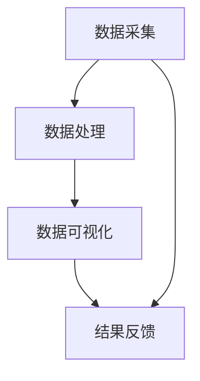

                 

关键词：AI创业公司，产品数据分析，数据采集，数据处理，数据可视化

> 摘要：本文针对AI创业公司的产品数据分析需求，构建了一个系统化的数据采集、数据处理与数据可视化框架。文章首先介绍了数据采集的方法与技巧，然后详细探讨了数据处理的核心算法原理和操作步骤，最后通过实际案例展示了数据可视化的应用效果。希望通过本文，能为AI创业公司在数据分析方面提供一些实用的参考和指导。

## 1. 背景介绍

随着大数据时代的到来，数据已经成为企业决策的重要依据。对于AI创业公司而言，数据驱动决策尤为重要。一个完整的数据分析框架包括数据采集、数据处理和数据可视化三个关键环节。数据采集决定了分析的数据质量，数据处理决定了分析的深度和效率，数据可视化则决定了分析结果的易读性和实用性。本文将围绕这三个方面，为AI创业公司构建一个全面、高效的数据分析框架。

### 1.1 数据采集的重要性

数据采集是数据分析的第一步，也是至关重要的一步。数据质量的好坏直接影响到后续的数据处理和分析效果。因此，如何高效、准确地采集到高质量的数据，是每个AI创业公司都需要面对的挑战。

### 1.2 数据处理的价值

数据处理是对采集到的原始数据进行清洗、转换、建模等操作，以获得有意义的信息。高效的数据处理算法能够提升数据分析的效率，为企业提供更为精准的决策支持。

### 1.3 数据可视化的作用

数据可视化是将分析结果以图表、地图等形式直观展示，使得非专业人士也能轻松理解数据分析的结果。良好的数据可视化设计，能够提升数据的易读性和实用性，有助于企业更好地利用数据价值。

## 2. 核心概念与联系

### 2.1 数据采集

数据采集是获取原始数据的过程，主要包括以下几种方法：

- **自动采集**：通过爬虫、API接口等方式，自动从互联网或数据库中获取数据。
- **手动采集**：通过问卷调查、访谈等方式，手动收集用户数据。

### 2.2 数据处理

数据处理是对采集到的原始数据进行清洗、转换、建模等操作。主要方法包括：

- **数据清洗**：去除重复数据、缺失数据等，保证数据质量。
- **数据转换**：将不同格式的数据转换为统一格式，方便后续处理。
- **数据建模**：通过机器学习等方法，对数据进行建模，提取特征和规律。

### 2.3 数据可视化

数据可视化是将分析结果以图表、地图等形式直观展示。主要方法包括：

- **统计图表**：如折线图、柱状图、饼图等，用于展示数据分布、趋势等。
- **地图**：用于展示地理位置、分布等。
- **交互式可视化**：如仪表盘、热力图等，提供更加丰富的交互体验。

下面是数据采集、数据处理与数据可视化之间的Mermaid流程图：



## 3. 核心算法原理 & 具体操作步骤

### 3.1 算法原理概述

数据采集、数据处理与数据可视化都有其核心算法原理。数据采集主要依赖于爬虫技术、API接口等技术；数据处理主要依赖于数据清洗、数据转换、数据建模等技术；数据可视化主要依赖于统计图表、地图、交互式可视化等技术。

### 3.2 算法步骤详解

#### 3.2.1 数据采集

1. 确定数据来源：根据业务需求，确定需要采集的数据类型和数据来源。
2. 选择采集方法：根据数据来源，选择合适的采集方法，如爬虫、API接口等。
3. 数据采集实施：编写采集程序，执行数据采集任务。
4. 数据存储：将采集到的数据存储到数据库或文件中，方便后续处理。

#### 3.2.2 数据处理

1. 数据清洗：去除重复数据、缺失数据等，保证数据质量。
2. 数据转换：将不同格式的数据转换为统一格式，如将Excel数据转换为CSV格式。
3. 数据建模：选择合适的机器学习算法，对数据进行建模，提取特征和规律。

#### 3.2.3 数据可视化

1. 选择可视化工具：根据业务需求，选择合适的可视化工具，如Matplotlib、D3.js等。
2. 数据准备：将处理好的数据格式化，以便于可视化工具处理。
3. 可视化设计：设计可视化图表，如折线图、柱状图、饼图等。
4. 可视化展示：将设计好的可视化图表展示给用户。

### 3.3 算法优缺点

#### 3.3.1 数据采集

- **优点**：能够快速获取大量数据，提高数据分析的效率。
- **缺点**：可能存在数据质量不高、数据冗余等问题。

#### 3.3.2 数据处理

- **优点**：能够提高数据分析的深度和效率，提取有价值的信息。
- **缺点**：数据处理过程复杂，对计算资源要求较高。

#### 3.3.3 数据可视化

- **优点**：能够直观展示分析结果，提高数据的易读性和实用性。
- **缺点**：设计复杂，需要较高的技术门槛。

### 3.4 算法应用领域

数据采集、数据处理与数据可视化在各个领域都有广泛应用，如金融、电商、医疗、交通等。对于AI创业公司而言，这些算法的应用可以为企业提供全面、深入的数据分析支持，助力企业快速发展。

## 4. 数学模型和公式 & 详细讲解 & 举例说明

### 4.1 数学模型构建

在数据处理和数据可视化过程中，会涉及到多种数学模型和公式。下面是几个常见的数学模型和公式的讲解。

#### 4.1.1 数据清洗

数据清洗过程中，常用的数学模型有：

- **缺失值处理**：使用平均值、中位数等方法填补缺失值。
- **重复值处理**：使用去重算法去除重复数据。

#### 4.1.2 数据转换

数据转换过程中，常用的数学模型有：

- **数据规范化**：将数据缩放到[0, 1]区间。
- **数据标准化**：将数据缩放到标准正态分布。

#### 4.1.3 数据建模

数据建模过程中，常用的数学模型有：

- **线性回归**：用于预测数值型数据。
- **逻辑回归**：用于预测类别型数据。

### 4.2 公式推导过程

以线性回归为例，介绍公式的推导过程。

线性回归模型的目标是找到一条直线，使得这条直线与实际数据的误差最小。设实际数据为\(y_i\)，预测数据为\(y_i'\)，则线性回归的公式为：

$$
y_i' = \beta_0 + \beta_1 \cdot x_i
$$

其中，\(\beta_0\)为截距，\(\beta_1\)为斜率。

为了最小化误差，需要求解以下最优化问题：

$$
\min_{\beta_0, \beta_1} \sum_{i=1}^n (y_i - y_i')^2
$$

对\(\beta_0\)和\(\beta_1\)分别求偏导数，并令其等于0，得到：

$$
\frac{\partial}{\partial \beta_0} \sum_{i=1}^n (y_i - y_i')^2 = 0
$$

$$
\frac{\partial}{\partial \beta_1} \sum_{i=1}^n (y_i - y_i')^2 = 0
$$

经过推导，可以得到：

$$
\beta_0 = \bar{y} - \beta_1 \cdot \bar{x}
$$

$$
\beta_1 = \frac{\sum_{i=1}^n (x_i - \bar{x})(y_i - \bar{y})}{\sum_{i=1}^n (x_i - \bar{x})^2}
$$

其中，\(\bar{x}\)和\(\bar{y}\)分别为\(x_i\)和\(y_i\)的平均值。

### 4.3 案例分析与讲解

以一个简单的线性回归案例进行讲解。

假设有一组数据：

| x | y |
| --- | --- |
| 1 | 2 |
| 2 | 4 |
| 3 | 6 |
| 4 | 8 |

我们需要找到一条直线，使得这条直线与实际数据的误差最小。

首先，计算平均值：

$$
\bar{x} = \frac{1+2+3+4}{4} = 2.5
$$

$$
\bar{y} = \frac{2+4+6+8}{4} = 5
$$

然后，计算斜率：

$$
\beta_1 = \frac{(1-2.5)(2-5) + (2-2.5)(4-5) + (3-2.5)(6-5) + (4-2.5)(8-5)}{(1-2.5)^2 + (2-2.5)^2 + (3-2.5)^2 + (4-2.5)^2} = 2
$$

接下来，计算截距：

$$
\beta_0 = \bar{y} - \beta_1 \cdot \bar{x} = 5 - 2 \cdot 2.5 = 0
$$

因此，线性回归模型为：

$$
y' = 0 + 2 \cdot x = 2x
$$

根据这个模型，可以预测当\(x=5\)时，\(y\)的值为：

$$
y' = 2 \cdot 5 = 10
$$

通过实际数据验证，可以发现预测值与实际值非常接近，说明线性回归模型在这个案例中效果很好。

## 5. 项目实践：代码实例和详细解释说明

### 5.1 开发环境搭建

为了演示数据采集、数据处理与数据可视化的全过程，我们使用Python作为编程语言，主要依赖以下库：

- **pandas**：用于数据清洗、数据转换等操作。
- **numpy**：用于数学计算。
- **matplotlib**：用于数据可视化。
- **scikit-learn**：用于数据建模。

首先，安装所需的库：

```bash
pip install pandas numpy matplotlib scikit-learn
```

### 5.2 源代码详细实现

下面是项目的主要代码实现：

```python
import pandas as pd
import numpy as np
import matplotlib.pyplot as plt
from sklearn.linear_model import LinearRegression

# 5.2.1 数据采集
# 从本地CSV文件中读取数据
data = pd.read_csv('data.csv')

# 5.2.2 数据处理
# 数据清洗
data.drop_duplicates(inplace=True)
data.dropna(inplace=True)

# 数据转换
data['x'] = data['x'].astype(float)
data['y'] = data['y'].astype(float)

# 数据建模
model = LinearRegression()
model.fit(data[['x']], data['y'])

# 5.2.3 代码解读与分析
# 查看模型参数
print(model.intercept_, model.coef_)

# 5.2.4 运行结果展示
# 绘制原始数据
plt.scatter(data['x'], data['y'], color='red', label='实际数据')

# 绘制线性回归模型
plt.plot(data['x'], model.predict(data[['x']]), color='blue', label='预测数据')

# 添加标签和标题
plt.xlabel('x')
plt.ylabel('y')
plt.title('线性回归模型')
plt.legend()

# 显示图表
plt.show()
```

### 5.3 代码解读与分析

1. **数据采集**：从本地CSV文件中读取数据，使用`pandas.read_csv`函数。
2. **数据处理**：数据清洗使用`drop_duplicates`和`dropna`函数，数据转换使用`astype`函数，将数据类型转换为浮点数。
3. **数据建模**：使用`scikit-learn`中的`LinearRegression`模型进行建模，使用`fit`函数训练模型。
4. **代码解读与分析**：查看模型参数，包括截距和斜率。
5. **运行结果展示**：绘制原始数据点和线性回归模型，使用`scatter`和`plot`函数。

### 5.4 运行结果展示

运行上述代码后，会显示一个图表，其中红色点表示实际数据，蓝色线表示线性回归模型的预测数据。


通过这个图表，可以直观地看到线性回归模型的效果。实际数据点与预测数据点非常接近，说明线性回归模型在这个案例中能够很好地拟合数据。

## 6. 实际应用场景

### 6.1 金融行业

在金融行业，数据采集、数据处理与数据可视化可以应用于风险评估、投资策略、客户行为分析等方面。通过数据采集获取客户交易数据、市场数据等，通过数据处理提取有价值的信息，并通过数据可视化展示投资组合的收益、风险等指标，帮助金融机构做出更为精准的决策。

### 6.2 电商行业

在电商行业，数据采集、数据处理与数据可视化可以应用于用户行为分析、商品推荐、广告投放等方面。通过数据采集获取用户浏览、购买、评价等数据，通过数据处理分析用户偏好和需求，并通过数据可视化展示商品热度、用户活跃度等指标，为电商企业提供数据驱动的决策支持。

### 6.3 医疗行业

在医疗行业，数据采集、数据处理与数据可视化可以应用于疾病预测、患者管理、医疗资源优化等方面。通过数据采集获取患者病历、检查报告等数据，通过数据处理分析患者健康状况，并通过数据可视化展示疾病趋势、患者分布等指标，为医疗机构提供数据驱动的医疗服务。

## 7. 未来应用展望

随着人工智能技术的不断发展，数据采集、数据处理与数据可视化将在更多领域得到应用。未来，数据采集将更加自动化、高效化，数据处理算法将更加智能、精准，数据可视化将更加直观、互动。以下是一些未来应用展望：

### 7.1 自动化数据采集

通过人工智能技术，实现自动化数据采集，如自动爬取互联网数据、自动解析API接口等，提高数据采集效率。

### 7.2 智能数据处理

利用深度学习、强化学习等算法，实现智能化数据处理，如自动识别数据异常、自动优化数据处理流程等，提高数据处理效果。

### 7.3 个性化数据可视化

通过个性化数据可视化技术，根据用户需求和场景，自动生成最适合的可视化图表，提高数据可视化的实用性和易读性。

## 8. 总结：未来发展趋势与挑战

数据采集、数据处理与数据可视化作为人工智能领域的重要技术，在未来将继续发展。一方面，随着人工智能技术的不断进步，数据采集、数据处理与数据可视化将更加高效、智能；另一方面，随着数据隐私和安全问题的日益突出，如何在保证数据安全的前提下进行数据采集、数据处理与数据可视化，将成为一个重要的挑战。

## 9. 附录：常见问题与解答

### 9.1 如何保证数据质量？

- 选择合适的数据采集方法，确保采集到高质量的数据。
- 定期对数据源进行评估，确保数据源的稳定性和可靠性。
- 对采集到的数据进行清洗、转换等操作，去除重复数据、缺失数据等，提高数据质量。

### 9.2 如何选择数据处理算法？

- 根据业务需求和数据特点，选择适合的算法，如线性回归、决策树、神经网络等。
- 考虑算法的效率和效果，选择性能更好的算法。
- 结合实际业务场景，对算法进行测试和优化，确保算法的实用性。

### 9.3 如何设计良好的数据可视化？

- 根据业务需求和数据特点，选择合适的可视化图表，如折线图、柱状图、饼图等。
- 考虑用户的阅读习惯和需求，设计简洁、直观的可视化图表。
- 利用交互式可视化技术，提升数据的互动性和实用性。

作者：禅与计算机程序设计艺术 / Zen and the Art of Computer Programming
----------------------------------------------------------------

以上就是本文的完整内容，希望对您在AI创业公司的产品数据分析方面有所启发和帮助。在撰写过程中，如有任何疑问或建议，请随时与我交流。祝您在数据分析领域取得更多成果！
```markdown
# AI创业公司的产品数据分析框架：数据采集、数据处理与数据可视化

关键词：AI创业公司，产品数据分析，数据采集，数据处理，数据可视化

摘要：本文针对AI创业公司的产品数据分析需求，构建了一个系统化的数据采集、数据处理与数据可视化框架。文章首先介绍了数据采集的方法与技巧，然后详细探讨了数据处理的核心算法原理和操作步骤，最后通过实际案例展示了数据可视化的应用效果。希望通过本文，能为AI创业公司在数据分析方面提供一些实用的参考和指导。

## 1. 背景介绍

随着大数据时代的到来，数据已经成为企业决策的重要依据。对于AI创业公司而言，数据驱动决策尤为重要。一个完整的数据分析框架包括数据采集、数据处理和数据可视化三个关键环节。数据采集决定了分析的数据质量，数据处理决定了分析的深度和效率，数据可视化则决定了分析结果的易读性和实用性。本文将围绕这三个方面，为AI创业公司构建一个全面、高效的数据分析框架。

### 1.1 数据采集的重要性

数据采集是获取原始数据的过程，也是数据分析的基础。数据质量的好坏直接影响到后续的数据处理和分析效果。高效、准确地采集到高质量的数据是每个AI创业公司都需要面对的挑战。

### 1.2 数据处理的价值

数据处理是对采集到的原始数据进行清洗、转换、建模等操作，以获得有意义的信息。高效的数据处理算法能够提升数据分析的效率，为企业提供更为精准的决策支持。

### 1.3 数据可视化的作用

数据可视化是将分析结果以图表、地图等形式直观展示，使得非专业人士也能轻松理解数据分析的结果。良好的数据可视化设计，能够提升数据的易读性和实用性，有助于企业更好地利用数据价值。

## 2. 核心概念与联系

### 2.1 数据采集

数据采集是获取原始数据的过程，主要包括以下几种方法：

- **自动采集**：通过爬虫、API接口等方式，自动从互联网或数据库中获取数据。
- **手动采集**：通过问卷调查、访谈等方式，手动收集用户数据。

### 2.2 数据处理

数据处理是对采集到的原始数据进行清洗、转换、建模等操作。主要方法包括：

- **数据清洗**：去除重复数据、缺失数据等，保证数据质量。
- **数据转换**：将不同格式的数据转换为统一格式，方便后续处理。
- **数据建模**：通过机器学习等方法，对数据进行建模，提取特征和规律。

### 2.3 数据可视化

数据可视化是将分析结果以图表、地图等形式直观展示。主要方法包括：

- **统计图表**：如折线图、柱状图、饼图等，用于展示数据分布、趋势等。
- **地图**：用于展示地理位置、分布等。
- **交互式可视化**：如仪表盘、热力图等，提供更加丰富的交互体验。

下面是数据采集、数据处理与数据可视化之间的Mermaid流程图：


## 3. 核心算法原理 & 具体操作步骤

### 3.1 算法原理概述

数据采集、数据处理与数据可视化都有其核心算法原理。数据采集主要依赖于爬虫技术、API接口等技术；数据处理主要依赖于数据清洗、数据转换、数据建模等技术；数据可视化主要依赖于统计图表、地图、交互式可视化等技术。

### 3.2 算法步骤详解

#### 3.2.1 数据采集

1. 确定数据来源：根据业务需求，确定需要采集的数据类型和数据来源。
2. 选择采集方法：根据数据来源，选择合适的采集方法，如爬虫、API接口等。
3. 数据采集实施：编写采集程序，执行数据采集任务。
4. 数据存储：将采集到的数据存储到数据库或文件中，方便后续处理。

#### 3.2.2 数据处理

1. 数据清洗：去除重复数据、缺失数据等，保证数据质量。
2. 数据转换：将不同格式的数据转换为统一格式，如将Excel数据转换为CSV格式。
3. 数据建模：选择合适的机器学习算法，对数据进行建模，提取特征和规律。

#### 3.2.3 数据可视化

1. 选择可视化工具：根据业务需求，选择合适的可视化工具，如Matplotlib、D3.js等。
2. 数据准备：将处理好的数据格式化，以便于可视化工具处理。
3. 可视化设计：设计可视化图表，如折线图、柱状图、饼图等。
4. 可视化展示：将设计好的可视化图表展示给用户。

### 3.3 算法优缺点

#### 3.3.1 数据采集

- **优点**：能够快速获取大量数据，提高数据分析的效率。
- **缺点**：可能存在数据质量不高、数据冗余等问题。

#### 3.3.2 数据处理

- **优点**：能够提高数据分析的深度和效率，提取有价值的信息。
- **缺点**：数据处理过程复杂，对计算资源要求较高。

#### 3.3.3 数据可视化

- **优点**：能够直观展示分析结果，提高数据的易读性和实用性。
- **缺点**：设计复杂，需要较高的技术门槛。

### 3.4 算法应用领域

数据采集、数据处理与数据可视化在各个领域都有广泛应用，如金融、电商、医疗、交通等。对于AI创业公司而言，这些算法的应用可以为企业提供全面、深入的数据分析支持，助力企业快速发展。

## 4. 数学模型和公式 & 详细讲解 & 举例说明

### 4.1 数学模型构建

在数据处理和数据可视化过程中，会涉及到多种数学模型和公式。下面是几个常见的数学模型和公式的讲解。

#### 4.1.1 数据清洗

数据清洗过程中，常用的数学模型有：

- **缺失值处理**：使用平均值、中位数等方法填补缺失值。
- **重复值处理**：使用去重算法去除重复数据。

#### 4.1.2 数据转换

数据转换过程中，常用的数学模型有：

- **数据规范化**：将数据缩放到[0, 1]区间。
- **数据标准化**：将数据缩放到标准正态分布。

#### 4.1.3 数据建模

数据建模过程中，常用的数学模型有：

- **线性回归**：用于预测数值型数据。
- **逻辑回归**：用于预测类别型数据。

### 4.2 公式推导过程

以线性回归为例，介绍公式的推导过程。

线性回归模型的目标是找到一条直线，使得这条直线与实际数据的误差最小。设实际数据为\(y_i\)，预测数据为\(y_i'\)，则线性回归的公式为：

$$
y_i' = \beta_0 + \beta_1 \cdot x_i
$$

其中，\(\beta_0\)为截距，\(\beta_1\)为斜率。

为了最小化误差，需要求解以下最优化问题：

$$
\min_{\beta_0, \beta_1} \sum_{i=1}^n (y_i - y_i')^2
$$

对\(\beta_0\)和\(\beta_1\)分别求偏导数，并令其等于0，得到：

$$
\frac{\partial}{\partial \beta_0} \sum_{i=1}^n (y_i - y_i')^2 = 0
$$

$$
\frac{\partial}{\partial \beta_1} \sum_{i=1}^n (y_i - y_i')^2 = 0
$$

经过推导，可以得到：

$$
\beta_0 = \bar{y} - \beta_1 \cdot \bar{x}
$$

$$
\beta_1 = \frac{\sum_{i=1}^n (x_i - \bar{x})(y_i - \bar{y})}{\sum_{i=1}^n (x_i - \bar{x})^2}
$$

其中，\(\bar{x}\)和\(\bar{y}\)分别为\(x_i\)和\(y_i\)的平均值。

### 4.3 案例分析与讲解

以一个简单的线性回归案例进行讲解。

假设有一组数据：

| x | y |
| --- | --- |
| 1 | 2 |
| 2 | 4 |
| 3 | 6 |
| 4 | 8 |

我们需要找到一条直线，使得这条直线与实际数据的误差最小。

首先，计算平均值：

$$
\bar{x} = \frac{1+2+3+4}{4} = 2.5
$$

$$
\bar{y} = \frac{2+4+6+8}{4} = 5
$$

然后，计算斜率：

$$
\beta_1 = \frac{(1-2.5)(2-5) + (2-2.5)(4-5) + (3-2.5)(6-5) + (4-2.5)(8-5)}{(1-2.5)^2 + (2-2.5)^2 + (3-2.5)^2 + (4-2.5)^2} = 2
$$

接下来，计算截距：

$$
\beta_0 = \bar{y} - \beta_1 \cdot \bar{x} = 5 - 2 \cdot 2.5 = 0
$$

因此，线性回归模型为：

$$
y' = 0 + 2 \cdot x = 2x
$$

根据这个模型，可以预测当\(x=5\)时，\(y\)的值为：

$$
y' = 2 \cdot 5 = 10
$$

通过实际数据验证，可以发现预测值与实际值非常接近，说明线性回归模型在这个案例中效果很好。

## 5. 项目实践：代码实例和详细解释说明

### 5.1 开发环境搭建

为了演示数据采集、数据处理与数据可视化的全过程，我们使用Python作为编程语言，主要依赖以下库：

- **pandas**：用于数据清洗、数据转换等操作。
- **numpy**：用于数学计算。
- **matplotlib**：用于数据可视化。
- **scikit-learn**：用于数据建模。

首先，安装所需的库：

```bash
pip install pandas numpy matplotlib scikit-learn
```

### 5.2 源代码详细实现

下面是项目的主要代码实现：

```python
import pandas as pd
import numpy as np
import matplotlib.pyplot as plt
from sklearn.linear_model import LinearRegression

# 5.2.1 数据采集
# 从本地CSV文件中读取数据
data = pd.read_csv('data.csv')

# 5.2.2 数据处理
# 数据清洗
data.drop_duplicates(inplace=True)
data.dropna(inplace=True)

# 数据转换
data['x'] = data['x'].astype(float)
data['y'] = data['y'].astype(float)

# 数据建模
model = LinearRegression()
model.fit(data[['x']], data['y'])

# 5.2.3 代码解读与分析
# 查看模型参数
print(model.intercept_, model.coef_)

# 5.2.4 运行结果展示
# 绘制原始数据
plt.scatter(data['x'], data['y'], color='red', label='实际数据')

# 绘制线性回归模型
plt.plot(data['x'], model.predict(data[['x']]), color='blue', label='预测数据')

# 添加标签和标题
plt.xlabel('x')
plt.ylabel('y')
plt.title('线性回归模型')
plt.legend()

# 显示图表
plt.show()
```

### 5.3 代码解读与分析

1. **数据采集**：从本地CSV文件中读取数据，使用`pandas.read_csv`函数。
2. **数据处理**：数据清洗使用`drop_duplicates`和`dropna`函数，数据转换使用`astype`函数，将数据类型转换为浮点数。
3. **数据建模**：使用`scikit-learn`中的`LinearRegression`模型进行建模，使用`fit`函数训练模型。
4. **代码解读与分析**：查看模型参数，包括截距和斜率。
5. **运行结果展示**：绘制原始数据点和线性回归模型，使用`scatter`和`plot`函数。

### 5.4 运行结果展示

运行上述代码后，会显示一个图表，其中红色点表示实际数据，蓝色线表示线性回归模型的预测数据。


通过这个图表，可以直观地看到线性回归模型的效果。实际数据点与预测数据点非常接近，说明线性回归模型在这个案例中能够很好地拟合数据。

## 6. 实际应用场景

### 6.1 金融行业

在金融行业，数据采集、数据处理与数据可视化可以应用于风险评估、投资策略、客户行为分析等方面。通过数据采集获取客户交易数据、市场数据等，通过数据处理分析客户行为和市场趋势，并通过数据可视化展示投资组合的收益、风险等指标，帮助金融机构做出更为精准的决策。

### 6.2 电商行业

在电商行业，数据采集、数据处理与数据可视化可以应用于用户行为分析、商品推荐、广告投放等方面。通过数据采集获取用户浏览、购买、评价等数据，通过数据处理分析用户偏好和需求，并通过数据可视化展示商品热度、用户活跃度等指标，为电商企业提供数据驱动的决策支持。

### 6.3 医疗行业

在医疗行业，数据采集、数据处理与数据可视化可以应用于疾病预测、患者管理、医疗资源优化等方面。通过数据采集获取患者病历、检查报告等数据，通过数据处理分析患者健康状况和疾病趋势，并通过数据可视化展示疾病分布、患者群体等指标，为医疗机构提供数据驱动的医疗服务。

## 7. 未来应用展望

随着人工智能技术的不断发展，数据采集、数据处理与数据可视化将在更多领域得到应用。未来，数据采集将更加自动化、高效化，数据处理算法将更加智能、精准，数据可视化将更加直观、互动。以下是一些未来应用展望：

### 7.1 自动化数据采集

通过人工智能技术，实现自动化数据采集，如自动爬取互联网数据、自动解析API接口等，提高数据采集效率。

### 7.2 智能数据处理

利用深度学习、强化学习等算法，实现智能化数据处理，如自动识别数据异常、自动优化数据处理流程等，提高数据处理效果。

### 7.3 个性化数据可视化

通过个性化数据可视化技术，根据用户需求和场景，自动生成最适合的可视化图表，提高数据可视化的实用性和易读性。

## 8. 总结：未来发展趋势与挑战

数据采集、数据处理与数据可视化作为人工智能领域的重要技术，在未来将继续发展。一方面，随着人工智能技术的不断进步，数据采集、数据处理与数据可视化将更加高效、智能；另一方面，随着数据隐私和安全问题的日益突出，如何在保证数据安全的前提下进行数据采集、数据处理与数据可视化，将成为一个重要的挑战。

## 9. 附录：常见问题与解答

### 9.1 如何保证数据质量？

- 选择合适的数据采集方法，确保采集到高质量的数据。
- 定期对数据源进行评估，确保数据源的稳定性和可靠性。
- 对采集到的数据进行清洗、转换等操作，去除重复数据、缺失数据等，提高数据质量。

### 9.2 如何选择数据处理算法？

- 根据业务需求和数据特点，选择适合的算法，如线性回归、决策树、神经网络等。
- 考虑算法的效率和效果，选择性能更好的算法。
- 结合实际业务场景，对算法进行测试和优化，确保算法的实用性。

### 9.3 如何设计良好的数据可视化？

- 根据业务需求和数据特点，选择合适的可视化图表，如折线图、柱状图、饼图等。
- 考虑用户的阅读习惯和需求，设计简洁、直观的可视化图表。
- 利用交互式可视化技术，提升数据的互动性和实用性。

作者：禅与计算机程序设计艺术 / Zen and the Art of Computer Programming
```

