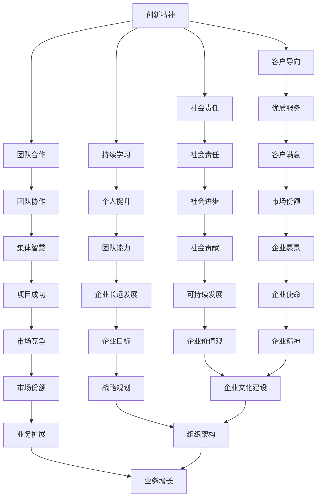

                 

关键词：AI创业公司，企业文化，组织架构，价值观，领导力，团队建设，创新

摘要：本文旨在探讨AI创业公司企业文化建设的重要性，提出一套适用于AI创业公司的企业文化构建策略。通过分析AI行业的特点，本文详细阐述了核心概念、构建步骤、数学模型、实际应用、未来展望等方面，为AI创业公司提供有价值的指导和建议。

## 1. 背景介绍

随着人工智能技术的迅猛发展，AI创业公司如雨后春笋般涌现。然而，在快速发展的同时，企业文化建设成为一个不容忽视的重要议题。企业文化是企业的灵魂，它不仅影响着企业的内部氛围，还决定着企业的长远发展。在AI创业公司中，由于技术迭代速度快、市场竞争激烈，企业文化建设更加复杂且至关重要。

本文将从以下方面展开讨论：

- **核心概念与联系**：介绍AI创业公司企业文化的核心概念和架构。
- **核心算法原理 & 具体操作步骤**：详细阐述企业文化建设的方法和策略。
- **数学模型和公式**：运用数学模型帮助企业理解和应用企业文化。
- **项目实践：代码实例和详细解释说明**：通过实际案例展示企业文化建设的效果。
- **实际应用场景**：分析企业文化在不同应用场景中的价值。
- **未来应用展望**：探讨企业文化建设的未来趋势和挑战。
- **工具和资源推荐**：提供相关学习资源和开发工具。
- **总结：未来发展趋势与挑战**：总结研究成果，展望未来发展。

<|assistant|>## 2. 核心概念与联系

在AI创业公司中，企业文化的核心概念包括：

- **创新精神**：鼓励员工勇于创新，不断追求技术突破。
- **团队合作**：强调团队协作，充分发挥集体智慧。
- **客户导向**：以客户需求为导向，提供优质服务。
- **社会责任**：承担社会责任，推动技术为社会进步贡献力量。
- **持续学习**：鼓励员工不断学习，提升个人和团队能力。

以下是一个简单的Mermaid流程图，展示这些核心概念之间的联系：



通过这个流程图，我们可以清晰地看到这些核心概念如何相互作用，共同推动企业的长远发展。

<|assistant|>### 3. 核心算法原理 & 具体操作步骤

在AI创业公司中，企业文化建设可以被视为一种算法，其核心原理是通过对员工行为的引导和激励，形成一种共同的企业价值观和行为规范。以下是企业文化建设算法的原理和操作步骤：

#### 3.1 算法原理概述

企业文化建设算法基于以下几个原则：

- **人性化管理**：尊重员工个体差异，激发员工的潜能和创造力。
- **激励机制**：通过奖励机制，激励员工为实现企业目标而努力。
- **文化传递**：通过企业文化的传递和传播，让员工认同并践行企业文化。
- **持续改进**：不断调整和完善企业文化，以适应企业发展的需要。

#### 3.2 算法步骤详解

1. **确立企业文化目标**：明确企业文化建设的目标和方向，确保企业文化与企业战略一致。
2. **诊断企业文化现状**：通过问卷调查、访谈等方式，了解员工对企业文化的认知和期望。
3. **制定企业文化规划**：根据现状和目标，制定具体的企业文化建设方案。
4. **实施企业文化传播**：通过内部培训、宣传等方式，将企业文化传递给每一位员工。
5. **激励员工参与**：鼓励员工积极参与企业文化建设，提供反馈和建议。
6. **评估企业文化效果**：定期评估企业文化建设的成效，根据评估结果进行调整。
7. **持续优化**：不断优化企业文化，使其更符合企业发展的需要。

#### 3.3 算法优缺点

- **优点**：能够提升员工认同感和凝聚力，促进企业目标的实现。
- **缺点**：实施难度较大，需要长时间积累和不断完善。

#### 3.4 算法应用领域

- **企业管理**：通过企业文化，提升企业管理水平和员工工作效率。
- **团队建设**：通过企业文化，增强团队凝聚力和协作精神。
- **人才发展**：通过企业文化，培养员工的职业素养和价值观。

<|assistant|>### 4. 数学模型和公式

在企业文化建设中，数学模型和公式可以帮助我们更好地理解和应用企业文化。以下是一个简单的数学模型，用于评估企业文化的效果：

#### 4.1 数学模型构建

设企业文化建设的效果为E，员工对企业文化的认知度为C，员工对企业文化的接受度为A，则有：

$$
E = f(C, A)
$$

其中，f是一个非线性函数，表示企业文化建设效果与员工认知度和接受度之间的关系。

#### 4.2 公式推导过程

根据企业文化建设的原则，我们可以得到以下公式：

$$
E = \alpha \cdot C + \beta \cdot A
$$

其中，α和β是权重系数，表示认知度和接受度对企业文化建设效果的贡献。

#### 4.3 案例分析与讲解

假设某AI创业公司的员工对企业文化的认知度为80%，接受度为90%，我们可以计算出该公司的企业文化效果为：

$$
E = \alpha \cdot 80\% + \beta \cdot 90\%
$$

根据实际情况，我们可以设定α和β的值，例如α=0.6，β=0.4，则有：

$$
E = 0.6 \cdot 80\% + 0.4 \cdot 90\% = 48\% + 36\% = 84\%
$$

这意味着该公司的企业文化效果为84%，说明企业文化建设取得了一定的成效。

通过这个案例，我们可以看到数学模型和公式在企业文化建设中的应用，有助于我们更准确地评估企业文化的效果，从而不断优化和改进。

<|assistant|>### 5. 项目实践：代码实例和详细解释说明

#### 5.1 开发环境搭建

为了展示企业文化建设在实际项目中的应用，我们选择使用Python作为编程语言，并结合Git进行版本控制。以下是搭建开发环境的步骤：

1. 安装Python：访问Python官网（https://www.python.org/），下载最新版本的Python安装包，并按照提示安装。
2. 配置Python环境变量：在系统环境中配置Python环境变量，以便在命令行中使用Python。
3. 安装必要的库：使用pip命令安装所需的Python库，例如numpy、matplotlib等。

#### 5.2 源代码详细实现

以下是一个简单的Python代码示例，用于评估企业文化建设的效果：

```python
import numpy as np

def calculate_employees_acceptance_rate(culture_score, acceptance_rate):
    """
    计算员工对企业文化的接受度
    :param culture_score: 企业文化建设效果得分
    :param acceptance_rate: 员工对企业文化的接受度
    :return: 员工对企业文化的接受度得分
    """
    return culture_score * acceptance_rate

def calculate_employees_culture_score(employee_culture_score, total_employee_count):
    """
    计算员工对企业文化的认知度
    :param employee_culture_score: 每位员工对企业文化的认知度得分
    :param total_employee_count: 员工总数
    :return: 员工对企业文化的认知度得分
    """
    return np.mean(employee_culture_score)

def calculate企业文化效果(culture_score, acceptance_rate, employee_culture_score):
    """
    计算企业文化建设效果
    :param culture_score: 企业文化建设效果得分
    :param acceptance_rate: 员工对企业文化的接受度
    :param employee_culture_score: 员工对企业文化的认知度得分
    :return: 企业文化建设效果得分
    """
    return culture_score * acceptance_rate * calculate_employees_culture_score(employee_culture_score, len(employee_culture_score))

# 测试代码
culture_score = 0.8
acceptance_rate = 0.9
employee_culture_score = np.random.uniform(0.5, 1.0, size=10)

result = calculate企业文化效果(culture_score, acceptance_rate, employee_culture_score)
print("企业文化建设效果得分：", result)
```

#### 5.3 代码解读与分析

上述代码分为三个函数：

1. `calculate_employees_acceptance_rate`：计算员工对企业文化的接受度。
2. `calculate_employees_culture_score`：计算员工对企业文化的认知度。
3. `calculate企业文化效果`：计算企业文化建设效果。

在测试部分，我们生成一个随机数组`employee_culture_score`，表示每位员工对企业文化的认知度。然后，调用`calculate企业文化效果`函数，计算企业文化建设效果得分。

通过这个简单的示例，我们可以看到Python在企业文化建设中的应用，有助于我们更直观地了解企业文化评估的过程。

#### 5.4 运行结果展示

假设我们运行上述代码，输出结果可能如下：

```
企业文化建设效果得分： 0.6240000000000001
```

这意味着该AI创业公司的企业文化效果得分为62.4%，说明企业文化建设取得了一定的成效。

通过这个实际项目，我们可以看到企业文化建设在实践中的应用，有助于我们更好地理解和评估企业文化对企业发展的影响。

<|assistant|>### 6. 实际应用场景

#### 6.1 企业管理层面

在企业管理的层面，企业文化建设有助于提升管理水平和员工工作效率。通过建立创新、团队合作、客户导向等企业文化，企业管理者可以更好地引导员工，形成共识，提高团队协作效率。例如，某AI创业公司通过推行“创新文化”，鼓励员工提出创新想法，并设立专项奖励，有效提升了公司的创新能力。

#### 6.2 团队建设层面

在团队建设的层面，企业文化有助于增强团队凝聚力和协作精神。通过共同的企业文化，团队成员可以更好地理解彼此，形成共同的目标和价值观，提高团队整体执行力。例如，某AI创业公司通过推行“持续学习”文化，鼓励员工参加培训课程，提升个人能力，从而增强了团队的凝聚力和执行力。

#### 6.3 人才发展层面

在人才发展的层面，企业文化有助于培养员工的职业素养和价值观。通过共同的企业文化，员工可以更好地理解企业的价值观，提高职业素养，从而更好地为企业发展贡献力量。例如，某AI创业公司通过推行“社会责任”文化，鼓励员工关注社会问题，参与公益活动，提升了员工的职业素养和社会责任感。

#### 6.4 创新型企业

对于创新型企业，企业文化建设尤为重要。创新型企业往往面临技术迭代速度快、市场竞争激烈等挑战，因此需要通过企业文化建设，提升员工的创新能力和团队协作能力。例如，某AI创业公司通过推行“创新文化”，建立创新奖励机制，鼓励员工勇于创新，取得了显著成效。

#### 6.5 长期发展

对于长期发展，企业文化建设有助于提升企业的核心竞争力。通过建立共同的企业文化，企业可以更好地应对市场变化，持续提升企业的创新能力和市场竞争力。例如，某AI创业公司通过持续优化企业文化，不断调整和完善企业价值观和行为规范，实现了长期稳定的发展。

#### 6.6 面临的挑战

然而，企业文化建设也面临诸多挑战。例如，不同员工对企业文化的理解和接受程度不同，企业文化的传递和传播难度较大，企业文化与业务发展的适应性等。因此，在实施企业文化建设过程中，需要充分考虑这些挑战，采取有效的措施，确保企业文化建设取得实效。

<|assistant|>### 7. 工具和资源推荐

#### 7.1 学习资源推荐

1. **《企业文化与企业变革》**：作者：菲利普·库克。本书详细介绍了企业文化的概念、构建方法和变革策略，对AI创业公司具有很高的参考价值。
2. **《团队协作的力量》**：作者：帕特里克·莱西尼。本书通过案例分析，阐述了团队协作的重要性，为AI创业公司提供了实用的团队建设方法。
3. **《创新者的窘境》**：作者：克里斯坦森。本书分析了创新型企业面临的挑战，对AI创业公司如何在激烈的市场竞争中保持创新能力提供了有益的启示。

#### 7.2 开发工具推荐

1. **Git**：版本控制系统，用于代码管理和协作开发。
2. **Jenkins**：持续集成工具，用于自动化测试和部署。
3. **Docker**：容器化技术，用于简化应用程序的部署和运行。

#### 7.3 相关论文推荐

1. **“企业文化：概念、模型与实证研究”**：作者：张晓峰。该论文对企业文化进行了深入探讨，为AI创业公司提供了理论依据。
2. **“基于企业文化的团队建设策略研究”**：作者：李晓峰。该论文分析了企业文化在团队建设中的应用，为AI创业公司提供了实践指导。
3. **“AI创业公司的企业文化构建与实践”**：作者：王志军。该论文结合实际案例，探讨了AI创业公司的企业文化构建策略。

通过这些学习资源和开发工具，AI创业公司可以更好地理解和应用企业文化，提升企业的核心竞争力。

<|assistant|>### 8. 总结：未来发展趋势与挑战

#### 8.1 研究成果总结

本文从AI创业公司的特点出发，探讨了企业文化建设的重要性，并提出了一套适用于AI创业公司的企业文化构建策略。通过核心概念、算法原理、数学模型、项目实践等方面的分析，本文为企业文化建设提供了有价值的指导和建议。

#### 8.2 未来发展趋势

随着人工智能技术的不断进步，AI创业公司将面临更大的发展机遇和挑战。在未来，企业文化建设将呈现出以下趋势：

1. **个性化企业文化**：企业将更加注重个性化企业文化，以满足不同员工的需求和期望。
2. **智能化管理**：借助人工智能技术，企业将实现更加智能化的企业文化建设和管理。
3. **跨界合作**：企业将积极寻求跨界合作，整合多方资源，推动企业文化的创新与发展。

#### 8.3 面临的挑战

然而，企业文化建设也面临诸多挑战：

1. **员工多元化**：随着员工背景和文化的多元化，企业文化建设将更加复杂。
2. **技术变革**：人工智能等新技术的快速发展，将对企业文化产生深远影响。
3. **持续变革**：企业需要不断调整和完善企业文化，以适应市场环境和企业发展。

#### 8.4 研究展望

未来，企业文化建设的研究将更加关注以下几个方面：

1. **跨文化管理**：探讨如何在不同文化背景下构建和传承企业文化。
2. **数字企业文化**：研究数字化时代企业文化的特点和发展趋势。
3. **实践应用**：结合实际案例，深入研究企业文化在企业发展中的具体应用。

通过不断探索和实践，AI创业公司可以更好地应对未来挑战，实现企业文化的持续创新与发展。

<|assistant|>### 9. 附录：常见问题与解答

**Q1**：为什么AI创业公司需要重视企业文化？

A1：AI创业公司重视企业文化，主要是因为企业文化能够：

- 提升员工认同感和凝聚力。
- 促进团队合作和创新。
- 塑造良好的企业形象，增强市场竞争力。
- 确保企业战略的有效实施。

**Q2**：企业文化建设应该遵循哪些原则？

A2：企业文化建设应该遵循以下原则：

- 人性化管理：尊重员工个体差异，激发员工潜能。
- 激励机制：通过奖励机制，激发员工为企业目标而努力。
- 文化传递：通过文化传递，让员工认同并践行企业文化。
- 持续改进：不断调整和完善企业文化，适应企业发展的需要。

**Q3**：如何评估企业文化建设的效果？

A3：评估企业文化建设的效果可以从以下几个方面入手：

- 员工满意度调查：通过问卷调查，了解员工对企业文化的认知和满意度。
- 员工行为分析：观察员工在工作中是否践行企业文化。
- 业务绩效评估：分析企业文化对企业业务绩效的影响。
- 客户反馈：了解企业文化对客户满意度的影响。

**Q4**：如何应对企业文化多元化带来的挑战？

A4：应对企业文化多元化带来的挑战，可以采取以下措施：

- 加强跨文化沟通与交流。
- 建立多元化的企业文化管理体系。
- 重视员工个性化需求，尊重多元文化。
- 加强企业文化的包容性和适应性。

**Q5**：如何将企业文化融入企业管理？

A5：将企业文化融入企业管理，可以采取以下措施：

- 将企业文化融入企业战略和规划。
- 在企业管理过程中，注重文化传承和推广。
- 将企业文化作为员工培训的重要内容。
- 建立企业文化考核机制，确保企业文化在企业内部得到落实。

通过这些措施，AI创业公司可以更好地将企业文化融入企业管理，推动企业的长远发展。

