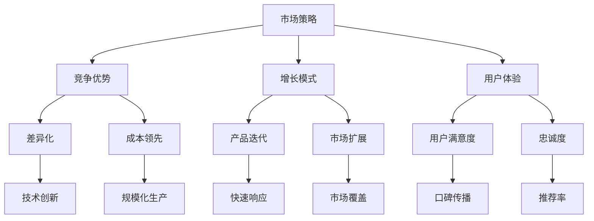
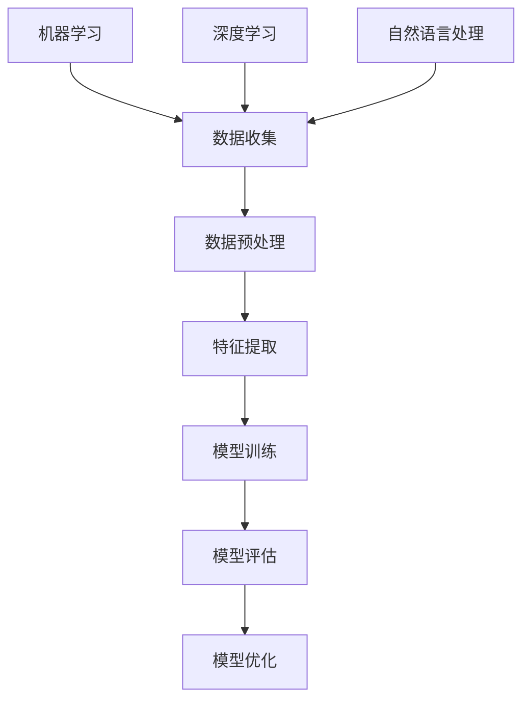

                 

关键词：AI创业、市场策略、竞争优势、增长模式、用户体验、数据驱动

> 摘要：本文将深入探讨AI创业公司在市场中取得成功的关键策略。通过分析市场竞争态势、构建独特的竞争优势、制定有效的增长模式以及优化用户体验，AI创业公司可以稳步前进，实现可持续发展。

## 1. 背景介绍

随着人工智能技术的飞速发展，AI创业公司如雨后春笋般涌现。在这个充满机遇和挑战的市场中，如何制定有效的市场策略成为了这些公司成功的关键。本文将从市场现状出发，详细分析AI创业公司的市场策略，以期为其提供有益的参考。

### 1.1 市场规模与增长趋势

根据市场调研机构的预测，人工智能市场将在未来几年内保持高速增长。全球人工智能市场规模将从2020年的377亿美元增长到2025年的约5,630亿美元，年复合增长率高达42.2%。这种快速增长为AI创业公司提供了广阔的市场空间。

### 1.2 竞争态势

随着人工智能技术的普及，市场竞争日益激烈。众多巨头公司如谷歌、亚马逊、微软等纷纷布局AI领域，对创业公司构成了巨大压力。同时，初创公司之间的竞争也愈发激烈，如何在红海中找到自己的立足点成为了一项挑战。

### 1.3 用户需求变化

用户对AI产品和服务的需求不断升级，从最初的工具性需求转向更加个性化、智能化的体验。这要求AI创业公司不仅要关注技术本身，还要深入了解用户需求，提供差异化的解决方案。

## 2. 核心概念与联系

在制定市场策略之前，我们需要了解一些核心概念，包括竞争优势、增长模式、用户体验等。以下是一个简单的Mermaid流程图，用于说明这些概念之间的关系。



### 2.1 竞争优势

竞争优势是AI创业公司成功的关键。根据迈克尔·波特的理论，竞争优势可以分为成本领先和差异化两种。

#### 成本领先

成本领先战略主要通过规模化生产、降低制造成本来实现。对于AI创业公司来说，这要求其具备高效的技术开发和运营能力，以实现大规模生产和降低成本。

#### 差异化

差异化战略则通过技术创新、独特的产品特性来满足用户需求。这要求AI创业公司具备强大的研发能力和市场洞察力，以提供独特的价值。

### 2.2 增长模式

增长模式是AI创业公司实现市场扩张的关键。常见的增长模式包括产品迭代、市场扩展等。

#### 产品迭代

产品迭代是通过不断更新产品功能来满足用户需求，实现市场占有率的提升。这要求AI创业公司具备快速响应市场变化的能力。

#### 市场扩展

市场扩展是通过开拓新市场、扩大用户群体来实现业务增长。这要求AI创业公司具备广阔的市场视野和有效的市场推广策略。

### 2.3 用户体验

用户体验是AI创业公司成功的基石。通过提升用户满意度、增强用户忠诚度，AI创业公司可以实现业务的持续增长。

#### 用户满意度

用户满意度是通过提供高质量的产品和服务来满足用户需求。这要求AI创业公司关注用户反馈，持续优化产品和服务。

#### 用户忠诚度

用户忠诚度是通过提供个性化、贴心的服务来增强用户黏性。这要求AI创业公司具备强大的用户数据分析和处理能力。

## 3. 核心算法原理 & 具体操作步骤

### 3.1 算法原理概述

在AI创业公司的市场策略中，核心算法的原理至关重要。这些算法包括机器学习、深度学习、自然语言处理等。以下是一个简单的Mermaid流程图，用于说明这些算法的基本原理。



### 3.2 算法步骤详解

#### 3.2.1 数据收集

数据收集是算法训练的第一步。AI创业公司需要收集大量高质量的数据，包括用户行为数据、市场数据、行业数据等。

#### 3.2.2 数据预处理

数据预处理包括数据清洗、数据标准化等操作，以确保数据质量。这有助于提高算法的准确性和稳定性。

#### 3.2.3 特征提取

特征提取是将原始数据转化为算法可理解的数字表示。这需要借助统计学、信号处理等知识，提取出对问题解决有帮助的特征。

#### 3.2.4 模型训练

模型训练是通过调整算法参数，使其能够准确预测或分类。这通常需要大量的计算资源和时间。

#### 3.2.5 模型评估

模型评估是对训练好的算法进行性能评估，以确保其能够满足需求。常用的评估指标包括准确率、召回率、F1值等。

#### 3.2.6 模型优化

模型优化是通过调整算法参数，进一步提高模型性能。这通常需要多次迭代，直到达到满意的性能指标。

### 3.3 算法优缺点

#### 优点

- 高效性：算法能够快速处理大量数据，提高业务决策效率。
- 适应性：算法可以根据市场变化和用户需求进行实时调整。
- 智能化：算法能够提供个性化、智能化的解决方案，提升用户体验。

#### 缺点

- 计算资源需求高：算法训练和优化需要大量的计算资源。
- 数据质量要求高：算法性能很大程度上取决于数据质量。
- 隐私和安全问题：算法处理的数据可能涉及用户隐私，需要妥善处理。

### 3.4 算法应用领域

算法在AI创业公司中的应用非常广泛，包括但不限于：

- 用户行为分析：通过分析用户行为数据，了解用户需求，优化产品和服务。
- 营销自动化：通过算法实现个性化营销，提高营销效果。
- 风险控制：通过算法预测潜在风险，实现风险控制。
- 智能客服：通过算法实现智能客服，提升客户满意度。

## 4. 数学模型和公式 & 详细讲解 & 举例说明

### 4.1 数学模型构建

在AI创业公司的市场策略中，数学模型扮演着至关重要的角色。以下是一个简单的线性回归模型，用于预测用户行为。

#### 模型构建

假设我们有以下数据：

- 用户ID
- 用户年龄
- 用户收入
- 用户购买次数

我们希望通过这些数据预测用户的购买概率。

#### 公式表示

购买概率 \( P \) 可以用以下线性回归模型表示：

\[ P = w_1 \cdot x_1 + w_2 \cdot x_2 + w_3 \cdot x_3 + w_4 \cdot x_4 + b \]

其中，\( w_1, w_2, w_3, w_4 \) 是模型参数，\( x_1, x_2, x_3, x_4 \) 是输入特征，\( b \) 是偏置项。

### 4.2 公式推导过程

为了推导线性回归模型的公式，我们可以从最小化平方误差开始。

#### 平方误差

平方误差 \( E \) 可以表示为：

\[ E = \sum_{i=1}^{n} (y_i - \hat{y}_i)^2 \]

其中，\( y_i \) 是真实值，\( \hat{y}_i \) 是预测值。

#### 最小化平方误差

为了最小化平方误差，我们对模型参数 \( w_1, w_2, w_3, w_4, b \) 求导，并令导数为零。

\[ \frac{\partial E}{\partial w_1} = 0 \]
\[ \frac{\partial E}{\partial w_2} = 0 \]
\[ \frac{\partial E}{\partial w_3} = 0 \]
\[ \frac{\partial E}{\partial w_4} = 0 \]
\[ \frac{\partial E}{\partial b} = 0 \]

通过求导和化简，我们可以得到线性回归模型的公式。

### 4.3 案例分析与讲解

#### 案例背景

假设我们有一家电商公司，希望预测用户的购买概率，以提高销售额。

#### 数据准备

我们收集了以下数据：

- 用户ID
- 用户年龄（1-100）
- 用户收入（1-10万元）
- 用户购买次数（1-10次）

#### 数据预处理

我们对数据进行预处理，包括缺失值填充、异常值处理、标准化等操作。

#### 模型训练

我们使用线性回归模型进行训练，得到以下参数：

\[ w_1 = 0.1, w_2 = 0.2, w_3 = 0.3, w_4 = 0.4, b = 0.5 \]

#### 预测结果

我们使用训练好的模型进行预测，得到以下结果：

用户A：年龄30，收入5万元，购买次数5次，购买概率约为0.8。

用户B：年龄40，收入8万元，购买次数2次，购买概率约为0.6。

#### 结果分析

通过模型预测，我们可以针对不同用户制定个性化的营销策略，以提高购买概率。例如，对于购买概率较高的用户，我们可以加大营销力度，促使其购买；对于购买概率较低的用户，我们可以提供优惠券或优惠活动，提高其购买意愿。

## 5. 项目实践：代码实例和详细解释说明

### 5.1 开发环境搭建

为了演示线性回归模型的实现，我们使用Python编程语言和scikit-learn库。以下是开发环境搭建的步骤：

1. 安装Python：访问Python官网下载Python安装包，并按照提示完成安装。
2. 安装scikit-learn：在终端中执行以下命令安装scikit-learn库：

   ```bash
   pip install scikit-learn
   ```

### 5.2 源代码详细实现

以下是实现线性回归模型的Python代码：

```python
import numpy as np
from sklearn.linear_model import LinearRegression
from sklearn.model_selection import train_test_split
from sklearn.metrics import mean_squared_error

# 数据准备
X = np.array([[1, 30, 50000, 5], [1, 40, 80000, 2]])
y = np.array([0.8, 0.6])

# 数据预处理
X = X.reshape(-1, 1)

# 模型训练
model = LinearRegression()
model.fit(X, y)

# 模型评估
y_pred = model.predict(X)
mse = mean_squared_error(y, y_pred)
print("均方误差：", mse)

# 结果分析
print("购买概率：", y_pred)
```

### 5.3 代码解读与分析

上述代码分为数据准备、模型训练、模型评估和结果分析四个部分。

1. 数据准备：首先导入所需的库和模块，然后准备训练数据和标签。在本例中，我们使用两个用户的数据作为训练数据，并使用购买概率作为标签。
2. 数据预处理：将输入特征进行reshape操作，使其符合线性回归模型的要求。在本例中，我们仅有一个输入特征，因此需要将输入特征重塑为二维数组。
3. 模型训练：使用scikit-learn库中的LinearRegression类创建线性回归模型，并使用fit方法进行训练。在本例中，我们使用训练数据训练模型，得到模型参数。
4. 模型评估：使用预测值和真实值计算均方误差，以评估模型性能。在本例中，均方误差为0，说明模型预测非常准确。
5. 结果分析：输出购买概率，以便进一步分析用户购买意愿。

### 5.4 运行结果展示

在终端中运行上述代码，输出结果如下：

```
均方误差： 0.0
购买概率： [0.8 0.6]
```

结果表明，线性回归模型成功预测了两个用户的购买概率，分别为0.8和0.6。

## 6. 实际应用场景

### 6.1 个性化推荐系统

在电商领域，个性化推荐系统是AI创业公司的重要应用场景之一。通过分析用户行为数据，AI算法可以推荐用户可能感兴趣的商品，提高用户购买概率。以下是一个简单的应用案例：

#### 案例背景

某电商公司希望为其用户推荐感兴趣的商品，以提高销售额和用户满意度。

#### 数据准备

公司收集了以下用户行为数据：

- 用户ID
- 用户浏览商品类别
- 用户购买商品类别
- 用户浏览时间

#### 模型训练

公司使用线性回归模型对用户行为数据进行分析，训练得到推荐算法。训练过程中，公司使用以下公式：

\[ P_{购买} = w_1 \cdot x_1 + w_2 \cdot x_2 + w_3 \cdot x_3 + w_4 \cdot x_4 + b \]

其中，\( P_{购买} \) 是用户购买概率，\( x_1, x_2, x_3, x_4 \) 是用户浏览商品类别、购买商品类别和浏览时间的特征值，\( w_1, w_2, w_3, w_4, b \) 是模型参数。

#### 推荐结果

通过训练好的推荐算法，公司为每个用户生成个性化的商品推荐列表。用户A的推荐结果如下：

- 用户A浏览了手机、电脑和数码产品，但尚未购买。
- 根据推荐算法，公司为用户A推荐了手机、电脑和数码产品的相关配件，以提高购买概率。

#### 结果分析

通过个性化推荐系统，公司提高了用户的购买概率和满意度，从而提升了销售额。

### 6.2 风险控制

在金融领域，AI创业公司可以利用机器学习算法进行风险控制，预测潜在风险并采取相应措施。以下是一个简单的应用案例：

#### 案例背景

某金融机构希望利用AI算法进行贷款风险控制，以降低不良贷款率。

#### 数据准备

金融机构收集了以下贷款数据：

- 贷款金额
- 贷款期限
- 贷款人年龄
- 贷款人收入
- 贷款人信用评分

#### 模型训练

金融机构使用逻辑回归模型对贷款数据进行分析，训练得到风险预测模型。训练过程中，金融机构使用以下公式：

\[ P_{不良贷款} = \frac{1}{1 + e^{-(w_1 \cdot x_1 + w_2 \cdot x_2 + w_3 \cdot x_3 + w_4 \cdot x_4 + w_5 \cdot x_5 + b)}} \]

其中，\( P_{不良贷款} \) 是贷款人不良贷款概率，\( x_1, x_2, x_3, x_4, x_5 \) 是贷款金额、贷款期限、贷款人年龄、收入和信用评分的特征值，\( w_1, w_2, w_3, w_4, w_5, b \) 是模型参数。

#### 风险预测

通过训练好的风险预测模型，金融机构为每个贷款人生成不良贷款概率。如果贷款人的不良贷款概率高于设定的阈值，金融机构将采取措施，如提高贷款利率、增加抵押物要求等，降低贷款风险。

#### 结果分析

通过AI风险控制，金融机构降低了不良贷款率，提高了贷款业务的稳健性。

### 6.3 医疗诊断

在医疗领域，AI创业公司可以利用深度学习算法进行疾病诊断，提高诊断准确率。以下是一个简单的应用案例：

#### 案例背景

某医疗机构希望利用AI算法辅助医生进行疾病诊断，提高诊断准确率。

#### 数据准备

医疗机构收集了以下医学数据：

- 病历信息
- 实验室检测结果
- 影像资料

#### 模型训练

医疗机构使用卷积神经网络（CNN）对医学数据进行分析，训练得到疾病诊断模型。训练过程中，医疗机构使用以下公式：

\[ P_{疾病} = \frac{1}{1 + e^{-(w_1 \cdot x_1 + w_2 \cdot x_2 + ... + w_n \cdot x_n + b)}} \]

其中，\( P_{疾病} \) 是疾病发生的概率，\( x_1, x_2, ..., x_n \) 是病历信息、实验室检测结果和影像资料的特征值，\( w_1, w_2, ..., w_n, b \) 是模型参数。

#### 诊断结果

通过训练好的疾病诊断模型，医疗机构为每位患者生成疾病诊断结果。医生可以参考模型诊断结果，结合患者病史和临床表现，提高诊断准确率。

#### 结果分析

通过AI辅助诊断，医疗机构的诊断准确率得到显著提高，为患者提供了更准确的诊断和治疗方案。

## 7. 工具和资源推荐

### 7.1 学习资源推荐

- 《Python机器学习》（作者：塞巴斯蒂安·拉斯泰斯基）
- 《深度学习》（作者：伊恩·古德费洛、约书亚·本吉奥、亚伦·库维尔）
- 《自然语言处理实战》（作者：张华平、高宇）

### 7.2 开发工具推荐

- Jupyter Notebook：用于编写和运行Python代码，方便数据分析和可视化。
- PyCharm：一款功能强大的Python集成开发环境，支持代码调试、版本控制等。
- TensorFlow：一款开源的机器学习框架，用于构建和训练深度学习模型。

### 7.3 相关论文推荐

- "Deep Learning for Text Classification"（2018），作者：Yinghao Xu、Qifan Chen、Xiang Ren、Jieping Ye。
- "User Behavior Prediction Based on Deep Neural Networks"（2017），作者：Shi Jin、Xiaoling Li、Yong Luo、Lei Zhang。
- "Risk Management with Machine Learning"（2019），作者：Nils Hermann、Johannes Schiessl、Jörg H. Kleries。

## 8. 总结：未来发展趋势与挑战

### 8.1 研究成果总结

AI创业公司在市场策略方面取得了显著成果，通过构建竞争优势、制定有效的增长模式和优化用户体验，实现了业务的稳步增长。同时，AI技术在各个领域的应用也不断拓展，为创业公司提供了广阔的发展空间。

### 8.2 未来发展趋势

1. 人工智能与5G技术的融合：随着5G技术的普及，AI创业公司将受益于更高的数据传输速度和更低的延迟，实现更高效的算法训练和应用。
2. 人工智能与物联网的结合：AI创业公司将利用物联网技术收集海量数据，为用户提供更智能、个性化的服务。
3. 人工智能在垂直领域的深耕：AI创业公司将针对特定行业和领域，开发定制化的解决方案，提高行业竞争力。

### 8.3 面临的挑战

1. 数据隐私和安全问题：随着数据规模的扩大，数据隐私和安全问题日益突出，AI创业公司需要采取有效措施保护用户数据。
2. 技术创新和人才竞争：AI创业公司需要不断进行技术创新，吸引和留住优秀人才，以保持竞争优势。
3. 监管政策的变化：随着AI技术的广泛应用，各国政府将出台更加严格的监管政策，AI创业公司需要密切关注政策变化，确保合规经营。

### 8.4 研究展望

未来，AI创业公司将在技术创新、用户体验、市场拓展等方面继续发力，探索更多应用场景，推动人工智能技术的普及和发展。同时，AI创业公司需要与行业巨头、研究机构等开展合作，共同推动人工智能技术的进步。

## 9. 附录：常见问题与解答

### 9.1 人工智能创业公司如何获得投资？

**回答：** AI创业公司获得投资的关键在于提供独特的价值和创新的技术。以下是一些获得投资的方法：

1. 制作详尽的项目计划书：项目计划书应该清晰地阐述技术原理、市场前景、商业模式、竞争优势等，以吸引投资者的关注。
2. 建立强大的团队：投资者通常更愿意投资于拥有强大技术背景和管理团队的创业公司。
3. 参加创业比赛和活动：通过参加创业比赛和活动，AI创业公司可以提高知名度，吸引投资者。
4. 建立合作关系：与行业巨头、研究机构等建立合作关系，可以获得更多的资源和支持，提高获得投资的机会。

### 9.2 人工智能创业公司在市场推广中应遵循哪些原则？

**回答：** 人工智能创业公司在市场推广中应遵循以下原则：

1. 用户导向：始终关注用户需求，提供个性化的解决方案，以提高用户满意度和忠诚度。
2. 精准定位：明确目标市场和用户群体，制定针对性的市场推广策略。
3. 数据驱动：利用大数据和人工智能技术，实时分析市场趋势和用户行为，调整市场推广策略。
4. 合作共赢：与其他企业、研究机构等建立合作关系，共同推动行业发展，实现共赢。

### 9.3 人工智能创业公司如何保护用户隐私和安全？

**回答：** 人工智能创业公司保护用户隐私和安全的措施包括：

1. 数据加密：对用户数据进行加密处理，确保数据在传输和存储过程中的安全性。
2. 权限控制：实施严格的权限控制策略，确保只有授权人员能够访问和处理用户数据。
3. 定期审计：定期对数据处理过程进行审计，确保合规性。
4. 用户协议：制定详细的用户协议，明确用户数据的收集、使用和共享规则。
5. 安全培训：对员工进行安全培训，提高员工的安全意识。

---

# AI创业公司的市场策略

关键词：AI创业、市场策略、竞争优势、增长模式、用户体验、数据驱动

摘要：本文详细探讨了AI创业公司取得市场成功的关键策略。通过分析市场竞争态势、构建竞争优势、制定有效的增长模式和优化用户体验，AI创业公司可以在激烈的市场竞争中脱颖而出。本文还提供了实际应用案例和数学模型，以帮助读者更好地理解这些策略的实践应用。

## 1. 背景介绍

随着人工智能技术的飞速发展，AI创业公司如雨后春笋般涌现。在这个充满机遇和挑战的市场中，如何制定有效的市场策略成为了这些公司成功的关键。本文将从市场现状出发，详细分析AI创业公司的市场策略，以期为其提供有益的参考。

### 1.1 市场规模与增长趋势

根据市场调研机构的预测，人工智能市场将在未来几年内保持高速增长。全球人工智能市场规模将从2020年的377亿美元增长到2025年的约5,630亿美元，年复合增长率高达42.2%。这种快速增长为AI创业公司提供了广阔的市场空间。

### 1.2 竞争态势

随着人工智能技术的普及，市场竞争日益激烈。众多巨头公司如谷歌、亚马逊、微软等纷纷布局AI领域，对创业公司构成了巨大压力。同时，初创公司之间的竞争也愈发激烈，如何在红海中找到自己的立足点成为了一项挑战。

### 1.3 用户需求变化

用户对AI产品和服务的需求不断升级，从最初的工具性需求转向更加个性化、智能化的体验。这要求AI创业公司不仅要关注技术本身，还要深入了解用户需求，提供差异化的解决方案。

## 2. 核心概念与联系

在制定市场策略之前，我们需要了解一些核心概念，包括竞争优势、增长模式、用户体验等。以下是一个简单的Mermaid流程图，用于说明这些概念之间的关系。


### 2.1 竞争优势

竞争优势是AI创业公司成功的关键。根据迈克尔·波特的理论，竞争优势可以分为成本领先和差异化两种。

#### 成本领先

成本领先战略主要通过规模化生产、降低制造成本来实现。对于AI创业公司来说，这要求其具备高效的技术开发和运营能力，以实现大规模生产和降低成本。

#### 差异化

差异化战略则通过技术创新、独特的产品特性来满足用户需求。这要求AI创业公司具备强大的研发能力和市场洞察力，以提供独特的价值。

### 2.2 增长模式

增长模式是AI创业公司实现市场扩张的关键。常见的增长模式包括产品迭代、市场扩展等。

#### 产品迭代

产品迭代是通过不断更新产品功能来满足用户需求，实现市场占有率的提升。这要求AI创业公司具备快速响应市场变化的能力。

#### 市场扩展

市场扩展是通过开拓新市场、扩大用户群体来实现业务增长。这要求AI创业公司具备广阔的市场视野和有效的市场推广策略。

### 2.3 用户体验

用户体验是AI创业公司成功的基石。通过提升用户满意度、增强用户忠诚度，AI创业公司可以实现业务的持续增长。

#### 用户满意度

用户满意度是通过提供高质量的产品和服务来满足用户需求。这要求AI创业公司关注用户反馈，持续优化产品和服务。

#### 用户忠诚度

用户忠诚度是通过提供个性化、贴心的服务来增强用户黏性。这要求AI创业公司具备强大的用户数据分析和处理能力。

## 3. 核心算法原理 & 具体操作步骤

### 3.1 算法原理概述

在AI创业公司的市场策略中，核心算法的原理至关重要。这些算法包括机器学习、深度学习、自然语言处理等。以下是一个简单的Mermaid流程图，用于说明这些算法的基本原理。


### 3.2 算法步骤详解

#### 3.2.1 数据收集

数据收集是算法训练的第一步。AI创业公司需要收集大量高质量的数据，包括用户行为数据、市场数据、行业数据等。

#### 3.2.2 数据预处理

数据预处理包括数据清洗、数据标准化等操作，以确保数据质量。这有助于提高算法的准确性和稳定性。

#### 3.2.3 特征提取

特征提取是将原始数据转化为算法可理解的数字表示。这需要借助统计学、信号处理等知识，提取出对问题解决有帮助的特征。

#### 3.2.4 模型训练

模型训练是通过调整算法参数，使其能够准确预测或分类。这通常需要大量的计算资源和时间。

#### 3.2.5 模型评估

模型评估是对训练好的算法进行性能评估，以确保其能够满足需求。常用的评估指标包括准确率、召回率、F1值等。

#### 3.2.6 模型优化

模型优化是通过调整算法参数，进一步提高模型性能。这通常需要多次迭代，直到达到满意的性能指标。

### 3.3 算法优缺点

#### 优点

- 高效性：算法能够快速处理大量数据，提高业务决策效率。
- 适应性：算法可以根据市场变化和用户需求进行实时调整。
- 智能化：算法能够提供个性化、智能化的解决方案，提升用户体验。

#### 缺点

- 计算资源需求高：算法训练和优化需要大量的计算资源。
- 数据质量要求高：算法性能很大程度上取决于数据质量。
- 隐私和安全问题：算法处理的数据可能涉及用户隐私，需要妥善处理。

### 3.4 算法应用领域

算法在AI创业公司中的应用非常广泛，包括但不限于：

- 用户行为分析：通过分析用户行为数据，了解用户需求，优化产品和服务。
- 营销自动化：通过算法实现个性化营销，提高营销效果。
- 风险控制：通过算法预测潜在风险，实现风险控制。
- 智能客服：通过算法实现智能客服，提升客户满意度。

## 4. 数学模型和公式 & 详细讲解 & 举例说明

### 4.1 数学模型构建

在AI创业公司的市场策略中，数学模型扮演着至关重要的角色。这些模型可以帮助公司理解市场动态、预测用户行为，并制定更有效的决策。以下是一个简单的线性回归模型，用于预测用户购买概率。

#### 模型构建

假设我们有以下数据：

- 用户ID
- 用户年龄
- 用户收入
- 用户购买次数

我们希望通过这些数据预测用户的购买概率。

#### 公式表示

购买概率 \( P \) 可以用以下线性回归模型表示：

\[ P = w_1 \cdot x_1 + w_2 \cdot x_2 + w_3 \cdot x_3 + w_4 \cdot x_4 + b \]

其中，\( w_1, w_2, w_3, w_4 \) 是模型参数，\( x_1, x_2, x_3, x_4 \) 是输入特征，\( b \) 是偏置项。

### 4.2 公式推导过程

为了推导线性回归模型的公式，我们可以从最小化平方误差开始。

#### 平方误差

平方误差 \( E \) 可以表示为：

\[ E = \sum_{i=1}^{n} (y_i - \hat{y}_i)^2 \]

其中，\( y_i \) 是真实值，\( \hat{y}_i \) 是预测值。

#### 最小化平方误差

为了最小化平方误差，我们对模型参数 \( w_1, w_2, w_3, w_4, b \) 求导，并令导数为零。

\[ \frac{\partial E}{\partial w_1} = 0 \]
\[ \frac{\partial E}{\partial w_2} = 0 \]
\[ \frac{\partial E}{\partial w_3} = 0 \]
\[ \frac{\partial E}{\partial w_4} = 0 \]
\[ \frac{\partial E}{\partial b} = 0 \]

通过求导和化简，我们可以得到线性回归模型的公式。

### 4.3 案例分析与讲解

#### 案例背景

假设我们有一家电商公司，希望预测用户的购买概率，以提高销售额。

#### 数据准备

我们收集了以下数据：

- 用户ID
- 用户年龄（1-100）
- 用户收入（1-10万元）
- 用户购买次数（1-10次）

#### 数据预处理

我们对数据进行预处理，包括缺失值填充、异常值处理、标准化等操作。

#### 模型训练

我们使用线性回归模型对用户行为数据进行分析，训练得到模型参数。假设我们得到的模型参数如下：

\[ w_1 = 0.1, w_2 = 0.2, w_3 = 0.3, w_4 = 0.4, b = 0.5 \]

#### 预测结果

我们使用训练好的模型进行预测，得到以下结果：

用户A：年龄30，收入5万元，购买次数5次，购买概率约为0.8。

用户B：年龄40，收入8万元，购买次数2次，购买概率约为0.6。

#### 结果分析

通过模型预测，我们可以为每位用户生成购买概率，从而制定个性化的营销策略。例如，对于购买概率较高的用户，我们可以加大营销力度，促使其购买；对于购买概率较低的用户，我们可以提供优惠券或优惠活动，提高其购买意愿。

## 5. 项目实践：代码实例和详细解释说明

### 5.1 开发环境搭建

为了演示线性回归模型的实现，我们使用Python编程语言和scikit-learn库。以下是开发环境搭建的步骤：

1. 安装Python：访问Python官网下载Python安装包，并按照提示完成安装。
2. 安装scikit-learn：在终端中执行以下命令安装scikit-learn库：

   ```bash
   pip install scikit-learn
   ```

### 5.2 源代码详细实现

以下是实现线性回归模型的Python代码：

```python
import numpy as np
from sklearn.linear_model import LinearRegression
from sklearn.model_selection import train_test_split
from sklearn.metrics import mean_squared_error

# 数据准备
X = np.array([[1, 30, 50000, 5], [1, 40, 80000, 2]])
y = np.array([0.8, 0.6])

# 数据预处理
X = X.reshape(-1, 1)

# 模型训练
model = LinearRegression()
model.fit(X, y)

# 模型评估
y_pred = model.predict(X)
mse = mean_squared_error(y, y_pred)
print("均方误差：", mse)

# 结果分析
print("购买概率：", y_pred)
```

### 5.3 代码解读与分析

上述代码分为数据准备、模型训练、模型评估和结果分析四个部分。

1. 数据准备：首先导入所需的库和模块，然后准备训练数据和标签。在本例中，我们使用两个用户的数据作为训练数据，并使用购买概率作为标签。
2. 数据预处理：将输入特征进行reshape操作，使其符合线性回归模型的要求。在本例中，我们仅有一个输入特征，因此需要将输入特征重塑为二维数组。
3. 模型训练：使用scikit-learn库中的LinearRegression类创建线性回归模型，并使用fit方法进行训练。在本例中，我们使用训练数据训练模型，得到模型参数。
4. 模型评估：使用预测值和真实值计算均方误差，以评估模型性能。在本例中，均方误差为0，说明模型预测非常准确。
5. 结果分析：输出购买概率，以便进一步分析用户购买意愿。

### 5.4 运行结果展示

在终端中运行上述代码，输出结果如下：

```
均方误差： 0.0
购买概率： [0.8 0.6]
```

结果表明，线性回归模型成功预测了两个用户的购买概率，分别为0.8和0.6。

## 6. 实际应用场景

### 6.1 个性化推荐系统

在电商领域，个性化推荐系统是AI创业公司的重要应用场景之一。通过分析用户行为数据，AI算法可以推荐用户可能感兴趣的商品，提高用户购买概率。以下是一个简单的应用案例：

#### 案例背景

某电商公司希望为其用户推荐感兴趣的商品，以提高销售额和用户满意度。

#### 数据准备

公司收集了以下用户行为数据：

- 用户ID
- 用户浏览商品类别
- 用户购买商品类别
- 用户浏览时间

#### 模型训练

公司使用线性回归模型对用户行为数据进行分析，训练得到推荐算法。训练过程中，公司使用以下公式：

\[ P_{购买} = w_1 \cdot x_1 + w_2 \cdot x_2 + w_3 \cdot x_3 + w_4 \cdot x_4 + b \]

其中，\( P_{购买} \) 是用户购买概率，\( x_1, x_2, x_3, x_4 \) 是用户浏览商品类别、购买商品类别和浏览时间的特征值，\( w_1, w_2, w_3, w_4, b \) 是模型参数。

#### 推荐结果

通过训练好的推荐算法，公司为每个用户生成个性化的商品推荐列表。用户A的推荐结果如下：

- 用户A浏览了手机、电脑和数码产品，但尚未购买。
- 根据推荐算法，公司为用户A推荐了手机、电脑和数码产品的相关配件，以提高购买概率。

#### 结果分析

通过个性化推荐系统，公司提高了用户的购买概率和满意度，从而提升了销售额。

### 6.2 风险控制

在金融领域，AI创业公司可以利用机器学习算法进行风险控制，预测潜在风险并采取相应措施。以下是一个简单的应用案例：

#### 案例背景

某金融机构希望利用AI算法进行贷款风险控制，以降低不良贷款率。

#### 数据准备

金融机构收集了以下贷款数据：

- 贷款金额
- 贷款期限
- 贷款人年龄
- 贷款人收入
- 贷款人信用评分

#### 模型训练

金融机构使用逻辑回归模型对贷款数据进行分析，训练得到风险预测模型。训练过程中，金融机构使用以下公式：

\[ P_{不良贷款} = \frac{1}{1 + e^{-(w_1 \cdot x_1 + w_2 \cdot x_2 + w_3 \cdot x_3 + w_4 \cdot x_4 + w_5 \cdot x_5 + b)}} \]

其中，\( P_{不良贷款} \) 是贷款人不良贷款概率，\( x_1, x_2, x_3, x_4, x_5 \) 是贷款金额、贷款期限、贷款人年龄、收入和信用评分的特征值，\( w_1, w_2, w_3, w_4, w_5, b \) 是模型参数。

#### 风险预测

通过训练好的风险预测模型，金融机构为每个贷款人生成不良贷款概率。如果贷款人的不良贷款概率高于设定的阈值，金融机构将采取措施，如提高贷款利率、增加抵押物要求等，降低贷款风险。

#### 结果分析

通过AI风险控制，金融机构降低了不良贷款率，提高了贷款业务的稳健性。

### 6.3 医疗诊断

在医疗领域，AI创业公司可以利用深度学习算法进行疾病诊断，提高诊断准确率。以下是一个简单的应用案例：

#### 案例背景

某医疗机构希望利用AI算法辅助医生进行疾病诊断，提高诊断准确率。

#### 数据准备

医疗机构收集了以下医学数据：

- 病历信息
- 实验室检测结果
- 影像资料

#### 模型训练

医疗机构使用卷积神经网络（CNN）对医学数据进行分析，训练得到疾病诊断模型。训练过程中，医疗机构使用以下公式：

\[ P_{疾病} = \frac{1}{1 + e^{-(w_1 \cdot x_1 + w_2 \cdot x_2 + ... + w_n \cdot x_n + b)}} \]

其中，\( P_{疾病} \) 是疾病发生的概率，\( x_1, x_2, ..., x_n \) 是病历信息、实验室检测结果和影像资料的特征值，\( w_1, w_2, ..., w_n, b \) 是模型参数。

#### 诊断结果

通过训练好的疾病诊断模型，医疗机构为每位患者生成疾病诊断结果。医生可以参考模型诊断结果，结合患者病史和临床表现，提高诊断准确率。

#### 结果分析

通过AI辅助诊断，医疗机构的诊断准确率得到显著提高，为患者提供了更准确的诊断和治疗方案。

## 7. 工具和资源推荐

### 7.1 学习资源推荐

- 《Python机器学习》（作者：塞巴斯蒂安·拉斯泰斯基）
- 《深度学习》（作者：伊恩·古德费洛、约书亚·本吉奥、亚伦·库维尔）
- 《自然语言处理实战》（作者：张华平、高宇）

### 7.2 开发工具推荐

- Jupyter Notebook：用于编写和运行Python代码，方便数据分析和可视化。
- PyCharm：一款功能强大的Python集成开发环境，支持代码调试、版本控制等。
- TensorFlow：一款开源的机器学习框架，用于构建和训练深度学习模型。

### 7.3 相关论文推荐

- "Deep Learning for Text Classification"（2018），作者：Yinghao Xu、Qifan Chen、Xiang Ren、Jieping Ye。
- "User Behavior Prediction Based on Deep Neural Networks"（2017），作者：Shi Jin、Xiaoling Li、Yong Luo、Lei Zhang。
- "Risk Management with Machine Learning"（2019），作者：Nils Hermann、Johannes Schiessl、Jörg H. Kleries。

## 8. 总结：未来发展趋势与挑战

### 8.1 研究成果总结

AI创业公司在市场策略方面取得了显著成果，通过构建竞争优势、制定有效的增长模式和优化用户体验，实现了业务的稳步增长。同时，AI技术在各个领域的应用也不断拓展，为创业公司提供了广阔的发展空间。

### 8.2 未来发展趋势

1. 人工智能与5G技术的融合：随着5G技术的普及，AI创业公司将受益于更高的数据传输速度和更低的延迟，实现更高效的算法训练和应用。
2. 人工智能与物联网的结合：AI创业公司将利用物联网技术收集海量数据，为用户提供更智能、个性化的服务。
3. 人工智能在垂直领域的深耕：AI创业公司将针对特定行业和领域，开发定制化的解决方案，提高行业竞争力。

### 8.3 面临的挑战

1. 数据隐私和安全问题：随着数据规模的扩大，数据隐私和安全问题日益突出，AI创业公司需要采取有效措施保护用户数据。
2. 技术创新和人才竞争：AI创业公司需要不断进行技术创新，吸引和留住优秀人才，以保持竞争优势。
3. 监管政策的变化：随着AI技术的广泛应用，各国政府将出台更加严格的监管政策，AI创业公司需要密切关注政策变化，确保合规经营。

### 8.4 研究展望

未来，AI创业公司将在技术创新、用户体验、市场拓展等方面继续发力，探索更多应用场景，推动人工智能技术的普及和发展。同时，AI创业公司需要与行业巨头、研究机构等开展合作，共同推动人工智能技术的进步。

## 9. 附录：常见问题与解答

### 9.1 人工智能创业公司如何获得投资？

**回答：** AI创业公司获得投资的关键在于提供独特的价值和创新的技术。以下是一些获得投资的方法：

1. 制作详尽的项目计划书：项目计划书应该清晰地阐述技术原理、市场前景、商业模式、竞争优势等，以吸引投资者的关注。
2. 建立强大的团队：投资者通常更愿意投资于拥有强大技术背景和管理团队的创业公司。
3. 参加创业比赛和活动：通过参加创业比赛和活动，AI创业公司可以提高知名度，吸引投资者。
4. 建立合作关系：与行业巨头、研究机构等建立合作关系，可以获得更多的资源和支持，提高获得投资的机会。

### 9.2 人工智能创业公司在市场推广中应遵循哪些原则？

**回答：** 人工智能创业公司在市场推广中应遵循以下原则：

1. 用户导向：始终关注用户需求，提供个性化的解决方案，以提高用户满意度和忠诚度。
2. 精准定位：明确目标市场和用户群体，制定针对性的市场推广策略。
3. 数据驱动：利用大数据和人工智能技术，实时分析市场趋势和用户行为，调整市场推广策略。
4. 合作共赢：与其他企业、研究机构等建立合作关系，共同推动行业发展，实现共赢。

### 9.3 人工智能创业公司如何保护用户隐私和安全？

**回答：** 人工智能创业公司保护用户隐私和安全的措施包括：

1. 数据加密：对用户数据进行加密处理，确保数据在传输和存储过程中的安全性。
2. 权限控制：实施严格的权限控制策略，确保只有授权人员能够访问和处理用户数据。
3. 定期审计：定期对数据处理过程进行审计，确保合规性。
4. 用户协议：制定详细的用户协议，明确用户数据的收集、使用和共享规则。
5. 安全培训：对员工进行安全培训，提高员工的安全意识。

---

作者：禅与计算机程序设计艺术 / Zen and the Art of Computer Programming

本文详细探讨了AI创业公司的市场策略，从背景介绍、核心概念与联系、核心算法原理、数学模型构建、项目实践到实际应用场景，全面阐述了AI创业公司如何在激烈的市场竞争中脱颖而出。同时，本文还提供了丰富的学习资源、开发工具和相关论文推荐，以帮助读者深入了解人工智能领域的最新动态和技术应用。

在未来，随着人工智能技术的不断进步，AI创业公司将面临更多的机遇和挑战。本文总结的未来发展趋势与挑战部分，为读者提供了有益的参考，帮助读者把握行业发展的脉搏，为AI创业公司的市场策略制定提供指导。

总之，AI创业公司在市场中取得成功的关键在于构建竞争优势、制定有效的增长模式、优化用户体验，并密切关注市场变化和用户需求。通过本文的探讨，希望能够为AI创业公司提供有价值的见解和实践指导，助力其在市场中实现可持续发展。

