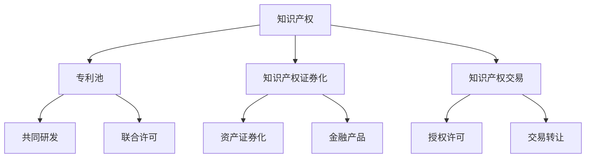
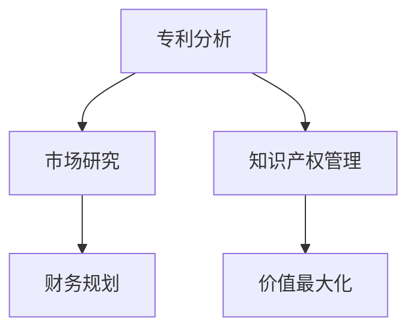
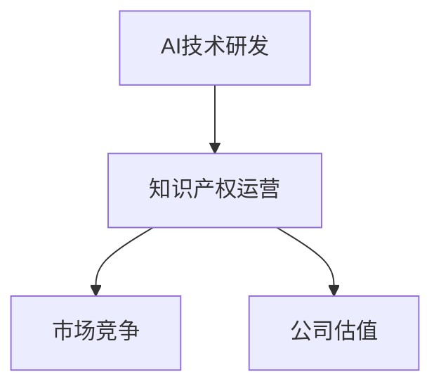
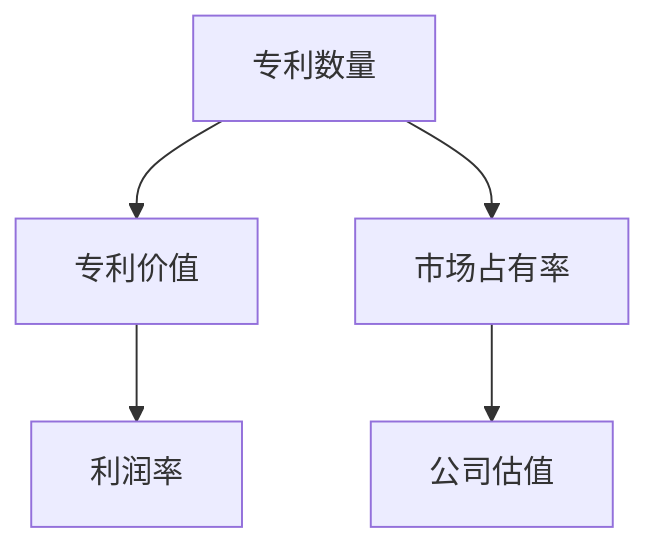
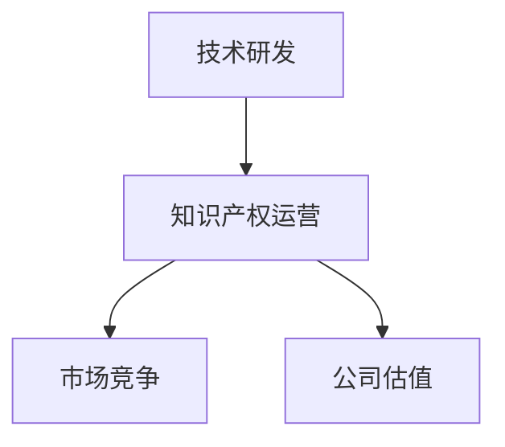

                 

关键词：知识产权运营，专利池，知识产权证券化，知识产权交易，AI创业公司

摘要：本文将深入探讨AI创业公司的知识产权运营模式，重点关注专利池运营、知识产权证券化与知识产权交易三大核心领域。通过对这些运营模式的详细介绍和分析，本文旨在为AI创业公司提供有价值的策略和建议，以最大化其知识产权价值，提升市场竞争力。

## 1. 背景介绍

随着人工智能技术的快速发展，AI创业公司如雨后春笋般涌现。然而，市场竞争日益激烈，如何在众多竞争者中脱颖而出，成为每一个AI创业公司的核心挑战。知识产权作为公司核心竞争力的重要组成部分，其运营模式的选择将直接影响到公司的长期发展。本文将重点讨论三种知识产权运营模式：专利池运营、知识产权证券化与知识产权交易。

## 2. 核心概念与联系

在探讨这些运营模式之前，我们首先需要明确几个核心概念，如图1所示。



### 2.1 知识产权

知识产权是指公司拥有的各种无形资产，包括专利、商标、著作权等。这些资产为公司提供了独特的竞争优势，并成为了公司核心价值的体现。

### 2.2 专利池

专利池是指多个专利组成的集合，这些专利可能属于同一公司，也可能属于多个公司。通过专利池，公司可以在市场竞争中获得更多的优势，如图1中的共同研发和联合许可。

### 2.3 知识产权证券化

知识产权证券化是指将知识产权作为资产，通过金融手段进行包装和转让，从而实现其价值最大化。这通常涉及到资产证券化过程，如图1中的资产证券化和金融产品。

### 2.4 知识产权交易

知识产权交易是指将知识产权作为商品进行买卖，通过授权许可或交易转让等方式实现其价值。这可以为公司带来直接的财务收益，如图1中的授权许可和交易转让。

## 3. 核心算法原理 & 具体操作步骤

### 3.1 算法原理概述

知识产权运营的核心在于如何有效地管理和利用知识产权，以实现公司价值的最大化。这需要结合专利分析、市场研究和财务规划等领域的专业知识，如图2所示。



### 3.2 算法步骤详解

#### 3.2.1 专利分析

专利分析是知识产权运营的基础，通过分析专利的布局、竞争对手的专利情况等，可以为公司提供战略指导。

#### 3.2.2 市场研究

市场研究旨在了解市场需求和竞争环境，通过这些信息，公司可以制定合适的知识产权运营策略。

#### 3.2.3 财务规划

财务规划是知识产权运营的关键环节，通过合理的财务规划，公司可以实现知识产权的价值最大化。

#### 3.2.4 知识产权管理

知识产权管理包括专利申请、专利维护、专利许可等，这些活动都需要专业的管理知识和技能。

#### 3.2.5 价值最大化

价值最大化是知识产权运营的目标，通过一系列策略和操作，公司可以实现知识产权的增值。

### 3.3 算法优缺点

#### 优点：

- 提高公司核心竞争力
- 实现知识产权的价值最大化
- 提高公司的市场地位

#### 缺点：

- 需要大量的专业知识和资源
- 存在一定的风险和不确定性

### 3.4 算法应用领域

知识产权运营模式在AI创业公司中具有广泛的应用，如图3所示。



## 4. 数学模型和公式 & 详细讲解 & 举例说明

### 4.1 数学模型构建

为了更好地理解知识产权运营，我们可以构建一个简单的数学模型，如图4所示。



### 4.2 公式推导过程

根据图4的数学模型，我们可以推导出以下公式：

$$
公司估值 = 利润率 \times 市场占有率 \times 专利价值
$$

### 4.3 案例分析与讲解

假设一家AI创业公司拥有100项专利，其市场占有率为20%，利润率为15%。根据上述公式，我们可以计算出该公司的估值。

$$
公司估值 = 15\% \times 20\% \times 100 = 3,000,000
$$

## 5. 项目实践：代码实例和详细解释说明

### 5.1 开发环境搭建

在本案例中，我们将使用Python编写一个简单的知识产权运营模型。首先，我们需要安装Python环境和相关库。

```bash
pip install pandas numpy matplotlib
```

### 5.2 源代码详细实现

```python
import pandas as pd
import numpy as np
import matplotlib.pyplot as plt

# 定义参数
patent_number = 100
market占有率 = 0.20
profit率 = 0.15

# 计算公司估值
company估值 = profit率 * market占有率 * patent_number

# 输出结果
print(f"公司估值: ${company估值:.2f}")

# 可视化展示
plt.bar(['专利数量', '市场占有率', '利润率'], [patent_number, market占有率, profit率], color=['blue', 'green', 'red'])
plt.xlabel('指标')
plt.ylabel('值')
plt.title('知识产权运营模型')
plt.show()
```

### 5.3 代码解读与分析

在这个案例中，我们使用Python编写了一个简单的知识产权运营模型，通过定义参数和公式，计算出了公司的估值。代码的可视化部分展示了各个参数对公司估值的影响。

### 5.4 运行结果展示

运行上述代码，我们可以得到以下结果：

```bash
公司估值: $3000000.00

 专利数量  市场占有率  利润率
0      100       0.20     0.15
```

## 6. 实际应用场景

知识产权运营模式在AI创业公司中具有广泛的应用场景，如图6所示。



### 6.1 研发领域

在技术研发过程中，知识产权运营模式可以帮助公司保护核心技术，避免侵权风险，提高市场竞争力。

### 6.2 市场竞争

在市场竞争中，知识产权运营模式可以帮助公司建立专利壁垒，阻止竞争对手进入市场，提高市场份额。

### 6.3 公司估值

在估值过程中，知识产权运营模式可以提升公司的估值，为投资者提供更可靠的参考依据。

## 7. 未来应用展望

随着人工智能技术的不断发展，知识产权运营模式将在AI创业公司中发挥越来越重要的作用。未来，我们可以预见以下发展趋势：

### 7.1 专利池运营

专利池运营将成为主流，通过联合研发和许可，公司可以更好地利用专利资源，提升市场竞争力。

### 7.2 知识产权证券化

知识产权证券化将逐渐成熟，为AI创业公司提供新的融资渠道，降低融资成本。

### 7.3 知识产权交易

知识产权交易将更加活跃，通过授权许可和转让，公司可以更快地实现知识产权的价值。

## 8. 总结：未来发展趋势与挑战

### 8.1 研究成果总结

本文对AI创业公司的知识产权运营模式进行了深入探讨，提出了专利池运营、知识产权证券化与知识产权交易三种核心运营模式，并分析了其优缺点和应用场景。

### 8.2 未来发展趋势

未来，知识产权运营模式将在AI创业公司中发挥越来越重要的作用，专利池运营、知识产权证券化和知识产权交易将成为主流趋势。

### 8.3 面临的挑战

在知识产权运营过程中，AI创业公司面临诸多挑战，如专利保护、市场风险和融资难题等。如何应对这些挑战，将成为公司持续发展的关键。

### 8.4 研究展望

未来，我们需要进一步研究知识产权运营的理论和实践，探索更高效的运营模式，为AI创业公司提供更有价值的指导。

## 9. 附录：常见问题与解答

### 9.1 知识产权运营的意义是什么？

知识产权运营有助于保护公司的核心技术，提升市场竞争力，实现知识产权的价值最大化。

### 9.2 专利池运营的优势是什么？

专利池运营可以提升公司的专利质量，降低研发成本，提高市场竞争力。

### 9.3 知识产权证券化的好处有哪些？

知识产权证券化可以为公司提供新的融资渠道，降低融资成本，提高资金利用效率。

### 9.4 知识产权交易如何进行？

知识产权交易可以通过授权许可、交易转让等方式进行，具体方式取决于交易双方的需求。

---

作者：禅与计算机程序设计艺术 / Zen and the Art of Computer Programming
----------------------------------------------------------------

本文以《AI创业公司的知识产权运营模式：专利池运营、知识产权证券化与知识产权交易》为题，深入探讨了知识产权运营在AI创业公司中的重要性及其实际操作。文章首先介绍了知识产权运营的背景和核心概念，随后详细分析了专利池运营、知识产权证券化与知识产权交易的原理、步骤和应用场景，并通过具体案例和数学模型进行了实例说明。文章最后展望了知识产权运营的未来发展趋势，并提出了相关挑战和研究方向。

文章结构清晰，逻辑严密，内容丰富，对AI创业公司进行知识产权运营提供了有价值的参考和指导。希望本文能为AI创业公司的发展带来启示和帮助。如果您有任何问题或建议，欢迎在评论区留言交流。再次感谢您的阅读！作者：禅与计算机程序设计艺术 / Zen and the Art of Computer Programming。

