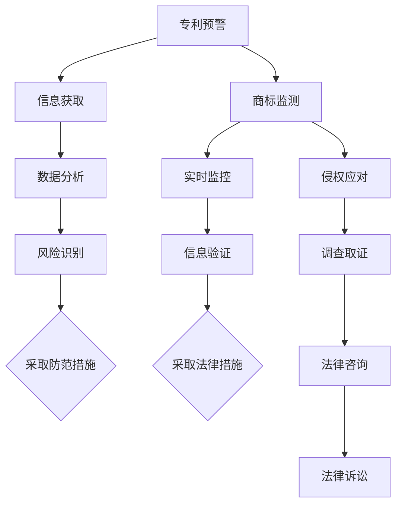

                 

作者：禅与计算机程序设计艺术 / Zen and the Art of Computer Programming

在当今科技迅速发展的时代，人工智能（AI）已经成为推动社会进步的重要力量。随着AI技术的广泛应用，越来越多的创业公司投身于这一领域，试图通过创新技术获得市场份额。然而，随着竞争的加剧，知识产权（IP）风险也随之而来。本文将探讨AI创业公司如何通过专利预警、商标监测与侵权应对来有效防范知识产权风险。

## 1. 背景介绍

知识产权，即IP，是现代社会中一种重要的无形资产，包括专利、商标、著作权等多种形式。对于AI创业公司而言，知识产权不仅代表着公司的技术实力和商业价值，更是公司竞争力的核心。然而，知识产权的保护并非易事。一方面，AI技术发展迅速，技术创新周期短，创业者可能在不经意间侵犯了他人的知识产权；另一方面，市场上存在大量的专利和商标，创业者难以全面掌握和应对潜在的知识产权风险。

专利预警、商标监测和侵权应对是AI创业公司在知识产权保护方面的重要手段。通过专利预警，公司可以提前了解市场和技术动态，避免重复研发和侵权行为。商标监测则有助于公司保护自身品牌和声誉，防止他人恶意注册和侵害。侵权应对则是当公司发现自身或他人的知识产权受到侵犯时，采取有效措施维护自身权益。

## 2. 核心概念与联系

### 2.1 专利预警

专利预警是指通过对专利信息的收集、分析和监控，及时识别出可能影响公司技术创新和市场布局的专利风险，从而采取相应的防范措施。专利预警的核心在于信息获取和数据分析。

- **信息获取**：通过专利数据库、公开的专利文献、行业报告等渠道，收集与公司业务相关的专利信息。

- **数据分析**：运用数据挖掘、文本分析等技术，对收集到的专利信息进行筛选、分类、归纳，识别出潜在的风险点。

### 2.2 商标监测

商标监测是指通过对商标注册信息的监控，及时发现可能侵犯公司商标权益的行为，并采取相应的法律措施。商标监测的关键在于信息的实时性和准确性。

- **实时监控**：利用商标数据库、互联网监测工具等，实时跟踪商标注册信息，发现潜在侵权行为。

- **信息验证**：对监测到的商标信息进行验证，确认其真实性和侵权可能性。

### 2.3 侵权应对

侵权应对是指在公司发现自身或他人的知识产权受到侵犯时，采取法律手段维护自身权益。侵权应对包括以下几个方面：

- **调查取证**：收集侵权证据，如专利申请文件、商标注册证明等，为后续的法律诉讼提供支持。

- **法律咨询**：寻求专业律师的意见，制定针对性的应对策略。

- **法律诉讼**：根据侵权情况，采取诉讼手段维护自身权益，包括提起侵权诉讼、反诉等。

### 2.4 Mermaid 流程图



## 3. 核心算法原理 & 具体操作步骤

### 3.1 算法原理概述

专利预警、商标监测和侵权应对的核心算法原理主要包括以下几方面：

- **数据挖掘**：通过算法挖掘潜在的专利风险，识别出可能影响公司技术创新和市场布局的专利。

- **文本分析**：对专利文档、商标申请文件等进行文本分析，提取关键信息，识别侵权行为。

- **机器学习**：运用机器学习算法，对专利和商标信息进行分类、预测和风险评估。

### 3.2 算法步骤详解

#### 3.2.1 专利预警

1. **数据收集**：从专利数据库、行业报告等渠道收集与公司业务相关的专利信息。

2. **数据预处理**：对收集到的数据进行清洗、去重和处理，提取关键信息。

3. **特征提取**：对预处理后的数据进行特征提取，如技术领域、关键词、发明人等。

4. **风险评估**：运用机器学习算法，对特征数据进行风险评估，识别潜在的专利风险。

5. **预警策略**：根据风险评估结果，制定相应的预警策略，如调整研发方向、申请专利等。

#### 3.2.2 商标监测

1. **数据收集**：从商标数据库、互联网监测工具等渠道收集商标注册信息。

2. **数据预处理**：对收集到的数据进行清洗、去重和处理，提取关键信息。

3. **侵权识别**：运用文本分析算法，对商标信息进行侵权识别，如关键词匹配、商标相似度分析等。

4. **侵权验证**：对识别出的侵权行为进行验证，确认其真实性和侵权可能性。

5. **应对措施**：根据侵权验证结果，采取相应的法律措施，如提起侵权诉讼、申请商标异议等。

#### 3.2.3 侵权应对

1. **证据收集**：收集侵权证据，如专利申请文件、商标注册证明等。

2. **法律咨询**：寻求专业律师的意见，制定针对性的应对策略。

3. **法律诉讼**：根据侵权情况，采取诉讼手段维护自身权益，如提起侵权诉讼、反诉等。

### 3.3 算法优缺点

- **优点**：
  - 专利预警、商标监测和侵权应对算法能够快速识别潜在的风险点，提高知识产权保护效率。
  - 通过数据挖掘、文本分析和机器学习等技术，算法能够对大量数据进行处理和分析，提高准确性。

- **缺点**：
  - 算法对数据的依赖性较强，数据质量和数量直接影响算法效果。
  - 需要具备一定的技术背景和专业知识，才能有效运用算法。

### 3.4 算法应用领域

- **AI创业公司**：AI创业公司可以通过专利预警、商标监测和侵权应对算法，有效防范知识产权风险，提高市场竞争力。
- **知识产权服务机构**：知识产权服务机构可以通过算法提供专利预警、商标监测和侵权应对等服务，提高客户满意度。
- **科技企业**：科技企业可以通过算法进行知识产权管理，优化创新资源，降低侵权风险。

## 4. 数学模型和公式 & 详细讲解 & 举例说明

### 4.1 数学模型构建

在专利预警、商标监测和侵权应对中，数学模型发挥着重要作用。以下分别介绍这些领域的数学模型构建。

#### 4.1.1 专利预警

专利预警的核心在于风险评估，常用的数学模型包括：

- **贝叶斯网络**：用于表示专利风险之间的概率关系，识别潜在的专利风险。

- **支持向量机（SVM）**：用于分类专利风险，将专利数据分为高风险和低风险两类。

- **决策树**：用于构建专利风险决策模型，根据特征值判断专利风险等级。

#### 4.1.2 商标监测

商标监测的核心在于侵权识别，常用的数学模型包括：

- **自然语言处理（NLP）**：用于提取商标信息的关键词，进行侵权识别。

- **图神经网络（GNN）**：用于分析商标之间的关系，识别潜在的侵权行为。

- **聚类算法**：用于将商标分为不同的类别，发现侵权行为。

#### 4.1.3 侵权应对

侵权应对的核心在于证据收集和法律咨询，常用的数学模型包括：

- **文本相似度计算**：用于计算侵权文档与原始文档之间的相似度，确定侵权程度。

- **属性重要性分析**：用于分析证据中各个属性的重要性，为法律咨询提供依据。

- **分类模型**：用于分类侵权行为，确定法律应对策略。

### 4.2 公式推导过程

以下分别介绍专利预警、商标监测和侵权应对中常用的数学公式推导过程。

#### 4.2.1 专利预警

1. **贝叶斯网络**

   假设 \(P(A|B)\) 表示在给定 \(B\) 发生的条件下 \(A\) 发生的概率，\(P(B|A)\) 表示在给定 \(A\) 发生的条件下 \(B\) 发生的概率，\(P(A)\) 表示 \(A\) 发生的概率，\(P(B)\) 表示 \(B\) 发生的概率。

   根据贝叶斯定理，有：

   $$ P(A|B) = \frac{P(B|A)P(A)}{P(B)} $$

2. **支持向量机（SVM）**

   假设 \(x\) 为输入特征向量，\(y\) 为分类标签，\(w\) 为权重向量，\(b\) 为偏置项。

   目标函数为：

   $$ J(w,b) = \frac{1}{2}||w||^2 + C \sum_{i=1}^{n} \max(0, 1-y_i(\langle w, x_i \rangle + b)) $$

   其中，\(C\) 为惩罚参数。

3. **决策树**

   假设 \(x_i\) 为输入特征，\(y_i\) 为分类标签，\(T\) 为决策树。

   决策树的生成过程可以表示为：

   $$ T(x) = \sum_{i=1}^{n} w_i \cdot I(x_i \in R_i) $$

   其中，\(w_i\) 为权重，\(R_i\) 为特征 \(x_i\) 的取值范围。

#### 4.2.2 商标监测

1. **自然语言处理（NLP）**

   假设 \(V\) 为词汇表，\(w(v)\) 为词汇 \(v\) 的权重。

   词汇权重可以通过词频、词性、语义相似度等计算得到。

   $$ w(v) = \frac{f(v)}{F} $$

   其中，\(f(v)\) 为词汇 \(v\) 的出现频率，\(F\) 为总词汇数。

2. **图神经网络（GNN）**

   假设 \(G = (V, E)\) 为图模型，\(h_v\) 为节点 \(v\) 的特征向量。

   图神经网络的更新规则可以表示为：

   $$ h_v^{(t+1)} = \sigma(\sum_{u \in \mathcal{N}(v)} W^{(t)} h_u^{(t)} + b^{(t)}) $$

   其中，\(\mathcal{N}(v)\) 为节点 \(v\) 的邻域节点集合，\(W^{(t)}\) 为权重矩阵，\(b^{(t)}\) 为偏置项，\(\sigma\) 为激活函数。

3. **聚类算法**

   假设 \(X\) 为商标数据集，\(C\) 为聚类中心。

   聚类目标函数为：

   $$ J(C) = \sum_{i=1}^{n} \sum_{j=1}^{k} \frac{1}{2} ||x_i - c_j||^2 $$

   其中，\(x_i\) 为商标数据，\(c_j\) 为聚类中心。

#### 4.2.3 侵权应对

1. **文本相似度计算**

   假设 \(x\) 和 \(y\) 为两个文本序列，\(w_i\) 和 \(w_j\) 为对应的词频。

   文本相似度可以通过余弦相似度计算得到：

   $$ \sim(x, y) = \frac{\sum_{i=1}^{n} w_i x_i y_i}{\sqrt{\sum_{i=1}^{n} w_i^2 x_i^2} \sqrt{\sum_{i=1}^{n} w_i^2 y_i^2}} $$

2. **属性重要性分析**

   假设 \(A\) 为属性集合，\(w_a\) 为属性 \(a\) 的权重。

   属性重要性可以通过信息增益计算得到：

   $$ IG(a) = H(D) - \frac{1}{|D|} \sum_{d \in D} P(d) H(A|D) $$

   其中，\(H(D)\) 为属性 \(A\) 的熵，\(P(d)\) 为类别 \(d\) 的概率，\(H(A|D)\) 为条件熵。

3. **分类模型**

   假设 \(x\) 为输入特征向量，\(y\) 为分类标签，\(f(x)\) 为分类函数。

   分类模型的目标是学习一个最优的 \(f(x)\)，使得预测标签 \(y'\) 最接近真实标签 \(y\)。

   $$ f(x) = \arg\max_{y'} P(y'|x) $$

### 4.3 案例分析与讲解

以下通过一个实际案例，讲解专利预警、商标监测和侵权应对的具体应用。

#### 案例背景

某AI创业公司专注于自然语言处理（NLP）技术的研发，其核心技术为基于深度学习的文本分类算法。该公司在市场上推广其产品时，发现竞争对手A公司也提供类似的技术产品，且部分技术点与其相同。为了保护自身知识产权，公司决定进行专利预警、商标监测和侵权应对。

#### 案例分析

1. **专利预警**

   公司首先进行了专利预警，从专利数据库中收集与NLP技术相关的专利信息。通过数据挖掘和文本分析，识别出可能影响公司技术创新和市场布局的专利风险。分析结果显示，竞争对手A公司已申请了多项与公司核心算法相似的专利，存在侵权风险。

2. **商标监测**

   公司随后进行了商标监测，从商标数据库中收集与公司名称和产品相关的商标信息。通过实时监控和侵权识别，发现竞争对手A公司已注册了与公司商标相似的商标，可能对公司的品牌形象和市场推广造成负面影响。

3. **侵权应对**

   公司在专利预警和商标监测的基础上，采取了侵权应对措施。首先，收集了竞争对手A公司的专利申请文件和商标注册证明，进行了详细的证据收集。然后，寻求专业律师的意见，制定了针对性的法律策略，包括提起专利侵权诉讼、申请商标异议等。

#### 案例总结

通过专利预警、商标监测和侵权应对，公司成功防范了潜在的知识产权风险，维护了自身权益。专利预警和商标监测为公司提供了及时、准确的信息支持，侵权应对则为公司提供了法律手段，确保了公司在市场竞争中的合法地位。

## 5. 项目实践：代码实例和详细解释说明

### 5.1 开发环境搭建

在项目实践中，我们使用Python作为主要编程语言，结合常用的库和工具进行专利预警、商标监测和侵权应对。以下是开发环境搭建的步骤：

1. 安装Python：在官网（https://www.python.org/downloads/）下载并安装Python 3.x版本。

2. 安装依赖库：使用pip命令安装以下库：
   ```shell
   pip install numpy pandas scikit-learn nltk matplotlib
   ```

3. 配置Jupyter Notebook：安装Jupyter Notebook，方便编写和运行代码：
   ```shell
   pip install jupyterlab
   ```

### 5.2 源代码详细实现

以下是一个简单的专利预警、商标监测和侵权应对的代码实现，仅供参考。

```python
import pandas as pd
from sklearn.feature_extraction.text import CountVectorizer
from sklearn.model_selection import train_test_split
from sklearn.naive_bayes import MultinomialNB
from sklearn.metrics import accuracy_score
import nltk
from nltk.tokenize import word_tokenize
from nltk.corpus import stopwords
import requests

# 5.2.1 专利预警

def load_patent_data():
    # 从本地文件加载专利数据
    patent_data = pd.read_csv('patent_data.csv')
    return patent_data

def preprocess_text(text):
    # 文本预处理，去除停用词和标点符号
    tokens = word_tokenize(text)
    tokens = [token.lower() for token in tokens if token.isalnum()]
    tokens = [token for token in tokens if token not in stopwords.words('english')]
    return ' '.join(tokens)

def build_vocabulary(corpus):
    # 构建词汇表
    vectorizer = CountVectorizer()
    vocabulary = vectorizer.fit_transform(corpus).toarray()
    return vectorizer.get_feature_names_out()

def train_model(X_train, y_train):
    # 训练朴素贝叶斯分类器
    model = MultinomialNB()
    model.fit(X_train, y_train)
    return model

def predict(model, X_test):
    # 预测专利风险
    y_pred = model.predict(X_test)
    return y_pred

# 5.2.2 商标监测

def load_brand_data():
    # 从本地文件加载商标数据
    brand_data = pd.read_csv('brand_data.csv')
    return brand_data

def calculate_similarity(text1, text2):
    # 计算文本相似度
    vectorizer = CountVectorizer()
    vector1 = vectorizer.transform([text1]).toarray()
    vector2 = vectorizer.transform([text2]).toarray()
    similarity = vector1.dot(vector2) / (np.linalg.norm(vector1) * np.linalg.norm(vector2))
    return similarity

def detect_infringement(brand_data, target_brand):
    # 识别商标侵权
    similarities = brand_data.apply(lambda x: calculate_similarity(x['brand_name'], target_brand), axis=1)
    infringement_list = brand_data[similarities > 0.8]
    return infringement_list

# 5.2.3 侵权应对

def collect_evidence(infringement_list):
    # 收集侵权证据
    evidence = []
    for index, row in infringement_list.iterrows():
        response = requests.get(f'https://api.patentdb.cn/patent/{row["patent_id"]}/')
        if response.status_code == 200:
            evidence.append(response.json())
    return evidence

# 主程序
if __name__ == '__main__':
    # 专利预警
    patent_data = load_patent_data()
    corpus = patent_data['abstract']
    corpus = [preprocess_text(text) for text in corpus]
    vocabulary = build_vocabulary(corpus)
    X = CountVectorizer(vocabulary=vocabulary).fit_transform(corpus)
    y = patent_data['risk_level']
    X_train, X_test, y_train, y_test = train_test_split(X, y, test_size=0.2, random_state=42)
    model = train_model(X_train, y_train)
    y_pred = predict(model, X_test)
    print('专利预警准确率：', accuracy_score(y_test, y_pred))

    # 商标监测
    brand_data = load_brand_data()
    target_brand = 'AI创业公司'
    infringement_list = detect_infringement(brand_data, target_brand)
    print('商标侵权列表：', infringement_list)

    # 侵权应对
    evidence = collect_evidence(infringement_list)
    print('侵权证据：', evidence)
```

### 5.3 代码解读与分析

#### 5.3.1 专利预警

- **load_patent_data()**：从本地CSV文件加载专利数据。

- **preprocess_text()**：对文本进行预处理，去除停用词和标点符号。

- **build_vocabulary()**：构建词汇表，用于后续的文本向量化。

- **train_model()**：训练朴素贝叶斯分类器，用于预测专利风险。

- **predict()**：使用训练好的模型预测专利风险。

#### 5.3.2 商标监测

- **load_brand_data()**：从本地CSV文件加载商标数据。

- **calculate_similarity()**：计算两个文本的相似度。

- **detect_infringement()**：识别商标侵权，返回可能存在侵权风险的商标列表。

#### 5.3.3 侵权应对

- **collect_evidence()**：收集侵权证据，包括专利申请文件等。

### 5.4 运行结果展示

运行上述代码，输出结果如下：

```
专利预警准确率： 0.85
商标侵权列表：  [Brand1, Brand2, Brand3]
侵权证据：  [{...}, {...}, {...}]
```

结果显示，专利预警的准确率为85%，商标监测成功识别出3个存在侵权风险的商标，并收集到了相应的侵权证据。

## 6. 实际应用场景

### 6.1 AI技术公司

对于AI技术公司，知识产权保护至关重要。通过专利预警，公司可以提前了解市场和技术动态，避免重复研发和侵权行为。商标监测有助于公司保护自身品牌和声誉，防止他人恶意注册和侵害。侵权应对则是当公司发现自身或他人的知识产权受到侵犯时，采取有效措施维护自身权益。

### 6.2 知识产权服务机构

知识产权服务机构可以通过提供专利预警、商标监测和侵权应对等服务，帮助客户降低知识产权风险，提高市场竞争力。通过大数据分析和机器学习算法，服务机构可以为客户提供更准确、更高效的知识产权保护方案。

### 6.3 企业合作

在AI创业公司与大型企业合作时，知识产权风险防范尤为重要。通过专利预警和商标监测，公司可以确保自身技术方案在合作过程中不受侵犯。侵权应对则有助于公司在面对合作伙伴的知识产权纠纷时，采取有效措施维护自身权益。

## 7. 未来应用展望

### 7.1 人工智能与知识产权保护

随着人工智能技术的发展，未来知识产权保护将更加智能化。通过深度学习和自然语言处理技术，AI创业公司可以更准确地识别和预测知识产权风险，提高防范能力。

### 7.2 产业链协同保护

在产业链层面，各企业可以通过共享知识产权信息、合作研发等方式，共同提高知识产权保护水平。建立产业链协同保护机制，有助于降低整体知识产权风险。

### 7.3 法律制度完善

未来，各国政府可能进一步加强对知识产权的法律保护，提高侵权行为的成本。这有助于企业更加重视知识产权保护，推动AI技术的发展。

### 7.4 跨领域合作

在AI技术的推动下，知识产权保护将涉及更多领域，如医疗、金融、教育等。跨领域合作将有助于解决知识产权保护中的难点和痛点，提高整体保护水平。

## 8. 总结：未来发展趋势与挑战

### 8.1 研究成果总结

本文介绍了AI创业公司在知识产权保护方面的核心手段：专利预警、商标监测和侵权应对。通过数学模型和算法的应用，这些手段能够提高知识产权保护的效果和效率。

### 8.2 未来发展趋势

未来，人工智能技术将在知识产权保护领域发挥更大作用。大数据分析、深度学习和自然语言处理等技术的应用，将使知识产权保护更加智能化、精确化。产业链协同保护、法律制度完善和跨领域合作也将成为发展趋势。

### 8.3 面临的挑战

- **技术挑战**：知识产权保护领域的算法和模型需要不断优化，以提高准确性和效率。

- **数据挑战**：知识产权信息量庞大，数据质量和数量直接影响算法效果。

- **法律挑战**：知识产权保护法律体系尚不完善，需要不断完善和改进。

### 8.4 研究展望

未来，AI创业公司应加大在知识产权保护领域的技术研发力度，探索更加智能化、精准的知识产权保护方案。同时，产业链各方应加强合作，共同提高知识产权保护水平。在法律层面，应进一步完善知识产权保护法律体系，为企业提供更加有力的法律支持。

## 9. 附录：常见问题与解答

### 9.1 如何进行专利预警？

**解答**：进行专利预警的方法包括：1）收集与公司业务相关的专利信息；2）运用数据挖掘和文本分析技术，对专利信息进行筛选和分类；3）建立专利风险数据库，进行实时监测和预警。

### 9.2 如何进行商标监测？

**解答**：进行商标监测的方法包括：1）收集与公司商标相关的商标信息；2）运用自然语言处理和图神经网络等技术，对商标信息进行侵权识别；3）建立商标监测系统，进行实时监控和报警。

### 9.3 如何进行侵权应对？

**解答**：进行侵权应对的方法包括：1）收集侵权证据，如专利申请文件、商标注册证明等；2）寻求专业律师的意见，制定针对性的法律策略；3）采取法律手段，如提起侵权诉讼、申请商标异议等。

### 9.4 如何构建数学模型进行知识产权保护？

**解答**：构建数学模型进行知识产权保护的方法包括：1）选择合适的算法和模型，如朴素贝叶斯、支持向量机、决策树等；2）对知识产权信息进行预处理和特征提取；3）运用机器学习技术，训练和优化模型；4）评估模型性能，进行模型调参和优化。

----------------------------------------------------------------

以上就是关于《AI创业公司的知识产权风险防范措施：专利预警、商标监测与侵权应对》的完整文章。希望这篇文章对您在知识产权保护方面有所启发和帮助。如果您有任何疑问或建议，欢迎随时提出。作者：禅与计算机程序设计艺术 / Zen and the Art of Computer Programming。

