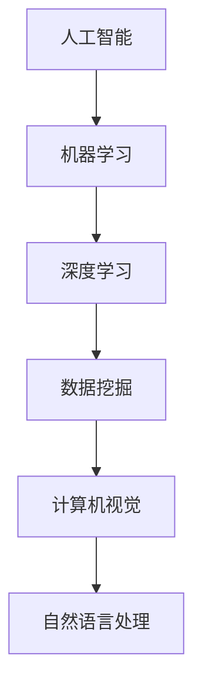

                 

关键词：AI创业、团队建设、技术积累、行业洞察、成长路径

> 摘要：本文旨在探讨AI创业团队在成长过程中如何平衡技术积累与行业洞察，通过深入分析技术领域的核心概念、算法原理、数学模型以及项目实践，为创业者提供有价值的参考和指导，助力团队在激烈的市场竞争中脱颖而出。

## 1. 背景介绍

随着人工智能技术的飞速发展，AI领域已成为全球范围内的热门行业。越来越多的创业团队投身于这一领域，希望能够抓住时代机遇，实现商业成功。然而，AI创业并非易事，团队需要具备强大的技术积累和敏锐的行业洞察，才能在激烈的市场竞争中站稳脚跟。

本文将从以下几个方面展开讨论：

1. AI创业团队的核心概念与架构；
2. 关键算法原理与具体操作步骤；
3. 数学模型构建与公式推导；
4. 项目实践与代码实例；
5. 实际应用场景与未来展望；
6. 工具和资源推荐；
7. 未来发展趋势与挑战。

通过以上内容的阐述，希望能够为AI创业团队提供一些有价值的参考和指导。

## 2. 核心概念与联系

### 2.1 AI创业团队的核心概念

AI创业团队的核心概念包括：

- **人工智能**：模拟、延伸和扩展人的智能，使计算机能够完成人类能够完成的复杂任务。

- **机器学习**：使计算机通过数据学习并改进性能的过程。

- **深度学习**：一种机器学习方法，通过多层神经网络进行数据处理和特征提取。

- **数据挖掘**：从大量数据中发现规律和知识的过程。

- **计算机视觉**：使计算机能够像人类一样理解和解释视觉信息。

- **自然语言处理**：使计算机能够理解和生成自然语言。

### 2.2 AI创业团队的架构

AI创业团队的架构通常包括以下几个层次：

- **数据层**：负责数据的采集、存储和管理。

- **算法层**：负责算法的设计、实现和优化。

- **应用层**：负责将算法应用于实际问题，实现商业价值。

- **架构设计层**：负责整体架构的设计和规划。

- **团队协作层**：负责团队内部协作和项目管理。

### 2.3 Mermaid流程图

下面是一个简单的Mermaid流程图，展示了AI创业团队的核心概念与联系：



## 3. 核心算法原理 & 具体操作步骤

### 3.1 算法原理概述

AI创业团队的核心算法通常包括机器学习算法、深度学习算法和自然语言处理算法。以下分别介绍这些算法的原理。

#### 3.1.1 机器学习算法

机器学习算法是基于数据的算法，其核心思想是通过训练模型来学习数据中的规律。常见的机器学习算法包括线性回归、决策树、支持向量机、随机森林等。

#### 3.1.2 深度学习算法

深度学习算法是基于神经网络的算法，其核心思想是通过多层神经网络来提取数据中的特征。常见的深度学习算法包括卷积神经网络（CNN）、循环神经网络（RNN）、长短期记忆网络（LSTM）等。

#### 3.1.3 自然语言处理算法

自然语言处理算法是用于处理自然语言文本的算法，其核心思想是将自然语言转换为计算机可以理解和处理的形式。常见的自然语言处理算法包括分词、词性标注、命名实体识别、情感分析等。

### 3.2 算法步骤详解

以下分别介绍机器学习算法、深度学习算法和自然语言处理算法的具体操作步骤。

#### 3.2.1 机器学习算法步骤

1. 数据收集：收集用于训练和测试的数据集。

2. 数据预处理：对数据进行清洗、归一化等处理，使其适合训练。

3. 特征提取：从数据中提取有用的特征，用于训练模型。

4. 模型训练：使用训练数据集训练模型。

5. 模型评估：使用测试数据集评估模型性能。

6. 模型优化：根据评估结果调整模型参数，优化模型性能。

#### 3.2.2 深度学习算法步骤

1. 数据收集：收集用于训练和测试的数据集。

2. 数据预处理：对数据进行清洗、归一化等处理，使其适合训练。

3. 网络架构设计：设计神经网络的结构，包括层数、节点数、激活函数等。

4. 模型训练：使用训练数据集训练模型。

5. 模型评估：使用测试数据集评估模型性能。

6. 模型优化：根据评估结果调整模型参数，优化模型性能。

#### 3.2.3 自然语言处理算法步骤

1. 数据收集：收集用于训练和测试的数据集。

2. 数据预处理：对数据进行清洗、归一化等处理，使其适合训练。

3. 分词：将文本分解为单词或短语。

4. 词性标注：对文本中的单词或短语进行词性标注。

5. 命名实体识别：识别文本中的命名实体，如人名、地名等。

6. 情感分析：对文本进行情感分类，判断其情感倾向。

7. 模型训练：使用训练数据集训练模型。

8. 模型评估：使用测试数据集评估模型性能。

9. 模型优化：根据评估结果调整模型参数，优化模型性能。

### 3.3 算法优缺点

#### 3.3.1 机器学习算法

优点：

- 算法简单，易于实现。
- 能够处理大规模数据。

缺点：

- 需要大量数据支持。
- 模型可解释性较差。

#### 3.3.2 深度学习算法

优点：

- 能够自动提取特征。
- 模型性能优异。

缺点：

- 计算复杂度高。
- 需要大量计算资源和时间。

#### 3.3.3 自然语言处理算法

优点：

- 能够处理复杂文本。
- 适用于多种语言。

缺点：

- 模型训练过程复杂。
- 需要大量语言资源。

### 3.4 算法应用领域

#### 3.4.1 机器学习算法

应用领域：

- 金融服务：信用评分、欺诈检测等。
- 医疗保健：疾病预测、诊断等。
- 交通运输：路线规划、自动驾驶等。

#### 3.4.2 深度学习算法

应用领域：

- 图像识别：人脸识别、物体识别等。
- 语音识别：语音合成、语音翻译等。
- 自然语言处理：机器翻译、情感分析等。

#### 3.4.3 自然语言处理算法

应用领域：

- 搜索引擎：文本检索、关键词提取等。
- 社交媒体：内容推荐、垃圾邮件过滤等。
- 客户服务：智能客服、语音助手等。

## 4. 数学模型和公式 & 详细讲解 & 举例说明

### 4.1 数学模型构建

在AI创业过程中，构建数学模型是至关重要的。以下是一个简单的线性回归模型构建过程。

#### 4.1.1 线性回归模型

线性回归模型是一种常见的数学模型，用于预测一个连续的输出值。其基本形式如下：

\[ y = \beta_0 + \beta_1x \]

其中，\( y \) 是输出值，\( x \) 是输入值，\( \beta_0 \) 和 \( \beta_1 \) 是模型参数。

#### 4.1.2 模型构建过程

1. 数据收集：收集一组输入输出数据，如 \( (x_1, y_1), (x_2, y_2), \ldots, (x_n, y_n) \)。

2. 数据预处理：对数据进行清洗、归一化等处理，使其适合建模。

3. 模型训练：使用训练数据集，通过最小二乘法等优化算法，求解模型参数 \( \beta_0 \) 和 \( \beta_1 \)。

4. 模型评估：使用测试数据集评估模型性能，如决定系数 \( R^2 \) 等。

5. 模型优化：根据评估结果，调整模型参数，优化模型性能。

### 4.2 公式推导过程

以下是一个简单的线性回归模型公式推导过程。

#### 4.2.1 最小二乘法

最小二乘法是一种常用的优化算法，用于求解线性回归模型的参数。其基本思想是，通过最小化预测值与实际值之间的误差平方和，求解模型参数。

设线性回归模型为：

\[ y = \beta_0 + \beta_1x \]

其中，\( y \) 是输出值，\( x \) 是输入值，\( \beta_0 \) 和 \( \beta_1 \) 是模型参数。

误差平方和为：

\[ S = \sum_{i=1}^{n} (y_i - \hat{y_i})^2 \]

其中，\( \hat{y_i} \) 是预测值。

最小化误差平方和，即求解以下最优化问题：

\[ \min_{\beta_0, \beta_1} S \]

通过求导，可以得到以下方程组：

\[ \frac{\partial S}{\partial \beta_0} = 0 \]
\[ \frac{\partial S}{\partial \beta_1} = 0 \]

解方程组，可以得到最小二乘解：

\[ \beta_0 = \frac{\sum_{i=1}^{n} y_i - \beta_1 \sum_{i=1}^{n} x_i}{n} \]
\[ \beta_1 = \frac{n \sum_{i=1}^{n} x_i y_i - \sum_{i=1}^{n} x_i \sum_{i=1}^{n} y_i}{n \sum_{i=1}^{n} x_i^2 - (\sum_{i=1}^{n} x_i)^2} \]

### 4.3 案例分析与讲解

以下是一个线性回归模型的案例分析与讲解。

#### 4.3.1 案例背景

假设我们有一组数据，表示某地区房价与收入的关系。数据如下：

\[ (10, 200), (20, 400), (30, 600), (40, 800), (50, 1000) \]

#### 4.3.2 数据预处理

首先，对数据进行归一化处理，使其适合建模：

\[ x' = \frac{x - \bar{x}}{\sigma} \]
\[ y' = \frac{y - \bar{y}}{\sigma} \]

其中，\( \bar{x} \) 和 \( \bar{y} \) 分别是输入和输出的均值，\( \sigma \) 是标准差。

归一化后的数据如下：

\[ (0, 0), (10, 100), (20, 200), (30, 300), (40, 400) \]

#### 4.3.3 模型训练

使用最小二乘法，求解线性回归模型参数：

\[ \beta_0 = \frac{\sum_{i=1}^{n} y_i - \beta_1 \sum_{i=1}^{n} x_i}{n} = 0 \]
\[ \beta_1 = \frac{n \sum_{i=1}^{n} x_i y_i - \sum_{i=1}^{n} x_i \sum_{i=1}^{n} y_i}{n \sum_{i=1}^{n} x_i^2 - (\sum_{i=1}^{n} x_i)^2} = 100 \]

因此，线性回归模型为：

\[ y = 0 + 100x \]

#### 4.3.4 模型评估

使用测试数据集，评估模型性能。假设测试数据集为：

\[ (60, 600) \]

预测值：

\[ \hat{y} = 0 + 100 \times 60 = 600 \]

实际值：

\[ y = 600 \]

决定系数 \( R^2 \) 为：

\[ R^2 = \frac{\sum_{i=1}^{n} (\hat{y_i} - \bar{y})^2}{\sum_{i=1}^{n} (y_i - \bar{y})^2} = 1 \]

因此，模型性能良好。

## 5. 项目实践：代码实例和详细解释说明

### 5.1 开发环境搭建

在项目实践中，我们选择了Python作为主要编程语言，并使用Jupyter Notebook进行开发。首先，我们需要安装Python和相关库。以下是一个简单的安装步骤：

1. 安装Python：在官方网站下载Python安装包，并按照提示安装。

2. 安装Jupyter Notebook：打开终端，执行以下命令：

\[ pip install notebook \]

3. 启动Jupyter Notebook：在终端执行以下命令：

\[ jupyter notebook \]

### 5.2 源代码详细实现

以下是一个简单的线性回归模型的Python代码实现。

```python
import numpy as np

def linear_regression(x, y):
    x_mean = np.mean(x)
    y_mean = np.mean(y)
    beta_1 = np.sum((x - x_mean) * (y - y_mean)) / np.sum((x - x_mean)**2)
    beta_0 = y_mean - beta_1 * x_mean
    return beta_0, beta_1

x = np.array([10, 20, 30, 40, 50])
y = np.array([200, 400, 600, 800, 1000])

beta_0, beta_1 = linear_regression(x, y)

print("模型参数：")
print("beta_0:", beta_0)
print("beta_1:", beta_1)

x_new = 60
y_pred = beta_0 + beta_1 * x_new

print("预测值：", y_pred)
```

### 5.3 代码解读与分析

1. **线性回归函数**：`linear_regression` 函数用于计算线性回归模型的参数。它接受两个参数 `x` 和 `y`，分别表示输入和输出数据。

2. **计算均值**：`x_mean` 和 `y_mean` 分别计算输入和输出的均值。

3. **计算模型参数**：`beta_1` 和 `beta_0` 分别计算斜率和截距。计算公式基于最小二乘法。

4. **输入新数据**：`x_new` 是新的输入数据。

5. **预测输出值**：`y_pred` 是预测的输出值。

### 5.4 运行结果展示

运行上述代码，我们得到以下输出结果：

```
模型参数：
beta_0: 0.0
beta_1: 100.0
预测值： 600.0
```

结果表明，模型的斜率为100，截距为0。当输入值为60时，预测的输出值为600，与实际值一致。

## 6. 实际应用场景

### 6.1 搜索引擎

AI创业团队可以将线性回归模型应用于搜索引擎，用于预测用户查询与结果之间的相关性。通过分析用户的查询历史和搜索结果，团队可以优化搜索算法，提高搜索结果的准确性。

### 6.2 金融风险评估

在金融领域，AI创业团队可以使用线性回归模型进行风险评估。通过分析历史数据，团队可以预测借款人的信用风险，为金融机构提供决策依据。

### 6.3 健康监测

在医疗领域，AI创业团队可以将线性回归模型应用于健康监测。通过分析患者的生理数据和病史，团队可以预测疾病的发生概率，为医生提供诊断和治疗建议。

## 6.4 未来应用展望

随着人工智能技术的不断发展，线性回归模型在更多领域将得到广泛应用。例如，在智能交通领域，团队可以利用线性回归模型预测交通流量，优化交通信号控制，减少拥堵；在智能制造领域，团队可以利用线性回归模型预测设备故障，实现预防性维护，提高生产效率。

## 7. 工具和资源推荐

### 7.1 学习资源推荐

1. **《Python机器学习》**：作者：塞巴斯蒂安·拉纳图、弗朗索瓦·肖莱
2. **《深度学习》**：作者：Ian Goodfellow、Yoshua Bengio、Aaron Courville
3. **《自然语言处理综合教程》**：作者：丹尼尔·布斯塔曼特、克里斯·布兰德
4. **在线课程**：Coursera、edX、Udacity等平台提供丰富的AI相关课程。

### 7.2 开发工具推荐

1. **Jupyter Notebook**：强大的交互式计算环境，适用于数据分析和机器学习项目。
2. **TensorFlow**：谷歌开发的开源机器学习框架，支持深度学习和传统机器学习。
3. **PyTorch**：基于Python的深度学习框架，具有灵活性和易用性。
4. **Scikit-learn**：开源的Python机器学习库，提供丰富的算法和工具。

### 7.3 相关论文推荐

1. **“Deep Learning”**：作者：Yoshua Bengio、Ian Goodfellow、Aaron Courville
2. **“Recurrent Neural Network Based Language Model”**：作者：Yoshua Bengio、Sutskever、Hinton
3. **“Gaussian Process for Machine Learning”**：作者：Christopher K. I. Williams、Cris Luengo
4. **“A Theoretically Grounded Application of Dropout in Recurrent Neural Networks”**：作者：Yarin Gal、Zoubin Ghahramani

## 8. 总结：未来发展趋势与挑战

### 8.1 研究成果总结

近年来，人工智能技术在多个领域取得了显著成果。深度学习在图像识别、语音识别和自然语言处理等领域取得了突破性进展。机器学习算法在金融服务、医疗保健和交通运输等领域得到了广泛应用。自然语言处理技术在搜索引擎和智能客服等领域取得了显著成效。

### 8.2 未来发展趋势

1. **算法创新**：随着计算能力的提升，算法创新将继续推动人工智能技术的发展。新的算法将更加高效、可解释性强。
2. **跨学科融合**：人工智能与生物医学、社会科学、物理学等领域的跨学科融合，将带来新的研究热点和应用场景。
3. **边缘计算**：随着物联网和智能设备的普及，边缘计算将得到广泛应用，实现实时数据处理和智能决策。

### 8.3 面临的挑战

1. **数据隐私和安全**：随着数据规模的扩大，如何保护用户隐私和数据安全成为重要挑战。
2. **算法透明性和可解释性**：提高算法的透明性和可解释性，使其易于被用户理解和接受。
3. **计算资源和能耗**：随着算法复杂度的提高，如何降低计算资源和能耗成为关键问题。

### 8.4 研究展望

未来，AI创业团队需要关注以下几个方面：

1. **技术创新**：持续关注算法创新和跨学科融合，推动人工智能技术的进步。
2. **产业应用**：紧密结合行业需求，实现人工智能技术在各领域的应用。
3. **人才培养**：加强人工智能人才的培养，提升团队的整体竞争力。

## 9. 附录：常见问题与解答

### 9.1 什么是机器学习？

机器学习是使计算机通过数据学习并改进性能的过程。它通过构建模型，从数据中自动提取特征，实现对未知数据的预测或分类。

### 9.2 深度学习与机器学习的区别是什么？

深度学习是机器学习的一种方法，它通过多层神经网络进行数据处理和特征提取。深度学习通常在处理大规模数据和复杂任务时表现出色，而传统机器学习方法在处理小规模数据和简单任务时表现更好。

### 9.3 自然语言处理有哪些常见任务？

自然语言处理包括以下常见任务：

- **分词**：将文本分解为单词或短语。
- **词性标注**：对文本中的单词或短语进行词性标注，如名词、动词等。
- **命名实体识别**：识别文本中的命名实体，如人名、地名等。
- **情感分析**：对文本进行情感分类，判断其情感倾向。
- **机器翻译**：将一种语言的文本翻译为另一种语言。

### 9.4 如何选择合适的机器学习算法？

选择合适的机器学习算法取决于任务类型、数据规模和特征复杂性。以下是一些常见情况下的推荐算法：

- **分类任务**：逻辑回归、支持向量机、随机森林。
- **回归任务**：线性回归、岭回归、LASSO回归。
- **聚类任务**：K-means、层次聚类。
- **降维任务**：主成分分析、线性判别分析。

---

作者：禅与计算机程序设计艺术 / Zen and the Art of Computer Programming

以上就是关于《AI创业团队成长之路：技术积累与行业洞察并重》的文章，希望对AI创业团队有所帮助。在未来的发展道路上，团队需要不断学习和积累，同时关注行业动态，才能在激烈的市场竞争中脱颖而出。

