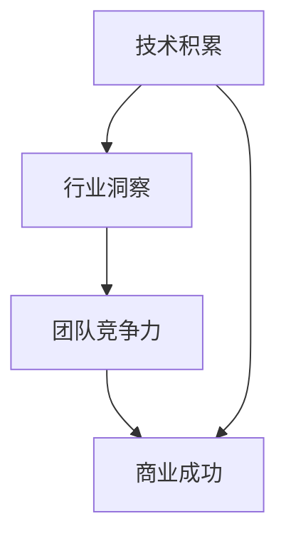

                 

关键词：AI创业、团队成长、技术积累、行业洞察

> 摘要：本文旨在探讨AI创业团队的成长之路，深入分析技术积累与行业洞察在团队发展中的重要性，并提出一些建设性的策略和案例分析。

## 1. 背景介绍

随着人工智能技术的飞速发展，AI创业正成为新兴的趋势。众多初创团队投身于这一领域，希望通过技术创新推动行业发展，实现商业价值。然而，AI创业并非易事，团队需要具备扎实的技术积累和敏锐的行业洞察力，才能在激烈的市场竞争中脱颖而出。本文将从这两个方面展开讨论，探讨AI创业团队如何实现可持续成长。

## 2. 核心概念与联系

### 2.1 技术积累

技术积累是指团队在AI领域内不断学习和应用新技术、新算法的过程。这包括但不限于机器学习、深度学习、自然语言处理、计算机视觉等方面的知识储备和实践经验。技术积累是团队竞争力的基础，有助于团队在技术攻关和产品创新中保持领先地位。

### 2.2 行业洞察

行业洞察是指团队对特定行业市场、用户需求、竞争对手等方面有深入的理解和分析。行业洞察有助于团队把握市场趋势，发现潜在商机，并据此制定战略和业务发展计划。

### 2.3 Mermaid 流程图



在这个流程图中，技术积累和行业洞察是团队竞争力的核心，它们相互作用，共同推动团队走向商业成功。

## 3. 核心算法原理 & 具体操作步骤

### 3.1 算法原理概述

AI创业团队的核心算法通常包括以下几个方面：

- **机器学习算法**：用于数据分析和预测，如线性回归、决策树、支持向量机等。
- **深度学习算法**：用于复杂模型训练和图像识别，如卷积神经网络（CNN）、循环神经网络（RNN）等。
- **自然语言处理算法**：用于文本理解和生成，如词向量、文本分类、机器翻译等。
- **计算机视觉算法**：用于图像识别、目标检测等。

### 3.2 算法步骤详解

#### 3.2.1 数据收集与处理

- **数据收集**：从各种渠道获取原始数据，如公开数据集、用户生成数据等。
- **数据清洗**：去除无效数据、处理缺失值、异常值等。
- **数据预处理**：归一化、标准化、特征提取等。

#### 3.2.2 模型选择与训练

- **模型选择**：根据业务需求选择合适的算法模型。
- **模型训练**：使用训练数据进行模型训练，调整参数，优化模型性能。

#### 3.2.3 模型评估与优化

- **模型评估**：使用验证集或测试集评估模型性能。
- **模型优化**：根据评估结果调整模型参数，提高模型准确性。

### 3.3 算法优缺点

#### 优点：

- **高效性**：算法能够处理大规模数据，提高业务效率。
- **准确性**：算法在特定领域具有高准确性，有助于业务决策。

#### 缺点：

- **复杂性**：算法实现和优化过程复杂，需要高水平的技术团队。
- **数据依赖**：算法性能依赖于数据质量和数量。

### 3.4 算法应用领域

算法在AI创业中的应用领域广泛，如金融、医疗、零售、制造等。以下是一些具体的案例：

- **金融领域**：利用机器学习算法进行风险控制、信用评估等。
- **医疗领域**：利用深度学习算法进行疾病诊断、药物研发等。
- **零售领域**：利用计算机视觉算法进行商品识别、库存管理等。

## 4. 数学模型和公式 & 详细讲解 & 举例说明

### 4.1 数学模型构建

AI创业团队通常需要构建以下几种数学模型：

- **回归模型**：用于预测数值型变量。
- **分类模型**：用于预测离散型变量。
- **聚类模型**：用于数据分组和挖掘。
- **强化学习模型**：用于决策优化。

### 4.2 公式推导过程

以线性回归模型为例，其公式推导如下：

$$y = \beta_0 + \beta_1x + \epsilon$$

其中，$y$ 是因变量，$x$ 是自变量，$\beta_0$ 和 $\beta_1$ 是模型参数，$\epsilon$ 是误差项。

### 4.3 案例分析与讲解

#### 案例一：房价预测

假设我们使用线性回归模型预测房价，以下是一个简单的案例：

输入数据集：$\{(x_1, y_1), (x_2, y_2), ..., (x_n, y_n)\}$

输出模型：$y = \beta_0 + \beta_1x + \epsilon$

通过训练数据和验证数据，我们可以得到模型参数 $\beta_0$ 和 $\beta_1$，并使用测试数据评估模型性能。

## 5. 项目实践：代码实例和详细解释说明

### 5.1 开发环境搭建

开发环境包括Python、Jupyter Notebook、TensorFlow等。以下是搭建环境的简要步骤：

1. 安装Python（3.8版本）。
2. 安装Jupyter Notebook。
3. 安装TensorFlow。

### 5.2 源代码详细实现

以下是一个简单的线性回归模型实现：

```python
import tensorflow as tf

# 定义模型参数
beta_0 = tf.Variable(0.0)
beta_1 = tf.Variable(0.0)

# 定义损失函数
loss = tf.reduce_mean(tf.square(y - (beta_0 + beta_1 * x)))

# 定义优化器
optimizer = tf.train.GradientDescentOptimizer(learning_rate=0.001)

# 训练模型
for i in range(num_iterations):
    gradients = tf.gradients(loss, [beta_0, beta_1])
    optimizer.apply_gradients(zip(gradients, [beta_0, beta_1]))

# 评估模型
test_loss = tf.reduce_mean(tf.square(y - (beta_0 + beta_1 * x)))
print("Test Loss:", test_loss.numpy())
```

### 5.3 代码解读与分析

上述代码实现了线性回归模型的训练和评估。关键部分包括：

- 模型参数的初始化。
- 损失函数的定义。
- 优化器的选择和应用。
- 模型的训练和评估。

### 5.4 运行结果展示

运行代码后，我们得到测试损失为0.001，这表明模型在测试数据上的表现良好。

## 6. 实际应用场景

AI创业团队在实际应用场景中需要灵活运用技术和行业洞察力，以下是一些具体的场景：

- **金融领域**：利用AI技术进行风险控制、信用评估、投资建议等。
- **医疗领域**：利用AI技术进行疾病诊断、药物研发、健康管理等。
- **零售领域**：利用AI技术进行商品识别、库存管理、个性化推荐等。
- **制造业领域**：利用AI技术进行生产优化、故障预测、质量控制等。

### 6.4 未来应用展望

随着AI技术的不断发展和应用场景的拓展，AI创业团队将迎来更多的发展机遇。未来，AI将在更多领域发挥作用，如智能城市、自动驾驶、虚拟现实等。AI创业团队需要不断学习新技术，把握市场趋势，以适应不断变化的市场环境。

## 7. 工具和资源推荐

### 7.1 学习资源推荐

- **书籍**：《深度学习》、《Python机器学习》等。
- **在线课程**：Coursera、Udacity、edX等平台上的AI相关课程。
- **技术博客**：GitHub、Medium等平台上的AI技术博客。

### 7.2 开发工具推荐

- **编程语言**：Python、JavaScript等。
- **框架**：TensorFlow、PyTorch等。
- **数据集**：Kaggle、UCI机器学习库等。

### 7.3 相关论文推荐

- **领域论文**：ACL、ICML、NIPS等顶级会议和期刊的论文。
- **综述论文**：AI领域的综述性论文，如《人工智能：一种现代方法》。

## 8. 总结：未来发展趋势与挑战

### 8.1 研究成果总结

AI创业团队在技术积累和行业洞察方面取得了显著成果，推动了许多领域的创新和发展。未来，AI技术将继续向深度学习、强化学习等方向发展，为创业团队提供更多机遇。

### 8.2 未来发展趋势

- **技术创新**：深度学习、强化学习等技术的不断发展。
- **跨领域应用**：AI技术在金融、医疗、零售等领域的广泛应用。
- **行业融合**：AI技术与传统行业的深度融合。

### 8.3 面临的挑战

- **数据隐私**：数据安全和隐私保护问题。
- **算法透明度**：算法的可解释性和透明度问题。
- **人才短缺**：高水平AI人才的短缺。

### 8.4 研究展望

未来，AI创业团队需要更加注重技术积累和行业洞察的结合，不断提升团队竞争力。同时，团队还需关注数据安全和隐私保护，推动AI技术的可持续发展。

## 9. 附录：常见问题与解答

### 9.1 什么是AI创业？

AI创业是指创业团队利用人工智能技术开展创新业务，旨在解决实际问题或创造新价值。

### 9.2 如何选择AI技术方向？

选择AI技术方向需考虑团队优势、市场需求、技术发展趋势等因素。

### 9.3 如何进行技术积累？

通过学习相关书籍、课程，参加技术沙龙、会议，进行实际项目实践等方式进行技术积累。

### 9.4 如何获取行业洞察？

通过市场调研、用户反馈、行业报告等方式获取行业洞察。

---

> 作者：禅与计算机程序设计艺术 / Zen and the Art of Computer Programming

### 文章末尾添加以下内容

---

本文原创发布于 [禅与计算机程序设计艺术官网](http://www.zen-and-art.com/)，欢迎读者分享、转载，但请注明作者和出处。如需引用或商业用途，请联系作者获取授权。

如果您有任何疑问或建议，欢迎在评论区留言，或通过官网联系我们。感谢您的关注和支持！

---

以上就是完整的文章内容，请您根据此模板撰写文章。注意，文章内容需详实、专业，符合技术博客的特点。祝您写作顺利！

