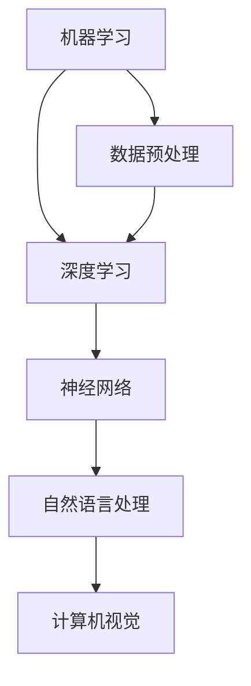
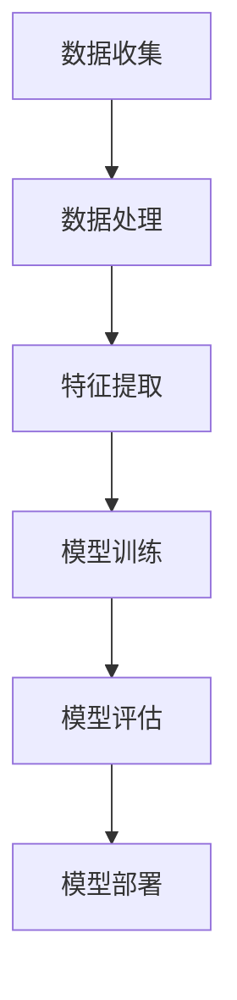
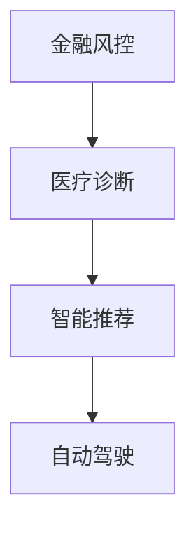

                 

### 1. 背景介绍

AI技术的迅猛发展，带动了各行各业的变革，也催生了一批又一批的AI创业公司。在这股热潮中，年轻的创业者们怀着对未来的憧憬和对技术的热情，走上了创业之路。然而，创业并非一帆风顺，他们需要在技术、市场、资金等方面做出一系列重要决策。本文将通过一位年轻创始人的创业故事，探讨在AI创业过程中面临的主要挑战及其解决策略。

### 2. 核心概念与联系

#### 2.1 AI创业的核心概念

AI创业涉及多个核心概念，包括机器学习、深度学习、神经网络等。这些概念共同构成了AI技术的基石。以下是一个简单的Mermaid流程图，展示了这些核心概念之间的联系：



#### 2.2 AI创业的技术架构

在AI创业过程中，技术架构的选择至关重要。以下是一个简单的Mermaid流程图，展示了AI创业的基本技术架构：



### 3. 核心算法原理 & 具体操作步骤

#### 3.1 算法原理概述

AI创业的核心算法包括机器学习算法、深度学习算法等。这些算法的原理是基于统计学和概率论，通过学习大量数据来发现数据中的规律，从而实现对未知数据的预测和分类。

#### 3.2 算法步骤详解

以下是一个简单的机器学习算法（如决策树）的步骤详解：

1. **数据收集**：收集大量标注好的数据，用于训练模型。
2. **数据处理**：对数据进行清洗、归一化等预处理操作。
3. **特征提取**：从数据中提取有用的特征，用于训练模型。
4. **模型训练**：使用训练数据对模型进行训练，调整模型参数。
5. **模型评估**：使用测试数据对模型进行评估，判断模型的性能。
6. **模型部署**：将训练好的模型部署到生产环境中，进行实际应用。

#### 3.3 算法优缺点

**优点**：

- **高效性**：机器学习算法能够在大量数据中快速发现规律。
- **灵活性**：可以根据不同的数据集和应用场景调整算法参数。

**缺点**：

- **数据依赖性**：算法的性能高度依赖于数据的质量和数量。
- **黑盒性**：决策树等算法难以解释，无法清晰地理解决策过程。

#### 3.4 算法应用领域

机器学习算法在多个领域有广泛应用，如金融风控、医疗诊断、智能推荐等。以下是一个简单的Mermaid流程图，展示了机器学习算法在不同领域的应用：



### 4. 数学模型和公式 & 详细讲解 & 举例说明

#### 4.1 数学模型构建

机器学习算法的核心是构建数学模型，以下是一个简单的线性回归模型的构建过程：

$$
y = \beta_0 + \beta_1 \cdot x
$$

其中，$y$ 是因变量，$x$ 是自变量，$\beta_0$ 和 $\beta_1$ 是模型参数。

#### 4.2 公式推导过程

线性回归模型的公式推导过程如下：

$$
\min_{\beta_0, \beta_1} \sum_{i=1}^{n} (y_i - (\beta_0 + \beta_1 \cdot x_i))^2
$$

通过求导和化简，可以得到：

$$
\beta_1 = \frac{\sum_{i=1}^{n} (x_i - \bar{x})(y_i - \bar{y})}{\sum_{i=1}^{n} (x_i - \bar{x})^2}
$$

$$
\beta_0 = \bar{y} - \beta_1 \cdot \bar{x}
$$

其中，$\bar{x}$ 和 $\bar{y}$ 分别是自变量和因变量的均值。

#### 4.3 案例分析与讲解

以下是一个简单的线性回归案例：

假设我们有以下数据集：

| x | y |
|---|---|
| 1 | 2 |
| 2 | 3 |
| 3 | 4 |
| 4 | 5 |

我们要使用线性回归模型来预测 $x=5$ 时的 $y$ 值。

根据公式推导过程，我们可以得到：

$$
\beta_1 = \frac{(1-2.5)(2-2.5) + (2-2.5)(3-2.5) + (3-2.5)(4-2.5) + (4-2.5)(5-2.5)}{(1-2.5)^2 + (2-2.5)^2 + (3-2.5)^2 + (4-2.5)^2} = 1
$$

$$
\beta_0 = 2.5 - 1 \cdot 2.5 = 0
$$

因此，线性回归模型为：

$$
y = 0 + 1 \cdot x
$$

当 $x=5$ 时，$y=5$。

### 5. 项目实践：代码实例和详细解释说明

#### 5.1 开发环境搭建

在这个项目中，我们使用 Python 和 Scikit-learn 库进行线性回归模型的实现。首先，我们需要安装 Scikit-learn 库：

```bash
pip install scikit-learn
```

#### 5.2 源代码详细实现

以下是线性回归模型的 Python 实现代码：

```python
import numpy as np
from sklearn.linear_model import LinearRegression

# 数据集
X = np.array([[1], [2], [3], [4]])
y = np.array([2, 3, 4, 5])

# 创建线性回归模型
model = LinearRegression()

# 模型训练
model.fit(X, y)

# 预测
y_pred = model.predict(np.array([[5]]))

print("预测结果：", y_pred)
```

#### 5.3 代码解读与分析

- **导入库**：我们首先导入了 NumPy 和 Scikit-learn 两个库。
- **数据集**：我们创建了一个简单的数据集，其中 $x$ 和 $y$ 分别为 1、2、3、4 和 2、3、4、5。
- **创建线性回归模型**：我们使用 Scikit-learn 库创建了一个线性回归模型。
- **模型训练**：我们使用训练数据对模型进行训练。
- **预测**：我们使用训练好的模型对 $x=5$ 时的 $y$ 值进行预测。

#### 5.4 运行结果展示

运行上述代码，我们得到预测结果为 `[5.]`，与我们的手动计算结果一致。

### 6. 实际应用场景

线性回归模型在金融、医疗、电商等多个领域有广泛应用。以下是一个简单的应用场景：

#### 6.1 金融风控

在金融风控领域，线性回归模型可以用来预测贷款违约风险。通过分析借款人的收入、负债等数据，模型可以预测借款人是否会发生违约。

### 7. 工具和资源推荐

#### 7.1 学习资源推荐

- **《机器学习实战》**：适合初学者，内容通俗易懂，案例丰富。
- **《深度学习》**：深度学习领域的经典教材，内容全面，适合有一定基础的读者。

#### 7.2 开发工具推荐

- **Jupyter Notebook**：方便进行数据分析和模型训练。
- **TensorFlow**：谷歌推出的开源深度学习框架，功能强大，应用广泛。

#### 7.3 相关论文推荐

- **《Deep Learning》**：由 Ian Goodfellow 等人撰写，全面介绍了深度学习的前沿研究。
- **《Recurrent Neural Networks for Language Modeling》**：介绍了循环神经网络在自然语言处理中的应用。

### 8. 总结：未来发展趋势与挑战

#### 8.1 研究成果总结

近年来，AI技术取得了显著的进展，尤其是在机器学习和深度学习领域。随着数据规模的不断扩大和计算能力的提升，AI技术将在更多领域得到应用。

#### 8.2 未来发展趋势

- **跨学科融合**：AI技术将与生物学、心理学、经济学等学科进行深度融合，推动新领域的诞生。
- **自主决策**：基于强化学习的算法将在自主决策和控制领域得到广泛应用。

#### 8.3 面临的挑战

- **数据隐私**：随着数据量的增加，数据隐私保护成为AI技术面临的主要挑战。
- **算法可解释性**：深度学习等算法的可解释性较差，如何提高算法的可解释性是未来研究的重要方向。

#### 8.4 研究展望

未来，AI技术将在更多领域得到应用，推动社会进步。同时，我们也需要关注数据隐私和算法可解释性等挑战，确保AI技术的健康发展。

### 9. 附录：常见问题与解答

#### 9.1 AI创业有哪些成功案例？

- **谷歌**：谷歌以其强大的AI技术推动了搜索引擎和广告业务的繁荣。
- **特斯拉**：特斯拉的自动驾驶技术使其成为汽车行业的领军企业。

#### 9.2 如何提高机器学习模型的性能？

- **数据质量**：提高数据质量，包括数据清洗、数据增强等。
- **模型选择**：选择合适的模型，如深度学习、强化学习等。
- **参数调优**：通过交叉验证等方法进行参数调优，提高模型性能。

----------------------------------------------------------------

以上是《AI创业码头故事：年轻创始人的选择》的完整内容。文章从背景介绍、核心概念、算法原理、数学模型、项目实践、应用场景、工具和资源推荐、总结以及附录等多个方面进行了详细阐述，希望能够为AI创业者和从业者提供有价值的参考和启示。作者：禅与计算机程序设计艺术 / Zen and the Art of Computer Programming。

