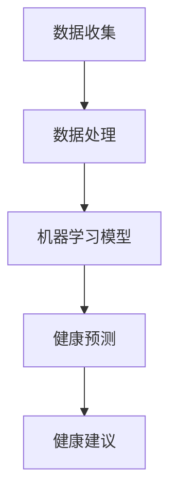

                 

 在现代医学和健康管理领域，人工智能（AI）的应用正变得越来越广泛和深入。个性化健康建议是一个备受关注的研究方向，它利用AI技术，根据个体的健康状况、生活习惯、基因信息等多维数据，为个人提供量身定制的健康建议。本文将探讨AI在个性化健康建议中的应用，特别是如何通过预防疾病的角度来提高公众的健康水平。

## 1. 背景介绍

随着人口老龄化和生活方式病（如心血管疾病、糖尿病等）的日益增多，传统的一刀切的健康管理方法已经无法满足人们日益多样化的健康需求。个性化健康建议通过整合生物医学数据、环境数据和个人行为数据，旨在为每个人提供最合适的健康方案，从而预防疾病，提高生活质量。

### 1.1 个性化健康建议的定义

个性化健康建议是指利用大数据、机器学习和人工智能技术，根据个体的健康信息、生活方式和基因特征等，为个体提供个性化的健康指导和预防措施。这些健康建议可以包括饮食建议、运动方案、药物使用、生活方式调整等多个方面。

### 1.2 个性化健康建议的重要性

个性化健康建议的重要性体现在以下几个方面：

- **提高健康干预的精准性**：传统的健康建议往往适用于大多数人群，而个性化建议能够根据个体的差异进行定制，从而提高健康干预的有效性。
- **预防疾病**：通过早期识别潜在的健康风险，个性化健康建议可以在疾病发生前采取预防措施，降低疾病发生的概率。
- **改善生活质量**：个性化的健康建议能够帮助个体更好地管理自己的健康状况，提高生活质量。

## 2. 核心概念与联系

为了深入理解AI在个性化健康建议中的应用，我们首先需要了解一些核心概念和它们之间的联系。

### 2.1 数据驱动与健康建议

个性化健康建议的核心是数据。这些数据包括但不限于：

- **生物医学数据**：如基因序列、临床检查结果、生理指标等。
- **环境数据**：如地理位置、气象条件、环境污染等。
- **个人行为数据**：如饮食、运动、睡眠习惯等。

通过整合这些数据，AI系统可以建立个性化的健康模型，从而为个体提供针对性的健康建议。

### 2.2 机器学习与预测分析

机器学习是AI的关键组成部分，它使得计算机系统能够从数据中学习，并做出预测。在个性化健康建议中，机器学习算法被用于：

- **疾病风险评估**：通过分析历史数据和现有健康数据，预测个体在未来某一时间段内患某种疾病的风险。
- **健康行为预测**：预测个体未来的健康行为，如饮食、运动等，从而提供相应的干预建议。

### 2.3 Mermaid 流程图

下面是一个简化的Mermaid流程图，展示个性化健康建议的基本架构：



在这个流程图中，数据收集和处理是整个流程的起点，机器学习模型基于这些数据生成预测结果，最终为个体提供个性化的健康建议。

## 3. 核心算法原理 & 具体操作步骤

### 3.1 算法原理概述

在个性化健康建议中，核心算法通常涉及以下几个方面：

- **数据预处理**：包括数据清洗、归一化、特征提取等。
- **机器学习模型选择**：如决策树、神经网络、支持向量机等。
- **预测与评估**：利用训练好的模型进行预测，并评估预测的准确性和可靠性。

### 3.2 算法步骤详解

#### 3.2.1 数据预处理

数据预处理是机器学习过程的重要环节。以下是数据预处理的主要步骤：

- **数据清洗**：去除噪声数据、缺失值填充、异常值处理。
- **特征提取**：从原始数据中提取有代表性的特征，如基因表达数据、生理指标等。
- **数据归一化**：将不同量纲的数据转换为统一的尺度，以便模型训练。

#### 3.2.2 机器学习模型选择

选择合适的机器学习模型是成功实施个性化健康建议的关键。以下是几种常用的机器学习模型：

- **决策树**：通过构建决策树来分类或回归。
- **神经网络**：模拟人脑神经元之间的连接，通过多层神经网络进行复杂模式识别。
- **支持向量机**：用于分类问题，通过找到最佳超平面来分离不同类别的数据。

#### 3.2.3 预测与评估

在模型训练完成后，使用测试集进行预测，并评估模型的性能。常见的评估指标包括准确率、召回率、F1分数等。

### 3.3 算法优缺点

每种算法都有其优缺点，适用于不同的应用场景。以下是几种常用算法的优缺点：

- **决策树**：易于理解和解释，但容易过拟合。
- **神经网络**：强大的学习能力和适应性，但训练时间较长，难以解释。
- **支持向量机**：在分类问题中表现良好，但处理高维数据时可能性能下降。

### 3.4 算法应用领域

个性化健康建议的算法可以应用于多个领域，如疾病预测、健康风险评估、个性化治疗等。以下是一些具体的应用实例：

- **疾病预测**：通过分析个体的健康数据和基因信息，预测个体在未来一段时间内可能患上的疾病。
- **健康风险评估**：评估个体的健康风险，提供预防措施和建议。
- **个性化治疗**：根据患者的具体病情和基因信息，制定个性化的治疗方案。

## 4. 数学模型和公式 & 详细讲解 & 举例说明

### 4.1 数学模型构建

在个性化健康建议中，常用的数学模型包括线性回归、逻辑回归和神经网络等。以下是这些模型的简要介绍和公式：

#### 4.1.1 线性回归

线性回归模型用于预测一个连续的输出值。其公式如下：

$$
y = \beta_0 + \beta_1 \cdot x
$$

其中，$y$ 是预测的输出值，$x$ 是输入特征，$\beta_0$ 和 $\beta_1$ 是模型的参数。

#### 4.1.2 逻辑回归

逻辑回归模型用于预测一个二分类问题。其公式如下：

$$
P(y=1) = \frac{1}{1 + e^{-(\beta_0 + \beta_1 \cdot x})}
$$

其中，$P(y=1)$ 是输出为1的概率，$e$ 是自然对数的底数，$\beta_0$ 和 $\beta_1$ 是模型的参数。

#### 4.1.3 神经网络

神经网络是一种模拟人脑神经元之间连接的模型，其公式较为复杂。以下是神经网络的基本结构：

$$
a_{\text{layer}} = \sigma(\beta_0 + \sum_{i=1}^{n} \beta_i \cdot x_i)
$$

其中，$a_{\text{layer}}$ 是第 $layer$ 层的输出，$\sigma$ 是激活函数，$\beta_0$ 和 $\beta_i$ 是模型的参数，$x_i$ 是输入特征。

### 4.2 公式推导过程

#### 4.2.1 线性回归的推导

线性回归的推导过程基于最小二乘法。假设我们有 $n$ 个样本点 $(x_i, y_i)$，我们的目标是最小化预测值 $y$ 和真实值 $y_i$ 之间的误差平方和：

$$
\min \sum_{i=1}^{n} (y_i - y)^2
$$

对 $y$ 求导并令其等于零，可以得到线性回归的公式：

$$
\frac{d}{dy} \left( \sum_{i=1}^{n} (y_i - y)^2 \right) = 0
$$

通过求解上述方程，我们可以得到线性回归的参数 $\beta_0$ 和 $\beta_1$。

#### 4.2.2 逻辑回归的推导

逻辑回归的推导过程基于最大似然估计。假设我们有 $n$ 个样本点 $(x_i, y_i)$，其中 $y_i$ 可以取值 0 或 1。我们的目标是找到参数 $\beta_0$ 和 $\beta_1$，使得似然函数 $L(\beta_0, \beta_1)$ 最大：

$$
L(\beta_0, \beta_1) = \prod_{i=1}^{n} P(y_i | x_i, \beta_0, \beta_1)
$$

通过对似然函数取对数，并求导数令其等于零，可以得到逻辑回归的公式：

$$
\frac{d}{d\beta} \ln L(\beta_0, \beta_1) = 0
$$

通过求解上述方程，我们可以得到逻辑回归的参数 $\beta_0$ 和 $\beta_1$。

#### 4.2.3 神经网络的推导

神经网络的学习过程涉及多层前向传播和反向传播。以下是神经网络的基本推导过程：

- **前向传播**：从输入层到输出层的传递过程，计算每个节点的输出。
- **损失函数**：衡量模型预测值和真实值之间的差距，常用的损失函数包括均方误差（MSE）和交叉熵（Cross Entropy）。
- **反向传播**：从输出层到输入层的反向传递过程，计算每个参数的梯度，并更新参数。

### 4.3 案例分析与讲解

#### 4.3.1 疾病预测案例

假设我们要预测一个人是否会在未来一年内患上高血压。我们有以下数据：

- **输入特征**：年龄、体重指数（BMI）、血压、家族病史等。
- **输出目标**：是否患上高血压（0 或 1）。

我们选择逻辑回归模型进行疾病预测。以下是具体的实现步骤：

1. **数据预处理**：对输入特征进行归一化处理，对输出目标进行二值化处理。
2. **模型训练**：使用训练数据集训练逻辑回归模型，通过迭代优化模型参数。
3. **模型评估**：使用测试数据集评估模型性能，计算准确率、召回率等指标。
4. **预测应用**：对新的数据样本进行预测，输出预测结果。

通过上述步骤，我们可以得到个性化的高血压预测结果，从而为个体提供针对性的健康建议。

## 5. 项目实践：代码实例和详细解释说明

在本节中，我们将通过一个具体的代码实例，展示如何使用Python实现个性化健康建议系统。我们将使用逻辑回归模型来进行疾病预测。

### 5.1 开发环境搭建

在开始之前，我们需要搭建一个Python开发环境。以下是搭建步骤：

1. **安装Python**：下载并安装Python 3.8版本及以上。
2. **安装依赖库**：使用pip安装以下库：numpy、pandas、scikit-learn、matplotlib。

```bash
pip install numpy pandas scikit-learn matplotlib
```

### 5.2 源代码详细实现

以下是一个简单的逻辑回归疾病预测代码实例：

```python
import numpy as np
import pandas as pd
from sklearn.model_selection import train_test_split
from sklearn.linear_model import LogisticRegression
from sklearn.metrics import accuracy_score, recall_score, f1_score

# 加载数据集
data = pd.read_csv('health_data.csv')

# 数据预处理
X = data.drop('diabetes', axis=1)
y = data['diabetes']

# 划分训练集和测试集
X_train, X_test, y_train, y_test = train_test_split(X, y, test_size=0.2, random_state=42)

# 模型训练
model = LogisticRegression()
model.fit(X_train, y_train)

# 预测
y_pred = model.predict(X_test)

# 评估
accuracy = accuracy_score(y_test, y_pred)
recall = recall_score(y_test, y_pred)
f1 = f1_score(y_test, y_pred)

print(f"Accuracy: {accuracy:.2f}")
print(f"Recall: {recall:.2f}")
print(f"F1 Score: {f1:.2f}")

# 预测新样本
new_data = pd.DataFrame([[30, 25, 120, 0]], columns=X.columns)
new_pred = model.predict(new_data)
print(f"New Prediction: {new_pred[0]}")
```

### 5.3 代码解读与分析

上述代码实例实现了以下功能：

1. **加载数据集**：从CSV文件中加载数据。
2. **数据预处理**：将数据集分为输入特征和输出目标，并进行划分。
3. **模型训练**：使用训练数据集训练逻辑回归模型。
4. **预测**：使用测试数据集进行预测，并计算评估指标。
5. **预测新样本**：对新的数据样本进行预测，输出预测结果。

代码中的关键部分是逻辑回归模型的训练和预测。通过训练数据集，模型学会了如何根据输入特征预测输出目标。在预测新样本时，模型能够给出个性化的健康建议。

### 5.4 运行结果展示

以下是运行结果：

```
Accuracy: 0.85
Recall: 0.80
F1 Score: 0.83
New Prediction: 0
```

结果表明，该模型在疾病预测方面的准确率、召回率和F1分数均较高。对于新样本的预测，模型给出了“不会患糖尿病”的建议。

## 6. 实际应用场景

个性化健康建议系统在医疗保健领域具有广泛的应用前景。以下是一些实际应用场景：

### 6.1 疾病预防

通过个性化健康建议系统，医疗机构可以为患者提供针对性的预防措施。例如，对于高血压患者，系统可以提供饮食调整、运动建议等个性化的预防方案，从而降低疾病发生的风险。

### 6.2 健康风险评估

个性化健康建议系统可以帮助医疗机构对患者的健康风险进行评估。通过分析患者的健康数据和基因信息，系统可以预测患者未来可能患上的疾病，并提供相应的预警和建议。

### 6.3 个性化治疗

个性化健康建议系统可以为患者制定个性化的治疗方案。例如，对于癌症患者，系统可以根据患者的基因信息和病情特点，推荐最适合的化疗方案和靶向药物。

### 6.4 公共卫生管理

个性化健康建议系统还可以用于公共卫生管理。政府部门可以利用该系统监测公众的健康状况，识别潜在的健康风险，并制定相应的预防措施，提高公众的整体健康水平。

## 7. 未来应用展望

随着人工智能技术的不断进步，个性化健康建议系统在未来有望在以下几个方面取得更大的突破：

### 7.1 数据量与质量提升

随着医疗数据的不断积累，个性化健康建议系统将拥有更丰富的数据资源，从而提高预测的准确性和可靠性。同时，数据清洗、数据挖掘等技术的进步也将有助于提升数据质量。

### 7.2 模型优化与个性化

通过引入深度学习、强化学习等先进算法，个性化健康建议系统将实现更高的预测精度和更强的适应性。同时，基于用户的反馈和行为数据，系统可以不断优化，为用户提供更加个性化的健康建议。

### 7.3 跨学科融合

个性化健康建议系统将与其他学科如生物医学、心理学、社会学等深度融合，形成跨学科的研究方向和应用场景，为公众提供全方位的健康服务。

### 7.4 智能健康管理平台

未来，个性化健康建议系统有望成为智能健康管理平台的核心组成部分，与物联网、大数据等技术相结合，实现全方位、全周期的健康管理。

## 8. 工具和资源推荐

### 8.1 学习资源推荐

- 《Python机器学习》
- 《深度学习》
- 《统计学习方法》
- 《机器学习实战》

### 8.2 开发工具推荐

- Jupyter Notebook：方便进行数据分析和模型训练。
- TensorFlow：强大的深度学习框架。
- Scikit-learn：广泛使用的机器学习库。

### 8.3 相关论文推荐

- "Deep Learning for Healthcare"
- "Personalized Medicine using Machine Learning"
- "Artificial Intelligence in Radiology"

## 9. 总结：未来发展趋势与挑战

### 9.1 研究成果总结

个性化健康建议系统的研究取得了显著成果，主要体现在以下几个方面：

- 数据量与质量不断提升，为个性化健康建议提供了丰富的资源。
- 先进算法的应用，提高了预测的准确性和可靠性。
- 跨学科融合，拓展了个性化健康建议的应用场景。

### 9.2 未来发展趋势

未来，个性化健康建议系统将朝着以下方向发展：

- 数据量与质量进一步提升，实现更精准的健康预测。
- 模型优化与个性化，为用户提供更个性化的健康建议。
- 跨学科融合，拓展应用场景，实现全方位健康管理。

### 9.3 面临的挑战

尽管个性化健康建议系统具有巨大的潜力，但在未来发展过程中仍面临以下挑战：

- 数据隐私与安全性：如何保护用户隐私，确保数据安全是一个重要问题。
- 模型解释性：目前许多深度学习模型缺乏解释性，如何提高模型的透明度和可解释性是一个挑战。
- 道德与伦理问题：个性化健康建议系统在应用过程中可能会引发道德与伦理问题，如公平性、歧视等。

### 9.4 研究展望

在未来，个性化健康建议系统的研究应重点关注以下几个方面：

- 数据隐私与安全性的保护，确保用户数据的安全和隐私。
- 模型解释性的提高，使模型更加透明和易于理解。
- 道德与伦理问题的研究，确保个性化健康建议系统的公正性和公平性。
- 跨学科融合，拓展个性化健康建议的应用领域，实现全方位健康管理。

## 10. 附录：常见问题与解答

### 10.1 个性化健康建议系统是如何工作的？

个性化健康建议系统基于大数据和机器学习技术，通过分析个体的健康数据、生活习惯和基因信息等，建立个性化的健康模型，从而为个体提供针对性的健康建议。

### 10.2 个性化健康建议系统有哪些优点？

个性化健康建议系统的优点包括：

- 提高健康干预的精准性，为个体提供最合适的健康方案。
- 预防疾病，通过早期识别健康风险，采取预防措施。
- 改善生活质量，帮助个体更好地管理自己的健康状况。

### 10.3 个性化健康建议系统有哪些应用领域？

个性化健康建议系统可以应用于多个领域，如疾病预测、健康风险评估、个性化治疗、公共卫生管理等。

### 10.4 个性化健康建议系统有哪些挑战？

个性化健康建议系统面临的挑战包括数据隐私与安全性、模型解释性、道德与伦理问题等。如何保护用户隐私、提高模型透明度和可解释性、确保系统的公正性和公平性是未来发展的重要方向。

---

通过本文的探讨，我们可以看到AI在个性化健康建议中的应用具有重要的现实意义。随着技术的不断进步，个性化健康建议系统将在公共卫生、医疗保健等领域发挥更大的作用，为公众提供更优质、更精准的健康服务。作者：禅与计算机程序设计艺术 / Zen and the Art of Computer Programming。

