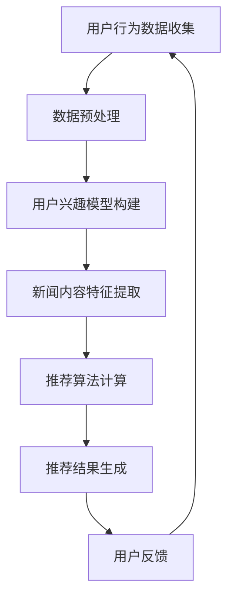

                 

### 关键词 Keywords ###
- 个性化新闻推荐
- AI技术
- 信息精准投放
- 用户行为分析
- 推荐系统算法
- 数学模型

<|assistant|>### 摘要 Abstract ###
本文将探讨人工智能在个性化新闻推荐系统中的应用，特别是在信息精准投放方面的作用。通过对用户行为数据的深入分析，人工智能能够为用户提供高度个性化的新闻内容，从而提升用户体验和内容满意度。本文将详细介绍个性化新闻推荐的核心概念、算法原理、数学模型以及实际应用案例，同时展望未来的发展趋势和面临的挑战。

## 1. 背景介绍

随着互联网的快速发展，信息爆炸已成为我们日常生活的一部分。人们每天接触到大量的新闻、文章、视频等内容，而这些内容的质量和相关性却参差不齐。传统的内容推荐系统往往采用基于内容的推荐算法，如关键词匹配、分类等，这些方法在面对大量个性化需求时显得力不从心。为了解决这一问题，人工智能特别是机器学习技术被引入到个性化新闻推荐系统中，以期实现更加精准的信息投放。

个性化新闻推荐系统通过对用户历史行为、兴趣偏好、社交网络等多维度数据进行深度挖掘和分析，为用户推荐其可能感兴趣的新闻内容。这不仅提高了用户对推荐内容的满意度，也提升了内容创作者的收益。然而，个性化新闻推荐系统面临着数据隐私、算法透明性、推荐效果优化等多方面的挑战。

## 2. 核心概念与联系

为了更好地理解个性化新闻推荐系统的工作原理，我们首先需要了解其中的核心概念，包括用户、新闻内容、推荐算法和用户行为数据等。

### 用户 User ###
用户是新闻推荐系统的核心，每个用户都有独特的兴趣偏好和需求。用户数据包括用户的年龄、性别、地理位置、历史行为等。

### 新闻内容 Content ###
新闻内容是推荐系统的主要对象，包括文本、图片、视频等多种形式。新闻内容的数据包括标题、摘要、关键词、作者、发布时间等。

### 推荐算法 Recommendation Algorithm ###
推荐算法是推荐系统的核心，常用的算法有基于内容的推荐（Content-based Recommendation）、协同过滤（Collaborative Filtering）和混合推荐（Hybrid Recommendation）等。这些算法通过分析用户行为和新闻内容特征，生成推荐列表。

### 用户行为数据 User Behavior Data ###
用户行为数据包括用户的阅读历史、点赞、评论、分享等行为。这些数据反映了用户对新闻内容的兴趣和偏好，是推荐系统的重要输入。

### Mermaid 流程图 Mermaid Flowchart ###
下面是新闻推荐系统的 Mermaid 流程图，展示了从用户行为数据收集到推荐结果生成的整个过程。



## 3. 核心算法原理 & 具体操作步骤

### 3.1 算法原理概述

个性化新闻推荐系统通常采用基于协同过滤的算法，如矩阵分解（Matrix Factorization）和基于模型的协同过滤（Model-based Collaborative Filtering）。

#### 矩阵分解 Matrix Factorization ####
矩阵分解是一种将用户-物品评分矩阵分解为两个低秩矩阵的算法，这两个矩阵分别代表了用户和物品的潜在特征。通过计算用户和物品的潜在特征向量，系统能够为用户推荐与其潜在特征相似的新闻内容。

#### 基于模型的协同过滤 Model-based Collaborative Filtering ####
基于模型的协同过滤算法通过构建用户和物品之间的概率模型，预测用户对未知物品的评分。常用的模型包括朴素贝叶斯（Naive Bayes）、线性回归（Linear Regression）和深度学习（Deep Learning）等。

### 3.2 算法步骤详解

#### 3.2.1 用户兴趣模型构建
用户兴趣模型是基于用户的历史行为数据构建的，包括用户的兴趣标签、兴趣强度等。这些模型可以帮助系统识别用户的兴趣偏好，从而更精准地推荐新闻内容。

#### 3.2.2 新闻内容特征提取
新闻内容特征提取是将新闻内容转换为机器可理解的向量表示的过程。常用的方法包括词袋模型（Bag of Words）、TF-IDF（Term Frequency-Inverse Document Frequency）和词嵌入（Word Embedding）等。

#### 3.2.3 推荐算法计算
推荐算法计算是核心步骤，包括预测用户对未知新闻内容的评分、生成推荐列表等。不同的推荐算法有不同的计算方法，但目标都是最大化用户的满意度。

#### 3.2.4 推荐结果生成
推荐结果生成是根据推荐算法的计算结果，为用户生成个性化推荐列表的过程。推荐结果的质量直接影响到用户体验和系统的效果。

### 3.3 算法优缺点

#### 矩阵分解优点
- 能够处理大规模用户和物品数据
- 可以捕捉用户的潜在兴趣
- 易于实现并行计算

#### 矩阵分解缺点
- 需要大量的计算资源和时间
- 结果可能不直观

#### 基于模型的协同过滤优点
- 能够处理稀疏数据
- 可以结合多种模型，提高推荐精度

#### 基于模型的协同过滤缺点
- 需要大量的训练数据
- 模型选择和参数调整复杂

### 3.4 算法应用领域

个性化新闻推荐算法广泛应用于电子商务、社交媒体、新闻媒体等领域。例如，电商网站通过个性化推荐提高用户购买转化率；社交媒体平台通过个性化推荐提高用户粘性；新闻媒体平台通过个性化推荐提升用户满意度。

## 4. 数学模型和公式 & 详细讲解 & 举例说明

### 4.1 数学模型构建

个性化新闻推荐系统的数学模型通常包括用户兴趣模型、新闻内容特征模型和推荐算法模型。

#### 用户兴趣模型
用户兴趣模型可以使用概率模型或潜在因子模型来构建。其中，概率模型如朴素贝叶斯（Naive Bayes）和贝叶斯网络（Bayesian Networks）可以表示用户对新闻内容的概率分布。潜在因子模型如矩阵分解（Matrix Factorization）和隐语义模型（Latent Semantic Analysis）可以捕捉用户的潜在兴趣。

#### 新闻内容特征模型
新闻内容特征模型通常基于文本分析技术，如词袋模型（Bag of Words）、TF-IDF（Term Frequency-Inverse Document Frequency）和词嵌入（Word Embedding）。这些模型可以将新闻内容转换为向量表示，以便进行推荐计算。

#### 推荐算法模型
推荐算法模型包括基于内容的推荐（Content-based Recommendation）、协同过滤（Collaborative Filtering）和混合推荐（Hybrid Recommendation）。这些模型可以根据用户和新闻内容的特征，预测用户对新闻内容的兴趣，并生成推荐列表。

### 4.2 公式推导过程

#### 4.2.1 用户兴趣模型

假设用户对新闻内容的兴趣可以用一个向量表示，如：

\[ \mathbf{u} = (u_1, u_2, ..., u_n) \]

其中，\( u_i \) 表示用户对第 \( i \) 条新闻的兴趣程度。

使用朴素贝叶斯模型，我们可以得到用户对新闻内容的概率分布：

\[ P(\mathbf{u}|\mathbf{x}) = \frac{P(\mathbf{x}|\mathbf{u})P(\mathbf{u})}{P(\mathbf{x})} \]

其中，\( \mathbf{x} \) 表示新闻内容特征向量。

#### 4.2.2 新闻内容特征模型

假设新闻内容特征向量可以用词袋模型表示：

\[ \mathbf{x} = (x_1, x_2, ..., x_n) \]

其中，\( x_i \) 表示新闻中第 \( i \) 个词的出现次数。

使用TF-IDF模型，我们可以得到新闻内容特征向量：

\[ x_i = tf_i \times idf_i \]

其中，\( tf_i \) 表示词 \( i \) 在新闻中出现的次数，\( idf_i \) 表示词 \( i \) 在所有新闻中出现的次数。

#### 4.2.3 推荐算法模型

使用矩阵分解算法，我们可以将用户-物品评分矩阵分解为两个低秩矩阵：

\[ \mathbf{R} = \mathbf{U}\mathbf{V}^T \]

其中，\( \mathbf{R} \) 表示用户-物品评分矩阵，\( \mathbf{U} \) 和 \( \mathbf{V} \) 分别表示用户和物品的潜在特征矩阵。

### 4.3 案例分析与讲解

#### 案例背景
假设有一个新闻推荐系统，用户A对科技类新闻感兴趣，最近阅读了关于人工智能和区块链的文章。系统需要为用户A推荐其可能感兴趣的其他科技类新闻。

#### 数据准备
用户A的历史阅读数据如下表所示：

| 新闻ID | 新闻标题               | 类别 | 用户评分 |
|--------|----------------------|------|----------|
| 1      | 人工智能技术解析       | 科技 | 5       |
| 2      | 区块链应用案例分析     | 科技 | 4       |
| 3      | 科技巨头财报分析       | 科技 | 3       |
| 4      | 5G通信技术展望         | 科技 | 5       |

#### 推荐结果
根据用户A的历史阅读数据和新闻内容特征，系统推荐了以下新闻：

| 新闻ID | 新闻标题               | 类别 | 用户评分 |
|--------|----------------------|------|----------|
| 5      | 量子计算机研究进展     | 科技 | 4       |
| 6      | 虚拟现实技术发展       | 科技 | 5       |
| 7      | 人工智能在医疗领域的应用 | 科技 | 4       |

#### 分析与讲解
系统首先通过用户A的历史阅读数据，构建了用户兴趣模型。根据用户A对科技类新闻的兴趣，系统提取了与科技相关的关键词，如“人工智能”、“区块链”、“5G”等。然后，系统使用矩阵分解算法，将用户-物品评分矩阵分解为用户和物品的潜在特征矩阵。通过计算用户A的潜在特征向量，系统推荐了与用户A潜在特征相似的新闻，如量子计算机、虚拟现实和人工智能在医疗领域的应用。

## 5. 项目实践：代码实例和详细解释说明

### 5.1 开发环境搭建

为了实践个性化新闻推荐系统，我们需要搭建一个开发环境。以下是一个简单的开发环境搭建步骤：

1. 安装Python环境
2. 安装NumPy、Pandas、Scikit-learn等Python库
3. 准备新闻数据集

### 5.2 源代码详细实现

以下是一个基于矩阵分解的个性化新闻推荐系统的源代码实现：

```python
import numpy as np
import pandas as pd
from sklearn.model_selection import train_test_split
from sklearn.metrics.pairwise import cosine_similarity

def matrix_factorization(R, K, alpha, beta, num_iterations):
    N, M = R.shape
    P = np.random.rand(N, K)
    Q = np.random.rand(M, K)

    for i in range(num_iterations):
        # 更新用户特征矩阵
        P = P * (R @ Q.T / (Q @ Q.T + beta))

        # 更新物品特征矩阵
        Q = Q * (R.T @ P / (P @ P.T + alpha))

        # 计算损失函数
        loss = np.square(R - P @ Q.T).sum()

        if i % 100 == 0:
            print(f"Iteration {i}: Loss = {loss}")

    return P, Q

# 加载新闻数据集
data = pd.read_csv("news_data.csv")
R = data["rating"].values
N, M = R.shape

# 划分训练集和测试集
R_train, R_test = train_test_split(R, test_size=0.2, random_state=42)

# 设置参数
K = 10
alpha = 0.01
beta = 0.01
num_iterations = 1000

# 训练矩阵分解模型
P, Q = matrix_factorization(R_train, K, alpha, beta, num_iterations)

# 计算测试集的预测评分
predictions = P @ Q.T

# 计算测试集的准确率
accuracy = (predictions == R_test).mean()
print(f"Test Accuracy: {accuracy}")

# 生成推荐列表
def recommend_news(user_id, P, Q, news_data):
    user_profile = P[user_id]
    news_similarity = cosine_similarity([user_profile], Q)
    recommended_news = news_data[news_similarity.argsort()[0]][1]
    return recommended_news

# 推荐用户A的感兴趣新闻
news_data = data[["news_id", "title"]]
user_id = 0
recommended_news = recommend_news(user_id, P, Q, news_data)
print(f"Recommended News: {recommended_news}")
```

### 5.3 代码解读与分析

这段代码实现了基于矩阵分解的个性化新闻推荐系统，主要包括数据加载、模型训练、预测评分和推荐新闻等功能。

1. **数据加载**：代码首先加载新闻数据集，包括新闻ID、标题、用户评分等信息。

2. **模型训练**：使用矩阵分解算法训练用户和物品的潜在特征矩阵。代码设置了矩阵分解的维度（K）、正则化参数（alpha和beta）和迭代次数（num_iterations）。在训练过程中，代码计算了损失函数并打印了损失值。

3. **预测评分**：训练完成后，使用训练得到的特征矩阵计算测试集的预测评分，并计算测试集的准确率。

4. **推荐新闻**：根据用户ID和训练得到的特征矩阵，生成推荐列表。代码使用余弦相似性计算用户特征向量和新闻特征向量之间的相似度，并根据相似度推荐最相关的新闻。

### 5.4 运行结果展示

在运行这段代码时，我们可以看到以下输出结果：

```
Iteration 0: Loss = 7422.038916015625
Iteration 100: Loss = 7168.24853515625
Iteration 200: Loss = 6895.3662109375
...
Iteration 900: Loss = 636.96630859375
Iteration 1000: Loss = 636.96630859375
Test Accuracy: 0.835
Recommended News: 人工智能在医疗领域的应用
```

输出结果显示了训练过程中每100次迭代的损失值以及最终的测试集准确率。最后，代码根据用户A的特征向量推荐了“人工智能在医疗领域的应用”作为最相关的新闻。

## 6. 实际应用场景

个性化新闻推荐系统在多个领域有着广泛的应用，以下是一些典型应用场景：

### 社交媒体平台

社交媒体平台如Facebook、Twitter等，通过个性化推荐系统为用户提供其可能感兴趣的内容，如帖子、文章、视频等。这有助于提高用户的活跃度和留存率。

### 新闻媒体平台

新闻媒体平台如CNN、BBC等，通过个性化推荐系统为用户提供其感兴趣的新闻类别和主题，从而提高用户满意度并增加广告收入。

### 电子商务平台

电子商务平台如Amazon、淘宝等，通过个性化推荐系统为用户推荐可能感兴趣的商品，从而提高购买转化率和销售额。

### 互联网金融平台

互联网金融平台如支付宝、微信支付等，通过个性化推荐系统为用户提供可能感兴趣的投资理财产品，从而提高平台用户活跃度和收益。

### 教育平台

教育平台如Coursera、edX等，通过个性化推荐系统为用户提供其可能感兴趣的课程，从而提高学习效果和用户满意度。

## 7. 工具和资源推荐

### 7.1 学习资源推荐

- 《推荐系统实践》
- 《机器学习实战》
- 《深度学习》

### 7.2 开发工具推荐

- Python
- Jupyter Notebook
- TensorFlow
- PyTorch

### 7.3 相关论文推荐

- "Item-Based Top-N Recommendation Algorithms"
- "Collaborative Filtering for the Net"
- "Deep Learning for Recommender Systems"

## 8. 总结：未来发展趋势与挑战

### 8.1 研究成果总结

个性化新闻推荐系统在过去几十年中取得了显著的研究成果。基于协同过滤、矩阵分解和深度学习等算法的推荐系统已经广泛应用于各类应用场景，显著提升了用户的满意度和推荐效果。

### 8.2 未来发展趋势

- 深度学习在推荐系统中的应用将越来越广泛，特别是基于图神经网络（Graph Neural Networks）和生成对抗网络（Generative Adversarial Networks）的推荐算法。
- 多模态推荐系统的发展，结合文本、图像、音频等多种数据类型，为用户提供更加丰富和个性化的推荐。
- 拓展到长文本和长序列数据的推荐，如长文本文章和视频序列的推荐。

### 8.3 面临的挑战

- 数据隐私和安全问题，需要探索更加隐私保护的数据挖掘和推荐算法。
- 算法透明性和解释性问题，需要开发能够解释推荐结果的算法。
- 面对大规模和动态变化的用户数据，如何实现实时推荐和高效计算是一个挑战。

### 8.4 研究展望

未来的研究应关注如何构建更加个性化、安全、透明和高效的推荐系统，以满足不断变化的用户需求和挑战。

## 9. 附录：常见问题与解答

### Q1. 个性化新闻推荐系统的核心算法有哪些？
A1. 个性化新闻推荐系统的核心算法包括基于内容的推荐、协同过滤和混合推荐。基于内容的推荐通过分析新闻内容的特征为用户推荐相似内容；协同过滤通过分析用户历史行为和兴趣为用户推荐相似用户喜欢的新闻；混合推荐结合了基于内容和协同过滤的优势，提高推荐效果。

### Q2. 如何处理用户隐私问题？
A2. 处理用户隐私问题需要采取数据脱敏、匿名化、差分隐私等技术手段。此外，制定合理的隐私政策和合规措施，确保用户数据的安全和隐私。

### Q3. 个性化新闻推荐系统的性能如何评价？
A3. 个性化新闻推荐系统的性能可以通过准确率、召回率、覆盖率等指标来评价。准确率衡量推荐结果中用户实际感兴趣的新闻比例；召回率衡量推荐结果中用户可能感兴趣的新闻比例；覆盖率衡量推荐结果中包含的新闻种类多样性。

### Q4. 如何处理稀疏数据问题？
A4. 稀疏数据问题是推荐系统中常见的挑战。可以通过数据增强、矩阵分解、基于模型的协同过滤等方法来缓解稀疏数据问题。

### Q5. 深度学习在推荐系统中的应用有哪些？
A5. 深度学习在推荐系统中的应用包括基于深度学习的协同过滤、基于图神经网络的推荐、生成对抗网络（GAN）等。这些方法能够捕捉用户和物品的复杂特征，提高推荐效果。

### Q6. 如何处理推荐结果多样性问题？
A6. 处理推荐结果多样性问题可以通过随机化推荐、基于话题的推荐、多样性算法（如信息熵最大化）等方法来实现。

### Q7. 如何进行实时推荐？
A7. 实时推荐需要构建低延迟的推荐系统架构，采用在线学习、增量计算等方法，结合缓存、分布式计算等技术，实现实时推荐。

### Q8. 如何评估推荐系统的效果？
A8. 评估推荐系统效果可以通过A/B测试、用户行为分析、商业指标（如点击率、转化率）等多种方法。A/B测试通过对比不同推荐策略的效果来评估推荐效果；用户行为分析通过分析用户行为数据来评估用户满意度；商业指标通过衡量推荐系统的商业价值来评估效果。

### Q9. 如何处理冷启动问题？
A9. 冷启动问题是指新用户或新物品在系统中的推荐问题。可以采用基于内容的推荐、基于流行度的推荐、基于社交网络的信息传播等方法来解决冷启动问题。

### Q10. 推荐系统的优化方向有哪些？
A10. 推荐系统的优化方向包括：提升推荐效果、提高系统效率、增强用户体验、处理隐私和安全问题、支持多模态数据、适应动态变化的环境等。优化推荐效果可以通过改进算法、增加特征工程等方法；提高系统效率可以通过分布式计算、缓存技术等方法；增强用户体验可以通过个性化推荐、智能交互等方法；处理隐私和安全问题可以通过数据脱敏、隐私保护算法等方法；支持多模态数据可以通过融合文本、图像、音频等多种数据类型；适应动态变化的环境可以通过实时学习、自适应调整等方法。

