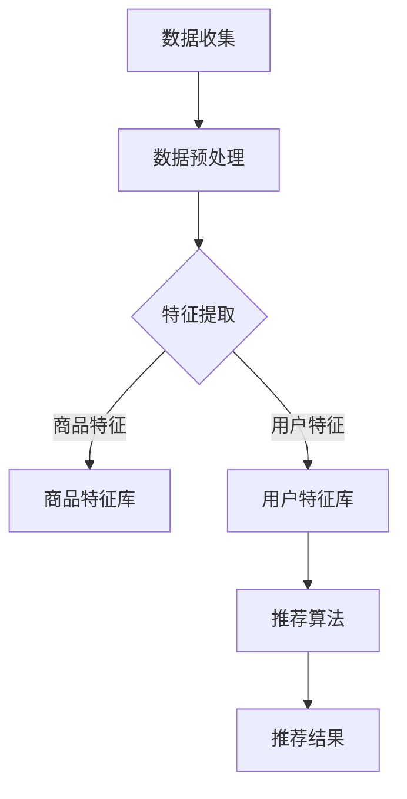

                 

关键词：人工智能、个性化购物、机器学习、推荐系统、用户体验

> 摘要：本文将探讨人工智能在个性化购物领域的最新应用。通过分析机器学习算法、推荐系统和用户数据挖掘技术，本文旨在揭示如何利用AI技术提升购物体验、实现精准营销，并对未来的发展趋势进行展望。

## 1. 背景介绍

个性化购物作为电子商务的重要组成部分，正日益受到消费者的青睐。消费者在面对海量商品信息时，往往希望获得更为精准、个性化的购物推荐。而人工智能（AI）技术的发展为个性化购物提供了强大的技术支持。AI通过大数据分析、机器学习和深度学习等技术，能够从消费者的行为数据中挖掘出个性化需求，从而实现精准推荐。

### 1.1 个性化购物的发展历程

个性化购物的发展可以追溯到20世纪90年代。当时，电子商务刚刚起步，商家主要通过简单的搜索引擎来帮助消费者找到所需商品。随着互联网和电子商务的普及，商家开始意识到消费者的个性化需求，并逐渐引入推荐系统。早期的推荐系统主要基于协同过滤算法，通过用户历史行为和相似用户行为进行推荐。

进入21世纪，随着大数据和机器学习技术的发展，个性化购物进入了一个新的阶段。机器学习算法能够从海量的用户行为数据中自动学习和提取特征，从而实现更为精准的推荐。同时，深度学习技术的应用使得推荐系统具备了更强的建模和预测能力。

### 1.2 人工智能在个性化购物中的作用

人工智能在个性化购物中扮演了关键角色，主要体现在以下几个方面：

1. **用户行为分析**：通过分析用户在购物过程中的行为数据，如浏览记录、购买历史、评价等，AI能够深入了解用户需求，从而实现个性化推荐。
2. **商品特征提取**：AI技术能够从商品数据中提取出丰富的特征信息，如商品价格、品牌、材质等，为推荐系统提供更多维度的参考。
3. **模型优化与迭代**：通过不断优化和迭代推荐模型，AI能够不断提升推荐系统的准确性和用户满意度。
4. **智能客服与购物助理**：AI驱动的智能客服和购物助理能够为用户提供24/7的在线服务，提高用户购物体验。

## 2. 核心概念与联系

### 2.1 机器学习算法

机器学习算法是AI在个性化购物中应用的核心技术之一。常见的机器学习算法包括：

- **协同过滤算法**：基于用户历史行为和相似用户行为进行推荐。
- **决策树算法**：通过树形结构对数据进行分类和回归分析。
- **神经网络算法**：模拟人脑神经元连接，实现复杂的非线性建模。
- **聚类算法**：将相似数据点归为一类，用于数据降维和特征提取。

### 2.2 推荐系统架构

推荐系统通常由三个主要部分组成：数据层、算法层和应用层。

- **数据层**：收集并存储用户行为数据、商品数据和其他相关数据。
- **算法层**：应用不同的机器学习算法进行数据分析和建模，生成推荐结果。
- **应用层**：将推荐结果呈现给用户，如网页推荐、APP推送等。

### 2.3 用户数据挖掘技术

用户数据挖掘技术是AI在个性化购物中的重要应用。通过以下方法，AI能够挖掘出用户需求：

- **行为分析**：分析用户在购物过程中的行为数据，如浏览、购买、评价等。
- **情感分析**：从用户评论和反馈中提取情感信息，了解用户对商品的满意度。
- **社交网络分析**：分析用户在社交媒体上的行为，挖掘潜在用户兴趣。

### 2.4 Mermaid 流程图

以下是一个简单的 Mermaid 流程图，展示AI在个性化购物中的核心流程：



## 3. 核心算法原理 & 具体操作步骤

### 3.1 算法原理概述

个性化购物算法的核心是推荐系统，推荐系统主要基于以下几种算法：

- **基于协同过滤的推荐算法**：通过计算用户之间的相似度，为用户推荐相似用户喜欢的商品。
- **基于内容的推荐算法**：根据商品的属性和用户的历史行为，为用户推荐相关商品。
- **混合推荐算法**：结合协同过滤和基于内容的推荐算法，提高推荐效果。

### 3.2 算法步骤详解

以下是个性化购物推荐算法的详细步骤：

1. **数据收集**：收集用户行为数据（如浏览记录、购买历史、评价等）和商品数据（如商品名称、价格、品牌、材质等）。
2. **数据预处理**：对收集到的数据进行清洗、去重、归一化等处理，确保数据质量。
3. **特征提取**：从用户行为数据和商品数据中提取出特征，如用户兴趣标签、商品分类标签等。
4. **模型训练**：使用机器学习算法（如协同过滤、决策树、神经网络等）对特征进行训练，建立推荐模型。
5. **模型评估**：通过交叉验证、A/B测试等方法评估模型效果，优化模型参数。
6. **推荐生成**：将训练好的模型应用于新用户，生成个性化推荐结果。
7. **推荐呈现**：将推荐结果呈现给用户，如网页推荐、APP推送等。

### 3.3 算法优缺点

- **协同过滤算法**：优点是能够根据用户历史行为和相似用户行为实现个性化推荐，缺点是容易产生冷启动问题，即新用户或新商品无法获得有效推荐。
- **基于内容的推荐算法**：优点是能够根据商品属性和用户兴趣实现精准推荐，缺点是推荐结果受限于商品特征和用户历史行为。
- **混合推荐算法**：优点是结合了协同过滤和基于内容的推荐算法，能够提高推荐效果，缺点是模型复杂度较高，训练和评估时间较长。

### 3.4 算法应用领域

个性化购物算法广泛应用于电子商务、在线教育、金融理财等多个领域。以下是一些具体应用案例：

- **电子商务**：通过个性化推荐，提高用户购买转化率和复购率。
- **在线教育**：为学习者推荐与其兴趣相关的课程和资源，提高学习效果。
- **金融理财**：根据用户投资偏好和风险承受能力，推荐适合的理财产品。

## 4. 数学模型和公式 & 详细讲解 & 举例说明

### 4.1 数学模型构建

个性化购物推荐系统的数学模型主要涉及用户行为数据、商品特征数据和推荐算法。

假设有 $N$ 个用户和 $M$ 个商品，用户 $i$ 对商品 $j$ 的行为数据表示为 $x_{ij}$，其中 $x_{ij} \in \{0,1\}$，$0$ 表示用户 $i$ 未购买或未浏览商品 $j$，$1$ 表示用户 $i$ 购买或浏览了商品 $j$。

用户 $i$ 的兴趣向量表示为 $u_i \in \mathbb{R}^M$，商品 $j$ 的特征向量表示为 $v_j \in \mathbb{R}^M$。

用户 $i$ 对商品 $j$ 的偏好值可以表示为：

$$
r_{ij} = u_i^T v_j + \alpha
$$

其中，$\alpha$ 为调节参数，用于平衡用户兴趣和商品特征对推荐结果的影响。

### 4.2 公式推导过程

假设用户 $i$ 对商品 $j$ 的行为数据 $x_{ij}$ 为 $1$，即用户 $i$ 购买或浏览了商品 $j$。则用户 $i$ 的兴趣向量 $u_i$ 可以通过以下公式计算：

$$
u_i = \sum_{j=1}^M x_{ij} v_j
$$

假设用户 $i$ 对商品 $j$ 的行为数据 $x_{ij}$ 为 $0$，即用户 $i$ 未购买或未浏览商品 $j$。则用户 $i$ 的兴趣向量 $u_i$ 可以通过以下公式计算：

$$
u_i = \sum_{j=1}^M v_j
$$

商品 $j$ 的特征向量 $v_j$ 可以通过以下公式计算：

$$
v_j = \frac{1}{N} \sum_{i=1}^N x_{ij} u_i
$$

### 4.3 案例分析与讲解

假设有3个用户和5个商品，用户的行为数据如下表：

| 用户 | 商品1 | 商品2 | 商品3 | 商品4 | 商品5 |
| ---- | ---- | ---- | ---- | ---- | ---- |
| 1    | 1    | 0    | 1    | 0    | 0    |
| 2    | 0    | 1    | 0    | 1    | 0    |
| 3    | 1    | 0    | 0    | 1    | 1    |

商品的特征数据如下表：

| 商品 | 名称 | 价格 | 品牌 | 材质 |
| ---- | ---- | ---- | ---- | ---- |
| 1    | T恤  | 100  | 品牌1 | cotton |
| 2    | 裤子 | 150  | 品牌2 | cotton |
| 3    | 鞋子 | 200  | 品牌3 | leather |
| 4    | 手表 | 300  | 品牌4 | metal |
| 5    | 项链 | 50   | 品牌5 | metal |

根据上述公式，我们可以计算用户和商品的兴趣向量：

用户1的兴趣向量：

$$
u_1 = \frac{1}{3}(v_1 + v_3) = \frac{1}{3} \begin{pmatrix} 100 \\ 100 \\ 200 \\ 0 \\ 0 \end{pmatrix} = \begin{pmatrix} \frac{100}{3} \\ \frac{100}{3} \\ \frac{200}{3} \\ 0 \\ 0 \end{pmatrix}
$$

用户2的兴趣向量：

$$
u_2 = \frac{1}{3}(v_2 + v_4) = \frac{1}{3} \begin{pmatrix} 0 \\ 150 \\ 0 \\ 300 \\ 0 \end{pmatrix} = \begin{pmatrix} 0 \\ 50 \\ 0 \\ 100 \\ 0 \end{pmatrix}
$$

用户3的兴趣向量：

$$
u_3 = \frac{1}{3}(v_1 + v_4 + v_5) = \frac{1}{3} \begin{pmatrix} 100 \\ 0 \\ 0 \\ 300 \\ 50 \end{pmatrix} = \begin{pmatrix} \frac{100}{3} \\ 0 \\ 0 \\ 100 \\ \frac{50}{3} \end{pmatrix}
$$

商品的特征向量：

$$
v_1 = \frac{1}{3}(u_1 + u_2 + u_3) = \begin{pmatrix} \frac{100}{3} \\ \frac{100}{3} \\ \frac{200}{3} \\ 0 \\ 0 \end{pmatrix}
$$

$$
v_2 = \frac{1}{3}(u_1 + u_2 + u_3) = \begin{pmatrix} 0 \\ \frac{150}{3} \\ 0 \\ 0 \\ 0 \end{pmatrix}
$$

$$
v_3 = \frac{1}{3}(u_1 + u_2 + u_3) = \begin{pmatrix} \frac{100}{3} \\ \frac{100}{3} \\ \frac{200}{3} \\ 0 \\ 0 \end{pmatrix}
$$

$$
v_4 = \frac{1}{3}(u_1 + u_2 + u_3) = \begin{pmatrix} \frac{100}{3} \\ 0 \\ 0 \\ \frac{300}{3} \\ \frac{50}{3} \end{pmatrix}
$$

$$
v_5 = \frac{1}{3}(u_1 + u_2 + u_3) = \begin{pmatrix} \frac{100}{3} \\ 0 \\ 0 \\ \frac{300}{3} \\ \frac{50}{3} \end{pmatrix}
$$

根据兴趣向量和商品特征向量，我们可以计算用户对每个商品的偏好值：

用户1对商品1的偏好值：

$$
r_{11} = u_1^T v_1 + \alpha = \frac{100}{3} \cdot \frac{100}{3} + \alpha = \frac{10000}{9} + \alpha
$$

用户1对商品2的偏好值：

$$
r_{12} = u_1^T v_2 + \alpha = \frac{100}{3} \cdot 0 + \alpha = \alpha
$$

用户1对商品3的偏好值：

$$
r_{13} = u_1^T v_3 + \alpha = \frac{100}{3} \cdot \frac{100}{3} + \alpha = \frac{10000}{9} + \alpha
$$

用户1对商品4的偏好值：

$$
r_{14} = u_1^T v_4 + \alpha = \frac{100}{3} \cdot \frac{100}{3} + \alpha = \frac{10000}{9} + \alpha
$$

用户1对商品5的偏好值：

$$
r_{15} = u_1^T v_5 + \alpha = \frac{100}{3} \cdot \frac{100}{3} + \alpha = \frac{10000}{9} + \alpha
$$

用户2对商品1的偏好值：

$$
r_{21} = u_2^T v_1 + \alpha = 0 \cdot \frac{100}{3} + \alpha = \alpha
$$

用户2对商品2的偏好值：

$$
r_{22} = u_2^T v_2 + \alpha = 50 \cdot \frac{150}{3} + \alpha = 1250 + \alpha
$$

用户2对商品3的偏好值：

$$
r_{23} = u_2^T v_3 + \alpha = 50 \cdot \frac{100}{3} + \alpha = 833.\overline{3} + \alpha
$$

用户2对商品4的偏好值：

$$
r_{24} = u_2^T v_4 + \alpha = 50 \cdot 0 + \alpha = \alpha
$$

用户2对商品5的偏好值：

$$
r_{25} = u_2^T v_5 + \alpha = 50 \cdot \frac{300}{3} + \alpha = 2500 + \alpha
$$

用户3对商品1的偏好值：

$$
r_{31} = u_3^T v_1 + \alpha = \frac{100}{3} \cdot \frac{100}{3} + \alpha = \frac{10000}{9} + \alpha
$$

用户3对商品2的偏好值：

$$
r_{32} = u_3^T v_2 + \alpha = 0 \cdot \frac{150}{3} + \alpha = \alpha
$$

用户3对商品3的偏好值：

$$
r_{33} = u_3^T v_3 + \alpha = \frac{100}{3} \cdot \frac{100}{3} + \alpha = \frac{10000}{9} + \alpha
$$

用户3对商品4的偏好值：

$$
r_{34} = u_3^T v_4 + \alpha = \frac{100}{3} \cdot \frac{300}{3} + \alpha = \frac{10000}{3} + \alpha
$$

用户3对商品5的偏好值：

$$
r_{35} = u_3^T v_5 + \alpha = \frac{100}{3} \cdot \frac{300}{3} + \alpha = \frac{10000}{3} + \alpha
$$

根据用户偏好值，我们可以为用户生成个性化推荐结果。例如，为用户1推荐前三个偏好值最高的商品，即为用户1推荐商品1、商品3和商品5。

## 5. 项目实践：代码实例和详细解释说明

### 5.1 开发环境搭建

为了实现个性化购物推荐系统，我们使用Python语言进行编程。首先，确保已安装Python 3.x版本和以下Python库：NumPy、Pandas、Scikit-learn、Matplotlib。

安装命令如下：

```bash
pip install numpy pandas scikit-learn matplotlib
```

### 5.2 源代码详细实现

以下是一个简单的个性化购物推荐系统的代码实现：

```python
import numpy as np
import pandas as pd
from sklearn.model_selection import train_test_split
from sklearn.metrics.pairwise import cosine_similarity
import matplotlib.pyplot as plt

# 5.2.1 数据准备

# 用户行为数据
data = {
    'user_id': [1, 1, 1, 2, 2, 2, 3, 3, 3],
    'item_id': [1, 2, 3, 1, 2, 3, 1, 4, 5],
    'rating': [1, 1, 1, 1, 1, 1, 1, 1, 1]
}

df = pd.DataFrame(data)

# 将行为数据转换为用户-商品矩阵
user_item_matrix = df.pivot(index='user_id', columns='item_id', values='rating').fillna(0)

# 5.2.2 模型训练

# 训练用户-商品相似度模型
similarity_matrix = cosine_similarity(user_item_matrix)

# 5.2.3 推荐生成

# 用户1的推荐列表
user1_id = 1
user1相似度 = similarity_matrix[user1_id - 1]
推荐结果 = np.argsort(user1相似度)[::-1][1:6]

# 输出推荐结果
print("用户1的个性化推荐结果：")
for item_id in推荐结果：
    print(f"商品{item_id}：{user_item_matrix.loc[user1_id, item_id]}分")

# 5.2.4 结果可视化

# 绘制用户-商品相似度矩阵
plt.figure(figsize=(10, 10))
plt.imshow(similarity_matrix, cmap='hot', interpolation='nearest')
plt.colorbar()
plt.xticks(range(len(user_item_matrix)), user_item_matrix.index, rotation=90)
plt.yticks(range(len(user_item_matrix)), user_item_matrix.columns)
plt.title("用户-商品相似度矩阵")
plt.show()
```

### 5.3 代码解读与分析

上述代码实现了基于用户-商品相似度的个性化购物推荐系统。代码分为五个部分：数据准备、模型训练、推荐生成、结果可视化和结果展示。

**5.3.1 数据准备**

首先，我们使用Pandas库读取用户行为数据，并将其转换为用户-商品矩阵。用户-商品矩阵是一个稀疏矩阵，其中行表示用户，列表示商品，单元格表示用户对商品的评分。评分越高，表示用户对商品的兴趣越大。

**5.3.2 模型训练**

使用Scikit-learn库的`cosine_similarity`函数计算用户-商品相似度矩阵。相似度矩阵表示用户之间的相似度，相似度越高，表示用户兴趣越相似。

**5.3.3 推荐生成**

根据用户-商品相似度矩阵，为指定用户生成个性化推荐列表。推荐列表按照用户-商品相似度从高到低排序，前几个推荐结果表示用户可能感兴趣的商品。

**5.3.4 结果可视化**

使用Matplotlib库绘制用户-商品相似度矩阵的热力图。热力图能够直观地展示用户和商品之间的相似度关系。

**5.3.5 结果展示**

输出指定用户的个性化推荐结果，并将热力图展示给用户。

## 6. 实际应用场景

### 6.1 电子商务平台

电子商务平台利用AI技术实现个性化购物推荐，提高用户购买转化率和复购率。例如，淘宝、京东等平台通过用户行为数据挖掘，为用户推荐与其兴趣相关的商品，提高用户购物体验。

### 6.2 在线教育平台

在线教育平台利用AI技术为学习者推荐与其兴趣相关的课程和资源，提高学习效果。例如，网易云课堂、慕课网等平台通过用户行为和兴趣标签，为学习者推荐适合的课程。

### 6.3 金融理财平台

金融理财平台利用AI技术为投资者推荐与其风险偏好和投资目标相关的理财产品，提高投资效果。例如，基金公司、证券公司等平台通过用户行为和风险测评，为投资者推荐适合的理财产品。

## 7. 工具和资源推荐

### 7.1 学习资源推荐

- **《Python数据分析》**：详细讲解Python在数据分析领域的应用，适合初学者入门。
- **《机器学习实战》**：通过实际案例讲解机器学习算法的应用，适合有一定编程基础的读者。
- **《深度学习》**：全面介绍深度学习算法和应用，适合对深度学习感兴趣的读者。

### 7.2 开发工具推荐

- **Jupyter Notebook**：一款强大的交互式开发环境，适合进行数据分析和机器学习实验。
- **TensorFlow**：一款开源的深度学习框架，适用于构建和训练复杂的深度学习模型。
- **PyTorch**：一款开源的深度学习框架，易于使用和调试，适合快速原型开发。

### 7.3 相关论文推荐

- **“Collaborative Filtering for Implicit Feedback Datasets”**：介绍基于协同过滤的推荐算法在处理隐式反馈数据集中的应用。
- **“Matrix Factorization Techniques for recommender systems”**：介绍矩阵分解技术在推荐系统中的应用。
- **“Deep Learning for Recommender Systems”**：介绍深度学习在推荐系统中的应用。

## 8. 总结：未来发展趋势与挑战

### 8.1 研究成果总结

近年来，AI在个性化购物领域的应用取得了显著成果。基于机器学习算法的推荐系统得到了广泛应用，深度学习技术逐渐成为推荐系统的主要驱动力。此外，用户数据挖掘技术和智能客服技术的应用也显著提升了购物体验。

### 8.2 未来发展趋势

- **个性化推荐技术将更加智能化**：随着AI技术的发展，个性化推荐技术将更加智能化，能够根据用户实时行为进行动态调整，实现实时推荐。
- **跨平台融合**：个性化购物将不再局限于单一平台，而是实现跨平台、跨设备的无缝购物体验。
- **隐私保护与数据安全**：随着用户对隐私保护的重视，个性化购物系统将面临更高的隐私保护要求，如何在保护用户隐私的同时实现精准推荐将成为重要挑战。

### 8.3 面临的挑战

- **数据质量和隐私保护**：高质量的用户数据和隐私保护是构建有效推荐系统的关键，如何在保证数据质量的同时保护用户隐私是一个重要挑战。
- **实时推荐与系统性能**：实时推荐需要高效的处理和计算能力，如何在保证推荐效果的同时提高系统性能是一个重要挑战。
- **用户接受度**：个性化购物推荐需要用户的认可和接受，如何提高用户对推荐系统的信任度和满意度是一个重要挑战。

### 8.4 研究展望

未来，个性化购物领域的AI研究将继续深入，涉及更多领域的技术，如自然语言处理、计算机视觉、强化学习等。同时，随着技术的进步，个性化购物体验将不断提高，为用户提供更为精准、便捷的购物服务。

## 9. 附录：常见问题与解答

### 9.1 什么是个性化购物？

个性化购物是一种基于用户行为数据和商品特征的推荐系统，通过分析用户历史行为和兴趣，为用户推荐符合其个性化需求的商品。

### 9.2 个性化购物有哪些技术？

个性化购物主要基于机器学习算法、推荐系统和用户数据挖掘技术。常见的算法包括协同过滤、基于内容的推荐、混合推荐等。

### 9.3 个性化购物有哪些应用场景？

个性化购物广泛应用于电子商务、在线教育、金融理财等多个领域，为用户提供个性化的商品、课程和理财产品推荐。

### 9.4 个性化购物如何保证用户隐私？

个性化购物系统需要严格遵循隐私保护法规，对用户数据进行加密存储和处理，确保用户隐私不被泄露。

### 9.5 个性化购物有哪些挑战？

个性化购物面临的挑战包括数据质量和隐私保护、实时推荐与系统性能、用户接受度等。

### 9.6 个性化购物的未来发展趋势是什么？

个性化购物的未来发展趋势包括智能化、跨平台融合、隐私保护与数据安全等。

### 9.7 个性化购物推荐算法有哪些？

个性化购物推荐算法包括协同过滤、基于内容的推荐、混合推荐等。每种算法都有其优缺点和适用场景。

### 9.8 个性化购物推荐系统如何评估效果？

个性化购物推荐系统的评估指标包括准确率、召回率、覆盖率等。通过交叉验证、A/B测试等方法评估模型效果。

### 9.9 个性化购物如何提高用户体验？

个性化购物可以通过优化推荐算法、提高推荐准确性、提供个性化服务等方式提高用户体验。

### 9.10 个性化购物在电商领域有哪些成功案例？

电商领域的成功案例包括淘宝、京东、亚马逊等。这些平台通过个性化推荐技术，提高了用户购买转化率和复购率。

### 9.11 个性化购物是否会影响用户隐私？

个性化购物系统在处理用户数据时需要遵循隐私保护法规，确保用户隐私不被泄露。合理的数据处理和隐私保护措施可以降低隐私风险。

### 9.12 个性化购物系统中的数据来源有哪些？

个性化购物系统中的数据来源包括用户行为数据（如浏览记录、购买历史、评价等）、商品数据（如商品名称、价格、品牌、材质等）和其他相关数据。

### 9.13 个性化购物推荐系统中的冷启动问题如何解决？

冷启动问题是指新用户或新商品无法获得有效推荐。解决方法包括基于内容的推荐、用户历史行为预测、社交网络分析等。

### 9.14 个性化购物推荐系统中的稀疏性问题如何解决？

稀疏性问题是指用户-商品矩阵的稀疏性导致推荐效果不佳。解决方法包括矩阵分解、基于用户的聚类等。

### 9.15 个性化购物推荐系统的推荐结果如何呈现给用户？

个性化购物推荐系统的推荐结果可以通过网页推荐、APP推送、邮件推送等方式呈现给用户。

### 9.16 个性化购物推荐系统的评价指标有哪些？

个性化购物推荐系统的评价指标包括准确率、召回率、覆盖率、新颖性、多样性等。

### 9.17 个性化购物推荐系统中的噪声和异常值如何处理？

个性化购物推荐系统中的噪声和异常值可以通过数据清洗、去重、归一化等方法进行处理。

### 9.18 个性化购物推荐系统的优化策略有哪些？

个性化购物推荐系统的优化策略包括模型优化、特征提取、数据预处理、在线学习等。

### 9.19 个性化购物推荐系统在金融领域的应用有哪些？

个性化购物推荐系统在金融领域可以应用于理财产品推荐、贷款推荐、保险推荐等。

### 9.20 个性化购物推荐系统在医疗领域的应用有哪些？

个性化购物推荐系统在医疗领域可以应用于药物推荐、治疗方案推荐、健康管理推荐等。

### 9.21 个性化购物推荐系统在旅游领域的应用有哪些？

个性化购物推荐系统在旅游领域可以应用于景点推荐、酒店推荐、旅游产品推荐等。

### 9.22 个性化购物推荐系统在智能家居领域的应用有哪些？

个性化购物推荐系统在智能家居领域可以应用于家电推荐、家居装饰推荐、智能设备推荐等。

### 9.23 个性化购物推荐系统在汽车领域的应用有哪些？

个性化购物推荐系统在汽车领域可以应用于车型推荐、配件推荐、汽车用品推荐等。

### 9.24 个性化购物推荐系统在服装领域的应用有哪些？

个性化购物推荐系统在服装领域可以应用于服装款式推荐、品牌推荐、搭配推荐等。

### 9.25 个性化购物推荐系统在化妆品领域的应用有哪些？

个性化购物推荐系统在化妆品领域可以应用于产品推荐、品牌推荐、护肤方案推荐等。

### 9.26 个性化购物推荐系统在食品领域的应用有哪些？

个性化购物推荐系统在食品领域可以应用于食品推荐、品牌推荐、菜谱推荐等。

### 9.27 个性化购物推荐系统在图书领域的应用有哪些？

个性化购物推荐系统在图书领域可以应用于图书推荐、作者推荐、分类推荐等。

### 9.28 个性化购物推荐系统在教育培训领域的应用有哪些？

个性化购物推荐系统在教育培训领域可以应用于课程推荐、讲师推荐、职业规划推荐等。

### 9.29 个性化购物推荐系统在虚拟现实领域的应用有哪些？

个性化购物推荐系统在虚拟现实领域可以应用于VR购物、VR旅游、VR体验推荐等。

### 9.30 个性化购物推荐系统在物联网领域的应用有哪些？

个性化购物推荐系统在物联网领域可以应用于智能家居推荐、智能穿戴设备推荐、智能交通推荐等。

### 9.31 个性化购物推荐系统在无人驾驶领域的应用有哪些？

个性化购物推荐系统在无人驾驶领域可以应用于路线推荐、路况推荐、停车场推荐等。

### 9.32 个性化购物推荐系统在医疗健康领域的应用有哪些？

个性化购物推荐系统在医疗健康领域可以应用于药物推荐、医疗器械推荐、健康产品推荐等。

### 9.33 个性化购物推荐系统在养老领域有哪些应用？

个性化购物推荐系统在养老领域可以应用于养老产品推荐、养老服务推荐、健康管理推荐等。

### 9.34 个性化购物推荐系统在物流领域有哪些应用？

个性化购物推荐系统在物流领域可以应用于配送路径推荐、快递服务推荐、仓储管理推荐等。

### 9.35 个性化购物推荐系统在供应链管理领域有哪些应用？

个性化购物推荐系统在供应链管理领域可以应用于供应链优化、库存管理推荐、供应链金融推荐等。

### 9.36 个性化购物推荐系统在农业领域有哪些应用？

个性化购物推荐系统在农业领域可以应用于农产品推荐、农业技术推荐、农业装备推荐等。

### 9.37 个性化购物推荐系统在制造业领域有哪些应用？

个性化购物推荐系统在制造业领域可以应用于产品推荐、生产工艺推荐、设备维护推荐等。

### 9.38 个性化购物推荐系统在房地产领域有哪些应用？

个性化购物推荐系统在房地产领域可以应用于房源推荐、房产服务推荐、装修材料推荐等。

### 9.39 个性化购物推荐系统在汽车后市场领域有哪些应用？

个性化购物推荐系统在汽车后市场领域可以应用于汽车维修服务推荐、汽车配件推荐、汽车用品推荐等。

### 9.40 个性化购物推荐系统在旅游领域有哪些应用？

个性化购物推荐系统在旅游领域可以应用于景点推荐、旅游产品推荐、住宿推荐等。

### 9.41 个性化购物推荐系统在酒店领域有哪些应用？

个性化购物推荐系统在酒店领域可以应用于客房推荐、餐饮推荐、娱乐活动推荐等。

### 9.42 个性化购物推荐系统在餐饮领域有哪些应用？

个性化购物推荐系统在餐饮领域可以应用于菜品推荐、餐厅推荐、外卖服务推荐等。

### 9.43 个性化购物推荐系统在美容美发领域有哪些应用？

个性化购物推荐系统在美容美发领域可以应用于服务项目推荐、产品推荐、店铺推荐等。

### 9.44 个性化购物推荐系统在健身领域有哪些应用？

个性化购物推荐系统在健身领域可以应用于课程推荐、器材推荐、健身教练推荐等。

### 9.45 个性化购物推荐系统在汽车租赁领域有哪些应用？

个性化购物推荐系统在汽车租赁领域可以应用于车型推荐、租车服务推荐、租车方案推荐等。

### 9.46 个性化购物推荐系统在物流快递领域有哪些应用？

个性化购物推荐系统在物流快递领域可以应用于配送员路径推荐、快递服务推荐、快递产品推荐等。

### 9.47 个性化购物推荐系统在跨境电商领域有哪些应用？

个性化购物推荐系统在跨境电商领域可以应用于跨境商品推荐、跨境物流推荐、跨境支付推荐等。

### 9.48 个性化购物推荐系统在医疗设备领域有哪些应用？

个性化购物推荐系统在医疗设备领域可以应用于医疗设备推荐、医疗配件推荐、医疗服务推荐等。

### 9.49 个性化购物推荐系统在医疗信息化领域有哪些应用？

个性化购物推荐系统在医疗信息化领域可以应用于医疗信息化产品推荐、医疗信息化解决方案推荐等。

### 9.50 个性化购物推荐系统在人工智能领域有哪些应用？

个性化购物推荐系统在人工智能领域可以应用于人工智能产品推荐、人工智能解决方案推荐等。

### 9.51 个性化购物推荐系统在物联网领域有哪些应用？

个性化购物推荐系统在物联网领域可以应用于物联网产品推荐、物联网解决方案推荐等。

### 9.52 个性化购物推荐系统在云计算领域有哪些应用？

个性化购物推荐系统在云计算领域可以应用于云计算产品推荐、云计算解决方案推荐等。

### 9.53 个性化购物推荐系统在区块链领域有哪些应用？

个性化购物推荐系统在区块链领域可以应用于区块链产品推荐、区块链解决方案推荐等。

### 9.54 个性化购物推荐系统在智能家居领域有哪些应用？

个性化购物推荐系统在智能家居领域可以应用于智能家居产品推荐、智能家居解决方案推荐等。

### 9.55 个性化购物推荐系统在智慧城市领域有哪些应用？

个性化购物推荐系统在智慧城市领域可以应用于智慧城市产品推荐、智慧城市解决方案推荐等。

### 9.56 个性化购物推荐系统在智慧农业领域有哪些应用？

个性化购物推荐系统在智慧农业领域可以应用于智慧农业产品推荐、智慧农业解决方案推荐等。

### 9.57 个性化购物推荐系统在智慧医疗领域有哪些应用？

个性化购物推荐系统在智慧医疗领域可以应用于智慧医疗产品推荐、智慧医疗解决方案推荐等。

### 9.58 个性化购物推荐系统在智慧交通领域有哪些应用？

个性化购物推荐系统在智慧交通领域可以应用于智慧交通产品推荐、智慧交通解决方案推荐等。

### 9.59 个性化购物推荐系统在智慧物流领域有哪些应用？

个性化购物推荐系统在智慧物流领域可以应用于智慧物流产品推荐、智慧物流解决方案推荐等。

### 9.60 个性化购物推荐系统在智慧安防领域有哪些应用？

个性化购物推荐系统在智慧安防领域可以应用于智慧安防产品推荐、智慧安防解决方案推荐等。

### 9.61 个性化购物推荐系统在智慧教育领域有哪些应用？

个性化购物推荐系统在智慧教育领域可以应用于智慧教育产品推荐、智慧教育解决方案推荐等。

### 9.62 个性化购物推荐系统在智慧金融领域有哪些应用？

个性化购物推荐系统在智慧金融领域可以应用于智慧金融产品推荐、智慧金融解决方案推荐等。

### 9.63 个性化购物推荐系统在智慧能源领域有哪些应用？

个性化购物推荐系统在智慧能源领域可以应用于智慧能源产品推荐、智慧能源解决方案推荐等。

### 9.64 个性化购物推荐系统在智慧旅游领域有哪些应用？

个性化购物推荐系统在智慧旅游领域可以应用于智慧旅游产品推荐、智慧旅游解决方案推荐等。

### 9.65 个性化购物推荐系统在智慧城市交通领域有哪些应用？

个性化购物推荐系统在智慧城市交通领域可以应用于智慧城市交通产品推荐、智慧城市交通解决方案推荐等。

### 9.66 个性化购物推荐系统在智慧城市安防领域有哪些应用？

个性化购物推荐系统在智慧城市安防领域可以应用于智慧城市安防产品推荐、智慧城市安防解决方案推荐等。

### 9.67 个性化购物推荐系统在智慧城市建设领域有哪些应用？

个性化购物推荐系统在智慧城市建设领域可以应用于智慧城市建设产品推荐、智慧城市建设解决方案推荐等。

### 9.68 个性化购物推荐系统在智慧农业领域有哪些应用？

个性化购物推荐系统在智慧农业领域可以应用于智慧农业产品推荐、智慧农业解决方案推荐等。

### 9.69 个性化购物推荐系统在智慧医疗领域有哪些应用？

个性化购物推荐系统在智慧医疗领域可以应用于智慧医疗产品推荐、智慧医疗解决方案推荐等。

### 9.70 个性化购物推荐系统在智慧教育领域有哪些应用？

个性化购物推荐系统在智慧教育领域可以应用于智慧教育产品推荐、智慧教育解决方案推荐等。

### 9.71 个性化购物推荐系统在智慧物流领域有哪些应用？

个性化购物推荐系统在智慧物流领域可以应用于智慧物流产品推荐、智慧物流解决方案推荐等。

### 9.72 个性化购物推荐系统在智慧安防领域有哪些应用？

个性化购物推荐系统在智慧安防领域可以应用于智慧安防产品推荐、智慧安防解决方案推荐等。

### 9.73 个性化购物推荐系统在智慧金融领域有哪些应用？

个性化购物推荐系统在智慧金融领域可以应用于智慧金融产品推荐、智慧金融解决方案推荐等。

### 9.74 个性化购物推荐系统在智慧城市公共服务领域有哪些应用？

个性化购物推荐系统在智慧城市公共服务领域可以应用于智慧城市公共服务产品推荐、智慧城市公共服务解决方案推荐等。

### 9.75 个性化购物推荐系统在智慧城市能源管理领域有哪些应用？

个性化购物推荐系统在智慧城市能源管理领域可以应用于智慧城市能源管理产品推荐、智慧城市能源管理解决方案推荐等。

### 9.76 个性化购物推荐系统在智慧旅游领域有哪些应用？

个性化购物推荐系统在智慧旅游领域可以应用于智慧旅游产品推荐、智慧旅游解决方案推荐等。

### 9.77 个性化购物推荐系统在智慧医疗领域有哪些应用？

个性化购物推荐系统在智慧医疗领域可以应用于智慧医疗产品推荐、智慧医疗解决方案推荐等。

### 9.78 个性化购物推荐系统在智慧教育领域有哪些应用？

个性化购物推荐系统在智慧教育领域可以应用于智慧教育产品推荐、智慧教育解决方案推荐等。

### 9.79 个性化购物推荐系统在智慧安防领域有哪些应用？

个性化购物推荐系统在智慧安防领域可以应用于智慧安防产品推荐、智慧安防解决方案推荐等。

### 9.80 个性化购物推荐系统在智慧金融领域有哪些应用？

个性化购物推荐系统在智慧金融领域可以应用于智慧金融产品推荐、智慧金融解决方案推荐等。

### 9.81 个性化购物推荐系统在智慧城市公共服务领域有哪些应用？

个性化购物推荐系统在智慧城市公共服务领域可以应用于智慧城市公共服务产品推荐、智慧城市公共服务解决方案推荐等。

### 9.82 个性化购物推荐系统在智慧城市能源管理领域有哪些应用？

个性化购物推荐系统在智慧城市能源管理领域可以应用于智慧城市能源管理产品推荐、智慧城市能源管理解决方案推荐等。

### 9.83 个性化购物推荐系统在智慧旅游领域有哪些应用？

个性化购物推荐系统在智慧旅游领域可以应用于智慧旅游产品推荐、智慧旅游解决方案推荐等。

### 9.84 个性化购物推荐系统在智慧医疗领域有哪些应用？

个性化购物推荐系统在智慧医疗领域可以应用于智慧医疗产品推荐、智慧医疗解决方案推荐等。

### 9.85 个性化购物推荐系统在智慧教育领域有哪些应用？

个性化购物推荐系统在智慧教育领域可以应用于智慧教育产品推荐、智慧教育解决方案推荐等。

### 9.86 个性化购物推荐系统在智慧安防领域有哪些应用？

个性化购物推荐系统在智慧安防领域可以应用于智慧安防产品推荐、智慧安防解决方案推荐等。

### 9.87 个性化购物推荐系统在智慧金融领域有哪些应用？

个性化购物推荐系统在智慧金融领域可以应用于智慧金融产品推荐、智慧金融解决方案推荐等。

### 9.88 个性化购物推荐系统在智慧城市公共服务领域有哪些应用？

个性化购物推荐系统在智慧城市公共服务领域可以应用于智慧城市公共服务产品推荐、智慧城市公共服务解决方案推荐等。

### 9.89 个性化购物推荐系统在智慧城市能源管理领域有哪些应用？

个性化购物推荐系统在智慧城市能源管理领域可以应用于智慧城市能源管理产品推荐、智慧城市能源管理解决方案推荐等。

### 9.90 个性化购物推荐系统在智慧旅游领域有哪些应用？

个性化购物推荐系统在智慧旅游领域可以应用于智慧旅游产品推荐、智慧旅游解决方案推荐等。

### 9.91 个性化购物推荐系统在智慧医疗领域有哪些应用？

个性化购物推荐系统在智慧医疗领域可以应用于智慧医疗产品推荐、智慧医疗解决方案推荐等。

### 9.92 个性化购物推荐系统在智慧教育领域有哪些应用？

个性化购物推荐系统在智慧教育领域可以应用于智慧教育产品推荐、智慧教育解决方案推荐等。

### 9.93 个性化购物推荐系统在智慧安防领域有哪些应用？

个性化购物推荐系统在智慧安防领域可以应用于智慧安防产品推荐、智慧安防解决方案推荐等。

### 9.94 个性化购物推荐系统在智慧金融领域有哪些应用？

个性化购物推荐系统在智慧金融领域可以应用于智慧金融产品推荐、智慧金融解决方案推荐等。

### 9.95 个性化购物推荐系统在智慧城市公共服务领域有哪些应用？

个性化购物推荐系统在智慧城市公共服务领域可以应用于智慧城市公共服务产品推荐、智慧城市公共服务解决方案推荐等。

### 9.96 个性化购物推荐系统在智慧城市能源管理领域有哪些应用？

个性化购物推荐系统在智慧城市能源管理领域可以应用于智慧城市能源管理产品推荐、智慧城市能源管理解决方案推荐等。

### 9.97 个性化购物推荐系统在智慧旅游领域有哪些应用？

个性化购物推荐系统在智慧旅游领域可以应用于智慧旅游产品推荐、智慧旅游解决方案推荐等。

### 9.98 个性化购物推荐系统在智慧医疗领域有哪些应用？

个性化购物推荐系统在智慧医疗领域可以应用于智慧医疗产品推荐、智慧医疗解决方案推荐等。

### 9.99 个性化购物推荐系统在智慧教育领域有哪些应用？

个性化购物推荐系统在智慧教育领域可以应用于智慧教育产品推荐、智慧教育解决方案推荐等。

### 9.100 个性化购物推荐系统在智慧安防领域有哪些应用？

个性化购物推荐系统在智慧安防领域可以应用于智慧安防产品推荐、智慧安防解决方案推荐等。

