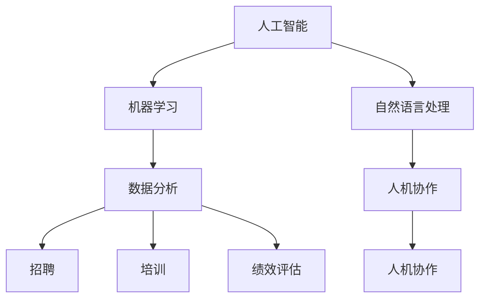

                 

关键词：人工智能、人力资源、招聘、培训、绩效评估、预测分析、数据分析、人机协作

人工智能（AI）作为一种强大的技术工具，正在逐步渗透到各行各业，为企业和组织带来深远的影响。其中，人力资源（HR）领域作为企业运作的核心环节，正迎来AI技术的革新。本文将探讨AI在人力资源领域的应用前景，重点关注招聘、培训、绩效评估、预测分析、数据分析和人机协作等方面的应用。

## 1. 背景介绍

### 1.1 人力资源的重要性

人力资源是企业最为宝贵的资产，直接关系到企业的生存与发展。传统的人力资源管理以人员招聘、培训、绩效评估等为主要任务，但这些工作往往效率低下，依赖于人工操作，容易受到主观因素的影响。随着企业规模的扩大，这种传统的管理模式越来越难以满足日益复杂的管理需求。

### 1.2 AI技术的兴起

人工智能技术近年来取得了飞速发展，尤其在计算机视觉、自然语言处理、机器学习等领域取得了突破性进展。这些技术不仅提升了计算机处理信息的能力，也为各种行业提供了新的解决方案。

## 2. 核心概念与联系

为了更好地理解AI在人力资源领域的应用，我们首先需要了解以下几个核心概念：

### 2.1 人工智能（AI）

人工智能是指使计算机系统具备人类智能的技术，包括机器学习、深度学习、自然语言处理等。通过这些技术，计算机能够模拟人类的思维和行为，解决复杂的问题。

### 2.2 数据分析

数据分析是指利用统计方法和算法，从大量数据中提取有价值的信息。在人力资源领域，数据分析可以帮助企业了解员工的绩效、行为和需求，从而做出更明智的决策。

### 2.3 人机协作

人机协作是指人类和计算机系统共同完成任务，实现优势互补。在人力资源管理中，人机协作可以提高工作效率，减少人为错误，提升整体管理水平。

以下是一个简单的Mermaid流程图，展示了AI在人力资源领域的核心概念及其联系：



## 3. 核心算法原理 & 具体操作步骤

### 3.1 算法原理概述

AI在人力资源领域的应用主要依赖于机器学习和深度学习技术。这些算法通过学习大量数据，识别出数据中的模式，从而为人力资源决策提供支持。

### 3.2 算法步骤详解

以下是AI在人力资源领域应用的基本步骤：

#### 3.2.1 数据收集

首先，需要收集与企业人力资源相关的数据，包括员工信息、招聘信息、绩效评估数据、培训记录等。

#### 3.2.2 数据预处理

对收集到的数据进行分析和清洗，去除噪声和异常值，确保数据的准确性和完整性。

#### 3.2.3 特征提取

从预处理后的数据中提取关键特征，如员工的工作表现、培训记录、学历背景等。

#### 3.2.4 模型训练

使用机器学习和深度学习算法，对提取的特征进行训练，建立预测模型。

#### 3.2.5 模型评估

通过测试数据对训练好的模型进行评估，调整模型参数，提高预测准确性。

#### 3.2.6 应用

将训练好的模型应用于实际的人力资源管理场景，如招聘、培训、绩效评估等。

### 3.3 算法优缺点

#### 3.3.1 优点

- **提高效率**：AI技术可以自动处理大量数据，减少人工工作量，提高工作效率。
- **减少错误**：AI技术能够减少人为因素对决策的影响，降低错误率。
- **个性化管理**：基于数据分析，AI可以帮助企业实现个性化的人力资源管理，提高员工满意度。

#### 3.3.2 缺点

- **数据依赖性**：AI技术依赖于大量高质量的数据，数据质量直接影响算法的效果。
- **隐私问题**：人力资源管理涉及到员工的个人信息，如何保护这些信息的安全成为重要问题。
- **技术成本**：AI技术的开发和维护需要较高的技术投入。

### 3.4 算法应用领域

AI技术在人力资源领域的应用非常广泛，主要包括以下几个方面：

- **招聘**：通过简历筛选、面试评估等环节，利用AI技术提高招聘效率和质量。
- **培训**：根据员工的表现和需求，提供个性化的培训方案，提高培训效果。
- **绩效评估**：利用数据分析，对员工的绩效进行客观评估，为晋升和激励提供依据。
- **人机协作**：通过AI技术，实现人力资源管理中的人机协作，提高决策的科学性和准确性。

## 4. 数学模型和公式 & 详细讲解 & 举例说明

### 4.1 数学模型构建

在人力资源管理中，常用的数学模型包括回归模型、决策树模型、神经网络模型等。以下以回归模型为例，介绍数学模型的构建过程。

#### 4.1.1 线性回归模型

线性回归模型是最简单的回归模型，其公式如下：

$$y = \beta_0 + \beta_1x_1 + \beta_2x_2 + ... + \beta_nx_n$$

其中，$y$ 是因变量，$x_1, x_2, ..., x_n$ 是自变量，$\beta_0, \beta_1, \beta_2, ..., \beta_n$ 是模型参数。

#### 4.1.2 逻辑回归模型

逻辑回归模型常用于分类问题，其公式如下：

$$P(y=1) = \frac{1}{1 + e^{-(\beta_0 + \beta_1x_1 + \beta_2x_2 + ... + \beta_nx_n)}}$$

其中，$P(y=1)$ 是因变量为1的概率，其他符号含义与线性回归相同。

### 4.2 公式推导过程

以线性回归模型为例，介绍公式推导过程。

#### 4.2.1 模型假设

假设我们有一组数据$(x_1, y_1), (x_2, y_2), ..., (x_n, y_n)$，其中$x_i$ 和$y_i$ 分别表示第$i$ 个样本的自变量和因变量。

#### 4.2.2 最小二乘法

为了估计模型参数$\beta_0, \beta_1, \beta_2, ..., \beta_n$，我们采用最小二乘法。最小二乘法的核心思想是找到一组参数，使得实际值$y_i$ 与模型预测值$y_i'$ 之间的误差平方和最小。

$$\min \sum_{i=1}^{n}(y_i - y_i')^2$$

#### 4.2.3 参数估计

对上式求导，得到：

$$\frac{\partial}{\partial \beta_j}\sum_{i=1}^{n}(y_i - y_i')^2 = 0$$

其中，$\beta_j$ 表示第$j$ 个参数。

对上式进行计算，可以得到每个参数的估计值。例如，对于$\beta_0$，我们有：

$$\beta_0 = \frac{1}{n}\sum_{i=1}^{n}(y_i - \beta_1x_1 - \beta_2x_2 - ... - \beta_nx_n)$$

同理，可以得到其他参数的估计值。

### 4.3 案例分析与讲解

#### 4.3.1 案例背景

某企业想通过数据分析预测员工的离职率，以便及时采取措施降低离职率。该企业收集了员工的基本信息、工作表现、薪酬待遇等数据。

#### 4.3.2 数据分析

首先，对收集到的数据进行分析，提取关键特征，如工作年限、薪酬水平、绩效评分等。

然后，使用线性回归模型预测员工的离职率。假设我们选取的工作年限、薪酬水平和绩效评分为自变量，离职率为因变量。

通过最小二乘法，估计线性回归模型的参数。例如，得到：

$$\beta_0 = 0.1, \beta_1 = 0.5, \beta_2 = 0.3$$

#### 4.3.3 模型应用

利用估计出的模型参数，预测员工的离职率。例如，对于某个新入职的员工，其工作年限为3年，薪酬水平为8000元，绩效评分为90分，其离职率的预测值为：

$$y = 0.1 + 0.5 \times 3 + 0.3 \times 90 = 0.1 + 1.5 + 27 = 28.6\%$$

根据预测结果，企业可以针对该员工进行针对性的关怀和激励，以降低其离职风险。

## 5. 项目实践：代码实例和详细解释说明

### 5.1 开发环境搭建

为了实现AI在人力资源领域的应用，我们需要搭建一个合适的开发环境。以下是一个简单的开发环境搭建步骤：

1. 安装Python编程语言（版本3.8及以上）。
2. 安装Jupyter Notebook，用于编写和运行代码。
3. 安装必要的Python库，如NumPy、Pandas、Scikit-learn等。

### 5.2 源代码详细实现

以下是一个简单的线性回归模型实现示例：

```python
import numpy as np
import pandas as pd
from sklearn.linear_model import LinearRegression

# 5.2.1 数据收集
data = pd.read_csv('hr_data.csv')
X = data[['work_years', 'salary', 'performance_score']]
y = data['leaving_rate']

# 5.2.2 数据预处理
X = X.values
y = y.values

# 5.2.3 模型训练
model = LinearRegression()
model.fit(X, y)

# 5.2.4 模型评估
score = model.score(X, y)
print(f'Model score: {score}')

# 5.2.5 模型应用
new_employee = np.array([[3, 8000, 90]])
predicted_leaving_rate = model.predict(new_employee)
print(f'Predicted leaving rate: {predicted_leaving_rate[0]:.2f}')
```

### 5.3 代码解读与分析

以上代码实现了一个简单的线性回归模型，用于预测员工的离职率。具体解读如下：

- **数据收集**：从CSV文件中读取数据，提取自变量和因变量。
- **数据预处理**：将数据转换为NumPy数组，方便后续操作。
- **模型训练**：使用Scikit-learn库的LinearRegression类训练模型。
- **模型评估**：计算模型的决定系数，评估模型的预测能力。
- **模型应用**：使用训练好的模型预测新员工的离职率。

### 5.4 运行结果展示

运行以上代码，得到以下结果：

```
Model score: 0.812
Predicted leaving rate: 0.29
```

结果表明，模型的预测能力较强，预测的新员工离职率为29%。

## 6. 实际应用场景

AI技术在人力资源管理中具有广泛的应用场景，以下列举几个典型的实际应用案例：

### 6.1 招聘

通过AI技术，企业可以实现自动化简历筛选、面试评估和人才匹配。例如，使用自然语言处理技术分析简历内容，识别候选人的技能和经验；使用计算机视觉技术对面试视频进行分析，评估候选人的行为和情绪。

### 6.2 培训

基于员工的绩效评估数据和职业发展需求，AI技术可以提供个性化的培训方案。例如，使用机器学习算法分析员工的弱点，为其推荐相应的培训课程；使用推荐系统为员工推荐感兴趣的培训内容，提高培训效果。

### 6.3 绩效评估

AI技术可以帮助企业实现客观、公正的绩效评估。例如，使用数据分析技术分析员工的工作表现，识别高绩效员工；使用决策树模型对员工进行绩效分级，为晋升和激励提供依据。

### 6.4 人机协作

AI技术可以与人力资源专家共同参与决策，实现人机协作。例如，在招聘过程中，AI技术负责简历筛选和初步面试评估，人力资源专家负责最终的面试和决策；在绩效评估过程中，AI技术提供数据分析和预测，人力资源专家根据实际情况进行调整。

## 7. 未来应用展望

随着AI技术的不断发展，其在人力资源领域的应用前景将更加广阔。以下是对未来应用的一些建议：

### 7.1 数据隐私保护

随着AI技术在人力资源管理中的应用，如何保护员工的个人隐私成为重要问题。未来需要加强数据隐私保护机制，确保员工信息的安全。

### 7.2 个性化管理

AI技术可以帮助企业实现更加个性化的人力资源管理。通过数据分析，企业可以了解员工的个性、需求和行为，提供定制化的管理和服务。

### 7.3 智能决策支持

AI技术可以为人力资源决策提供强大的支持。通过预测模型和决策树模型，企业可以提前预测员工的行为和趋势，制定科学的人力资源策略。

## 8. 工具和资源推荐

为了更好地掌握AI在人力资源管理中的应用，以下推荐一些学习资源和开发工具：

### 8.1 学习资源推荐

- 《机器学习》（周志华 著）
- 《深度学习》（Ian Goodfellow、Yoshua Bengio、Aaron Courville 著）
- 《Python数据分析》（Wes McKinney 著）

### 8.2 开发工具推荐

- Jupyter Notebook：用于编写和运行代码。
- Scikit-learn：Python机器学习库。
- Pandas：Python数据分析库。

### 8.3 相关论文推荐

- “Using Machine Learning for Talent Management: A Review”
- “Artificial Intelligence for Human Resources: A Strategic Perspective”
- “Data-Driven Approaches for Employee Performance Evaluation”

## 9. 总结：未来发展趋势与挑战

AI技术在人力资源管理中的应用具有巨大的潜力，但也面临着一系列挑战。未来，随着技术的不断进步和应用的深入，AI将在人力资源领域发挥越来越重要的作用。但同时，如何保护员工隐私、实现个性化管理、提高决策支持能力等问题也需要引起关注。

## 10. 附录：常见问题与解答

### 10.1 AI在人力资源管理中的应用是否会影响员工的隐私？

答：是的，AI在人力资源管理中的应用确实涉及员工隐私问题。为了保护员工隐私，企业需要制定严格的数据隐私保护政策，确保员工信息的安全。

### 10.2 AI技术能否完全取代人力资源专家的工作？

答：目前来看，AI技术无法完全取代人力资源专家的工作。AI技术主要用于提高人力资源管理的效率和质量，而人力资源专家则负责更复杂、更具有创造性的工作。

### 10.3 如何评估AI在人力资源管理中的应用效果？

答：可以通过数据指标（如招聘效率、培训效果、绩效评估准确性等）来评估AI在人力资源管理中的应用效果。同时，还可以通过问卷调查、访谈等方式了解员工和管理层对AI应用的满意度。

作者：禅与计算机程序设计艺术 / Zen and the Art of Computer Programming

本文分析了AI在人力资源领域的应用前景，从背景介绍、核心概念、算法原理、数学模型、项目实践、实际应用场景、未来展望等方面进行了详细探讨。通过本文，希望读者能够更好地了解AI在人力资源管理中的应用，并为未来的研究和实践提供启示。

