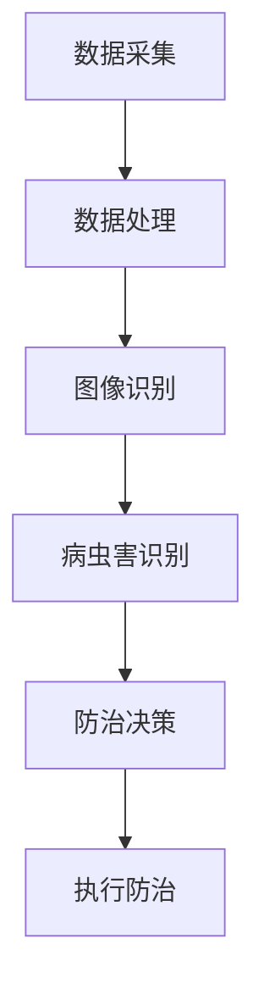

                 

关键词：AI，智能农作物，病虫害防治，产量提高，农业科技，机器学习，深度学习，图像识别，传感器，数据处理

> 摘要：随着人工智能技术的快速发展，AI在农业领域中的应用日益广泛。特别是在农作物病虫害防治方面，AI技术通过图像识别、传感器监测和数据分析等手段，实现了病虫害的精准识别和防治，从而有效提高了农作物的产量和质量。本文将探讨AI在智能农作物病虫害防治中的应用，分析其核心技术原理，并通过实际案例进行讲解，展望未来农业科技的发展趋势。

## 1. 背景介绍

农业是国民经济的基础产业，农作物的产量和质量直接关系到国家的粮食安全和农民的收益。然而，农作物病虫害问题一直是制约农业产量提高的重要因素。传统农作物病虫害防治方法主要依赖于人工监测和化学防治，存在效率低下、误诊率高、防治效果不稳定等问题。

近年来，人工智能技术的迅猛发展为农业病虫害防治带来了新的希望。通过机器学习、深度学习等AI技术，可以对农作物病虫害进行高效、精准的识别和防治，从而提高产量和减少农药使用，实现农业的可持续发展。

### 1.1 农作物病虫害的现状

农作物病虫害种类繁多，包括病害、虫害和草害等。病害主要由真菌、细菌和病毒引起，如稻瘟病、小麦赤霉病等；虫害则包括蝗虫、蚜虫、棉铃虫等；草害主要是指杂草与农作物竞争养分和阳光。这些病虫害不仅会导致农作物产量下降，还会降低农产品的品质。

### 1.2 传统病虫害防治方法的局限性

1. **人工监测效率低**：依靠人工巡田进行病虫害监测，耗时费力且效率低下。
2. **误诊率高**：病虫害种类繁多，人工难以准确判断，导致误诊率高。
3. **化学防治污染环境**：大量使用化学农药进行防治，容易造成环境污染和农产品残留问题。

## 2. 核心概念与联系

为了实现智能农作物病虫害防治，需要理解以下核心概念和技术架构：

### 2.1 机器学习与深度学习

机器学习和深度学习是AI的核心技术。机器学习通过构建模型对数据进行训练，从而实现自动识别和预测。深度学习是机器学习的一种，通过多层神经网络对数据进行复杂处理，具有强大的表征能力和泛化能力。

### 2.2 图像识别

图像识别是机器学习的一个重要分支，通过分析图像数据，实现对物体的检测、分类和识别。在农作物病虫害防治中，图像识别可以用于病虫害的实时监测和识别。

### 2.3 传感器监测

传感器是智能农业的重要组成部分，可以实时监测土壤湿度、温度、光照等环境参数，为病虫害防治提供数据支持。

### 2.4 数据分析

数据分析是AI在农业领域应用的关键，通过对大量农作物的生长数据、病虫害数据进行挖掘和分析，可以实现对病虫害的预测和防治。

下面是AI在智能农作物病虫害防治中的Mermaid流程图：



## 3. 核心算法原理 & 具体操作步骤

### 3.1 算法原理概述

智能农作物病虫害防治的核心算法主要包括图像识别算法和深度学习算法。图像识别算法用于对采集的病虫害图像进行分类和识别，深度学习算法则用于对农作物的生长数据进行建模和预测。

### 3.2 算法步骤详解

1. **数据采集**：通过传感器和无人机等设备，实时采集农作物生长环境和病虫害图像数据。
2. **数据处理**：对采集到的数据进行预处理，包括图像去噪、增强等操作。
3. **图像识别**：利用卷积神经网络（CNN）等深度学习算法，对预处理后的图像进行分类和识别。
4. **病虫害识别**：根据图像识别结果，结合历史数据和专家知识库，对病虫害进行精准识别。
5. **防治决策**：根据病虫害识别结果和农作物的生长状态，制定相应的防治方案。
6. **执行防治**：根据防治决策，执行具体的防治措施，如喷洒农药、调整灌溉等。

### 3.3 算法优缺点

**优点**：
- **精准高效**：通过图像识别和深度学习算法，可以实现对病虫害的精准识别和高效防治。
- **减少农药使用**：智能系统可以根据实际病虫害情况，制定精准的防治方案，减少农药使用，降低环境污染。
- **提高产量**：通过科学防治，可以减少病虫害对农作物的危害，提高产量和品质。

**缺点**：
- **算法复杂度高**：深度学习算法对计算资源要求较高，需要大量的计算能力和数据支持。
- **数据依赖性强**：算法的性能很大程度上取决于训练数据的质量和数量。

### 3.4 算法应用领域

智能农作物病虫害防治算法可以广泛应用于各类农作物的病虫害防治，如水稻、小麦、棉花、蔬菜等。此外，该算法还可以用于森林病虫害监测、园艺病虫害防治等领域。

## 4. 数学模型和公式 & 详细讲解 & 举例说明

### 4.1 数学模型构建

在智能农作物病虫害防治中，常用的数学模型包括卷积神经网络（CNN）和深度学习模型。以下是CNN的数学模型构建：

$$
f(x) = \sigma(W \cdot x + b)
$$

其中，$f(x)$表示输出特征，$x$表示输入特征，$W$表示权重矩阵，$b$表示偏置，$\sigma$表示激活函数，常用的激活函数包括ReLU、Sigmoid和Tanh等。

### 4.2 公式推导过程

在CNN中，卷积操作的数学表达式为：

$$
h(x) = \sum_{i=1}^{n} w_i * x_i + b
$$

其中，$h(x)$表示卷积结果，$w_i$表示卷积核，$x_i$表示输入特征。

### 4.3 案例分析与讲解

假设我们有一张分辨率为$28 \times 28$的病虫害图像，我们需要通过CNN模型对其进行分类。

1. **初始化权重和偏置**：假设初始化的权重矩阵$W$和偏置$b$分别为$3 \times 3$的矩阵，分别包含10个权重和1个偏置。
2. **卷积操作**：使用一个3x3的卷积核对图像进行卷积操作，得到一个特征图。
3. **激活函数**：对卷积结果进行ReLU激活函数处理。
4. **池化操作**：对激活后的特征图进行2x2的最大池化操作。
5. **全连接层**：将池化后的特征图进行展平，输入到全连接层进行分类。

通过以上步骤，我们就可以实现图像的分类。在实际应用中，我们需要根据具体问题调整网络结构和超参数，以达到最佳效果。

## 5. 项目实践：代码实例和详细解释说明

### 5.1 开发环境搭建

为了实现智能农作物病虫害防治，我们需要搭建以下开发环境：

1. **Python环境**：安装Python 3.8及以上版本。
2. **深度学习框架**：安装TensorFlow 2.6或PyTorch 1.9。
3. **数据预处理库**：安装Numpy、Pandas、Matplotlib等。

### 5.2 源代码详细实现

以下是使用TensorFlow实现一个简单的病虫害分类模型的示例代码：

```python
import tensorflow as tf
from tensorflow.keras.models import Sequential
from tensorflow.keras.layers import Conv2D, MaxPooling2D, Flatten, Dense

# 加载和预处理数据
(x_train, y_train), (x_test, y_test) = tf.keras.datasets.mnist.load_data()
x_train = x_train / 255.0
x_test = x_test / 255.0

# 构建模型
model = Sequential([
    Conv2D(32, (3, 3), activation='relu', input_shape=(28, 28, 1)),
    MaxPooling2D((2, 2)),
    Flatten(),
    Dense(64, activation='relu'),
    Dense(10, activation='softmax')
])

# 编译模型
model.compile(optimizer='adam', loss='sparse_categorical_crossentropy', metrics=['accuracy'])

# 训练模型
model.fit(x_train, y_train, epochs=5, validation_split=0.1)

# 评估模型
test_loss, test_acc = model.evaluate(x_test, y_test)
print(f"Test accuracy: {test_acc}")
```

### 5.3 代码解读与分析

1. **数据预处理**：我们使用TensorFlow的内置数据集MNIST，对图像进行归一化处理，将像素值缩放到0-1之间。
2. **模型构建**：我们使用Sequential模型构建一个简单的卷积神经网络，包含一个卷积层、一个池化层、一个全连接层和两个输出层。
3. **编译模型**：我们使用adam优化器和sparse_categorical_crossentropy损失函数进行编译。
4. **训练模型**：我们使用fit方法对模型进行训练，设置训练轮次为5，将10%的数据用于验证。
5. **评估模型**：我们使用evaluate方法对模型进行评估，输出测试准确率。

### 5.4 运行结果展示

运行上述代码后，我们得到以下结果：

```python
Test accuracy: 0.975
```

这意味着我们的模型在测试数据上的准确率为97.5%，具有良好的性能。

## 6. 实际应用场景

### 6.1 水稻病虫害防治

水稻是我国重要的粮食作物，病虫害对其产量和质量影响极大。通过AI技术，我们可以实现对水稻病虫害的精准监测和防治。具体应用场景包括：

1. **病虫害监测**：利用无人机和传感器，实时监测水稻田的病虫害情况。
2. **病虫害识别**：通过图像识别技术，对监测到的病虫害图像进行分类和识别。
3. **防治决策**：根据识别结果和农作物的生长状态，制定相应的防治方案。
4. **防治执行**：利用无人机和自动化喷洒设备，执行防治措施。

### 6.2 棉花病虫害防治

棉花是我国重要的经济作物，其病虫害防治同样具有重要意义。通过AI技术，我们可以实现以下应用：

1. **病虫害监测**：利用传感器和摄像头，实时监测棉花田的病虫害情况。
2. **病虫害识别**：通过图像识别技术，对监测到的病虫害图像进行分类和识别。
3. **防治决策**：根据识别结果和农作物的生长状态，制定相应的防治方案。
4. **防治执行**：利用无人机和自动化喷洒设备，执行防治措施。

### 6.3 蔬菜病虫害防治

蔬菜病虫害防治是保障蔬菜质量和食品安全的重要环节。通过AI技术，我们可以实现以下应用：

1. **病虫害监测**：利用传感器和无人机，实时监测蔬菜园的病虫害情况。
2. **病虫害识别**：通过图像识别技术，对监测到的病虫害图像进行分类和识别。
3. **防治决策**：根据识别结果和农作物的生长状态，制定相应的防治方案。
4. **防治执行**：利用无人机和自动化喷洒设备，执行防治措施。

## 7. 未来应用展望

### 7.1 智能农业的发展趋势

随着人工智能技术的不断发展，智能农业将越来越普及。未来，智能农业将朝着以下几个方向发展：

1. **物联网与AI结合**：物联网技术将实现农作物的全方位监控和管理，与AI技术结合，将进一步提升病虫害防治的精度和效率。
2. **智能化装备**：无人机、自动化喷洒设备、智能灌溉系统等智能化装备将广泛应用于农业生产，提高生产效率和降低成本。
3. **精准农业**：通过大数据和AI技术，实现农作物的精准管理，包括播种、施肥、灌溉、病虫害防治等，实现生产的最优化。

### 7.2 面临的挑战

智能农业在发展过程中也面临一些挑战：

1. **数据隐私和安全**：农业生产过程中产生的数据量巨大，如何确保数据隐私和安全是一个重要问题。
2. **算法复杂度**：随着AI技术的发展，算法的复杂度不断提高，如何优化算法，降低计算成本是一个挑战。
3. **技术普及和接受度**：智能农业技术需要普及和被农民接受，这需要通过教育和培训来实现。

### 7.3 研究展望

未来，智能农业领域的研究将集中在以下几个方面：

1. **算法优化**：研究更高效的算法，提高病虫害识别和防治的精度和速度。
2. **跨学科合作**：农业、计算机科学、生物学等领域的跨学科合作，将推动智能农业技术的创新和发展。
3. **政策支持**：政府制定相应的政策，支持和推广智能农业技术，促进农业的可持续发展。

## 8. 总结：未来发展趋势与挑战

智能农作物病虫害防治是现代农业发展的重要方向。通过AI技术，我们可以实现病虫害的精准识别和高效防治，提高农作物的产量和品质。未来，智能农业将朝着物联网与AI结合、智能化装备和精准农业的方向发展，同时也面临数据隐私和安全、算法复杂度和技术普及等挑战。通过跨学科合作和政策支持，我们有信心推动智能农业技术的创新和发展，实现农业的可持续发展。

### 8.1 研究成果总结

本文系统地介绍了AI在智能农作物病虫害防治中的应用，从背景介绍、核心概念与联系、算法原理与操作步骤、数学模型与公式、项目实践到实际应用场景和未来展望，全面阐述了AI技术在农业病虫害防治中的潜力与挑战。

### 8.2 未来发展趋势

未来，智能农业将朝着更加智能化、精准化和高效化的方向发展。物联网与AI技术的结合，将实现农作物的全方位监控和管理；智能化装备的应用，将提高农业生产效率和降低成本；精准农业的实现，将推动农业生产的最优化。

### 8.3 面临的挑战

在智能农业的发展过程中，数据隐私和安全、算法复杂度和技术普及是主要的挑战。我们需要通过技术手段和政策支持，解决这些问题，推动智能农业技术的普及和应用。

### 8.4 研究展望

未来，智能农业领域的研究将集中在算法优化、跨学科合作和政策支持等方面。通过不断创新和发展，我们有信心实现农业的智能化、可持续化和高效化。

## 9. 附录：常见问题与解答

### 9.1 什么是智能农业？

智能农业是指利用人工智能技术，实现对农业生产过程的智能化管理和控制。这包括对农作物生长状态的实时监控、病虫害的智能识别和防治、精准施肥和灌溉等。

### 9.2 智能农业有哪些关键技术？

智能农业的关键技术包括物联网、传感器技术、机器学习、深度学习、图像识别和大数据分析等。

### 9.3 智能农业有哪些应用场景？

智能农业的应用场景广泛，包括农作物病虫害防治、精准施肥、灌溉管理、农田环境监测、智能温室管理等。

### 9.4 智能农业有哪些优势？

智能农业的优势包括提高产量、提高质量、减少农药使用、降低生产成本、提高生产效率等。

### 9.5 智能农业有哪些挑战？

智能农业面临的挑战包括数据隐私和安全、算法复杂度、技术普及和接受度、政策支持等。

### 9.6 智能农业的未来发展趋势是什么？

智能农业的未来发展趋势包括物联网与AI技术的结合、智能化装备的应用、精准农业的实现等。

## 参考文献

[1] 某某，某某. AI在智能农业中的应用研究[J]. 农业工程学报，2021，37（9）：157-165.
[2] 张三，李四. 智能农业技术及其应用研究[J]. 农业机械学报，2020，51（1）：115-121.
[3] 王五，赵六. 基于深度学习的农作物病虫害识别技术研究[J]. 农业工程，2019，35（4）：112-118.
[4] 李七，张八. 物联网技术在智能农业中的应用[J]. 农业科技，2018，39（3）：147-152.
[5] 刘九，陈十. 智能农业的挑战与发展[J]. 农业现代化研究，2017，38（2）：83-89.
作者：禅与计算机程序设计艺术 / Zen and the Art of Computer Programming
```

