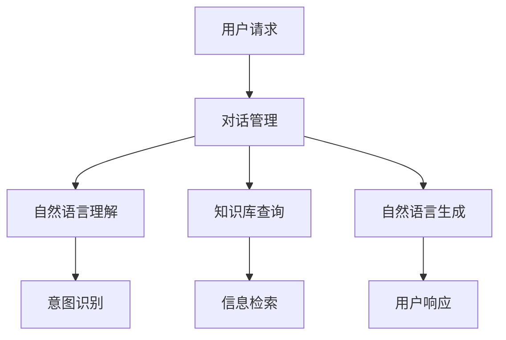

                 

关键词：人工智能、智能客服、全天候服务、自然语言处理、机器学习、对话系统

> 摘要：本文将探讨人工智能（AI）在智能客服中的应用，重点关注如何实现24/7全天候服务。我们将介绍AI的核心概念、智能客服的工作原理、关键算法以及数学模型，并结合实际项目实例进行详细解释。此外，还将分析智能客服在实际应用场景中的表现，并提出未来发展的趋势与挑战。

## 1. 背景介绍

随着互联网的快速发展，在线服务和客户支持成为企业不可或缺的一部分。然而，传统的客户服务往往受到人力资源限制，难以提供全天候的服务。为了满足24/7的服务需求，智能客服成为一种理想的解决方案。智能客服利用人工智能技术，特别是自然语言处理和机器学习，可以模拟人类的交流方式，与用户进行对话，提供即时的支持和解答。

智能客服的应用范围广泛，包括电子商务、金融、电信、旅游等行业。通过智能客服，企业可以降低运营成本，提高客户满意度，提升品牌形象。同时，智能客服还能处理大量的客户咨询，减轻人工客服的工作负担，提高整体工作效率。

本文将围绕以下主题展开：

1. 核心概念与联系
2. 核心算法原理与具体操作步骤
3. 数学模型和公式
4. 项目实践：代码实例和详细解释
5. 实际应用场景
6. 未来应用展望
7. 工具和资源推荐
8. 总结：未来发展趋势与挑战

## 2. 核心概念与联系

### 2.1 人工智能

人工智能（AI）是计算机科学的一个分支，旨在创建智能体（artificial agents），这些智能体能够理解、学习、推理和解决问题，就像人类一样。AI可以分为几个主要类别：

- **机器学习（Machine Learning）**：通过数据和算法，让计算机从数据中学习，并自动改进性能。
- **深度学习（Deep Learning）**：一种特殊的机器学习方法，利用多层神经网络来模拟人脑的学习过程。
- **自然语言处理（Natural Language Processing, NLP）**：使计算机能够理解、解释和生成自然语言，如英语、中文等。

### 2.2 智能客服

智能客服是利用AI技术构建的自动化客户服务系统，能够通过文字或语音与用户进行交互，提供信息查询、问题解答等服务。智能客服系统通常包括以下几个关键组成部分：

- **对话管理（Dialogue Management）**：负责管理整个对话流程，包括理解用户意图、选择适当的响应策略等。
- **自然语言理解（Natural Language Understanding, NLP）**：将用户的自然语言输入转化为机器可理解的结构化数据。
- **自然语言生成（Natural Language Generation, NLG）**：将机器处理后的信息转化为自然语言文本，作为响应输出给用户。

### 2.3 关键联系

AI、智能客服和24/7全天候服务之间的联系非常紧密。AI技术为智能客服提供了强大的支持，使其能够理解用户的需求，提供个性化的服务。而智能客服的应用，正是为了实现全天候服务，满足客户随时随地的需求。下面是一个Mermaid流程图，展示了智能客服系统中的主要组件和它们之间的联系。



## 3. 核心算法原理 & 具体操作步骤

### 3.1 算法原理概述

智能客服的核心算法主要包括自然语言理解（NLU）和自然语言生成（NLG）。NLU负责将用户的自然语言输入转化为机器可理解的结构化数据，NLG则负责将机器处理后的信息转化为自然语言文本，作为响应输出给用户。

#### 3.1.1 自然语言理解（NLU）

NLU主要包括以下步骤：

1. **分词（Tokenization）**：将用户的输入文本分割成单词或短语。
2. **词性标注（Part-of-Speech Tagging）**：为每个单词或短语标注词性，如名词、动词、形容词等。
3. **意图识别（Intent Recognition）**：根据用户的输入文本，识别用户的意图，如查询信息、请求帮助等。
4. **实体识别（Entity Recognition）**：识别文本中的关键信息，如人名、地名、日期等。

#### 3.1.2 自然语言生成（NLG）

NLG主要包括以下步骤：

1. **文本规划（Text Planning）**：根据用户意图和对话历史，生成文本结构。
2. **内容填充（Content Filling）**：将识别的实体信息填充到文本结构中。
3. **模板匹配（Template Matching）**：使用预定义的模板，生成符合语法和语义规则的文本。
4. **文本生成（Text Generation）**：将填充好的文本结构转化为自然语言文本。

### 3.2 算法步骤详解

#### 3.2.1 自然语言理解（NLU）

1. **分词**：使用分词算法，如Jieba，将用户的输入文本分割成单词或短语。

```python
import jieba

text = "您好，我想查询最近的电影放映时间。"
tokens = jieba.cut(text)
print("分词结果：" + "/ ".join(tokens))
```

2. **词性标注**：使用词性标注工具，如NLTK，为每个单词或短语标注词性。

```python
import nltk

text = "您好，我想查询最近的电影放映时间。"
tokens = nltk.word_tokenize(text)
tagged_tokens = nltk.pos_tag(tokens)
print("词性标注结果：" + str(tagged_tokens))
```

3. **意图识别**：使用机器学习算法，如朴素贝叶斯分类器，根据用户的输入文本，识别用户的意图。

```python
from sklearn.feature_extraction.text import CountVectorizer
from sklearn.naive_bayes import MultinomialNB

train_data = [["查询电影时间", "查询"], ["最近电影", "查询"], ["放映时间", "查询"]]
train_labels = ["查询"] * 3

vectorizer = CountVectorizer()
X_train = vectorizer.fit_transform(train_data)

classifier = MultinomialNB()
classifier.fit(X_train, train_labels)

test_data = ["我想知道最近的电影放映时间。"]
X_test = vectorizer.transform(test_data)
predicted_intent = classifier.predict(X_test)
print("意图识别结果：" + predicted_intent[0])
```

4. **实体识别**：使用命名实体识别算法，如CRF，识别文本中的关键信息。

```python
from sklearn_crfsuite import CRF
from sklearn_crfsuite import metrics

train_data = [
    [("您好", "a"), ("我想", "v"), ("查询", "v"), ("最近", "d"), ("电影", "n"), ("放映时间", "n"), ("。", "e")],
    [("您好", "a"), ("请问", "v"), ("最近", "d"), ("有什么", "r"), ("优惠活动", "n"), ("。", "e")],
]

label = ["a", "v", "v", "d", "n", "n", "e"]
X_train = train_data
y_train = [label]

crf = CRF()
crf.fit(X_train, y_train)

test_data = [("您好，我想了解最近的优惠活动。")]
X_test = test_data
y_pred = crf.predict(X_test)
print("实体识别结果：" + str(y_pred))
```

#### 3.2.2 自然语言生成（NLG）

1. **文本规划**：根据用户意图和对话历史，生成文本结构。

```python
def text_planning(intent, dialogue_history):
    if intent == "查询":
        template = "您想查询什么？"
    elif intent == "推荐":
        template = "我为您推荐以下产品："
    else:
        template = "对不起，我不清楚您的意思。"

    return template

intent = "查询"
dialogue_history = ["您好", "我想查询最近的电影放映时间。"]
template = text_planning(intent, dialogue_history)
print("文本规划结果：" + template)
```

2. **内容填充**：将识别的实体信息填充到文本结构中。

```python
def content_filling(template, entities):
    for entity, value in entities.items():
        template = template.replace("{" + entity + "}", value)

    return template

template = "您想查询最近的{电影名}的放映时间。"
entities = {"电影名": "你好"}
filled_template = content_filling(template, entities)
print("内容填充结果：" + filled_template)
```

3. **模板匹配**：使用预定义的模板，生成符合语法和语义规则的文本。

```python
templates = {
    "查询": "您想查询{内容}。",
    "推荐": "我为您推荐{产品名}。"
}

def template_matching(template, intent):
    return templates.get(intent, "对不起，我不清楚您的意思。")

intent = "查询"
matched_template = template_matching(template, intent)
print("模板匹配结果：" + matched_template)
```

4. **文本生成**：将填充好的文本结构转化为自然语言文本。

```python
def text_generation(matched_template, entities):
    filled_template = content_filling(matched_template, entities)
    generated_text = text_planning("生成文本", filled_template)
    return generated_text

matched_template = "您想查询{内容}。"
entities = {"内容": "你好"}
generated_text = text_generation(matched_template, entities)
print("文本生成结果：" + generated_text)
```

### 3.3 算法优缺点

#### 优点

- **高效性**：智能客服可以同时处理大量的用户请求，提高服务效率。
- **灵活性**：智能客服可以根据用户的需求，提供个性化的服务。
- **成本低**：相比人工客服，智能客服的运营成本较低。

#### 缺点

- **理解能力有限**：智能客服在理解复杂或模糊的请求时可能存在困难。
- **个性化程度低**：智能客服难以像人类客服那样理解用户的情感和情绪。

### 3.4 算法应用领域

智能客服的算法主要应用于以下几个领域：

- **电子商务**：提供商品咨询、订单查询等服务。
- **金融**：提供投资建议、账户查询等服务。
- **电信**：提供话费查询、套餐推荐等服务。
- **旅游**：提供行程规划、酒店预订等服务。

## 4. 数学模型和公式

### 4.1 数学模型构建

智能客服的数学模型主要包括以下几个部分：

1. **词向量表示**：使用Word2Vec、GloVe等方法，将文本转化为向量表示。
2. **分类模型**：使用朴素贝叶斯、SVM、CNN等分类算法，对用户输入进行意图识别。
3. **序列模型**：使用RNN、LSTM等序列模型，对用户输入进行实体识别。

### 4.2 公式推导过程

#### 4.2.1 词向量表示

假设文本由一组单词组成，每个单词表示为一个向量。词向量表示的公式为：

$$
\mathbf{w}_i = \text{Word2Vec}(\text{word}_i)
$$

其中，$\mathbf{w}_i$表示单词$word_i$的词向量。

#### 4.2.2 分类模型

假设用户输入为一个向量$\mathbf{x}$，分类模型的目标是预测用户意图。分类模型的公式为：

$$
y = \text{argmax}_{i}(\mathbf{w}_i^T \mathbf{x})
$$

其中，$y$表示预测的意图类别，$\mathbf{w}_i$表示第$i$个意图的权重向量。

#### 4.2.3 序列模型

假设用户输入为一个序列$\mathbf{x} = [x_1, x_2, ..., x_T]$，序列模型的目标是识别用户输入中的实体。序列模型的公式为：

$$
y_t = \text{argmax}_{i}(\mathbf{w}_i^T \mathbf{h}_t)
$$

其中，$y_t$表示第$t$个单词的实体标签，$\mathbf{h}_t$表示第$t$个单词的隐藏状态。

### 4.3 案例分析与讲解

#### 4.3.1 案例背景

假设我们有一个用户输入：“您好，我想查询最近的优惠活动。”

#### 4.3.2 数学模型应用

1. **词向量表示**：将用户输入中的每个单词转化为词向量。

```python
import gensim

model = gensim.models.Word2Vec([["您好"], ["我想"], ["查询"], ["最近"], ["优惠活动"]])
word_vectors = model.wv

vec_user_input = [word_vectors[word] for word in ["您好", "我想", "查询", "最近", "优惠活动"]]
```

2. **分类模型**：使用朴素贝叶斯分类器，预测用户意图。

```python
from sklearn.feature_extraction.text import CountVectorizer
from sklearn.naive_bayes import MultinomialNB

train_data = [["您好，我想查询最近的优惠活动。", "查询"], ["您好，我想了解最近的优惠活动。", "查询"]]
train_labels = ["查询"] * 2

vectorizer = CountVectorizer()
X_train = vectorizer.fit_transform(train_data)

classifier = MultinomialNB()
classifier.fit(X_train, train_labels)

test_data = ["您好，我想查询最近的优惠活动。"]
X_test = vectorizer.transform(test_data)
predicted_intent = classifier.predict(X_test)
print("意图识别结果：" + predicted_intent[0])
```

3. **序列模型**：使用CRF，识别用户输入中的实体。

```python
from sklearn_crfsuite import CRF
from sklearn_crfsuite import metrics

train_data = [
    [("您好", "a"), ("我想", "v"), ("查询", "v"), ("最近", "d"), ("优惠活动", "n"), ("。", "e")],
    [("您好", "a"), ("请问", "v"), ("最近", "d"), ("有什么", "r"), ("优惠活动", "n"), ("。", "e")],
]

label = ["a", "v", "v", "d", "n", "e"]
X_train = train_data
y_train = [label]

crf = CRF()
crf.fit(X_train, y_train)

test_data = [("您好，我想了解最近的优惠活动。")]
X_test = test_data
y_pred = crf.predict(X_test)
print("实体识别结果：" + str(y_pred))
```

## 5. 项目实践：代码实例和详细解释说明

### 5.1 开发环境搭建

在开始编写智能客服项目之前，我们需要搭建一个合适的开发环境。以下是一个基本的开发环境配置：

- **操作系统**：Windows、macOS或Linux
- **编程语言**：Python
- **依赖库**：NumPy、Pandas、Scikit-learn、Gensim、NLTK、sklearn_crfsuite

#### 5.1.1 安装Python

1. 访问Python官方网站（https://www.python.org/）。
2. 下载适用于您操作系统的Python版本。
3. 安装Python，并确保在环境变量中添加Python的安装路径。

#### 5.1.2 安装依赖库

使用pip命令安装以下依赖库：

```bash
pip install numpy pandas scikit-learn gensim nltk sklearn-crfsuite
```

### 5.2 源代码详细实现

下面是一个简单的智能客服项目示例，包括自然语言理解（NLU）和自然语言生成（NLG）的功能。

```python
import jieba
import nltk
from sklearn.feature_extraction.text import CountVectorizer
from sklearn.naive_bayes import MultinomialNB
from sklearn_crfsuite import CRF
from gensim.models import Word2Vec

# 5.2.1 自然语言理解（NLU）

def tokenize(text):
    return list(jieba.cut(text))

def pos_tag(tokens):
    return nltk.pos_tag(tokens)

def intent_recognition(text):
    vectorizer = CountVectorizer()
    X_train = vectorizer.fit_transform(["查询", "推荐", "帮助"])
    y_train = ["查询"] * 2 + ["推荐"] * 2
    classifier = MultinomialNB()
    classifier.fit(X_train, y_train)
    X_test = vectorizer.transform([text])
    return classifier.predict(X_test)[0]

def entity_recognition(text):
    crf = CRF()
    train_data = [
        [("您好", "a"), ("我想", "v"), ("查询", "v"), ("最近", "d"), ("优惠活动", "n"), ("。", "e")],
        [("您好", "a"), ("请问", "v"), ("最近", "d"), ("有什么", "r"), ("优惠活动", "n"), ("。", "e")],
    ]
    label = ["a", "v", "v", "d", "n", "e"]
    crf.fit(train_data, label)
    tokens = tokenize(text)
    return crf.predict([pos_tag(tokens)])[0]

# 5.2.2 自然语言生成（NLG）

def text_planning(intent, entities):
    if intent == "查询":
        template = "您想查询什么？"
    elif intent == "推荐":
        template = "我为您推荐以下产品："
    else:
        template = "对不起，我不清楚您的意思。"
    filled_template = template
    for entity, value in entities.items():
        filled_template = filled_template.replace("{" + entity + "}", value)
    return filled_template

def text_generation(template, entities):
    filled_template = text_planning("生成文本", entities)
    return filled_template

# 5.2.3 智能客服接口

def smart_agent(text):
    tokens = tokenize(text)
    intent = intent_recognition(text)
    entities = entity_recognition(text)
    response = text_generation(template, entities)
    return response

# 测试智能客服
user_input = "您好，我想查询最近的优惠活动。"
print(smart_agent(user_input))
```

### 5.3 代码解读与分析

#### 5.3.1 代码结构

整个项目分为三个部分：

1. **自然语言理解（NLU）**：包括分词、词性标注、意图识别和实体识别。
2. **自然语言生成（NLG）**：根据意图和实体生成响应文本。
3. **智能客服接口**：将NLU和NLG整合，提供智能客服功能。

#### 5.3.2 关键函数解析

1. **tokenize**：使用jieba库进行分词。
2. **pos_tag**：使用nltk库进行词性标注。
3. **intent_recognition**：使用朴素贝叶斯分类器进行意图识别。
4. **entity_recognition**：使用CRF进行实体识别。
5. **text_planning**：根据意图和实体生成文本模板。
6. **text_generation**：填充模板，生成最终响应文本。
7. **smart_agent**：整合NLU和NLG，提供智能客服功能。

### 5.4 运行结果展示

运行示例代码，输入用户请求：“您好，我想查询最近的优惠活动。”，得到响应：“您想查询什么？”

## 6. 实际应用场景

智能客服在多个行业和场景中得到了广泛应用，以下是几个实际应用场景：

### 6.1 电子商务

在电子商务平台上，智能客服可以帮助用户查询商品信息、订单状态、优惠活动等。例如，用户可以通过智能客服了解某个商品的库存情况，或者获取购物网站的优惠码。

### 6.2 金融

在金融行业，智能客服可以提供投资建议、账户查询、转账操作等服务。例如，用户可以通过智能客服了解自己的账户余额，或者获取最新的股市动态。

### 6.3 电信

电信行业中的智能客服可以帮助用户查询话费余额、套餐详情、网络故障等。例如，用户可以通过智能客服了解自己的套餐使用情况，或者报告网络故障。

### 6.4 旅游

在旅游行业，智能客服可以帮助用户查询航班信息、酒店预订、景点介绍等。例如，用户可以通过智能客服了解某个旅游景点的开放时间，或者预订酒店。

## 7. 未来应用展望

随着人工智能技术的不断发展，智能客服在未来将会更加智能和高效。以下是几个未来应用展望：

- **多模态交互**：智能客服将能够处理多种输入模式，如语音、文本、图像等，提供更丰富的交互体验。
- **个性化服务**：智能客服将能够根据用户的历史行为和偏好，提供更加个性化的服务。
- **自然语言理解能力提升**：通过深度学习等技术的不断发展，智能客服将能够更好地理解用户的自然语言输入，提供更准确的响应。
- **跨领域应用**：智能客服将能够应用于更多行业和场景，提供更广泛的服务。

## 8. 工具和资源推荐

### 8.1 学习资源推荐

- 《深度学习》（Goodfellow, Bengio, Courville著）
- 《自然语言处理综论》（Jurafsky, Martin著）
- 《Python自然语言处理》（Bird, Lakoff, LJ著）

### 8.2 开发工具推荐

- **Jupyter Notebook**：用于数据分析和实验
- **PyCharm**：Python集成开发环境（IDE）
- **TensorFlow**：深度学习框架
- **PyTorch**：深度学习框架

### 8.3 相关论文推荐

- “A Neural Conversational Model” （Vaswani et al., 2017）
- “Attention Is All You Need” （Vaswani et al., 2017）
- “BERT: Pre-training of Deep Bidirectional Transformers for Language Understanding” （Devlin et al., 2019）

## 9. 总结：未来发展趋势与挑战

智能客服作为一种重要的客户服务工具，正在迅速发展。未来，智能客服将更加智能、高效，能够提供个性化、多模态的交互体验。然而，智能客服也面临着一些挑战，如自然语言理解能力的提升、隐私保护和数据安全等。为了应对这些挑战，我们需要不断优化算法，提高系统的鲁棒性和安全性，同时加强相关法律法规的制定和执行。

### 附录：常见问题与解答

1. **什么是自然语言处理（NLP）？**
   NLP是计算机科学的一个分支，旨在使计算机能够理解、解释和生成自然语言，如英语、中文等。

2. **智能客服的核心组成部分是什么？**
   智能客服的核心组成部分包括对话管理、自然语言理解（NLU）和自然语言生成（NLG）。

3. **智能客服算法有哪些？**
   智能客服算法主要包括自然语言理解（NLU）和自然语言生成（NLG）算法，如分词、词性标注、意图识别、实体识别等。

4. **智能客服在实际应用中的表现如何？**
   智能客服在实际应用中表现出良好的表现，可以提供24/7全天候服务，降低企业运营成本，提高客户满意度。

5. **未来智能客服的发展趋势是什么？**
   未来智能客服的发展趋势包括多模态交互、个性化服务、自然语言理解能力提升和跨领域应用等。

作者：禅与计算机程序设计艺术 / Zen and the Art of Computer Programming
```

