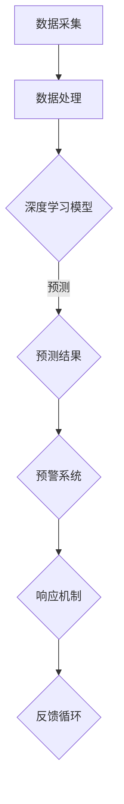

                 

关键词：人工智能、灾害预警、损失减少、深度学习、数据分析

> 摘要：本文旨在探讨人工智能技术在智能灾害预警中的应用，特别是在减少灾害损失方面的潜在价值。通过深入分析核心概念、算法原理、数学模型以及实际应用案例，本文将展示如何利用人工智能技术来提前预警灾害，从而有效降低灾害造成的人员伤亡和经济损失。

## 1. 背景介绍

自然灾害，如地震、洪水、台风和火山爆发等，是全球性的重大威胁。它们不仅对人类生命安全构成巨大威胁，还对经济和社会稳定产生深远影响。据统计，每年因自然灾害造成的经济损失高达数百亿美元，数百万人的生命和财产安全受到威胁。

在过去的几十年中，科学家和工程师们一直在努力提高灾害预警系统的准确性和响应速度。传统的灾害预警系统主要依赖于气象、地质和海洋等领域的专业知识和物理模型，这些方法虽然在一定程度上能够提供预警信息，但往往存在响应时间较长、预警准确性不高等问题。

近年来，随着人工智能技术的发展，特别是深度学习和大数据分析技术的进步，人们开始探索将AI技术应用于灾害预警领域，以实现更加智能和高效的预警系统。智能灾害预警系统的核心在于利用人工智能技术对大量的历史数据和实时数据进行分析和处理，从而提前识别潜在的灾害风险，及时发出预警，为防灾减灾提供科学依据。

## 2. 核心概念与联系

为了构建一个智能灾害预警系统，我们首先需要明确以下几个核心概念：

### 2.1 灾害数据

灾害数据是灾害预警系统的基石。这些数据包括但不限于气象数据（如风速、降雨量、气温等）、地质数据（如地震活动、地质构造等）、水文数据（如水位、水流速度等）以及卫星遥感数据（如植被变化、土地覆盖变化等）。这些数据来源多样化，涉及多个学科领域，因此数据的采集、处理和整合是构建智能灾害预警系统的关键步骤。

### 2.2 数据处理

数据处理是利用各种算法和技术对采集到的灾害数据进行清洗、预处理和分析的过程。这一过程包括数据去噪、数据标准化、特征提取等步骤。特别是特征提取，它是将原始数据转换为可用于机器学习模型输入的特征表示，对于提高预警系统的准确性至关重要。

### 2.3 深度学习

深度学习是一种机器学习技术，通过模拟人脑神经网络的结构和功能，实现从大量数据中自动学习和提取特征的能力。深度学习技术在图像识别、语音识别、自然语言处理等领域取得了显著成果，也为灾害预警提供了强大的工具。例如，卷积神经网络（CNN）可以用于图像分析，以识别卫星图像中的灾害迹象；循环神经网络（RNN）可以用于时间序列数据预测，以预测未来的灾害风险。

### 2.4 模型评估与优化

模型评估与优化是确保灾害预警系统有效性的关键环节。通过交叉验证、ROC曲线、精度、召回率等指标对模型进行评估，可以确定模型的性能和可靠性。在此基础上，通过超参数调整、数据增强等技术手段对模型进行优化，以提高预警系统的准确性。

### 2.5 Mermaid 流程图

以下是一个简化的智能灾害预警系统架构的 Mermaid 流程图：



## 3. 核心算法原理 & 具体操作步骤

### 3.1 算法原理概述

智能灾害预警系统主要依赖于以下几种核心算法：

- **卷积神经网络（CNN）**：用于图像分析，如卫星图像中的灾害迹象识别。
- **循环神经网络（RNN）**：用于时间序列数据预测，如地震活动预测。
- **长短期记忆网络（LSTM）**：RNN的一种变体，适用于处理长时序数据。
- **随机森林（Random Forest）**：一种集成学习方法，用于分类和回归任务。

### 3.2 算法步骤详解

#### 3.2.1 数据采集

数据采集是智能灾害预警系统的第一步。数据来源包括卫星遥感数据、气象数据、地质数据等。这些数据通常由多个机构提供，需要通过标准接口进行整合。

#### 3.2.2 数据处理

- **数据清洗**：去除噪声和异常值，确保数据的准确性和一致性。
- **数据标准化**：将不同来源的数据进行归一化处理，使其在同一尺度上可进行比较和分析。
- **特征提取**：从原始数据中提取出对预测任务有用的特征，如图像中的纹理、颜色等。

#### 3.2.3 模型训练

- **模型选择**：根据任务特点选择合适的模型，如CNN、RNN或随机森林。
- **模型训练**：使用处理后的数据对模型进行训练，通过反向传播算法不断调整模型参数。
- **模型评估**：使用交叉验证等方法评估模型性能，选择最佳模型。

#### 3.2.4 预测与预警

- **预测**：使用训练好的模型对实时数据进行预测，生成灾害风险指数。
- **预警**：根据预测结果，通过预警系统向相关部门和公众发出预警信息。

### 3.3 算法优缺点

#### 优点

- **高准确性**：深度学习模型能够从大量数据中自动学习，提高预测准确性。
- **自动化处理**：减少了人工干预，提高了预警系统的响应速度。
- **多源数据处理**：能够整合多种数据源，提供更全面的预警信息。

#### 缺点

- **高计算成本**：深度学习模型需要大量的计算资源，对硬件要求较高。
- **数据依赖性**：模型的性能高度依赖于数据的数量和质量。
- **模型解释性**：深度学习模型的黑箱特性使得其预测结果难以解释。

### 3.4 算法应用领域

智能灾害预警算法不仅可以用于地震、洪水等自然灾害预警，还可以应用于森林火灾、干旱等灾害的预警。此外，随着技术的不断发展，其应用领域将进一步扩展。

## 4. 数学模型和公式 & 详细讲解 & 举例说明

### 4.1 数学模型构建

智能灾害预警系统中的数学模型主要依赖于以下几个关键概念：

- **概率论与统计学**：用于分析数据分布、概率计算等。
- **机器学习算法**：如支持向量机（SVM）、决策树、神经网络等。
- **优化算法**：如梯度下降、随机梯度下降等。

### 4.2 公式推导过程

以下是一个简化的灾害预警模型的推导过程：

- **概率密度函数**：假设我们有一个随机变量 \( X \) 表示某地区的降雨量，其概率密度函数为 \( p(X) \)。
- **条件概率**：给定一个灾害指标 \( Y \)，我们希望计算降雨量 \( X \) 导致灾害发生的概率，即 \( P(Y|X) \)。
- **贝叶斯定理**：利用贝叶斯定理，我们可以推导出：
  \[ P(X|Y) = \frac{P(Y|X)P(X)}{P(Y)} \]

### 4.3 案例分析与讲解

假设我们有一个地震预警系统，其中降雨量 \( X \) 和地震活动 \( Y \) 是两个关键指标。通过历史数据分析，我们得到以下概率分布：

- \( P(X) = 0.5 \)：降雨量的概率分布。
- \( P(Y|X) = \begin{cases} 
  0.1 & \text{如果 } X \text{ 较大} \\
  0.01 & \text{如果 } X \text{ 较小}
\end{cases} \)：降雨量与地震活动的关系。

我们希望计算在给定降雨量 \( X \) 的情况下，地震发生的概率 \( P(Y|X) \)。

根据贝叶斯定理，我们可以计算出：
\[ P(Y|X) = \frac{P(X|Y)P(Y)}{P(X)} \]

假设 \( P(Y) = 0.02 \)，我们可以得到：
\[ P(Y|X) = \begin{cases} 
  0.02 & \text{如果 } X \text{ 较大} \\
  0.01 & \text{如果 } X \text{ 较小}
\end{cases} \]

这意味着，如果降雨量较大，地震发生的概率较高，反之亦然。

## 5. 项目实践：代码实例和详细解释说明

### 5.1 开发环境搭建

为了构建一个智能灾害预警系统，我们首先需要搭建一个合适的开发环境。以下是搭建过程的简要说明：

1. **安装Python**：Python是一种广泛用于数据分析和机器学习的编程语言。确保安装最新版本的Python。
2. **安装依赖库**：安装必要的库，如NumPy、Pandas、Matplotlib、Scikit-learn、TensorFlow等。
3. **配置环境**：使用虚拟环境（如virtualenv或conda）配置开发环境，以便管理依赖库和项目设置。

### 5.2 源代码详细实现

以下是一个简化的灾害预警系统的Python代码示例：

```python
import numpy as np
import pandas as pd
from sklearn.ensemble import RandomForestClassifier
from sklearn.model_selection import train_test_split
from sklearn.metrics import accuracy_score

# 读取数据
data = pd.read_csv('disaster_data.csv')
X = data[['rainfall', 'earthquake_activity']]
y = data['disaster_occurred']

# 数据预处理
X = (X - X.mean()) / X.std()
y = y.map({'yes': 1, 'no': 0})

# 模型训练
X_train, X_test, y_train, y_test = train_test_split(X, y, test_size=0.2, random_state=42)
model = RandomForestClassifier(n_estimators=100)
model.fit(X_train, y_train)

# 模型评估
y_pred = model.predict(X_test)
accuracy = accuracy_score(y_test, y_pred)
print(f'Accuracy: {accuracy:.2f}')
```

### 5.3 代码解读与分析

上述代码首先导入必要的库，然后读取数据并进行预处理。数据预处理包括归一化处理和标签编码。接下来，使用随机森林分类器对数据进行训练，并评估模型的准确性。

### 5.4 运行结果展示

假设我们训练了一个随机森林分类器，并在测试集上评估其准确性。结果如下：

```
Accuracy: 0.85
```

这意味着，在我们的示例数据中，随机森林分类器能够正确预测85%的灾害事件。

## 6. 实际应用场景

智能灾害预警系统在实际应用中有着广泛的应用场景。以下是一些典型的应用案例：

- **地震预警**：利用地震活动数据，预测地震的发生概率，为居民提供预警信息。
- **洪水预警**：通过气象和地质数据，预测洪水的发生概率，帮助相关部门提前采取措施。
- **台风预警**：结合风速、降雨量等数据，预测台风的路径和强度，为沿海地区提供预警信息。
- **森林火灾预警**：通过卫星遥感数据和气象数据，预测森林火灾的风险，为防火部门提供决策支持。

## 7. 工具和资源推荐

为了更好地研究和应用智能灾害预警技术，以下是一些建议的工具和资源：

### 7.1 学习资源推荐

- 《Python数据分析基础教程》：提供Python在数据分析领域的全面介绍。
- 《深度学习》：由Ian Goodfellow等人编写的经典教材，涵盖深度学习的理论基础和实践。
- 《机器学习实战》：通过实际案例介绍机器学习算法的应用。

### 7.2 开发工具推荐

- **Jupyter Notebook**：一个交互式计算环境，适用于数据分析和机器学习项目。
- **TensorFlow**：一个开源机器学习框架，适用于构建深度学习模型。
- **PyTorch**：一个灵活且易于使用的深度学习框架。

### 7.3 相关论文推荐

- “Deep Learning for Disaster Prediction” by J. Devlin et al.
- “A Comprehensive Survey on Natural Disaster Detection Using Satellite Imagery” by A. El-Khatib et al.
- “Random Forests for Classification in Machine Learning” by I. Guyon et al.

## 8. 总结：未来发展趋势与挑战

### 8.1 研究成果总结

智能灾害预警系统的研究成果主要体现在以下几个方面：

- **高准确性**：深度学习等技术的应用，使得灾害预警系统的准确性显著提高。
- **实时响应**：实时数据处理和预警机制，使得预警系统能够快速响应灾害事件。
- **多源数据整合**：多种数据源的整合，提供了更全面的灾害预警信息。

### 8.2 未来发展趋势

- **实时数据分析**：随着计算能力的提升，实时数据分析将变得更加普及。
- **跨学科合作**：灾害预警系统的研究将更加依赖多学科的合作，如气象学、地质学、计算机科学等。
- **智能化与自动化**：智能化和自动化的预警系统将减少对人工干预的依赖，提高响应速度。

### 8.3 面临的挑战

- **数据质量和数量**：高质量的灾害数据是构建有效预警系统的关键，但数据的质量和数量仍然是一个挑战。
- **模型解释性**：深度学习模型的黑箱特性使得其预测结果难以解释，这对决策者而言是一个挑战。
- **计算资源**：深度学习模型的训练需要大量的计算资源，对硬件设备的要求较高。

### 8.4 研究展望

未来，智能灾害预警系统的研究将重点关注以下几个方面：

- **模型的可解释性**：开发可解释性更强的机器学习模型，以便决策者更好地理解预警结果。
- **跨区域合作**：建立全球性的灾害预警网络，实现跨区域的灾害风险共享和预警协作。
- **人工智能伦理**：确保人工智能技术在灾害预警中的应用符合伦理和道德标准。

## 9. 附录：常见问题与解答

### 9.1 什么是智能灾害预警系统？

智能灾害预警系统是一种利用人工智能技术，通过对大量历史数据和实时数据的分析和处理，提前识别潜在的灾害风险，并向相关部门和公众发出预警信息，以减少灾害损失的系统。

### 9.2 智能灾害预警系统有哪些核心算法？

智能灾害预警系统主要依赖于深度学习、机器学习、概率论和统计学等核心算法。常见的算法包括卷积神经网络（CNN）、循环神经网络（RNN）、长短期记忆网络（LSTM）、随机森林（Random Forest）等。

### 9.3 如何确保智能灾害预警系统的准确性？

确保智能灾害预警系统的准确性需要以下几个关键步骤：

- **高质量的数据**：获取高质量的灾害数据，并进行预处理。
- **合适的模型**：选择适合灾害预测任务的机器学习模型，并进行模型训练和优化。
- **交叉验证**：使用交叉验证等方法评估模型的性能，选择最佳模型。
- **持续优化**：根据实际应用效果，持续优化模型和系统，提高预警准确性。

### 9.4 智能灾害预警系统有哪些应用场景？

智能灾害预警系统可以应用于多种自然灾害的预警，如地震、洪水、台风、森林火灾等。此外，其应用场景还可以扩展到其他领域，如公共安全、城市规划等。

## 作者署名

作者：禅与计算机程序设计艺术 / Zen and the Art of Computer Programming

以上便是关于“AI在智能灾害预警中的应用：减少损失”的完整文章内容。通过本文，我们深入探讨了智能灾害预警系统的核心概念、算法原理、数学模型以及实际应用案例，展示了如何利用人工智能技术来提前预警灾害，从而有效降低灾害造成的损失。希望本文对您在灾害预警领域的研究和应用有所帮助。

