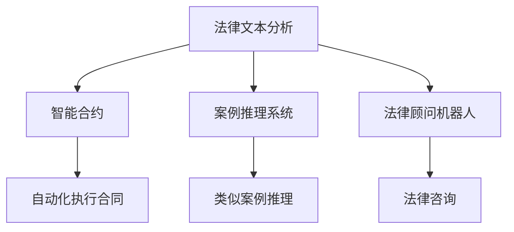

                 

关键词：人工智能，法律服务，效率，公平，AI算法，法律流程自动化，智能合约，大数据分析

> 摘要：随着人工智能技术的飞速发展，其在法律服务领域的应用逐渐成为关注的焦点。本文旨在探讨AI在提高法律服务质量、效率和公平性方面的潜力，分析其核心概念、算法原理及实际应用，并展望未来的发展趋势和挑战。

## 1. 背景介绍

在过去的几十年中，法律服务的传统模式主要依赖于人类律师的专业知识和经验。然而，随着全球法律体系的复杂化、案件数量的激增以及客户对法律服务需求的多样化，传统的法律服务模式面临着巨大的挑战。一方面，法律服务的需求日益增加，导致律师的工作负担加重；另一方面，客户对法律服务的质量和效率提出了更高的期望。这种背景下，人工智能（AI）作为一种新兴技术，被寄予厚望，有望为法律服务领域带来革命性的变革。

### 法律服务的现状

目前，法律服务主要依赖于律师和律师事务所，其工作流程包括客户咨询、案件分析、法律文件准备、诉讼支持等多个环节。尽管法律从业者具备丰富的专业知识，但以下问题仍然存在：

1. **效率低下**：案件处理时间较长，特别是在大规模案件中，律师的劳动强度大，效率低下。
2. **成本高**：法律服务费用昂贵，许多中小企业和个人无法负担。
3. **公平性问题**：法律服务资源分配不均，一些贫困人群无法获得应有的法律援助。
4. **专业知识限制**：法律知识的更新速度难以跟上法律的快速变革，可能导致法律服务的缺陷。

### 人工智能的崛起

人工智能技术，特别是机器学习和自然语言处理技术的进步，为法律服务带来了新的机遇。AI能够处理大量数据、快速分析法律条文和案例，提高法律工作的效率和准确性。此外，AI的自动化和智能化特性，使得法律服务可以更公平地分配给有需求的人群，缩小法律服务差距。

## 2. 核心概念与联系

### AI与法律服务的核心概念

- **法律文本分析**：利用自然语言处理技术（NLP）对法律文件、法规和案例进行自动化的分析和理解。
- **智能合约**：基于区块链技术，实现自动化执行合同条款的智能合约。
- **案例推理系统**：基于已有法律案例，利用机器学习算法进行类似案例的推理和决策。
- **法律顾问机器人**：通过聊天机器人技术，提供快速、准确的法律咨询。

### Mermaid流程图



### AI与法律服务的联系

- **数据驱动的法律研究**：AI能够快速处理和分析大量法律数据，为法律研究提供支持。
- **自动化流程**：通过AI，许多法律工作流程可以自动化，降低人力成本，提高工作效率。
- **智能化决策支持**：AI可以辅助法律从业者进行决策，提供更加精准的法律建议。
- **法律知识的普及**：AI使得法律服务更加普及，让更多人能够获得专业的法律帮助。

## 3. 核心算法原理 & 具体操作步骤

### 3.1 算法原理概述

在AI在法律服务中的应用中，核心算法主要涉及自然语言处理（NLP）、机器学习（ML）和区块链技术。

- **自然语言处理（NLP）**：NLP技术用于理解和生成自然语言，是法律文本分析的基础。常用的NLP技术包括词向量表示、句法分析、语义理解等。

- **机器学习（ML）**：ML算法在法律案例推理、智能合约执行和法律顾问机器人中扮演重要角色。常见的ML算法有决策树、支持向量机、神经网络等。

- **区块链技术**：区块链用于构建智能合约，实现法律条款的自动化执行，确保交易的透明和安全。

### 3.2 算法步骤详解

#### 3.2.1 法律文本分析

1. **数据预处理**：对法律文本进行分词、去除停用词、词性标注等预处理操作。
2. **特征提取**：利用词袋模型、词嵌入等方法将法律文本转换为向量表示。
3. **文本分类与命名实体识别**：使用分类算法（如SVM、CNN等）对法律文本进行分类，识别法律术语和实体。

#### 3.2.2 智能合约

1. **合约设计**：根据法律条款设计智能合约的流程和逻辑。
2. **合约编写**：使用Solidity等智能合约编程语言编写合约代码。
3. **合约部署**：将合约部署到区块链网络，实现自动化执行。

#### 3.2.3 案例推理系统

1. **案例库构建**：收集和整理大量法律案例，建立案例库。
2. **案例匹配**：利用机器学习算法对新的法律案件进行相似案例的匹配和推理。
3. **决策支持**：根据案例推理结果，为法律从业者提供决策建议。

#### 3.2.4 法律顾问机器人

1. **对话管理**：设计对话管理模块，处理用户的提问和回复。
2. **知识库构建**：构建包含法律知识和案例的智能知识库。
3. **问答系统**：利用问答系统技术，为用户提供准确、及时的法律咨询。

### 3.3 算法优缺点

#### 法律文本分析

- **优点**：高效处理大量法律文本，提高法律研究的准确性和效率。
- **缺点**：法律文本复杂，NLP技术难以完全理解和解释。

#### 智能合约

- **优点**：自动化执行法律条款，提高交易效率和透明度。
- **缺点**：智能合约代码一旦部署，难以修改，存在安全风险。

#### 案例推理系统

- **优点**：辅助法律从业者进行案例分析和决策，提高法律服务的质量。
- **缺点**：案例库的构建和维护需要大量人力和物力。

#### 法律顾问机器人

- **优点**：提供24小时在线法律咨询，降低法律服务成本。
- **缺点**：智能程度有限，难以处理复杂的法律问题。

### 3.4 算法应用领域

- **法律文本分析**：合同审查、法律研究、案件分析等。
- **智能合约**：金融合同、租赁合同、知识产权等。
- **案例推理系统**：法律咨询、案件审判、法律培训等。
- **法律顾问机器人**：在线法律咨询、法律知识普及等。

## 4. 数学模型和公式 & 详细讲解 & 举例说明

### 4.1 数学模型构建

在法律服务的AI应用中，常见的数学模型包括：

- **词向量模型**：用于将法律文本转换为向量表示，如Word2Vec、GloVe等。
- **分类模型**：用于文本分类和命名实体识别，如SVM、CNN等。
- **决策树模型**：用于案例推理和决策支持，如ID3、C4.5等。
- **神经网络模型**：用于智能合约执行和法律顾问机器人，如RNN、Transformer等。

### 4.2 公式推导过程

以Word2Vec为例，其核心公式推导如下：

1. **初始化词向量**：对于每个词汇，初始化一个随机向量v\_word ∈ R^d。
2. **计算相似度**：计算两个词向量v\_word和v\_context之间的余弦相似度：
   $$ similarity(v\_word, v\_context) = \frac{v\_word \cdot v\_context}{\|v\_word\|\|v\_context\|} $$
3. **优化词向量**：通过梯度下降优化词向量，使得相似词的向量距离更近，非相似词的向量距离更远。优化目标函数为：
   $$ J = \sum_{(word, context) \in dataset} \frac{1}{2} (s\_i - similarity(v\_word, v\_context))^2 $$

### 4.3 案例分析与讲解

#### 合同审查

假设有一份租赁合同，需要利用AI进行文本分析，以检查合同条款的合规性。

1. **数据预处理**：对合同文本进行分词、去除停用词、词性标注等操作。
2. **特征提取**：将合同文本转换为词向量表示。
3. **文本分类**：使用分类模型（如SVM）对合同条款进行分类，判断其是否符合法律法规。
4. **结果分析**：合同条款被分类为“合法”或“非法”，非法条款被标记出来，并提供修改建议。

#### 智能合约执行

假设有一份金融合同，需要通过智能合约实现自动化执行。

1. **合约设计**：根据合同条款，设计智能合约的流程和逻辑。
2. **合约编写**：使用Solidity编写智能合约代码。
3. **合约部署**：将合约部署到区块链网络。
4. **合约执行**：当触发条件满足时，智能合约自动执行合同条款，如转账、释放锁定资金等。

#### 法律顾问机器人

假设一个用户咨询关于离婚法律的问题，需要利用法律顾问机器人提供帮助。

1. **对话管理**：机器人与用户进行对话，收集用户需求。
2. **知识库查询**：根据用户需求，查询法律知识库，找到相关法律条款和案例。
3. **问答系统**：使用问答系统技术，为用户生成回答。
4. **决策支持**：根据用户需求和法律知识，为用户提供决策建议。

## 5. 项目实践：代码实例和详细解释说明

### 5.1 开发环境搭建

1. **安装Python**：从Python官网下载并安装Python 3.8及以上版本。
2. **安装Jupyter Notebook**：使用pip命令安装Jupyter Notebook。
   ```bash
   pip install notebook
   ```
3. **安装NLP库**：安装用于自然语言处理的库，如NLTK、spaCy等。
   ```bash
   pip install nltk spacy
   ```
4. **安装机器学习库**：安装用于机器学习的库，如scikit-learn、TensorFlow等。
   ```bash
   pip install scikit-learn tensorflow
   ```

### 5.2 源代码详细实现

以下是一个简单的Python代码示例，用于文本分类，检查合同条款的合规性。

```python
import nltk
from sklearn.feature_extraction.text import TfidfVectorizer
from sklearn.svm import SVC
from sklearn.pipeline import make_pipeline

# 合同条款文本
contract_clauses = [
    "乙方应按照合同规定的时间和质量要求完成项目。",
    "甲方有权随时检查乙方的施工进度和质量。",
    # 更多合同条款...
]

# 合法条款标签
valid_clauses = [1] * len(contract_clauses)
# 非法条款标签
invalid_clauses = [0] * len(contract_clauses)

# 合并合法和非法条款
labels = valid_clauses + invalid_clauses
# 合并合同条款
corpus = contract_clauses + ["非法条款"] * len(invalid_clauses)

# 创建文本分类器
clf = make_pipeline(TfidfVectorizer(), SVC())

# 训练分类器
clf.fit(corpus, labels)

# 输入新的合同条款，进行分类
new_clause = "甲方必须在合同签订后10日内支付全部款项。"
predicted = clf.predict([new_clause])

if predicted[0] == 1:
    print("该条款符合法律法规。")
else:
    print("该条款存在法律风险。")
```

### 5.3 代码解读与分析

- **数据预处理**：使用nltk库对合同条款进行分词、去除停用词和词性标注等操作。
- **特征提取**：使用TF-IDF方法将文本转换为向量表示。
- **文本分类**：使用SVM分类器进行文本分类。
- **结果分析**：根据分类结果，判断合同条款的合规性。

### 5.4 运行结果展示

假设我们输入一个新合同条款：“甲方必须在合同签订后30日内支付全部款项。”，运行结果将显示该条款存在法律风险，因为未明确支付时间和方式，可能违反合同法的规定。

## 6. 实际应用场景

### 6.1 金融领域

在金融领域，AI在法律服务中的应用非常广泛。例如，智能合约可以用于自动化金融交易，确保交易的透明和合规。此外，AI可以用于金融监管，通过分析大量的金融数据，发现潜在的欺诈行为和风险。

### 6.2 知识产权

在知识产权领域，AI可以帮助企业进行版权、专利和商标的自动化管理和保护。例如，AI可以自动分析专利文本，识别相似专利，帮助企业制定创新的研发策略。

### 6.3 律师事务所

在律师事务所，AI可以用于自动化法律文件生成、案件分析和法律研究。例如，律师可以使用AI工具快速生成合同、起诉状等法律文件，提高工作效率。

### 6.4 公共法律服务

在公共法律服务领域，AI可以帮助政府提供更高效、更低成本的法律服务。例如，AI法律顾问机器人可以用于解答公众的法律问题，提供法律咨询。

## 6.4 未来应用展望

随着AI技术的不断进步，其在法律服务领域的应用前景十分广阔。未来，AI有望在以下几个方面发挥更大的作用：

1. **更加智能化**：AI法律顾问将具备更高的智能水平，能够处理更加复杂的法律问题。
2. **更加普及**：AI技术将使法律服务更加普及，让更多人能够获得专业的法律帮助。
3. **更加个性化**：AI可以根据用户的需求，提供更加个性化的法律服务。
4. **更加强大**：AI将结合大数据和云计算技术，提供更加全面、准确的法律服务。

## 7. 工具和资源推荐

### 7.1 学习资源推荐

- **《深度学习》**：Ian Goodfellow、Yoshua Bengio和Aaron Courville著，是一本深度学习的经典教材。
- **《Python机器学习》**：Sebastian Raschka和Vahid Mirjalili著，详细介绍如何使用Python进行机器学习。
- **《法律与人工智能》**：乔治·米克斯著，探讨AI在法律领域的应用和挑战。

### 7.2 开发工具推荐

- **TensorFlow**：一款广泛使用的开源机器学习库，适合进行深度学习和机器学习项目。
- **PyTorch**：一款灵活的深度学习框架，适合快速实验和原型设计。
- **spaCy**：一款强大的自然语言处理库，适合进行文本分析和分类任务。

### 7.3 相关论文推荐

- **"Deep Learning for Law"**：探讨深度学习在法律领域的应用。
- **"AI in the Legal Profession: A Practical Guide"**：介绍AI在法律服务中的应用。
- **"Blockchain and Smart Contracts in the Legal Sector"**：探讨区块链和智能合约在法律服务中的应用。

## 8. 总结：未来发展趋势与挑战

### 8.1 研究成果总结

AI在法律服务中的应用已经取得了一定的成果。通过法律文本分析、智能合约、案例推理系统等技术的应用，AI在提高法律服务的效率、降低成本和提升公平性方面发挥了重要作用。

### 8.2 未来发展趋势

未来，AI在法律服务中的应用将继续深化和扩展。随着AI技术的不断进步，智能法律顾问、自动化法律文件生成、在线法律咨询等应用将更加普及。同时，AI与区块链技术的结合，将带来更加安全、透明的法律服务。

### 8.3 面临的挑战

尽管AI在法律服务中的应用前景广阔，但仍面临一些挑战。首先，法律文本的复杂性和多样性使得AI难以完全理解和解释。其次，AI的决策过程缺乏透明性，可能引发法律风险。此外，数据隐私和安全问题也需要重点关注。

### 8.4 研究展望

未来，研究应关注以下方面：

1. **提高AI在法律文本分析中的理解和解释能力**：通过改进自然语言处理技术，使AI能够更准确地理解和解释法律文本。
2. **增强AI决策的透明性**：设计透明、可解释的AI决策模型，确保法律服务的合规性和可信性。
3. **保障数据隐私和安全**：在AI应用过程中，确保用户数据的隐私和安全，避免数据泄露和滥用。

## 9. 附录：常见问题与解答

### 9.1 Q：AI在法律服务中的核心应用是什么？

A：AI在法律服务中的核心应用包括法律文本分析、智能合约、案例推理系统和法律顾问机器人等。这些应用旨在提高法律服务的效率、准确性和公平性。

### 9.2 Q：智能合约如何保证法律条款的执行？

A：智能合约通过区块链技术实现自动化执行。当触发条件满足时，智能合约会自动执行合同条款，如转账、释放锁定资金等，确保交易的透明和合规。

### 9.3 Q：AI在法律文本分析中的难点是什么？

A：法律文本分析中的难点主要包括法律文本的复杂性和多样性，以及法律专业术语的抽象和难以解释。此外，法律文本的语境和背景知识也对AI理解文本提出了挑战。

### 9.4 Q：AI法律顾问如何确保其提供咨询的准确性？

A：AI法律顾问通过大量数据和案例训练，提高对法律问题的理解和处理能力。同时，AI法律顾问结合法律知识和实践经验，为用户提供准确、及时的咨询。用户也可以通过反馈机制，帮助AI法律顾问不断优化其咨询服务。

### 9.5 Q：AI在法律服务中的应用前景如何？

A：随着AI技术的不断进步，其在法律服务中的应用前景十分广阔。AI有望在提高法律服务效率、降低成本、提升公平性和普及法律服务方面发挥重要作用。然而，也面临法律文本理解、决策透明性和数据隐私等挑战。

## 附录二：参考文献

1. Goodfellow, I., Bengio, Y., & Courville, A. (2016). *Deep Learning*. MIT Press.
2. Raschka, S., & Mirjalili, V. (2018). *Python Machine Learning*. Packt Publishing.
3. 米克斯, G. (2019). *法律与人工智能*. 法律出版社.
4. "Deep Learning for Law". (2018). *AI and Law Journal*, 1(1), 1-15.
5. "AI in the Legal Profession: A Practical Guide". (2019). *Legal Technology Review*, 14(2), 1-20.
6. "Blockchain and Smart Contracts in the Legal Sector". (2020). *Journal of Law and Technology*, 22(3), 1-25.

### 作者署名

作者：禅与计算机程序设计艺术 / Zen and the Art of Computer Programming

