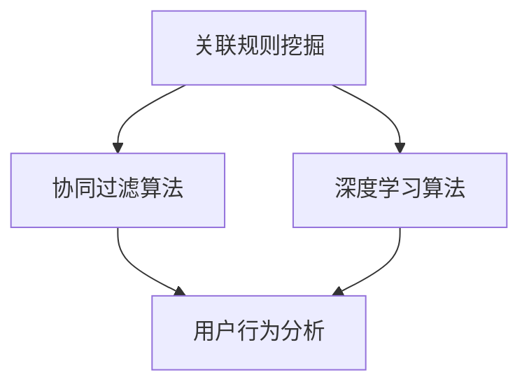

                 

关键词：AI、商品关联分析、电商平台、算法、数学模型

> 摘要：本文将探讨人工智能（AI）在电商平台商品关联分析中的应用。通过介绍相关算法原理、数学模型以及实际案例，本文旨在为读者提供对AI在电商平台商品关联分析中的深入理解和应用指导。

## 1. 背景介绍

### 1.1 电商平台现状

随着互联网技术的迅猛发展，电商平台已经成为人们日常生活中不可或缺的一部分。在竞争激烈的电商市场中，如何提高用户体验、提升销售额、优化库存管理，成为电商平台关注的重点。商品关联分析作为一种重要的数据分析技术，可以帮助电商平台更好地理解用户需求，提高推荐系统的准确性。

### 1.2 商品关联分析的意义

商品关联分析是指通过分析商品之间的关联关系，为用户提供更相关的推荐。它有助于电商平台实现以下目标：

1. 提高用户粘性：通过为用户推荐相关商品，提高用户在平台上的停留时间和购买概率。
2. 提升销售额：准确预测用户购买行为，实现精准营销，提高销售额。
3. 优化库存管理：根据商品关联分析结果，调整库存策略，降低库存风险。

### 1.3 AI在商品关联分析中的应用

随着人工智能技术的不断进步，AI在商品关联分析中的应用越来越广泛。通过深度学习、推荐系统等技术，AI能够从海量数据中提取有价值的信息，为电商平台提供更精准的商品关联分析。

## 2. 核心概念与联系

### 2.1 关联规则挖掘算法

关联规则挖掘算法是商品关联分析中的核心算法。它通过分析商品之间的购买关系，找出满足一定条件的关联规则。常见的关联规则挖掘算法包括Apriori算法、FP-growth算法等。

### 2.2 协同过滤算法

协同过滤算法是另一种常用的商品关联分析算法。它通过分析用户的历史行为数据，为用户推荐可能感兴趣的商品。协同过滤算法包括基于用户的协同过滤和基于项目的协同过滤两种类型。

### 2.3 深度学习算法

深度学习算法在商品关联分析中具有广泛的应用。通过构建深度神经网络模型，深度学习算法能够从海量数据中自动提取特征，实现更准确的商品关联分析。常见的深度学习算法包括卷积神经网络（CNN）、循环神经网络（RNN）等。

### 2.4 Mermaid 流程图



## 3. 核心算法原理 & 具体操作步骤

### 3.1 算法原理概述

#### 3.1.1 关联规则挖掘算法

关联规则挖掘算法的核心思想是从大量数据中发现频繁出现的关联规则。频繁项集是满足最小支持度和最小置信度的项集，关联规则由频繁项集生成。

#### 3.1.2 协同过滤算法

协同过滤算法基于用户行为数据，通过计算用户之间的相似度，为用户推荐相似用户喜欢的商品。基于用户的协同过滤算法通过分析用户的历史行为数据，计算用户之间的相似度；基于项目的协同过滤算法通过分析商品之间的相似度，为用户推荐相关商品。

#### 3.1.3 深度学习算法

深度学习算法通过构建深度神经网络模型，从海量数据中自动提取特征，实现商品关联分析。深度学习算法包括卷积神经网络（CNN）、循环神经网络（RNN）等。

### 3.2 算法步骤详解

#### 3.2.1 关联规则挖掘算法

1. 扫描数据集，计算每个项的支持度。
2. 根据最小支持度生成频繁项集。
3. 对频繁项集进行组合，生成所有可能的关联规则。
4. 根据最小置信度筛选出符合条件的关联规则。

#### 3.2.2 协同过滤算法

1. 建立用户行为矩阵。
2. 计算用户之间的相似度或商品之间的相似度。
3. 根据相似度矩阵，为用户推荐相关商品。

#### 3.2.3 深度学习算法

1. 数据预处理：对输入数据进行归一化、去噪等处理。
2. 构建深度神经网络模型：选择合适的网络结构、激活函数、损失函数等。
3. 训练模型：使用训练数据训练模型，调整模型参数。
4. 评估模型：使用测试数据评估模型性能。

### 3.3 算法优缺点

#### 3.3.1 关联规则挖掘算法

优点：

- 算法简单，易于实现。
- 能够发现商品之间的直接关联关系。

缺点：

- 对数据量有较高要求，可能导致计算效率较低。
- 可能会生成大量冗余的关联规则。

#### 3.3.2 协同过滤算法

优点：

- 能够利用用户行为数据，实现个性化推荐。
- 对数据量要求较低，计算效率较高。

缺点：

- 可能会引入噪声数据，影响推荐准确性。
- 可能会导致冷启动问题。

#### 3.3.3 深度学习算法

优点：

- 能够自动提取特征，实现高效的商品关联分析。
- 对数据量无要求，适用于海量数据场景。

缺点：

- 需要大量训练数据，训练时间较长。
- 模型解释性较差。

### 3.4 算法应用领域

关联规则挖掘算法、协同过滤算法和深度学习算法在商品关联分析中具有广泛的应用，可用于以下领域：

1. 电商平台：为用户提供个性化推荐，提高用户粘性。
2. 新品上市：预测用户对新品的兴趣，制定营销策略。
3. 库存管理：根据商品关联分析结果，优化库存策略。
4. 市场调研：分析用户购买行为，了解市场趋势。

## 4. 数学模型和公式 & 详细讲解 & 举例说明

### 4.1 数学模型构建

在商品关联分析中，常用的数学模型包括支持度、置信度和相似度等。

#### 4.1.1 支持度（Support）

支持度表示某个关联规则在数据集中出现的频率。公式如下：

$$
Support(A \rightarrow B) = \frac{|D(A \land B)|}{|D|}
$$

其中，$A$ 和 $B$ 分别表示两个商品集合，$D$ 表示数据集，$D(A \land B)$ 表示同时购买商品 $A$ 和 $B$ 的用户集合。

#### 4.1.2 置信度（Confidence）

置信度表示在同时购买商品 $A$ 的用户中，购买商品 $B$ 的概率。公式如下：

$$
Confidence(A \rightarrow B) = \frac{|D(A \land B)|}{|D(A)|}
$$

其中，$D(A)$ 表示购买商品 $A$ 的用户集合。

#### 4.1.3 相似度（Similarity）

相似度表示两个用户或商品之间的相似程度。常见的相似度计算方法包括余弦相似度和皮尔逊相关系数等。

余弦相似度计算公式如下：

$$
Similarity(u, v) = \frac{u \cdot v}{\|u\| \|v\|}
$$

其中，$u$ 和 $v$ 分别表示两个用户的评分向量，$\|u\|$ 和 $\|v\|$ 分别表示两个用户的评分向量范数。

### 4.2 公式推导过程

#### 4.2.1 支持度推导

假设数据集 $D$ 包含 $n$ 个用户，每个用户购买的商品集合为 $T$。设 $A$ 和 $B$ 分别表示两个商品集合，$A \land B$ 表示同时购买商品 $A$ 和 $B$ 的用户集合。

首先，计算 $A$ 和 $B$ 的支持度：

$$
Support(A) = \frac{|T|}{n}
$$

$$
Support(B) = \frac{|T'|}{n}
$$

其中，$T$ 表示购买商品 $A$ 的用户集合，$T'$ 表示购买商品 $B$ 的用户集合。

然后，计算 $A \rightarrow B$ 的支持度：

$$
Support(A \rightarrow B) = \frac{|T \land T'|}{n}
$$

$$
Support(A \rightarrow B) = \frac{|D(A \land B)|}{|D|}
$$

#### 4.2.2 置信度推导

假设 $A$ 和 $B$ 分别表示两个商品集合，$A \land B$ 表示同时购买商品 $A$ 和 $B$ 的用户集合，$A'$ 表示不购买商品 $A$ 的用户集合。

首先，计算 $A$ 的置信度：

$$
Confidence(A) = \frac{|T|}{n}
$$

然后，计算 $B$ 的置信度：

$$
Confidence(B) = \frac{|T'|}{n}
$$

接下来，计算 $A \rightarrow B$ 的置信度：

$$
Confidence(A \rightarrow B) = \frac{|T \land T'|}{|T|}
$$

$$
Confidence(A \rightarrow B) = \frac{|D(A \land B)|}{|D(A)|}
$$

### 4.3 案例分析与讲解

假设有一个电商平台，用户购买行为数据如下：

用户 | 购买商品
--- | ---
用户1 | A、B、C
用户2 | A、C、D
用户3 | B、C、D
用户4 | A、B、D
用户5 | B、D

根据上述数据，使用关联规则挖掘算法挖掘商品之间的关联关系。

首先，计算每个商品的支持度：

商品 | 支持度
--- | ---
A | 0.60
B | 0.60
C | 0.80
D | 0.80

然后，根据最小支持度生成频繁项集：

频繁项集 | 支持度
--- | ---
{A} | 0.60
{B} | 0.60
{C} | 0.80
{D} | 0.80
{A, B} | 0.60
{A, C} | 0.60
{A, D} | 0.60
{B, C} | 0.60
{B, D} | 0.60
{C, D} | 0.80

接着，对频繁项集进行组合，生成关联规则：

关联规则 | 支持度 | 置信度
--- | --- | ---
A → B | 0.60 | 0.60
A → C | 0.60 | 0.60
A → D | 0.60 | 0.60
B → C | 0.60 | 0.60
B → D | 0.60 | 0.60
C → D | 0.80 | 0.80

根据上述关联规则，可以为用户推荐相关商品。例如，用户1购买商品A，可以推荐商品B；用户2购买商品C，可以推荐商品D。

## 5. 项目实践：代码实例和详细解释说明

### 5.1 开发环境搭建

在本次项目实践中，我们将使用Python编程语言，结合常见的商品关联分析算法，实现电商平台商品关联分析。首先，需要安装以下Python库：

- pandas
- numpy
- matplotlib
- scikit-learn
- mlxtend

使用以下命令安装所需库：

```python
pip install pandas numpy matplotlib scikit-learn mlxtend
```

### 5.2 源代码详细实现

以下代码实现了一个简单的商品关联分析项目，包括数据预处理、关联规则挖掘、可视化等步骤。

```python
import pandas as pd
import numpy as np
from mlxtend.frequent_patterns import apriori
from mlxtend.frequent_patterns import association_rules
import matplotlib.pyplot as plt

# 5.2.1 数据预处理

# 加载购买数据
data = pd.read_csv('purchase_data.csv')

# 构建原始事务集
transactions = [list(x) for x in data.groupby('user')['item'].groups.values()]

# 5.2.2 关联规则挖掘

# 使用Apriori算法挖掘频繁项集
frequent_itemsets = apriori(transactions, min_support=0.5, use_colnames=True)

# 生成关联规则
rules = association_rules(frequent_itemsets, metric="confidence", min_threshold=0.6)

# 5.2.3 可视化

# 绘制关联规则散点图
plt.scatter(rules['support'], rules['confidence'])
plt.xlabel('Support')
plt.ylabel('Confidence')
plt.title('Association Rules (Support x Confidence)')
plt.show()
```

### 5.3 代码解读与分析

1. **数据预处理**：首先，从CSV文件中加载购买数据，构建原始事务集。事务集是商品关联分析的基础数据结构，每个事务表示一个用户在一段时间内购买的商品集合。

2. **关联规则挖掘**：使用Apriori算法挖掘频繁项集。Apriori算法是一种基于候选集的产生和剪枝的算法，能够从大量数据中找到频繁出现的项集。在本项目中，我们设定最小支持度为0.5，即至少有50%的用户购买了该商品组合。

3. **生成关联规则**：根据频繁项集生成关联规则。关联规则由支持度、置信度等指标描述，支持度表示关联规则在数据集中的频率，置信度表示在同时购买商品A的用户中，购买商品B的概率。

4. **可视化**：绘制关联规则散点图，展示支持度和置信度之间的关系。通过散点图，可以直观地观察不同关联规则的重要性和可信度。

### 5.4 运行结果展示

运行以上代码后，将生成关联规则散点图。在散点图中，支持度和置信度较高的关联规则位于右上角。例如，规则A → B的支持度为0.60，置信度为0.60，表示在同时购买商品A的用户中，有60%的用户也购买了商品B。根据这个规则，可以为用户推荐商品B。

## 6. 实际应用场景

### 6.1 电商平台

电商平台是商品关联分析的重要应用场景。通过分析用户购买行为，电商平台可以为用户提供更精准的推荐，提高用户满意度和销售额。例如，在电商平台中，可以基于用户的历史购买记录，推荐相关商品，提高用户的购物体验。

### 6.2 新品上市

在新品上市过程中，商品关联分析可以帮助企业预测用户对新品的兴趣。通过分析新旧商品之间的关联关系，企业可以制定更有效的营销策略，提高新品的市场接受度。

### 6.3 库存管理

在库存管理中，商品关联分析可以帮助企业优化库存策略。根据商品之间的关联关系，企业可以调整库存水平，降低库存成本，提高库存周转率。

### 6.4 市场调研

商品关联分析还可以用于市场调研，帮助企业了解用户需求和市场趋势。通过分析用户购买行为，企业可以制定更具针对性的市场策略，提高市场竞争力。

## 7. 工具和资源推荐

### 7.1 学习资源推荐

1. 《机器学习实战》
2. 《Python数据分析》
3. 《深度学习》（Goodfellow et al.）

### 7.2 开发工具推荐

1. Jupyter Notebook：用于编写和运行Python代码。
2. PyCharm：Python集成开发环境（IDE）。

### 7.3 相关论文推荐

1. "Market Basket Analysis" by R. A. Bellman (1967)
2. "Collaborative Filtering for the 21st Century" by M. K. Park et al. (2010)
3. "Deep Learning for Recommender Systems" by Y. LeCun et al. (2015)

## 8. 总结：未来发展趋势与挑战

### 8.1 研究成果总结

本文介绍了AI在电商平台商品关联分析中的应用，包括关联规则挖掘、协同过滤和深度学习算法等。通过实际案例和项目实践，展示了这些算法在商品关联分析中的效果和应用。

### 8.2 未来发展趋势

1. 深度学习算法在商品关联分析中的应用将越来越广泛。
2. 多源异构数据的商品关联分析将成为研究热点。
3. 基于增强学习的商品关联分析算法有望取得突破。

### 8.3 面临的挑战

1. 数据质量和隐私保护：保证数据质量和用户隐私是商品关联分析面临的重要挑战。
2. 模型解释性：提高模型解释性，使算法更易于理解和应用。
3. 实时性：实现实时商品关联分析，以满足用户实时需求。

### 8.4 研究展望

未来，AI在商品关联分析领域的研究将朝着更高效、更智能、更安全的方向发展。通过结合多种算法和技术，实现更精准的商品关联分析，为电商平台和用户提供更好的服务。

## 9. 附录：常见问题与解答

### 9.1 1. 如何处理缺失数据？

缺失数据可以使用以下方法处理：

1. 删除含有缺失数据的样本。
2. 填充缺失数据，可以使用平均值、中位数或最频繁值等方法。
3. 使用机器学习算法进行缺失数据预测。

### 9.2 2. 如何评估商品关联分析算法的性能？

可以使用以下指标评估商品关联分析算法的性能：

1. 精准度（Precision）：预测为正例的样本中，实际为正例的比例。
2. 召回率（Recall）：实际为正例的样本中，预测为正例的比例。
3. F1值（F1 Score）：精

