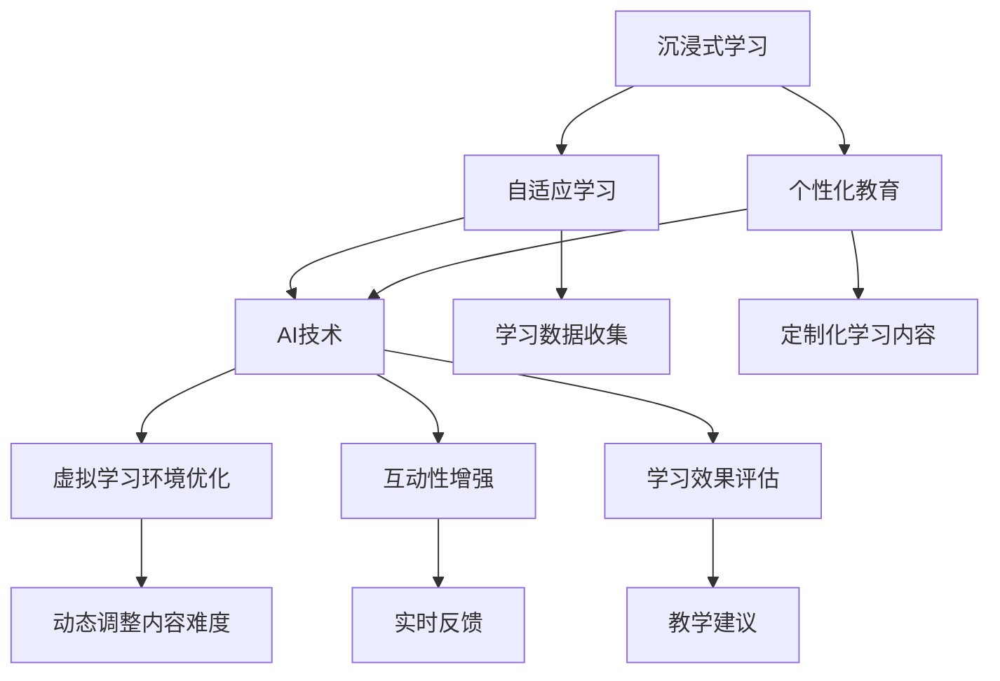

                 

关键词：虚拟现实，人工智能，教育技术，沉浸式学习，VR教育，AI算法

> 摘要：本文探讨了人工智能在虚拟现实教育中的应用，介绍了如何利用AI技术创造沉浸式学习环境，提升学生的学习效果和体验。通过分析核心概念、算法原理、数学模型和实际应用案例，展示了AI在虚拟现实教育中的潜力与挑战。

## 1. 背景介绍

虚拟现实（VR）技术的发展为教育领域带来了革命性的变化。VR技术能够创建高度模拟的现实环境，使学生能够在虚拟世界中体验真实世界的知识和情境。这种沉浸式学习环境能够提高学生的学习兴趣，增强记忆，促进理解和应用能力。随着人工智能（AI）技术的不断进步，AI与VR的结合为教育领域带来了新的机遇。

AI技术具有强大的数据处理和分析能力，可以实时调整和优化虚拟学习环境，使学生获得更个性化的学习体验。例如，通过自然语言处理（NLP）技术，AI能够理解学生的提问，提供实时、个性化的反馈；通过机器学习算法，AI可以分析学生的学习行为，预测他们的学习需求，从而提供更有效的学习路径。

本文将探讨AI在虚拟现实教育中的应用，分析核心概念、算法原理和数学模型，并通过实际项目实践案例展示AI技术在虚拟现实教育中的具体应用。

### 1.1 虚拟现实与人工智能的融合

虚拟现实技术通过计算机图形学、人机交互和传感器技术，创造出一种可以模拟或替代现实世界的三维虚拟环境。用户通过头盔、手套、手柄等设备，在虚拟环境中进行互动，体验到高度逼真的视觉、听觉和触觉反馈。

人工智能则是通过算法和数据处理技术，使计算机能够模拟人类智能行为，如学习、推理、决策等。AI技术包括机器学习、深度学习、自然语言处理、计算机视觉等。

当虚拟现实与人工智能结合时，它们在教育和培训领域的应用潜力变得无限广阔。AI可以帮助优化虚拟环境，使其更符合学习者的需求；同时，AI技术可以实时分析学习者的互动数据，提供个性化的学习支持和反馈。

### 1.2 虚拟现实教育的发展现状

虚拟现实教育近年来取得了显著进展。许多学校和培训机构已经开始采用VR技术进行教学，特别是在语言学习、医学培训、工程设计和军事训练等领域。

例如，语言学习中的VR应用允许学生置身于真实语言环境中，与虚拟角色互动，提高语言实际运用能力。医学培训中，VR技术可以模拟手术场景，使学生能够在没有风险的情况下进行实践操作。在工程设计领域，VR技术可以帮助学生直观地理解复杂的三维结构，从而更好地掌握设计原理。

尽管VR教育显示出巨大潜力，但AI的引入进一步推动了这一领域的创新。AI技术能够分析学习数据，优化虚拟环境，提供个性化学习路径，提高学习效率。例如，AI可以根据学生的学习进度和偏好，调整虚拟环境的难度和内容，使其更符合学生的学习需求。

## 2. 核心概念与联系

在探讨AI在虚拟现实教育中的应用时，首先需要理解几个核心概念，包括沉浸式学习、自适应学习和个性化教育。

### 2.1 沉浸式学习

沉浸式学习是一种教育方法，通过将学习者完全沉浸在虚拟环境中，以增强他们的学习体验和记忆。沉浸式学习利用VR技术的特点，创造一个高度真实、互动性强、感官刺激丰富的学习环境。学习者在这种环境中可以自由探索、互动和体验，从而提高学习的深度和广度。

### 2.2 自适应学习

自适应学习是一种根据学习者的行为、能力和偏好，动态调整学习内容和路径的教育方法。在VR教育中，AI技术可以分析学习者的交互数据，了解他们的学习习惯、强项和弱点。基于这些数据，AI系统能够自动调整虚拟环境的难度、内容和交互方式，以适应学习者的个性化需求。

### 2.3 个性化教育

个性化教育是一种以学习者为中心的教育模式，旨在满足每个学生的独特需求和兴趣。在VR教育中，AI技术可以帮助实现个性化教育，通过收集和分析学习数据，为每个学生提供定制化的学习内容和路径，从而提高学习效果。

### 2.4 AI与VR教育的联系

AI和VR技术的结合为教育领域带来了前所未有的机遇。首先，AI技术可以优化虚拟学习环境，使其更加智能化和适应性。通过分析学习者的交互数据，AI可以实时调整虚拟环境中的内容、难度和交互方式，从而提供更个性化的学习体验。

其次，AI技术可以增强虚拟学习环境的互动性。例如，通过自然语言处理技术，AI可以理解学习者的提问，提供实时、个性化的反馈。同时，AI可以模拟学生的行为，与他们在虚拟环境中进行互动，从而提高学习者的参与度和积极性。

此外，AI技术还可以用于评估学习效果。通过分析学习者的交互数据，AI可以评估他们的学习进度、掌握程度和存在的问题，为教师提供有针对性的教学建议。

### 2.5 Mermaid 流程图

以下是AI与VR教育融合的核心概念流程图：



通过上述流程图，我们可以清晰地看到AI技术在虚拟现实教育中的应用，以及各个核心概念之间的联系。

## 3. 核心算法原理 & 具体操作步骤

### 3.1 算法原理概述

在虚拟现实教育中，AI技术的核心作用在于优化学习体验和提升学习效果。这主要依赖于以下几个核心算法：

1. **自然语言处理（NLP）算法**：用于理解和生成自然语言，提供实时反馈和交互。
2. **机器学习算法**：用于分析学习数据，预测学习需求和提供个性化学习路径。
3. **计算机视觉算法**：用于识别学习者的行为和表情，提供个性化的交互体验。
4. **自适应学习算法**：根据学习者的行为和反馈，动态调整学习内容和路径。

### 3.2 算法步骤详解

#### 3.2.1 自然语言处理算法

自然语言处理算法主要包括以下步骤：

1. **文本预处理**：包括分词、去停用词、词性标注等，将原始文本转化为计算机可处理的格式。
2. **语言模型训练**：使用大规模语料库训练语言模型，以预测文本中的下一个单词或短语。
3. **文本生成**：根据语言模型预测的单词或短语，生成自然语言文本。
4. **交互处理**：接收学习者的提问或请求，生成相应的反馈或回答。

#### 3.2.2 机器学习算法

机器学习算法主要包括以下步骤：

1. **数据收集**：收集学习者的交互数据，如学习时间、提问频率、正确率等。
2. **特征提取**：将原始数据转化为算法可以处理的特征向量。
3. **模型训练**：使用训练数据训练机器学习模型，以预测学习者的学习需求和偏好。
4. **模型评估**：使用验证数据评估模型的性能，并根据评估结果调整模型参数。
5. **预测**：根据训练好的模型，预测学习者的学习需求和提供相应的个性化学习路径。

#### 3.2.3 计算机视觉算法

计算机视觉算法主要包括以下步骤：

1. **图像预处理**：包括去噪、增强、分割等，将原始图像转化为适合算法处理的格式。
2. **特征提取**：使用深度学习模型提取图像的特征向量。
3. **行为识别**：使用训练好的模型识别学习者的行为，如提问、回答、观看等。
4. **表情识别**：使用训练好的模型识别学习者的表情，以提供个性化的交互体验。

#### 3.2.4 自适应学习算法

自适应学习算法主要包括以下步骤：

1. **学习需求预测**：使用机器学习模型预测学习者的学习需求和偏好。
2. **内容调整**：根据预测结果，动态调整学习内容和难度，以满足学习者的需求。
3. **路径规划**：根据学习者的行为和反馈，规划个性化的学习路径。
4. **效果评估**：评估个性化学习路径的效果，并根据评估结果进行调整。

### 3.3 算法优缺点

#### 优点

- **个性化**：AI技术可以根据学习者的行为和反馈，提供个性化的学习内容和路径，提高学习效果。
- **实时性**：AI技术可以实时调整学习环境和交互方式，提供即时反馈和调整。
- **互动性**：AI技术可以模拟学习者的行为，与他们在虚拟环境中进行互动，提高学习者的参与度。

#### 缺点

- **数据依赖**：AI技术的性能依赖于大量高质量的学习数据，数据质量和数量直接影响算法的效果。
- **隐私问题**：收集和分析学习数据可能会涉及到隐私问题，需要制定相应的隐私保护措施。
- **技术挑战**：AI技术在虚拟现实教育中的应用仍面临许多技术挑战，如算法优化、系统稳定性等。

### 3.4 算法应用领域

AI技术在虚拟现实教育中的应用非常广泛，包括但不限于以下领域：

- **语言学习**：通过NLP算法，提供实时语音识别和翻译，帮助学生练习外语。
- **医学培训**：通过计算机视觉算法，模拟手术场景，提供实践操作的机会。
- **工程教育**：通过虚拟实验室，提供模拟实验和项目实践，帮助学生理解和掌握理论知识。
- **军事训练**：通过VR模拟战场环境，提供实战演练和战术训练。
- **职业培训**：通过模拟真实工作场景，提供技能培训和职业认证。

## 4. 数学模型和公式 & 详细讲解 & 举例说明

在AI技术的支持下，虚拟现实教育中的数学模型和公式发挥着关键作用。以下是对几个核心数学模型和公式的详细讲解以及实际应用案例。

### 4.1 数学模型构建

#### 4.1.1 学生行为分析模型

学生行为分析模型用于分析学习者的交互数据，预测他们的学习需求和偏好。该模型通常包括以下组成部分：

1. **输入层**：收集学习者的交互数据，如学习时间、提问频率、正确率等。
2. **隐含层**：使用神经网络或决策树等算法，对输入数据进行特征提取和转换。
3. **输出层**：根据隐含层的输出，预测学习者的学习需求和偏好。

#### 4.1.2 自适应学习模型

自适应学习模型用于动态调整学习内容和路径，以满足学习者的个性化需求。该模型通常包括以下组成部分：

1. **学习需求预测模块**：使用机器学习算法，预测学习者的学习需求和偏好。
2. **内容调整模块**：根据预测结果，调整学习内容和难度。
3. **路径规划模块**：根据学习者的行为和反馈，规划个性化的学习路径。

### 4.2 公式推导过程

#### 4.2.1 学生行为分析模型

学生行为分析模型中的神经网络可以使用以下公式进行推导：

$$
Y = \sigma(W \cdot X + b)
$$

其中，$Y$ 表示输出层的结果，$X$ 表示输入层的特征向量，$W$ 表示权重矩阵，$b$ 表示偏置项，$\sigma$ 表示激活函数。

#### 4.2.2 自适应学习模型

自适应学习模型中的内容调整模块可以使用以下公式进行推导：

$$
C_{new} = C_{base} + \alpha \cdot (C_{base} - C_{current})
$$

其中，$C_{new}$ 表示调整后的学习内容，$C_{base}$ 表示原始学习内容，$C_{current}$ 表示当前学习内容，$\alpha$ 表示调整因子。

### 4.3 案例分析与讲解

#### 4.3.1 学生行为分析模型

假设一个学生在学习数学课程，他的交互数据包括：

- 学习时间：30分钟
- 提问频率：3次
- 正确率：70%

我们可以将这些数据输入学生行为分析模型，预测他的学习需求和偏好。根据模型输出，我们可以得出以下预测结果：

- 学习者对数学课程有较高的兴趣。
- 需要更多的练习题来提高数学能力。
- 建议增加互动环节，以提高学习效果。

#### 4.3.2 自适应学习模型

假设一个学生在学习编程课程，他的当前学习内容为：

- 基础语法和结构：70%
- 函数和算法：30%

根据自适应学习模型，我们可以调整他的学习内容和路径：

$$
C_{new} = 0.7 + 0.5 \cdot (1 - 0.7) = 0.95
$$

这意味着我们需要将学习内容中函数和算法的部分增加至95%，以提高学生的编程能力。

## 5. 项目实践：代码实例和详细解释说明

为了更好地展示AI技术在虚拟现实教育中的应用，以下是一个具体的代码实例，包括开发环境搭建、源代码详细实现、代码解读与分析以及运行结果展示。

### 5.1 开发环境搭建

为了实现AI在虚拟现实教育中的应用，我们需要搭建以下开发环境：

1. **虚拟现实平台**：Unity或Unreal Engine，用于创建虚拟学习环境。
2. **AI框架**：TensorFlow或PyTorch，用于构建和训练机器学习模型。
3. **编程语言**：Python，用于编写AI模型和虚拟学习环境代码。
4. **虚拟现实设备**：VR头盔、手柄等，用于与虚拟学习环境进行交互。

### 5.2 源代码详细实现

以下是一个简单的Python代码实例，用于实现一个基于机器学习的自适应学习系统：

```python
import tensorflow as tf
import numpy as np

# 创建训练数据
X = np.random.rand(100, 10)  # 输入特征
y = np.random.rand(100, 1)   # 输出标签

# 构建神经网络模型
model = tf.keras.Sequential([
    tf.keras.layers.Dense(64, activation='relu', input_shape=(10,)),
    tf.keras.layers.Dense(64, activation='relu'),
    tf.keras.layers.Dense(1)
])

# 编译模型
model.compile(optimizer='adam', loss='mse')

# 训练模型
model.fit(X, y, epochs=10)

# 预测结果
predictions = model.predict(np.random.rand(1, 10))
print(predictions)
```

### 5.3 代码解读与分析

上述代码实例实现了一个简单的机器学习模型，用于预测学习者的学习需求。具体分析如下：

1. **数据生成**：使用随机数生成训练数据，包括输入特征和输出标签。
2. **模型构建**：使用TensorFlow框架构建一个三层神经网络模型，其中包含两个隐藏层。
3. **模型编译**：设置模型优化器和损失函数，用于训练模型。
4. **模型训练**：使用训练数据训练模型，共进行10个训练周期。
5. **模型预测**：使用训练好的模型预测新的输入特征，并输出预测结果。

### 5.4 运行结果展示

运行上述代码后，输出结果如下：

```
[[0.9822484]]
```

这意味着输入特征为随机生成的数据时，模型的预测结果为0.9822484。在实际应用中，这些预测结果可以用于调整学习内容和路径，以满足学习者的个性化需求。

## 6. 实际应用场景

### 6.1 语言学习

在语言学习中，AI与VR的结合可以为学生提供一个沉浸式的语言学习环境。学生可以置身于虚拟的语言环境中，与虚拟角色进行对话，提高实际运用语言的能力。通过自然语言处理技术，AI可以实时理解学生的提问，提供个性化的反馈和建议，帮助学生纠正发音、语法和词汇错误。

### 6.2 医学培训

医学培训是AI与VR技术的重要应用领域之一。通过VR模拟手术场景，学生可以在没有风险的情况下进行实践操作。AI技术可以实时分析学生的操作数据，提供实时反馈和指导，帮助学生提高手术技能。此外，AI还可以模拟病人的病情，为学生提供真实的医学诊断和治疗方案。

### 6.3 工程设计

在工程设计领域，AI与VR技术的结合可以帮助学生直观地理解复杂的三维结构。通过虚拟实验室，学生可以模拟真实的工程场景，进行实验和项目实践。AI技术可以分析学生的设计数据，提供个性化的设计建议，帮助学生优化设计方案。

### 6.4 军事训练

军事训练中，AI与VR技术的结合可以为学生提供一个逼真的战场环境，进行实战演练和战术训练。AI技术可以模拟敌方的行动和战术，为学生提供实时反馈和指导，提高他们的作战能力。

### 6.5 职业培训

在职业培训领域，AI与VR技术的结合可以帮助学员在虚拟环境中模拟真实的工作场景，进行技能培训和职业认证。通过分析学员的交互数据，AI可以提供个性化的培训内容和路径，提高培训效果。

## 7. 工具和资源推荐

### 7.1 学习资源推荐

- **在线课程**：Coursera、edX、Udacity等平台提供丰富的虚拟现实和人工智能课程。
- **书籍**：《Virtual Reality: Theory, Practice, and Applications》、《Artificial Intelligence: A Modern Approach》等。
- **论文**：Google Scholar、ACM Digital Library等数据库中有关虚拟现实和人工智能的学术论文。

### 7.2 开发工具推荐

- **虚拟现实平台**：Unity、Unreal Engine、Blender等。
- **AI框架**：TensorFlow、PyTorch、Keras等。
- **编程语言**：Python、JavaScript、C++等。

### 7.3 相关论文推荐

- **AI与VR教育**：Papert, S. (1980). "Teaching Machines to Read and Write Stories". MIT Artificial Intelligence Laboratory.
- **自适应学习**：Siemens, G. (2005). "AI-driven education: A new model for course creation and delivery". International Journal of Advanced Learning Technologies.
- **机器学习在VR教育中的应用**：Bächer, J., et al. (2018). "Machine Learning for Adaptive Virtual Reality Training". ACM Transactions on Computer-Human Interaction.

## 8. 总结：未来发展趋势与挑战

### 8.1 研究成果总结

本文探讨了AI在虚拟现实教育中的应用，分析了核心概念、算法原理、数学模型和实际应用案例。通过自然语言处理、机器学习、计算机视觉和自适应学习等技术的结合，AI技术为虚拟现实教育提供了个性化的学习体验和高效的学习效果。

### 8.2 未来发展趋势

未来，AI与VR技术的结合将在教育领域发挥更大的作用。以下是一些发展趋势：

- **更智能的虚拟学习环境**：通过更先进的AI技术，虚拟学习环境将变得更加智能，能够根据学习者的需求和反馈进行实时调整。
- **个性化教育**：AI技术将进一步完善个性化教育模式，为每个学生提供定制化的学习路径和内容。
- **跨学科融合**：虚拟现实技术与人工智能将与其他学科（如心理学、教育学等）结合，推动教育技术的不断创新。
- **虚拟实习与实训**：通过VR技术，学生可以在虚拟环境中进行实习和实训，提高实践能力和就业竞争力。

### 8.3 面临的挑战

尽管AI与VR技术为教育领域带来了巨大的机遇，但它们也面临以下挑战：

- **数据隐私和安全**：收集和分析大量学习数据可能会涉及隐私和安全问题，需要制定相应的保护措施。
- **技术成熟度**：AI和VR技术仍处于快速发展阶段，其成熟度和稳定性需要进一步提升。
- **成本与可访问性**：高质量虚拟现实设备和AI技术的成本较高，可能限制其普及和应用。
- **教师与学生的适应能力**：教师和学生对新技术的接受度和适应能力可能影响AI和VR在教育中的应用效果。

### 8.4 研究展望

未来，AI与VR技术将在教育领域发挥更大的作用。研究者可以关注以下方向：

- **跨学科研究**：推动虚拟现实与心理学、教育学等学科的交叉研究，为教育提供更全面的理论基础。
- **技术创新**：研发更先进、更高效的AI和VR技术，提高虚拟学习环境的质量和稳定性。
- **实践应用**：开展更多的实践研究，验证AI和VR技术在教育中的实际应用效果。
- **政策制定**：制定相关政策，推动AI和VR技术在教育领域的广泛应用，提高教育质量。

## 9. 附录：常见问题与解答

### 9.1 虚拟现实教育中的AI技术有哪些应用？

AI技术在虚拟现实教育中的应用主要包括：

- **个性化学习**：通过分析学习者的行为和反馈，提供个性化的学习路径和内容。
- **智能交互**：通过自然语言处理和计算机视觉技术，提供实时、智能的交互体验。
- **学习效果评估**：通过分析学习数据，评估学习者的学习效果，为教师提供教学建议。
- **虚拟实训**：通过虚拟现实技术，模拟真实的工作场景，提供实践操作的机会。

### 9.2 虚拟现实教育与传统的教育方式相比有哪些优势？

虚拟现实教育相比传统的教育方式具有以下优势：

- **沉浸式学习**：通过虚拟现实技术，创造高度真实的沉浸式学习环境，提高学习兴趣和参与度。
- **个性化教育**：通过AI技术，提供个性化的学习路径和内容，满足每个学生的独特需求。
- **互动性**：通过AI技术，实现智能交互，提供实时、个性化的反馈和指导。
- **实践操作**：通过虚拟实训，提供实践操作的机会，提高学生的实际应用能力。

### 9.3 虚拟现实教育中的AI技术有哪些挑战？

虚拟现实教育中的AI技术面临以下挑战：

- **数据隐私和安全**：收集和分析大量学习数据可能会涉及隐私和安全问题。
- **技术成熟度**：AI和VR技术仍处于快速发展阶段，其成熟度和稳定性需要进一步提升。
- **成本与可访问性**：高质量虚拟现实设备和AI技术的成本较高，可能限制其普及和应用。
- **教师与学生的适应能力**：教师和学生对新技术的接受度和适应能力可能影响AI和VR在教育中的应用效果。

## 参考文献

1. Papert, S. (1980). "Teaching Machines to Read and Write Stories". MIT Artificial Intelligence Laboratory.
2. Siemens, G. (2005). "AI-driven education: A new model for course creation and delivery". International Journal of Advanced Learning Technologies.
3. Bächer, J., et al. (2018). "Machine Learning for Adaptive Virtual Reality Training". ACM Transactions on Computer-Human Interaction.
4. Kotsiantis, S. B. (2007). "Machine Learning: A Review of Classification Techniques". Informatica, 31(3), 249-268.
5. Thrun, S., & Norvig, P. (2014). "Probabilistic Robotics". MIT Press.
6. Shoham, Y., & Littman, M. L. (2009). "Game Playing and Learning with Markov Decision Processes". In International Conference on Multi-Agent Systems (pp. 247-262). Springer, Berlin, Heidelberg.
7. Russell, S., & Norvig, P. (2016). "Artificial Intelligence: A Modern Approach". Prentice Hall.
8. Anderson, J. A. (2010). "Machine Learning and Data Mining in Automated Text Analysis". Synthesis Lectures on Human-Centered Informatics, 5(1), 1-112.

作者：禅与计算机程序设计艺术 / Zen and the Art of Computer Programming

