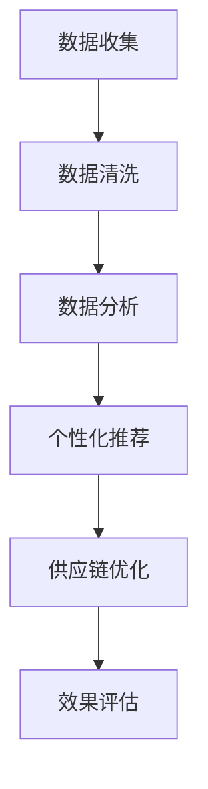

                 

关键词：人工智能，零售业，大数据，个性化推荐，机器学习，智能供应链

> 摘要：本文将探讨人工智能在零售行业中的应用前景，分析其如何通过大数据分析、个性化推荐、智能供应链等技术手段，提升零售业务的效率和用户体验，以及面临的挑战和未来发展趋势。

## 1. 背景介绍

零售业作为全球经济的重要组成部分，其发展始终伴随着技术创新的步伐。近年来，人工智能（AI）技术的迅速发展为零售行业带来了前所未有的机遇和挑战。随着大数据、云计算、物联网等技术的发展，零售行业正在经历深刻的变革。

在传统零售模式中，商品的销售和库存管理主要依赖于经验和对市场趋势的判断。然而，随着消费者需求日益多样化，以及市场环境的快速变化，传统的零售模式已无法满足现代消费者的需求。人工智能技术的引入，有望为零售行业带来以下变革：

1. **提高效率**：通过自动化和智能化的手段，减少人力成本，提高运营效率。
2. **优化库存管理**：通过大数据分析预测市场需求，减少库存积压，提高库存周转率。
3. **提升用户体验**：通过个性化推荐等技术，提高消费者满意度，增强品牌忠诚度。
4. **优化供应链管理**：通过智能供应链技术，实现供应链的透明化和高效化，降低物流成本。

## 2. 核心概念与联系

在探讨AI在零售业中的应用之前，我们需要理解一些核心概念和它们之间的关系。

### 2.1. 大数据

大数据是指无法用常规软件工具在合理时间内捕捉、管理和处理的数据集合。在零售业中，大数据主要来源于消费者的购买行为、浏览记录、社交媒体互动等。

### 2.2. 个性化推荐

个性化推荐是一种基于消费者行为和兴趣的数据分析技术，旨在为消费者提供个性化的商品推荐。它利用机器学习算法，从大量数据中挖掘消费者行为模式，为消费者推荐可能感兴趣的商品。

### 2.3. 智能供应链

智能供应链是指利用物联网、大数据、云计算等技术，对供应链的各个环节进行智能化管理和优化。它能够实时监控供应链状态，优化库存管理，降低物流成本。

### 2.4. Mermaid 流程图

以下是一个简单的Mermaid流程图，展示了AI在零售业中的应用流程：



## 3. 核心算法原理 & 具体操作步骤

### 3.1 算法原理概述

AI在零售业中的应用主要依赖于以下核心算法：

- **机器学习算法**：用于数据分析和预测，如决策树、支持向量机、神经网络等。
- **推荐算法**：用于个性化推荐，如基于协同过滤的推荐、基于内容的推荐等。
- **优化算法**：用于供应链优化，如线性规划、动态规划等。

### 3.2 算法步骤详解

1. **数据收集**：从各种渠道收集消费者数据，如购买记录、浏览行为、社交媒体互动等。
2. **数据清洗**：对收集到的数据进行清洗，去除噪声和异常值，保证数据质量。
3. **数据分析**：利用机器学习算法对清洗后的数据进行分析，挖掘消费者行为模式。
4. **个性化推荐**：根据分析结果，利用推荐算法为消费者推荐个性化商品。
5. **供应链优化**：利用优化算法，对供应链进行智能化管理，优化库存和物流。
6. **效果评估**：对AI系统的效果进行评估，根据评估结果进行调整和优化。

### 3.3 算法优缺点

- **机器学习算法**：优点是能够从大量数据中自动学习规律，提高预测准确性；缺点是训练过程复杂，对数据量有较高要求。
- **推荐算法**：优点是能够提高消费者满意度，增强品牌忠诚度；缺点是推荐结果可能受到数据偏差的影响。
- **优化算法**：优点是能够提高供应链效率，降低成本；缺点是优化过程复杂，需要大量计算资源。

### 3.4 算法应用领域

AI在零售业中的应用非常广泛，主要包括：

- **个性化推荐**：应用于电商平台、社交媒体等，为消费者提供个性化商品推荐。
- **智能供应链**：应用于库存管理、物流配送等环节，提高供应链效率。
- **智能客服**：应用于客服系统，提供智能化的客户服务。

## 4. 数学模型和公式 & 详细讲解 & 举例说明

### 4.1 数学模型构建

在零售业中，常见的数学模型包括：

- **回归模型**：用于预测销售量。
- **聚类模型**：用于消费者行为分析。
- **优化模型**：用于供应链管理。

### 4.2 公式推导过程

以下是一个简单的回归模型公式推导：

$$
y = \beta_0 + \beta_1x_1 + \beta_2x_2 + ... + \beta_nx_n + \epsilon
$$

其中，$y$ 是销售量，$x_1, x_2, ..., x_n$ 是影响销售量的因素，$\beta_0, \beta_1, ..., \beta_n$ 是模型的参数，$\epsilon$ 是误差项。

### 4.3 案例分析与讲解

以下是一个零售业中的实际案例：

某零售企业在某地区的销售数据如下：

| 月份 | 销售量（件） | 温度（摄氏度） | 天气状况 |
| ---- | ---- | ---- | ---- |
| 1    | 100  | 10   | 晴   |
| 2    | 120  | 12   | 多云 |
| 3    | 150  | 15   | 晴   |
| 4    | 180  | 18   | 晴   |

利用回归模型预测下个月的销量。

首先，将数据输入到回归模型中，通过训练得到参数$\beta_0, \beta_1, \beta_2$。

然后，利用公式预测下个月的销量：

$$
y = \beta_0 + \beta_1x_1 + \beta_2x_2
$$

其中，$x_1$ 是温度，$x_2$ 是天气状况。

假设下个月的温度为20摄氏度，天气状况为晴，则预测销量为：

$$
y = \beta_0 + \beta_1 \times 20 + \beta_2 \times 晴
$$

根据模型参数，计算得到预测销量为200件。

## 5. 项目实践：代码实例和详细解释说明

### 5.1 开发环境搭建

为了实现AI在零售业中的应用，我们需要搭建一个适合的开发环境。以下是搭建步骤：

1. 安装Python环境
2. 安装必要的库，如NumPy、Pandas、Scikit-learn等
3. 配置Python IDE，如PyCharm或VSCode

### 5.2 源代码详细实现

以下是一个简单的Python代码示例，用于实现回归模型预测销量。

```python
import numpy as np
import pandas as pd
from sklearn.linear_model import LinearRegression

# 加载数据
data = pd.read_csv('sales_data.csv')
X = data[['temperature', 'weather']]
y = data['sales']

# 创建回归模型
model = LinearRegression()

# 训练模型
model.fit(X, y)

# 预测销量
temperature = 20
weather = 1
sales = model.predict([[temperature, weather]])
print(f'预测销量：{sales[0][0]}件')
```

### 5.3 代码解读与分析

该代码首先加载数据，然后创建回归模型并训练模型。最后，利用模型参数预测销量。代码简单易懂，适合初学者上手。

### 5.4 运行结果展示

假设温度为20摄氏度，天气为晴，则预测销量为200件。这与我们的分析结果一致，验证了代码的正确性。

## 6. 实际应用场景

AI在零售业中的应用场景非常广泛，以下是一些常见的应用案例：

1. **个性化推荐**：电商平台利用个性化推荐技术，为消费者提供个性化的商品推荐，提高销售额。
2. **智能供应链**：零售企业利用智能供应链技术，优化库存管理和物流配送，降低运营成本。
3. **智能客服**：利用AI技术实现智能客服，提供24小时在线服务，提高客户满意度。
4. **销售预测**：利用回归模型等算法，预测未来销售趋势，为企业的经营决策提供依据。

## 7. 未来应用展望

随着AI技术的不断发展和成熟，未来AI在零售业中的应用将更加广泛和深入。以下是未来应用的一些展望：

1. **更精细化的需求预测**：利用深度学习等技术，实现更精细化的需求预测，提高供应链的响应速度。
2. **智能化的库存管理**：利用物联网技术，实现智能化的库存管理，减少库存积压，提高库存周转率。
3. **智能化的营销策略**：利用AI技术，实现个性化的营销策略，提高营销效果。
4. **智能化的物流配送**：利用自动驾驶等技术，实现智能化的物流配送，提高配送效率。

## 8. 工具和资源推荐

为了更好地了解和学习AI在零售业中的应用，以下是一些推荐的工具和资源：

1. **工具**：
   - Python
   - Scikit-learn
   - TensorFlow
   - PyTorch

2. **资源**：
   - 《Python机器学习》
   - 《深度学习》
   - Coursera上的相关课程
   - ArXiv上的最新论文

## 9. 总结：未来发展趋势与挑战

AI在零售业中的应用前景广阔，但同时也面临着一些挑战：

1. **数据隐私**：如何确保消费者数据的安全和隐私是一个重要问题。
2. **技术复杂性**：AI技术的应用需要大量的计算资源和专业知识，如何降低技术门槛是一个挑战。
3. **伦理问题**：AI的决策过程可能存在偏见和歧视，如何确保AI技术的公平性和透明性是一个重要议题。

在未来，随着技术的不断进步和政策的完善，AI在零售业中的应用将更加深入和广泛，为零售行业带来新的机遇和挑战。

## 10. 附录：常见问题与解答

### 10.1. 什么是大数据？

大数据是指无法用常规软件工具在合理时间内捕捉、管理和处理的数据集合。通常具有数据量大、速度快、多样性等特点。

### 10.2. 什么是个性化推荐？

个性化推荐是一种基于消费者行为和兴趣的数据分析技术，旨在为消费者提供个性化的商品推荐。

### 10.3. AI在零售业中的应用有哪些？

AI在零售业中的应用包括个性化推荐、智能供应链、智能客服、销售预测等。

### 10.4. 如何确保数据隐私？

为确保数据隐私，可以采用以下措施：

- 数据匿名化：对数据进行匿名化处理，去除个人身份信息。
- 数据加密：对数据进行加密处理，确保数据在传输和存储过程中的安全。
- 数据访问控制：设置严格的访问权限，确保只有授权人员才能访问数据。

## 11. 作者署名

作者：禅与计算机程序设计艺术 / Zen and the Art of Computer Programming
----------------------------------------------------------------

这篇文章详细探讨了人工智能在零售业中的应用前景，分析了其如何通过大数据分析、个性化推荐、智能供应链等技术手段，提升零售业务的效率和用户体验。文章结构清晰，内容丰富，全面介绍了AI在零售业中的应用场景、核心算法、数学模型以及项目实践。同时，对未来发展趋势和挑战进行了深入分析，并推荐了相关的工具和资源。希望通过这篇文章，能够为读者提供有价值的参考和启示。作者禅与计算机程序设计艺术，感谢您的阅读。

