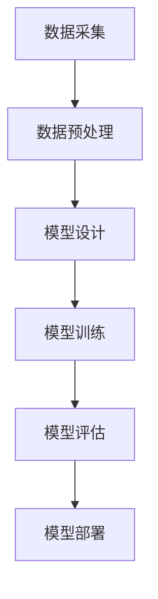

                 

关键词：人工智能、大模型、创业、挑战、机遇、趋势分析

> 摘要：随着人工智能技术的快速发展，大模型技术在各个领域的应用日益广泛，为创业者带来了巨大的机遇和挑战。本文将深入探讨AI大模型创业的现状、面临的主要挑战、市场机遇以及未来发展的趋势。

## 1. 背景介绍

近年来，人工智能技术取得了令人瞩目的进展，尤其是大模型技术的崛起，使得计算机在处理大规模数据、进行复杂任务方面表现出了前所未有的能力。大模型技术，如深度学习、生成对抗网络（GAN）等，已经在图像识别、自然语言处理、语音识别等领域取得了显著成果。这些技术的进步，不仅推动了学术研究的发展，也为企业创新和创业提供了新的机会。

在创业领域，AI大模型的应用已经展现出了巨大的潜力。从智能家居、医疗诊断、金融风控到教育个性化，大模型技术正在深刻改变各行各业的运作模式。然而，AI大模型的创业之路并非一帆风顺，创业者需要面对技术、市场、资金等多方面的挑战。

## 2. 核心概念与联系

### 2.1 大模型技术概述

大模型技术指的是通过训练大规模神经网络模型，使其能够处理复杂数据和任务的一种方法。这些模型通常包含数百万甚至数十亿个参数，能够在海量数据中学习到深层次的特征和模式。以下是一个简单的大模型技术流程图：



### 2.2 大模型技术在各领域的应用

大模型技术在各个领域都有广泛的应用。以下是一些具体的例子：

- **图像识别**：通过卷积神经网络（CNN）进行图像分类和物体检测。
- **自然语言处理（NLP）**：使用循环神经网络（RNN）和Transformer模型进行文本分类、机器翻译和情感分析。
- **语音识别**：结合深度学习和循环神经网络进行语音信号的处理和转换。
- **医疗诊断**：通过深度学习模型对医学图像进行诊断，如肿瘤检测、骨折诊断等。
- **金融风控**：利用大规模数据分析和预测模型进行信用评分、风险控制等。

## 3. 核心算法原理 & 具体操作步骤

### 3.1 算法原理概述

大模型技术的核心是深度神经网络（DNN），它通过多层非线性变换来学习输入数据的特征和模式。以下是DNN的基本原理：

1. **输入层**：接收外部输入数据。
2. **隐藏层**：对输入数据进行特征提取和变换。
3. **输出层**：根据隐藏层的输出进行决策或预测。

### 3.2 算法步骤详解

1. **模型设计**：根据任务需求设计合适的网络结构。
2. **数据预处理**：对数据进行清洗、归一化等处理。
3. **模型训练**：通过反向传播算法调整模型参数，使模型能够准确预测或分类。
4. **模型评估**：使用验证集评估模型性能，调整模型参数以达到最佳效果。
5. **模型部署**：将训练好的模型部署到实际应用环境中。

### 3.3 算法优缺点

**优点**：

- **强大的数据处理能力**：能够处理大规模、高维度的数据。
- **自适应性强**：通过多层网络结构，能够自动提取深层次的特征。
- **泛化能力强**：通过训练大量数据，模型能够泛化到未见过的数据上。

**缺点**：

- **计算资源需求高**：需要大量的计算资源和时间进行训练。
- **模型解释性差**：神经网络模型内部机制复杂，难以解释。

### 3.4 算法应用领域

大模型技术已经广泛应用于图像识别、自然语言处理、语音识别、医疗诊断、金融风控等领域。以下是一些具体的应用场景：

- **图像识别**：应用于安防监控、自动驾驶、医疗诊断等领域。
- **自然语言处理**：应用于机器翻译、智能客服、内容审核等领域。
- **语音识别**：应用于智能语音助手、语音翻译、语音识别等领域。
- **医疗诊断**：应用于肿瘤检测、骨折诊断、疾病预测等领域。
- **金融风控**：应用于信用评分、风险控制、欺诈检测等领域。

## 4. 数学模型和公式 & 详细讲解 & 举例说明

### 4.1 数学模型构建

大模型技术主要涉及以下几个数学模型：

1. **损失函数**：用于评估模型预测与真实标签之间的差距，如均方误差（MSE）。
2. **优化算法**：用于调整模型参数，如梯度下降（GD）和随机梯度下降（SGD）。
3. **激活函数**：用于增加网络模型的非线性，如Sigmoid、ReLU。

### 4.2 公式推导过程

以下是一个简单的线性回归模型的公式推导：

假设我们有一个线性回归模型：

$$ y = \theta_0 + \theta_1 \cdot x $$

损失函数为：

$$ J(\theta) = \frac{1}{2m} \sum_{i=1}^{m} (y_i - \theta_0 - \theta_1 \cdot x_i)^2 $$

对损失函数关于 $\theta_0$ 和 $\theta_1$ 求偏导，并令其等于0，得到：

$$ \frac{\partial J(\theta)}{\partial \theta_0} = 0 \Rightarrow \theta_0 = \frac{1}{m} \sum_{i=1}^{m} (y_i - \theta_1 \cdot x_i) $$

$$ \frac{\partial J(\theta)}{\partial \theta_1} = 0 \Rightarrow \theta_1 = \frac{1}{m} \sum_{i=1}^{m} (y_i - \theta_0 - \theta_1 \cdot x_i) \cdot x_i $$

### 4.3 案例分析与讲解

假设我们有一个包含100个样本的线性回归问题，每个样本包含特征 $x$ 和标签 $y$。我们使用梯度下降算法来优化模型参数。

1. **初始化参数**：随机初始化 $\theta_0$ 和 $\theta_1$。
2. **计算梯度**：根据损失函数计算 $\theta_0$ 和 $\theta_1$ 的梯度。
3. **更新参数**：根据梯度和学习率更新模型参数。
4. **迭代过程**：重复步骤2和3，直到模型收敛。

## 5. 项目实践：代码实例和详细解释说明

### 5.1 开发环境搭建

我们需要安装Python和TensorFlow等开发环境，具体步骤如下：

1. 安装Python（推荐版本3.7及以上）。
2. 安装TensorFlow：`pip install tensorflow`。

### 5.2 源代码详细实现

以下是一个简单的线性回归模型的Python代码实现：

```python
import numpy as np
import tensorflow as tf

# 设置随机种子
np.random.seed(42)
tf.random.set_seed(42)

# 数据预处理
X = np.random.rand(100, 1)
y = 2 * X + np.random.rand(100, 1)

# 初始化参数
theta0 = tf.Variable(0.0)
theta1 = tf.Variable(0.0)

# 定义损失函数
loss_fn = tf.reduce_mean(tf.square(y - theta0 - theta1 * X))

# 定义优化器
optimizer = tf.optimizers.SGD(learning_rate=0.01)

# 训练模型
for _ in range(1000):
    with tf.GradientTape() as tape:
        predictions = theta0 + theta1 * X
        loss = loss_fn(predictions, y)
    gradients = tape.gradient(loss, [theta0, theta1])
    optimizer.apply_gradients(zip(gradients, [theta0, theta1]))

# 输出模型参数
print("Final model parameters:", theta0.numpy(), theta1.numpy())
```

### 5.3 代码解读与分析

1. **数据预处理**：生成随机数据，模拟线性回归问题。
2. **初始化参数**：随机初始化模型参数。
3. **定义损失函数**：使用均方误差作为损失函数。
4. **定义优化器**：使用随机梯度下降优化算法。
5. **训练模型**：通过迭代优化模型参数。
6. **输出模型参数**：打印最终的模型参数。

### 5.4 运行结果展示

运行上述代码后，我们将得到模型参数 $\theta_0$ 和 $\theta_1$ 的最终值。这些参数表示线性回归模型的权重，可以用来预测新的数据。

## 6. 实际应用场景

### 6.1 图像识别

图像识别是AI大模型技术的一个重要应用领域。以下是一些具体的案例：

- **安防监控**：利用卷积神经网络进行人脸识别和目标检测，提高安防系统的智能化水平。
- **自动驾驶**：使用深度学习模型对道路场景进行识别，辅助自动驾驶车辆做出正确的决策。
- **医疗诊断**：通过深度学习模型对医学图像进行诊断，提高疾病的检测和诊断精度。

### 6.2 自然语言处理

自然语言处理（NLP）是AI大模型技术的另一个重要应用领域。以下是一些具体的案例：

- **机器翻译**：利用Transformer模型实现高效、准确的机器翻译。
- **智能客服**：使用对话生成模型提供智能客服服务，提高用户体验。
- **内容审核**：利用文本分类模型进行社交媒体内容审核，防止违规内容传播。

### 6.3 语音识别

语音识别是AI大模型技术的又一个重要应用领域。以下是一些具体的案例：

- **智能语音助手**：通过语音识别技术实现语音交互，提供个性化的服务。
- **语音翻译**：利用深度学习模型实现语音到语音的实时翻译。
- **语音助手**：通过语音识别技术实现语音指令的识别和执行，提高生活便利性。

## 7. 工具和资源推荐

### 7.1 学习资源推荐

- **课程推荐**：MIT 6.S091: Introduction to Machine Learning（MIT公开课）和 Andrew Ng 的 Machine Learning（吴恩达的机器学习课程）。
- **书籍推荐**：《深度学习》（Goodfellow、Bengio和Courville著）和《Python机器学习》（Sebastian Raschka著）。

### 7.2 开发工具推荐

- **框架推荐**：TensorFlow和PyTorch。
- **平台推荐**：Google Colab和Kaggle。

### 7.3 相关论文推荐

- **卷积神经网络**：《A Comprehensive Review of Convolutional Neural Networks》。
- **生成对抗网络**：《Generative Adversarial Nets》。
- **Transformer模型**：《Attention Is All You Need》。

## 8. 总结：未来发展趋势与挑战

### 8.1 研究成果总结

AI大模型技术在图像识别、自然语言处理、语音识别等领域取得了显著的成果，推动了各个行业的创新发展。同时，随着计算资源的提升和算法的优化，大模型技术的性能和应用范围也在不断扩展。

### 8.2 未来发展趋势

未来，AI大模型技术将继续在以下方向取得突破：

- **模型压缩与加速**：通过模型剪枝、量化等手段降低模型计算复杂度，提高运行效率。
- **跨模态学习**：实现不同类型数据（如图像、文本、语音）之间的联合建模和交互。
- **可解释性与可靠性**：提升大模型的可解释性，增强模型在实际应用中的可靠性。

### 8.3 面临的挑战

尽管AI大模型技术在各个领域展现出了巨大的潜力，但仍面临以下挑战：

- **计算资源消耗**：大模型训练需要大量的计算资源，这对硬件和能源提出了更高要求。
- **数据隐私与安全**：在数据驱动的AI大模型训练过程中，数据隐私和安全性问题亟待解决。
- **算法公平性与透明性**：如何确保AI大模型在不同群体中的应用公平性和透明性，是一个重要挑战。

### 8.4 研究展望

展望未来，AI大模型技术将在以下几个方面取得进一步发展：

- **行业融合与创新**：AI大模型技术将与其他行业深度融合，推动各行业的创新和发展。
- **社会影响力**：AI大模型技术将在医疗、教育、金融等领域发挥重要作用，提升社会整体生活质量。

## 9. 附录：常见问题与解答

### 9.1 AI大模型创业的关键成功因素是什么？

**答案**：成功的关键因素包括：

- **技术创新**：拥有领先的技术优势和创新能力。
- **数据优势**：拥有丰富且高质量的数据资源。
- **团队协作**：建立高效、协作的团队，充分发挥每个人的优势。
- **市场定位**：明确目标市场，提供符合市场需求的产品或服务。

### 9.2 大模型训练过程中的常见问题有哪些？

**答案**：常见问题包括：

- **过拟合**：模型在训练数据上表现良好，但在验证数据上表现不佳。
- **训练时间过长**：大模型训练需要大量的时间和计算资源。
- **数据不平衡**：训练数据中某些类别数据过少，影响模型性能。
- **计算资源不足**：大模型训练需要大量的计算资源，可能导致资源不足。

### 9.3 如何提高大模型训练的效率？

**答案**：提高大模型训练效率的方法包括：

- **数据预处理**：对训练数据进行预处理，减少冗余数据和异常值。
- **模型优化**：使用更高效的模型结构和优化算法。
- **分布式训练**：利用多台机器进行分布式训练，提高计算速度。
- **自动化调参**：使用自动化工具进行模型参数调整，找到最佳参数组合。

---

作者：禅与计算机程序设计艺术 / Zen and the Art of Computer Programming
----------------------------------------------------------------

### 结语

AI大模型创业战已经拉开帷幕，挑战与机遇并存。创业者需要深入了解技术、市场、资金等多方面的因素，以实现技术创新和商业成功。本文通过对AI大模型创业的现状、挑战、机遇和未来趋势的深入分析，为创业者提供了有价值的参考。让我们共同迎接这场充满创新和变革的AI大模型创业战。

