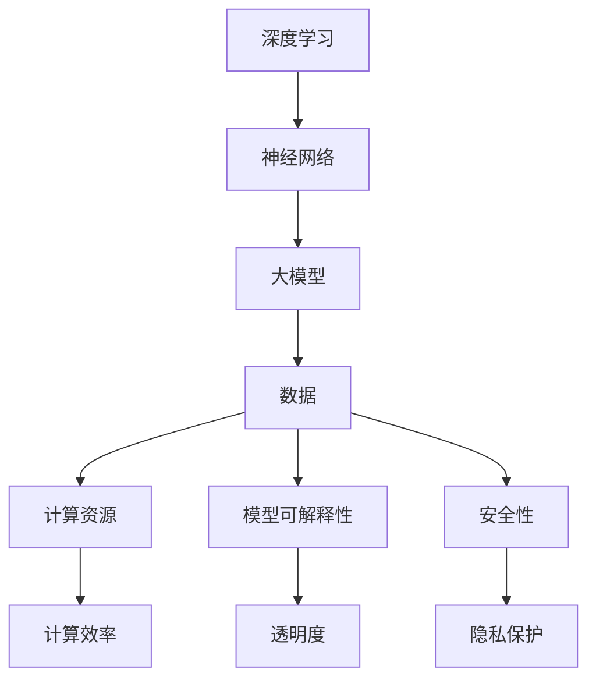

                 

在人工智能技术日新月异的今天，大模型成为了推动科技创新的重要力量。大模型的应用场景越来越广泛，从自然语言处理、计算机视觉到推荐系统等，都展现出了强大的数据处理能力和预测能力。然而，随着大模型规模的不断扩大，创业公司面临着越来越多的技术挑战。本文将探讨大模型创业过程中可能遇到的技术挑战，并提出相应的解决策略。

## 1. 背景介绍

人工智能（AI）作为计算机科学的一个分支，旨在使计算机具有人类的智能，实现机器学习、自然语言处理、计算机视觉等功能。近年来，随着计算能力的提升和大数据的积累，深度学习技术在人工智能领域取得了显著的进展。大模型，即参数规模达到亿级以上的神经网络模型，成为深度学习研究的重要方向。大模型通过在大量数据上进行训练，可以提取出丰富的特征信息，从而在各类任务中表现出优异的性能。

大模型创业是指利用大模型技术进行商业探索的过程。创业公司可以通过开发大模型驱动的产品或服务，进入人工智能领域，并有望在激烈的市场竞争中脱颖而出。然而，大模型创业并非易事，创业公司需要面对诸多技术挑战，包括数据质量、计算资源、算法优化等。本文将重点探讨这些挑战，并提出相应的应对策略。

## 2. 核心概念与联系

为了更好地理解大模型创业中的技术挑战，首先需要了解一些核心概念和它们之间的关系。以下是几个关键概念及其相互联系：

### 2.1. 深度学习与神经网络

深度学习是一种基于神经网络的学习方法，通过构建多层神经网络，将输入数据映射到输出结果。神经网络由多个神经元（或节点）组成，每个神经元都与前一层和后一层的神经元相连，并通过权重进行信息传递。

### 2.2. 大模型与数据

大模型依赖于大量的数据进行训练。数据质量直接影响大模型的性能。高质量的数据包含丰富的信息，有助于模型更好地学习特征。然而，获取高质量的数据并非易事，数据清洗、数据增强等技术手段在此过程中扮演着重要角色。

### 2.3. 计算资源与效率

大模型训练和推理过程对计算资源的需求极高。高性能计算（HPC）资源和云计算服务成为大模型创业的重要基础设施。优化算法和模型结构，提高计算效率，是应对计算资源瓶颈的关键。

### 2.4. 模型可解释性与安全

大模型在解决复杂问题时具有强大的能力，但其内部决策过程往往难以解释。模型可解释性成为研究的热点，旨在提高模型的透明度和可信任度。此外，大模型的安全性问题也备受关注，包括对抗攻击、隐私保护等。

### 2.5. Mermaid 流程图

为了更好地展示大模型创业中的技术挑战及其相互关系，我们可以使用 Mermaid 流程图来描述。以下是核心概念和流程的示意图：



## 3. 核心算法原理 & 具体操作步骤

### 3.1. 算法原理概述

大模型创业的核心在于构建和优化深度学习模型。深度学习模型通过在大量数据上进行训练，可以自动提取出层次化的特征表示，从而在各类任务中实现优异的性能。以下是深度学习模型构建的基本原理和步骤：

#### 3.1.1. 前向传播

前向传播是指将输入数据通过神经网络的前向传递，计算得到输出结果。在每个神经元中，输入数据与权重相乘并经过激活函数处理，从而得到神经元的输出。这一过程重复进行，直至得到最终输出。

#### 3.1.2. 反向传播

反向传播是指通过计算输出结果与真实值之间的误差，反向更新神经网络中的权重和偏置。这一过程利用梯度下降算法，不断调整模型参数，以最小化损失函数。

#### 3.1.3. 损失函数

损失函数用于衡量模型的预测结果与真实值之间的差距。常见的损失函数包括均方误差（MSE）、交叉熵损失等。损失函数的值越小，表示模型的预测结果越准确。

#### 3.1.4. 优化算法

优化算法用于调整模型参数，以最小化损失函数。常见的优化算法包括随机梯度下降（SGD）、Adam等。优化算法的选取和调整对模型的性能有着重要影响。

### 3.2. 算法步骤详解

以下是大模型创业中常见的深度学习算法步骤：

#### 3.2.1. 数据预处理

数据预处理包括数据清洗、归一化、数据增强等步骤。数据清洗旨在去除噪声和异常值，确保数据质量。归一化将数据缩放到相同的范围，有助于加速模型的训练。数据增强通过生成大量不同的训练样本，提高模型的泛化能力。

#### 3.2.2. 模型设计

模型设计包括选择合适的神经网络架构、确定层数和神经元个数等。常见的神经网络架构包括卷积神经网络（CNN）、循环神经网络（RNN）等。模型设计直接影响模型的性能和计算复杂度。

#### 3.2.3. 模型训练

模型训练通过在训练数据上迭代优化模型参数。训练过程中，使用反向传播算法计算梯度并更新模型参数。训练过程需要选择合适的优化算法和超参数，如学习率、批量大小等。

#### 3.2.4. 模型评估

模型评估通过在验证集上测试模型的性能，包括准确率、召回率、F1值等指标。模型评估用于评估模型的泛化能力和稳定性。

#### 3.2.5. 模型部署

模型部署是将训练好的模型部署到生产环境中，以实现实时预测或推理。模型部署需要考虑计算资源、延迟、可扩展性等因素。

### 3.3. 算法优缺点

深度学习算法在大模型创业中具有以下优缺点：

#### 优点：

- **强大的表征能力**：深度学习模型可以通过学习大量数据，提取出复杂的特征表示。
- **适应性**：深度学习模型可以适应不同的任务和数据集，具有较好的泛化能力。
- **自动化**：深度学习模型可以通过自动调整参数，实现高效的模型优化。

#### 缺点：

- **计算资源需求高**：深度学习模型需要大量的计算资源和时间进行训练。
- **数据依赖性强**：深度学习模型的性能很大程度上取决于数据的质量和数量。
- **可解释性差**：深度学习模型内部决策过程复杂，难以解释和调试。

### 3.4. 算法应用领域

深度学习算法在大模型创业中广泛应用于以下领域：

- **自然语言处理**：包括机器翻译、情感分析、文本生成等。
- **计算机视觉**：包括图像分类、目标检测、图像生成等。
- **推荐系统**：包括用户画像、商品推荐、个性化广告等。
- **语音识别**：包括语音合成、语音识别、语音转文字等。
- **游戏AI**：包括游戏策略、智能客服、虚拟现实等。

## 4. 数学模型和公式 & 详细讲解 & 举例说明

### 4.1. 数学模型构建

在深度学习模型中，数学模型构建是核心环节之一。以下是构建深度学习模型的常见数学公式和概念：

#### 4.1.1. 激活函数

激活函数是神经网络中的一个重要组成部分，用于引入非线性关系。常见的激活函数包括：

- **Sigmoid函数**：
  $$f(x) = \frac{1}{1 + e^{-x}}$$

- **ReLU函数**：
  $$f(x) = \max(0, x)$$

- **Tanh函数**：
  $$f(x) = \frac{e^x - e^{-x}}{e^x + e^{-x}}$$

#### 4.1.2. 前向传播

前向传播过程中，输入数据通过神经网络的层层传递，最终得到输出结果。以下是前向传播的数学公式：

- **线性变换**：
  $$z^{(l)} = \sigma^{(l)}(W^{(l)}x^{(l-1)} + b^{(l)})$$

- **非线性激活**：
  $$a^{(l)} = \sigma^{(l)}(z^{(l)})$$

其中，$l$表示神经网络的层数，$\sigma^{(l)}$表示激活函数，$W^{(l)}$和$b^{(l)}$分别为权重和偏置。

#### 4.1.3. 损失函数

损失函数用于衡量模型的预测结果与真实值之间的差距。以下是几种常见的损失函数：

- **均方误差（MSE）**：
  $$L(y, \hat{y}) = \frac{1}{2}\sum_{i=1}^{n}(y_i - \hat{y_i})^2$$

- **交叉熵损失**：
  $$L(y, \hat{y}) = -\sum_{i=1}^{n}y_i \log(\hat{y_i})$$

其中，$y$表示真实值，$\hat{y}$表示预测值。

#### 4.1.4. 反向传播

反向传播过程中，通过计算梯度信息，更新模型参数。以下是反向传播的数学公式：

- **梯度计算**：
  $$\frac{\partial L}{\partial W^{(l)}} = \frac{\partial L}{\partial z^{(l+1)}} \cdot \frac{\partial z^{(l+1)}}{\partial W^{(l)}}$$
  $$\frac{\partial L}{\partial b^{(l)}} = \frac{\partial L}{\partial z^{(l+1)}} \cdot \frac{\partial z^{(l+1)}}{\partial b^{(l)}}$$
  $$\frac{\partial L}{\partial a^{(l-1)}} = \frac{\partial L}{\partial z^{(l)}} \cdot \frac{\partial z^{(l)}}{\partial a^{(l-1)}}$$

其中，$\frac{\partial L}{\partial W^{(l)}}$和$\frac{\partial L}{\partial b^{(l)}}$分别为权重和偏置的梯度。

### 4.2. 公式推导过程

以下是反向传播公式的推导过程：

#### 4.2.1. 前向传播

设$z^{(l)}$和$a^{(l)}$分别为第$l$层的输入和输出，$W^{(l)}$和$b^{(l)}$分别为权重和偏置，$\sigma^{(l)}$为激活函数，则有：

$$z^{(l)} = \sigma^{(l)}(W^{(l)}x^{(l-1)} + b^{(l)})$$
$$a^{(l)} = \sigma^{(l)}(z^{(l)})$$

#### 4.2.2. 反向传播

设$z^{(l+1)}$和$a^{(l+1)}$分别为第$l+1$层的输入和输出，$W^{(l+1)}$和$b^{(l+1)}$分别为权重和偏置，$\sigma^{(l+1)}$为激活函数，则有：

$$z^{(l+1)} = W^{(l+1)}a^{(l)} + b^{(l+1)}$$
$$a^{(l+1)} = \sigma^{(l+1)}(z^{(l+1)})$$

损失函数$L$对$z^{(l+1)}$的梯度为：

$$\frac{\partial L}{\partial z^{(l+1)}} = \frac{\partial L}{\partial a^{(l+1)}} \cdot \frac{\partial a^{(l+1)}}{\partial z^{(l+1)}}$$

代入$a^{(l+1)} = \sigma^{(l+1)}(z^{(l+1)})$，得到：

$$\frac{\partial L}{\partial z^{(l+1)}} = \sigma^{(l+1)}'(z^{(l+1)}) \cdot \frac{\partial L}{\partial a^{(l+1)}}$$

损失函数$L$对$W^{(l+1)}$的梯度为：

$$\frac{\partial L}{\partial W^{(l+1)}} = \frac{\partial L}{\partial z^{(l+1)}} \cdot a^{(l)}$$

损失函数$L$对$b^{(l+1)}$的梯度为：

$$\frac{\partial L}{\partial b^{(l+1)}} = \frac{\partial L}{\partial z^{(l+1)}}$$

类似地，可以推导出：

$$\frac{\partial L}{\partial z^{(l)}} = \sigma^{(l)}'(z^{(l)}) \cdot \frac{\partial L}{\partial a^{(l)}} \cdot W^{(l+1)}$$

$$\frac{\partial L}{\partial a^{(l-1)}} = \frac{\partial L}{\partial z^{(l)}} \cdot \sigma^{(l)}'(z^{(l)}) \cdot W^{(l)}$$

### 4.3. 案例分析与讲解

以下通过一个简单的例子来说明如何使用反向传播算法进行模型训练。

#### 4.3.1. 模型定义

假设一个简单的神经网络，包含一个输入层、一个隐藏层和一个输出层，其中输入层有3个神经元，隐藏层有2个神经元，输出层有1个神经元。激活函数采用ReLU函数。权重和偏置初始化为随机值。

#### 4.3.2. 前向传播

输入数据为$x_1 = [1, 0, 1]$，目标输出为$y = [0.9]$。前向传播过程如下：

$$z_1^{(2)} = \max(0, W_1^{(2)}x_1 + b_1^{(2)})$$
$$z_2^{(2)} = \max(0, W_2^{(2)}x_1 + b_2^{(2)})$$
$$z_1^{(3)} = W_3^{(3)}z_1^{(2)} + b_3^{(3)}$$
$$z_2^{(3)} = W_4^{(3)}z_2^{(2)} + b_4^{(3)}$$
$$\hat{y} = \sigma^{(3)}(z_1^{(3)})$$

其中，$W_1^{(2)}$、$W_2^{(2)}$、$b_1^{(2)}$、$b_2^{(2)}$、$W_3^{(3)}$、$W_4^{(3)}$、$b_3^{(3)}$、$b_4^{(3)}$分别为权重和偏置。

#### 4.3.3. 反向传播

计算损失函数$L$对每个参数的梯度：

$$\frac{\partial L}{\partial z_1^{(3)}} = \sigma^{(3)}'(z_1^{(3)}) \cdot (\hat{y} - y)$$
$$\frac{\partial L}{\partial z_2^{(3)}} = \sigma^{(3)}'(z_2^{(3)}) \cdot (\hat{y} - y)$$
$$\frac{\partial L}{\partial z_1^{(2)}} = W_3^{(3)} \cdot \frac{\partial L}{\partial z_1^{(3)}}$$
$$\frac{\partial L}{\partial z_2^{(2)}} = W_4^{(3)} \cdot \frac{\partial L}{\partial z_2^{(3)}}$$
$$\frac{\partial L}{\partial W_1^{(2)}} = \frac{\partial L}{\partial z_1^{(2)}} \cdot x_1$$
$$\frac{\partial L}{\partial b_1^{(2)}} = \frac{\partial L}{\partial z_1^{(2)}}$$
$$\frac{\partial L}{\partial W_2^{(2)}} = \frac{\partial L}{\partial z_2^{(2)}} \cdot x_1$$
$$\frac{\partial L}{\partial b_2^{(2)}} = \frac{\partial L}{\partial z_2^{(2)}}$$
$$\frac{\partial L}{\partial W_3^{(3)}} = \frac{\partial L}{\partial z_1^{(3)}} \cdot z_1^{(2)}$$
$$\frac{\partial L}{\partial b_3^{(3)}} = \frac{\partial L}{\partial z_1^{(3)}}$$
$$\frac{\partial L}{\partial W_4^{(3)}} = \frac{\partial L}{\partial z_2^{(3)}} \cdot z_2^{(2)}$$
$$\frac{\partial L}{\partial b_4^{(3)}} = \frac{\partial L}{\partial z_2^{(3)}}$$

利用梯度信息，通过梯度下降算法更新权重和偏置：

$$W_1^{(2)} = W_1^{(2)} - \alpha \cdot \frac{\partial L}{\partial W_1^{(2)}}$$
$$b_1^{(2)} = b_1^{(2)} - \alpha \cdot \frac{\partial L}{\partial b_1^{(2)}}$$
$$W_2^{(2)} = W_2^{(2)} - \alpha \cdot \frac{\partial L}{\partial W_2^{(2)}}$$
$$b_2^{(2)} = b_2^{(2)} - \alpha \cdot \frac{\partial L}{\partial b_2^{(2)}}$$
$$W_3^{(3)} = W_3^{(3)} - \alpha \cdot \frac{\partial L}{\partial W_3^{(3)}}$$
$$b_3^{(3)} = b_3^{(3)} - \alpha \cdot \frac{\partial L}{\partial b_3^{(3)}}$$
$$W_4^{(3)} = W_4^{(3)} - \alpha \cdot \frac{\partial L}{\partial W_4^{(3)}}$$
$$b_4^{(3)} = b_4^{(3)} - \alpha \cdot \frac{\partial L}{\partial b_4^{(3)}}$$

其中，$\alpha$为学习率。

通过迭代更新权重和偏置，模型性能逐渐提高。以上是一个简单的例子，实际应用中可能涉及更复杂的模型和优化算法。

## 5. 项目实践：代码实例和详细解释说明

### 5.1. 开发环境搭建

在进行大模型创业时，选择合适的开发环境是至关重要的一步。以下是一个基于Python的示例，展示如何搭建一个基础的深度学习开发环境。

#### 5.1.1. 硬件要求

- **CPU**：至少4核CPU
- **GPU**：NVIDIA GPU（推荐使用1080 Ti或更高版本）
- **内存**：至少16GB RAM

#### 5.1.2. 软件要求

- **操作系统**：Linux（推荐使用Ubuntu 18.04）
- **Python**：Python 3.7或更高版本
- **深度学习框架**：TensorFlow或PyTorch

#### 5.1.3. 安装步骤

1. **安装操作系统**：在虚拟机中安装Ubuntu 18.04。
2. **安装Python**：通过以下命令安装Python：

   ```bash
   sudo apt update
   sudo apt install python3 python3-pip python3-dev
   ```

3. **安装GPU支持**：安装CUDA和cuDNN，以支持GPU加速。

   ```bash
   sudo apt install ubuntu-desktop
   sudo apt-get install cuda
   sudo apt-get install libcudnn7=7.6.5.32-1+cuda10.1
   sudo apt-get install libcudnn7-dev=7.6.5.32-1+cuda10.1
   ```

4. **安装深度学习框架**：选择TensorFlow或PyTorch，通过以下命令安装：

   ```bash
   pip3 install tensorflow==2.4.0
   # 或者
   pip3 install torch==1.8.0 torchvision==0.9.0
   ```

### 5.2. 源代码详细实现

以下是一个简单的示例，展示如何使用TensorFlow构建一个基于卷积神经网络（CNN）的图像分类模型。

#### 5.2.1. 导入必要库

```python
import tensorflow as tf
from tensorflow.keras import datasets, layers, models
import matplotlib.pyplot as plt
```

#### 5.2.2. 加载和预处理数据

```python
(train_images, train_labels), (test_images, test_labels) = datasets.cifar10.load_data()

# 归一化数据
train_images, test_images = train_images / 255.0, test_images / 255.0
```

#### 5.2.3. 构建模型

```python
model = models.Sequential()
model.add(layers.Conv2D(32, (3, 3), activation='relu', input_shape=(32, 32, 3)))
model.add(layers.MaxPooling2D((2, 2)))
model.add(layers.Conv2D(64, (3, 3), activation='relu'))
model.add(layers.MaxPooling2D((2, 2)))
model.add(layers.Conv2D(64, (3, 3), activation='relu'))

# 平铺特征向量
model.add(layers.Flatten())
model.add(layers.Dense(64, activation='relu'))
model.add(layers.Dense(10))
```

#### 5.2.4. 训练模型

```python
model.compile(optimizer='adam',
              loss=tf.keras.losses.SparseCategoricalCrossentropy(from_logits=True),
              metrics=['accuracy'])

history = model.fit(train_images, train_labels, epochs=10, 
                    validation_data=(test_images, test_labels))
```

#### 5.2.5. 评估模型

```python
test_loss, test_acc = model.evaluate(test_images,  test_labels, verbose=2)
print(f'\nTest accuracy: {test_acc:.4f}')
```

### 5.3. 代码解读与分析

以上代码展示了如何使用TensorFlow构建一个简单的CNN模型，用于CIFAR-10数据集的图像分类任务。以下是对代码的详细解读：

1. **导入必要库**：导入TensorFlow、Keras和matplotlib库，用于模型构建、训练和可视化。

2. **加载和预处理数据**：使用Keras内置的CIFAR-10数据集，并对数据进行归一化处理。

3. **构建模型**：使用Keras的Sequential模型，依次添加卷积层、池化层和全连接层。卷积层用于提取图像特征，全连接层用于分类。

4. **训练模型**：使用编译好的模型，在训练数据上训练10个epoch，并在验证数据上进行评估。

5. **评估模型**：计算测试集上的损失和准确率，以评估模型性能。

### 5.4. 运行结果展示

以下是一个简单的结果展示：

```python
plt.figure(figsize=(8, 8))
plt.subplot(2, 2, 1)
plt.title("Example 1")
plt.imshow(train_images[0])
plt.subplot(2, 2, 2)
plt.title("Predicted 1")
plt.imshow(test_images[0])
plt.subplot(2, 2, 3)
plt.title("Example 2")
plt.imshow(train_images[1])
plt.subplot(2, 2, 4)
plt.title("Predicted 2")
plt.imshow(test_images[1])
plt.show()
```

## 6. 实际应用场景

大模型在各个领域的应用场景日益广泛，以下是几个典型的应用实例：

### 6.1. 自然语言处理

自然语言处理（NLP）是人工智能领域的一个重要分支，大模型在NLP任务中表现出了强大的能力。例如，BERT模型在机器翻译、问答系统、文本生成等领域取得了显著的成果。创业公司可以利用这些大模型，提供智能客服、自动摘要、内容审核等服务。

### 6.2. 计算机视觉

计算机视觉领域的大模型应用主要包括图像分类、目标检测、人脸识别等。创业公司可以利用这些大模型，提供图像识别、自动驾驶、医疗影像分析等服务。

### 6.3. 推荐系统

推荐系统是另一个大模型应用的重要领域。创业公司可以利用大模型，提供个性化推荐服务，如音乐推荐、电影推荐、商品推荐等。

### 6.4. 语音识别

语音识别领域的大模型应用主要包括语音合成、语音识别、语音转文字等。创业公司可以利用这些大模型，提供语音助手、智能翻译、语音搜索等服务。

## 7. 未来应用展望

随着人工智能技术的不断进步，大模型在未来的应用将更加广泛和深入。以下是几个未来应用展望：

### 7.1. 自动驾驶

自动驾驶是人工智能领域的一个重要应用方向。大模型在图像识别、目标检测、路径规划等方面具有显著优势，有望在未来实现安全、高效的自动驾驶。

### 7.2. 医疗健康

大模型在医疗健康领域具有巨大的应用潜力。例如，可以利用大模型进行疾病诊断、药物研发、个性化治疗等，提高医疗效率和治疗效果。

### 7.3. 金融科技

金融科技领域的大模型应用主要包括风险管理、信用评估、交易预测等。大模型可以帮助金融机构降低风险、提高盈利能力。

### 7.4. 教育科技

教育科技领域的大模型应用主要包括智能辅导、个性化学习、教育资源推荐等。大模型可以帮助提高教育质量、降低教育成本。

## 8. 工具和资源推荐

在进行大模型创业时，选择合适的工具和资源至关重要。以下是一些建议：

### 8.1. 学习资源推荐

- **书籍**：《深度学习》、《神经网络与深度学习》、《Python深度学习》等。
- **在线课程**：Coursera、Udacity、edX等平台上的深度学习和人工智能相关课程。
- **博客和社区**：知乎、CSDN、GitHub等平台上的深度学习和人工智能相关博客和社区。

### 8.2. 开发工具推荐

- **深度学习框架**：TensorFlow、PyTorch、Keras等。
- **编程语言**：Python、Java、C++等。
- **版本控制**：Git、GitHub等。

### 8.3. 相关论文推荐

- **2018年Nature论文**：《Large-scale language modeling based on neural networks》
- **2019年Science论文**：《Graph-based neural networks for learning and processing structured representations》
- **2020年Nature论文**：《A scalable Bayesian inference algorithm for deep learning》

## 9. 总结：未来发展趋势与挑战

### 9.1. 研究成果总结

大模型在人工智能领域取得了显著的成果，推动了自然语言处理、计算机视觉、推荐系统等领域的进步。深度学习算法在各类任务中展现了强大的表征能力和适应性。

### 9.2. 未来发展趋势

随着计算能力的提升和数据的积累，大模型的规模将越来越大，应用领域将更加广泛。未来大模型的发展趋势包括：

- **模型压缩与优化**：降低模型参数和计算复杂度，提高计算效率。
- **模型可解释性与安全**：提高模型的透明度和可信任度，保障模型安全性。
- **多模态学习**：融合文本、图像、音频等多模态信息，实现更智能的感知和理解。

### 9.3. 面临的挑战

大模型创业面临着诸多挑战，包括：

- **计算资源需求**：大模型训练和推理过程对计算资源的需求极高，如何高效利用计算资源成为关键。
- **数据隐私与安全**：大模型在处理海量数据时，如何保障数据隐私和安全成为重要问题。
- **模型可解释性**：大模型内部决策过程复杂，如何提高模型的可解释性成为挑战。
- **公平性与伦理**：大模型在应用过程中可能引发公平性和伦理问题，需要加以关注。

### 9.4. 研究展望

未来，大模型创业将朝着更高效、更安全、更智能的方向发展。研究人员和创业公司需要不断创新，解决大模型面临的挑战，推动人工智能技术的进步。

## 附录：常见问题与解答

### 9.1. 什么是大模型？

大模型是指参数规模达到亿级以上的神经网络模型。这些模型通过在大量数据上进行训练，可以提取出丰富的特征信息，从而在各类任务中表现出优异的性能。

### 9.2. 大模型创业的优势是什么？

大模型创业的优势包括：

- **强大的数据处理能力**：大模型可以通过学习大量数据，提取出复杂的特征表示，从而提高模型的性能。
- **适应性**：大模型可以适应不同的任务和数据集，具有较好的泛化能力。
- **自动化**：大模型可以通过自动调整参数，实现高效的模型优化。

### 9.3. 大模型创业面临哪些挑战？

大模型创业面临的挑战包括：

- **计算资源需求高**：大模型训练和推理过程对计算资源的需求极高。
- **数据隐私与安全**：大模型在处理海量数据时，如何保障数据隐私和安全成为重要问题。
- **模型可解释性**：大模型内部决策过程复杂，如何提高模型的可解释性成为挑战。
- **公平性与伦理**：大模型在应用过程中可能引发公平性和伦理问题。

### 9.4. 如何应对大模型创业的挑战？

应对大模型创业的挑战可以从以下几个方面着手：

- **优化算法**：研究高效的训练算法和推理算法，降低计算资源需求。
- **数据安全**：采用加密、匿名化等技术，保障数据隐私和安全。
- **模型可解释性**：研究模型解释方法，提高模型的可解释性。
- **伦理审查**：在应用大模型时，进行伦理审查，确保公平性和社会责任。

### 9.5. 大模型创业的未来前景如何？

大模型创业在未来具有广阔的前景。随着计算能力的提升和大数据的积累，大模型在各类任务中的应用将越来越广泛。创业公司可以通过开发大模型驱动的产品或服务，进入人工智能领域，并在激烈的市场竞争中脱颖而出。

---

### 结束语

大模型创业是一项充满挑战和机遇的任务。创业公司需要面对计算资源、数据隐私、模型可解释性等多方面的挑战，但同时也拥有强大的数据处理能力和适应性等优势。通过不断探索和创新，创业公司有望在人工智能领域取得突破性进展，为社会带来更多的价值。本文旨在为大模型创业提供一些指导和建议，希望对读者有所启发。在未来的发展中，让我们共同见证大模型创业的辉煌成果。作者：禅与计算机程序设计艺术 / Zen and the Art of Computer Programming。

