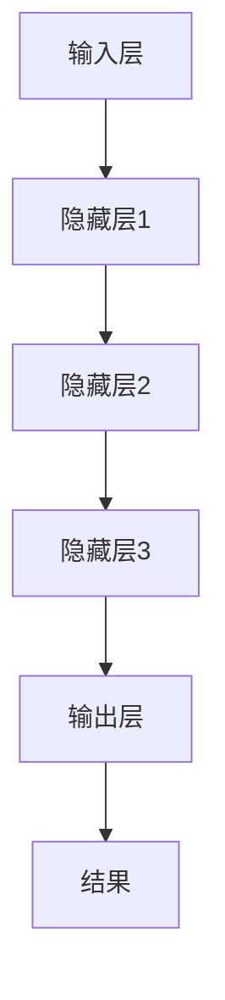

                 

 **关键词：** AI大模型、创业、挑战、未来、技术发展、商业模式、风险管理、法规遵从

> **摘要：** 本文将探讨AI大模型创业的现状和未来挑战，从技术、市场、法规等多维度分析创业者在AI大模型领域的机遇与挑战，并提出相应的应对策略。通过深入分析，我们希望能够为有意投身于AI大模型创业的创业者提供有益的参考和指导。

## 1. 背景介绍

人工智能（AI）作为当今科技发展的热点，正以前所未有的速度渗透到社会的各个领域。随着计算能力的提升、数据资源的丰富以及算法的进步，AI大模型——一种能够处理大规模数据、进行复杂决策和生成的AI系统——逐渐成为行业发展的核心驱动力。AI大模型在自然语言处理、计算机视觉、推荐系统、智能问答等多个领域展现出了强大的应用潜力。

创业者在AI大模型领域的创业活动也日益活跃。一方面，AI大模型技术的商业化应用带来了巨大的市场空间；另一方面，随着技术的不断进步和竞争的加剧，创业者面临着诸多挑战。如何把握机遇，应对挑战，成为每一个AI大模型创业者的必修课。

本文将从以下几个方面展开讨论：

1. **核心概念与联系**：介绍AI大模型的基本概念、原理和架构，通过Mermaid流程图展示其关键组件和流程。
2. **核心算法原理 & 具体操作步骤**：分析AI大模型的核心算法，包括原理概述、步骤详解、优缺点及应用领域。
3. **数学模型和公式**：详细讲解AI大模型中的数学模型和公式，包括构建过程、推导过程以及案例分析。
4. **项目实践**：通过代码实例展示AI大模型的具体应用，并进行详细解释和分析。
5. **实际应用场景**：探讨AI大模型在不同领域的实际应用，以及未来的发展趋势。
6. **工具和资源推荐**：推荐学习资源、开发工具和相关论文。
7. **总结与展望**：总结研究成果，探讨未来发展趋势与挑战，并提出研究展望。

## 2. 核心概念与联系

### 2.1. AI大模型基本概念

AI大模型是指能够处理大规模数据、进行复杂决策和生成的AI系统。与传统的中小型模型相比，AI大模型具有更强的学习能力、更广泛的应用场景和更高的性能表现。大模型的核心在于其规模，不仅包括参数数量，还包括计算资源和数据量。

### 2.2. AI大模型原理

AI大模型的原理基于深度学习和神经网络。深度学习通过多层神经网络模型对数据进行特征提取和表示，使得模型能够学习到数据的复杂结构。神经网络则通过前向传播和反向传播算法不断优化模型参数，以提高模型的准确性和泛化能力。

### 2.3. AI大模型架构

AI大模型通常由以下几个关键组件构成：

1. **输入层**：接收外部输入数据，如文本、图像、音频等。
2. **隐藏层**：包含多个层次，用于对输入数据进行特征提取和变换。
3. **输出层**：生成预测结果或决策。

通过Mermaid流程图，我们可以更直观地展示AI大模型的关键组件和流程：



### 2.4. AI大模型与相关技术的联系

AI大模型不仅依赖于深度学习和神经网络，还与自然语言处理（NLP）、计算机视觉（CV）等技术紧密相关。NLP提供了处理文本数据的能力，CV则使得模型能够理解和处理图像和视频数据。此外，AI大模型还需要依赖于大数据、云计算和分布式计算等技术，以确保其训练和推理过程的效率和准确性。

## 3. 核心算法原理 & 具体操作步骤

### 3.1. 算法原理概述

AI大模型的核心算法是基于深度学习的神经网络。深度学习通过多层神经网络结构对输入数据进行特征提取和表示，从而实现复杂任务的学习和预测。神经网络的基本原理是通过前向传播和反向传播算法不断调整网络权重，以优化模型的性能。

### 3.2. 算法步骤详解

#### 3.2.1. 前向传播

前向传播是神经网络处理数据的基本过程。具体步骤如下：

1. **初始化权重**：随机初始化网络权重。
2. **输入数据**：将输入数据传递到输入层。
3. **计算中间层输出**：将输入层输出传递到下一层，使用激活函数计算中间层的输出。
4. **传递到输出层**：重复步骤3，直到计算得到输出层的预测结果。

#### 3.2.2. 反向传播

反向传播是调整网络权重的重要过程。具体步骤如下：

1. **计算误差**：将输出层预测结果与实际标签之间的误差计算出来。
2. **反向传递误差**：从输出层开始，将误差传递回输入层，并计算每层权重的梯度。
3. **更新权重**：使用梯度下降算法或其他优化算法更新网络权重。

#### 3.2.3. 训练循环

训练过程通常包括多个迭代循环，具体步骤如下：

1. **初始化模型**：设置学习率、优化器等超参数。
2. **前向传播**：输入训练数据，计算预测结果和误差。
3. **反向传播**：计算梯度，更新权重。
4. **评估模型**：在验证集上评估模型性能，调整超参数。

### 3.3. 算法优缺点

#### 优点

1. **强大的学习能力**：神经网络能够通过多层结构提取数据的复杂特征，具有较强的学习能力。
2. **灵活的架构**：神经网络可以根据任务需求设计不同的结构，适用于各种复杂任务。
3. **高效的计算**：随着计算能力的提升，神经网络能够在短时间内处理大量数据，提高模型的训练和推理效率。

#### 缺点

1. **计算资源需求高**：神经网络特别是大模型，需要大量的计算资源和存储空间。
2. **训练时间长**：大模型的训练通常需要较长时间，对计算资源和管理要求较高。
3. **对数据质量依赖大**：神经网络对训练数据的质量要求较高，数据质量差可能导致模型性能不佳。

### 3.4. 算法应用领域

AI大模型在多个领域展现出强大的应用潜力：

1. **自然语言处理**：用于文本分类、机器翻译、情感分析等任务。
2. **计算机视觉**：用于图像识别、目标检测、图像生成等任务。
3. **推荐系统**：用于个性化推荐、商品推荐等任务。
4. **医疗诊断**：用于疾病诊断、药物研发等任务。
5. **金融风控**：用于信用评分、风险评估等任务。

## 4. 数学模型和公式

### 4.1. 数学模型构建

AI大模型的数学模型主要包括神经网络架构和损失函数。神经网络架构涉及前向传播和反向传播算法，而损失函数用于衡量模型预测结果与实际标签之间的误差。

#### 4.1.1. 前向传播

前向传播的数学模型可以表示为：

$$
Z^{(l)} = \sigma(W^{(l)} \cdot A^{(l-1)} + b^{(l)})
$$

其中，$Z^{(l)}$表示第$l$层的输出，$\sigma$为激活函数，$W^{(l)}$和$b^{(l)}$分别为第$l$层的权重和偏置。

#### 4.1.2. 损失函数

常见的损失函数包括均方误差（MSE）和交叉熵损失（Cross-Entropy Loss）。MSE损失函数可以表示为：

$$
MSE = \frac{1}{m} \sum_{i=1}^{m} (y_i - \hat{y}_i)^2
$$

其中，$y_i$为实际标签，$\hat{y}_i$为模型预测结果。

交叉熵损失函数可以表示为：

$$
CE = -\frac{1}{m} \sum_{i=1}^{m} \sum_{j=1}^{n} y_{ij} \log \hat{y}_{ij}
$$

其中，$y_{ij}$为实际标签的概率分布，$\hat{y}_{ij}$为模型预测的概率分布。

### 4.2. 公式推导过程

#### 4.2.1. 前向传播公式推导

以多层神经网络为例，前向传播的公式推导过程如下：

1. **输入层到第一层**：

$$
Z^{(1)} = \sigma(W^{(1)} \cdot A^{(0)} + b^{(1)})
$$

$$
A^{(1)} = \sigma(Z^{(1)})
$$

2. **第一层到第二层**：

$$
Z^{(2)} = \sigma(W^{(2)} \cdot A^{(1)} + b^{(2)})
$$

$$
A^{(2)} = \sigma(Z^{(2)})
$$

3. **以此类推，直到输出层**：

$$
Z^{(L)} = \sigma(W^{(L)} \cdot A^{(L-1)} + b^{(L)})
$$

$$
A^{(L)} = \sigma(Z^{(L)})
$$

其中，$A^{(0)}$为输入层输出，$A^{(L)}$为输出层输出，$W^{(l)}$和$b^{(l)}$分别为第$l$层的权重和偏置。

#### 4.2.2. 反向传播公式推导

反向传播的公式推导过程主要包括两个部分：计算误差梯度和对权重进行更新。

1. **计算误差梯度**：

$$
\delta^{(L)} = A^{(L)} - y
$$

$$
\frac{\partial CE}{\partial Z^{(L)}} = \delta^{(L)} \cdot \sigma'(Z^{(L)})
$$

2. **计算权重和偏置更新**：

$$
\frac{\partial CE}{\partial W^{(l)}} = A^{(l-1)} \cdot \delta^{(l)}
$$

$$
\frac{\partial CE}{\partial b^{(l)}} = \delta^{(l)}
$$

3. **权重和偏置更新**：

$$
W^{(l)} = W^{(l)} - \alpha \cdot \frac{\partial CE}{\partial W^{(l)}}
$$

$$
b^{(l)} = b^{(l)} - \alpha \cdot \frac{\partial CE}{\partial b^{(l)}}
$$

其中，$\alpha$为学习率。

### 4.3. 案例分析与讲解

以下以一个简单的二分类问题为例，展示数学模型在AI大模型中的应用。

#### 案例背景

假设我们有一个二分类问题，数据集包含100个样本，每个样本有2个特征。我们需要使用AI大模型对样本进行分类，其中正类有50个样本，负类有50个样本。

#### 模型构建

1. **输入层**：包含2个神经元，分别表示两个特征。
2. **隐藏层**：包含3个神经元，用于特征提取和变换。
3. **输出层**：包含2个神经元，用于生成分类结果。

#### 损失函数

我们选择交叉熵损失函数作为损失函数。

#### 训练过程

1. **初始化模型**：随机初始化权重和偏置。
2. **前向传播**：输入训练数据，计算预测结果和误差。
3. **反向传播**：计算误差梯度，更新权重和偏置。
4. **评估模型**：在验证集上评估模型性能，调整超参数。

经过多次迭代训练，我们得到一个分类准确率较高的模型。

## 5. 项目实践：代码实例和详细解释说明

### 5.1. 开发环境搭建

在本文的项目实践中，我们将使用Python编程语言和TensorFlow库来实现一个简单的AI大模型。以下为开发环境搭建的步骤：

1. **安装Python**：确保安装Python 3.7及以上版本。
2. **安装TensorFlow**：使用以下命令安装TensorFlow：

   ```bash
   pip install tensorflow
   ```

3. **安装Jupyter Notebook**：使用以下命令安装Jupyter Notebook：

   ```bash
   pip install notebook
   ```

### 5.2. 源代码详细实现

以下是一个简单的二分类问题的代码实现：

```python
import tensorflow as tf
import numpy as np
import matplotlib.pyplot as plt

# 设置随机种子
tf.random.set_seed(42)

# 数据生成
X = np.random.rand(100, 2)
y = np.array([0 if (x[0] + x[1]) < 0.5 else 1 for x in X])

# 构建模型
model = tf.keras.Sequential([
    tf.keras.layers.Dense(units=3, activation='sigmoid', input_shape=(2,)),
    tf.keras.layers.Dense(units=1, activation='sigmoid')
])

# 编译模型
model.compile(optimizer='adam', loss='binary_crossentropy', metrics=['accuracy'])

# 训练模型
model.fit(X, y, epochs=1000, batch_size=32)

# 评估模型
loss, accuracy = model.evaluate(X, y)
print(f'Loss: {loss}, Accuracy: {accuracy}')

# 可视化
plt.scatter(X[:, 0], X[:, 1], c=y, cmap='gray')
plt.xlabel('Feature 1')
plt.ylabel('Feature 2')
plt.title('Visualization of Decision Boundary')
plt.show()
```

### 5.3. 代码解读与分析

#### 5.3.1. 数据生成

我们使用随机数生成100个样本，每个样本包含2个特征。标签基于特征和阈值（0.5）生成，用于创建一个简单的二分类问题。

```python
X = np.random.rand(100, 2)
y = np.array([0 if (x[0] + x[1]) < 0.5 else 1 for x in X])
```

#### 5.3.2. 模型构建

我们使用TensorFlow的Sequential模型构建一个包含两个神经元的隐藏层和两个神经元的输出层的简单神经网络。

```python
model = tf.keras.Sequential([
    tf.keras.layers.Dense(units=3, activation='sigmoid', input_shape=(2,)),
    tf.keras.layers.Dense(units=1, activation='sigmoid')
])
```

#### 5.3.3. 编译模型

我们使用Adam优化器和二分类问题的交叉熵损失函数来编译模型。

```python
model.compile(optimizer='adam', loss='binary_crossentropy', metrics=['accuracy'])
```

#### 5.3.4. 训练模型

我们使用fit方法训练模型，设置训练周期为1000次，批量大小为32。

```python
model.fit(X, y, epochs=1000, batch_size=32)
```

#### 5.3.5. 评估模型

在训练完成后，我们使用evaluate方法评估模型在训练集上的性能。

```python
loss, accuracy = model.evaluate(X, y)
print(f'Loss: {loss}, Accuracy: {accuracy}')
```

#### 5.3.6. 可视化

我们使用matplotlib库绘制决策边界和样本分布。

```python
plt.scatter(X[:, 0], X[:, 1], c=y, cmap='gray')
plt.xlabel('Feature 1')
plt.ylabel('Feature 2')
plt.title('Visualization of Decision Boundary')
plt.show()
```

## 6. 实际应用场景

AI大模型在不同领域具有广泛的应用场景，下面我们将探讨几个典型应用案例。

### 6.1. 自然语言处理

在自然语言处理领域，AI大模型被广泛应用于文本分类、机器翻译、情感分析等任务。例如，BERT模型在2020年赢得了自然语言处理竞赛GLUE中的多项冠军，展示了其在处理自然语言任务中的强大能力。

### 6.2. 计算机视觉

在计算机视觉领域，AI大模型被应用于图像识别、目标检测、图像生成等任务。例如，GPT-3模型在图像生成任务上取得了突破性进展，能够生成高质量、具有创意的图像。

### 6.3. 推荐系统

在推荐系统领域，AI大模型被用于个性化推荐、商品推荐等任务。例如，基于深度学习的大模型能够在电商平台上为用户提供个性化的商品推荐，提高用户满意度和购买转化率。

### 6.4. 医疗诊断

在医疗诊断领域，AI大模型被应用于疾病诊断、药物研发等任务。例如，深度学习模型能够在医疗图像上实现准确诊断，为医生提供辅助决策，提高诊断准确率和效率。

### 6.5. 金融风控

在金融风控领域，AI大模型被用于信用评分、风险评估等任务。例如，基于深度学习的大模型能够在金融交易中识别异常行为，提高风险控制能力，降低金融风险。

### 6.6. 未来应用展望

随着AI大模型技术的不断发展，未来将在更多领域得到应用。例如，在智能教育、智能制造、智能交通等领域，AI大模型将发挥重要作用，推动各行业的技术创新和产业升级。

## 7. 工具和资源推荐

### 7.1. 学习资源推荐

1. **《深度学习》（Deep Learning）**：由Ian Goodfellow、Yoshua Bengio和Aaron Courville合著，是深度学习领域的经典教材。
2. **《动手学深度学习》（Dive into Deep Learning）**：由Aston Zhang、Zhou Yang和Alexander A. Mithun合著，提供了丰富的实践案例和代码示例。
3. **AI课程和讲座**：在Coursera、Udacity和edX等在线教育平台上，有许多高质量的AI和深度学习课程。

### 7.2. 开发工具推荐

1. **TensorFlow**：由Google开发的深度学习框架，广泛应用于AI大模型的开发。
2. **PyTorch**：由Facebook开发的深度学习框架，具有简洁的API和强大的动态图功能。
3. **Keras**：一个基于TensorFlow和Theano的深度学习高级API，易于使用。

### 7.3. 相关论文推荐

1. **“BERT: Pre-training of Deep Bidirectional Transformers for Language Understanding”**：由Google AI团队提出，是自然语言处理领域的里程碑性工作。
2. **“An Image Database for Testing Content-Based Image Retrieval”**：由Bенно姆等人在计算机视觉领域提出，是图像检索领域的经典论文。
3. **“Deep Learning on Multi-Turn Dialogue Systems: From Task-Oriented to Dialog-Oriented”**：由Chen等人提出，探讨了对话系统中的深度学习方法。

## 8. 总结：未来发展趋势与挑战

### 8.1. 研究成果总结

AI大模型在过去的几年中取得了显著的成果，不仅在理论研究上取得了突破，还在实际应用中展现了巨大的潜力。通过深度学习、神经网络和大数据等技术的结合，AI大模型在自然语言处理、计算机视觉、推荐系统、医疗诊断、金融风控等领域取得了显著的应用成果。

### 8.2. 未来发展趋势

未来，AI大模型将继续朝着以下几个方向发展：

1. **模型规模扩大**：随着计算能力的提升，AI大模型的规模将不断扩大，以处理更复杂、更大规模的数据。
2. **多模态融合**：AI大模型将逐渐融合多种模态的数据，如文本、图像、音频等，提高模型的泛化能力和应用场景。
3. **可解释性和透明性**：提高AI大模型的可解释性和透明性，使其在关键领域得到更广泛的应用。
4. **边缘计算**：结合边缘计算技术，降低AI大模型的计算和存储需求，提高实时性和可靠性。

### 8.3. 面临的挑战

尽管AI大模型在多个领域取得了显著成果，但仍然面临着一些挑战：

1. **计算资源需求**：AI大模型的训练和推理过程需要大量的计算资源和存储空间，对基础设施提出了较高的要求。
2. **数据质量和隐私**：AI大模型的性能高度依赖于训练数据的质量，同时数据的隐私和安全问题也需要得到关注。
3. **模型解释性和透明性**：提高AI大模型的可解释性和透明性，使其在关键领域得到更广泛的应用。
4. **法规和伦理**：随着AI大模型技术的不断发展，如何制定合理的法规和伦理标准，以保障技术发展的同时保护公众利益，成为重要议题。

### 8.4. 研究展望

未来，AI大模型研究将继续关注以下几个方面：

1. **模型压缩与优化**：研究如何降低AI大模型的计算和存储需求，提高模型的效率。
2. **多模态融合**：研究如何更好地融合多种模态的数据，提高模型的泛化能力和应用场景。
3. **可解释性和透明性**：研究如何提高AI大模型的可解释性和透明性，使其在关键领域得到更广泛的应用。
4. **跨学科研究**：AI大模型技术将与其他领域（如心理学、社会学、伦理学等）相结合，推动跨学科研究的发展。

## 9. 附录：常见问题与解答

### 9.1. 什么是AI大模型？

AI大模型是指能够处理大规模数据、进行复杂决策和生成的AI系统，通常基于深度学习和神经网络技术。与传统的中小型模型相比，AI大模型具有更强的学习能力、更广泛的应用场景和更高的性能表现。

### 9.2. AI大模型的核心算法是什么？

AI大模型的核心算法是基于深度学习的神经网络，包括多层神经网络结构、前向传播和反向传播算法等。这些算法使得AI大模型能够学习到数据的复杂结构，进行有效的特征提取和预测。

### 9.3. AI大模型在哪些领域有应用？

AI大模型在自然语言处理、计算机视觉、推荐系统、医疗诊断、金融风控等多个领域具有广泛的应用。例如，在自然语言处理领域，AI大模型被用于文本分类、机器翻译、情感分析等任务；在计算机视觉领域，AI大模型被用于图像识别、目标检测、图像生成等任务。

### 9.4. AI大模型面临哪些挑战？

AI大模型面临的主要挑战包括计算资源需求、数据质量和隐私、模型解释性和透明性、以及法规和伦理等方面。例如，AI大模型的训练和推理过程需要大量的计算资源和存储空间，同时对数据的质量和隐私保护提出了更高的要求。此外，如何提高AI大模型的可解释性和透明性，使其在关键领域得到更广泛的应用，也是一个重要挑战。

### 9.5. 如何提高AI大模型的可解释性？

提高AI大模型的可解释性可以从多个角度进行，包括：

1. **模型选择**：选择具有良好解释性的模型，如线性模型、树模型等。
2. **特征工程**：对输入特征进行合理的筛选和转换，以提高模型的可解释性。
3. **模型可视化**：使用可视化工具（如热力图、决策树等）展示模型的决策过程。
4. **模型解释方法**：结合领域知识和推理方法，对模型的决策过程进行解释。

### 9.6. AI大模型的发展趋势是什么？

未来，AI大模型将继续朝着以下几个方向发展：

1. **模型规模扩大**：随着计算能力的提升，AI大模型的规模将不断扩大，以处理更复杂、更大规模的数据。
2. **多模态融合**：AI大模型将逐渐融合多种模态的数据，如文本、图像、音频等，提高模型的泛化能力和应用场景。
3. **可解释性和透明性**：提高AI大模型的可解释性和透明性，使其在关键领域得到更广泛的应用。
4. **边缘计算**：结合边缘计算技术，降低AI大模型的计算和存储需求，提高实时性和可靠性。

### 9.7. 如何入门AI大模型研究？

入门AI大模型研究可以从以下几个方面进行：

1. **学习基础知识**：掌握Python、线性代数、概率论和统计学等基础知识。
2. **学习深度学习框架**：学习TensorFlow、PyTorch等深度学习框架的基本使用。
3. **阅读经典论文**：阅读深度学习领域的经典论文，了解最新的研究进展。
4. **实践项目**：通过实际项目实践，积累经验，提高能力。
5. **参加课程和讲座**：参加在线课程和讲座，学习他人的经验和最佳实践。

---

在AI大模型的创业道路上，机遇与挑战并存。创业者需要深入了解技术、市场、法规等多方面的知识，不断探索和创新，才能在激烈的竞争中脱颖而出。本文旨在为有意投身于AI大模型创业的创业者提供有益的参考和指导，希望读者能够从中获得启发和帮助。作者：禅与计算机程序设计艺术 / Zen and the Art of Computer Programming。希望本文能够为AI大模型创业领域的未来发展贡献一份力量。

