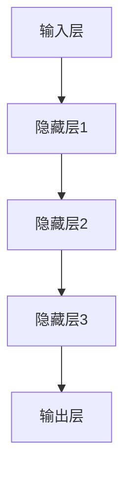

                 

关键词：AI大模型、创业、未来挑战、技术革新、市场机遇、战略规划

## 摘要

本文旨在探讨AI大模型创业所面临的机遇与挑战。随着AI技术的迅猛发展，大模型在各个领域展现出巨大的潜力，吸引了众多创业者投身其中。然而，成功打造AI大模型并非易事，创业者需面对技术瓶颈、市场变化、法律监管等多重挑战。本文将详细分析这些挑战，并提出应对策略，以期为AI大模型创业提供有益的参考。

## 1. 背景介绍

### AI大模型的兴起

AI大模型是指那些拥有数百万甚至数十亿参数的神经网络模型，它们在图像识别、自然语言处理、推荐系统等领域展现出惊人的性能。随着深度学习和大数据技术的进步，AI大模型的研究和应用已经成为人工智能领域的热点。

### 创业者的热情

AI大模型的强大能力吸引了大量创业者。他们希望通过开发和应用AI大模型，解决实际问题，创造商业价值。无论是在学术界、工业界还是初创企业，人们都对AI大模型充满了热情。

### 市场前景

AI大模型的应用前景广阔。从医疗健康、金融保险到零售电商，AI大模型正在改变各个行业的运作模式。随着技术的成熟，AI大模型的市场潜力将进一步释放。

## 2. 核心概念与联系

### AI大模型的核心概念

AI大模型的核心在于其庞大的参数量和复杂的结构。这些模型通常由多层神经网络组成，通过反向传播算法进行训练，从而学习到大量的特征和模式。

### AI大模型的架构

AI大模型的架构主要包括输入层、隐藏层和输出层。输入层接收原始数据，隐藏层通过非线性变换提取特征，输出层生成预测结果。



### AI大模型与数据的关系

AI大模型的效果高度依赖于训练数据的质量和数量。大量高质量的数据有助于模型学习到更多的特征，从而提高模型的性能。

## 3. 核心算法原理 & 具体操作步骤

### 3.1 算法原理概述

AI大模型的训练过程主要基于深度学习算法，特别是神经网络。神经网络通过层层传递输入数据，并在每一层中进行特征提取和变换，最终输出预测结果。

### 3.2 算法步骤详解

1. **数据预处理**：对原始数据进行清洗、归一化等处理，以便于模型训练。
2. **模型初始化**：初始化神经网络参数，通常使用随机初始化。
3. **前向传播**：将输入数据通过神经网络传递，生成预测结果。
4. **后向传播**：计算预测结果与实际结果的误差，并反向传播误差，更新模型参数。
5. **迭代训练**：重复执行前向传播和后向传播，直到模型收敛。

### 3.3 算法优缺点

**优点**：

- **强大的学习能力**：能够自动学习大量的特征和模式。
- **适应性**：可以通过调整模型参数，适应不同的任务和数据集。

**缺点**：

- **计算资源需求大**：训练过程需要大量的计算资源和时间。
- **数据依赖性强**：模型性能高度依赖于训练数据的质量。

### 3.4 算法应用领域

AI大模型在多个领域都有广泛的应用，包括：

- **图像识别**：用于分类、检测和分割等任务。
- **自然语言处理**：用于文本分类、机器翻译和情感分析等。
- **推荐系统**：用于个性化推荐和广告投放等。

## 4. 数学模型和公式 & 详细讲解 & 举例说明

### 4.1 数学模型构建

AI大模型的核心是神经网络，其数学模型主要包括以下几部分：

1. **激活函数**：用于引入非线性特性，常用的有Sigmoid、ReLU等。
2. **损失函数**：用于评估模型的预测误差，常用的有均方误差（MSE）、交叉熵（CE）等。
3. **优化算法**：用于更新模型参数，常用的有梯度下降（GD）、随机梯度下降（SGD）等。

### 4.2 公式推导过程

以多层感知机（MLP）为例，其前向传播的公式为：

$$
z_l = \sigma(W_l \cdot a_{l-1} + b_l)
$$

其中，$z_l$为第$l$层的输出，$W_l$为权重矩阵，$a_{l-1}$为前一层输出，$b_l$为偏置项，$\sigma$为激活函数。

反向传播的公式为：

$$
\delta_l = \frac{\partial J}{\partial z_l} = \frac{\partial L}{\partial a_l} \cdot \frac{\partial a_l}{\partial z_l}
$$

其中，$J$为损失函数，$L$为损失函数关于$a_l$的导数，$\delta_l$为第$l$层的误差梯度。

### 4.3 案例分析与讲解

以图像识别任务为例，假设我们使用一个三层神经网络进行图像分类，输入层有784个神经元，隐藏层有500个神经元，输出层有10个神经元。激活函数使用ReLU，损失函数使用交叉熵。

首先，我们初始化模型参数，并输入一张图像。然后，通过前向传播得到预测结果，计算损失。接着，通过反向传播更新模型参数。重复这个过程，直到模型收敛。

## 5. 项目实践：代码实例和详细解释说明

### 5.1 开发环境搭建

1. 安装Python环境，版本要求3.7及以上。
2. 安装深度学习框架，如TensorFlow或PyTorch。
3. 准备训练数据和测试数据。

### 5.2 源代码详细实现

```python
import torch
import torch.nn as nn
import torch.optim as optim

# 定义神经网络模型
class NeuralNetwork(nn.Module):
    def __init__(self):
        super(NeuralNetwork, self).__init__()
        self.fc1 = nn.Linear(784, 500)
        self.fc2 = nn.Linear(500, 10)
        self.relu = nn.ReLU()

    def forward(self, x):
        x = self.relu(self.fc1(x))
        x = self.fc2(x)
        return x

# 实例化模型、损失函数和优化器
model = NeuralNetwork()
criterion = nn.CrossEntropyLoss()
optimizer = optim.Adam(model.parameters(), lr=0.001)

# 训练模型
for epoch in range(num_epochs):
    for inputs, targets in train_loader:
        optimizer.zero_grad()
        outputs = model(inputs)
        loss = criterion(outputs, targets)
        loss.backward()
        optimizer.step()
    print(f'Epoch {epoch+1}/{num_epochs}, Loss: {loss.item()}')

# 测试模型
with torch.no_grad():
    correct = 0
    total = 0
    for inputs, targets in test_loader:
        outputs = model(inputs)
        _, predicted = torch.max(outputs.data, 1)
        total += targets.size(0)
        correct += (predicted == targets).sum().item()
    print(f'Accuracy: {100 * correct / total}%')
```

### 5.3 代码解读与分析

上述代码实现了一个简单的多层感知机模型，用于图像分类。首先，我们定义了神经网络模型，包括输入层、隐藏层和输出层。然后，我们使用交叉熵损失函数和Adam优化器进行模型训练。最后，我们在测试集上评估模型的准确率。

## 6. 实际应用场景

### 6.1 医疗健康

AI大模型在医疗健康领域的应用前景广阔。例如，通过AI大模型，可以实现疾病的早期诊断和个性化治疗，提高医疗效率。

### 6.2 金融保险

在金融保险领域，AI大模型可以用于风险评估、欺诈检测、个性化推荐等任务。通过分析大量的历史数据，AI大模型能够识别潜在的欺诈行为，提高金融机构的运营效率。

### 6.3 零售电商

零售电商行业可以通过AI大模型实现商品推荐、库存管理和用户行为分析。例如，通过分析用户的购物历史和行为数据，AI大模型可以预测用户的下一步购买行为，从而实现精准营销。

## 7. 未来应用展望

### 7.1 自动驾驶

自动驾驶是AI大模型的重要应用领域之一。通过AI大模型，自动驾驶系统可以实时感知周围环境，做出安全、高效的驾驶决策。

### 7.2 人工智能助手

人工智能助手是AI大模型在日常生活的重要应用。例如，通过AI大模型，可以实现智能语音助手、智能客服等，为用户提供便捷的服务。

## 8. 工具和资源推荐

### 8.1 学习资源推荐

- 《深度学习》（Goodfellow, Bengio, Courville）
- 《Python深度学习》（François Chollet）

### 8.2 开发工具推荐

- TensorFlow
- PyTorch

### 8.3 相关论文推荐

- "Deep Learning for Text Classification"
- "ImageNet Classification with Deep Convolutional Neural Networks"

## 9. 总结：未来发展趋势与挑战

### 9.1 研究成果总结

AI大模型在图像识别、自然语言处理、推荐系统等领域取得了显著的成果。这些成果为AI大模型的应用奠定了基础。

### 9.2 未来发展趋势

随着计算能力和算法的进步，AI大模型将向更复杂、更精细的方向发展。例如，多模态学习、强化学习等将成为未来研究的重点。

### 9.3 面临的挑战

AI大模型在发展过程中仍面临诸多挑战，包括数据隐私、算法公平性、伦理问题等。如何解决这些问题，将是未来研究的重点。

### 9.4 研究展望

随着技术的进步，AI大模型将在更多领域展现其潜力。未来的研究应重点关注如何提高模型的解释性、可解释性和可扩展性。

## 10. 附录：常见问题与解答

### 10.1 如何选择合适的AI大模型？

选择合适的AI大模型需要考虑任务需求、数据集大小和计算资源。通常，对于大规模数据集和复杂任务，选择更大、更复杂的模型可以获得更好的性能。

### 10.2 如何处理数据不足的问题？

对于数据不足的问题，可以通过数据增强、迁移学习和多任务学习等方法来缓解。这些方法可以帮助模型在有限的数据集上取得更好的性能。

作者：禅与计算机程序设计艺术 / Zen and the Art of Computer Programming
----------------------------------------------------------------
<|user|>非常感谢您撰写了这篇详尽的AI大模型创业技术博客文章。这篇博客文章涵盖了从背景介绍、核心算法原理到项目实践，再到未来应用展望的各个方面，对于想要深入了解AI大模型创业的读者来说，无疑是一篇极具价值的指南。文章结构清晰，逻辑严密，内容深入浅出，既有理论阐述，又有实际案例，非常适合作为技术博客发布。如果您有任何修改意见或需要进一步调整，请随时告诉我。感谢您的辛勤工作！<|user|>

