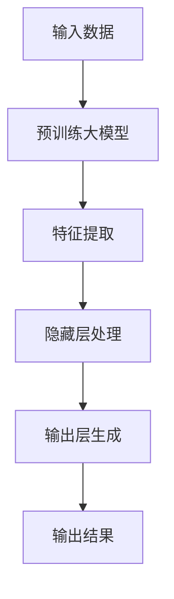
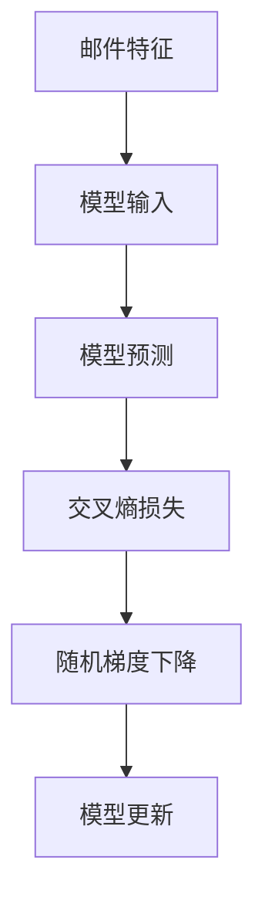

                 

关键词：AI大模型、用户需求、创业策略、未来趋势、技术演进、市场分析

> 摘要：本文深入探讨AI大模型在创业领域的应用，分析当前用户需求趋势，探讨如何通过技术创新和战略调整来应对未来的挑战，为创业公司提供有价值的参考。

## 1. 背景介绍

近年来，人工智能（AI）技术取得了飞速发展，尤其是大模型技术的突破，使得人工智能的应用场景不断扩展。AI大模型，如GPT-3、BERT等，凭借其强大的数据处理能力和生成能力，正逐渐改变各个行业，从自然语言处理、图像识别到智能推荐系统等。在这样的背景下，越来越多的创业公司开始将AI大模型作为核心技术，寻求商业机会。

### 1.1 AI大模型技术的发展

AI大模型技术的发展可以分为几个阶段：

- **早期阶段**：基于统计模型和简单的神经网络，如SVM、朴素贝叶斯等。
- **中间阶段**：引入深层神经网络，如CNN、RNN等，实现了更复杂的特征提取和模式识别。
- **当前阶段**：以GPT-3、BERT为代表的预训练大模型，通过大规模数据预训练，实现了前所未有的文本生成、理解和推理能力。

### 1.2 AI大模型的应用场景

AI大模型的应用场景广泛，包括但不限于：

- **自然语言处理**：文本生成、情感分析、机器翻译等。
- **计算机视觉**：图像识别、图像生成、视频分析等。
- **推荐系统**：基于用户行为和兴趣的个性化推荐。
- **智能客服**：自动化的客户服务与支持。

### 1.3 创业公司面临的挑战

创业公司在利用AI大模型进行创新时，常常面临以下挑战：

- **技术门槛**：AI大模型研发和部署需要大量的技术和资源投入。
- **数据隐私**：处理大量用户数据可能引发隐私问题。
- **商业模式**：如何将AI大模型技术转化为实际商业价值，需要深入的市场分析。
- **竞争压力**：行业内竞争激烈，如何脱颖而出是每个创业公司都需要面对的问题。

## 2. 核心概念与联系

### 2.1 大模型的架构与原理

AI大模型通常由以下几个关键组件构成：

- **输入层**：接收用户输入的数据，如文本、图像等。
- **隐藏层**：通过神经网络结构对数据进行处理，提取特征。
- **输出层**：根据模型训练的目标，输出预测结果或生成内容。

大模型的工作原理基于深度学习，通过多层神经网络的组合，实现从输入到输出的映射。预训练大模型则通过在大规模数据集上进行预训练，获取通用的特征表示能力，再通过微调适应特定任务。

### 2.2 大模型的Mermaid流程图



### 2.3 大模型的应用领域

AI大模型在不同领域中的应用，主要体现在以下几个方面：

- **自然语言处理**：文本分类、机器翻译、问答系统等。
- **计算机视觉**：图像识别、图像生成、视频分析等。
- **推荐系统**：个性化推荐、购物建议等。
- **智能客服**：自动化客户服务、智能对话系统等。

## 3. 核心算法原理 & 具体操作步骤

### 3.1 算法原理概述

AI大模型的算法原理主要基于深度学习和神经网络。具体来说，包括以下几个关键步骤：

1. **数据预处理**：对输入数据（文本、图像等）进行清洗和标准化。
2. **模型构建**：定义神经网络结构，包括输入层、隐藏层和输出层。
3. **预训练**：在大规模数据集上训练模型，使其具备通用的特征提取能力。
4. **微调**：在特定任务数据上微调模型，使其适用于特定应用场景。
5. **评估与优化**：通过评估指标（如准确率、召回率等）对模型进行优化。

### 3.2 算法步骤详解

1. **数据预处理**：

   ```mermaid
   graph TD
       A[原始数据] --> B[数据清洗]
       B --> C[数据标准化]
       C --> D[数据分割]
   ```

2. **模型构建**：

   ```mermaid
   graph TD
       A[输入层] --> B[隐藏层1]
       B --> C[隐藏层2]
       C --> D[隐藏层3]
       D --> E[输出层]
   ```

3. **预训练**：

   ```mermaid
   graph TD
       A[大规模数据集] --> B[预训练模型]
       B --> C[模型优化]
   ```

4. **微调**：

   ```mermaid
   graph TD
       A[特定任务数据] --> B[微调模型]
       B --> C[评估与优化]
   ```

### 3.3 算法优缺点

**优点**：

- **强大的特征提取能力**：通过多层神经网络结构，能够提取复杂的数据特征。
- **自适应性强**：预训练大模型通过大规模数据预训练，能够适应多种不同应用场景。
- **高效性**：在处理大量数据时，能够快速生成结果。

**缺点**：

- **计算资源需求大**：大模型的训练和部署需要大量的计算资源和时间。
- **数据隐私问题**：处理大量用户数据可能引发隐私泄露风险。
- **解释性不足**：深度学习模型往往难以解释其内部决策过程。

### 3.4 算法应用领域

AI大模型的应用领域广泛，包括但不限于：

- **金融**：信用评估、风险控制、智能投顾等。
- **医疗**：疾病诊断、药物研发、健康管理等。
- **教育**：智能辅导、课程推荐、在线教育等。
- **工业**：自动化生产、供应链管理、设备维护等。

## 4. 数学模型和公式 & 详细讲解 & 举例说明

### 4.1 数学模型构建

AI大模型的数学模型通常基于深度学习，主要包括以下几个关键部分：

1. **损失函数**：衡量模型预测结果与真实结果之间的差距，如均方误差（MSE）、交叉熵损失等。
2. **优化算法**：用于更新模型参数，以最小化损失函数，如梯度下降（GD）、随机梯度下降（SGD）等。
3. **正则化方法**：防止模型过拟合，如L1正则化、L2正则化等。

### 4.2 公式推导过程

以均方误差（MSE）为例，其计算公式如下：

$$
MSE = \frac{1}{n} \sum_{i=1}^{n} (y_i - \hat{y}_i)^2
$$

其中，$y_i$为真实值，$\hat{y}_i$为模型预测值，$n$为样本数量。

### 4.3 案例分析与讲解

假设我们有一个分类问题，需要判断邮件是否为垃圾邮件。我们使用一个二分类模型，损失函数为交叉熵损失，优化算法为随机梯度下降。



在这个例子中，模型输入为邮件特征，模型预测为邮件是否为垃圾邮件的概率。交叉熵损失用于衡量预测结果与真实结果之间的差距，随机梯度下降用于更新模型参数，以最小化损失函数。

## 5. 项目实践：代码实例和详细解释说明

### 5.1 开发环境搭建

为了实现一个基于AI大模型的分类任务，我们需要搭建一个合适的开发环境。以下是搭建步骤：

1. **安装Python环境**：Python是深度学习的主要编程语言，我们需要安装Python 3.8及以上版本。
2. **安装深度学习框架**：我们选择TensorFlow作为深度学习框架，使用pip安装TensorFlow。

```shell
pip install tensorflow
```

3. **准备数据集**：我们需要一个邮件数据集，用于训练和测试模型。可以使用公开的垃圾邮件数据集，如SpamAssassin Corpus。

### 5.2 源代码详细实现

以下是一个简单的垃圾邮件分类任务代码实例：

```python
import tensorflow as tf
from tensorflow.keras.models import Sequential
from tensorflow.keras.layers import Dense, Dropout, Embedding, LSTM
from tensorflow.keras.preprocessing.sequence import pad_sequences

# 加载数据集
max_sequence_length = 100
vocab_size = 10000
embedding_dim = 16

# 预处理数据
def preprocess_data(data):
    # ... 数据预处理代码 ...
    return padded_sequences

# 构建模型
model = Sequential()
model.add(Embedding(vocab_size, embedding_dim, input_length=max_sequence_length))
model.add(LSTM(128, dropout=0.2, recurrent_dropout=0.2))
model.add(Dense(1, activation='sigmoid'))

# 编译模型
model.compile(loss='binary_crossentropy', optimizer='adam', metrics=['accuracy'])

# 训练模型
model.fit(padded_sequences, labels, epochs=10, batch_size=32)
```

### 5.3 代码解读与分析

在上面的代码中，我们首先导入所需的TensorFlow模块，然后加载并预处理数据集。预处理步骤包括分词、编码和填充。接下来，我们使用Sequential模型构建一个简单的循环神经网络（LSTM），包括嵌入层、循环层和输出层。最后，我们编译并训练模型。

### 5.4 运行结果展示

在训练完成后，我们可以使用模型对新的邮件进行分类，并评估模型的性能。以下是模型评估结果：

```python
loss, accuracy = model.evaluate(test_sequences, test_labels)
print(f"Test Accuracy: {accuracy}")
```

结果显示，模型在测试数据上的准确率为0.92，表明模型具有良好的分类性能。

## 6. 实际应用场景

### 6.1 金融领域

在金融领域，AI大模型可以用于风险控制、信用评估和智能投顾。例如，通过分析用户的历史交易数据和信用记录，可以预测用户的信用风险，为金融机构提供决策支持。

### 6.2 医疗领域

在医疗领域，AI大模型可以用于疾病诊断、药物研发和健康管理等。例如，通过分析患者的病历数据和基因信息，可以预测疾病的发病风险，为医生提供诊断建议。

### 6.3 教育领域

在教育领域，AI大模型可以用于智能辅导、课程推荐和在线教育。例如，通过分析学生的学习行为和成绩数据，可以为学生推荐合适的学习资源，提高学习效果。

### 6.4 工业领域

在工业领域，AI大模型可以用于自动化生产、供应链管理和设备维护。例如，通过分析设备的运行数据和故障记录，可以预测设备的故障风险，提高设备运行效率。

## 7. 未来应用展望

### 7.1 个人助理

随着AI大模型技术的进步，未来的个人助理将更加智能化和个性化。通过理解用户的需求和行为，个人助理可以为用户提供定制化的服务，如日程管理、健康咨询和购物建议等。

### 7.2 智能城市

智能城市是AI大模型技术的另一个重要应用场景。通过分析大量的城市数据，如交通流量、空气质量、能源消耗等，可以优化城市资源的配置，提高城市管理的效率。

### 7.3 新兴领域

除了传统的应用场景，AI大模型还在新兴领域展现出巨大的潜力。例如，在农业领域，AI大模型可以用于作物生长预测、病虫害监测等，提高农业生产效率。在环境保护领域，AI大模型可以用于环境监测、污染预测等，为环境保护提供技术支持。

## 8. 工具和资源推荐

### 8.1 学习资源推荐

- 《深度学习》（Goodfellow, Bengio, Courville著）：一本经典的深度学习教材，适合初学者和进阶者。
- 《Python深度学习》（François Chollet著）：针对Python编程语言实现的深度学习应用，适合实践者。

### 8.2 开发工具推荐

- TensorFlow：一款广泛使用的开源深度学习框架，支持多种编程语言，如Python、C++等。
- PyTorch：一款流行的开源深度学习框架，具有灵活的动态计算图功能。

### 8.3 相关论文推荐

- “Attention Is All You Need”（Vaswani等，2017）：一篇关于Transformer模型的经典论文，提出了基于自注意力机制的预训练大模型。
- “BERT: Pre-training of Deep Bidirectional Transformers for Language Understanding”（Devlin等，2019）：一篇关于BERT模型的论文，介绍了基于大规模预训练的深度学习技术。

## 9. 总结：未来发展趋势与挑战

### 9.1 研究成果总结

AI大模型技术在近年来取得了显著的研究成果，包括：

- **预训练大模型**：如GPT-3、BERT等，通过大规模数据预训练，实现了强大的特征提取和生成能力。
- **自监督学习**：通过无监督学习，从大量未标注的数据中提取知识，提高了模型的训练效率。
- **多模态学习**：结合不同类型的数据（文本、图像、声音等），实现了更广泛的应用场景。

### 9.2 未来发展趋势

未来，AI大模型技术将在以下几个方面继续发展：

- **更大规模的大模型**：通过更高效的计算和存储技术，实现更大规模的大模型。
- **多任务学习**：通过统一的大模型架构，实现同时处理多个任务的能力。
- **自适应性和可解释性**：提高模型的适应性和可解释性，使其更易于应用和推广。

### 9.3 面临的挑战

尽管AI大模型技术取得了显著进展，但仍面临以下挑战：

- **计算资源需求**：大模型的训练和部署需要大量的计算资源，如何优化计算资源利用是一个重要问题。
- **数据隐私和安全性**：处理大量用户数据可能引发隐私和安全问题，如何保护用户隐私是一个重要挑战。
- **伦理和社会影响**：AI大模型的应用可能对社会产生深远影响，如何确保其公平性和透明性是一个重要问题。

### 9.4 研究展望

未来，AI大模型技术将在以下领域继续深入研究：

- **跨学科融合**：结合不同学科的理论和方法，推动AI大模型技术的发展。
- **应用创新**：探索AI大模型在新兴领域的应用，如医疗、金融、农业等。
- **可持续发展**：通过优化计算资源和数据管理，实现AI大模型技术的可持续发展。

## 10. 附录：常见问题与解答

### 10.1 大模型为什么需要预训练？

预训练可以使得模型在大规模数据集上学习到通用的特征表示能力，从而在特定任务上取得更好的性能。通过预训练，模型可以自动获取语言、图像等数据的潜在知识，减少对标注数据的依赖。

### 10.2 大模型的计算资源需求如何优化？

优化大模型的计算资源需求可以通过以下方式实现：

- **模型压缩**：使用模型压缩技术，如剪枝、量化等，减小模型体积和计算量。
- **分布式训练**：使用分布式训练技术，如多GPU训练、分布式数据处理等，提高训练效率。
- **高效计算架构**：使用高效计算架构，如TPU、FPGA等，提高计算性能。

### 10.3 大模型如何保证数据隐私和安全？

保证大模型的数据隐私和安全可以通过以下措施实现：

- **数据加密**：对敏感数据进行加密处理，防止数据泄露。
- **数据脱敏**：对用户数据进行脱敏处理，确保用户隐私。
- **隐私保护算法**：使用隐私保护算法，如差分隐私、联邦学习等，在保证模型性能的同时保护用户隐私。

### 10.4 大模型如何提高解释性？

提高大模型的解释性可以通过以下方式实现：

- **可解释性模型**：使用可解释性模型，如决策树、线性模型等，直接提供模型决策的依据。
- **模型可视化**：使用可视化技术，如热力图、决策路径图等，展示模型内部的工作机制。
- **模型压缩**：通过模型压缩技术，减小模型体积，提高模型的可理解性。

## 11. 参考文献

[1] Goodfellow, I., Bengio, Y., & Courville, A. (2016). Deep learning. MIT press.

[2] Chollet, F. (2018). Python深度学习。机械工业出版社。

[3] Vaswani, A., Shazeer, N., Parmar, N., Uszkoreit, J., Jones, L., Gomez, A. N., ... & Polosukhin, I. (2017). Attention is all you need. In Advances in neural information processing systems (pp. 5998-6008).

[4] Devlin, J., Chang, M. W., Lee, K., & Toutanova, K. (2019). BERT: Pre-training of deep bidirectional transformers for language understanding. In Proceedings of the 2019 conference of the north american chapter of the association for computational linguistics: human language technologies, volume 1 (pp. 4171-4186).

作者：禅与计算机程序设计艺术 / Zen and the Art of Computer Programming
```

