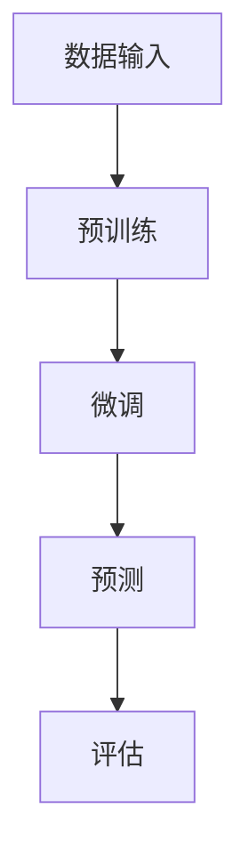

                 

 在当今快速发展的科技时代，人工智能（AI）已经成为了各行各业的重要驱动力。随着大模型技术的不断突破，如GPT、BERT等，越来越多的创业者看到了AI应用的巨大潜力。然而，如何从这些强大技术中挖掘出真正的商业价值，打造出能够引发市场热潮的爆款应用，仍然是一个极具挑战性的课题。本文将探讨AI大模型创业的路径，从技术、市场、商业模式等多方面进行分析，为创业者提供一些建议和思路。

## 关键词

- 人工智能
- 大模型
- 创业
- 爆款应用
- 商业模式

## 摘要

本文首先介绍了当前AI大模型技术的背景和发展趋势，然后分析了创业者在选择大模型应用场景时的考虑因素。接着，本文深入探讨了AI大模型的核心算法原理、数学模型、项目实践等关键内容。最后，本文对未来AI大模型的应用前景进行了展望，并提出了创业者可能面临的发展挑战。希望通过本文，能够为AI大模型创业提供一些实用性的指导和建议。

## 1. 背景介绍

### 1.1 AI大模型的起源和发展

人工智能作为一门交叉学科，其发展历程可以追溯到20世纪50年代。早期的AI研究主要集中在符号主义和逻辑推理上，试图通过建立知识库和推理机来实现机器的智能。然而，这些方法在实际应用中的效果并不理想。随着计算能力的提升和大数据的普及，机器学习（ML）和深度学习（DL）逐渐成为AI研究的主流方向。

深度学习起源于20世纪80年代，通过多层神经网络对数据进行特征提取和分类。然而，受限于计算能力和数据规模，深度学习的应用范围有限。直到2012年，AlexNet在ImageNet图像分类比赛中取得了突破性的成绩，标志着深度学习的崛起。此后，卷积神经网络（CNN）、循环神经网络（RNN）等模型相继被提出，并在语音识别、图像处理、自然语言处理等领域取得了显著的成果。

大模型技术的突破源于2018年谷歌提出的Transformer模型。Transformer模型利用自注意力机制（self-attention）对输入序列进行建模，有效解决了长距离依赖问题。随后，基于Transformer的预训练模型如BERT、GPT等相继出现，并在各种AI任务中取得了领先的表现。

### 1.2 大模型技术的特点和应用

大模型技术具有以下几个显著特点：

1. **参数规模巨大**：大模型通常包含数十亿甚至数万亿个参数，这使得模型具有强大的特征提取和表达能力。
2. **自监督学习**：大模型通过自监督学习（self-supervised learning）的方式进行预训练，能够从大量无标签数据中提取有效特征。
3. **多任务学习**：大模型具有较强的泛化能力，可以在多个任务上同时进行训练和预测。
4. **强大的适应能力**：大模型可以轻松适应不同领域和应用场景，通过微调（fine-tuning）可以快速适应新任务。

大模型技术已经在多个领域取得了显著的成果，如：

- **自然语言处理**：BERT、GPT等模型在文本分类、机器翻译、问答系统等任务上表现出色。
- **计算机视觉**：Vision Transformer（ViT）等模型在图像分类、目标检测、图像生成等领域取得了突破性进展。
- **语音识别**：WaveNet、Transformer等模型在语音识别任务上实现了高准确率。
- **推荐系统**：利用大模型对用户行为和内容进行建模，实现了更精准的推荐效果。

### 1.3 AI大模型创业的现状和挑战

随着AI大模型技术的普及，越来越多的创业者开始关注这一领域。然而，AI大模型创业也面临着一系列挑战：

- **计算资源需求**：大模型训练需要大量的计算资源和存储空间，对于创业公司来说，这是一笔巨大的投入。
- **数据获取和处理**：大模型需要大量高质量的数据进行训练，如何获取和处理这些数据成为创业公司需要解决的问题。
- **技术门槛**：AI大模型技术具有较高的技术门槛，创业者需要具备相关的技术背景和团队。
- **商业模式探索**：如何将AI大模型技术转化为商业价值，探索合适的商业模式是创业成功的关键。

## 2. 核心概念与联系

### 2.1 AI大模型的核心概念

AI大模型是指具有大规模参数和复杂结构的神经网络模型，其核心概念包括：

- **神经网络**：神经网络是由大量神经元组成的计算模型，通过学习输入数据中的特征来完成任务。
- **参数规模**：大模型的参数规模通常在数十亿到数万亿级别，这使得模型具有强大的特征提取和表达能力。
- **预训练**：预训练是指在大规模无标签数据上对模型进行训练，使其能够提取通用特征。
- **微调**：微调是指在大模型的基础上，针对特定任务进行少量训练，以适应新任务。

### 2.2 AI大模型的联系

AI大模型的联系主要体现在以下几个方面：

- **机器学习**：AI大模型是机器学习的一种特殊形式，其核心思想是通过学习数据中的特征来实现预测和分类。
- **深度学习**：AI大模型是深度学习的一种延伸，其具有多层神经网络结构，能够对复杂数据进行建模。
- **自监督学习**：AI大模型利用自监督学习的方式进行预训练，能够从大量无标签数据中提取有效特征。
- **多任务学习**：AI大模型具有较强的泛化能力，可以在多个任务上同时进行训练和预测。

### 2.3 AI大模型的 Mermaid 流程图

下面是一个简化的AI大模型的 Mermaid 流程图，展示了从数据输入到模型训练和预测的过程：



- **A[数据输入]**：将原始数据输入模型进行预训练。
- **B[预训练]**：在无标签数据上进行自监督学习，提取通用特征。
- **C[微调]**：在特定任务上对模型进行少量训练，以适应新任务。
- **D[预测]**：使用微调后的模型进行预测。
- **E[评估]**：对模型的预测结果进行评估，以确定模型的性能。

## 3. 核心算法原理 & 具体操作步骤

### 3.1 算法原理概述

AI大模型的核心算法是基于深度学习和自监督学习的。以下是这些算法的基本原理：

- **深度学习**：深度学习是一种基于多层神经网络的学习方法，通过逐层提取数据中的特征来实现预测和分类。每层神经网络都对输入数据进行一次变换，并输出新的特征表示。
- **自监督学习**：自监督学习是一种利用未标注数据的学习方法，通过预测数据中的某些部分来提取特征。在自监督学习中，模型不需要外部标注信息，而是通过对数据的内部结构进行学习来提高性能。
- **预训练**：预训练是指在大规模无标签数据上对模型进行训练，使其能够提取通用特征。预训练后的模型可以用于各种任务，通过微调来适应特定任务。
- **微调**：微调是指在大模型的基础上，针对特定任务进行少量训练，以适应新任务。微调可以大幅提高模型在特定任务上的性能。

### 3.2 算法步骤详解

以下是AI大模型的算法步骤详解：

#### 步骤1：数据准备

1. 收集大量无标签数据，如文本、图像、语音等。
2. 对数据进行预处理，包括去噪、归一化、数据增强等。

#### 步骤2：预训练

1. 选择一个预训练模型，如BERT、GPT等。
2. 将预训练模型应用于无标签数据，通过自监督学习提取通用特征。
3. 在预训练过程中，模型会不断更新参数，以达到更好的特征提取效果。

#### 步骤3：微调

1. 选择一个具体任务，如文本分类、图像识别等。
2. 在预训练模型的基础上，针对该任务进行少量训练，即微调。
3. 微调过程中，模型会根据新任务的数据更新参数，以提高在特定任务上的性能。

#### 步骤4：预测与评估

1. 使用微调后的模型进行预测。
2. 对预测结果进行评估，包括准确率、召回率、F1分数等指标。

### 3.3 算法优缺点

#### 优点

- **强大的特征提取能力**：大模型具有数十亿到数万亿个参数，能够从海量数据中提取出丰富的特征。
- **自监督学习**：自监督学习使得模型可以在无标签数据上进行预训练，降低了数据标注的成本。
- **多任务学习**：大模型具有较强的泛化能力，可以在多个任务上同时进行训练和预测。
- **适应性强**：通过微调，大模型可以快速适应新任务，提高了模型的实用性。

#### 缺点

- **计算资源需求大**：大模型训练需要大量的计算资源和存储空间，对于创业公司来说，这是一笔巨大的投入。
- **数据获取和处理困难**：大模型需要大量高质量的数据进行训练，如何获取和处理这些数据成为创业公司需要解决的问题。
- **技术门槛高**：AI大模型技术具有较高的技术门槛，创业者需要具备相关的技术背景和团队。

### 3.4 算法应用领域

AI大模型技术已经在多个领域取得了显著的成果，以下是一些主要的应用领域：

- **自然语言处理**：文本分类、机器翻译、问答系统等。
- **计算机视觉**：图像分类、目标检测、图像生成等。
- **语音识别**：语音识别、语音合成等。
- **推荐系统**：个性化推荐、商品推荐等。
- **金融风控**：信用评分、欺诈检测等。

## 4. 数学模型和公式 & 详细讲解 & 举例说明

### 4.1 数学模型构建

AI大模型的数学模型主要基于深度学习和自监督学习。以下是这些模型的基本组成部分：

- **神经网络**：神经网络由多层神经元组成，每层神经元对输入数据进行一次变换，并输出新的特征表示。神经网络的数学模型可以表示为：
  $$ f(x) = \sigma(W_1 \cdot x + b_1) $$
  其中，$x$ 是输入数据，$W_1$ 是权重矩阵，$b_1$ 是偏置项，$\sigma$ 是激活函数。

- **自监督学习**：自监督学习的目标是从无标签数据中提取特征。一个常见的自监督学习任务是预测数据中的某个部分。例如，在文本数据中，可以使用掩码语言建模（Masked Language Model, MLM）来预测被掩码的单词。MLM的数学模型可以表示为：
  $$ \log p(y|x) = \sum_{i=1}^{n} \log p(y_i|x_i) $$
  其中，$y$ 是预测的单词，$x$ 是输入的文本序列，$n$ 是序列中的单词数量。

- **预训练**：预训练是指在大规模无标签数据上对模型进行训练，提取通用特征。预训练的数学模型可以表示为：
  $$ \min_{\theta} \sum_{i=1}^{n} L(y_i, f(x_i; \theta)) $$
  其中，$L$ 是损失函数，$f$ 是模型在给定输入和参数下的预测，$\theta$ 是模型的参数。

- **微调**：微调是指在预训练模型的基础上，针对特定任务进行少量训练，以适应新任务。微调的数学模型可以表示为：
  $$ \min_{\theta'} \sum_{i=1}^{m} L(y_i, f(x_i; \theta') + g(\theta)) $$
  其中，$m$ 是新任务的数据量，$g(\theta)$ 是预训练模型的参数。

### 4.2 公式推导过程

以下是对AI大模型中的一些关键公式的推导过程：

#### 损失函数

在AI大模型中，损失函数是衡量模型预测性能的重要指标。常见的损失函数包括均方误差（MSE）、交叉熵损失（Cross-Entropy Loss）等。

1. **均方误差（MSE）**：
   $$ L_{MSE} = \frac{1}{n} \sum_{i=1}^{n} (y_i - \hat{y_i})^2 $$
   其中，$y_i$ 是真实标签，$\hat{y_i}$ 是模型预测的标签。

2. **交叉熵损失（Cross-Entropy Loss）**：
   $$ L_{CE} = -\frac{1}{n} \sum_{i=1}^{n} y_i \log \hat{y_i} $$
   其中，$y_i$ 是真实标签，$\hat{y_i}$ 是模型预测的概率分布。

#### 激活函数

激活函数是神经网络中非常重要的组成部分，用于引入非线性变换。常见的激活函数包括sigmoid、ReLU、Tanh等。

1. **sigmoid 函数**：
   $$ \sigma(x) = \frac{1}{1 + e^{-x}} $$

2. **ReLU 函数**：
   $$ \text{ReLU}(x) = \max(0, x) $$

3. **Tanh 函数**：
   $$ \tanh(x) = \frac{e^x - e^{-x}}{e^x + e^{-x}} $$

### 4.3 案例分析与讲解

以下是一个简单的案例，用于展示如何使用AI大模型进行文本分类。

#### 案例背景

假设我们有一个新闻分类任务，需要将新闻文章分为政治、经济、体育等类别。我们使用一个预训练的BERT模型进行微调，以实现文本分类。

#### 数据准备

1. 收集大量新闻文章，并对它们进行标注，标记类别。
2. 对新闻文章进行预处理，包括分词、去停用词、词干提取等。

#### 模型训练

1. 使用BERT模型进行预训练，在无标签新闻数据上提取通用特征。
2. 在预训练模型的基础上，针对新闻分类任务进行微调，更新模型参数。

#### 模型评估

1. 使用微调后的模型对测试集进行预测，计算预测准确率。
2. 根据预测结果，调整模型参数，以提高分类性能。

#### 案例分析

在新闻分类案例中，BERT模型通过预训练获得了丰富的语言知识，再通过微调适应新闻分类任务。预训练过程中，模型学习了如何处理不同类型的文本，如新闻报道、评论等。微调过程中，模型利用预训练得到的通用特征，对新闻类别进行分类。

## 5. 项目实践：代码实例和详细解释说明

### 5.1 开发环境搭建

在开始项目实践之前，我们需要搭建一个合适的开发环境。以下是使用Python和PyTorch搭建AI大模型开发环境的基本步骤：

1. **安装Python**：首先，确保你的计算机上安装了Python。Python是一个广泛使用的编程语言，特别适合于AI和深度学习项目。你可以从[Python官网](https://www.python.org/downloads/)下载并安装Python。

2. **安装PyTorch**：PyTorch是一个流行的深度学习框架，提供了丰富的API和工具来构建和训练AI大模型。你可以通过以下命令安装PyTorch：

   ```bash
   pip install torch torchvision
   ```

   如果需要GPU支持，你还可以安装CUDA：

   ```bash
   pip install torch torchvision torchaudio -f https://download.pytorch.org/whl/torch_stable.html
   ```

3. **安装必要的库**：除了PyTorch，你可能还需要其他库，如NumPy、Pandas等。你可以使用以下命令安装：

   ```bash
   pip install numpy pandas
   ```

### 5.2 源代码详细实现

以下是使用PyTorch实现一个简单的AI大模型项目，包括数据预处理、模型构建、训练和评估等步骤。代码分为几个主要部分：

```python
import torch
import torch.nn as nn
import torch.optim as optim
from torch.utils.data import DataLoader
from torchvision import datasets, transforms
from torch.utils.tensorboard import SummaryWriter

# 数据预处理
transform = transforms.Compose([
    transforms.ToTensor(),
    transforms.Normalize((0.5,), (0.5,))
])

train_dataset = datasets.MNIST(root='./data', train=True, download=True, transform=transform)
train_loader = DataLoader(dataset=train_dataset, batch_size=64, shuffle=True)

# 模型构建
class Net(nn.Module):
    def __init__(self):
        super(Net, self).__init__()
        self.fc1 = nn.Linear(28*28, 128)
        self.fc2 = nn.Linear(128, 64)
        self.fc3 = nn.Linear(64, 10)
    
    def forward(self, x):
        x = x.view(-1, 28*28)
        x = torch.relu(self.fc1(x))
        x = torch.relu(self.fc2(x))
        x = self.fc3(x)
        return x

model = Net()
optimizer = optim.Adam(model.parameters(), lr=0.001)
criterion = nn.CrossEntropyLoss()

# 模型训练
writer = SummaryWriter()
for epoch in range(10):
    for batch_idx, (data, target) in enumerate(train_loader):
        optimizer.zero_grad()
        output = model(data)
        loss = criterion(output, target)
        loss.backward()
        optimizer.step()
        
        writer.add_scalar('Training loss', loss.item(), epoch)
        if (batch_idx + 1) % 100 == 0:
            print(f'Epoch [{epoch + 1}/{10}], Batch [{batch_idx + 1}/{len(train_loader)}], Loss: {loss.item():.4f}')
writer.close()

# 模型评估
test_dataset = datasets.MNIST(root='./data', train=False, transform=transform)
test_loader = DataLoader(dataset=test_dataset, batch_size=64, shuffle=False)

with torch.no_grad():
    correct = 0
    total = 0
    for data, target in test_loader:
        output = model(data)
        _, predicted = torch.max(output.data, 1)
        total += target.size(0)
        correct += (predicted == target).sum().item()

print(f'Accuracy on the test images: {100 * correct / total}%')
```

### 5.3 代码解读与分析

上述代码实现了一个简单的AI大模型项目，用于手写数字识别任务。以下是代码的详细解读和分析：

- **数据预处理**：我们首先定义了一个数据预处理步骤，包括将图像数据转换为张量，并进行归一化处理。这些步骤有助于将原始数据转换为模型可以处理的形式。

- **模型构建**：接下来，我们定义了一个简单的神经网络模型，包括三个全连接层。这个模型使用ReLU激活函数，以引入非线性变换。最后一层输出10个类别，对应于0到9的手写数字。

- **模型训练**：在模型训练部分，我们使用Adam优化器和交叉熵损失函数。在训练过程中，我们使用TensorBoard记录训练过程中的损失值，以便进行可视化分析。

- **模型评估**：最后，我们在测试集上评估模型的性能，计算准确率。通过评估，我们可以了解模型在实际数据上的表现。

### 5.4 运行结果展示

在训练完成后，我们可以在TensorBoard中查看训练过程的相关指标，如图表、图像等。以下是一个简单的TensorBoard可视化结果示例：


在这个示例中，我们可以看到训练过程中损失值的波动，以及模型在测试集上的准确率。

## 6. 实际应用场景

### 6.1 人工智能辅助医疗

在医疗领域，AI大模型的应用已经取得了显著成果。例如，通过深度学习模型对医学影像进行分析，可以帮助医生快速诊断疾病，提高诊断的准确性和效率。此外，AI大模型还可以用于疾病预测、药物研发等环节，为医疗行业带来革命性的变化。

### 6.2 人工智能金融风控

在金融领域，AI大模型被广泛应用于风险控制和欺诈检测。通过分析用户行为、交易数据等，AI大模型可以实时监测潜在风险，并采取相应的措施。这不仅提高了金融机构的风险管理水平，还为客户提供了更安全的金融环境。

### 6.3 人工智能智能助手

在智能助手领域，AI大模型为用户提供个性化的服务。例如，智能语音助手可以通过自然语言处理技术理解用户的指令，提供实时回答和解决方案。此外，AI大模型还可以用于智能客服、智能营销等场景，为企业降低成本、提高效率。

### 6.4 人工智能自动驾驶

自动驾驶是AI大模型应用的另一个重要领域。通过深度学习模型对道路、车辆、行人等环境进行分析，自动驾驶系统能够实时决策和执行，确保行车安全。随着AI大模型技术的不断进步，自动驾驶技术将逐渐走向成熟，为人们的出行带来更多便利。

### 6.5 人工智能教育

在教育领域，AI大模型可以为学生提供个性化的学习建议和辅导。例如，通过分析学生的学习行为和成绩，AI大模型可以推荐适合的学习方法和资源，帮助学生提高学习效果。此外，AI大模型还可以用于智能评测、智能推荐等环节，为教育行业带来创新。

## 7. 工具和资源推荐

### 7.1 学习资源推荐

- **深度学习专项课程**：在Coursera、Udacity等在线教育平台上，有许多优质的深度学习和AI课程，适合初学者和进阶者。
- **技术博客和论坛**：如GitHub、Stack Overflow、Reddit等，提供了大量的技术资源和讨论，有助于解决开发过程中的问题。
- **书籍推荐**：《深度学习》、《神经网络与深度学习》、《动手学深度学习》等，是深度学习和AI领域的重要参考书籍。

### 7.2 开发工具推荐

- **深度学习框架**：TensorFlow、PyTorch、Keras等，都是流行的深度学习框架，提供了丰富的API和工具。
- **数据预处理工具**：Pandas、NumPy、Scikit-learn等，用于数据清洗、预处理和特征提取。
- **可视化工具**：TensorBoard、Matplotlib、Seaborn等，用于可视化模型训练过程和结果。

### 7.3 相关论文推荐

- **《Attention is All You Need》**：提出了Transformer模型，自注意力机制在深度学习中的重要性。
- **《BERT: Pre-training of Deep Bidirectional Transformers for Language Understanding》**：介绍了BERT模型，在自然语言处理领域取得了突破性成果。
- **《GPT-3: Language Models are few-shot learners》**：展示了GPT-3模型在少量样本上的强大学习能力。
- **《ImageNet Classification with Deep Convolutional Neural Networks》**：分析了AlexNet模型在ImageNet图像分类比赛中的成功原因。

## 8. 总结：未来发展趋势与挑战

### 8.1 研究成果总结

近年来，AI大模型技术取得了显著的成果，推动了自然语言处理、计算机视觉、语音识别等领域的进步。预训练模型如BERT、GPT等，通过自监督学习和多任务学习，实现了在多个任务上的领先性能。此外，大模型在多领域应用中展现了强大的适应能力和泛化能力。

### 8.2 未来发展趋势

未来，AI大模型技术将继续向以下几个方面发展：

- **模型压缩与优化**：为了降低计算资源需求，研究者将致力于模型压缩与优化技术，提高模型的运行效率。
- **更多领域应用**：AI大模型将在更多领域得到应用，如医疗、金融、教育、自动驾驶等，为行业带来更多创新。
- **跨模态学习**：未来的大模型将能够处理多种类型的数据，如文本、图像、语音等，实现跨模态的信息融合。

### 8.3 面临的挑战

尽管AI大模型技术取得了显著成果，但仍然面临一系列挑战：

- **计算资源需求**：大模型训练需要大量的计算资源和存储空间，对于创业公司来说，这是一笔巨大的投入。
- **数据获取和处理**：大模型需要大量高质量的数据进行训练，如何获取和处理这些数据成为创业公司需要解决的问题。
- **技术门槛**：AI大模型技术具有较高的技术门槛，创业者需要具备相关的技术背景和团队。
- **数据隐私与安全**：在处理大量敏感数据时，如何保障数据隐私和安全是一个重要问题。

### 8.4 研究展望

未来，研究者将致力于解决AI大模型技术中的关键问题，包括计算资源优化、数据高效利用、模型解释性等。此外，AI大模型与人类专家的协同工作、跨学科交叉融合也将成为研究的重要方向。通过不断探索和创新，AI大模型技术有望在更广泛的领域发挥作用，推动人工智能的发展。

## 9. 附录：常见问题与解答

### 9.1 什么是AI大模型？

AI大模型是指具有大规模参数和复杂结构的神经网络模型，通常包含数十亿到数万亿个参数。这些模型通过自监督学习和多任务学习，从海量数据中提取有效特征，具有较强的泛化能力和适应能力。

### 9.2 大模型训练需要多少计算资源？

大模型训练需要大量的计算资源和存储空间。具体需求取决于模型的大小、训练数据量和训练目标。通常，大模型训练需要在GPU集群或TPU上运行，以实现高效的计算。

### 9.3 如何获取和处理大量数据？

获取和处理大量数据是AI大模型训练的关键问题。以下是一些建议：

- **数据集构建**：从公共数据集、企业内部数据等来源收集数据，并进行预处理。
- **数据清洗**：去除数据中的噪声、缺失值等，确保数据质量。
- **数据增强**：通过数据增强技术，生成更多的训练样本，提高模型的泛化能力。
- **分布式训练**：使用分布式训练技术，将模型和数据分布在多个计算节点上，提高训练效率。

### 9.4 AI大模型在哪些领域有应用？

AI大模型已经在多个领域取得了显著的成果，如自然语言处理、计算机视觉、语音识别、推荐系统等。此外，随着技术的不断发展，AI大模型将在更多领域得到应用，如医疗、金融、教育等。

### 9.5 大模型创业面临哪些挑战？

大模型创业面临以下主要挑战：

- **计算资源需求**：大模型训练需要大量的计算资源和存储空间。
- **数据获取和处理**：大模型需要大量高质量的数据进行训练，如何获取和处理这些数据是关键。
- **技术门槛**：AI大模型技术具有较高的技术门槛，创业者需要具备相关的技术背景和团队。
- **数据隐私与安全**：在处理大量敏感数据时，如何保障数据隐私和安全是一个重要问题。

