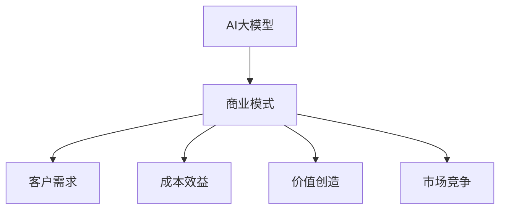

                 

关键词：AI大模型，创业，商业模式，可持续，技术应用，案例分析

> 摘要：本文深入探讨了AI大模型创业的核心问题，分析了当前市场的挑战和机遇，以及如何构建未来可持续的商业模式。通过结合实际案例和技术细节，为创业者提供了切实可行的指导和策略。

## 1. 背景介绍

在过去的几十年里，人工智能（AI）经历了从实验室研究到产业应用的重大变革。特别是深度学习技术的发展，使得AI大模型在图像识别、自然语言处理、推荐系统等领域取得了突破性的进展。这些技术的进步不仅提升了AI的准确性，还降低了其应用门槛，使得AI大模型开始进入商业领域，成为一个新兴的产业方向。

然而，AI大模型的创业之路并非一帆风顺。由于技术的复杂性和高成本，很多初创企业在面对市场、资金、人才等方面都遇到了挑战。如何构建一个可持续的商业模式，成为每个AI大模型创业团队需要深思熟虑的问题。

## 2. 核心概念与联系

### 2.1. AI大模型的基本概念

AI大模型是指使用大量数据训练出的复杂神经网络模型，通常具有高度的参数量和计算复杂度。这些模型可以用于解决各种复杂问题，如语音识别、图像生成、自然语言理解等。

### 2.2. 商业模式的基本概念

商业模式是指企业如何创造、传递和获取价值的一种方法。它包括收入来源、成本结构、客户价值主张、渠道策略等多个方面。

### 2.3. AI大模型与商业模式的联系

AI大模型作为一种技术工具，其商业模式的构建需要考虑以下几个方面：

- **客户需求**：了解目标客户的需求，将其转化为可量化的产品或服务。
- **成本效益**：在技术和运营成本之间找到平衡，确保企业的可持续发展。
- **价值创造**：通过AI技术提供独特的产品或服务，为客户创造价值。
- **市场竞争**：分析竞争对手的优势和劣势，制定相应的市场策略。

### 2.4. Mermaid流程图



## 3. 核心算法原理 & 具体操作步骤

### 3.1. 算法原理概述

AI大模型的构建主要依赖于深度学习技术，其中最为核心的是神经网络。神经网络通过层层叠加的方式对输入数据进行处理，从而实现对复杂模式的识别和学习。

### 3.2. 算法步骤详解

1. **数据收集与预处理**：收集大量相关数据，并进行清洗和格式化，为模型训练做准备。
2. **模型设计**：根据任务需求设计合适的神经网络结构，包括层数、每层的神经元数量等。
3. **模型训练**：使用预处理后的数据对模型进行训练，通过优化算法调整模型参数，使其能够更好地拟合数据。
4. **模型评估**：在测试集上评估模型的性能，通过指标如准确率、召回率等来评估模型的效果。
5. **模型部署**：将训练好的模型部署到生产环境中，供实际应用使用。

### 3.3. 算法优缺点

- **优点**：AI大模型能够处理大规模数据，具有高度的自适应性和泛化能力，可以解决复杂的问题。
- **缺点**：模型训练过程需要大量计算资源和时间，对数据质量和预处理要求较高。

### 3.4. 算法应用领域

AI大模型在多个领域都有广泛的应用，如：

- **图像识别**：用于安防监控、医疗诊断等领域。
- **自然语言处理**：用于智能客服、翻译服务等。
- **推荐系统**：用于电商、社交媒体等领域。

## 4. 数学模型和公式 & 详细讲解 & 举例说明

### 4.1. 数学模型构建

AI大模型的核心是神经网络，其数学模型可以表示为：

\[ f(x) = \sigma(W \cdot x + b) \]

其中，\( x \) 是输入数据，\( W \) 是权重矩阵，\( b \) 是偏置项，\( \sigma \) 是激活函数。

### 4.2. 公式推导过程

神经网络的训练过程可以看作是一个最小化损失函数的过程。假设我们的损失函数为：

\[ J(W, b) = \frac{1}{2} \sum_{i=1}^{n} (f(x_i) - y_i)^2 \]

其中，\( y_i \) 是期望输出，\( f(x_i) \) 是实际输出。

为了最小化损失函数，我们使用梯度下降法对模型参数进行优化：

\[ \nabla_J(W) = \frac{\partial J}{\partial W} \]
\[ \nabla_J(b) = \frac{\partial J}{\partial b} \]

### 4.3. 案例分析与讲解

假设我们有一个简单的二分类问题，目标是将数据集划分为两个类别。我们可以使用逻辑回归模型来进行预测，其公式为：

\[ P(y=1 | x) = \frac{1}{1 + e^{-(W \cdot x + b)}} \]

通过训练，我们可以得到最优的权重矩阵 \( W \) 和偏置项 \( b \)。在实际应用中，我们可以使用以下步骤：

1. **数据收集**：收集包含特征和标签的数据集。
2. **数据预处理**：对数据进行标准化处理，使其具有相同的尺度。
3. **模型训练**：使用训练数据对模型进行训练，调整权重和偏置项。
4. **模型评估**：在测试集上评估模型的性能，调整模型参数。
5. **模型部署**：将训练好的模型部署到生产环境中，供实际应用使用。

## 5. 项目实践：代码实例和详细解释说明

### 5.1. 开发环境搭建

为了实践AI大模型的构建，我们需要搭建一个开发环境。以下是基本的步骤：

1. **安装Python**：确保Python环境已经安装在计算机上。
2. **安装TensorFlow**：使用pip命令安装TensorFlow库。

### 5.2. 源代码详细实现

以下是一个简单的AI大模型构建的Python代码示例：

```python
import tensorflow as tf

# 模型参数
input_size = 100
hidden_size = 64
output_size = 1

# 创建模型
model = tf.keras.Sequential([
    tf.keras.layers.Dense(hidden_size, activation='relu', input_shape=(input_size,)),
    tf.keras.layers.Dense(output_size, activation='sigmoid')
])

# 编译模型
model.compile(optimizer='adam',
              loss='binary_crossentropy',
              metrics=['accuracy'])

# 训练模型
model.fit(x_train, y_train, epochs=10, batch_size=32, validation_split=0.2)

# 评估模型
model.evaluate(x_test, y_test)
```

### 5.3. 代码解读与分析

- **模型创建**：使用`tf.keras.Sequential`创建一个序列模型，包含两个全连接层，第一个层使用ReLU激活函数，第二个层使用sigmoid激活函数。
- **模型编译**：使用`compile`方法配置模型的优化器、损失函数和评价指标。
- **模型训练**：使用`fit`方法对模型进行训练，配置训练数据、训练轮数、批量大小等参数。
- **模型评估**：使用`evaluate`方法在测试集上评估模型的性能。

### 5.4. 运行结果展示

运行代码后，我们可以得到模型的训练过程和评估结果。这些结果可以帮助我们了解模型的性能和调整策略。

## 6. 实际应用场景

AI大模型在商业领域有广泛的应用，以下是一些实际应用场景：

- **金融领域**：用于风险评估、欺诈检测、算法交易等。
- **医疗领域**：用于疾病诊断、药物研发、个性化治疗等。
- **零售领域**：用于需求预测、库存管理、推荐系统等。

### 6.4. 未来应用展望

随着AI技术的不断发展，AI大模型的应用场景将更加广泛。未来，AI大模型有望在智能城市、自动驾驶、虚拟现实等领域发挥重要作用。

## 7. 工具和资源推荐

### 7.1. 学习资源推荐

- 《深度学习》（Goodfellow, Bengio, Courville著）：全面介绍深度学习的基本概念和算法。
- 《Python机器学习》（Sebastian Raschka著）：介绍如何使用Python进行机器学习实践。

### 7.2. 开发工具推荐

- TensorFlow：用于构建和训练AI大模型的开源框架。
- Jupyter Notebook：用于编写和运行代码的交互式环境。

### 7.3. 相关论文推荐

- "Deep Learning" by Ian Goodfellow, Yoshua Bengio, Aaron Courville
- "Distributed Optimization and Statistical Learning via the Stochastic Gradient Descent M
ethod" by John Duchi, Sanjoy Dasgupta, Ambuj Tewari, and Martin Wainwright

## 8. 总结：未来发展趋势与挑战

### 8.1. 研究成果总结

近年来，AI大模型在多个领域取得了显著的研究成果，推动了相关产业的发展。同时，随着计算能力的提升和数据量的增加，AI大模型的应用前景越来越广阔。

### 8.2. 未来发展趋势

未来，AI大模型将继续在技术层面取得突破，如更高效的算法、更小的模型、更智能的模型等。同时，AI大模型的应用将更加深入到各个领域，推动产业的数字化转型。

### 8.3. 面临的挑战

尽管AI大模型有着广阔的应用前景，但同时也面临着一些挑战，如数据隐私、模型透明度、算法公平性等。

### 8.4. 研究展望

未来的研究应重点关注如何构建更加智能、高效、可靠的AI大模型，同时解决其在实际应用中面临的各种挑战。

## 9. 附录：常见问题与解答

### 9.1. 什么是AI大模型？

AI大模型是指使用大量数据训练出的复杂神经网络模型，通常具有高度的参数量和计算复杂度。

### 9.2. AI大模型有哪些应用领域？

AI大模型在图像识别、自然语言处理、推荐系统等领域都有广泛的应用。

### 9.3. 如何构建一个AI大模型？

构建AI大模型主要包括数据收集与预处理、模型设计、模型训练、模型评估和模型部署等步骤。

### 9.4. AI大模型有哪些优缺点？

AI大模型的优点包括能够处理大规模数据、高度的自适应性和泛化能力等；缺点包括模型训练过程需要大量计算资源和时间，对数据质量和预处理要求较高。

----------------------------------------------------------------
作者：禅与计算机程序设计艺术 / Zen and the Art of Computer Programming

