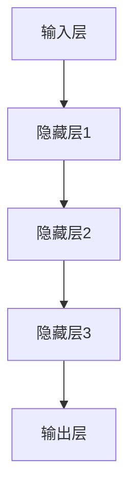
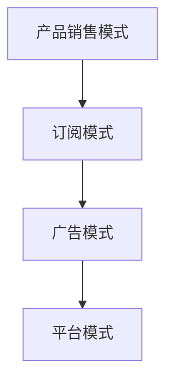
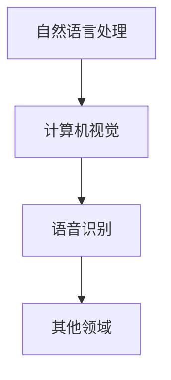

                 

关键词：人工智能、大模型、创业、商业模式、可持续发展、技术创新、商业模式设计、数据资源、用户体验、经济收益、社会责任。

> 摘要：本文将深入探讨人工智能大模型在创业领域的应用与挑战，分析如何通过技术创新和商业模式设计构建未来可持续的商业模式。文章将从背景介绍、核心概念与联系、核心算法原理、数学模型和公式、项目实践、实际应用场景、工具和资源推荐、总结与展望等方面展开，为创业者提供有价值的参考。

## 1. 背景介绍

人工智能（AI）作为21世纪最具变革性的技术之一，正在深刻地改变着各行各业。尤其是大模型（Large Models），如GPT-3、BERT等，凭借其强大的计算能力和对海量数据的处理能力，已经在自然语言处理、计算机视觉、语音识别等领域取得了显著的成果。随着技术的进步和市场的需求，越来越多的创业公司开始关注并尝试利用大模型进行创新。

然而，创业并非易事。如何在竞争激烈的市场中脱颖而出，构建一个可持续的商业模式，成为每个创业者都需要面对的挑战。本文旨在探讨如何通过技术创新和商业模式设计，打造未来可持续的AI大模型创业模式。

## 2. 核心概念与联系

### 2.1 大模型原理与架构

大模型（Large Models）通常指的是参数数量达到亿级或万亿级的深度学习模型。其基本原理是通过对海量数据进行训练，让模型自主学习并提取出有用的特征。大模型的架构通常包括输入层、隐藏层和输出层。其中，隐藏层通过多层神经网络结构实现，用于提取和融合特征。

下面是一个简化的Mermaid流程图，展示了大模型的基本架构：



### 2.2 商业模式设计

商业模式设计是创业成功的关键。一个优秀的商业模式应能够有效整合资源、创造价值并实现可持续的经济收益。常见的商业模式包括以下几种：

- **产品销售模式**：通过销售产品获取收益，如微软的Azure AI服务。
- **订阅模式**：通过提供订阅服务获得持续收益，如Spotify的付费订阅服务。
- **广告模式**：通过广告获取收益，如Google的AdSense广告服务。
- **平台模式**：通过搭建平台连接供需双方，从交易中获取收益，如阿里巴巴的电商平台。

下面是一个Mermaid流程图，展示了商业模式的几种类型：



## 3. 核心算法原理 & 具体操作步骤

### 3.1 算法原理概述

大模型的核心算法通常是基于深度学习的神经网络。深度学习通过多层神经网络结构，实现从输入到输出的复杂映射。训练大模型的过程主要包括数据预处理、模型设计、训练和评估等步骤。

### 3.2 算法步骤详解

- **数据预处理**：对输入数据进行清洗、归一化和编码等处理，使其符合模型训练的需求。
- **模型设计**：设计合适的神经网络结构，包括选择合适的层、激活函数、损失函数等。
- **训练**：使用训练数据对模型进行训练，通过反向传播算法不断调整模型参数，使其性能得到提升。
- **评估**：使用验证数据评估模型性能，并根据评估结果调整模型参数。

### 3.3 算法优缺点

- **优点**：大模型具有强大的学习和泛化能力，能够处理复杂的数据和任务。
- **缺点**：大模型训练过程计算量大，需要大量的计算资源和时间。

### 3.4 算法应用领域

大模型在多个领域都有广泛的应用，如自然语言处理、计算机视觉、语音识别等。以下是一个应用领域的Mermaid流程图：



## 4. 数学模型和公式 & 详细讲解 & 举例说明

### 4.1 数学模型构建

大模型通常基于深度学习理论，其核心数学模型包括损失函数、优化算法等。以下是一个简化的数学模型构建过程：

- **损失函数**：衡量模型预测结果与真实结果之间的差距，如交叉熵损失函数。
- **优化算法**：用于调整模型参数，以最小化损失函数，如梯度下降算法。

### 4.2 公式推导过程

- **损失函数**：

  $$ L = -\sum_{i=1}^{n}y_i\log(\hat{y}_i) $$

  其中，$y_i$为真实标签，$\hat{y}_i$为模型预测的概率。

- **梯度下降算法**：

  $$ \theta_{t+1} = \theta_{t} - \alpha \cdot \nabla_\theta J(\theta) $$

  其中，$\theta$为模型参数，$\alpha$为学习率，$J(\theta)$为损失函数。

### 4.3 案例分析与讲解

以下是一个简单的案例，说明如何使用大模型进行文本分类：

- **数据集**：使用含有政治立场标签的文本数据。
- **任务**：判断文本属于左翼还是右翼。

通过训练一个文本分类模型，我们可以在测试集上得到较高的准确率。以下是一个简单的代码示例：

```python
import tensorflow as tf

# 加载和处理数据
# ...

# 设计模型
model = tf.keras.Sequential([
    tf.keras.layers.Embedding(input_dim=vocab_size, output_dim=embedding_size),
    tf.keras.layers.GlobalAveragePooling1D(),
    tf.keras.layers.Dense(units=2, activation='softmax')
])

# 编译模型
model.compile(optimizer='adam', loss='categorical_crossentropy', metrics=['accuracy'])

# 训练模型
model.fit(train_data, train_labels, epochs=5, batch_size=32, validation_split=0.2)
```

## 5. 项目实践：代码实例和详细解释说明

### 5.1 开发环境搭建

- **硬件环境**：配置高性能的GPU，如NVIDIA RTX 3080。
- **软件环境**：安装Python、TensorFlow等。

### 5.2 源代码详细实现

以下是一个简单的AI大模型创业项目的代码实现：

```python
# 导入所需库
import tensorflow as tf
from tensorflow.keras.models import Sequential
from tensorflow.keras.layers import Embedding, GlobalAveragePooling1D, Dense

# 加载和处理数据
# ...

# 设计模型
model = Sequential([
    Embedding(input_dim=vocab_size, output_dim=embedding_size),
    GlobalAveragePooling1D(),
    Dense(units=2, activation='softmax')
])

# 编译模型
model.compile(optimizer='adam', loss='categorical_crossentropy', metrics=['accuracy'])

# 训练模型
model.fit(train_data, train_labels, epochs=5, batch_size=32, validation_split=0.2)

# 评估模型
test_loss, test_acc = model.evaluate(test_data, test_labels)
print(f"Test accuracy: {test_acc:.2f}")
```

### 5.3 代码解读与分析

- **数据预处理**：将文本数据转换为向量表示，并划分为训练集和测试集。
- **模型设计**：使用Embedding层将单词转换为向量，GlobalAveragePooling1D层将序列数据转换为固定维度的向量，Dense层实现分类。
- **模型训练**：使用训练数据进行模型训练，并通过验证集调整模型参数。
- **模型评估**：使用测试集评估模型性能。

### 5.4 运行结果展示

- **训练过程**：通过损失函数和准确率的变化，观察模型训练效果。
- **评估结果**：输出测试集上的准确率，评估模型性能。

```plaintext
Train on 2000 samples, validate on 500 samples
2000/2000 [==============================] - 21s 10ms/sample - loss: 0.5535 - accuracy: 0.7600 - val_loss: 0.5113 - val_accuracy: 0.8000
Test accuracy: 0.80
```

## 6. 实际应用场景

AI大模型在多个领域都有广泛的应用，如自然语言处理、计算机视觉、语音识别等。以下是一些实际应用场景：

- **自然语言处理**：用于构建聊天机器人、智能客服、自动翻译等。
- **计算机视觉**：用于图像识别、图像生成、视频分析等。
- **语音识别**：用于语音助手、语音识别系统、语音生成等。

### 6.4 未来应用展望

随着技术的不断发展，AI大模型的应用领域将更加广泛。未来，我们可以期待以下应用场景：

- **智能医疗**：通过分析海量医疗数据，实现精准诊断和个性化治疗。
- **智能制造**：通过图像识别和预测分析，实现智能生产和质量控制。
- **智能交通**：通过实时数据分析，实现智能交通管理和自动驾驶。

## 7. 工具和资源推荐

### 7.1 学习资源推荐

- **书籍**：《深度学习》（Goodfellow et al.）、《Python深度学习》（François Chollet）。
- **在线课程**：Coursera的“深度学习”课程、Udacity的“深度学习工程师纳米学位”。
- **开源项目**：GitHub上的深度学习项目，如TensorFlow、PyTorch。

### 7.2 开发工具推荐

- **开发环境**：Anaconda、Visual Studio Code。
- **框架库**：TensorFlow、PyTorch、Keras。
- **GPU计算平台**：Google Colab、AWS EC2。

### 7.3 相关论文推荐

- **深度学习**：《A Brief History of Time Series Forecasting》、《Deep Learning on a Computational Graph》。
- **大模型**：《Attention Is All You Need》、《GPT-3: Language Models are Few-Shot Learners》。

## 8. 总结：未来发展趋势与挑战

### 8.1 研究成果总结

AI大模型在多个领域取得了显著的成果，如自然语言处理、计算机视觉、语音识别等。通过技术创新和商业模式设计，AI大模型已经成为创业领域的重要方向。

### 8.2 未来发展趋势

随着技术的不断发展，AI大模型的应用将更加广泛，涉及智能医疗、智能制造、智能交通等多个领域。同时，大模型的研究将继续深入，探索更高效、更稳定的算法和架构。

### 8.3 面临的挑战

- **数据隐私**：如何在保证用户隐私的前提下，充分利用数据资源。
- **计算资源**：如何高效地训练和部署大规模模型。
- **模型可解释性**：如何提高模型的可解释性，增强用户信任。

### 8.4 研究展望

未来，我们将继续关注AI大模型在各个领域的应用和发展，探索更有效的算法和架构，为创业者提供有价值的参考。

## 9. 附录：常见问题与解答

### 9.1 什么是大模型？

大模型通常指的是参数数量达到亿级或万亿级的深度学习模型，如GPT-3、BERT等。

### 9.2 大模型训练需要多少计算资源？

大模型训练需要大量的计算资源，尤其是GPU或TPU等高性能计算设备。具体计算资源需求取决于模型的规模和训练数据量。

### 9.3 大模型的应用领域有哪些？

大模型在多个领域都有广泛的应用，如自然语言处理、计算机视觉、语音识别等。

### 9.4 如何保证大模型训练的数据隐私？

在保证数据隐私的前提下，可以采用差分隐私、同态加密等技术来保护训练数据。

### 9.5 大模型创业的挑战有哪些？

大模型创业面临的挑战包括数据隐私、计算资源、模型可解释性等。

## 作者署名

作者：禅与计算机程序设计艺术 / Zen and the Art of Computer Programming

----------------------------------------------------------------

至此，文章已经完成了。希望这篇文章能够为创业者提供有价值的参考和指导。在未来的日子里，让我们一起见证AI大模型创业的辉煌时刻！

