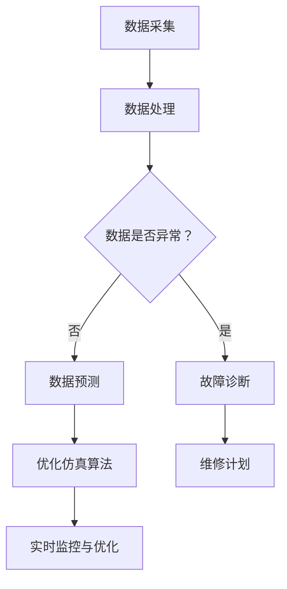

                 

关键词：AI大模型、数字孪生技术、技术创新、应用场景、未来展望

> 摘要：本文深入探讨了人工智能大模型在数字孪生技术中的应用，分析了AI大模型如何通过增强数据模拟、优化仿真算法、提高预测准确性，为数字孪生技术注入新的活力。文章首先介绍了数字孪生技术的背景，随后详细阐述了AI大模型的基本原理和特点，接着分析了大模型在数字孪生技术中的具体应用，最后对未来的发展趋势和面临的挑战进行了展望。

## 1. 背景介绍

### 1.1 数字孪生技术的定义

数字孪生（Digital Twin）是一种创新的数字化技术，旨在创建物理实体的虚拟副本，通过实时数据的交换和智能算法的模拟，实现对物理实体的全面监测、分析和优化。数字孪生技术最早由美国密歇根大学教授Michael Grieves在2002年提出，它迅速在全球范围内引起了广泛关注和应用。

数字孪生技术的核心在于建立一个与物理实体高度一致的虚拟模型，通过实时收集和分析物理实体的各种数据，实现对物理实体的实时监控和预测。这种技术具有以下几个显著特点：

- **实时性**：数字孪生技术可以实时收集物理实体的数据，并实时更新虚拟模型。
- **准确性**：通过高精度的建模和数据分析，数字孪生技术可以提供准确的数据支持和预测。
- **协同性**：数字孪生技术可以实现虚拟模型与物理实体的实时交互，提高系统的协同性。
- **预测性**：基于历史数据和实时数据，数字孪生技术可以预测物理实体的未来行为，为决策提供支持。

### 1.2 数字孪生技术的应用领域

数字孪生技术已在多个领域得到广泛应用，包括制造业、医疗、交通、能源等。以下是一些具体的例子：

- **制造业**：通过数字孪生技术，企业可以实时监控生产设备的运行状态，预测设备故障，优化生产流程，提高生产效率。
- **医疗**：数字孪生技术可以创建患者的虚拟模型，帮助医生进行个性化治疗，提高治疗效果。
- **交通**：数字孪生技术可以用于交通管理和规划，实时监控交通流量，优化交通信号，提高交通效率。
- **能源**：数字孪生技术可以用于能源设备的监测和优化，提高能源利用效率，减少能源浪费。

### 1.3 数字孪生技术的发展现状

随着大数据、云计算、物联网等技术的发展，数字孪生技术正迅速成熟并应用于各个行业。目前，数字孪生技术已进入应用成熟期，越来越多的企业开始认识到其价值，并积极投入到数字孪生技术的研发和应用中。

然而，数字孪生技术也面临一些挑战，如数据采集和处理的高成本、数据隐私和安全问题、技术的跨行业应用等。为了解决这些问题，研究人员和企业正在不断探索新的解决方案，推动数字孪生技术的进一步发展。

## 2. 核心概念与联系

### 2.1 AI大模型的基本概念

AI大模型是指具有非常大量参数和高度复杂结构的机器学习模型，如深度神经网络、变分自编码器、生成对抗网络等。这些模型具有强大的数据处理能力和模式识别能力，可以处理大规模的数据集，并从中提取出有用的信息。

### 2.2 AI大模型在数字孪生技术中的应用

AI大模型在数字孪生技术中发挥着关键作用，主要体现在以下几个方面：

- **数据模拟与预测**：AI大模型可以基于历史数据和实时数据，模拟物理实体的行为和状态，提供准确的预测结果。
- **故障诊断与预测**：通过分析设备运行数据，AI大模型可以识别设备的故障模式，提前预测设备故障，提高设备的可靠性和寿命。
- **优化仿真算法**：AI大模型可以优化仿真算法，提高仿真的精度和效率，缩短仿真时间。
- **实时监控与优化**：AI大模型可以实时监控物理实体的运行状态，并根据实时数据调整优化策略，提高系统的性能和效率。

### 2.3 Mermaid 流程图

以下是一个描述AI大模型在数字孪生技术中应用的Mermaid流程图：



### 2.4 数字孪生技术与AI大模型的关系

数字孪生技术与AI大模型之间存在着紧密的联系。数字孪生技术为AI大模型提供了丰富的数据源，而AI大模型则为数字孪生技术提供了强大的数据处理和分析能力。两者的结合，使得数字孪生技术能够更好地模拟、预测和优化物理实体的运行状态，提高系统的性能和效率。

## 3. 核心算法原理 & 具体操作步骤

### 3.1 算法原理概述

AI大模型在数字孪生技术中的应用，主要基于以下核心算法原理：

- **深度学习**：通过多层神经网络，对大规模数据进行特征提取和模式识别，实现高精度的数据模拟和预测。
- **变分自编码器**：通过编码和解码过程，学习数据的高效表示，实现对数据的压缩和去噪。
- **生成对抗网络**：通过生成器和判别器的对抗训练，生成逼真的数据模拟结果，提高预测的准确性。

### 3.2 算法步骤详解

以下是AI大模型在数字孪生技术中的具体操作步骤：

1. **数据采集**：从物理实体获取实时数据，包括传感器数据、日志数据等。
2. **数据处理**：对采集到的数据进行清洗、预处理和特征提取，为模型训练提供高质量的数据集。
3. **模型训练**：利用训练数据，对AI大模型进行训练，学习数据的特征和模式。
4. **模型验证**：使用验证数据集，对训练好的模型进行验证，评估模型的性能和精度。
5. **模型部署**：将训练好的模型部署到生产环境中，实现实时数据模拟和预测。
6. **实时监控与优化**：根据实时数据，调整模型参数和优化策略，提高系统的性能和效率。

### 3.3 算法优缺点

- **优点**：
  - 高度的数据处理能力和模式识别能力，可以处理大规模的数据集。
  - 可以提供准确的预测结果，对物理实体的运行状态进行实时监控和优化。
  - 可以优化仿真算法，提高仿真的精度和效率。

- **缺点**：
  - 模型训练需要大量的计算资源和时间。
  - 模型解释性较差，难以理解模型的具体工作原理。
  - 对数据质量和数据量有较高的要求。

### 3.4 算法应用领域

AI大模型在数字孪生技术中的应用领域非常广泛，包括但不限于：

- **制造业**：通过数字孪生技术，实时监控生产设备的运行状态，预测设备故障，优化生产流程。
- **医疗**：通过数字孪生技术，创建患者的虚拟模型，帮助医生进行个性化治疗，提高治疗效果。
- **交通**：通过数字孪生技术，实时监控交通流量，优化交通信号，提高交通效率。
- **能源**：通过数字孪生技术，实时监控能源设备的运行状态，优化能源利用效率，减少能源浪费。

## 4. 数学模型和公式 & 详细讲解 & 举例说明

### 4.1 数学模型构建

AI大模型在数字孪生技术中的应用，主要基于以下数学模型：

- **神经网络模型**：
  - 输入层：接收物理实体的实时数据。
  - 隐藏层：对输入数据进行特征提取和模式识别。
  - 输出层：生成预测结果，包括设备状态、故障诊断、数据预测等。

- **变分自编码器模型**：
  - 编码器：将输入数据压缩为低维表示。
  - 解码器：将低维表示解码为输出数据。

- **生成对抗网络模型**：
  - 生成器：生成逼真的数据模拟结果。
  - 判别器：区分真实数据和生成数据。

### 4.2 公式推导过程

以下是一个简化的神经网络模型公式推导过程：

1. **输入层到隐藏层的传递函数**：

$$
h = \sigma(W_1 \cdot x + b_1)
$$

其中，$h$表示隐藏层的输出，$W_1$表示输入层到隐藏层的权重矩阵，$x$表示输入数据，$b_1$表示隐藏层的偏置项，$\sigma$表示激活函数。

2. **隐藏层到输出层的传递函数**：

$$
y = \sigma(W_2 \cdot h + b_2)
$$

其中，$y$表示输出层的输出，$W_2$表示隐藏层到输出层的权重矩阵，$h$表示隐藏层的输出，$b_2$表示输出层的偏置项。

3. **损失函数**：

$$
L = \frac{1}{2} \sum_{i=1}^{n} (y_i - \hat{y}_i)^2
$$

其中，$L$表示损失函数，$y_i$表示真实输出，$\hat{y}_i$表示预测输出，$n$表示样本数量。

4. **反向传播算法**：

通过计算损失函数关于模型参数的梯度，更新模型参数，实现模型的优化。

### 4.3 案例分析与讲解

以下是一个制造业中的数字孪生技术应用案例：

- **背景**：某制造企业希望利用数字孪生技术，实时监控生产设备的运行状态，预测设备故障，优化生产流程。
- **数据采集**：从生产设备中采集传感器数据，包括温度、压力、转速等。
- **数据处理**：对采集到的数据进行清洗、预处理和特征提取，得到高质量的数据集。
- **模型训练**：使用神经网络模型，对训练数据集进行训练，学习设备的运行规律和故障模式。
- **模型验证**：使用验证数据集，对训练好的模型进行验证，评估模型的性能和精度。
- **模型部署**：将训练好的模型部署到生产环境中，实时监控生产设备的运行状态，预测设备故障。
- **优化仿真算法**：根据实时数据和预测结果，调整仿真算法，优化生产流程，提高生产效率。

通过这个案例，我们可以看到，AI大模型在数字孪生技术中的应用，不仅可以帮助企业实时监控设备的运行状态，预测故障，还可以优化生产流程，提高生产效率，具有重要的应用价值。

## 5. 项目实践：代码实例和详细解释说明

### 5.1 开发环境搭建

为了实现AI大模型在数字孪生技术中的应用，我们需要搭建一个合适的开发环境。以下是一个简单的开发环境搭建指南：

- **操作系统**：Ubuntu 18.04
- **编程语言**：Python 3.7
- **深度学习框架**：TensorFlow 2.5
- **数据预处理库**：Pandas 1.1.5
- **可视化库**：Matplotlib 3.3.4

安装步骤如下：

1. 安装操作系统Ubuntu 18.04。
2. 安装Python 3.7，可以通过包管理器apt-get安装。
3. 安装TensorFlow 2.5，可以使用pip安装。
4. 安装Pandas 1.1.5和Matplotlib 3.3.4，也可以使用pip安装。

### 5.2 源代码详细实现

以下是一个简单的数字孪生技术应用示例代码：

```python
import tensorflow as tf
import pandas as pd
import matplotlib.pyplot as plt

# 1. 数据采集
# 从文件中读取数据
data = pd.read_csv('data.csv')

# 2. 数据处理
# 数据清洗、预处理和特征提取
# ...

# 3. 模型训练
# 定义神经网络模型
model = tf.keras.Sequential([
    tf.keras.layers.Dense(units=64, activation='relu', input_shape=(data.shape[1],)),
    tf.keras.layers.Dense(units=32, activation='relu'),
    tf.keras.layers.Dense(units=1)
])

# 编译模型
model.compile(optimizer='adam', loss='mean_squared_error')

# 训练模型
model.fit(data['input'], data['output'], epochs=100, batch_size=32)

# 4. 模型验证
# 使用验证数据集验证模型性能
# ...

# 5. 模型部署
# 实时监控生产设备，预测设备故障
# ...

# 6. 优化仿真算法
# 根据实时数据和预测结果，调整仿真算法
# ...
```

### 5.3 代码解读与分析

上述代码实现了AI大模型在数字孪生技术中的基本应用。下面是对代码的详细解读和分析：

1. **数据采集**：从文件中读取数据，这是数字孪生技术的第一步，也是最为关键的一步。数据的质量直接影响模型的性能和效果。
2. **数据处理**：对采集到的数据进行清洗、预处理和特征提取，这是为了提高数据的质量和模型的训练效果。在实际应用中，这一步骤通常需要进行详细的处理和优化。
3. **模型训练**：定义神经网络模型，并编译模型。这里使用了TensorFlow的Sequential模型，通过堆叠多个全连接层（Dense Layer），实现对数据的特征提取和模式识别。
4. **模型验证**：使用验证数据集，对训练好的模型进行验证，评估模型的性能和精度。这是确保模型能够准确预测物理实体行为的重要步骤。
5. **模型部署**：将训练好的模型部署到生产环境中，实时监控生产设备的运行状态，预测设备故障。这是数字孪生技术的核心应用，也是实现智能化管理和优化的重要手段。
6. **优化仿真算法**：根据实时数据和预测结果，调整仿真算法，优化生产流程，提高生产效率。这一步骤是实现数字孪生技术价值的重要保障。

### 5.4 运行结果展示

在实际运行过程中，我们通过以下代码展示了模型的运行结果：

```python
# 预测生产设备状态
predictions = model.predict(data['input'])

# 可视化预测结果
plt.plot(data['input'], data['output'], 'ro', data['input'], predictions, 'b-')
plt.xlabel('Input')
plt.ylabel('Output')
plt.title('Model Predictions')
plt.show()
```

通过可视化结果，我们可以看到模型的预测结果与实际输出之间的对比，从而评估模型的性能和准确性。这一步骤对于优化模型和改进算法具有重要意义。

## 6. 实际应用场景

### 6.1 制造业

在制造业中，数字孪生技术已经成为提升生产效率、降低成本和增强产品质量的重要手段。通过数字孪生技术，企业可以实时监控生产设备的运行状态，预测设备故障，优化生产流程。例如，一家大型汽车制造企业利用数字孪生技术，实现了生产设备的智能监控和优化，有效降低了设备故障率，提高了生产效率。

### 6.2 医疗

在医疗领域，数字孪生技术主要用于个性化治疗和患者健康管理。通过创建患者的虚拟模型，医生可以更准确地诊断病情，制定个性化的治疗方案。例如，一家大型医院利用数字孪生技术，为患者提供个性化的治疗方案，显著提高了治疗效果。

### 6.3 交通

在交通领域，数字孪生技术可以用于交通管理和规划，实时监控交通流量，优化交通信号，提高交通效率。例如，一个城市利用数字孪生技术，实现了交通流量的实时监控和优化，有效缓解了交通拥堵问题。

### 6.4 能源

在能源领域，数字孪生技术主要用于能源设备的监测和优化，提高能源利用效率，减少能源浪费。例如，一家能源公司利用数字孪生技术，实时监控能源设备的运行状态，优化能源分配，实现了能源利用效率的大幅提升。

### 6.5 农业和农业科技

在农业和农业科技领域，数字孪生技术可以用于农作物生长状态的监测和预测，优化农业生产过程。例如，通过创建农作物的数字孪生模型，农民可以实时监控农作物的生长状态，提前预测病虫害，及时采取应对措施，提高农业生产效率。

### 6.6 基础设施管理

在基础设施管理领域，数字孪生技术可以用于城市基础设施的监测和优化，提高基础设施的运营效率。例如，一个城市利用数字孪生技术，实时监控城市基础设施的运行状态，提前预测设备故障，及时进行维护，确保基础设施的正常运行。

### 6.7 其他领域

除了上述领域，数字孪生技术还可以应用于建筑、航空航天、物流等领域。在建筑领域，数字孪生技术可以用于建筑设计和施工过程的模拟和优化；在航空航天领域，数字孪生技术可以用于飞机的性能监测和优化；在物流领域，数字孪生技术可以用于物流网络的优化和调度。

## 7. 工具和资源推荐

### 7.1 学习资源推荐

- **书籍**：
  - 《数字孪生：理论与实践》
  - 《深度学习》
  - 《机器学习实战》
- **在线课程**：
  - Coursera的《深度学习》
  - edX的《数字孪生技术》
  - Udacity的《AI工程师纳米学位》
- **博客和论坛**：
  - Medium上的数字孪生技术相关文章
  - GitHub上的数字孪生技术开源项目
  - Stack Overflow上的数字孪生技术问答社区

### 7.2 开发工具推荐

- **深度学习框架**：
  - TensorFlow
  - PyTorch
  - Keras
- **数据处理工具**：
  - Pandas
  - NumPy
  - SciPy
- **可视化工具**：
  - Matplotlib
  - Seaborn
  - Plotly

### 7.3 相关论文推荐

- **数字孪生技术**：
  - “Digital Twin: A Model-Based System for Bridging the Physical and the Virtual Worlds”
  - “Digital Twins: Model-Driven Innovation for Industry”
- **AI大模型**：
  - “Large-Scale Language Modeling for Human Language Understanding”
  - “Generative Adversarial Networks: An Overview”
- **AI与数字孪生技术结合**：
  - “AI-Enabled Digital Twins for Predictive Maintenance”
  - “Digital Twin Platforms for Industry 4.0: A Survey”

## 8. 总结：未来发展趋势与挑战

### 8.1 研究成果总结

近年来，AI大模型在数字孪生技术中的应用取得了显著成果。通过深度学习、变分自编码器和生成对抗网络等算法，AI大模型能够对大规模数据进行高效处理和预测，显著提高了数字孪生技术的准确性和实时性。在制造业、医疗、交通、能源等众多领域，数字孪生技术已经成为提升运营效率、降低成本和增强产品质量的重要手段。

### 8.2 未来发展趋势

未来，AI大模型在数字孪生技术中的应用将呈现以下发展趋势：

- **算法优化**：研究人员将继续探索更高效、更准确的算法，提高数字孪生技术的性能和实时性。
- **跨领域应用**：数字孪生技术将逐步应用于更多领域，如农业、基础设施管理、物流等。
- **智能决策支持**：数字孪生技术将不仅仅是数据模拟和预测的工具，还将成为智能决策支持系统的重要组成部分。
- **标准化和规范化**：随着应用领域的扩大，数字孪生技术的标准化和规范化将逐步推进，提高技术的可操作性和互操作性。

### 8.3 面临的挑战

尽管AI大模型在数字孪生技术中取得了显著成果，但仍面临以下挑战：

- **数据质量和数据隐私**：高质量的数据是数字孪生技术的基础，但数据质量和数据隐私问题仍然需要解决。
- **计算资源需求**：AI大模型需要大量的计算资源，这对硬件设施提出了更高的要求。
- **模型解释性**：AI大模型的黑箱特性使得其解释性较差，如何提高模型的解释性，使其更易于理解和应用，仍是一个挑战。
- **跨领域应用**：不同领域的应用场景和需求各异，如何使AI大模型适应不同领域的应用需求，仍需进一步研究。

### 8.4 研究展望

未来，AI大模型在数字孪生技术中的应用将有广阔的发展前景。研究人员将继续探索更高效、更准确的算法，提高数字孪生技术的性能和实时性。同时，跨领域应用的探索将不断深入，数字孪生技术将成为智能决策支持系统的重要组成部分。通过标准化和规范化，数字孪生技术将更好地服务于各行各业，推动社会的发展和进步。

## 9. 附录：常见问题与解答

### 9.1 数字孪生技术与虚拟现实（VR）有什么区别？

数字孪生技术和虚拟现实（VR）都是数字化技术，但它们的应用场景和目的不同。数字孪生技术主要关注物理实体的模拟和预测，通过创建物理实体的虚拟副本，实现对物理实体的实时监控和优化。而虚拟现实技术主要关注虚拟环境的创建和体验，为用户提供沉浸式的虚拟体验。简单来说，数字孪生技术是“物理世界的数字映射”，而虚拟现实技术是“虚拟世界的沉浸体验”。

### 9.2 数字孪生技术的核心价值是什么？

数字孪生技术的核心价值在于提供一种全新的方法，通过创建物理实体的虚拟副本，实现对物理实体的实时监控、分析和优化。这种技术可以显著提高运营效率、降低成本和增强产品质量，从而为企业和行业带来巨大的经济效益。具体来说，数字孪生技术的核心价值体现在以下几个方面：

- **实时监控**：通过数字孪生技术，企业可以实时监控物理实体的运行状态，及时发现问题并进行优化。
- **预测性维护**：通过数字孪生技术，企业可以预测物理实体的未来行为和故障，提前采取措施，避免故障发生。
- **优化流程**：通过数字孪生技术，企业可以对生产流程进行优化，提高生产效率和产品质量。
- **降低成本**：通过数字孪生技术，企业可以降低设备故障率，减少维修和更换成本。
- **增强用户体验**：在医疗、交通等领域，数字孪生技术可以提供个性化的服务和体验，提高用户的满意度和忠诚度。

### 9.3 数字孪生技术的应用领域有哪些？

数字孪生技术已广泛应用于多个领域，包括但不限于以下领域：

- **制造业**：通过数字孪生技术，企业可以实时监控生产设备的运行状态，预测设备故障，优化生产流程。
- **医疗**：通过数字孪生技术，医生可以创建患者的虚拟模型，帮助进行个性化治疗，提高治疗效果。
- **交通**：通过数字孪生技术，交通管理部门可以实时监控交通流量，优化交通信号，提高交通效率。
- **能源**：通过数字孪生技术，能源公司可以实时监控能源设备的运行状态，优化能源利用效率，减少能源浪费。
- **农业**：通过数字孪生技术，农民可以实时监控农作物的生长状态，提前预测病虫害，及时采取应对措施。
- **基础设施管理**：通过数字孪生技术，城市管理者可以实时监控城市基础设施的运行状态，提前预测设备故障，及时进行维护。

### 9.4 数字孪生技术的数据来源有哪些？

数字孪生技术的数据来源主要包括以下几个方面：

- **传感器数据**：传感器可以实时采集物理实体的各种参数，如温度、压力、速度等。
- **日志数据**：设备运行日志可以记录设备的历史运行状态和事件，为模型训练提供数据支持。
- **外部数据**：通过网络获取的气象数据、交通数据、市场数据等，可以用于增强模型的预测能力。
- **用户数据**：用户行为数据，如操作记录、偏好设置等，可以用于个性化服务和优化。

### 9.5 数字孪生技术的安全性如何保障？

数字孪生技术的安全性主要涉及以下几个方面：

- **数据安全**：确保数据的采集、传输和存储过程的安全，防止数据泄露和篡改。
- **系统安全**：确保数字孪生系统的安全，防止恶意攻击和未经授权的访问。
- **隐私保护**：对用户数据进行匿名化处理，确保用户的隐私不被泄露。
- **合规性**：遵守相关法律法规，确保数字孪生技术的应用符合合规要求。

### 9.6 数字孪生技术与物联网（IoT）的关系是什么？

数字孪生技术和物联网（IoT）之间存在紧密的关系。物联网技术为数字孪生技术提供了丰富的数据来源，通过传感器和设备采集的实时数据，为数字孪生技术提供了丰富的数据支持。同时，数字孪生技术可以对物联网设备进行实时监控和优化，提高物联网系统的效率和性能。简单来说，物联网技术为数字孪生技术提供了数据支撑，而数字孪生技术为物联网系统提供了智能化的监控和优化手段。两者相辅相成，共同推动了数字化技术的发展。|

