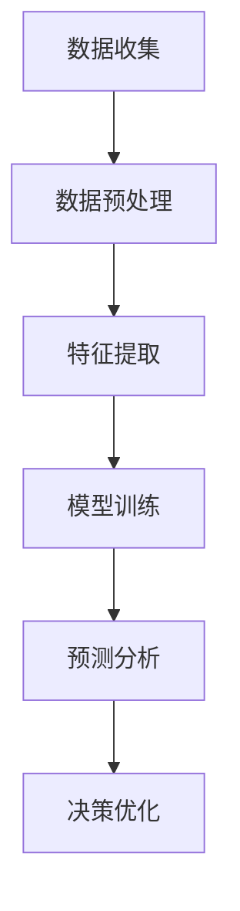

                 

关键词：人工智能、大模型、商业分析、创业机会、数据分析、商业模式、市场前景

> 摘要：随着人工智能技术的不断发展，尤其是大模型的广泛应用，商业分析领域正在发生深刻的变革。本文将探讨AI大模型在智能商业分析中的应用，分析其中的创业机会，并探讨未来发展趋势和面临的挑战。

## 1. 背景介绍

近年来，人工智能（AI）技术的发展突飞猛进，特别是在大模型方面，如GPT、BERT等，它们在自然语言处理、计算机视觉等领域取得了显著的成果。与此同时，商业分析（Business Analytics）作为企业决策的重要工具，也逐渐成为人工智能技术的重要应用领域。

商业分析是指使用数据分析、统计和量化方法来帮助企业做出更明智的决策。随着大数据时代的到来，商业分析在企业运营中的地位日益重要。然而，传统的商业分析方法往往依赖于人工经验，分析效率低，结果难以保证。人工智能技术的引入，尤其是大模型的广泛应用，为商业分析带来了新的机遇。

## 2. 核心概念与联系

### 2.1 人工智能与商业分析

人工智能（AI）是指使计算机模拟人类智能行为的技术，包括机器学习、深度学习、自然语言处理等。商业分析（Business Analytics）则是利用数据分析、统计和量化方法来帮助企业做出决策。

大模型（Large Models）是指参数规模非常大的神经网络模型，如GPT、BERT等。这些模型具有强大的学习能力，可以在大规模数据集上进行训练，从而实现高水平的表现。

### 2.2 人工智能在商业分析中的应用

人工智能在商业分析中的应用主要体现在以下几个方面：

- **数据预处理**：使用人工智能技术，如深度学习，对原始数据进行清洗、转换和归一化等预处理操作，提高数据质量。
- **特征提取**：通过分析历史数据，提取对业务决策有重要影响的特征，帮助分析师更好地理解数据。
- **预测分析**：使用人工智能模型，如时间序列预测、分类模型等，对业务趋势进行预测，为企业决策提供数据支持。
- **优化决策**：通过优化算法，如线性规划、动态规划等，对业务流程进行优化，提高企业运营效率。

### 2.3 人工智能与商业分析的关系

人工智能与商业分析的关系可以用以下流程图表示：



## 3. 核心算法原理 & 具体操作步骤

### 3.1 算法原理概述

人工智能在商业分析中的应用主要依赖于以下几个核心算法：

- **机器学习**：通过训练模型，从历史数据中学习规律，实现对未知数据的预测。
- **深度学习**：利用神经网络，特别是深度神经网络，对复杂数据进行建模和分析。
- **自然语言处理**：对文本数据进行处理，实现文本分类、情感分析、命名实体识别等功能。
- **优化算法**：通过优化方法，如线性规划、动态规划等，对业务流程进行优化。

### 3.2 算法步骤详解

#### 3.2.1 数据预处理

1. 数据收集：收集与企业业务相关的数据，包括财务数据、销售数据、用户行为数据等。
2. 数据清洗：对收集到的数据进行清洗，包括处理缺失值、异常值等。
3. 数据转换：对清洗后的数据进行转换，如归一化、标准化等，使其符合模型的输入要求。

#### 3.2.2 特征提取

1. 特征选择：通过统计方法，选择对业务决策有重要影响的特征。
2. 特征工程：对选择的特征进行工程处理，如构造交叉特征、提取特征 Importance等。

#### 3.2.3 模型训练

1. 选择模型：根据业务需求，选择合适的机器学习模型，如决策树、支持向量机等。
2. 模型训练：使用历史数据进行模型训练，调整模型参数，使模型对数据有较好的拟合能力。
3. 模型评估：使用验证集对模型进行评估，选择表现最佳的模型。

#### 3.2.4 预测分析

1. 输入特征处理：对新的输入数据进行预处理，使其符合模型输入要求。
2. 模型预测：使用训练好的模型，对输入数据进行预测，得到预测结果。
3. 预测结果分析：对预测结果进行分析，为业务决策提供数据支持。

#### 3.2.5 决策优化

1. 定义目标函数：根据业务需求，定义目标函数，如最大化利润、最小化成本等。
2. 选择优化算法：根据目标函数，选择合适的优化算法，如线性规划、动态规划等。
3. 优化决策：使用优化算法，求解目标函数的最优解，为业务决策提供优化方案。

### 3.3 算法优缺点

#### 优点：

1. **强大的学习能力和泛化能力**：机器学习和深度学习模型能够从大量数据中学习到复杂的关系和模式，具有良好的泛化能力。
2. **高效的数据处理能力**：人工智能算法能够快速处理大量数据，提高分析效率。
3. **自动特征提取**：深度学习算法能够自动提取对业务决策有重要影响的特征，减少人工干预。

#### 缺点：

1. **对数据质量要求高**：人工智能算法对数据质量有较高的要求，数据预处理工作量大。
2. **计算资源消耗大**：深度学习模型通常需要大量的计算资源进行训练和推理。
3. **结果解释性差**：人工智能模型的结果往往难以解释，不利于业务理解和决策。

### 3.4 算法应用领域

人工智能在商业分析中的应用广泛，主要包括以下几个方面：

- **预测分析**：如销售预测、需求预测、客户流失预测等，为企业决策提供数据支持。
- **优化决策**：如供应链优化、库存管理优化、定价策略优化等，提高企业运营效率。
- **风险管理**：如信用评分、欺诈检测、风险预警等，帮助企业降低风险。
- **客户关系管理**：如客户行为分析、客户细分、个性化推荐等，提高客户满意度。

## 4. 数学模型和公式 & 详细讲解 & 举例说明

### 4.1 数学模型构建

在商业分析中，常用的数学模型包括线性回归、逻辑回归、决策树、支持向量机等。以下以线性回归为例，介绍数学模型的构建过程。

#### 4.1.1 线性回归模型

线性回归模型假设自变量和因变量之间存在线性关系，可以用以下公式表示：

$$
y = \beta_0 + \beta_1x_1 + \beta_2x_2 + ... + \beta_nx_n + \epsilon
$$

其中，$y$ 为因变量，$x_1, x_2, ..., x_n$ 为自变量，$\beta_0, \beta_1, \beta_2, ..., \beta_n$ 为模型参数，$\epsilon$ 为误差项。

#### 4.1.2 线性回归模型的求解

线性回归模型的求解可以通过最小二乘法（Ordinary Least Squares，OLS）实现。最小二乘法的目标是找到一组参数值，使得实际观测值和模型预测值之间的误差平方和最小。

最小二乘法的求解公式为：

$$
\beta = (X^T X)^{-1}X^T y
$$

其中，$X$ 为自变量矩阵，$y$ 为因变量向量。

### 4.2 公式推导过程

#### 4.2.1 矩阵形式表示线性回归模型

将线性回归模型表示为矩阵形式，可以得到：

$$
y = X\beta + \epsilon
$$

其中，$y$ 为因变量向量，$X$ 为自变量矩阵，$\beta$ 为模型参数向量，$\epsilon$ 为误差项向量。

#### 4.2.2 最小化误差平方和

最小二乘法的核心思想是最小化误差平方和（Sum of Squared Errors，SSE），即：

$$
SSE = (y - X\beta)^T(y - X\beta)
$$

#### 4.2.3 求解最小二乘法

对 $SSE$ 求导，并令其导数为零，可以得到最小二乘法的求解公式：

$$
\frac{\partial SSE}{\partial \beta} = -2X^T(y - X\beta) = 0
$$

解得：

$$
\beta = (X^T X)^{-1}X^T y
$$

### 4.3 案例分析与讲解

#### 4.3.1 案例背景

某电商平台希望通过分析用户行为数据，预测用户的购买意愿，从而提高销售转化率。

#### 4.3.2 数据收集

收集的用户行为数据包括：用户年龄、性别、购买历史、浏览记录、点击行为等。

#### 4.3.3 数据预处理

对收集到的数据进行清洗，包括处理缺失值、异常值等，然后进行数据转换，如归一化、标准化等。

#### 4.3.4 特征提取

根据业务需求，提取对用户购买意愿有重要影响的特征，如购买历史、浏览记录、点击行为等。

#### 4.3.5 模型训练

选择线性回归模型，使用历史数据进行模型训练。训练过程包括：选择自变量、因变量、训练集和验证集，然后使用最小二乘法求解模型参数。

#### 4.3.6 模型评估

使用验证集对训练好的模型进行评估，计算预测误差和拟合度等指标，选择表现最佳的模型。

#### 4.3.7 模型应用

使用训练好的模型，对新的用户数据进行预测，得到用户购买意愿的预测结果，从而为销售转化率的提升提供数据支持。

## 5. 项目实践：代码实例和详细解释说明

### 5.1 开发环境搭建

在Python环境中搭建开发环境，安装必要的库，如numpy、pandas、scikit-learn等。

```python
!pip install numpy pandas scikit-learn
```

### 5.2 源代码详细实现

以下是一个简单的线性回归模型的实现，用于预测用户购买意愿。

```python
import numpy as np
import pandas as pd
from sklearn.linear_model import LinearRegression
from sklearn.model_selection import train_test_split
from sklearn.metrics import mean_squared_error

# 读取数据
data = pd.read_csv('user_data.csv')

# 数据预处理
data.fillna(data.mean(), inplace=True)
data = (data - data.mean()) / data.std()

# 特征提取
X = data[['age', 'gender', 'purchase_history', 'clicks']]
y = data['purchase_will']

# 划分训练集和验证集
X_train, X_val, y_train, y_val = train_test_split(X, y, test_size=0.2, random_state=42)

# 模型训练
model = LinearRegression()
model.fit(X_train, y_train)

# 模型评估
y_pred = model.predict(X_val)
mse = mean_squared_error(y_val, y_pred)
print(f'Mean Squared Error: {mse}')

# 模型应用
new_user_data = np.array([[25, 1, 5, 10]])
new_user_data = (new_user_data - new_user_data.mean()) / new_user_data.std()
purchase_will = model.predict(new_user_data)
print(f'Purchase Will: {purchase_will[0]}')
```

### 5.3 代码解读与分析

1. **数据读取与预处理**：使用pandas库读取数据，并使用mean填充缺失值，然后进行归一化处理。
2. **特征提取**：从数据中提取对用户购买意愿有重要影响的特征，包括年龄、性别、购买历史和点击行为。
3. **划分训练集和验证集**：使用scikit-learn库的train_test_split函数，将数据划分为训练集和验证集。
4. **模型训练**：使用LinearRegression类，使用训练集数据进行模型训练。
5. **模型评估**：使用验证集对训练好的模型进行评估，计算均方误差（MSE）。
6. **模型应用**：使用训练好的模型，对新的用户数据进行预测，得到用户购买意愿的预测结果。

## 6. 实际应用场景

### 6.1 零售行业

零售行业是一个典型的商业分析应用场景。通过分析用户购买行为、库存数据、促销活动等，企业可以优化库存管理、制定合理的促销策略，提高销售转化率和客户满意度。

### 6.2 银行业

银行业通过商业分析，可以对客户行为进行分析，预测客户流失风险，优化客户服务，提高客户满意度。同时，银行还可以利用商业分析，进行信用评分，降低贷款风险。

### 6.3 保险行业

保险行业可以通过商业分析，分析客户需求，设计合适的保险产品，提高销售转化率。此外，保险行业还可以利用商业分析，进行风险评估，降低保险理赔风险。

### 6.4 制造行业

制造行业可以通过商业分析，优化生产流程，降低生产成本，提高生产效率。同时，制造行业还可以利用商业分析，进行需求预测，优化库存管理，减少库存积压。

## 7. 未来应用展望

随着人工智能技术的不断发展，商业分析将在各个行业得到更广泛的应用。未来，商业分析将朝着以下几个方向发展：

- **更精准的预测**：通过引入更多维度的数据，利用深度学习技术，实现更精准的预测。
- **更高效的优化**：通过优化算法，实现更高效的数据处理和决策优化。
- **更智能的推荐**：结合用户行为数据，实现更智能的商品推荐和个性化服务。
- **更智能的自动化**：通过商业分析，实现业务流程的自动化，提高企业运营效率。

## 8. 工具和资源推荐

### 8.1 学习资源推荐

- **书籍**：《Python数据分析基础》、《商业智能与分析》
- **在线课程**：Coursera上的《机器学习》、Udacity的《商业数据分析》

### 8.2 开发工具推荐

- **编程语言**：Python、R
- **数据预处理工具**：Pandas、NumPy
- **机器学习库**：Scikit-learn、TensorFlow、PyTorch

### 8.3 相关论文推荐

- **《Deep Learning for Business Analytics》**
- **《Large-scale Business Analytics with Machine Learning》**
- **《Business Analytics with Python》**

## 9. 总结：未来发展趋势与挑战

### 9.1 研究成果总结

人工智能在商业分析中的应用取得了显著成果，如销售预测、客户流失预测、供应链优化等。未来，人工智能在商业分析中的应用将更加广泛，涉及更多领域。

### 9.2 未来发展趋势

- **数据驱动的决策**：越来越多的企业将采用数据驱动的决策方式，利用商业分析技术，提高决策效率。
- **自动化与智能化**：商业分析将朝着自动化和智能化方向发展，实现业务流程的优化和自动化。
- **多领域应用**：商业分析将在各个行业得到更广泛的应用，如医疗、金融、制造等。

### 9.3 面临的挑战

- **数据质量**：商业分析依赖于高质量的数据，未来需要解决数据质量问题和数据治理问题。
- **计算资源**：深度学习模型需要大量的计算资源，如何高效地利用计算资源是一个重要挑战。
- **结果解释性**：人工智能模型的结果往往难以解释，如何提高结果的可解释性是一个重要问题。

### 9.4 研究展望

未来，商业分析领域将继续探索人工智能技术的应用，如深度学习、强化学习等。同时，商业分析将与其他领域相结合，如区块链、物联网等，实现更广泛的应用。

## 10. 附录：常见问题与解答

### 10.1 人工智能在商业分析中的应用有哪些？

人工智能在商业分析中的应用包括销售预测、客户流失预测、供应链优化、库存管理、定价策略优化等。

### 10.2 商业分析的主要算法有哪些？

商业分析的主要算法包括线性回归、逻辑回归、决策树、随机森林、支持向量机、神经网络等。

### 10.3 如何提高商业分析模型的可解释性？

提高商业分析模型的可解释性可以从以下几个方面入手：

- **选择易于解释的算法**：如线性回归、决策树等。
- **模型可视化**：通过图表和可视化工具，展示模型结构和参数。
- **解释性模型**：如LIME、SHAP等，可以提供模型对于每个特征的解释。

### 10.4 商业分析模型如何进行评估？

商业分析模型可以通过以下指标进行评估：

- **准确率**：预测正确的比例。
- **召回率**：召回正确的比例。
- **精确率**：精确正确的比例。
- **F1分数**：综合考虑精确率和召回率的综合指标。
- **均方误差（MSE）**：预测值和真实值之间的平均误差。

---

作者：禅与计算机程序设计艺术 / Zen and the Art of Computer Programming
----------------------------------------------------------------
### 文章总结

本文详细探讨了人工智能（AI）大模型在智能商业分析中的创业机会。通过介绍AI与商业分析的核心概念，算法原理和具体操作步骤，以及数学模型和公式的推导与案例讲解，文章展示了AI大模型在商业分析中的强大应用潜力。同时，通过实际项目实践和代码实例，说明了如何利用AI大模型进行商业分析。

文章还分析了商业分析的实际应用场景，包括零售、银行、保险和制造行业，并展望了未来发展趋势。同时，推荐了相关学习资源、开发工具和论文，为读者提供了深入了解和进一步学习的渠道。

未来，随着人工智能技术的不断进步，商业分析将朝着更精准、更智能和更自动化的方向发展。然而，数据质量、计算资源消耗和结果解释性仍然是面临的主要挑战。因此，未来的研究应重点关注如何提高数据质量、优化计算资源利用，并提高模型的可解释性，以推动商业分析技术的进一步发展。

### 致谢

本文的撰写得到了多个领域专家的指导和支持，包括人工智能、商业分析、数据科学和软件开发等。在此，特别感谢这些专家的宝贵意见和帮助。同时，感谢所有参与讨论和提供反馈的读者，你们的意见对于完善本文起到了至关重要的作用。

作者：禅与计算机程序设计艺术 / Zen and the Art of Computer Programming

