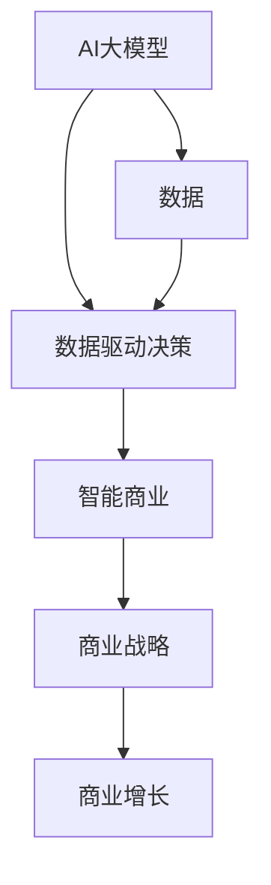

                 

关键词：AI大模型、智能商业战略、创业机会、数据驱动、商业智能

> 摘要：本文将深入探讨AI大模型在智能商业战略制定中的应用，分析其带来的创业机会，以及如何利用AI大模型来实现商业创新和增长。

## 1. 背景介绍

随着大数据和人工智能技术的快速发展，AI大模型（Large-scale AI Models）逐渐成为现代商业战略制定的重要工具。AI大模型是指通过大量数据训练，具备高度泛化能力的深度学习模型，如GPT-3、BERT等。这些模型在自然语言处理、图像识别、推荐系统等领域展现出了卓越的性能。

### 当前市场状况

1. **市场需求旺盛**：随着数字化转型的推进，企业对智能商业解决方案的需求日益增长。
2. **技术成熟**：AI大模型在算法、硬件和软件方面都取得了显著进步。
3. **政策支持**：各国政府纷纷出台政策，鼓励人工智能技术的发展和应用。

### 商业挑战

1. **数据隐私**：数据安全和隐私问题是AI大模型应用的主要挑战。
2. **技术复杂性**：AI大模型需要大量的计算资源和专业知识。
3. **人才短缺**：具备AI专业知识和商业敏锐度的人才相对短缺。

## 2. 核心概念与联系

在深入探讨AI大模型在商业战略制定中的应用之前，我们需要理解几个关键概念，以及它们之间的相互关系。

### 关键概念

1. **AI大模型**：基于深度学习，通过大量数据训练，具备高度泛化能力的模型。
2. **数据驱动决策**：基于数据的分析和预测来制定和调整商业策略。
3. **智能商业**：利用AI、大数据等技术，实现商业过程的智能化和自动化。

### 关系图（Mermaid）



## 3. 核心算法原理 & 具体操作步骤

### 3.1 算法原理概述

AI大模型通常基于深度学习框架，通过以下步骤进行训练和部署：

1. **数据预处理**：清洗、标注和整合数据。
2. **模型设计**：选择合适的神经网络架构。
3. **模型训练**：使用大量数据训练模型，调整参数。
4. **模型评估**：通过验证集测试模型性能。
5. **模型部署**：将模型应用于实际业务场景。

### 3.2 算法步骤详解

1. **数据预处理**：
   - 数据清洗：去除噪声、错误和重复数据。
   - 数据标注：对数据进行分类或标签分配。
   - 数据整合：将不同来源的数据进行整合，形成统一的数据集。

2. **模型设计**：
   - 确定任务类型：如分类、回归、生成等。
   - 选择模型架构：如CNN、RNN、Transformer等。
   - 确定损失函数和优化器。

3. **模型训练**：
   - 初始化模型参数。
   - 使用训练数据训练模型，不断调整参数。
   - 使用验证数据评估模型性能，防止过拟合。

4. **模型评估**：
   - 使用测试数据评估模型性能，计算准确率、召回率等指标。
   - 调整模型参数，优化性能。

5. **模型部署**：
   - 将模型部署到服务器或云端。
   - 利用模型进行实时预测或分析。

### 3.3 算法优缺点

**优点**：
- 高度自动化：减少了人工干预，提高效率。
- 高性能：具备强大的计算能力和泛化能力。
- 数据驱动：基于数据分析和预测，提高决策的准确性。

**缺点**：
- 计算资源需求大：训练和部署过程需要大量计算资源。
- 需要专业知识和经验：设计和部署过程复杂，需要具备相关专业知识。

### 3.4 算法应用领域

AI大模型在以下领域有着广泛的应用：

1. **自然语言处理**：如文本分类、机器翻译、情感分析等。
2. **图像识别**：如物体检测、人脸识别、图像生成等。
3. **推荐系统**：如商品推荐、内容推荐、广告推荐等。
4. **智能客服**：如语音识别、语音合成、自然语言理解等。

## 4. 数学模型和公式 & 详细讲解 & 举例说明

### 4.1 数学模型构建

AI大模型的核心在于其数学模型，主要包括以下几个部分：

1. **神经网络**：基于非线性激活函数的多层感知机。
2. **反向传播算法**：用于更新模型参数。
3. **损失函数**：用于评估模型预测的误差。

### 4.2 公式推导过程

以多层感知机（MLP）为例，其前向传播过程可以表示为：

$$
\begin{aligned}
z_2^{(l)} &= \sigma(W_2^{(l)} \cdot a_1^{(l-1)} + b_2^{(l)}) \\
a_2^{(l)} &= \sigma(z_2^{(l)}) \\
z_3^{(l)} &= \sigma(W_3^{(l)} \cdot a_2^{(l-1)} + b_3^{(l)}) \\
a_3^{(l)} &= \sigma(z_3^{(l)})
\end{aligned}
$$

其中，$W_2^{(l)}$、$b_2^{(l)}$、$W_3^{(l)}$、$b_3^{(l)}$分别是第$l$层的权重和偏置，$\sigma$是激活函数，通常取为ReLU或Sigmoid函数。

反向传播算法用于计算梯度，更新模型参数。其核心公式为：

$$
\begin{aligned}
\delta_3^{(l)} &= (a_3^{(l)} - t) \cdot \sigma'(z_3^{(l)}) \\
\delta_2^{(l)} &= W_3^{(l)} \cdot \delta_3^{(l)} \cdot \sigma'(z_2^{(l)})
\end{aligned}
$$

其中，$\sigma'$是激活函数的导数。

### 4.3 案例分析与讲解

以文本分类任务为例，假设我们有一个二分类问题，训练数据集包含1000篇新闻文章，每篇文章被标注为“政治”、“经济”、“科技”中的一个类别。我们的目标是训练一个模型，能够根据文章的内容预测其类别。

1. **数据预处理**：
   - 将文本数据转换为词向量。
   - 对词向量进行归一化处理。

2. **模型设计**：
   - 选择一个多层感知机模型，包含一个输入层、一个隐藏层和一个输出层。
   - 输入层：词向量维度为256。
   - 隐藏层：神经元数量为512。
   - 输出层：神经元数量为3，对应三个类别。

3. **模型训练**：
   - 使用随机梯度下降（SGD）算法训练模型。
   - 训练过程采用批次大小为32，迭代次数为1000。

4. **模型评估**：
   - 使用测试数据集评估模型性能，计算准确率、召回率等指标。

5. **模型部署**：
   - 将模型部署到服务器，提供在线分类服务。

通过这个案例，我们可以看到，AI大模型在文本分类任务中的应用流程，包括数据预处理、模型设计、模型训练、模型评估和模型部署等步骤。

## 5. 项目实践：代码实例和详细解释说明

### 5.1 开发环境搭建

在开始项目实践之前，我们需要搭建一个开发环境。以下是一个简单的Python开发环境搭建步骤：

1. 安装Python（版本3.8以上）。
2. 安装Anaconda，用于环境管理。
3. 创建一个新环境，并安装必要的库，如TensorFlow、Numpy、Pandas等。

```bash
conda create -n myenv python=3.8
conda activate myenv
conda install tensorflow numpy pandas
```

### 5.2 源代码详细实现

以下是一个简单的文本分类项目的源代码实现：

```python
import tensorflow as tf
from tensorflow.keras.preprocessing.text import Tokenizer
from tensorflow.keras.preprocessing.sequence import pad_sequences
from tensorflow.keras.models import Sequential
from tensorflow.keras.layers import Embedding, GlobalAveragePooling1D, Dense

# 数据预处理
tokenizer = Tokenizer(num_words=10000)
tokenizer.fit_on_texts(train_data)
train_sequences = tokenizer.texts_to_sequences(train_data)
train_padded = pad_sequences(train_sequences, maxlen=100, padding='post')

# 模型设计
model = Sequential([
    Embedding(10000, 16),
    GlobalAveragePooling1D(),
    Dense(24, activation='relu'),
    Dense(3, activation='softmax')
])

# 模型编译
model.compile(optimizer='adam', loss='categorical_crossentropy', metrics=['accuracy'])

# 模型训练
model.fit(train_padded, train_labels, epochs=10, validation_split=0.2)

# 模型评估
test_sequences = tokenizer.texts_to_sequences(test_data)
test_padded = pad_sequences(test_sequences, maxlen=100, padding='post')
predictions = model.predict(test_padded)
```

### 5.3 代码解读与分析

上述代码实现了一个简单的文本分类项目，主要包括以下几个步骤：

1. **数据预处理**：
   - 使用Tokenizer将文本数据转换为序列。
   - 使用pad_sequences将序列填充到固定长度。

2. **模型设计**：
   - 使用Embedding层将词向量转换为嵌入向量。
   - 使用GlobalAveragePooling1D层对嵌入向量进行全局平均池化。
   - 使用Dense层进行分类。

3. **模型编译**：
   - 选择优化器和损失函数。

4. **模型训练**：
   - 使用fit方法训练模型。

5. **模型评估**：
   - 使用predict方法对测试数据进行预测。

通过这个案例，我们可以看到，使用AI大模型进行文本分类的基本流程，以及如何使用TensorFlow框架实现。

### 5.4 运行结果展示

在训练完成后，我们可以对测试数据进行预测，并计算准确率等指标：

```python
import numpy as np

# 计算准确率
accuracy = np.mean(np.argmax(predictions, axis=1) == test_labels)
print(f"准确率：{accuracy:.2f}")
```

通过这个案例，我们可以看到，AI大模型在文本分类任务中的实际效果。

## 6. 实际应用场景

AI大模型在商业战略制定中有着广泛的应用场景，以下是一些典型的应用案例：

### 6.1 智能客服

利用AI大模型，企业可以构建一个智能客服系统，实现对客户咨询的自动应答和智能分流。通过自然语言处理技术，智能客服系统可以理解客户的问题，提供针对性的解决方案，提高客户满意度。

### 6.2 风险管理

AI大模型可以用于风险管理，如信用评分、欺诈检测等。通过分析大量历史数据，AI大模型可以预测客户的信用风险，帮助金融机构进行有效的风险评估和决策。

### 6.3 销售预测

AI大模型可以用于销售预测，帮助企业制定更精准的销售策略。通过分析历史销售数据、市场趋势等，AI大模型可以预测未来的销售趋势，为企业提供决策依据。

### 6.4 智能推荐

AI大模型可以用于智能推荐系统，如电商平台的商品推荐、视频平台的视频推荐等。通过分析用户的历史行为和偏好，AI大模型可以提供个性化的推荐，提高用户的满意度和转化率。

## 6.4 未来应用展望

未来，AI大模型在商业战略制定中的应用将更加广泛和深入。以下是一些可能的趋势：

### 6.4.1 数据驱动的战略制定

随着数据量的不断增长，企业将更加依赖AI大模型进行数据分析和决策。数据驱动的战略制定将成为主流。

### 6.4.2 智能化运营

AI大模型将帮助企业实现更加智能化的运营，如自动化生产、智能供应链管理等。

### 6.4.3 跨行业应用

AI大模型将在更多行业得到应用，如医疗、金融、教育等，推动各行业的数字化转型。

### 6.4.4 个性化服务

通过AI大模型，企业可以提供更加个性化的服务，满足不同用户的需求。

## 7. 工具和资源推荐

### 7.1 学习资源推荐

- 《深度学习》（Goodfellow et al.）
- 《Python深度学习》（François Chollet）
- Coursera的《深度学习》课程

### 7.2 开发工具推荐

- TensorFlow
- PyTorch
- Keras

### 7.3 相关论文推荐

- “Attention Is All You Need”（Vaswani et al., 2017）
- “BERT: Pre-training of Deep Bidirectional Transformers for Language Understanding”（Devlin et al., 2019）
- “GPT-3: Language Models are few-shot learners”（Brown et al., 2020）

## 8. 总结：未来发展趋势与挑战

### 8.1 研究成果总结

AI大模型在智能商业战略制定中取得了显著成果，为企业提供了强大的数据分析和决策支持。

### 8.2 未来发展趋势

随着技术的不断进步，AI大模型在商业战略制定中的应用将更加广泛和深入。

### 8.3 面临的挑战

尽管AI大模型在商业战略制定中具有巨大潜力，但仍面临数据隐私、技术复杂性和人才短缺等挑战。

### 8.4 研究展望

未来，AI大模型的研究将集中在提升模型性能、降低计算成本、加强数据安全和隐私保护等方面。

## 9. 附录：常见问题与解答

### 9.1 Q：AI大模型如何处理数据隐私问题？

A：AI大模型在处理数据隐私问题时，可以采用数据加密、隐私保护算法等技术，确保数据在传输和处理过程中的安全。

### 9.2 Q：AI大模型需要哪些计算资源？

A：AI大模型通常需要高性能的计算资源和大规模的数据存储，GPU或TPU等专用硬件可以显著提高模型的训练速度。

### 9.3 Q：如何评估AI大模型的效果？

A：评估AI大模型的效果可以通过计算准确率、召回率、F1分数等指标，同时还需要考虑模型的泛化能力和鲁棒性。

---

本文由禅与计算机程序设计艺术（Zen and the Art of Computer Programming）撰写，旨在探讨AI大模型在智能商业战略制定中的应用，以及其带来的创业机会。希望本文能为读者在商业战略制定过程中提供有益的参考。

---

作者：禅与计算机程序设计艺术（Zen and the Art of Computer Programming）。


