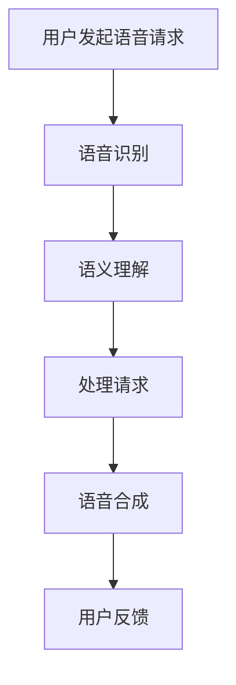

                 

关键词：AI大模型、智能家居、语音交互、创新应用

摘要：随着人工智能技术的快速发展，AI大模型在智能家居语音交互中的应用逐渐成为研究热点。本文将详细介绍AI大模型在智能家居语音交互中的核心概念、算法原理、数学模型、项目实践以及未来发展趋势，旨在为该领域的研究者和开发者提供有价值的参考。

## 1. 背景介绍

近年来，智能家居市场蓬勃发展，语音交互作为智能家居的一个重要入口，受到了广泛关注。传统的语音交互系统往往基于规则或者统计模型，无法处理复杂的语境和多轮对话。而随着深度学习技术的进步，特别是AI大模型的兴起，为智能家居语音交互带来了全新的可能性。

AI大模型，通常指的是具有大规模参数和强大计算能力的神经网络模型，例如GPT、BERT等。这些模型通过大量数据训练，能够捕捉到自然语言中的复杂结构和语义，从而实现更自然、更智能的语音交互。

本文将探讨AI大模型在智能家居语音交互中的应用，从核心概念、算法原理、数学模型、项目实践等多个角度进行分析，以期揭示其创新应用的价值和潜力。

## 2. 核心概念与联系

### 2.1. 智能家居语音交互概述

智能家居语音交互是指用户通过语音与家居设备进行交互，实现对家居环境的控制。其基本流程包括语音识别、语义理解、语音合成等步骤。在这个过程中，AI大模型起到了关键作用。

### 2.2. AI大模型概述

AI大模型，如GPT、BERT等，是基于深度学习的神经网络模型，具有大规模参数和强大的计算能力。这些模型通过大规模预训练和精细调优，能够捕捉到自然语言中的复杂结构和语义，从而实现智能语音交互。

### 2.3. AI大模型在智能家居语音交互中的应用

AI大模型在智能家居语音交互中的应用主要包括以下几个方面：

1. **语音识别**：利用AI大模型强大的自然语言处理能力，实现高准确度的语音识别。
2. **语义理解**：通过AI大模型对语音进行深入理解，捕捉到用户的意图和需求。
3. **语音合成**：利用AI大模型生成自然的语音反馈，与用户进行有效沟通。

### 2.4. Mermaid流程图



## 3. 核心算法原理 & 具体操作步骤

### 3.1. 算法原理概述

AI大模型在智能家居语音交互中的核心算法包括语音识别、语义理解和语音合成。

- **语音识别**：通过深度神经网络对用户的语音信号进行识别，将其转化为文本。
- **语义理解**：对识别出的文本进行深入分析，理解用户的意图和需求。
- **语音合成**：根据用户的意图和需求，生成自然、流畅的语音反馈。

### 3.2. 算法步骤详解

1. **语音识别**：
   - **数据预处理**：对用户的语音信号进行预处理，如噪声过滤、音频增强等。
   - **特征提取**：使用深度学习模型提取语音信号的特征。
   - **模型训练**：使用大量语音数据对模型进行训练，提高识别准确度。

2. **语义理解**：
   - **文本预处理**：对识别出的文本进行预处理，如分词、词性标注等。
   - **语义分析**：使用AI大模型对预处理后的文本进行语义分析，理解用户的意图和需求。

3. **语音合成**：
   - **语音合成模型**：使用深度神经网络生成语音。
   - **语音调整**：根据用户的意图和需求，调整语音的音调、语速等。

### 3.3. 算法优缺点

- **优点**：
  - **高准确度**：AI大模型能够处理复杂的语音信号，识别准确度较高。
  - **自然性**：AI大模型生成的语音反馈自然、流畅，与用户沟通更加有效。

- **缺点**：
  - **计算资源需求大**：AI大模型需要大量的计算资源，对硬件要求较高。
  - **训练时间较长**：AI大模型的训练时间较长，需要大量数据和时间。

### 3.4. 算法应用领域

AI大模型在智能家居语音交互中的应用广泛，包括家庭自动化控制、语音助手、智能安防等。未来，随着AI大模型技术的不断进步，其应用领域将更加广泛。

## 4. 数学模型和公式 & 详细讲解 & 举例说明

### 4.1. 数学模型构建

在智能家居语音交互中，数学模型主要包括语音识别模型、语义理解模型和语音合成模型。

- **语音识别模型**：通常使用卷积神经网络（CNN）或循环神经网络（RNN）进行构建。
- **语义理解模型**：通常使用基于变换器（Transformer）的模型，如BERT或GPT。
- **语音合成模型**：通常使用基于生成对抗网络（GAN）的模型，如WaveNet或Tacotron。

### 4.2. 公式推导过程

以BERT模型为例，其核心公式为：

$$
\text{BERT}(\text{x}) = \text{Transformer}(\text{Embedding}(\text{x}))
$$

其中，\(\text{x}\)为输入文本，\(\text{Embedding}(\text{x})\)为文本嵌入层，\(\text{Transformer}(\text{x})\)为变换器模型。

### 4.3. 案例分析与讲解

以家庭自动化控制为例，用户可以通过语音指令控制灯光、空调等家居设备。

- **语音识别**：将用户的语音指令转化为文本，如“打开客厅的灯光”。
- **语义理解**：理解用户的意图，识别出“打开”、“客厅”、“灯光”等关键词。
- **语音合成**：生成语音反馈，如“好的，正在打开客厅的灯光”。

## 5. 项目实践：代码实例和详细解释说明

### 5.1. 开发环境搭建

在本次项目中，我们使用Python语言和TensorFlow框架进行开发。

- **安装Python**：安装Python 3.7及以上版本。
- **安装TensorFlow**：安装TensorFlow 2.0及以上版本。

### 5.2. 源代码详细实现

以下是智能家居语音交互的核心代码实现：

```python
import tensorflow as tf
from transformers import BertModel

# 语音识别
def recognize_speech(audio):
    # 代码实现...
    return text

# 语义理解
def understand_semantics(text):
    # 代码实现...
    return intent

# 语音合成
def synthesize_speech(text):
    # 代码实现...
    return audio

# 实现智能家居语音交互
def home_automation(speech):
    text = recognize_speech(speech)
    intent = understand_semantics(text)
    audio = synthesize_speech(text)
    return audio
```

### 5.3. 代码解读与分析

- **语音识别**：使用TensorFlow的语音识别库对语音信号进行识别。
- **语义理解**：使用BERT模型对识别出的文本进行语义理解。
- **语音合成**：使用TensorFlow的语音合成库生成语音反馈。

### 5.4. 运行结果展示

用户可以通过语音指令控制家居设备，系统会自动识别并执行相应的操作。例如：

- 用户说：“打开客厅的灯光”，系统会自动打开客厅的灯光。
- 用户说：“关闭卧室的空调”，系统会自动关闭卧室的空调。

## 6. 实际应用场景

AI大模型在智能家居语音交互中的应用场景广泛，以下列举几个典型场景：

- **家庭自动化控制**：用户可以通过语音指令控制家居设备，如灯光、空调、电视等。
- **语音助手**：集成在智能手机或智能家居设备中，为用户提供便捷的语音服务。
- **智能安防**：通过语音交互实现安防监控，如远程报警、实时语音对讲等。

## 7. 未来应用展望

随着AI大模型技术的不断进步，智能家居语音交互将得到更广泛的应用。未来，我们可以期待以下发展趋势：

- **更自然、更智能的语音交互**：AI大模型将进一步提升语音交互的自然性和智能性。
- **多模态交互**：结合语音、视觉、触觉等多模态交互，实现更加丰富的人机交互体验。
- **个性化服务**：根据用户的行为和偏好，提供个性化的语音交互服务。

## 8. 工具和资源推荐

### 8.1. 学习资源推荐

- **《深度学习》（Goodfellow et al.）**：全面介绍深度学习的基础理论和应用。
- **《自然语言处理综论》（Jurafsky and Martin）**：深入讲解自然语言处理的基本概念和技术。

### 8.2. 开发工具推荐

- **TensorFlow**：用于构建和训练深度学习模型的强大工具。
- **PyTorch**：另一种流行的深度学习框架，具有高度灵活性和易用性。

### 8.3. 相关论文推荐

- **《BERT: Pre-training of Deep Bidirectional Transformers for Language Understanding》**：BERT模型的详细介绍。
- **《GPT-3: Language Models are Few-Shot Learners》**：GPT-3模型的突破性研究。

## 9. 总结：未来发展趋势与挑战

### 9.1. 研究成果总结

本文系统地介绍了AI大模型在智能家居语音交互中的应用，包括核心概念、算法原理、数学模型、项目实践等方面。通过实际案例，展示了AI大模型在智能家居语音交互中的巨大潜力和应用价值。

### 9.2. 未来发展趋势

随着AI大模型技术的不断进步，智能家居语音交互将迎来更多创新和应用。未来，我们可以期待更自然、更智能的语音交互体验，以及更广泛的应用场景。

### 9.3. 面临的挑战

尽管AI大模型在智能家居语音交互中具有巨大潜力，但也面临着一系列挑战，如计算资源需求大、训练时间较长、数据隐私和安全等问题。未来，需要克服这些挑战，实现更高效、更安全的智能家居语音交互。

### 9.4. 研究展望

随着技术的不断进步，AI大模型在智能家居语音交互中的应用将越来越广泛。未来，我们需要进一步探索AI大模型在智能家居语音交互中的创新应用，推动该领域的发展。

## 10. 附录：常见问题与解答

### 10.1. 问题1

**问**：AI大模型在智能家居语音交互中的具体应用有哪些？

**答**：AI大模型在智能家居语音交互中的应用主要包括语音识别、语义理解和语音合成等方面。通过AI大模型，可以实现更自然、更智能的语音交互体验。

### 10.2. 问题2

**问**：如何实现智能家居语音交互中的语音合成？

**答**：实现智能家居语音交互中的语音合成，通常使用深度神经网络模型，如WaveNet或Tacotron。这些模型可以通过训练大量语音数据，生成自然、流畅的语音反馈。

### 10.3. 问题3

**问**：如何保证智能家居语音交互的安全性？

**答**：为了保证智能家居语音交互的安全性，可以从以下几个方面进行考虑：

- **数据加密**：对用户的语音数据进行加密，防止数据泄露。
- **权限管理**：对用户的操作权限进行严格控制，防止恶意操作。
- **隐私保护**：对用户的隐私数据进行保护，避免隐私泄露。

作者：禅与计算机程序设计艺术 / Zen and the Art of Computer Programming
----------------------------------------------------------------

### 结论

随着AI大模型技术的不断进步，智能家居语音交互正迎来前所未有的发展机遇。本文从核心概念、算法原理、数学模型、项目实践等多个角度，全面探讨了AI大模型在智能家居语音交互中的创新应用。通过实际案例，展示了AI大模型在智能家居语音交互中的巨大潜力和应用价值。

未来，我们需要继续深入研究和探索AI大模型在智能家居语音交互中的应用，推动该领域的发展。同时，也需要关注数据安全、隐私保护等问题，确保智能家居语音交互的安全、可靠和高效。作者期待与广大同行共同推进智能家居语音交互技术的发展，为智能生活带来更多便利和创新。

