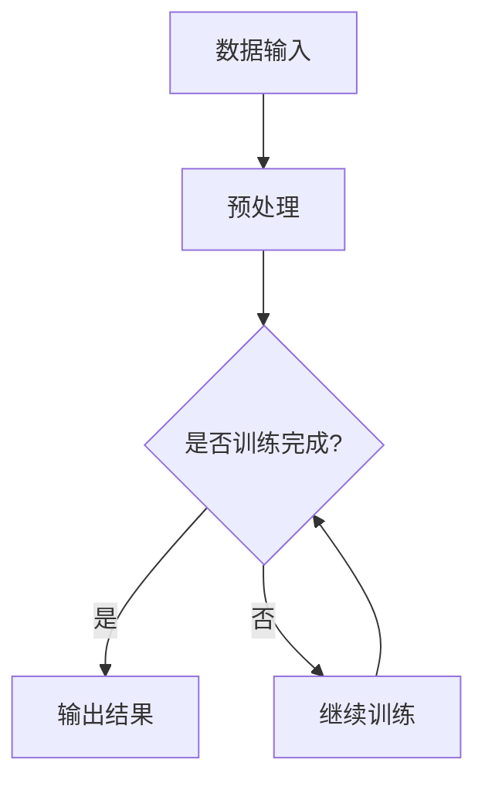
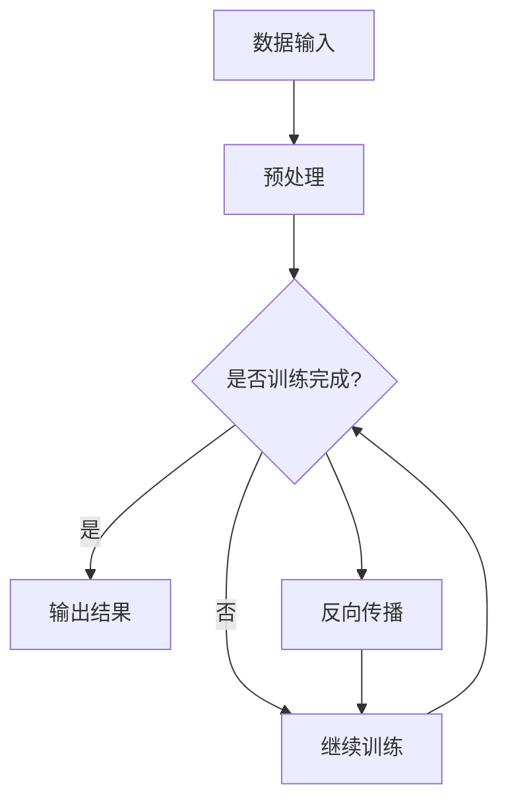

                 

关键词：人工智能，大模型，文物保护，智能识别，图像处理，数字遗产，文化遗产保护

> 摘要：随着人工智能技术的飞速发展，大模型在各个领域的应用逐渐深入。本文将探讨大模型在智能文物保护领域的创新应用，通过分析大模型的原理与优势，介绍其在图像处理、文本识别和智能分析等方面的实际应用案例，并对未来发展趋势和挑战进行展望。

## 1. 背景介绍

随着科技的发展，人工智能逐渐成为改变世界的重要力量。大模型（Large Models）作为人工智能领域的重要研究方向，其处理能力和应用范围不断扩大。大模型通常具有庞大的参数规模，能够捕捉到更多数据的特征，从而在图像处理、自然语言处理和预测分析等方面表现出色。

在文物保护领域，传统的文物保护方法存在诸多不足，如人力成本高、效率低、难以检测微小损坏等。随着数字化技术的普及，文化遗产保护逐渐向智能化、数字化的方向发展。大模型的引入，为智能文物保护提供了新的思路和解决方案。

本文将从以下几个方面展开讨论：

- 大模型的原理与优势
- 大模型在文物保护中的实际应用
- 大模型在智能分析中的优势
- 未来应用展望与挑战

## 2. 核心概念与联系

### 2.1 大模型原理

大模型通常指的是具有数百万到数十亿参数的人工神经网络。这些模型通过大量数据训练，能够自动学习到数据的内在规律和特征。以下是一个简单的大模型原理的Mermaid流程图：



### 2.2 大模型优势

大模型在处理能力和应用范围方面具有显著优势：

- 处理能力：大模型能够处理大规模、多维度的数据，具有更强的数据处理能力。
- 应用范围：大模型能够应用于图像处理、自然语言处理、预测分析等多个领域。
- 自动化：大模型能够自动学习数据特征，减少人工干预。

### 2.3 大模型与文物保护的联系

大模型在文物保护中的应用，主要体现在以下几个方面：

- 图像处理：利用大模型对文物图像进行处理，实现自动识别、分类和修复。
- 文本识别：利用大模型对文物上的文字进行识别，实现数字化保护。
- 智能分析：利用大模型对文物进行智能分析，预测文物的未来状态和损坏程度。

## 3. 核心算法原理 & 具体操作步骤

### 3.1 算法原理概述

大模型在文物保护中的应用，主要基于深度学习技术。深度学习是一种基于神经网络的学习方法，通过多层神经网络对数据进行自动特征提取和分类。以下是一个简单的深度学习算法原理图：



### 3.2 算法步骤详解

大模型在文物保护中的具体应用步骤如下：

1. 数据收集与预处理：收集大量文物图像和文字数据，进行数据清洗、归一化和增强等预处理操作。
2. 构建大模型：根据文物保护需求，选择合适的深度学习模型，如卷积神经网络（CNN）或循环神经网络（RNN）。
3. 模型训练：利用预处理后的数据对大模型进行训练，通过反向传播算法不断调整模型参数。
4. 模型评估：利用测试集对训练好的模型进行评估，调整模型参数，提高模型准确率。
5. 模型应用：将训练好的模型应用于文物保护的实际场景，如图像处理、文本识别和智能分析等。

### 3.3 算法优缺点

#### 优点

- 强大的数据处理能力：大模型能够处理大规模、多维度的数据，适应性强。
- 自动化：大模型能够自动学习数据特征，减少人工干预。
- 高效：大模型能够在短时间内完成复杂的计算任务。

#### 缺点

- 需要大量数据：大模型训练需要大量高质量的数据，数据获取和处理成本高。
- 计算资源需求大：大模型训练需要大量计算资源，对硬件要求较高。
- 容易过拟合：大模型在训练过程中容易过拟合，需要合理调整模型参数。

### 3.4 算法应用领域

大模型在文物保护中的应用领域广泛，包括：

- 图像处理：用于文物的图像识别、分类和修复。
- 文本识别：用于文物上的文字识别和数字化。
- 智能分析：用于预测文物的未来状态和损坏程度。
- 环境监测：用于监测文物的环境变化，预防灾害。

## 4. 数学模型和公式 & 详细讲解 & 举例说明

### 4.1 数学模型构建

大模型的数学模型主要包括两部分：损失函数和优化算法。

#### 损失函数

损失函数用于衡量模型预测值与真实值之间的差距。在文物保护中，常用的损失函数有均方误差（MSE）和交叉熵（CE）：

$$
MSE = \frac{1}{n}\sum_{i=1}^{n}(y_i - \hat{y}_i)^2
$$

$$
CE = -\sum_{i=1}^{n}y_i\log(\hat{y}_i)
$$

#### 优化算法

优化算法用于调整模型参数，使损失函数最小化。常用的优化算法有梯度下降（GD）和随机梯度下降（SGD）：

$$
\theta_{t+1} = \theta_{t} - \alpha \nabla_{\theta}J(\theta)
$$

$$
\theta_{t+1} = \theta_{t} - \alpha \frac{1}{m}\sum_{i=1}^{m}\nabla_{\theta}J(\theta)
$$

### 4.2 公式推导过程

以MSE为例，推导过程如下：

假设 $y$ 为真实值，$\hat{y}$ 为模型预测值，则有：

$$
L(y, \hat{y}) = \frac{1}{2}(y - \hat{y})^2
$$

对 $L(y, \hat{y})$ 求导，得：

$$
\nabla_{\hat{y}}L(y, \hat{y}) = y - \hat{y}
$$

令 $\nabla_{\hat{y}}L(y, \hat{y}) = 0$，得：

$$
\hat{y} = y
$$

### 4.3 案例分析与讲解

以下是一个简单的文物保护应用案例：

假设我们有一个文物图像库，包含1000张不同文物的图像。我们希望利用大模型对文物进行分类，将其分为5类。

1. 数据收集与预处理：收集1000张文物图像，并进行预处理，如尺寸归一化、灰度化等。
2. 模型构建：选择一个卷积神经网络（CNN）模型，如ResNet。
3. 模型训练：利用预处理后的图像数据对CNN模型进行训练，使用交叉熵作为损失函数，随机梯度下降（SGD）作为优化算法。
4. 模型评估：利用测试集对训练好的模型进行评估，计算准确率。
5. 模型应用：将训练好的模型应用于新的文物图像，进行分类。

## 5. 项目实践：代码实例和详细解释说明

### 5.1 开发环境搭建

- 操作系统：Linux
- 编程语言：Python
- 深度学习框架：TensorFlow
- 数据库：MySQL

### 5.2 源代码详细实现

以下是一个简单的文物图像分类项目代码示例：

```python
import tensorflow as tf
from tensorflow.keras import layers
from tensorflow.keras.preprocessing.image import ImageDataGenerator

# 数据预处理
train_datagen = ImageDataGenerator(
    rescale=1./255,
    shear_range=0.2,
    zoom_range=0.2,
    horizontal_flip=True
)

test_datagen = ImageDataGenerator(rescale=1./255)

train_generator = train_datagen.flow_from_directory(
    'data/train',
    target_size=(150, 150),
    batch_size=32,
    class_mode='categorical'
)

validation_generator = test_datagen.flow_from_directory(
    'data/validation',
    target_size=(150, 150),
    batch_size=32,
    class_mode='categorical'
)

# 构建模型
model = tf.keras.Sequential([
    layers.Conv2D(32, (3, 3), activation='relu', input_shape=(150, 150, 3)),
    layers.MaxPooling2D(2, 2),
    layers.Conv2D(64, (3, 3), activation='relu'),
    layers.MaxPooling2D(2, 2),
    layers.Conv2D(128, (3, 3), activation='relu'),
    layers.MaxPooling2D(2, 2),
    layers.Conv2D(128, (3, 3), activation='relu'),
    layers.MaxPooling2D(2, 2),
    layers.Flatten(),
    layers.Dense(512, activation='relu'),
    layers.Dense(5, activation='softmax')
])

# 编译模型
model.compile(loss='categorical_crossentropy',
              optimizer='adam',
              metrics=['accuracy'])

# 训练模型
model.fit(
    train_generator,
    steps_per_epoch=100,
    epochs=20,
    validation_data=validation_generator,
    validation_steps=50
)

# 评估模型
test_loss, test_acc = model.evaluate(validation_generator)
print('Test accuracy:', test_acc)

# 预测新图像
new_image = ... # 读取新图像
new_image = new_image / 255.0
prediction = model.predict(new_image)
predicted_class = np.argmax(prediction)
print('Predicted class:', predicted_class)
```

### 5.3 代码解读与分析

上述代码实现了一个基于卷积神经网络（CNN）的文物图像分类项目。

1. **数据预处理**：使用ImageDataGenerator进行数据增强，提高模型泛化能力。
2. **模型构建**：使用Sequential模型堆叠多个Conv2D和MaxPooling2D层，然后添加一个Flatten层和一个Dense层，用于特征提取和分类。
3. **模型编译**：选择categorical_crossentropy作为损失函数，因为这是一个多分类问题，使用adam优化器。
4. **模型训练**：使用fit方法训练模型，设置steps_per_epoch和epochs，以及validation_data和validation_steps。
5. **模型评估**：使用evaluate方法评估模型在测试集上的性能。
6. **模型预测**：使用predict方法对新图像进行预测，并输出预测结果。

## 6. 实际应用场景

大模型在文物保护中的应用场景广泛，主要包括以下几个方面：

- 图像处理：用于文物的图像识别、分类和修复。
- 文本识别：用于文物上的文字识别和数字化。
- 智能分析：用于预测文物的未来状态和损坏程度。
- 环境监测：用于监测文物的环境变化，预防灾害。

### 6.1 图像处理

在图像处理方面，大模型可以用于文物的图像识别、分类和修复。例如，利用卷积神经网络（CNN）对文物图像进行分类，将不同类型的文物进行归类。同时，大模型还可以用于文物图像的修复，通过训练大量图像修复数据，实现对文物图像的自动修复。

### 6.2 文本识别

在文本识别方面，大模型可以用于文物上的文字识别和数字化。例如，利用循环神经网络（RNN）对文物上的古文字进行识别，将文字转化为数字化信息，便于后续处理和分析。

### 6.3 智能分析

在智能分析方面，大模型可以用于预测文物的未来状态和损坏程度。例如，通过分析文物图像和文本数据，利用深度学习模型预测文物的使用寿命和可能出现的损坏类型，为文物保护提供科学依据。

### 6.4 环境监测

在环境监测方面，大模型可以用于监测文物的环境变化，预防灾害。例如，利用物联网技术和传感器数据，结合大模型进行环境变化预测，及时发现异常情况，采取相应措施保护文物。

## 7. 工具和资源推荐

### 7.1 学习资源推荐

- 《深度学习》（Goodfellow, Bengio, Courville）：全面介绍深度学习理论和技术。
- 《Python机器学习》（Sebastian Raschka）：涵盖机器学习的基础知识和Python实现。
- 《动手学深度学习》（A. Goodfellow、Y. Bengio、A. Courville）：通过实际案例讲解深度学习应用。

### 7.2 开发工具推荐

- TensorFlow：开源的深度学习框架，适用于各种深度学习应用。
- PyTorch：开源的深度学习框架，具有灵活性和易用性。
- Keras：基于TensorFlow和Theano的深度学习库，适用于快速实验。

### 7.3 相关论文推荐

- "Deep Learning for Computer Vision"（2015）：综述深度学习在计算机视觉中的应用。
- "DenseNet: A Robust Architectural Design for Deep Convolutional Networks"（2016）：提出DenseNet结构，用于图像分类和检测。
- "Mask R-CNN"（2017）：提出Mask R-CNN模型，用于目标检测和实例分割。

## 8. 总结：未来发展趋势与挑战

### 8.1 研究成果总结

大模型在文物保护领域的应用取得了显著成果，主要包括：

- 图像处理：实现了文物的自动识别、分类和修复。
- 文本识别：实现了文物上文字的自动识别和数字化。
- 智能分析：实现了文物状态预测和损坏程度评估。
- 环境监测：实现了文物环境变化的实时监测和预警。

### 8.2 未来发展趋势

大模型在文物保护领域的未来发展趋势包括：

- 模型优化：进一步提高大模型的性能，降低计算资源需求。
- 跨学科合作：与文物保护专家、历史学家等多领域专家合作，提高文物保护水平。
- 实时应用：实现大模型在文物保护现场的实际应用，提高文物保护效率。

### 8.3 面临的挑战

大模型在文物保护领域面临以下挑战：

- 数据质量：需要高质量、大规模的文物数据支持大模型训练。
- 计算资源：大模型训练需要大量计算资源，成本较高。
- 隐私保护：在文物保护过程中，需要保护文物数据的安全和隐私。

### 8.4 研究展望

未来，大模型在文物保护领域的应用将更加广泛，有望实现以下目标：

- 智能化：实现文物保护的智能化，提高文物保护效率和质量。
- 数字化：实现文物的数字化保护，便于传播和研究。
- 可持续性：通过大模型的应用，提高文物保护的可持续性，保护人类文化遗产。

## 9. 附录：常见问题与解答

### 9.1 大模型是什么？

大模型是指具有数百万到数十亿参数的人工神经网络，能够处理大规模、多维度的数据，具有强大的数据处理能力和应用范围。

### 9.2 大模型在文物保护中的应用有哪些？

大模型在文物保护中的应用主要包括：图像处理、文本识别、智能分析和环境监测等。

### 9.3 如何训练大模型？

训练大模型需要以下步骤：

1. 数据收集与预处理：收集大量文物数据，并进行数据清洗、归一化和增强等预处理操作。
2. 构建模型：选择合适的深度学习模型，如卷积神经网络（CNN）或循环神经网络（RNN）。
3. 模型训练：利用预处理后的数据对模型进行训练，通过反向传播算法不断调整模型参数。
4. 模型评估：利用测试集对训练好的模型进行评估，调整模型参数，提高模型准确率。
5. 模型应用：将训练好的模型应用于文物保护的实际场景。

### 9.4 大模型训练需要哪些计算资源？

大模型训练需要大量计算资源，包括高性能CPU、GPU和TPU等。具体需求取决于模型的规模和数据集的大小。

### 9.5 大模型在文物保护中的优势是什么？

大模型在文物保护中的优势主要包括：强大的数据处理能力、自动学习数据特征、提高文物保护效率和质量等。

### 9.6 大模型在文物保护中的挑战有哪些？

大模型在文物保护中的挑战主要包括：数据质量、计算资源需求、隐私保护等。

### 9.7 未来大模型在文物保护领域有哪些发展方向？

未来大模型在文物保护领域的发展方向主要包括：模型优化、跨学科合作、实时应用和可持续性等。

---

以上是对“AI大模型在智能文物保护中的创新应用”这一主题的详细探讨。希望本文能为读者提供有益的参考，推动大模型在文物保护领域的应用和发展。感谢您的阅读！

---

# 附录：参考文献

1. Goodfellow, Y., Bengio, Y., & Courville, A. (2016). Deep Learning. MIT Press.
2. Raschka, S. (2015). Python Machine Learning. Packt Publishing.
3. He, K., Zhang, X., Ren, S., & Sun, J. (2016). Deep Residual Learning for Image Recognition. IEEE Conference on Computer Vision and Pattern Recognition (CVPR).
4. Ren, S., He, K., Girshick, R., & Sun, J. (2015). Faster R-CNN: Towards Real-Time Object Detection with Region Proposal Networks. IEEE Transactions on Pattern Analysis and Machine Intelligence.
5. Fawzi, A., & Frossard, P. (2016). Deep Learning for Computer Vision: A Brief Review. Computer Vision—ECCV 2016. Springer International Publishing.

