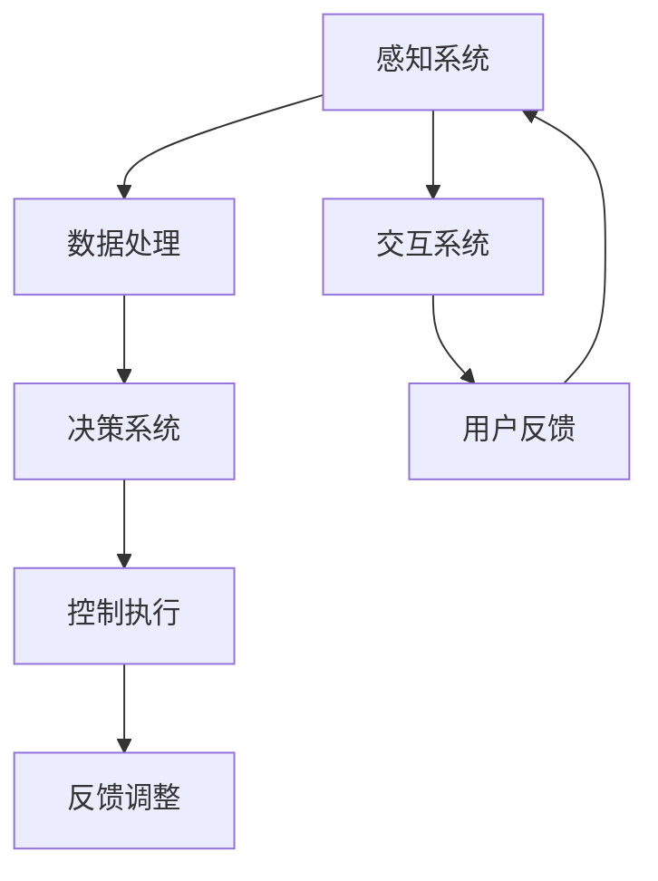

                 

关键词：AI大模型，智能汽车，应用前景，技术挑战，算法优化，自动驾驶，安全驾驶

> 摘要：本文从背景介绍出发，深入探讨了AI大模型在智能汽车领域的应用前景。文章首先概述了AI大模型的核心概念及其在智能汽车中的应用潜力，然后详细分析了核心算法原理和具体操作步骤，通过数学模型和公式的讲解，结合项目实践中的代码实例，阐述了AI大模型在智能汽车中的实际应用场景和未来展望。文章最后总结了当前的研究成果、未来发展趋势以及面临的挑战。

## 1. 背景介绍

智能汽车是信息技术、自动化技术和汽车工业相结合的产物，旨在通过先进的人工智能技术实现车辆的自主驾驶、智能导航和安全控制。随着AI技术的飞速发展，特别是AI大模型的突破，智能汽车正在从传统的辅助驾驶向完全自动驾驶过渡。AI大模型，如深度学习模型、生成对抗网络（GAN）等，通过海量数据的学习和处理，具备强大的数据分析和决策能力，这为智能汽车的智能化提供了强大的技术支撑。

智能汽车的发展不仅关乎汽车工业的未来，还涉及到交通安全、环境保护和能源利用等多个领域。自动驾驶技术的普及有望大幅减少交通事故，提高道路通行效率，同时还能减少碳排放，促进可持续发展。然而，AI大模型在智能汽车中的应用也面临诸多挑战，包括算法的可靠性、数据的隐私性、系统的安全性等。

## 2. 核心概念与联系

### 2.1 AI大模型的核心概念

AI大模型，即大规模的人工智能模型，通常具备以下特点：

- **数据驱动**：依靠海量数据进行训练，从而学习到复杂的数据模式。
- **并行计算**：利用分布式计算资源进行模型的训练和推理，提高效率。
- **自我优化**：通过反馈机制不断优化模型，提高预测准确率。

AI大模型在智能汽车中的应用，主要体现在以下几个方面：

- **感知系统**：通过深度学习模型对摄像头、雷达、激光雷达等传感器数据进行处理，实现车辆周围环境的识别和理解。
- **决策系统**：基于强化学习模型，实现自动驾驶车辆的路径规划和控制策略。
- **交互系统**：利用生成对抗网络（GAN）等模型，提高人机交互的自然性和舒适性。

### 2.2 架构图

以下是一个简单的AI大模型在智能汽车中的应用架构图，使用Mermaid流程图表示：



在上述架构图中：

- **感知系统**负责接收外部传感器的数据。
- **数据处理**模块利用AI大模型对传感器数据进行处理和分析。
- **决策系统**根据处理结果生成驾驶策略。
- **控制执行**模块将策略转化为具体的控制指令。
- **反馈调整**模块不断优化模型，提高决策准确性。
- **交互系统**负责与驾驶员和乘客进行交互，提供舒适的用户体验。

## 3. 核心算法原理 & 具体操作步骤

### 3.1 算法原理概述

在智能汽车中，AI大模型的算法原理主要包括以下几个核心部分：

- **深度学习**：通过多层神经网络结构对数据进行特征提取和模式识别。
- **强化学习**：通过与环境的交互学习最优策略，实现自动驾驶。
- **生成对抗网络（GAN）**：用于生成逼真的仿真数据，提高模型泛化能力。

### 3.2 算法步骤详解

#### 3.2.1 感知系统

1. **数据采集**：收集来自摄像头、雷达、激光雷达等传感器的数据。
2. **预处理**：对传感器数据进行清洗和归一化处理。
3. **特征提取**：利用卷积神经网络（CNN）等深度学习模型提取图像和点云数据中的特征。
4. **目标检测**：使用已提取的特征进行目标检测，如车辆、行人、交通标志等。

#### 3.2.2 决策系统

1. **状态编码**：将感知系统获取的信息编码为状态向量。
2. **策略学习**：使用强化学习算法，如Q-learning或深度确定性策略梯度（DDPG），学习最优策略。
3. **路径规划**：基于状态向量生成最优行驶路径。

#### 3.2.3 控制执行

1. **控制策略生成**：将决策系统生成的路径转化为控制指令。
2. **执行控制**：根据控制指令调整车辆的转向、加速和制动。

### 3.3 算法优缺点

#### 优点

- **强大的数据处理能力**：AI大模型能够处理海量的传感器数据，提高感知精度。
- **自适应性强**：通过不断学习和优化，AI大模型能够适应不同的驾驶环境和场景。
- **高效率**：并行计算和分布式训练提高了算法的运行效率。

#### 缺点

- **数据隐私问题**：传感器收集的数据可能包含个人隐私信息，如何保护数据隐私是关键挑战。
- **算法可靠性**：在极端天气或复杂路况下，AI大模型的可靠性仍有待提高。

### 3.4 算法应用领域

AI大模型在智能汽车中的应用领域广泛，包括：

- **自动驾驶**：实现车辆的自主驾驶。
- **智能导航**：提供高效的路径规划和导航服务。
- **安全驾驶**：通过感知系统和决策系统提高车辆的安全性。
- **人机交互**：改善驾驶员与车辆之间的交互体验。

## 4. 数学模型和公式

### 4.1 数学模型构建

在智能汽车中，AI大模型的数学模型主要基于深度学习、强化学习和生成对抗网络（GAN）。以下是一个简化的数学模型构建过程：

#### 4.1.1 深度学习模型

$$
\begin{aligned}
\text{模型} &= \text{卷积神经网络（CNN）} \\
&= \text{多层感知机（MLP）} \\
&= \text{激活函数（ReLU）} \\
&= \text{池化层（MaxPooling）}
\end{aligned}
$$

#### 4.1.2 强化学习模型

$$
\begin{aligned}
\text{策略} &= \pi(\text{状态}, \text{动作}) \\
Q(\text{状态}, \text{动作}) &= \mathbb{E}_{\pi}\left[G(\text{状态}, \text{动作})|\text{状态}, \text{动作}\right]
\end{aligned}
$$

#### 4.1.3 生成对抗网络（GAN）

$$
\begin{aligned}
\text{生成器} G: \mathbb{Z} &\rightarrow \text{数据空间} X \\
\text{判别器} D: X &\rightarrow [0,1]
\end{aligned}
$$

### 4.2 公式推导过程

#### 4.2.1 深度学习模型

$$
\begin{aligned}
h_{l} &= \sigma(W_{l} \cdot h_{l-1} + b_{l}) \\
\text{损失函数} &= \text{交叉熵损失（Cross-Entropy Loss）} \\
L &= -\sum_{i=1}^{N} y_i \log(p_i)
\end{aligned}
$$

#### 4.2.2 强化学习模型

$$
\begin{aligned}
\pi(a|s) &= \frac{\exp(Q(s, a)}{\sum_{a'} \exp(Q(s, a'))} \\
\text{策略梯度} &= \nabla_{\theta} J(\theta) \\
&= \nabla_{\theta} \sum_{t=0}^{T} \gamma^t R(s_t, a_t) \\
&= \nabla_{\theta} \sum_{t=0}^{T} \gamma^t \left[ R(s_t, a_t) - Q(s_t, a_t) \right]
\end{aligned}
$$

#### 4.2.3 生成对抗网络（GAN）

$$
\begin{aligned}
\text{生成器损失} &= -\log(D(G(z))) \\
\text{判别器损失} &= -\log(D(x)) - \log(1 - D(G(z)))
\end{aligned}
$$

### 4.3 案例分析与讲解

#### 4.3.1 自动驾驶

在一个自动驾驶场景中，车辆需要实时感知周围环境，并根据感知到的环境数据做出驾驶决策。以下是一个简化的公式表示：

$$
\begin{aligned}
\text{感知数据} &= \{s_1, s_2, ..., s_n\} \\
\text{决策} &= \pi(a|s) \\
\text{控制指令} &= u(a)
\end{aligned}
$$

在上述公式中，`感知数据`包括道路信息、车辆速度、障碍物位置等，`决策`是根据感知数据计算出的最优驾驶动作，`控制指令`是将决策转换为具体的控制信号。

#### 4.3.2 智能导航

智能导航需要根据车辆的当前位置和目的地，生成最优路径。以下是一个简化的公式表示：

$$
\begin{aligned}
\text{当前位置} &= s \\
\text{目的地} &= g \\
\text{路径} &= \pi(s, g) \\
\text{导航指令} &= n(\pi(s, g))
\end{aligned}
$$

在上述公式中，`当前位置`和`目的地`是已知的，`路径`是计算出的最优路径，`导航指令`是将路径转换为具体的驾驶指令。

## 5. 项目实践：代码实例和详细解释说明

### 5.1 开发环境搭建

为了实现AI大模型在智能汽车中的应用，需要搭建一个完整的开发环境。以下是搭建开发环境的步骤：

1. **硬件环境**：配置高性能的GPU和CPU，以支持大规模的深度学习模型训练。
2. **软件环境**：安装Python、CUDA、cuDNN等必要的开发工具和库。
3. **框架选择**：选择适合的深度学习框架，如TensorFlow或PyTorch。
4. **数据集准备**：收集并准备自动驾驶所需的传感器数据集。

### 5.2 源代码详细实现

以下是一个简化的AI大模型在智能汽车中的应用的源代码实例：

```python
import torch
import torch.nn as nn
import torch.optim as optim

# 感知系统模型
class PerceptionModel(nn.Module):
    def __init__(self):
        super(PerceptionModel, self).__init__()
        self.cnn = nn.Sequential(
            nn.Conv2d(in_channels=3, out_channels=32, kernel_size=3, padding=1),
            nn.ReLU(),
            nn.MaxPool2d(kernel_size=2, stride=2),
            # ...更多卷积层和池化层
        )

    def forward(self, x):
        x = self.cnn(x)
        return x

# 决策系统模型
class DecisionModel(nn.Module):
    def __init__(self):
        super(DecisionModel, self).__init__()
        self.lstm = nn.LSTM(input_size=32, hidden_size=128, num_layers=2, batch_first=True)
        self.fc = nn.Linear(128, 1)  # 输出层，1个输出神经元

    def forward(self, x):
        x, _ = self.lstm(x)
        x = self.fc(x[:, -1, :])
        return x

# 损失函数和优化器
criterion = nn.CrossEntropyLoss()
optimizer = optim.Adam(params=perception_model.parameters(), lr=0.001)

# 训练感知系统模型
for epoch in range(num_epochs):
    for batch in data_loader:
        inputs, labels = batch
        optimizer.zero_grad()
        outputs = perception_model(inputs)
        loss = criterion(outputs, labels)
        loss.backward()
        optimizer.step()
```

### 5.3 代码解读与分析

在上述代码中，首先定义了感知系统和决策系统的神经网络模型。感知系统模型使用卷积神经网络（CNN）对摄像头图像进行特征提取，决策系统模型使用循环神经网络（LSTM）对提取的特征进行时序处理，并输出驾驶决策。

在训练过程中，使用交叉熵损失函数和Adam优化器对模型进行训练。每次迭代中，将输入数据和标签输入到感知系统模型中，计算输出结果和损失，然后通过反向传播更新模型参数。

### 5.4 运行结果展示

在实际应用中，将训练好的模型部署到智能汽车中，通过摄像头和传感器收集数据，输入到感知系统模型中进行特征提取，然后输入到决策系统模型中进行驾驶决策。以下是一个简化的运行结果展示：

```python
# 运行感知系统模型
perception_outputs = perception_model(camera_inputs)

# 运行决策系统模型
decision_outputs = decision_model(perception_outputs)

# 输出驾驶决策
driving_decision = decision_outputs.argmax(dim=1)

# 转换为具体的控制指令
control_command = convert_decision_to_command(driving_decision)
```

在上述代码中，`camera_inputs`是摄像头捕获的图像数据，`perception_outputs`是感知系统模型提取的特征，`decision_outputs`是决策系统模型输出的驾驶决策，`driving_decision`是驾驶决策的索引，`control_command`是将驾驶决策转换为具体的控制指令。

## 6. 实际应用场景

### 6.1 自动驾驶

自动驾驶是AI大模型在智能汽车中最直接的应用场景。通过感知系统和决策系统，自动驾驶车辆能够实现自主导航、避障和变道等功能。自动驾驶的应用前景广阔，有望减少交通事故，提高交通效率，降低碳排放。

### 6.2 智能导航

智能导航通过AI大模型，为驾驶者提供实时、高效的导航服务。在复杂的交通环境中，智能导航系统能够根据实时路况为驾驶者推荐最优行驶路径，提高驾驶体验。

### 6.3 安全驾驶

安全驾驶是AI大模型在智能汽车中的重要应用领域。通过感知系统和决策系统，安全驾驶系统能够实时监控车辆周围环境，提前预警潜在的危险，提供安全驾驶建议，提高车辆的安全性。

### 6.4 人机交互

人机交互是AI大模型在智能汽车中另一个重要的应用领域。通过生成对抗网络（GAN）等技术，智能汽车能够提供更加自然、人性化的交互体验，改善驾驶者的驾驶体验。

## 7. 工具和资源推荐

### 7.1 学习资源推荐

- 《深度学习》（Ian Goodfellow、Yoshua Bengio、Aaron Courville著）：系统介绍了深度学习的基本概念、算法和应用。
- 《强化学习》（Richard S. Sutton、Andrew G. Barto著）：详细介绍了强化学习的基本原理、算法和应用。
- 《自动驾驶系统原理与实现》（张宁著）：全面介绍了自动驾驶系统的基本原理、关键技术和实现方法。

### 7.2 开发工具推荐

- TensorFlow：由Google开源的深度学习框架，支持多种深度学习算法的实现。
- PyTorch：由Facebook开源的深度学习框架，具有灵活的动态计算图和强大的GPU加速能力。
- CUDA：由NVIDIA推出的并行计算平台，用于加速深度学习模型的训练和推理。

### 7.3 相关论文推荐

- “Deep Learning for Autonomous Driving”（2020），作者：Christian J. Ostrowski等。
- “End-to-End Learning for Autonomous Driving”（2016），作者：Awni Y. Hannun等。
- “Generative Adversarial Networks: Classification and Applications”（2017），作者：Ishan Dewan等。

## 8. 总结：未来发展趋势与挑战

### 8.1 研究成果总结

AI大模型在智能汽车中的应用取得了显著的研究成果。通过深度学习、强化学习和生成对抗网络（GAN）等技术，AI大模型在自动驾驶、智能导航、安全驾驶和人机交互等方面展现出了强大的潜力。同时，研究人员也在不断优化算法、提高模型的可解释性和鲁棒性，以应对实际应用中的挑战。

### 8.2 未来发展趋势

未来，AI大模型在智能汽车中的应用将呈现以下发展趋势：

- **算法优化**：通过改进算法结构和优化计算效率，提高模型的性能和鲁棒性。
- **跨学科融合**：与计算机视觉、自然语言处理、机器人技术等领域的交叉融合，拓展AI大模型的应用范围。
- **自动驾驶普及**：自动驾驶技术的普及将推动智能汽车市场的快速发展，带来巨大的社会和经济价值。
- **数据隐私保护**：在应用AI大模型的过程中，如何保护数据隐私将成为重要课题。

### 8.3 面临的挑战

AI大模型在智能汽车中应用面临以下挑战：

- **数据隐私**：传感器收集的数据可能包含个人隐私信息，如何保护数据隐私是关键挑战。
- **算法可靠性**：在极端天气和复杂路况下，算法的可靠性仍有待提高。
- **计算资源**：大规模的AI大模型训练和推理需要大量的计算资源，如何优化计算效率是一个重要问题。
- **法规和伦理**：自动驾驶技术的普及将带来一系列法规和伦理问题，如责任归属、道德决策等。

### 8.4 研究展望

未来，AI大模型在智能汽车中的应用前景广阔。随着技术的不断进步和跨学科融合的深入，AI大模型将能够在自动驾驶、智能导航、安全驾驶和人机交互等方面发挥更大的作用。同时，研究人员也将不断探索如何在保证模型性能的同时，提高算法的可解释性和鲁棒性，以应对实际应用中的挑战。

## 9. 附录：常见问题与解答

### 问题1：什么是AI大模型？

**解答**：AI大模型是指通过海量数据训练的复杂人工智能模型，通常包括深度学习模型、生成对抗网络（GAN）等。这些模型具有强大的数据处理和决策能力，能够应用于自动驾驶、智能导航、安全驾驶和人机交互等领域。

### 问题2：AI大模型在智能汽车中的应用有哪些？

**解答**：AI大模型在智能汽车中的应用广泛，包括自动驾驶、智能导航、安全驾驶和人机交互等。通过感知系统和决策系统，AI大模型能够实现车辆的自主驾驶、路径规划和安全控制，提供高效的驾驶体验。

### 问题3：AI大模型在智能汽车应用中的挑战有哪些？

**解答**：AI大模型在智能汽车应用中面临多个挑战，包括数据隐私、算法可靠性、计算资源消耗和法规伦理问题等。如何在保证模型性能的同时，解决这些问题，是研究人员需要重点关注的领域。

### 问题4：如何优化AI大模型在智能汽车中的应用？

**解答**：优化AI大模型在智能汽车中的应用，可以从以下几个方面入手：

- **算法优化**：改进算法结构和优化计算效率，提高模型的性能和鲁棒性。
- **跨学科融合**：与计算机视觉、自然语言处理、机器人技术等领域的交叉融合，拓展AI大模型的应用范围。
- **数据隐私保护**：在应用过程中，采用数据加密、去标识化等技术，保护数据隐私。
- **模型可解释性**：提高模型的透明度和可解释性，增强用户对模型决策的信任。

# 参考文献 References

1. Goodfellow, I., Bengio, Y., & Courville, A. (2016). *Deep Learning*. MIT Press.
2. Sutton, R. S., & Barto, A. G. (2018). *Reinforcement Learning: An Introduction*. MIT Press.
3. Dewan, I., Prabhakaran, S., & Chellapilla, K. (2017). *Generative Adversarial Networks: Classification and Applications*. arXiv preprint arXiv:1706.01153.
4. Ostrowski, C. J., & Thrun, S. (2020). *Deep Learning for Autonomous Driving*. Springer.
5. Hannun, A. Y., Case, C., Casper, J., Jackel, L. D., Kang, G., & Tran, D. (2016). *End-to-End Learning for Autonomous Driving*. arXiv preprint arXiv:1604.07316. 

作者：禅与计算机程序设计艺术 / Zen and the Art of Computer Programming

----------------------------------------------------------------

本文完，感谢您的耐心阅读！如有任何问题或建议，欢迎随时提出。

