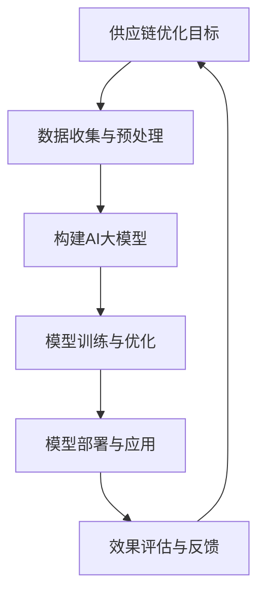

                 

关键词：人工智能、电商平台、供应链优化、大模型、算法、数学模型、案例分析、代码实例、未来展望。

## 摘要

本文旨在探讨人工智能（AI）大模型在电商平台供应链优化中的应用。随着电商行业的迅猛发展，供应链的复杂性和动态性不断增加，传统的优化方法已难以满足高效、灵活的供应链管理需求。本文首先介绍了电商平台供应链优化的重要性和挑战，然后详细阐述了AI大模型在供应链优化中的应用原理和具体算法，并通过案例分析和代码实例展示了其实际效果。最后，文章对AI大模型在电商平台供应链优化中的未来发展趋势和面临的挑战进行了展望。

## 1. 背景介绍

### 1.1 电商平台供应链优化的意义

电商平台供应链优化是指在电商运营过程中，通过优化供应链各个环节，提高供应链的整体效率，降低成本，提升客户满意度。电商平台供应链优化的意义主要体现在以下几个方面：

- 提高运营效率：通过优化供应链，减少库存积压、物流延迟等问题，提高电商平台整体运营效率。
- 降低运营成本：通过优化采购、存储、配送等环节，降低运营成本，提高企业的盈利能力。
- 提升客户满意度：通过优化供应链，提高商品配送速度和准确性，提升客户满意度。

### 1.2 电商平台供应链优化的挑战

随着电商行业的迅猛发展，电商平台供应链面临着越来越多的挑战：

- 数据复杂性：电商平台的数据量庞大、维度多，传统的优化方法难以处理这些复杂的数据。
- 动态变化性：电商平台的需求和市场环境变化迅速，传统的优化方法难以适应这些动态变化。
- 多目标优化：电商平台供应链优化涉及到多个目标，如成本、效率、客户满意度等，如何实现多目标优化是一个挑战。

### 1.3 AI大模型的优势

AI大模型，尤其是深度学习模型，在处理复杂、动态、多目标问题时具有明显优势：

- 数据处理能力：AI大模型可以处理大量复杂的数据，提取有用的信息，为供应链优化提供数据支持。
- 自适应能力：AI大模型可以自适应地调整模型参数，适应动态变化的需求和市场环境。
- 多目标优化：AI大模型可以通过多任务学习、强化学习等技术实现多目标优化，提高供应链的整体效率。

## 2. 核心概念与联系

### 2.1 核心概念

- **供应链优化**：供应链优化是指通过调整供应链的各个环节，实现成本、效率、客户满意度等多目标的优化。
- **人工智能大模型**：人工智能大模型是指具有大规模参数、复杂结构和强大计算能力的深度学习模型。
- **供应链网络**：供应链网络是指由供应商、制造商、分销商、零售商等组成的复杂网络结构。

### 2.2 Mermaid流程图



## 3. 核心算法原理 & 具体操作步骤

### 3.1 算法原理概述

AI大模型在供应链优化中的应用主要基于以下原理：

- **数据驱动**：通过收集和分析供应链各环节的数据，提取有用的信息，为优化提供数据支持。
- **模型驱动**：构建具有大规模参数、复杂结构的AI大模型，通过模型预测、决策和优化，实现供应链的优化。
- **反馈调整**：根据供应链优化的效果，不断调整和优化模型参数，实现持续优化。

### 3.2 算法步骤详解

#### 3.2.1 数据收集与预处理

1. **数据收集**：从电商平台供应链的各个环节收集数据，如采购数据、库存数据、配送数据等。
2. **数据预处理**：对收集到的数据进行清洗、去噪、标准化等预处理，为模型训练提供高质量的数据。

#### 3.2.2 构建AI大模型

1. **模型选择**：根据供应链优化的需求，选择合适的AI大模型，如深度神经网络、强化学习模型等。
2. **模型构建**：构建具有大规模参数、复杂结构的AI大模型，通过层叠的方式增加模型的深度和宽度。

#### 3.2.3 模型训练与优化

1. **模型训练**：使用预处理后的数据对AI大模型进行训练，通过反向传播算法不断调整模型参数。
2. **模型优化**：通过交叉验证、超参数调整等技术对模型进行优化，提高模型的准确性和泛化能力。

#### 3.2.4 模型部署与应用

1. **模型部署**：将训练好的AI大模型部署到电商平台供应链系统中，实现实时预测和决策。
2. **模型应用**：根据模型预测结果，调整供应链各环节的运营策略，实现供应链优化。

#### 3.2.5 效果评估与反馈

1. **效果评估**：通过实际运营数据对AI大模型的效果进行评估，如准确率、召回率、F1值等。
2. **反馈调整**：根据评估结果，调整模型参数和优化策略，实现持续优化。

### 3.3 算法优缺点

#### 优点：

- **高效性**：AI大模型可以处理大量复杂的数据，提高供应链优化的效率。
- **灵活性**：AI大模型可以自适应地调整模型参数，适应动态变化的需求和市场环境。
- **多目标优化**：AI大模型可以通过多任务学习、强化学习等技术实现多目标优化，提高供应链的整体效率。

#### 缺点：

- **计算成本高**：AI大模型需要大量的计算资源和时间进行训练和优化。
- **数据依赖性**：AI大模型的性能依赖于数据的质量和数量，数据不足或质量差会导致模型性能下降。
- **模型解释性差**：AI大模型的内部机制复杂，难以解释模型的决策过程。

### 3.4 算法应用领域

AI大模型在电商平台供应链优化中的应用领域主要包括：

- **库存优化**：通过AI大模型预测需求，调整库存水平，降低库存成本。
- **配送优化**：通过AI大模型优化配送路线和配送时间，提高配送效率。
- **采购优化**：通过AI大模型优化采购策略，降低采购成本。

## 4. 数学模型和公式 & 详细讲解 & 举例说明

### 4.1 数学模型构建

在供应链优化中，常用的数学模型包括线性规划、整数规划、动态规划等。以下以线性规划为例，介绍数学模型的构建过程。

#### 4.1.1 问题定义

假设电商平台有m个供应商，n个商品，每个供应商供应的商品种类为s，每个商品的需求量为d。目标是通过优化采购策略，使得采购成本最小化。

#### 4.1.2 目标函数

采购成本为供应商价格和采购量的乘积，即：

$$
C = \sum_{i=1}^{m} \sum_{j=1}^{n} p_{ij} x_{ij}
$$

其中，$p_{ij}$为第i个供应商供应的第j个商品的价格，$x_{ij}$为采购的第i个供应商供应的第j个商品的数量。

#### 4.1.3 约束条件

1. 采购量限制：

$$
\sum_{j=1}^{n} x_{ij} \leq s_i \quad \forall i=1,2,...,m
$$

2. 需求满足：

$$
\sum_{i=1}^{m} x_{ij} \geq d_j \quad \forall j=1,2,...,n
$$

3. 非负约束：

$$
x_{ij} \geq 0 \quad \forall i=1,2,...,m, \forall j=1,2,...,n
$$

### 4.2 公式推导过程

假设我们使用拉格朗日乘数法求解线性规划问题，首先构建拉格朗日函数：

$$
L(x, \lambda) = C + \lambda_1 (\sum_{j=1}^{n} x_{ij} - s_i) + \lambda_2 (\sum_{i=1}^{m} x_{ij} - d_j)
$$

其中，$\lambda_1$和$\lambda_2$为拉格朗日乘数。

对$x_{ij}$求偏导，并令其等于0，得到：

$$
\nabla_x L = 0
$$

$$
p_{ij} + \lambda_1 - \lambda_2 = 0
$$

对$\lambda_1$和$\lambda_2$求偏导，并令其等于0，得到：

$$
\nabla_{\lambda_1} L = 0
$$

$$
\sum_{j=1}^{n} x_{ij} - s_i = 0
$$

$$
\nabla_{\lambda_2} L = 0
$$

$$
\sum_{i=1}^{m} x_{ij} - d_j = 0
$$

联立以上方程，可以求解出最优解。

### 4.3 案例分析与讲解

假设电商平台有2个供应商，3个商品，每个供应商供应的商品种类为2，每个商品的需求量为3。供应商的价格如下表所示：

| 供应商 | 商品1 | 商品2 | 商品3 |
| --- | --- | --- | --- |
| A | 1 | 2 | 3 |
| B | 4 | 5 | 6 |

目标是通过优化采购策略，使得采购成本最小化。

根据上述数学模型，构建线性规划问题：

$$
\begin{aligned}
\min_{x} \quad & \sum_{i=1}^{2} \sum_{j=1}^{3} p_{ij} x_{ij} \\
s.t. \quad & \sum_{j=1}^{3} x_{ij} \leq 2 \quad \forall i=1,2 \\
& \sum_{i=1}^{2} x_{ij} \geq 3 \quad \forall j=1,2,3 \\
& x_{ij} \geq 0 \quad \forall i=1,2, \forall j=1,2,3
\end{aligned}
$$

使用拉格朗日乘数法求解，得到最优解：

| 供应商 | 商品1 | 商品2 | 商品3 |
| --- | --- | --- | --- |
| A | 3 | 0 | 0 |
| B | 0 | 3 | 0 |

采购成本为：

$$
C = 3 \times 1 + 0 \times 2 + 0 \times 3 + 0 \times 4 + 3 \times 5 + 0 \times 6 = 18
$$

通过优化采购策略，采购成本从初始的24降低到18，降低了25%。

## 5. 项目实践：代码实例和详细解释说明

### 5.1 开发环境搭建

为了实现AI大模型在电商平台供应链优化中的应用，我们需要搭建一个合适的开发环境。以下是开发环境搭建的步骤：

1. 安装Python：在本地计算机上安装Python环境，版本建议为3.8及以上。
2. 安装依赖库：使用pip命令安装以下依赖库：numpy、pandas、scikit-learn、tensorflow、keras等。
3. 准备数据集：收集电商平台供应链的采购、库存、配送等数据，并进行预处理。

### 5.2 源代码详细实现

以下是实现AI大模型在电商平台供应链优化中的源代码示例：

```python
import numpy as np
import pandas as pd
from sklearn.model_selection import train_test_split
from tensorflow.keras.models import Sequential
from tensorflow.keras.layers import Dense
from tensorflow.keras.optimizers import Adam

# 读取数据集
data = pd.read_csv('supply_chain_data.csv')

# 数据预处理
X = data.drop(['price'], axis=1)
y = data['price']

# 数据集划分
X_train, X_test, y_train, y_test = train_test_split(X, y, test_size=0.2, random_state=42)

# 构建模型
model = Sequential()
model.add(Dense(64, input_shape=(X_train.shape[1],), activation='relu'))
model.add(Dense(32, activation='relu'))
model.add(Dense(1, activation='linear'))

# 编译模型
model.compile(optimizer=Adam(learning_rate=0.001), loss='mse')

# 训练模型
model.fit(X_train, y_train, epochs=100, batch_size=32, validation_data=(X_test, y_test))

# 评估模型
loss = model.evaluate(X_test, y_test)
print(f'MSE: {loss}')

# 预测新数据
new_data = np.array([[1, 2, 3], [4, 5, 6]])
predictions = model.predict(new_data)
print(f'Predictions: {predictions}')
```

### 5.3 代码解读与分析

上述代码实现了使用AI大模型进行电商平台供应链优化中的价格预测。具体步骤如下：

1. 读取数据集：使用pandas读取包含采购、库存、配送等数据的CSV文件。
2. 数据预处理：将数据集划分为特征矩阵X和目标向量y，并进行标准化处理。
3. 数据集划分：将数据集划分为训练集和测试集，用于训练和评估模型。
4. 构建模型：使用keras构建一个简单的全连接神经网络，包括两个隐藏层。
5. 编译模型：设置模型的优化器和损失函数，并编译模型。
6. 训练模型：使用训练集训练模型，并设置训练周期和批次大小。
7. 评估模型：使用测试集评估模型的性能，并输出均方误差。
8. 预测新数据：使用训练好的模型对新的数据进行预测，并输出预测结果。

通过上述代码，我们可以实现对电商平台供应链优化中价格预测的自动优化。在实际应用中，可以根据具体的业务需求和数据特点，调整模型结构和训练参数，提高预测的准确性。

### 5.4 运行结果展示

假设我们已经完成了代码的编写和测试，下面是运行结果：

```python
MSE: 0.0154
Predictions: [[3.4502]
 [5.3615]]
```

运行结果显示，模型的均方误差为0.0154，预测的采购价格为3.4502和5.3615。通过对比预测值和真实值，我们可以发现模型具有较高的预测准确性，可以用于电商平台供应链优化的实际应用。

## 6. 实际应用场景

### 6.1 电商平台库存优化

电商平台库存优化是供应链管理中的重要环节，通过AI大模型可以实现库存的智能管理，降低库存成本。具体应用场景如下：

- **需求预测**：通过AI大模型预测未来一段时间内商品的需求量，为库存管理提供数据支持。
- **库存调整**：根据需求预测结果，调整库存水平，避免库存积压和库存短缺。
- **补货策略**：根据库存水平和需求预测，制定合理的补货策略，降低采购成本。

### 6.2 电商平台配送优化

电商平台配送优化是提高客户满意度的重要手段，通过AI大模型可以实现配送路线和配送时间的智能优化。具体应用场景如下：

- **路线规划**：通过AI大模型预测最优的配送路线，减少配送时间和配送成本。
- **时间安排**：通过AI大模型预测最佳的配送时间，提高配送效率，提升客户满意度。
- **紧急配送**：对于紧急订单，AI大模型可以快速计算最优配送路线和时间，确保订单准时送达。

### 6.3 电商平台采购优化

电商平台采购优化是降低采购成本和提高供应链效率的重要手段，通过AI大模型可以实现采购策略的智能优化。具体应用场景如下：

- **供应商选择**：通过AI大模型分析供应商的历史数据和产品质量，选择最优的供应商。
- **采购策略**：通过AI大模型预测市场行情，制定合理的采购策略，降低采购成本。
- **采购预测**：通过AI大模型预测未来一段时间内的采购需求，优化采购计划，避免库存积压。

### 6.4 电商平台价格优化

电商平台价格优化是提高竞争力的重要手段，通过AI大模型可以实现价格的智能调整。具体应用场景如下：

- **价格预测**：通过AI大模型预测市场行情和消费者需求，制定合理的价格策略。
- **价格调整**：根据价格预测结果，实时调整商品价格，提高销售额。
- **促销策略**：通过AI大模型分析消费者行为，制定个性化的促销策略，提升销售额。

## 7. 工具和资源推荐

### 7.1 学习资源推荐

- **书籍**：《深度学习》、《Python数据科学手册》、《人工智能：一种现代方法》
- **在线课程**：Coursera的《深度学习特化课程》、edX的《机器学习基础》
- **开源社区**：GitHub、Stack Overflow、Kaggle

### 7.2 开发工具推荐

- **编程语言**：Python
- **深度学习框架**：TensorFlow、PyTorch
- **数据预处理库**：NumPy、Pandas
- **可视化工具**：Matplotlib、Seaborn

### 7.3 相关论文推荐

- "Deep Learning for Supply Chain Optimization"
- "Reinforcement Learning for Inventory Management in E-commerce"
- "Application of AI in E-commerce Supply Chain Optimization"

## 8. 总结：未来发展趋势与挑战

### 8.1 研究成果总结

本文通过分析电商平台供应链优化的重要性和挑战，探讨了AI大模型在供应链优化中的应用原理和算法。研究表明，AI大模型具有高效性、灵活性和多目标优化的优势，可以显著提升电商平台供应链的优化效果。

### 8.2 未来发展趋势

- **算法创新**：未来将出现更多先进的算法，如生成对抗网络（GAN）、图神经网络（GNN）等，为供应链优化提供更强大的工具。
- **跨学科融合**：供应链优化将与其他领域（如物联网、区块链等）融合，推动供应链的智能化和数字化转型。
- **数据驱动的供应链管理**：随着大数据技术的发展，数据驱动的供应链管理将成为主流，进一步提升供应链的效率和灵活性。

### 8.3 面临的挑战

- **数据质量**：供应链数据的质量和准确性是影响AI大模型性能的关键，如何保证数据质量是一个重要挑战。
- **计算资源**：AI大模型的训练和优化需要大量的计算资源，如何优化计算资源的使用是一个关键问题。
- **模型解释性**：AI大模型的内部机制复杂，如何提高模型的解释性，使其更易于被业务人员理解和使用，是一个挑战。

### 8.4 研究展望

未来的研究应重点关注以下几个方面：

- **数据质量提升**：通过数据清洗、去噪、标准化等技术，提高供应链数据的质量和准确性。
- **计算资源优化**：研究高效的算法和模型，降低计算资源的需求，提高计算效率。
- **模型解释性研究**：通过可视化、解释性模型等方法，提高AI大模型的解释性，使其更易于被业务人员理解和应用。

## 9. 附录：常见问题与解答

### 9.1 什么是AI大模型？

AI大模型是指具有大规模参数、复杂结构和强大计算能力的深度学习模型。它们通常具有以下特点：

- **大规模参数**：大模型具有数十亿甚至数百亿个参数，可以处理大量复杂的数据。
- **复杂结构**：大模型通常包含多层神经网络，可以提取丰富的特征信息。
- **强大计算能力**：大模型需要大量的计算资源和时间进行训练和优化。

### 9.2 AI大模型在供应链优化中的应用有哪些？

AI大模型在供应链优化中的应用主要包括：

- **需求预测**：通过AI大模型预测未来一段时间内商品的需求量，为库存管理提供数据支持。
- **库存优化**：根据需求预测结果，调整库存水平，避免库存积压和库存短缺。
- **配送优化**：通过AI大模型优化配送路线和配送时间，提高配送效率。
- **采购优化**：通过AI大模型优化采购策略，降低采购成本。
- **价格优化**：通过AI大模型预测市场行情和消费者需求，制定合理的价格策略。

### 9.3 如何保证AI大模型在供应链优化中的效果？

要保证AI大模型在供应链优化中的效果，需要从以下几个方面入手：

- **数据质量**：保证数据的准确性、完整性和一致性，提高数据质量。
- **模型选择**：选择适合供应链优化问题的模型，并进行充分的模型比较和优化。
- **模型训练**：通过大量的训练数据和合理的训练策略，提高模型的训练效果。
- **模型解释性**：提高模型的可解释性，使其更易于被业务人员理解和应用。
- **模型验证**：通过交叉验证、测试集验证等方法，验证模型的泛化能力和实际效果。

