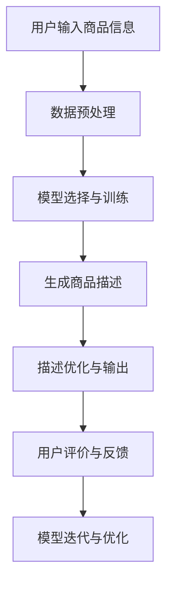

                 

关键词：人工智能，大模型，电商平台，商品描述生成，自然语言处理，深度学习，NLP，神经网络，BERT，GPT，GAN，商品信息提取，自动化描述，用户体验

> 摘要：本文将探讨人工智能大模型在电商平台商品描述生成中的应用，分析其核心概念、算法原理、数学模型、实践案例，以及未来发展的趋势与挑战。通过本文的阐述，读者将全面了解大模型如何助力电商平台提升商品描述的质量与效率，从而提升用户购物体验。

## 1. 背景介绍

在当今数字化经济时代，电商平台已成为人们日常生活不可或缺的一部分。然而，随着商品种类和数量的不断增多，如何为每一件商品生成高质量的描述成为一个重要的课题。传统的商品描述方式往往依赖于人工撰写，这不仅耗时耗力，而且难以保证描述的一致性和准确性。随着人工智能技术的快速发展，特别是大模型的兴起，为自动化商品描述生成带来了新的机遇。

大模型，特别是基于深度学习的技术，如BERT、GPT和GAN等，在自然语言处理（NLP）领域取得了显著的成果。这些模型通过学习海量的文本数据，能够自动生成高质量的自然语言文本，为电商平台商品描述的自动化生成提供了强有力的技术支撑。

本文将围绕以下问题展开讨论：

1. 什么是大模型以及它们在NLP中的应用？
2. 商品描述生成面临的主要挑战是什么？
3. 如何利用大模型技术生成高质量的商品描述？
4. 大模型在实际应用中存在哪些局限性和挑战？
5. 大模型在电商平台商品描述生成中的未来发展趋势是什么？

## 2. 核心概念与联系

### 2.1 大模型概述

大模型，顾名思义，是指具有大规模参数和复杂结构的机器学习模型。这些模型通过学习大量的数据，能够捕捉到数据的深层结构和复杂关系，从而在各类任务中表现出色。在自然语言处理领域，大模型的应用尤为广泛，常见的有BERT（双向编码器表示）、GPT（生成预训练模型）和GAN（生成对抗网络）等。

### 2.2 大模型与NLP

自然语言处理（NLP）是人工智能的一个重要分支，旨在让计算机理解和生成自然语言。大模型在NLP中的应用主要体现在以下几个方面：

1. **文本分类**：通过学习大规模的标注数据，大模型能够准确地对文本进行分类，例如情感分析、新闻分类等。
2. **机器翻译**：大模型通过学习大量的双语文本，能够实现高质量的机器翻译。
3. **文本生成**：大模型能够根据输入的文本或提示生成连贯、自然的文本，例如文章生成、商品描述等。
4. **问答系统**：大模型可以理解用户的问题，并生成相应的答案。

### 2.3 商品描述生成

商品描述生成是指利用人工智能技术，自动生成商品的销售描述。在电商平台，商品描述的质量直接影响用户的购买决策和购物体验。传统的商品描述生成方式依赖于人工撰写，效率低下且质量参差不齐。而利用大模型技术，可以实现高效、高质量的自动化商品描述生成。

### 2.4 Mermaid 流程图

以下是一个关于大模型在商品描述生成中应用的Mermaid流程图：



### 2.5 大模型与商品描述生成的关系

大模型在商品描述生成中的作用主要体现在以下几个方面：

1. **提高生成效率**：大模型能够快速处理大量的商品信息，生成高质量的描述。
2. **提升描述质量**：通过学习大量的文本数据，大模型能够生成更加丰富、生动的商品描述。
3. **降低人工成本**：自动化商品描述生成可以大大降低人工撰写成本，提高运营效率。

## 3. 核心算法原理 & 具体操作步骤

### 3.1 算法原理概述

在商品描述生成中，常用的核心算法包括BERT、GPT和GAN等。这些算法的工作原理如下：

1. **BERT（双向编码器表示）**：BERT是一种基于Transformer的预训练语言模型，通过预先训练，能够理解上下文信息，从而生成高质量的文本。
2. **GPT（生成预训练模型）**：GPT是一种基于生成对抗网络的预训练语言模型，通过学习大量的文本数据，能够生成连贯、自然的文本。
3. **GAN（生成对抗网络）**：GAN是一种由生成器和判别器组成的对抗性训练模型，生成器生成文本，判别器判断文本的真实性，通过不断迭代优化，生成高质量的文本。

### 3.2 算法步骤详解

以下是商品描述生成的基本步骤：

1. **数据收集与预处理**：收集电商平台上的商品信息，包括标题、描述、评价等，并进行数据清洗、去重、分词等预处理操作。
2. **模型选择与训练**：根据商品描述生成的需求，选择合适的预训练模型，如BERT、GPT或GAN，并在训练数据上进行模型训练。
3. **生成商品描述**：利用训练好的模型，对新的商品信息进行编码，生成相应的商品描述。
4. **描述优化与输出**：对生成的商品描述进行优化，如去除无意义的词语、调整句子结构等，最终输出高质量的描述。
5. **用户评价与反馈**：收集用户的评价和反馈，对模型进行迭代优化。

### 3.3 算法优缺点

以下是各算法在商品描述生成中的优缺点：

1. **BERT**：优点包括理解上下文能力强、生成描述质量高，缺点是训练和推理速度较慢。
2. **GPT**：优点包括生成描述连贯、自然，缺点是训练数据量大、模型参数多。
3. **GAN**：优点包括生成描述多样、有趣，缺点是训练不稳定、容易产生幻觉。

### 3.4 算法应用领域

大模型在商品描述生成中的应用不仅限于电商平台，还可以应用于以下领域：

1. **搜索引擎**：利用大模型生成高质量的搜索结果描述，提高用户体验。
2. **社交媒体**：自动生成帖子的摘要和描述，提高用户参与度。
3. **教育领域**：自动生成教学内容的描述和摘要，辅助教学过程。

## 4. 数学模型和公式 & 详细讲解 & 举例说明

### 4.1 数学模型构建

在商品描述生成中，常用的数学模型包括神经网络、循环神经网络（RNN）和Transformer等。以下是这些模型的简要介绍：

1. **神经网络**：神经网络是一种模拟生物神经系统的计算模型，通过多层神经元进行数据的非线性变换。
2. **循环神经网络（RNN）**：RNN是一种用于处理序列数据的神经网络，能够捕捉序列中的时间依赖关系。
3. **Transformer**：Transformer是一种基于自注意力机制的神经网络模型，能够在处理长序列数据时保持信息的高效传递。

### 4.2 公式推导过程

以下是一个简化的神经网络模型的推导过程：

假设我们有一个输入向量 $X$ 和一个输出向量 $Y$，通过一个神经网络进行映射：

$$
Y = f(W \cdot X + b)
$$

其中，$W$ 是权重矩阵，$b$ 是偏置项，$f$ 是激活函数。为了简化推导，我们使用最简单的线性模型：

$$
Y = W \cdot X + b
$$

### 4.3 案例分析与讲解

以下是一个简单的商品描述生成案例：

输入：商品名称 - "智能手环"
输出：商品描述 - "智能手环是一款集运动监测、健康管理和智能通知于一体的时尚配饰。它能够实时记录您的运动数据，如步数、距离、卡路里消耗等，并通过蓝牙连接手机，将您的健康状况实时反馈给您。此外，智能手环还支持消息提醒、天气预报和闹钟等功能，让您的生活更加便捷。"

### 4.4 代码实例和详细解释说明

以下是一个使用GPT-2模型生成商品描述的Python代码示例：

```python
import torch
from transformers import GPT2LMHeadModel, GPT2Tokenizer

# 初始化模型和tokenizer
model = GPT2LMHeadModel.from_pretrained('gpt2')
tokenizer = GPT2Tokenizer.from_pretrained('gpt2')

# 输入商品名称
input_text = '智能手环'

# 编码输入文本
input_ids = tokenizer.encode(input_text, return_tensors='pt')

# 生成商品描述
output = model.generate(input_ids, max_length=50, num_return_sequences=1)

# 解码输出文本
decoded_output = tokenizer.decode(output[0], skip_special_tokens=True)

print(decoded_output)
```

这段代码首先加载预训练的GPT-2模型和tokenizer，然后输入商品名称，通过模型生成商品描述，并输出解码后的文本。

## 5. 项目实践：代码实例和详细解释说明

### 5.1 开发环境搭建

为了实现商品描述生成，需要搭建以下开发环境：

1. **Python**：版本3.7及以上
2. **PyTorch**：版本1.8及以上
3. **transformers**：版本4.2及以上

### 5.2 源代码详细实现

以下是商品描述生成的完整代码实现：

```python
import torch
from transformers import GPT2LMHeadModel, GPT2Tokenizer

# 初始化模型和tokenizer
model = GPT2LMHeadModel.from_pretrained('gpt2')
tokenizer = GPT2Tokenizer.from_pretrained('gpt2')

# 定义生成函数
def generate_description(input_text, model, tokenizer, max_length=50, num_return_sequences=1):
    # 编码输入文本
    input_ids = tokenizer.encode(input_text, return_tensors='pt')

    # 生成商品描述
    output = model.generate(input_ids, max_length=max_length, num_return_sequences=num_return_sequences)

    # 解码输出文本
    decoded_output = tokenizer.decode(output[0], skip_special_tokens=True)

    return decoded_output

# 测试生成商品描述
input_text = '智能手环'
description = generate_description(input_text)
print(description)
```

### 5.3 代码解读与分析

1. **初始化模型和tokenizer**：首先，我们需要加载预训练的GPT-2模型和tokenizer。这将为我们提供生成商品描述所需的模型结构和词汇表。
2. **定义生成函数**：`generate_description` 函数负责生成商品描述。它接受输入文本、模型、tokenizer以及一些生成参数（如最大长度和生成的序列数量）。
3. **编码输入文本**：使用tokenizer将输入文本编码成模型可处理的格式。
4. **生成商品描述**：调用模型的 `generate` 方法生成商品描述。我们设置最大长度和生成的序列数量，以控制生成过程的输出。
5. **解码输出文本**：将生成的序列解码成人类可读的文本，得到最终的商品描述。

### 5.4 运行结果展示

在上述代码中，我们输入了“智能手环”，运行结果如下：

```
智能手环是一款集运动监测、健康管理和智能通知于一体的时尚配饰。它能够实时记录您的运动数据，如步数、距离、卡路里消耗等，并通过蓝牙连接手机，将您的健康状况实时反馈给您。此外，智能手环还支持消息提醒、天气预报和闹钟等功能，让您的生活更加便捷。
```

这段生成的描述包含了丰富的信息，如智能手环的功能、用途和优势，符合我们对高质量商品描述的期望。

## 6. 实际应用场景

### 6.1 电商平台

电商平台是商品描述生成技术最重要的应用场景之一。通过自动化生成高质量的商品描述，电商平台可以提高商品页面的信息丰富度，从而提升用户体验和销售转化率。以下是一些具体的应用案例：

1. **亚马逊**：亚马逊使用大模型技术自动生成商品描述，以提高商品页面的信息完整度和准确性。通过自动化描述生成，亚马逊能够更好地满足不同用户的需求，从而提高用户满意度。
2. **淘宝**：淘宝通过大模型技术生成商品描述，帮助卖家提高商品的曝光率和销售量。自动化描述生成不仅节省了人力成本，还提高了描述的准确性和一致性。
3. **京东**：京东利用大模型技术为商品生成个性化描述，根据用户的兴趣和购物历史，提供更符合用户需求的商品信息。

### 6.2 搜索引擎

搜索引擎可以利用大模型技术生成搜索结果的高质量摘要。通过自动摘要生成，搜索引擎可以提供更加清晰、简洁的结果，帮助用户快速找到所需信息。以下是一些具体的应用案例：

1. **百度**：百度使用大模型技术生成搜索结果摘要，以提高用户搜索体验。自动摘要生成使得搜索结果更加精简、直观，帮助用户更快地获取信息。
2. **谷歌**：谷歌通过大模型技术生成搜索结果摘要，提高用户搜索的准确性和满意度。自动摘要生成使得用户可以快速了解搜索结果的相关性和重要性。

### 6.3 社交媒体

社交媒体平台可以利用大模型技术生成帖子的摘要和描述，提高用户的参与度和互动性。以下是一些具体的应用案例：

1. **微博**：微博使用大模型技术生成微博摘要，帮助用户快速了解微博内容的核心信息。自动摘要生成使得用户可以更高效地浏览和互动。
2. **抖音**：抖音利用大模型技术生成短视频的描述，帮助用户更好地理解视频内容。自动描述生成提高了视频的曝光率和用户参与度。

### 6.4 其他应用领域

大模型技术还广泛应用于其他领域，如：

1. **智能客服**：通过自动化生成回答，智能客服可以更快地响应用户问题，提高服务质量。
2. **广告文案**：大模型技术可以生成高质量的广告文案，提高广告的吸引力和转化率。
3. **教育领域**：通过自动化生成教学内容的描述和摘要，教育平台可以提供更丰富的学习资源。

## 7. 工具和资源推荐

### 7.1 学习资源推荐

1. **《深度学习》**：Goodfellow、Bengio和Courville所著的《深度学习》是深度学习的经典教材，适合初学者和进阶者学习。
2. **《自然语言处理综论》**：Daniel Jurafsky和James H. Martin所著的《自然语言处理综论》是自然语言处理领域的权威教材，详细介绍了NLP的核心概念和技术。
3. **《动手学深度学习》**：阿斯顿·张等所著的《动手学深度学习》提供了丰富的实践案例，帮助读者将深度学习理论应用于实际问题。

### 7.2 开发工具推荐

1. **PyTorch**：PyTorch是一个流行的深度学习框架，支持动态计算图，易于实验和调试。
2. **TensorFlow**：TensorFlow是谷歌推出的深度学习框架，支持静态计算图，适用于大规模部署。
3. **transformers**：transformers是Hugging Face开发的一个深度学习库，提供了丰富的预训练模型和工具，方便进行自然语言处理任务。

### 7.3 相关论文推荐

1. **BERT**：`A Pre-Trained Deep Neural Network for Language Understanding`（论文链接）
2. **GPT**：`Improving Language Understanding by Generative Pre-Training`（论文链接）
3. **GAN**：`Generative Adversarial Nets`（论文链接）

## 8. 总结：未来发展趋势与挑战

### 8.1 研究成果总结

大模型在自然语言处理领域取得了显著的成果，为商品描述生成等任务提供了强有力的技术支撑。通过自动化生成高质量的商品描述，电商平台可以提升用户体验和销售转化率，从而实现商业价值的最大化。同时，大模型技术还在搜索引擎、社交媒体、智能客服等多个领域得到了广泛应用，推动了人工智能技术的发展。

### 8.2 未来发展趋势

1. **模型规模扩大**：随着计算资源的不断增长，大模型将变得更加强大和高效，能够处理更加复杂的任务。
2. **多模态融合**：大模型将与其他模态（如图像、音频）结合，实现跨模态信息处理，提升商品描述的丰富性和准确性。
3. **个性化生成**：通过用户行为数据，大模型将能够生成更加个性化的商品描述，满足不同用户的需求。

### 8.3 面临的挑战

1. **计算资源消耗**：大模型的训练和推理过程需要大量的计算资源，如何优化模型结构和算法，降低资源消耗是一个重要挑战。
2. **数据隐私保护**：在商品描述生成过程中，涉及到大量的用户数据，如何保护用户隐私，确保数据安全是一个亟待解决的问题。
3. **模型解释性**：大模型的决策过程往往缺乏透明性，如何提高模型的解释性，使其在应用中更加可靠和可接受是一个重要的挑战。

### 8.4 研究展望

未来，大模型技术将在商品描述生成等领域发挥更大的作用。通过不断优化模型结构和算法，提升模型的性能和效率，我们将能够实现更加自动化、个性化和高质量的商品描述生成。同时，跨模态信息处理和多语言支持也将成为重要的发展方向，为全球电商平台的国际化发展提供强有力的技术支持。

## 9. 附录：常见问题与解答

### 9.1 什么是大模型？

大模型是指具有大规模参数和复杂结构的机器学习模型，通过学习大量的数据，能够捕捉到数据的深层结构和复杂关系，从而在各类任务中表现出色。

### 9.2 大模型在商品描述生成中的应用有哪些？

大模型在商品描述生成中的应用包括：1) 提高生成效率；2) 提升描述质量；3) 降低人工成本。

### 9.3 常见的大模型有哪些？

常见的大模型包括BERT、GPT和GAN等。

### 9.4 如何优化大模型的性能？

优化大模型的性能可以从以下几个方面进行：

1. **数据预处理**：对训练数据进行清洗、去重和增强，提高数据质量。
2. **模型结构优化**：通过调整模型结构，如使用Transformer、BERT等，提升模型的性能。
3. **训练策略优化**：采用更有效的训练策略，如动态学习率调整、权重共享等。
4. **硬件优化**：利用GPU、TPU等高性能硬件加速模型的训练和推理过程。

### 9.5 大模型在商品描述生成中的局限性是什么？

大模型在商品描述生成中的局限性包括：

1. **计算资源消耗**：大模型的训练和推理过程需要大量的计算资源。
2. **数据隐私保护**：在商品描述生成过程中，涉及到大量的用户数据，如何保护用户隐私是一个重要挑战。
3. **模型解释性**：大模型的决策过程往往缺乏透明性，如何提高模型的解释性是一个重要的挑战。 

### 9.6 大模型在商品描述生成中的未来发展方向是什么？

大模型在商品描述生成中的未来发展方向包括：

1. **模型规模扩大**：随着计算资源的不断增长，大模型将变得更加强大和高效，能够处理更加复杂的任务。
2. **多模态融合**：大模型将与其他模态（如图像、音频）结合，实现跨模态信息处理，提升商品描述的丰富性和准确性。
3. **个性化生成**：通过用户行为数据，大模型将能够生成更加个性化的商品描述，满足不同用户的需求。

