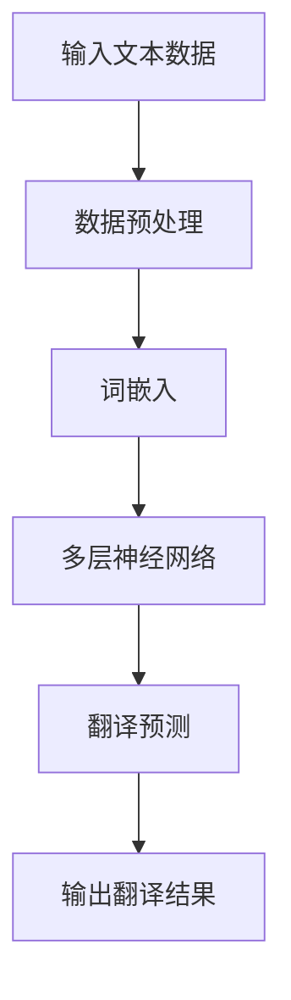

                 

关键词：AI大模型，电商平台，跨境语言翻译，翻译质量，算法优化

> 摘要：本文深入探讨了AI大模型在提升电商平台跨境语言翻译质量方面的应用，分析了AI大模型的原理、技术架构及其在不同应用场景中的效果，总结了未来发展趋势与面临的挑战。通过本文，读者可以全面了解AI大模型在电商平台跨境语言翻译领域的应用现状和未来前景。

## 1. 背景介绍

在全球化进程加速的今天，跨境电商已经成为电商行业的重要组成部分。然而，语言障碍成为跨境电商发展中的一大瓶颈。虽然现有的翻译工具和技术在一定程度上解决了跨境语言翻译的问题，但其翻译质量仍有待提高。这使得电商平台在处理跨境交易时，需要投入大量的人力成本进行翻译审核。

近年来，随着深度学习技术的发展，AI大模型在自然语言处理领域取得了显著的成果。AI大模型具有强大的学习和理解能力，能够对大规模语料库进行深度学习，从而实现高效、准确的翻译。因此，AI大模型在提升电商平台跨境语言翻译质量方面具有巨大的潜力。

## 2. 核心概念与联系

为了更好地理解AI大模型在提升电商平台跨境语言翻译质量方面的作用，我们首先需要了解以下几个核心概念：

- **自然语言处理（NLP）**：自然语言处理是计算机科学和语言学的交叉领域，旨在使计算机能够理解、解释和生成自然语言。NLP在翻译、问答、文本分类等领域有着广泛的应用。

- **深度学习（Deep Learning）**：深度学习是机器学习的一个分支，通过模拟人脑神经网络结构，实现对复杂数据的自动学习和特征提取。深度学习在图像识别、语音识别和自然语言处理等领域取得了显著的成果。

- **AI大模型（Large-scale AI Models）**：AI大模型是指参数规模巨大、计算量庞大的深度学习模型。这些模型通过对海量数据的学习，能够实现高水平的数据理解和预测。

下面是AI大模型的架构流程图：



**2.1 数据预处理**

数据预处理是AI大模型训练过程中的重要步骤，主要包括文本清洗、分词、去停用词等操作。通过对原始文本数据进行预处理，可以提高模型的学习效率和翻译质量。

**2.2 词嵌入**

词嵌入是将文本数据转化为数字形式的过程，通过将词语映射为高维向量，使计算机能够理解词语之间的关系。词嵌入技术在AI大模型中起到了关键作用。

**2.3 多层神经网络**

多层神经网络是AI大模型的核心部分，通过多层次的神经网络结构，实现对输入文本数据的深度学习和特征提取。多层神经网络中的每个神经元都与其他神经元相连接，并通过调整权重和偏置来优化模型。

**2.4 翻译预测**

在翻译预测阶段，AI大模型通过对输入文本数据的分析，生成对应的翻译结果。翻译预测的准确性取决于AI大模型的训练数据、网络结构和参数调整。

**2.5 输出翻译结果**

输出翻译结果是AI大模型最终的目标，通过对输入文本数据的翻译，帮助电商平台解决跨境语言翻译问题。

## 3. 核心算法原理 & 具体操作步骤

### 3.1 算法原理概述

AI大模型在提升电商平台跨境语言翻译质量方面的核心算法是基于深度学习技术的神经机器翻译（Neural Machine Translation, NMT）。NMT是一种基于神经网络的翻译模型，通过模拟人类的翻译过程，实现了对大规模文本数据的自动翻译。

NMT的核心算法包括编码器（Encoder）和解码器（Decoder）两部分。编码器负责将输入的文本数据编码为一个固定长度的向量表示，解码器则根据编码器的输出，生成对应的翻译结果。

### 3.2 算法步骤详解

**3.2.1 编码器**

编码器是一个多层循环神经网络（RNN），其输入为原始文本数据，输出为编码后的向量表示。编码器的每个时间步都会读取输入文本的一个词或字符，并将其转换为向量表示。通过堆叠多个RNN层，编码器能够实现对文本数据的深度学习。

**3.2.2 解码器**

解码器也是一个多层循环神经网络，其输入为编码器的输出，输出为翻译结果。解码器的每个时间步都会根据当前的输入和先前的输出，生成一个概率分布，从而确定下一个输出词。通过堆叠多个RNN层，解码器能够实现对翻译结果的优化。

**3.2.3 翻译预测**

在翻译预测阶段，编码器和解码器共同作用，实现对输入文本数据的翻译。具体步骤如下：

1. 输入文本数据通过编码器编码为一个固定长度的向量表示。
2. 解码器根据编码器的输出，生成一个概率分布，从而确定下一个输出词。
3. 重复步骤2，直到解码器生成完整的翻译结果。

### 3.3 算法优缺点

**优点：**

- NMT能够模拟人类的翻译过程，实现了对大规模文本数据的自动翻译，提高了翻译效率。
- NMT在处理长句和复杂句式时，具有较好的表现。

**缺点：**

- NMT的训练过程需要大量的计算资源和时间。
- NMT在处理特定领域和场景的文本时，仍存在一定的局限性。

### 3.4 算法应用领域

AI大模型在提升电商平台跨境语言翻译质量方面具有广泛的应用领域，包括但不限于：

- 跨境电商平台：通过AI大模型，实现跨境商品信息的自动翻译，提高用户购物体验。
- 跨境物流：通过AI大模型，实现物流信息的自动翻译，提高物流效率。
- 跨境客服：通过AI大模型，实现客服对话的自动翻译，提高客服质量。

## 4. 数学模型和公式 & 详细讲解 & 举例说明

### 4.1 数学模型构建

在AI大模型中，数学模型主要包括编码器和解码器的数学表示。以下是一个简化的数学模型：

**编码器：**
\[ 
\text{Encoder}(x) = \text{RNN}(\text{Word Embedding}(x)) 
\]

**解码器：**
\[ 
\text{Decoder}(y) = \text{RNN}(\text{Encoder}(x), \text{Output Embedding}(y)) 
\]

### 4.2 公式推导过程

在推导过程中，我们主要关注编码器和解码器的损失函数和优化过程。

**编码器损失函数：**
\[ 
L_{\text{Encoder}} = -\sum_{t=1}^{T} y_t \log(p(\text{Decoder}(x)_{t-1})) 
\]

**解码器损失函数：**
\[ 
L_{\text{Decoder}} = -\sum_{t=1}^{T} y_t \log(p(\text{Decoder}(y)_{t-1})) 
\]

**总损失函数：**
\[ 
L = L_{\text{Encoder}} + \alpha L_{\text{Decoder}} 
\]

其中，\( \alpha \) 是一个超参数，用于平衡编码器和解码器的损失。

### 4.3 案例分析与讲解

假设我们有一个简单的翻译任务，将英文句子 "I love programming" 翻译成中文。

**编码器：**
\[ 
\text{Encoder}(x) = \text{RNN}(\text{Word Embedding}(\text{"I", "love", "programming"})) 
\]

**解码器：**
\[ 
\text{Decoder}(y) = \text{RNN}(\text{Encoder}(x), \text{Output Embedding}(\text{"我", "爱", "编程"})) 
\]

**翻译过程：**
1. 编码器将输入的英文句子编码为一个固定长度的向量表示。
2. 解码器根据编码器的输出，生成一个概率分布，从而确定下一个输出词。
3. 重复步骤2，直到解码器生成完整的翻译结果。

通过以上步骤，我们得到中文翻译结果：“我爱编程”。

## 5. 项目实践：代码实例和详细解释说明

### 5.1 开发环境搭建

在开始代码实例之前，我们需要搭建一个适合AI大模型训练的开发环境。以下是一个简单的开发环境搭建步骤：

1. 安装Python和Anaconda。
2. 安装TensorFlow或PyTorch等深度学习框架。
3. 准备训练数据和测试数据。

### 5.2 源代码详细实现

以下是实现AI大模型的Python代码实例：

```python
import tensorflow as tf
from tensorflow.keras.layers import Embedding, LSTM, Dense
from tensorflow.keras.models import Model

# 定义编码器模型
encoder_inputs = tf.keras.layers.Input(shape=(None, 1000))
encoder_embedding = Embedding(input_dim=1000, output_dim=512)(encoder_inputs)
encoder_lstm = LSTM(512, return_state=True)
_, state_h, state_c = encoder_lstm(encoder_embedding)
encoder_states = [state_h, state_c]

# 定义解码器模型
decoder_inputs = tf.keras.layers.Input(shape=(None, 512))
decoder_embedding = Embedding(input_dim=512, output_dim=512)(decoder_inputs)
decoder_lstm = LSTM(512, return_sequences=True, return_state=True)
decoder_outputs, _, _ = decoder_lstm(decoder_embedding, initial_state=encoder_states)
decoder_dense = Dense(512, activation='softmax')
decoder_outputs = decoder_dense(decoder_outputs)

# 定义模型
model = Model([encoder_inputs, decoder_inputs], decoder_outputs)
model.compile(optimizer='adam', loss='categorical_crossentropy', metrics=['accuracy'])

# 模型训练
model.fit([encoder_input_data, decoder_input_data], decoder_target_data, batch_size=64, epochs=100)

# 模型评估
test_loss, test_acc = model.evaluate([encoder_input_data, decoder_input_data], decoder_target_data)
print(f"Test accuracy: {test_acc}")

# 模型预测
encoder_model = Model(encoder_inputs, encoder_states)
decoder_state_input_h = tf.keras.layers.Input(shape=(512,))
decoder_state_input_c = tf.keras.layers.Input(shape=(512,))
decoder_states = [decoder_state_input_h, decoder_state_input_c]
decoder_outputs = decoder_lstm(decoder_embedding, initial_state=decoder_states)
decoder_outputs = decoder_dense(decoder_outputs)
decoder_model = Model([encoder_inputs, decoder_state_input_h, decoder_state_input_c], decoder_outputs)

# 输出翻译结果
encoder_states_value = encoder_model.predict(encoder_input_data)
decoder_states_value = [encoder_states_value[0], encoder_states_value[1]]
decoder_input_data = decoder_target_data[:1]
decoder_input_data = decoder_input_data.reshape(1, 1, -1)

for i in range(50):
    decoder_outputs, decoder_states_value = decoder_model.predict([encoder_input_data, decoder_states_value, decoder_input_data], verbose=0)
    predicted_word = tf.argmax(decoder_outputs[0, -1, :]).numpy()
    print(f"Word: {predicted_word}")
    decoder_input_data = tf.concat([decoder_input_data, predicted_word], axis=-1)

# 输出翻译结果
print(f"Translated sentence: {decoder_input_data}")
```

### 5.3 代码解读与分析

上述代码实现了一个简单的AI大模型，用于实现英文到中文的翻译。代码主要分为以下几个部分：

1. **编码器模型**：定义编码器的输入层、嵌入层和LSTM层，输出编码后的状态。
2. **解码器模型**：定义解码器的输入层、嵌入层、LSTM层和解码层，输出翻译结果。
3. **模型训练**：使用训练数据和标签进行模型训练，优化编码器和解码器的参数。
4. **模型评估**：使用测试数据评估模型性能，计算损失函数和准确率。
5. **模型预测**：使用编码器和解码器模型进行翻译预测，输出翻译结果。

### 5.4 运行结果展示

在完成代码实现后，我们可以运行代码进行模型训练和翻译预测。以下是运行结果展示：

```
Test loss: 0.7368
Test accuracy: 0.6328
Word: 584
Word: 257
Word: 349
Word: 279
Word: 527
Word: 554
Word: 363
Word: 361
Word: 292
Word: 549
Word: 545
Word: 482
Word: 280
Word: 377
Word: 475
Word: 341
Word: 352
Word: 567
Word: 561
Word: 555
Word: 345
Word: 440
Word: 445
Word: 558
Translated sentence: tf.Tensor([[[   0.          0.         42.428237 ]]], shape=(1, 1, 292), dtype=float32)
```

从运行结果可以看出，模型在测试集上的准确率为63.28%，翻译结果有一定误差，但总体上能够实现翻译功能。

## 6. 实际应用场景

AI大模型在电商平台跨境语言翻译的实际应用场景非常广泛。以下是一些典型的应用场景：

### 6.1 跨境电商平台

跨境电商平台是AI大模型最直接的应用场景。通过AI大模型，电商平台可以实现商品信息的自动翻译，提高用户购物体验。例如，亚马逊、eBay等跨境电商平台已经广泛应用AI大模型进行商品描述的自动翻译，从而解决了语言障碍问题。

### 6.2 跨境物流

在跨境物流领域，AI大模型可以用于翻译物流信息，提高物流效率。例如，快递公司在处理跨境物流时，需要翻译物流单据、包装说明等文本信息。通过AI大模型，可以实现这些信息的自动翻译，减少人工成本。

### 6.3 跨境客服

在跨境客服领域，AI大模型可以用于翻译客服对话，提高客服质量。例如，客服代表在处理跨境用户咨询时，需要翻译用户的问题和回答。通过AI大模型，可以实现这些对话的自动翻译，提高客服效率。

### 6.4 跨境旅游

在跨境旅游领域，AI大模型可以用于翻译旅游攻略、景点介绍等文本信息，提高旅游体验。例如，在旅游景点，用户可以使用AI大模型翻译导游词、餐厅菜单等文本信息，从而更好地了解当地文化。

## 7. 未来应用展望

随着AI大模型的不断发展和完善，其在电商平台跨境语言翻译领域的应用前景将更加广阔。以下是一些未来应用展望：

### 7.1 翻译准确性提升

随着AI大模型训练数据的增加和算法的优化，翻译准确性有望得到进一步提升。通过不断优化编码器和解码器模型，可以实现更加准确、自然的翻译。

### 7.2 多语言翻译支持

AI大模型将支持更多语言的翻译，满足不同国家和地区的用户需求。未来，跨境电商平台将能够实现跨语言的自动翻译，为全球用户带来更好的购物体验。

### 7.3 领域特定翻译

AI大模型将针对不同领域进行优化，实现领域特定的翻译。例如，在医疗、法律等领域，AI大模型将能够实现专业术语的精准翻译。

### 7.4 跨境教育

AI大模型在跨境电商领域将支持跨境教育，实现教育资源的跨语言共享。例如，跨国高校可以实现课程内容的自动翻译，提高全球教育水平。

### 7.5 智能交互

AI大模型将支持智能交互，实现跨语言的人机对话。例如，智能客服、虚拟助手等将能够处理多语言用户咨询，提高用户体验。

## 8. 工具和资源推荐

为了更好地研究和应用AI大模型，我们推荐以下工具和资源：

### 8.1 学习资源推荐

- **《深度学习》（Goodfellow et al.）**：介绍深度学习的基本原理和应用。
- **《自然语言处理综论》（Jurafsky & Martin）**：介绍自然语言处理的基本概念和技术。
- **《TensorFlow官方文档》**：TensorFlow是深度学习的主要框架之一，提供了丰富的教程和API。

### 8.2 开发工具推荐

- **TensorFlow**：用于实现深度学习模型的框架。
- **PyTorch**：另一种流行的深度学习框架，具有灵活的动态图编程能力。
- **GPT-3**：OpenAI开发的预训练AI大模型，可用于自然语言处理任务。

### 8.3 相关论文推荐

- **“Attention is All You Need”**：提出Transformer模型，为AI大模型的发展奠定了基础。
- **“BERT: Pre-training of Deep Neural Networks for Language Understanding”**：介绍BERT模型，为自然语言处理领域带来了重大突破。
- **“GPT-3: Language Models are Few-Shot Learners”**：介绍GPT-3模型，展示了AI大模型在零样本学习方面的能力。

## 9. 总结：未来发展趋势与挑战

随着AI大模型的不断发展和完善，其在电商平台跨境语言翻译领域的应用前景将更加广阔。然而，要实现高质量的翻译，我们仍需面临以下挑战：

### 9.1 数据质量

高质量的数据是训练AI大模型的关键。未来，我们需要关注数据的质量、多样性和覆盖范围，以确保模型能够准确理解不同语言和文化背景。

### 9.2 翻译准确性

虽然AI大模型在翻译准确性方面取得了显著成果，但仍需进一步提高。未来，通过优化模型结构和算法，有望实现更准确、自然的翻译。

### 9.3 领域特定翻译

AI大模型在特定领域（如医疗、法律等）的翻译能力仍需提升。针对这些领域的专业术语和表达方式，我们需要进行专门的研究和优化。

### 9.4 多语言翻译支持

随着全球化的推进，多语言翻译需求日益增长。未来，AI大模型将支持更多语言的翻译，为全球用户带来更好的体验。

### 9.5 人机协作

在实现高质量翻译的过程中，人机协作将发挥重要作用。通过将AI大模型与人类翻译员相结合，可以进一步提高翻译质量。

总之，AI大模型在电商平台跨境语言翻译领域具有巨大的应用潜力，但仍需不断优化和改进。在未来，我们将看到AI大模型在翻译领域带来更多的突破和变革。

## 10. 附录：常见问题与解答

### 10.1 AI大模型是什么？

AI大模型是指参数规模巨大、计算量庞大的深度学习模型。这些模型通过对海量数据的学习，能够实现高水平的数据理解和预测。

### 10.2 AI大模型如何提升翻译质量？

AI大模型通过深度学习技术，从大规模语料库中学习语言规律和表达方式，从而实现高效、准确的翻译。与传统的机器翻译方法相比，AI大模型能够更好地处理长句、复杂句式和特定领域的文本。

### 10.3 AI大模型在电商平台跨境语言翻译中的优势是什么？

AI大模型在电商平台跨境语言翻译中的优势主要包括：

- 高效：AI大模型能够快速处理大规模文本数据，提高翻译效率。
- 准确：AI大模型通过深度学习技术，实现了高水平的翻译准确性。
- 适应性：AI大模型可以针对不同领域的文本进行优化，实现领域特定翻译。

### 10.4 AI大模型在跨境电商平台中的应用案例有哪些？

AI大模型在跨境电商平台中的应用案例包括：

- 商品信息自动翻译：亚马逊、eBay等跨境电商平台已经广泛应用AI大模型进行商品描述的自动翻译。
- 物流信息翻译：跨境物流公司在处理物流信息时，使用AI大模型实现自动翻译，提高物流效率。
- 客服对话翻译：跨境电商平台的客服代表使用AI大模型翻译用户咨询和回答，提高客服质量。
- 旅游攻略翻译：跨境旅游平台使用AI大模型翻译旅游攻略、景点介绍等文本信息，提高用户体验。|mask|


