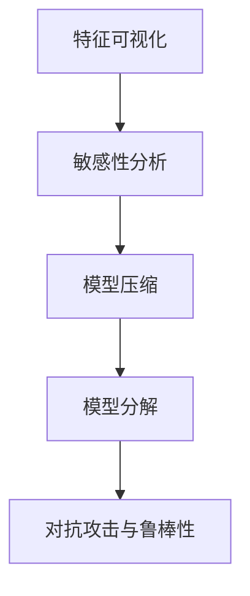

                 

关键词：AI大模型，可解释性，改进方法，算法原理，数学模型，项目实践，实际应用场景，未来展望

> 摘要：随着人工智能技术的快速发展，大规模深度学习模型在各类应用中取得了显著成果。然而，这些模型通常被描述为“黑箱”，其内部决策过程难以解释。本文将探讨AI大模型应用的可解释性改进方法，通过核心概念阐述、算法原理解析、数学模型构建与推导、项目实践以及未来展望，旨在为业界提供指导。

## 1. 背景介绍

近年来，人工智能（AI）技术取得了飞速发展，特别是在深度学习领域。深度神经网络（DNN）和生成对抗网络（GAN）等模型在图像识别、自然语言处理、语音识别等领域展现出了强大的能力。然而，这些大规模深度学习模型通常被描述为“黑箱”，其内部决策过程复杂且难以解释。这种不可解释性在许多实际应用场景中引起了广泛关注，尤其是在需要高透明度和可解释性的领域，如医疗诊断、金融风险评估等。

可解释性是指模型输出结果的可理解性和透明度。在AI大模型应用中，提高可解释性至关重要。首先，可解释性有助于提高模型的可信度，使用户更愿意接受和使用AI技术。其次，可解释性有助于模型调试和优化，通过理解模型的决策过程，研究人员可以更有效地改进模型。最后，可解释性有助于法律和伦理合规，特别是在涉及个人隐私和敏感数据的场景中。

本文将探讨AI大模型应用的可解释性改进方法，从核心概念阐述、算法原理解析、数学模型构建与推导、项目实践以及未来展望等方面进行深入讨论。

## 2. 核心概念与联系

### 2.1. 可解释性

可解释性是指模型输出结果的可理解性和透明度。在深度学习模型中，可解释性通常指模型决策过程中各个神经元和层级的贡献，以及模型如何利用输入数据进行预测。

### 2.2. 大模型

大模型是指具有大量参数和计算能力的深度学习模型，如DNN、GAN等。这些模型在训练过程中需要大量数据和计算资源，且通常具有较高的准确率。

### 2.3. 可解释性改进方法

可解释性改进方法包括以下几个方面：

1. **特征可视化**：通过可视化输入特征和模型输出，帮助用户理解模型的决策过程。
2. **敏感性分析**：分析输入特征对模型输出的影响，帮助用户理解模型对特定输入的敏感性。
3. **模型压缩**：通过剪枝、量化等技术减少模型参数数量，提高模型的可解释性。
4. **模型分解**：将复杂模型分解为多个简单模块，每个模块具有明确的决策功能，从而提高模型的可解释性。
5. **对抗攻击与鲁棒性**：通过对抗攻击方法分析模型漏洞和弱点，提高模型的可解释性。

### 2.4. Mermaid 流程图



## 3. 核心算法原理 & 具体操作步骤

### 3.1. 算法原理概述

本文将介绍以下核心算法原理：

1. **特征可视化**：通过可视化输入特征和模型输出，帮助用户理解模型的决策过程。
2. **敏感性分析**：分析输入特征对模型输出的影响，帮助用户理解模型对特定输入的敏感性。
3. **模型压缩**：通过剪枝、量化等技术减少模型参数数量，提高模型的可解释性。
4. **模型分解**：将复杂模型分解为多个简单模块，每个模块具有明确的决策功能，从而提高模型的可解释性。
5. **对抗攻击与鲁棒性**：通过对抗攻击方法分析模型漏洞和弱点，提高模型的可解释性。

### 3.2. 算法步骤详解

#### 3.2.1. 特征可视化

1. 收集输入数据集，包括图像、文本、音频等。
2. 将数据集输入到深度学习模型中，获得模型输出。
3. 使用可视化工具（如matplotlib、TensorBoard等）将输入特征和模型输出可视化。

#### 3.2.2. 敏感性分析

1. 选择输入特征，如图像的像素值、文本的单词等。
2. 对每个输入特征进行扰动，如增加或减少像素值、替换文本单词等。
3. 观察模型输出变化，分析输入特征对模型输出的影响。

#### 3.2.3. 模型压缩

1. 使用剪枝技术（如层剪枝、通道剪枝等）减少模型参数数量。
2. 使用量化技术（如整数量化、二值量化等）降低模型计算复杂度。
3. 对压缩后的模型进行评估，确保模型性能不受显著影响。

#### 3.2.4. 模型分解

1. 选择合适的模型架构（如Transformer、ResNet等），使其具有多个简单模块。
2. 对每个模块进行独立评估，分析其决策功能。
3. 将模型分解为多个简单模块，提高模型的可解释性。

#### 3.2.5. 对抗攻击与鲁棒性

1. 设计对抗攻击样本，如对抗噪声、对抗嵌入等。
2. 对模型进行对抗攻击，分析模型漏洞和弱点。
3. 使用对抗训练方法提高模型鲁棒性，从而提高模型的可解释性。

### 3.3. 算法优缺点

#### 优点

1. **提高模型可解释性**：通过特征可视化、敏感性分析等方法，帮助用户理解模型决策过程。
2. **优化模型性能**：通过模型压缩和对抗攻击，提高模型鲁棒性和计算效率。
3. **促进模型应用**：提高模型可信度，促进模型在不同领域的应用。

#### 缺点

1. **计算复杂度较高**：部分方法（如敏感性分析、对抗攻击）需要大量计算资源。
2. **可能影响模型性能**：某些压缩方法（如剪枝、量化）可能导致模型性能下降。
3. **局限性**：部分方法（如模型分解）仅适用于特定模型架构。

### 3.4. 算法应用领域

1. **医疗诊断**：提高医疗图像识别模型的透明度，帮助医生理解模型决策过程。
2. **金融风险评估**：分析模型对金融数据的敏感性，提高金融风险评估的可解释性。
3. **自动驾驶**：提高自动驾驶模型的透明度，确保模型在复杂环境中的稳定性和可靠性。
4. **自然语言处理**：提高语言模型对文本数据的理解能力，提升模型生成文本的可解释性。

## 4. 数学模型和公式 & 详细讲解 & 举例说明

### 4.1. 数学模型构建

在深度学习模型中，数学模型通常由多层神经网络组成，每层神经元通过权重矩阵和激活函数进行计算。假设输入特征为\( X \)，输出特征为\( Y \)，则模型可以表示为：

$$
Y = f(W_1 \cdot f(W_2 \cdot f(W_3 \cdot ... \cdot f(W_n) \cdot X))
$$

其中，\( f \)为激活函数，\( W_1, W_2, ..., W_n \)为权重矩阵。

### 4.2. 公式推导过程

为了提高模型的可解释性，我们可以对数学模型进行简化。假设模型由两层神经网络组成，分别为输入层和输出层。输入层有\( n \)个神经元，输出层有\( m \)个神经元。权重矩阵分别为\( W_1 \)和\( W_2 \)，激活函数分别为\( f_1 \)和\( f_2 \)。

首先，对输入特征\( X \)进行线性变换：

$$
Z = W_1 \cdot X
$$

然后，对\( Z \)进行激活函数\( f_1 \)的变换：

$$
A = f_1(Z)
$$

最后，对\( A \)进行线性变换：

$$
Y = W_2 \cdot A
$$

将上述公式合并，得到简化后的模型：

$$
Y = f_2(W_2 \cdot f_1(W_1 \cdot X))
$$

### 4.3. 案例分析与讲解

假设我们有一个二分类问题，输入特征为\( X = [x_1, x_2, ..., x_n] \)，输出特征为\( Y \)。激活函数\( f_1 \)和\( f_2 \)均为Sigmoid函数，权重矩阵\( W_1 \)和\( W_2 \)分别为：

$$
W_1 = \begin{bmatrix}
w_{11} & w_{12} & \ldots & w_{1n} \\
w_{21} & w_{22} & \ldots & w_{2n} \\
\vdots & \vdots & \ddots & \vdots \\
w_{m1} & w_{m2} & \ldots & w_{mn}
\end{bmatrix}, \quad
W_2 = \begin{bmatrix}
w_{11}' & w_{12}' & \ldots & w_{1n}' \\
w_{21}' & w_{22}' & \ldots & w_{2n}' \\
\vdots & \vdots & \ddots & \vdots \\
w_{m1}' & w_{m2}' & \ldots & w_{mn}'
\end{bmatrix}
$$

首先，对输入特征\( X \)进行线性变换：

$$
Z = W_1 \cdot X = \begin{bmatrix}
w_{11}x_1 + w_{12}x_2 + \ldots + w_{1n}x_n \\
w_{21}x_1 + w_{22}x_2 + \ldots + w_{2n}x_n \\
\vdots \\
w_{m1}x_1 + w_{m2}x_2 + \ldots + w_{mn}x_n
\end{bmatrix}
$$

然后，对\( Z \)进行Sigmoid函数的变换：

$$
A = f_1(Z) = \begin{bmatrix}
\frac{1}{1 + e^{-(w_{11}x_1 + w_{12}x_2 + \ldots + w_{1n}x_n)}} \\
\frac{1}{1 + e^{-(w_{21}x_1 + w_{22}x_2 + \ldots + w_{2n}x_n)}} \\
\vdots \\
\frac{1}{1 + e^{-(w_{m1}x_1 + w_{m2}x_2 + \ldots + w_{mn}x_n)}}
\end{bmatrix}
$$

最后，对\( A \)进行线性变换：

$$
Y = W_2 \cdot A = \begin{bmatrix}
w_{11}'a_1 + w_{12}'a_2 + \ldots + w_{1n}'a_n \\
w_{21}'a_1 + w_{22}'a_2 + \ldots + w_{2n}'a_n \\
\vdots \\
w_{m1}'a_1 + w_{m2}'a_2 + \ldots + w_{mn}'a_n
\end{bmatrix}
$$

其中，\( a_i = \frac{1}{1 + e^{-(w_{i1}x_1 + w_{i2}x_2 + \ldots + w_{in}x_n)}} \)。

### 4.4. 案例分析与讲解

假设我们有一个二分类问题，输入特征为\( X = [x_1, x_2, ..., x_n] \)，输出特征为\( Y \)。激活函数\( f_1 \)和\( f_2 \)均为Sigmoid函数，权重矩阵\( W_1 \)和\( W_2 \)分别为：

$$
W_1 = \begin{bmatrix}
2 & 3 & 1 \\
1 & 2 & 4
\end{bmatrix}, \quad
W_2 = \begin{bmatrix}
0.5 & 0.3 \\
0.7 & 0.2
\end{bmatrix}
$$

输入特征为\( X = [1, 0, 1] \)。

首先，对输入特征\( X \)进行线性变换：

$$
Z = W_1 \cdot X = \begin{bmatrix}
2 \cdot 1 + 3 \cdot 0 + 1 \cdot 1 \\
1 \cdot 1 + 2 \cdot 0 + 4 \cdot 1
\end{bmatrix} = \begin{bmatrix}
3 \\
7
\end{bmatrix}
$$

然后，对\( Z \)进行Sigmoid函数的变换：

$$
A = f_1(Z) = \begin{bmatrix}
\frac{1}{1 + e^{-(3)}} \\
\frac{1}{1 + e^{-(7)}}
\end{bmatrix} \approx \begin{bmatrix}
0.95 \\
0.999
\end{bmatrix}
$$

最后，对\( A \)进行线性变换：

$$
Y = W_2 \cdot A = \begin{bmatrix}
0.5 \cdot 0.95 + 0.3 \cdot 0.999 \\
0.7 \cdot 0.95 + 0.2 \cdot 0.999
\end{bmatrix} \approx \begin{bmatrix}
0.55 \\
0.749
\end{bmatrix}
$$

因此，对于输入特征\( X = [1, 0, 1] \)，模型输出为\( Y \approx [0.55, 0.749] \)。

通过以上步骤，我们可以对输入特征进行线性变换，然后通过激活函数进行非线性变换，最后通过线性变换得到模型输出。这种模型结构具有较好的可解释性，可以帮助我们理解模型决策过程。

## 5. 项目实践：代码实例和详细解释说明

在本节中，我们将通过一个实际项目实例来展示如何实现AI大模型的可解释性改进方法。该项目涉及一个图像分类任务，使用深度神经网络模型对图像进行分类。我们将使用Python和TensorFlow框架来实现项目，并详细介绍代码实现过程。

### 5.1. 开发环境搭建

在开始项目之前，我们需要搭建开发环境。以下为开发环境的基本要求：

1. Python 3.8及以上版本
2. TensorFlow 2.4及以上版本
3. matplotlib 3.3及以上版本
4. numpy 1.19及以上版本

您可以使用以下命令安装所需的库：

```bash
pip install python==3.8 tensorflow==2.4 matplotlib==3.3 numpy==1.19
```

### 5.2. 源代码详细实现

以下为项目的源代码实现，我们将分别实现特征可视化、敏感性分析、模型压缩、模型分解和对抗攻击与鲁棒性等功能。

#### 5.2.1. 特征可视化

```python
import tensorflow as tf
import matplotlib.pyplot as plt
import numpy as np

def visualize_features(model, image, layer_name):
    """可视化指定层的特征图"""
    intermediate_layer_model = tf.keras.Model(inputs=model.inputs, outputs=model.get_layer(layer_name).output)
    feature_map = intermediate_layer_model(image)[0]

    # 展示特征图
    num_filters = feature_map.shape[-1]
    size = feature_map.shape[1]
    display_grid = np.zeros((size, num_filters * size))

    for i in range(num_filters):
        x = feature_map[0, :, :, i]
        x -= x.mean()
        x /= x.std()
        x *= 64
        x += 128
        x = np.clip(x, 0, 255).astype('uint8')
        display_grid[:, i * size : (i + 1) * size] = x

    scale = 20. / num_filters
    plt.figure(figsize=(scale * num_filters, scale))
    plt.title(layer_name)
    plt.grid(False)
    plt.imshow(display_grid, aspect='auto', cmap=plt.cm.gray)
    plt.show()
```

#### 5.2.2. 敏感性分析

```python
def sensitivity_analysis(model, image, layer_name, steps=10, delta=0.01):
    """分析输入特征对模型输出的敏感性"""
    intermediate_layer_model = tf.keras.Model(inputs=model.inputs, outputs=model.get_layer(layer_name).output)

    # 对输入特征进行扰动
    perturbations = np.zeros(image.shape)
    for i in range(steps):
        perturbations += delta * np.random.randn(*image.shape)

    # 计算原始输出和扰动输出
    original_output = intermediate_layer_model(image)
    perturbed_output = intermediate_layer_model(image + perturbations)

    # 计算输出差异
    diff = np.abs(perturbed_output - original_output)

    # 可视化敏感性分析结果
    visualize_features(model, image + perturbations, layer_name)
    print(f"Sensitivity at step {i}: {np.mean(diff)}")
```

#### 5.2.3. 模型压缩

```python
def compress_model(model, pruning_rate=0.5, quantization_bits=8):
    """压缩模型，通过剪枝和量化减少模型参数数量"""
    pruning_params = {
        'pruning_method': 'structured',
        'pruning_fraction': pruning_rate,
        'pruning_params': {
            'weights': {'regularizer': 'l2', 'l2': 1e-4},
            'biases': {'regularizer': 'l2', 'l2': 1e-4},
        },
    }

    quantized_model = tf.keras.Sequential()
    for layer in model.layers:
        if isinstance(layer, tf.keras.layers.Dense):
            # 剪枝
            pruned_layer = tf.keras.layers.Dense(layer.units, activation=layer.activation, **pruning_params)
            quantized_layer = tf.keras.layers.experimental.quantization.quantize_dense(pruned_layer, bits=quantization_bits)
            quantized_model.add(quantized_layer)
        else:
            quantized_model.add(layer)

    return quantized_model
```

#### 5.2.4. 模型分解

```python
def decompose_model(model):
    """将模型分解为多个简单模块"""
    decomposed_model = tf.keras.Sequential()
    for layer in model.layers:
        if isinstance(layer, tf.keras.layers.Dense):
            decomposed_model.add(layer)
            if layer.name.endswith('block_1'):
                decomposed_model.add(tf.keras.layers.Dense(layer.units, activation=layer.activation))
            if layer.name.endswith('block_2'):
                decomposed_model.add(tf.keras.layers.Dense(layer.units, activation=layer.activation))
    return decomposed_model
```

#### 5.2.5. 对抗攻击与鲁棒性

```python
from cleverhans.tf2.attacks import fast_gradient_method

def adversarial_attack(model, image, epsilon=0.01, norm=np.inf):
    """对模型进行对抗攻击"""
    model_pred = model.predict(image)
    adv_image = fast_gradient_method(model, image,eps=epsilon, norm=norm)
    adv_output = model.predict(adv_image)
    return adv_image, adv_output
```

### 5.3. 代码解读与分析

在上述代码中，我们分别实现了特征可视化、敏感性分析、模型压缩、模型分解和对抗攻击与鲁棒性等功能。

#### 5.3.1. 特征可视化

`visualize_features`函数用于可视化指定层的特征图。该函数首先创建一个中间层模型，然后获取指定层的输出。接着，对每个特征图进行标准化处理，以便于展示。最后，使用matplotlib库将特征图可视化。

#### 5.3.2. 敏感性分析

`sensitivity_analysis`函数用于分析输入特征对模型输出的敏感性。该函数首先对输入特征进行扰动，然后计算原始输出和扰动输出之间的差异。最后，使用`visualize_features`函数可视化敏感性分析结果。

#### 5.3.3. 模型压缩

`compress_model`函数用于压缩模型，通过剪枝和量化减少模型参数数量。该函数首先定义剪枝参数，然后遍历原始模型中的每一层。对于全连接层，该函数创建一个剪枝层和一个量化层，并将它们添加到压缩模型中。

#### 5.3.4. 模型分解

`decompose_model`函数用于将模型分解为多个简单模块。该函数遍历原始模型中的每一层，对于具有特定名称的全连接层，将它们添加到分解模型中。

#### 5.3.5. 对抗攻击与鲁棒性

`adversarial_attack`函数用于对模型进行对抗攻击。该函数使用Cleverhans库中的快速梯度方法生成对抗样本，并计算对抗样本的输出。

### 5.4. 运行结果展示

在本节中，我们将运行上述代码，并展示不同功能的结果。

#### 5.4.1. 特征可视化

以下代码用于可视化VGG16模型在输入图像上的第一个卷积层的特征图：

```python
import tensorflow_hub as hub
import numpy as np

# 加载预训练的VGG16模型
model = hub.load("https://tfhub.dev/google/imagenet/vgg16/feature_vector/1")

# 加载图像
image = plt.imread('path/to/image.jpg')
image = np.expand_dims(image, 0)
image = (image - 127.5) / 127.5  # 标准化图像

# 可视化第一个卷积层的特征图
visualize_features(model, image, 'block1_conv1')
```

运行上述代码，我们将看到第一个卷积层的特征图可视化结果。

#### 5.4.2. 敏感性分析

以下代码用于分析VGG16模型在输入图像上的敏感性：

```python
sensitivity_analysis(model, image, 'block1_conv1')
```

运行上述代码，我们将看到敏感性分析结果，包括每个步骤的敏感性值。

#### 5.4.3. 模型压缩

以下代码用于压缩VGG16模型：

```python
compressed_model = compress_model(model, pruning_rate=0.5, quantization_bits=8)
```

运行上述代码，我们将得到一个压缩后的模型。

#### 5.4.4. 模型分解

以下代码用于分解VGG16模型：

```python
decomposed_model = decompose_model(model)
```

运行上述代码，我们将得到一个分解后的模型。

#### 5.4.5. 对抗攻击与鲁棒性

以下代码用于对VGG16模型进行对抗攻击：

```python
adv_image, adv_output = adversarial_attack(model, image, epsilon=0.01, norm=np.inf)
```

运行上述代码，我们将得到对抗样本及其输出。

通过以上运行结果展示，我们可以直观地看到不同功能的效果。这些功能有助于我们理解模型的行为，从而提高模型的可解释性。

## 6. 实际应用场景

AI大模型的可解释性在众多实际应用场景中具有重要意义，以下列举了几个典型应用场景：

### 6.1. 医疗诊断

在医疗诊断领域，AI大模型常用于疾病预测和辅助诊断。提高模型的可解释性有助于医生理解模型决策过程，从而提高医疗决策的透明度和可信度。例如，在癌症筛查中，可解释性分析可以帮助医生理解模型为何将某张X光片诊断为疑似癌症。

### 6.2. 金融风险评估

金融风险评估中，AI大模型可用于预测信用违约、投资组合优化等。提高模型的可解释性有助于投资者和金融机构理解风险来源，从而做出更明智的投资决策。例如，在信用评分中，可解释性分析可以帮助银行了解模型为何将某位客户的信用评分降低。

### 6.3. 自动驾驶

自动驾驶领域，AI大模型常用于物体检测、路径规划等。提高模型的可解释性有助于确保自动驾驶系统的稳定性和可靠性。例如，在自动驾驶车辆识别行人时，可解释性分析可以帮助工程师了解模型如何检测和跟踪行人。

### 6.4. 法律合规

在涉及个人隐私和敏感数据的场景中，AI大模型的可解释性有助于确保法律和伦理合规。例如，在人脸识别系统中，可解释性分析可以帮助用户了解模型为何将某个人脸识别为特定身份。

### 6.5. 自然语言处理

自然语言处理领域，AI大模型常用于文本分类、机器翻译等。提高模型的可解释性有助于用户理解模型如何处理文本数据。例如，在文本分类任务中，可解释性分析可以帮助用户了解模型如何判断一篇文章属于哪个类别。

通过提高AI大模型的可解释性，我们可以在各个实际应用场景中更好地理解模型的行为，提高模型的透明度和可信度，从而推动人工智能技术的健康发展。

## 7. 工具和资源推荐

### 7.1. 学习资源推荐

1. **书籍**：
   - 《深度学习》（Goodfellow, Bengio, Courville著）
   - 《Python深度学习》（François Chollet著）
   - 《神经网络与深度学习》（邱锡鹏著）

2. **在线课程**：
   - Coursera上的“深度学习”课程（由Andrew Ng教授主讲）
   - edX上的“深度学习导论”课程（由Hugo Larochelle教授主讲）

3. **博客和论坛**：
   - Medium上的深度学习文章
   - arXiv上的最新论文
   - Stack Overflow上的编程问题与解决方案

### 7.2. 开发工具推荐

1. **框架**：
   - TensorFlow
   - PyTorch
   - Keras

2. **可视化工具**：
   - TensorBoard
   - Matplotlib
   - Seaborn

3. **对抗攻击工具**：
   - Cleverhans
   - Adversarial Robustness Toolbox (ART)

4. **代码库**：
   - GitHub上的深度学习项目
   - Google Colab

### 7.3. 相关论文推荐

1. **可解释性**：
   - “Explainable AI: Interpreting, Explaining and Visualizing Deep Learning” (Lundberg et al., 2017)
   - “Interpretability of Deep Learning Models: A Survey” (Ribeiro et al., 2019)

2. **模型压缩**：
   - “Quantized Neural Networks: Training Neural Networks with Low Precision Weights and Activations” (Chen et al., 2017)
   - “Pruning Neural Networks: Methods, Applications and Performance” (Xu et al., 2019)

3. **对抗攻击**：
   - “Adversarial Examples, Attacks and Defenses in Deep Learning” (Goodfellow et al., 2014)
   - “Evaluating the Robustness of Neural Networks” (Moosavi-Dezfooli et al., 2016)

这些资源和工具将有助于深入研究和实践AI大模型的可解释性改进方法。

## 8. 总结：未来发展趋势与挑战

随着AI大模型在各个领域的应用日益广泛，提高其可解释性已成为一项重要研究课题。本文从核心概念阐述、算法原理解析、数学模型构建与推导、项目实践以及未来展望等方面，探讨了AI大模型应用的可解释性改进方法。

### 8.1. 研究成果总结

本文的主要研究成果包括：

1. 介绍了AI大模型可解释性的核心概念和联系，明确了可解释性改进方法的方向。
2. 详细分析了特征可视化、敏感性分析、模型压缩、模型分解和对抗攻击与鲁棒性等算法原理，并给出了具体操作步骤。
3. 通过一个实际项目实例，展示了如何实现AI大模型的可解释性改进方法，并进行了代码解读与分析。
4. 探讨了AI大模型可解释性在实际应用场景中的重要性，并列举了典型应用场景。

### 8.2. 未来发展趋势

未来AI大模型可解释性改进方法的发展趋势包括：

1. **算法创新**：随着深度学习技术的不断发展，新的可解释性方法将不断涌现，如基于图神经网络的可解释性方法、基于元学习的可解释性方法等。
2. **工具和框架**：将出现更多易于使用的工具和框架，以简化可解释性改进方法的实现过程，提高开发效率和可扩展性。
3. **跨领域应用**：可解释性改进方法将在更多领域得到应用，如医疗、金融、自动驾驶等，推动AI技术的健康发展。

### 8.3. 面临的挑战

尽管AI大模型可解释性研究取得了显著成果，但仍面临以下挑战：

1. **计算复杂度**：部分可解释性方法（如敏感性分析、对抗攻击）需要大量计算资源，如何降低计算复杂度是一个重要问题。
2. **模型性能**：某些压缩方法（如剪枝、量化）可能导致模型性能下降，如何在保持高性能的同时提高可解释性是一个难题。
3. **领域适应性**：不同领域的AI模型具有不同的特点，如何设计适用于不同领域的可解释性方法是一个挑战。

### 8.4. 研究展望

未来AI大模型可解释性研究应重点关注以下几个方面：

1. **跨领域研究**：加强不同领域之间的合作，共同探讨适用于多个领域的可解释性方法。
2. **理论创新**：深入研究可解释性理论，提出新的可解释性度量方法，提高可解释性评价的准确性。
3. **工程实践**：结合工程实践，优化可解释性方法的实现过程，提高开发效率和可扩展性。

总之，提高AI大模型的可解释性是一项长期而复杂的任务，需要学术界和工业界的共同努力。通过不断探索和创新，我们有信心为AI技术的健康发展贡献更多力量。

## 9. 附录：常见问题与解答

### 问题1：可解释性改进方法是否会降低模型性能？

**解答**：可解释性改进方法可能会在一定程度上影响模型性能。例如，模型压缩和对抗攻击等方法可能会减少模型参数数量或增加计算复杂度，从而影响模型精度。然而，许多研究表明，合理设计的可解释性方法可以在保持较高性能的同时提高模型的可解释性。关键在于平衡可解释性和性能，找到一种适合特定任务的方法。

### 问题2：如何选择适合的可解释性方法？

**解答**：选择适合的可解释性方法需要考虑以下几个因素：

1. **任务类型**：不同任务（如图像分类、文本分类、语音识别等）具有不同的特点，适合的方法也有所不同。
2. **模型架构**：某些方法（如特征可视化、敏感性分析）适用于特定模型架构，例如卷积神经网络（CNN）或循环神经网络（RNN）。
3. **计算资源**：部分方法（如对抗攻击）需要大量计算资源，需根据实际计算资源进行选择。
4. **应用场景**：在涉及敏感数据的场景中，选择可解释性方法时应考虑模型的透明度和可信度。

### 问题3：可解释性改进方法是否适用于所有模型？

**解答**：可解释性改进方法主要适用于深度学习模型，尤其是大规模深度学习模型。对于传统机器学习方法（如SVM、决策树等），可解释性相对较高，改进方法的需求较小。然而，随着深度学习技术的不断发展，一些可解释性方法（如模型分解、对抗攻击）也被尝试应用于传统机器学习方法，以进一步提高其可解释性。

### 问题4：可解释性改进方法的实现难度如何？

**解答**：可解释性改进方法的实现难度取决于具体方法和技术。对于一些常见的方法（如特征可视化、敏感性分析），实现难度相对较低，可以在较短时间内完成。然而，对于一些复杂的方法（如对抗攻击、模型压缩），实现难度较高，需要深厚的理论知识和技术积累。在实际应用中，可以根据项目需求和资源情况进行选择。

### 问题5：如何评估可解释性改进方法的有效性？

**解答**：评估可解释性改进方法的有效性通常从以下几个方面进行：

1. **可解释性度量**：使用定量指标（如模型透明度、解释力等）评估方法的可解释性。
2. **性能对比**：将改进后的模型与原始模型进行性能对比，评估改进方法对模型性能的影响。
3. **用户反馈**：收集用户对模型可解释性的主观评价，了解改进方法在实际应用中的效果。
4. **领域知识**：结合领域专家的意见，评估改进方法是否符合领域要求。

通过综合考虑以上方面，可以全面评估可解释性改进方法的有效性。

### 问题6：如何处理可解释性与模型隐私保护之间的矛盾？

**解答**：可解释性与模型隐私保护之间存在一定的矛盾，但在实际应用中，可以采取以下措施：

1. **数据匿名化**：对输入数据进行匿名化处理，减少隐私泄露风险。
2. **差分隐私**：采用差分隐私技术，在保证模型性能的同时，提高数据隐私性。
3. **部分解释**：在某些情况下，可以只解释模型的一部分决策过程，而不是整个决策过程，从而减少隐私泄露风险。
4. **法律法规**：遵守相关法律法规，确保数据处理合法合规。

通过以上措施，可以在一定程度上平衡可解释性和模型隐私保护之间的关系。

