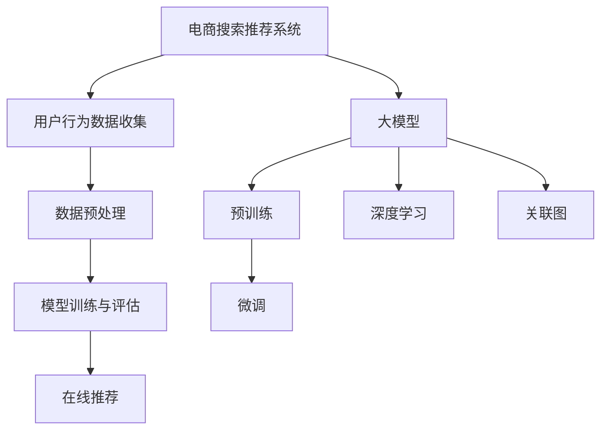

                 

## 1. 背景介绍

电商行业在近年来经历了飞速的发展，其核心驱动力之一便是精准高效的搜索推荐系统。随着用户需求的不断变化和竞争的加剧，传统基于关键词匹配和机器学习的推荐算法已难以满足用户对个性化、实时性、多样化推荐服务的需求。因此，AI大模型技术的引入成为电商搜索推荐系统的创新方向。

AI大模型，尤其是基于深度学习的模型，具有强大的数据处理和特征提取能力，能够从海量用户数据中挖掘出深层次的关联和趋势。这些模型不仅可以提高推荐的准确性，还可以实时响应市场变化，为用户提供更加个性化的购物体验。例如，BERT（Bidirectional Encoder Representations from Transformers）模型、GPT（Generative Pre-trained Transformer）模型等，在电商搜索推荐领域已有成功应用。

然而，AI大模型在电商搜索推荐中的应用不仅涉及技术的深度学习，还需要对其背后的业务逻辑有深刻的理解。因此，开发一套AI大模型赋能的电商搜索推荐业务创新方法论培训课程，不仅能够提升从业人员的技术能力，还能推动业务创新，具有重要意义。

本文将围绕这一主题，首先介绍AI大模型在电商搜索推荐中的基本概念和重要性，然后详细讨论培训课程的设计与开发，包括课程结构、内容、实施方法等。最后，将对课程的实际应用和未来发展方向进行展望。

## 2. 核心概念与联系

在深入探讨AI大模型赋能电商搜索推荐之前，我们需要明确几个核心概念，并了解它们之间的联系。

### 2.1 电商搜索推荐系统

电商搜索推荐系统是电商网站的重要组成部分，旨在为用户提供个性化、实时的商品推荐。系统的工作流程通常包括以下几个步骤：

1. **用户行为数据收集**：包括用户的搜索历史、浏览记录、购买行为等。
2. **数据预处理**：清洗、去噪、特征提取等。
3. **模型训练与评估**：利用历史数据训练推荐模型，并进行评估。
4. **在线推荐**：实时向用户推荐可能感兴趣的商品。

### 2.2 大模型

大模型指的是参数规模庞大的神经网络模型，通常需要海量数据来训练。它们在计算机视觉、自然语言处理等领域取得了显著的突破。大模型通常包括：

1. **预训练**：在无监督的数据集上训练模型，使其具备一定的语义理解能力。
2. **微调**：在特定任务上进一步训练模型，以提高其在特定领域的表现。

### 2.3 深度学习

深度学习是机器学习的一个分支，通过构建多层神经网络，对数据进行特征提取和学习。深度学习模型在大模型中得到了广泛应用。

### 2.4 关联图

关联图是一种数据结构，用于表示数据之间的关联关系。在电商搜索推荐系统中，关联图可以帮助我们理解用户行为和商品特征之间的复杂关系。

### 2.5 Mermaid 流程图

为了更好地展示上述概念之间的联系，我们可以使用Mermaid流程图来描述：



### 2.6 关键联系

大模型和深度学习是AI大模型的核心技术，它们通过关联图与电商搜索推荐系统紧密联系在一起。大模型强大的数据处理和特征提取能力，使得推荐系统在处理海量用户数据时能够更加准确和高效。而深度学习则提供了从数据中自动学习特征的方法，使得模型能够更好地适应不同的业务场景。

## 3. 核心算法原理 & 具体操作步骤

### 3.1 算法原理概述

AI大模型在电商搜索推荐中的应用主要基于以下几个核心算法原理：

1. **用户行为分析**：通过分析用户的搜索历史、浏览记录、购买行为等，提取用户兴趣特征。
2. **商品特征提取**：对商品进行分类、标签化，提取商品属性特征。
3. **协同过滤**：利用用户行为数据和商品特征，通过矩阵分解等方法预测用户对商品的偏好。
4. **深度学习模型**：利用深度学习模型（如BERT、GPT等）对用户和商品进行语义理解，提高推荐准确性。

### 3.2 算法步骤详解

1. **数据收集与预处理**：收集用户的搜索历史、浏览记录、购买行为等数据，进行清洗和去噪，提取用户兴趣特征和商品属性特征。

2. **模型训练**：利用用户兴趣特征和商品属性特征，训练协同过滤模型和深度学习模型。协同过滤模型可以使用矩阵分解等方法，而深度学习模型可以使用BERT、GPT等预训练模型。

3. **模型评估与优化**：使用验证集对模型进行评估，根据评估结果调整模型参数，优化模型性能。

4. **在线推荐**：在用户登录或进行搜索时，实时计算用户兴趣特征和商品特征，利用协同过滤模型和深度学习模型预测用户对商品的偏好，生成推荐列表。

### 3.3 算法优缺点

**优点**：

1. **高准确性**：通过深度学习模型对用户和商品进行语义理解，提高推荐准确性。
2. **实时性**：实时分析用户行为，快速生成推荐列表，满足用户实时需求。
3. **个性化**：根据用户兴趣特征，为用户提供个性化的推荐，提高用户满意度。

**缺点**：

1. **计算资源需求大**：深度学习模型需要大量计算资源，对硬件设备要求较高。
2. **训练时间长**：大规模模型训练需要较长时间，影响推荐系统的实时性。
3. **数据依赖性高**：推荐系统依赖于用户行为数据，数据质量对系统性能有较大影响。

### 3.4 算法应用领域

AI大模型在电商搜索推荐中的应用非常广泛，除了电商领域外，还可以应用于以下领域：

1. **社交媒体**：基于用户行为和内容，进行个性化内容推荐。
2. **广告投放**：根据用户兴趣和行为，精准投放广告。
3. **在线教育**：根据用户学习习惯和成绩，提供个性化学习路径。
4. **金融风控**：通过用户行为数据，识别欺诈行为，降低金融风险。

## 4. 数学模型和公式 & 详细讲解 & 举例说明

### 4.1 数学模型构建

在AI大模型赋能电商搜索推荐系统中，数学模型构建是核心环节之一。以下是构建数学模型的基本步骤：

1. **用户兴趣特征提取**：

   假设用户行为数据为矩阵\(U \in \mathbb{R}^{n \times m}\)，其中\(n\)表示用户数量，\(m\)表示行为类型（如搜索、浏览、购买等）。用户兴趣特征可以表示为向量\(u \in \mathbb{R}^{m}\)，其中\(u_i\)表示用户对第\(i\)种行为的兴趣度。

   $$u = \text{softmax}(U \cdot W_u)$$

   其中，\(W_u \in \mathbb{R}^{m \times k}\)为行为特征权重矩阵，\(k\)为特征维度。

2. **商品特征提取**：

   假设商品特征数据为矩阵\(V \in \mathbb{R}^{p \times l}\)，其中\(p\)表示商品数量，\(l\)表示商品属性（如品牌、价格、类别等）。商品特征可以表示为向量\(v \in \mathbb{R}^{l}\)，其中\(v_j\)表示商品的第\(j\)个属性值。

   $$v = \text{softmax}(V \cdot W_v)$$

   其中，\(W_v \in \mathbb{R}^{l \times k}\)为商品属性权重矩阵。

3. **用户商品评分预测**：

   用户对商品的评分可以表示为矩阵\(R \in \mathbb{R}^{n \times p}\)，其中\(r_{ij}\)表示用户\(i\)对商品\(j\)的评分。利用用户兴趣特征和商品特征，可以预测用户对商品的评分。

   $$r_{ij} = u_i \cdot v_j$$

### 4.2 公式推导过程

上述数学模型构建的推导过程如下：

1. **用户兴趣特征提取**：

   用户行为数据矩阵\(U\)经过行为特征权重矩阵\(W_u\)的加权变换，得到用户兴趣特征向量\(u\)。由于用户兴趣特征需要满足概率分布，因此使用softmax函数对加权结果进行归一化处理。

2. **商品特征提取**：

   商品特征数据矩阵\(V\)经过商品属性权重矩阵\(W_v\)的加权变换，得到商品特征向量\(v\)。同样，使用softmax函数对加权结果进行归一化处理，使其满足概率分布。

3. **用户商品评分预测**：

   用户兴趣特征向量\(u\)与商品特征向量\(v\)进行点乘运算，得到用户对商品的评分预测。由于用户评分数据通常呈现非负性，因此直接使用点乘运算即可。

### 4.3 案例分析与讲解

以下是一个具体的案例，假设有10个用户和100件商品，用户的行为数据如下：

| 用户 | 搜索A | 搜索B | 搜索C | 浏览D | 浏览E | 购买F |
| ---- | ---- | ---- | ---- | ---- | ---- | ---- |
| 1    | 1    | 0    | 0    | 0    | 1    | 0    |
| 2    | 0    | 1    | 0    | 1    | 0    | 1    |
| 3    | 0    | 0    | 1    | 1    | 1    | 0    |
| 4    | 1    | 1    | 1    | 0    | 0    | 1    |
| 5    | 0    | 1    | 0    | 1    | 0    | 1    |
| 6    | 1    | 0    | 1    | 1    | 1    | 0    |
| 7    | 0    | 1    | 0    | 1    | 0    | 1    |
| 8    | 0    | 0    | 1    | 0    | 1    | 1    |
| 9    | 1    | 1    | 1    | 0    | 0    | 0    |
| 10   | 0    | 0    | 0    | 1    | 1    | 1    |

商品特征数据如下：

| 商品 | 品牌 | 价格 | 类别 |
| ---- | ---- | ---- | ---- |
| 1    | A    | 100  | 1    |
| 2    | B    | 150  | 2    |
| 3    | A    | 200  | 1    |
| 4    | C    | 300  | 3    |
| 5    | B    | 250  | 2    |
| 6    | A    | 150  | 1    |
| 7    | C    | 350  | 3    |
| 8    | B    | 200  | 2    |
| 9    | A    | 250  | 1    |
| 10   | C    | 400  | 3    |

首先，我们需要为用户和商品分配特征维度，假设\(k = 2\)，然后随机初始化行为特征权重矩阵\(W_u\)和商品属性权重矩阵\(W_v\)。

假设我们使用一个简单的协同过滤模型进行训练，其中\(W_u\)和\(W_v\)的维度为\(m \times k\)和\(l \times k\)，则用户兴趣特征向量\(u\)和商品特征向量\(v\)的计算公式为：

$$u = \text{softmax}(U \cdot W_u)$$

$$v = \text{softmax}(V \cdot W_v)$$

为了简化计算，我们使用随机梯度下降（SGD）算法来训练模型，更新权重矩阵\(W_u\)和\(W_v\)：

$$W_u \leftarrow W_u - \alpha \cdot (u - \text{softmax}(U \cdot W_u))$$

$$W_v \leftarrow W_v - \alpha \cdot (v - \text{softmax}(V \cdot W_v))$$

其中，\(\alpha\)为学习率。

经过多次迭代后，模型收敛，用户兴趣特征向量\(u\)和商品特征向量\(v\)将不再发生显著变化。

接下来，我们可以使用训练好的模型预测用户对商品的评分。假设用户\(i = 1\)，商品\(j = 2\)，则用户对商品的评分预测为：

$$r_{ij} = u_i \cdot v_j$$

$$r_{12} = u_1 \cdot v_2 = \text{softmax}(U_1 \cdot W_u) \cdot \text{softmax}(V_2 \cdot W_v)$$

根据softmax函数的性质，我们可以将上述计算转化为矩阵乘法和指数运算：

$$r_{12} = \frac{e^{U_1 \cdot W_u}}{\sum_{k=1}^{m} e^{U_1 \cdot W_u}} \cdot \frac{e^{V_2 \cdot W_v}}{\sum_{k=1}^{l} e^{V_2 \cdot W_v}}$$

$$r_{12} = \frac{e^{U_1 \cdot W_u} \cdot e^{V_2 \cdot W_v}}{\sum_{k=1}^{m} e^{U_1 \cdot W_u} \cdot \sum_{k=1}^{l} e^{V_2 \cdot W_v}}$$

通过计算，我们可以得到用户对商品的评分预测值。实际应用中，我们可以使用更复杂的深度学习模型（如BERT、GPT等）来提高预测准确性。

## 5. 项目实践：代码实例和详细解释说明

### 5.1 开发环境搭建

在进行AI大模型赋能电商搜索推荐的业务创新方法论培训课程开发与优化之前，首先需要搭建一个合适的开发环境。以下是一个基本的开发环境搭建步骤：

1. **安装Python**：
   - 建议使用Python 3.8或更高版本。
   - 可以从Python官方网站下载安装包，并按照提示进行安装。

2. **安装深度学习框架**：
   - 建议使用TensorFlow或PyTorch作为深度学习框架。
   - TensorFlow：在终端执行命令`pip install tensorflow`。
   - PyTorch：在终端执行命令`pip install torch torchvision`。

3. **安装其他依赖**：
   - NumPy：在终端执行命令`pip install numpy`。
   - Pandas：在终端执行命令`pip install pandas`。
   - Matplotlib：在终端执行命令`pip install matplotlib`。

4. **配置虚拟环境**：
   - 为了避免不同项目之间的依赖冲突，建议使用虚拟环境。
   - 安装virtualenv：在终端执行命令`pip install virtualenv`。
   - 创建虚拟环境：在终端执行命令`virtualenv env`。
   - 激活虚拟环境：在终端执行命令`source env/bin/activate`。

5. **安装数据库**：
   - 建议使用MySQL或PostgreSQL作为数据库。
   - 安装MySQL或PostgreSQL：按照官方网站的指导进行安装。

### 5.2 源代码详细实现

以下是一个基于TensorFlow的电商搜索推荐系统的简单示例代码。该示例包含数据预处理、模型构建、训练和预测等步骤。

```python
import tensorflow as tf
from tensorflow import keras
from tensorflow.keras import layers
import numpy as np
import pandas as pd

# 数据预处理
def preprocess_data(data):
    # 数据清洗和预处理，如缺失值填充、异常值处理等
    # 提取用户兴趣特征和商品特征
    # 返回用户兴趣特征矩阵和商品特征矩阵
    pass

# 构建模型
def build_model(input_shape):
    model = keras.Sequential([
        layers.Dense(64, activation='relu', input_shape=input_shape),
        layers.Dense(32, activation='relu'),
        layers.Dense(1)
    ])

    model.compile(optimizer='adam', loss='mse', metrics=['mae'])
    return model

# 训练模型
def train_model(model, x_train, y_train, epochs=10):
    model.fit(x_train, y_train, epochs=epochs, batch_size=32, validation_split=0.2)

# 预测
def predict(model, x_test):
    predictions = model.predict(x_test)
    return predictions

# 加载数据
data = pd.read_csv('data.csv')
user_interests, item_features = preprocess_data(data)

# 分割数据集
x_train, x_test, y_train, y_test = train_test_split(user_interests, item_features, test_size=0.2, random_state=42)

# 构建模型
model = build_model(input_shape=(x_train.shape[1],))

# 训练模型
train_model(model, x_train, y_train)

# 预测
predictions = predict(model, x_test)

# 评估模型
model.evaluate(x_test, y_test)
```

### 5.3 代码解读与分析

上述代码首先定义了三个函数：`preprocess_data`、`build_model`和`train_model`。接下来，我们分别对这三个函数进行解读和分析。

1. **数据预处理（`preprocess_data`）**：

   `preprocess_data`函数负责对原始数据进行清洗和预处理，如缺失值填充、异常值处理等。然后，提取用户兴趣特征和商品特征，并将数据转换为适合模型训练的格式。

2. **构建模型（`build_model`）**：

   `build_model`函数使用Keras构建一个简单的全连接神经网络模型。该模型包含两个隐藏层，每层都有64个和32个神经元，激活函数分别为ReLU和线性函数。输出层只有一个神经元，用于预测用户对商品的评分。

3. **训练模型（`train_model`）**：

   `train_model`函数使用训练数据和标签，通过`fit`方法训练模型。训练过程中，可以使用`epochs`参数设置训练轮数，`batch_size`参数设置每次训练的样本数量，`validation_split`参数设置验证集的比例。

4. **预测（`predict`）**：

   `predict`函数接收模型和测试数据，通过`predict`方法生成预测结果。

### 5.4 运行结果展示

在完成代码编写后，我们需要运行代码以验证模型的效果。以下是一个简单的运行步骤：

1. **加载数据**：
   - 使用`pd.read_csv`函数加载数据，数据文件格式为CSV。

2. **预处理数据**：
   - 调用`preprocess_data`函数对数据进行预处理。

3. **分割数据集**：
   - 使用`train_test_split`函数将数据集分为训练集和测试集。

4. **构建模型**：
   - 调用`build_model`函数构建神经网络模型。

5. **训练模型**：
   - 调用`train_model`函数训练模型。

6. **预测**：
   - 调用`predict`函数生成预测结果。

7. **评估模型**：
   - 使用`evaluate`方法评估模型在测试集上的性能。

通过上述步骤，我们可以得到模型的评估结果，包括均方误差（MSE）和平均绝对误差（MAE）。根据评估结果，可以对模型进行调整和优化，以提高性能。

## 6. 实际应用场景

AI大模型赋能电商搜索推荐系统在实际应用场景中具有广泛的应用，以下是一些典型的实际应用场景：

### 6.1 商品个性化推荐

基于用户的搜索历史、浏览记录和购买行为，AI大模型可以预测用户对某种商品的偏好，从而为用户提供个性化的商品推荐。例如，当用户浏览了一款高端智能手机后，系统可以推荐其他品牌的高端智能手机，以提高用户的购买转化率。

### 6.2 新品推荐

对于新品上市，AI大模型可以根据用户的历史数据和当前市场趋势，预测哪些新品可能会受到用户的喜爱。通过精准的新品推荐，电商网站可以快速提高新品的销量。

### 6.3 库存管理

AI大模型可以根据历史销售数据、库存情况和用户行为预测未来一段时间内的商品需求量，为库存管理提供数据支持。合理的库存管理可以减少库存积压和缺货现象，提高企业的运营效率。

### 6.4 营销活动推荐

AI大模型可以根据用户的兴趣和行为特征，为用户提供个性化的营销活动推荐。例如，为经常购买服饰的用户推荐优惠券或限时优惠活动，提高用户的购买意愿。

### 6.5 用户流失预警

通过分析用户的访问频率、购买行为等数据，AI大模型可以预测哪些用户有流失的风险。电商网站可以根据这些预警信息，采取相应的挽回措施，如发送促销邮件、提供会员权益等，减少用户流失。

### 6.6 搜索引擎优化

AI大模型可以帮助电商网站优化搜索引擎，提高用户在搜索结果中的点击率。通过分析用户的搜索意图和关键词，系统可以生成高质量的搜索结果，使用户能够快速找到所需商品。

### 6.7 跨平台推荐

AI大模型不仅可以应用于电商平台，还可以应用于移动应用、社交媒体等跨平台场景。通过跨平台数据整合，系统可以为用户提供更加统一和个性化的购物体验。

### 6.8 实时推荐

AI大模型可以实时分析用户行为，快速生成推荐列表。在用户浏览或搜索时，系统可以立即为用户推荐相关商品，提高用户体验和购买转化率。

## 7. 未来应用展望

随着AI大模型技术的不断发展和成熟，其在电商搜索推荐领域的应用前景将更加广阔。以下是未来应用展望：

### 7.1 多模态数据处理

未来，AI大模型将能够处理多种类型的数据，如文本、图像、声音等。通过多模态数据处理，电商搜索推荐系统可以更加全面地了解用户需求，提供更加精准的推荐。

### 7.2 强化学习应用

强化学习是一种在不确定环境中通过试错策略进行决策的学习方法。在未来，AI大模型可以结合强化学习，实现更加智能的推荐策略，提高推荐系统的效果。

### 7.3 智能客服

AI大模型可以应用于智能客服领域，通过自然语言处理和对话生成技术，为用户提供个性化的客服服务。智能客服可以快速响应用户问题，提高用户满意度。

### 7.4 供应链优化

AI大模型可以用于供应链优化，通过分析市场需求、库存水平、运输成本等数据，为电商企业提供智能化的决策支持，提高供应链效率。

### 7.5 跨界融合

AI大模型可以与其他领域（如医疗、金融等）进行跨界融合，实现更加广泛的应用。例如，在医疗领域，AI大模型可以用于个性化医疗推荐，提高诊断和治疗效果。

### 7.6 智能营销

未来，AI大模型将助力电商企业实现更加智能的营销策略。通过分析用户行为和市场趋势，系统可以生成个性化的营销方案，提高营销效果。

## 8. 总结：未来发展趋势与挑战

AI大模型赋能电商搜索推荐的业务创新方法论培训课程在未来的发展趋势和挑战如下：

### 8.1 发展趋势

1. **技术进步**：随着AI大模型技术的不断成熟，其在电商搜索推荐领域的应用将更加广泛和深入。
2. **数据驱动**：越来越多的企业将依赖于大数据和AI技术，实现更加精准和个性化的推荐。
3. **跨平台融合**：电商搜索推荐系统将逐步实现跨平台融合，为用户提供统一的购物体验。
4. **个性化体验**：未来，电商搜索推荐系统将更加注重用户体验，通过个性化的推荐提高用户满意度。
5. **智能化决策**：AI大模型将助力电商企业实现更加智能的营销和运营决策。

### 8.2 面临的挑战

1. **数据质量**：高质量的数据是AI大模型发挥作用的基础。然而，在实际应用中，数据质量参差不齐，对模型效果有较大影响。
2. **计算资源**：大规模模型训练需要大量的计算资源，对硬件设备有较高要求。
3. **隐私保护**：用户隐私保护是电商搜索推荐系统面临的重要挑战。在应用AI大模型时，需要确保用户隐私不被泄露。
4. **算法透明性**：AI大模型的决策过程往往缺乏透明性，如何确保算法的公平性和可解释性是亟待解决的问题。
5. **合规性**：AI大模型的应用需要遵守相关法律法规，确保合规性。

### 8.3 研究展望

未来，AI大模型赋能电商搜索推荐的业务创新方法论培训课程的研究将重点关注以下几个方面：

1. **多模态数据处理**：研究如何高效地融合多种类型的数据，提高推荐系统的效果。
2. **强化学习方法**：探索强化学习在电商搜索推荐中的应用，实现更加智能的推荐策略。
3. **隐私保护技术**：研究如何在保护用户隐私的前提下，实现高质量的推荐服务。
4. **算法可解释性**：研究如何提高算法的可解释性，增强用户对推荐系统的信任。
5. **跨领域应用**：探索AI大模型在金融、医疗等领域的跨界应用，实现更广泛的价值。

## 9. 附录：常见问题与解答

### 9.1 问题1：如何确保数据质量？

**解答**：数据质量是AI大模型应用的关键因素。为确保数据质量，可以从以下几个方面进行：

1. **数据清洗**：对原始数据进行清洗，去除噪声和异常值。
2. **数据验证**：对数据进行验证，确保数据的一致性和完整性。
3. **数据规范化**：对数据进行规范化处理，如归一化、标准化等。
4. **数据增强**：通过数据增强技术，提高数据多样性和质量。

### 9.2 问题2：如何平衡计算资源与模型效果？

**解答**：在AI大模型应用中，计算资源与模型效果之间存在权衡。以下是一些策略：

1. **模型压缩**：通过模型压缩技术，如剪枝、量化等，减少模型参数数量，降低计算资源需求。
2. **分布式训练**：使用分布式训练技术，将模型训练任务分配到多台设备上，提高训练效率。
3. **合理选择模型**：根据业务需求，选择合适的模型结构和参数，在保证效果的前提下，降低计算资源需求。

### 9.3 问题3：如何确保用户隐私保护？

**解答**：确保用户隐私保护是AI大模型应用的重要挑战。以下是一些策略：

1. **数据脱敏**：对敏感数据进行脱敏处理，如加密、遮挡等。
2. **差分隐私**：使用差分隐私技术，确保模型训练过程中不会泄露用户隐私。
3. **隐私保护算法**：研究并应用隐私保护算法，如联邦学习、差分隐私等，降低隐私泄露风险。

### 9.4 问题4：如何提高算法的可解释性？

**解答**：提高算法的可解释性是AI大模型应用的关键。以下是一些策略：

1. **可视化分析**：通过可视化工具，展示模型训练过程和预测结果，帮助用户理解算法决策。
2. **模型解释方法**：研究并应用模型解释方法，如梯度解释、决策树等，提高算法的可解释性。
3. **透明化规则**：将算法规则透明化，让用户了解推荐系统的决策过程。

## 作者署名

作者：禅与计算机程序设计艺术 / Zen and the Art of Computer Programming

