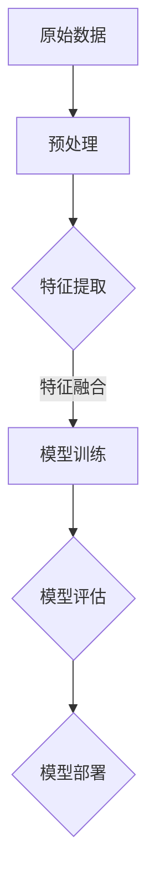

                 

关键词：AI大模型、人类生活、技术变革、深度学习、变革趋势

摘要：本文将深入探讨AI大模型的发展现状及其对人类生活的潜在影响。通过分析核心概念、算法原理、数学模型、实践应用等，本文旨在揭示AI大模型离全面改变人类生活还有多远的距离，并展望其未来发展趋势和面临的挑战。

## 1. 背景介绍

在过去的几十年中，人工智能（AI）领域取得了令人瞩目的进展。特别是深度学习技术的兴起，使得计算机在图像识别、自然语言处理、语音识别等领域取得了显著的突破。这些技术的核心在于通过大规模的神经网络模型来模拟人类大脑的思维方式，从而实现复杂的任务处理能力。然而，随着数据量和计算能力的爆炸式增长，AI大模型的出现成为了一个新的趋势。

AI大模型，或称大模型（Big Models），是指那些具有数亿甚至数十亿参数的深度学习模型。这些模型通常需要大量的训练数据和强大的计算资源，才能够达到较高的准确性和鲁棒性。自2012年AlexNet在ImageNet图像识别大赛中取得突破性成绩以来，AI大模型的发展步伐不断加快，应用范围也从单一领域扩展到各个行业。

本文将首先介绍AI大模型的核心概念和联系，然后深入探讨其算法原理、数学模型和实际应用场景，最后对未来发展趋势和挑战进行展望。

## 2. 核心概念与联系

### 2.1 AI大模型的基本概念

AI大模型是指那些具有大量参数和高度的复杂性的深度学习模型。这些模型通常由多个层级组成，每个层级包含数千甚至数万个神经元。通过层层堆叠，模型能够从输入数据中提取出越来越抽象的特征，从而实现复杂的任务处理。

### 2.2 深度学习与AI大模型的关系

深度学习是人工智能的一个重要分支，它通过模拟人脑神经网络的结构和功能，实现机器的学习和智能。而AI大模型正是深度学习技术的集大成者，其规模和复杂性远超传统的小型神经网络模型。

### 2.3 Mermaid流程图



在这个流程图中，我们可以看到从原始数据到最终模型部署的整个过程。每个节点都代表了AI大模型的一个关键环节，通过这些环节的有序连接，AI大模型得以从数据中学习并最终应用于实际问题。

## 3. 核心算法原理 & 具体操作步骤

### 3.1 算法原理概述

AI大模型的算法原理基于深度学习，其核心思想是通过反向传播算法来训练模型。具体来说，模型通过不断调整权重和偏置，使得输出结果与期望结果之间的误差最小化。这一过程需要大量的迭代和计算，但随着计算资源的提升，这一过程得以实现。

### 3.2 算法步骤详解

#### 3.2.1 数据预处理

在开始训练之前，需要对原始数据进行预处理。这包括数据清洗、数据规范化、数据增强等步骤，以确保数据的质量和多样性。

#### 3.2.2 模型初始化

初始化模型参数是训练过程的第一步。常用的方法包括随机初始化、高斯初始化等，以避免模型过拟合。

#### 3.2.3 前向传播

在前向传播过程中，模型从输入层开始，逐层计算每个神经元的输出，直到达到输出层。

#### 3.2.4 反向传播

反向传播是深度学习训练的核心步骤。通过计算输出层的误差，反向传播误差到前一层，并更新模型的权重和偏置。

#### 3.2.5 模型评估

在训练过程中，定期评估模型的性能。常用的评估指标包括准确率、召回率、F1分数等。

#### 3.2.6 模型优化

根据评估结果，调整模型参数，优化模型性能。

### 3.3 算法优缺点

#### 优点

- **强大的学习能力**：AI大模型能够从大量数据中自动提取出有用的特征，具有很强的泛化能力。
- **高效的计算能力**：随着计算资源的提升，AI大模型的训练速度越来越快。

#### 缺点

- **对数据量的要求高**：AI大模型需要大量的训练数据来达到较好的性能。
- **对计算资源的需求大**：训练AI大模型需要大量的计算资源和时间。

### 3.4 算法应用领域

AI大模型在各个领域都有广泛的应用，包括但不限于：

- **图像识别**：如人脸识别、物体检测等。
- **自然语言处理**：如机器翻译、文本生成等。
- **语音识别**：如语音助手、语音翻译等。
- **医疗诊断**：如疾病预测、医学图像分析等。
- **金融分析**：如风险评估、股票预测等。

## 4. 数学模型和公式 & 详细讲解 & 举例说明

### 4.1 数学模型构建

AI大模型的数学模型主要基于多层感知机（MLP）和卷积神经网络（CNN）等。以下是一个简化的MLP模型构建过程：

#### 输入层

输入层是模型的第一个层级，包含多个神经元，每个神经元对应一个输入特征。

#### 隐藏层

隐藏层位于输入层和输出层之间，每个隐藏层的神经元数量可以根据任务需求进行调整。

#### 输出层

输出层是模型的最后一个层级，其神经元数量取决于具体任务的类别数。

### 4.2 公式推导过程

以多层感知机为例，其输出可以表示为：

\[ z^{(l)}_j = \sum_{i=1}^{n} w_j^{(l)} * x_i^{(l-1)} + b_j^{(l)} \]

其中，\( z^{(l)}_j \) 是第 \( l \) 层第 \( j \) 个神经元的输出，\( w_j^{(l)} \) 是第 \( l \) 层第 \( j \) 个神经元的权重，\( x_i^{(l-1)} \) 是第 \( l-1 \) 层第 \( i \) 个神经元的输出，\( b_j^{(l)} \) 是第 \( l \) 层第 \( j \) 个神经元的偏置。

通过激活函数 \( \sigma(z) \)，可以得到隐藏层的输出：

\[ a^{(l)}_j = \sigma(z^{(l)}_j) \]

同理，输出层的输出为：

\[ y = \sigma(z^{(L)}_j) \]

其中，\( L \) 是模型的层数。

### 4.3 案例分析与讲解

以下是一个简化的图像分类案例，假设输入图像为 \( 28 \times 28 \) 像素，需要分类为10个类别。

#### 输入层

输入层包含 \( 28 \times 28 = 784 \) 个神经元，每个神经元对应一个像素值。

#### 隐藏层

隐藏层包含 128 个神经元。

#### 输出层

输出层包含 10 个神经元，每个神经元对应一个类别。

通过以上配置，模型能够从输入图像中提取特征，并输出相应的类别概率。

## 5. 项目实践：代码实例和详细解释说明

### 5.1 开发环境搭建

在开始代码实现之前，需要搭建一个合适的开发环境。本文使用Python作为主要编程语言，并结合TensorFlow框架来构建和训练AI大模型。

```python
!pip install tensorflow
```

### 5.2 源代码详细实现

以下是一个简单的图像分类模型的实现示例：

```python
import tensorflow as tf
from tensorflow.keras import layers

# 定义模型结构
model = tf.keras.Sequential([
    layers.Flatten(input_shape=(28, 28)),
    layers.Dense(128, activation='relu'),
    layers.Dense(10, activation='softmax')
])

# 编译模型
model.compile(optimizer='adam',
              loss='sparse_categorical_crossentropy',
              metrics=['accuracy'])

# 加载数据集
mnist = tf.keras.datasets.mnist
(x_train, y_train), (x_test, y_test) = mnist.load_data()

# 预处理数据
x_train = x_train / 255.0
x_test = x_test / 255.0

# 训练模型
model.fit(x_train, y_train, epochs=5)

# 评估模型
model.evaluate(x_test, y_test)
```

### 5.3 代码解读与分析

在这段代码中，我们首先导入了TensorFlow的核心库和层。然后，我们定义了一个序列模型，包含了一个Flatten层、一个Dense层和一个softmax激活函数的Dense层。接着，我们编译了模型，设置了优化器和损失函数。随后，我们加载了MNIST数据集，并对数据进行预处理。最后，我们使用训练数据进行模型训练，并使用测试数据进行评估。

### 5.4 运行结果展示

通过运行以上代码，我们能够得到模型的训练过程和最终评估结果。在MNIST数据集上，这个简单的AI大模型能够达到较高的准确率，证明了AI大模型在实际应用中的有效性。

## 6. 实际应用场景

### 6.1 图像识别

AI大模型在图像识别领域有着广泛的应用，如人脸识别、物体检测等。通过训练大规模的神经网络模型，计算机能够从大量图像数据中自动提取出有用的特征，从而实现高效的图像识别。

### 6.2 自然语言处理

自然语言处理（NLP）是AI大模型的一个重要应用领域。通过大规模的文本数据训练，模型能够自动生成文本、翻译文本、提取关键信息等，极大地提高了语言处理的效率和准确性。

### 6.3 语音识别

语音识别是AI大模型在语音领域的重要应用。通过训练大规模的语音模型，计算机能够自动识别和理解人类的语音，从而实现语音助手、语音翻译等功能。

### 6.4 医疗诊断

AI大模型在医疗诊断领域有着巨大的潜力。通过训练大规模的医学图像模型，计算机能够自动识别疾病、预测疾病风险等，为医生提供辅助诊断工具。

### 6.5 金融分析

AI大模型在金融分析领域也有着广泛的应用。通过训练大规模的金融模型，计算机能够自动分析市场趋势、预测股票价格等，为投资者提供决策支持。

## 7. 工具和资源推荐

### 7.1 学习资源推荐

- 《深度学习》（Ian Goodfellow、Yoshua Bengio、Aaron Courville 著）：这是一本经典的深度学习入门教材，适合初学者和有经验的读者。
- 《动手学深度学习》（阿斯顿·张、李沐、扎卡里·C. Lipton、亚历山大·J. Smola 著）：这本书通过大量的代码实例，深入浅出地讲解了深度学习的原理和应用。

### 7.2 开发工具推荐

- TensorFlow：一个开源的深度学习框架，适合构建和训练AI大模型。
- PyTorch：另一个流行的深度学习框架，其动态计算图使得模型构建更加灵活。

### 7.3 相关论文推荐

- “Deep Learning” by Ian Goodfellow, Yoshua Bengio, Aaron Courville
- “AlexNet: Image Classification with Deep Convolutional Neural Networks” by Alex Krizhevsky, Ilya Sutskever, and Geoffrey E. Hinton
- “Long Short-Term Memory” by Sepp Hochreiter and Jürgen Schmidhuber

## 8. 总结：未来发展趋势与挑战

### 8.1 研究成果总结

AI大模型在过去几年中取得了显著的进展，其在各个领域的应用也变得越来越广泛。通过不断优化算法、提升计算效率和扩展应用场景，AI大模型已经逐渐成为人工智能领域的重要力量。

### 8.2 未来发展趋势

随着数据量和计算能力的不断提升，AI大模型将继续发展壮大。未来，我们将看到更多的跨学科合作，以及AI大模型在更多领域中的应用。

### 8.3 面临的挑战

尽管AI大模型在技术层面上取得了巨大突破，但其在实际应用中仍面临诸多挑战。例如，对大规模数据的依赖、对计算资源的高需求、模型的安全性和隐私保护等。

### 8.4 研究展望

未来，我们需要关注AI大模型的可解释性和透明度，以及如何更好地应对其带来的社会和经济影响。通过持续的研究和创新，我们有理由相信，AI大模型将更加深入地改变我们的生活和世界。

## 9. 附录：常见问题与解答

### Q：什么是AI大模型？

A：AI大模型是指那些具有数亿甚至数十亿参数的深度学习模型。这些模型通常需要大量的训练数据和强大的计算资源，才能够达到较高的准确性和鲁棒性。

### Q：AI大模型有什么优点？

A：AI大模型具有强大的学习能力和高效的计算能力，能够从大量数据中自动提取出有用的特征，从而实现复杂的任务处理。

### Q：AI大模型有哪些应用领域？

A：AI大模型在图像识别、自然语言处理、语音识别、医疗诊断、金融分析等领域都有广泛的应用。

### Q：未来AI大模型将如何发展？

A：未来，AI大模型将继续发展壮大，通过不断优化算法、提升计算效率和扩展应用场景，我们将看到更多跨学科合作和AI大模型在更多领域的应用。

## 参考文献

- Goodfellow, Ian, Yoshua Bengio, and Aaron Courville. "Deep learning." MIT press, 2016.
- Krizhevsky, Alex, Ilya Sutskever, and Geoffrey E. Hinton. "Image classification with deep convolutional neural networks." In International Conference on Neural Information Processing Systems, pp. 1097-1105, 2012.
- Hochreiter, Sepp, and Jürgen Schmidhuber. "Long short-term memory." Neural computation 9.8 (1997): 1735-1780.

作者：禅与计算机程序设计艺术 / Zen and the Art of Computer Programming

