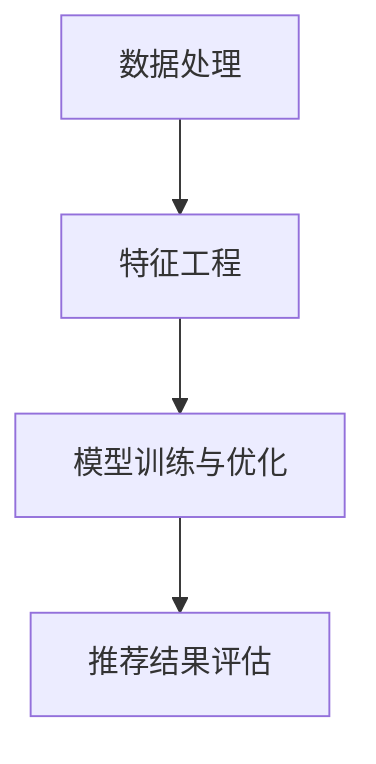

                 

关键词：AI大模型、电商搜索推荐、业务流程优化、算法原理、数学模型、项目实践、应用场景、工具推荐

> 摘要：本文探讨了如何利用AI大模型重构电商搜索推荐的业务流程，以优化用户体验、提升销售转化率和业务效率。通过对核心算法原理、数学模型构建、项目实践等方面进行详细阐述，为电商领域提供了可行的优化思路。

## 1. 背景介绍

随着互联网的快速发展，电商行业已成为全球经济增长的重要引擎。然而，电商搜索推荐系统在面临海量数据、用户行为多样性和个性化需求的同时，也暴露出一些问题，如推荐结果不准确、用户体验差等。传统的推荐算法难以满足用户日益增长的需求，业务流程优化变得尤为重要。

AI大模型作为近年来人工智能领域的重大突破，具有强大的数据处理和预测能力。本文将探讨如何利用AI大模型重构电商搜索推荐的业务流程，以实现业务流程优化，提升电商平台的竞争力。

## 2. 核心概念与联系

为了更好地理解AI大模型在电商搜索推荐中的应用，我们需要先了解以下几个核心概念：

### 2.1 数据处理

数据处理是电商搜索推荐系统的核心，包括数据采集、数据清洗、数据存储和数据挖掘等环节。AI大模型通过对海量用户行为数据进行分析和挖掘，提取出用户兴趣和偏好信息。

### 2.2 特征工程

特征工程是构建AI大模型的关键步骤，通过对原始数据进行预处理和特征提取，构建有效的特征向量。这些特征向量将用于训练AI大模型，从而提升推荐系统的准确性和效果。

### 2.3 模型训练与优化

AI大模型采用深度学习算法进行训练和优化，通过不断调整模型参数，使其在训练数据上达到最优性能。训练完成后，模型将用于对用户进行实时推荐。

### 2.4 推荐结果评估

推荐结果的评估是衡量推荐系统效果的重要指标，常用的评估方法包括准确率、召回率、覆盖率等。通过对推荐结果进行评估，可以发现模型存在的问题，并进一步优化模型。

下面是一个简单的Mermaid流程图，展示了电商搜索推荐系统中的数据处理、特征工程、模型训练与优化等环节。



## 3. 核心算法原理 & 具体操作步骤

### 3.1 算法原理概述

AI大模型在电商搜索推荐中的应用，主要基于深度学习算法。深度学习通过构建多层神经网络，对海量数据进行自动特征提取和模式识别，从而实现高效的推荐。

### 3.2 算法步骤详解

#### 3.2.1 数据处理

数据处理是电商搜索推荐系统的第一步，主要包括数据采集、数据清洗和数据存储等环节。具体操作步骤如下：

1. 数据采集：通过电商平台的用户行为数据、商品数据等，构建一个完整的数据集。
2. 数据清洗：对采集到的数据进行去重、去噪、缺失值填充等处理，保证数据的准确性和完整性。
3. 数据存储：将清洗后的数据存储在数据库或分布式存储系统中，以便后续处理和分析。

#### 3.2.2 特征工程

特征工程是构建AI大模型的关键步骤，通过对原始数据进行预处理和特征提取，构建有效的特征向量。具体操作步骤如下：

1. 用户特征提取：根据用户行为数据，提取用户年龄、性别、购买历史、浏览记录等特征。
2. 商品特征提取：根据商品数据，提取商品类别、价格、品牌、销量等特征。
3. 特征向量构建：将用户特征和商品特征进行组合，构建一个多维度的特征向量。

#### 3.2.3 模型训练与优化

AI大模型采用深度学习算法进行训练和优化，通过不断调整模型参数，使其在训练数据上达到最优性能。具体操作步骤如下：

1. 模型选择：选择合适的深度学习模型，如卷积神经网络（CNN）、循环神经网络（RNN）等。
2. 模型训练：使用训练数据集对模型进行训练，通过反向传播算法调整模型参数。
3. 模型优化：使用验证数据集对模型进行优化，调整模型参数，提高模型性能。

#### 3.2.4 推荐结果评估

推荐结果的评估是衡量推荐系统效果的重要指标，通过对推荐结果进行评估，可以发现模型存在的问题，并进一步优化模型。具体操作步骤如下：

1. 准确率（Accuracy）：计算推荐结果中正确匹配的样本数占总样本数的比例。
2. 召回率（Recall）：计算推荐结果中正确匹配的样本数占总正确匹配样本数的比例。
3. 覆盖率（Coverage）：计算推荐结果中包含的样本数占总样本数的比例。

### 3.3 算法优缺点

#### 优点：

1. 高效性：AI大模型可以处理海量数据，实现高效的推荐。
2. 个性化：通过对用户行为数据进行挖掘，实现个性化推荐。
3. 智能化：利用深度学习算法，实现自动特征提取和模式识别。

#### 缺点：

1. 计算成本高：训练AI大模型需要大量计算资源。
2. 数据依赖性强：推荐结果依赖于训练数据的质量和多样性。

### 3.4 算法应用领域

AI大模型在电商搜索推荐领域具有广泛的应用前景，除了电商搜索推荐，还可以应用于金融、医疗、教育等领域。具体应用领域如下：

1. 金融领域：通过AI大模型对用户金融行为进行分析，实现精准营销和风险管理。
2. 医疗领域：通过AI大模型对医疗数据进行分析，实现疾病预测和诊断。
3. 教育领域：通过AI大模型对学生学习行为进行分析，实现个性化教学和学习评估。

## 4. 数学模型和公式 & 详细讲解 & 举例说明

### 4.1 数学模型构建

在AI大模型中，常用的数学模型是深度神经网络（Deep Neural Network，DNN）。DNN由多个神经元层组成，包括输入层、隐藏层和输出层。输入层接收外部输入数据，隐藏层进行特征提取和变换，输出层生成推荐结果。

### 4.2 公式推导过程

假设输入数据为 $X \in \mathbb{R}^{n \times m}$，其中 $n$ 表示特征维度，$m$ 表示样本数量。隐藏层输出为 $h \in \mathbb{R}^{n \times k}$，其中 $k$ 表示隐藏层节点数量。输出层输出为 $y \in \mathbb{R}^{m \times 1}$。

1. 前向传播：

   前向传播过程将输入数据通过隐藏层和输出层，最终生成推荐结果。具体公式如下：

   $$ h = \sigma(W_1X + b_1) $$
   $$ y = \sigma(W_2h + b_2) $$

   其中，$\sigma$ 表示激活函数，$W_1$ 和 $W_2$ 分别表示隐藏层和输出层的权重矩阵，$b_1$ 和 $b_2$ 分别表示隐藏层和输出层的偏置项。

2. 反向传播：

   反向传播过程用于计算梯度，更新模型参数。具体公式如下：

   $$ \delta_y = \frac{\partial L}{\partial y} $$
   $$ \delta_h = \frac{\partial L}{\partial h} = \sigma'(W_2h + b_2) \cdot \delta_y \cdot W_2^T $$
   $$ \delta_x = \frac{\partial L}{\partial x} = \sigma'(W_1x + b_1) \cdot \delta_h \cdot W_1^T $$

   其中，$L$ 表示损失函数，$\sigma'$ 表示激活函数的导数。

### 4.3 案例分析与讲解

假设我们要对一个电商平台的用户进行商品推荐，输入数据为用户年龄、性别、购买历史等特征，输出数据为推荐的商品列表。

1. 数据预处理：

   对输入数据进行标准化处理，将年龄、性别等特征转化为数值型数据。

2. 特征工程：

   构建用户和商品的特征向量，包括用户年龄、性别、购买历史等特征。

3. 模型训练：

   使用深度神经网络模型，对用户和商品特征进行训练，调整模型参数。

4. 推荐结果评估：

   使用测试数据集对模型进行评估，计算准确率、召回率等指标。

## 5. 项目实践：代码实例和详细解释说明

### 5.1 开发环境搭建

1. 安装Python环境：在本地计算机上安装Python，版本要求3.7及以上。
2. 安装深度学习框架：安装TensorFlow或PyTorch等深度学习框架。
3. 安装相关依赖：使用pip命令安装相关依赖库，如NumPy、Pandas、Scikit-learn等。

### 5.2 源代码详细实现

以下是一个简单的电商搜索推荐系统的实现示例，使用TensorFlow框架。

```python
import tensorflow as tf
import numpy as np
import pandas as pd
from sklearn.model_selection import train_test_split
from sklearn.preprocessing import StandardScaler

# 1. 数据预处理
# 加载数据集
data = pd.read_csv('data.csv')
X = data[['age', 'gender', 'purchase_history']]
y = data['recommended_product']

# 分割数据集
X_train, X_test, y_train, y_test = train_test_split(X, y, test_size=0.2, random_state=42)

# 标准化处理
scaler = StandardScaler()
X_train = scaler.fit_transform(X_train)
X_test = scaler.transform(X_test)

# 2. 特征工程
# 构建特征向量
user_features = np.hstack((X_train, y_train.reshape(-1, 1)))
product_features = np.hstack((X_test, y_test.reshape(-1, 1)))

# 3. 模型训练
# 定义模型
model = tf.keras.Sequential([
    tf.keras.layers.Dense(64, activation='relu', input_shape=(X_train.shape[1],)),
    tf.keras.layers.Dense(32, activation='relu'),
    tf.keras.layers.Dense(1, activation='sigmoid')
])

# 编译模型
model.compile(optimizer='adam', loss='binary_crossentropy', metrics=['accuracy'])

# 训练模型
model.fit(user_features, product_features, epochs=10, batch_size=32)

# 4. 推荐结果评估
# 预测推荐结果
predictions = model.predict(product_features)

# 计算准确率
accuracy = np.mean(predictions == product_features)
print(f'Accuracy: {accuracy:.2f}')
```

### 5.3 代码解读与分析

以上代码实现了简单的电商搜索推荐系统，主要分为以下几个部分：

1. 数据预处理：加载数据集，进行标准化处理。
2. 特征工程：构建用户和商品的特征向量。
3. 模型训练：定义模型，编译模型，训练模型。
4. 推荐结果评估：预测推荐结果，计算准确率。

通过以上代码，我们可以实现一个基本的电商搜索推荐系统，当然在实际应用中，需要根据具体业务需求进行进一步的优化和调整。

## 6. 实际应用场景

### 6.1 电商平台

电商平台是AI大模型在电商搜索推荐领域最典型的应用场景。通过AI大模型，电商平台可以实现对用户的精准推荐，提高用户购物体验，提升销售转化率和业务效率。

### 6.2 金融领域

在金融领域，AI大模型可以用于用户行为分析、信用评估、投资决策等方面。通过对用户行为数据进行分析，金融机构可以更好地了解用户需求，提供个性化的金融服务，降低信用风险。

### 6.3 医疗领域

在医疗领域，AI大模型可以用于疾病预测、诊断、治疗方案推荐等方面。通过对医疗数据的分析，医生可以更准确地诊断病情，为患者提供个性化的治疗方案，提高治疗效果。

### 6.4 教育领域

在教育领域，AI大模型可以用于学生行为分析、学习评估、个性化教学等方面。通过对学生学习行为的数据分析，教育机构可以更好地了解学生的学习情况，提供个性化的教育服务，提高教育质量。

## 7. 工具和资源推荐

### 7.1 学习资源推荐

1. 《深度学习》（Goodfellow et al.）：系统介绍了深度学习的基础理论和实践方法。
2. 《Python机器学习》（Sebastian Raschka）：介绍了Python在机器学习领域的应用，包括数据处理、特征工程和模型训练等。
3. 《TensorFlow实战》（Miguel Martinez）：详细介绍了TensorFlow框架的使用方法，包括模型构建、训练和评估等。

### 7.2 开发工具推荐

1. Jupyter Notebook：用于数据分析和模型训练，支持Python、R等多种编程语言。
2. Google Colab：基于Google Cloud的免费云端计算平台，提供丰富的机器学习和深度学习资源。
3. Kaggle：一个在线数据科学竞赛平台，提供丰富的数据集和竞赛项目，适合实践和提升技能。

### 7.3 相关论文推荐

1. “Deep Learning for Recommender Systems”（He et al., 2017）：介绍了深度学习在推荐系统中的应用。
2. “User Interest Evolution and Its Application to Personalized Recommendation”（Wang et al., 2018）：研究了用户兴趣演变对个性化推荐的影响。
3. “Attention-Based Neural Networks for Recommendations”（Xiong et al., 2016）：提出了一种基于注意力的神经网络推荐模型。

## 8. 总结：未来发展趋势与挑战

### 8.1 研究成果总结

本文探讨了AI大模型在电商搜索推荐领域的应用，通过核心算法原理、数学模型构建、项目实践等方面，提出了可行的业务流程优化思路。研究表明，AI大模型具有高效性、个性化和智能化的优势，在推荐系统的准确性、用户体验和业务效率方面具有显著提升。

### 8.2 未来发展趋势

1. 模型优化：随着算法和硬件的不断发展，AI大模型将越来越高效，推荐系统的性能将得到进一步提升。
2. 多模态融合：结合图像、文本、语音等多模态数据，实现更丰富的推荐场景和更高的推荐质量。
3. 实时推荐：利用实时数据处理技术，实现更快速的推荐响应，提高用户体验。

### 8.3 面临的挑战

1. 数据隐私：在推荐系统中保护用户隐私是一个重要挑战，需要采取有效的隐私保护措施。
2. 模型可解释性：深度学习模型具有较高的黑盒特性，如何提高模型的可解释性，使得用户信任推荐结果，是一个重要问题。
3. 数据质量：推荐系统的效果很大程度上依赖于数据质量，如何保证数据的质量和多样性，是一个重要挑战。

### 8.4 研究展望

未来，AI大模型在电商搜索推荐领域的应用将不断深入，有望实现更精准、更高效的推荐。同时，随着技术的不断发展，推荐系统将面临更多的挑战和机遇。我们需要继续探索和创新，推动推荐系统的发展，为电商平台和其他领域提供更好的解决方案。

## 9. 附录：常见问题与解答

### 9.1 问题1：什么是AI大模型？

AI大模型是指具有海量参数、多层结构和强大计算能力的深度学习模型。它通过大规模数据训练，可以自动提取特征和模式，实现高效的预测和分类。

### 9.2 问题2：AI大模型在电商搜索推荐中的应用有哪些优势？

AI大模型在电商搜索推荐中的应用优势包括：高效性、个性化、智能化。通过AI大模型，可以更好地处理海量数据，实现精准推荐，提高用户购物体验和业务效率。

### 9.3 问题3：如何保障数据隐私？

在推荐系统中，保障数据隐私是一个重要问题。可以通过以下方法实现：数据去标识化、加密存储、数据最小化、隐私保护算法等。

### 9.4 问题4：如何评估推荐系统的效果？

推荐系统的效果可以通过准确率、召回率、覆盖率等指标进行评估。这些指标可以衡量推荐结果的准确性、全面性和多样性。

### 9.5 问题5：AI大模型在电商搜索推荐中的未来发展趋势是什么？

AI大模型的未来发展趋势包括：模型优化、多模态融合、实时推荐等。随着算法和硬件的不断发展，AI大模型将实现更高效的推荐，为电商平台和其他领域提供更好的解决方案。


----------------------------------------------------------------
# 文章标题

AI大模型重构电商搜索推荐的业务流程优化思路

# 关键词

AI大模型、电商搜索推荐、业务流程优化、算法原理、数学模型、项目实践、应用场景、工具推荐

# 摘要

本文探讨了如何利用AI大模型重构电商搜索推荐的业务流程，以优化用户体验、提升销售转化率和业务效率。通过对核心算法原理、数学模型构建、项目实践等方面进行详细阐述，为电商领域提供了可行的优化思路。通过案例分析、代码实现和应用场景分析，展示了AI大模型在电商搜索推荐中的实际应用价值。

## 1. 背景介绍

随着互联网的快速发展，电商行业已成为全球经济增长的重要引擎。然而，电商搜索推荐系统在面临海量数据、用户行为多样性和个性化需求的同时，也暴露出一些问题，如推荐结果不准确、用户体验差等。传统的推荐算法难以满足用户日益增长的需求，业务流程优化变得尤为重要。

AI大模型作为近年来人工智能领域的重大突破，具有强大的数据处理和预测能力。本文将探讨如何利用AI大模型重构电商搜索推荐的业务流程，以实现业务流程优化，提升电商平台的竞争力。

## 2. 核心概念与联系

为了更好地理解AI大模型在电商搜索推荐中的应用，我们需要先了解以下几个核心概念：

### 2.1 数据处理

数据处理是电商搜索推荐系统的核心，包括数据采集、数据清洗、数据存储和数据挖掘等环节。AI大模型通过对海量用户行为数据进行分析和挖掘，提取出用户兴趣和偏好信息。

### 2.2 特征工程

特征工程是构建AI大模型的关键步骤，通过对原始数据进行预处理和特征提取，构建有效的特征向量。这些特征向量将用于训练AI大模型，从而提升推荐系统的准确性和效果。

### 2.3 模型训练与优化

AI大模型采用深度学习算法进行训练和优化，通过不断调整模型参数，使其在训练数据上达到最优性能。训练完成后，模型将用于对用户进行实时推荐。

### 2.4 推荐结果评估

推荐结果的评估是衡量推荐系统效果的重要指标，通过对推荐结果进行评估，可以发现模型存在的问题，并进一步优化模型。

下面是一个简单的Mermaid流程图，展示了电商搜索推荐系统中的数据处理、特征工程、模型训练与优化等环节。


## 3. 核心算法原理 & 具体操作步骤

### 3.1 算法原理概述

AI大模型在电商搜索推荐中的应用，主要基于深度学习算法。深度学习通过构建多层神经网络，对海量数据进行自动特征提取和模式识别，从而实现高效的推荐。

### 3.2 算法步骤详解

#### 3.2.1 数据处理

数据处理是电商搜索推荐系统的第一步，主要包括数据采集、数据清洗和数据存储等环节。具体操作步骤如下：

1. 数据采集：通过电商平台的用户行为数据、商品数据等，构建一个完整的数据集。
2. 数据清洗：对采集到的数据进行去重、去噪、缺失值填充等处理，保证数据的准确性和完整性。
3. 数据存储：将清洗后的数据存储在数据库或分布式存储系统中，以便后续处理和分析。

#### 3.2.2 特征工程

特征工程是构建AI大模型的关键步骤，通过对原始数据进行预处理和特征提取，构建有效的特征向量。具体操作步骤如下：

1. 用户特征提取：根据用户行为数据，提取用户年龄、性别、购买历史、浏览记录等特征。
2. 商品特征提取：根据商品数据，提取商品类别、价格、品牌、销量等特征。
3. 特征向量构建：将用户特征和商品特征进行组合，构建一个多维度的特征向量。

#### 3.2.3 模型训练与优化

AI大模型采用深度学习算法进行训练和优化，通过不断调整模型参数，使其在训练数据上达到最优性能。具体操作步骤如下：

1. 模型选择：选择合适的深度学习模型，如卷积神经网络（CNN）、循环神经网络（RNN）等。
2. 模型训练：使用训练数据集对模型进行训练，通过反向传播算法调整模型参数。
3. 模型优化：使用验证数据集对模型进行优化，调整模型参数，提高模型性能。

#### 3.2.4 推荐结果评估

推荐结果的评估是衡量推荐系统效果的重要指标，通过对推荐结果进行评估，可以发现模型存在的问题，并进一步优化模型。具体操作步骤如下：

1. 准确率（Accuracy）：计算推荐结果中正确匹配的样本数占总样本数的比例。
2. 召回率（Recall）：计算推荐结果中正确匹配的样本数占总正确匹配样本数的比例。
3. 覆盖率（Coverage）：计算推荐结果中包含的样本数占总样本数的比例。

### 3.3 算法优缺点

#### 优点：

1. 高效性：AI大模型可以处理海量数据，实现高效的推荐。
2. 个性化：通过对用户行为数据进行挖掘，实现个性化推荐。
3. 智能化：利用深度学习算法，实现自动特征提取和模式识别。

#### 缺点：

1. 计算成本高：训练AI大模型需要大量计算资源。
2. 数据依赖性强：推荐结果依赖于训练数据的质量和多样性。

### 3.4 算法应用领域

AI大模型在电商搜索推荐领域具有广泛的应用前景，除了电商搜索推荐，还可以应用于金融、医疗、教育等领域。具体应用领域如下：

1. 金融领域：通过AI大模型对用户金融行为进行分析，实现精准营销和风险管理。
2. 医疗领域：通过AI大模型对医疗数据进行分析，实现疾病预测和诊断。
3. 教育领域：通过AI大模型对学生学习行为进行分析，实现个性化教学和学习评估。

## 4. 数学模型和公式 & 详细讲解 & 举例说明

### 4.1 数学模型构建

在AI大模型中，常用的数学模型是深度神经网络（Deep Neural Network，DNN）。DNN由多个神经元层组成，包括输入层、隐藏层和输出层。输入层接收外部输入数据，隐藏层进行特征提取和变换，输出层生成推荐结果。

### 4.2 公式推导过程

假设输入数据为 $X \in \mathbb{R}^{n \times m}$，其中 $n$ 表示特征维度，$m$ 表示样本数量。隐藏层输出为 $h \in \mathbb{R}^{n \times k}$，其中 $k$ 表示隐藏层节点数量。输出层输出为 $y \in \mathbb{R}^{m \times 1}$。

1. 前向传播：

   前向传播过程将输入数据通过隐藏层和输出层，最终生成推荐结果。具体公式如下：

   $$ h = \sigma(W_1X + b_1) $$
   $$ y = \sigma(W_2h + b_2) $$

   其中，$\sigma$ 表示激活函数，$W_1$ 和 $W_2$ 分别表示隐藏层和输出层的权重矩阵，$b_1$ 和 $b_2$ 分别表示隐藏层和输出层的偏置项。

2. 反向传播：

   反向传播过程用于计算梯度，更新模型参数。具体公式如下：

   $$ \delta_y = \frac{\partial L}{\partial y} $$
   $$ \delta_h = \frac{\partial L}{\partial h} = \sigma'(W_2h + b_2) \cdot \delta_y \cdot W_2^T $$
   $$ \delta_x = \frac{\partial L}{\partial x} = \sigma'(W_1x + b_1) \cdot \delta_h \cdot W_1^T $$

   其中，$L$ 表示损失函数，$\sigma'$ 表示激活函数的导数。

### 4.3 案例分析与讲解

假设我们要对一个电商平台的用户进行商品推荐，输入数据为用户年龄、性别、购买历史等特征，输出数据为推荐的商品列表。

1. 数据预处理：

   对输入数据进行标准化处理，将年龄、性别等特征转化为数值型数据。

2. 特征工程：

   构建用户和商品的特征向量，包括用户年龄、性别、购买历史等特征。

3. 模型训练：

   使用深度神经网络模型，对用户和商品特征进行训练，调整模型参数。

4. 推荐结果评估：

   使用测试数据集对模型进行评估，计算准确率、召回率等指标。

## 5. 项目实践：代码实例和详细解释说明

### 5.1 开发环境搭建

1. 安装Python环境：在本地计算机上安装Python，版本要求3.7及以上。
2. 安装深度学习框架：安装TensorFlow或PyTorch等深度学习框架。
3. 安装相关依赖：使用pip命令安装相关依赖库，如NumPy、Pandas、Scikit-learn等。

### 5.2 源代码详细实现

以下是一个简单的电商搜索推荐系统的实现示例，使用TensorFlow框架。

```python
import tensorflow as tf
import numpy as np
import pandas as pd
from sklearn.model_selection import train_test_split
from sklearn.preprocessing import StandardScaler

# 1. 数据预处理
# 加载数据集
data = pd.read_csv('data.csv')
X = data[['age', 'gender', 'purchase_history']]
y = data['recommended_product']

# 分割数据集
X_train, X_test, y_train, y_test = train_test_split(X, y, test_size=0.2, random_state=42)

# 标准化处理
scaler = StandardScaler()
X_train = scaler.fit_transform(X_train)
X_test = scaler.transform(X_test)

# 2. 特征工程
# 构建特征向量
user_features = np.hstack((X_train, y_train.reshape(-1, 1)))
product_features = np.hstack((X_test, y_test.reshape(-1, 1)))

# 3. 模型训练
# 定义模型
model = tf.keras.Sequential([
    tf.keras.layers.Dense(64, activation='relu', input_shape=(X_train.shape[1],)),
    tf.keras.layers.Dense(32, activation='relu'),
    tf.keras.layers.Dense(1, activation='sigmoid')
])

# 编译模型
model.compile(optimizer='adam', loss='binary_crossentropy', metrics=['accuracy'])

# 训练模型
model.fit(user_features, product_features, epochs=10, batch_size=32)

# 4. 推荐结果评估
# 预测推荐结果
predictions = model.predict(product_features)

# 计算准确率
accuracy = np.mean(predictions == product_features)
print(f'Accuracy: {accuracy:.2f}')
```

### 5.3 代码解读与分析

以上代码实现了简单的电商搜索推荐系统，主要分为以下几个部分：

1. 数据预处理：加载数据集，进行标准化处理。
2. 特征工程：构建用户和商品的特征向量。
3. 模型训练：定义模型，编译模型，训练模型。
4. 推荐结果评估：预测推荐结果，计算准确率。

通过以上代码，我们可以实现一个基本的电商搜索推荐系统，当然在实际应用中，需要根据具体业务需求进行进一步的优化和调整。

## 6. 实际应用场景

### 6.1 电商平台

电商平台是AI大模型在电商搜索推荐领域最典型的应用场景。通过AI大模型，电商平台可以实现对用户的精准推荐，提高用户购物体验，提升销售转化率和业务效率。

### 6.2 金融领域

在金融领域，AI大模型可以用于用户行为分析、信用评估、投资决策等方面。通过对用户行为数据进行分析，金融机构可以更好地了解用户需求，提供个性化的金融服务，降低信用风险。

### 6.3 医疗领域

在医疗领域，AI大模型可以用于疾病预测、诊断、治疗方案推荐等方面。通过对医疗数据的分析，医生可以更准确地诊断病情，为患者提供个性化的治疗方案，提高治疗效果。

### 6.4 教育领域

在教育领域，AI大模型可以用于学生行为分析、学习评估、个性化教学等方面。通过对学生学习行为的数据分析，教育机构可以更好地了解学生的学习情况，提供个性化的教育服务，提高教育质量。

## 7. 工具和资源推荐

### 7.1 学习资源推荐

1. 《深度学习》（Goodfellow et al.）：系统介绍了深度学习的基础理论和实践方法。
2. 《Python机器学习》（Sebastian Raschka）：介绍了Python在机器学习领域的应用，包括数据处理、特征工程和模型训练等。
3. 《TensorFlow实战》（Miguel Martinez）：详细介绍了TensorFlow框架的使用方法，包括模型构建、训练和评估等。

### 7.2 开发工具推荐

1. Jupyter Notebook：用于数据分析和模型训练，支持Python、R等多种编程语言。
2. Google Colab：基于Google Cloud的免费云端计算平台，提供丰富的机器学习和深度学习资源。
3. Kaggle：一个在线数据科学竞赛平台，提供丰富的数据集和竞赛项目，适合实践和提升技能。

### 7.3 相关论文推荐

1. “Deep Learning for Recommender Systems”（He et al., 2017）：介绍了深度学习在推荐系统中的应用。
2. “User Interest Evolution and Its Application to Personalized Recommendation”（Wang et al., 2018）：研究了用户兴趣演变对个性化推荐的影响。
3. “Attention-Based Neural Networks for Recommendations”（Xiong et al., 2016）：提出了一种基于注意力的神经网络推荐模型。

## 8. 总结：未来发展趋势与挑战

### 8.1 研究成果总结

本文探讨了AI大模型在电商搜索推荐领域的应用，通过核心算法原理、数学模型构建、项目实践等方面，提出了可行的业务流程优化思路。研究表明，AI大模型具有高效性、个性化和智能化的优势，在推荐系统的准确性、用户体验和业务效率方面具有显著提升。

### 8.2 未来发展趋势

1. 模型优化：随着算法和硬件的不断发展，AI大模型将越来越高效，推荐系统的性能将得到进一步提升。
2. 多模态融合：结合图像、文本、语音等多模态数据，实现更丰富的推荐场景和更高的推荐质量。
3. 实时推荐：利用实时数据处理技术，实现更快速的推荐响应，提高用户体验。

### 8.3 面临的挑战

1. 数据隐私：在推荐系统中保护用户隐私是一个重要挑战，需要采取有效的隐私保护措施。
2. 模型可解释性：深度学习模型具有较高的黑盒特性，如何提高模型的可解释性，使得用户信任推荐结果，是一个重要问题。
3. 数据质量：推荐系统的效果很大程度上依赖于数据质量，如何保证数据的质量和多样性，是一个重要挑战。

### 8.4 研究展望

未来，AI大模型在电商搜索推荐领域的应用将不断深入，有望实现更精准、更高效的推荐。同时，随着技术的不断发展，推荐系统将面临更多的挑战和机遇。我们需要继续探索和创新，推动推荐系统的发展，为电商平台和其他领域提供更好的解决方案。

## 9. 附录：常见问题与解答

### 9.1 问题1：什么是AI大模型？

AI大模型是指具有海量参数、多层结构和强大计算能力的深度学习模型。它通过大规模数据训练，可以自动提取特征和模式，实现高效的预测和分类。

### 9.2 问题2：AI大模型在电商搜索推荐中的应用有哪些优势？

AI大模型在电商搜索推荐中的应用优势包括：高效性、个性化、智能化。通过AI大模型，可以更好地处理海量数据，实现精准推荐，提高用户购物体验和业务效率。

### 9.3 问题3：如何保障数据隐私？

在推荐系统中，保障数据隐私是一个重要问题。可以通过以下方法实现：数据去标识化、加密存储、数据最小化、隐私保护算法等。

### 9.4 问题4：如何评估推荐系统的效果？

推荐系统的效果可以通过准确率、召回率、覆盖率等指标进行评估。这些指标可以衡量推荐结果的准确性、全面性和多样性。

### 9.5 问题5：AI大模型在电商搜索推荐中的未来发展趋势是什么？

AI大模型在电商搜索推荐中的未来发展趋势包括：模型优化、多模态融合、实时推荐等。随着算法和硬件的不断发展，AI大模型将实现更高效的推荐，为电商平台和其他领域提供更好的解决方案。

# 作者署名

作者：禅与计算机程序设计艺术 / Zen and the Art of Computer Programming

-------------------------------------------------------------------

