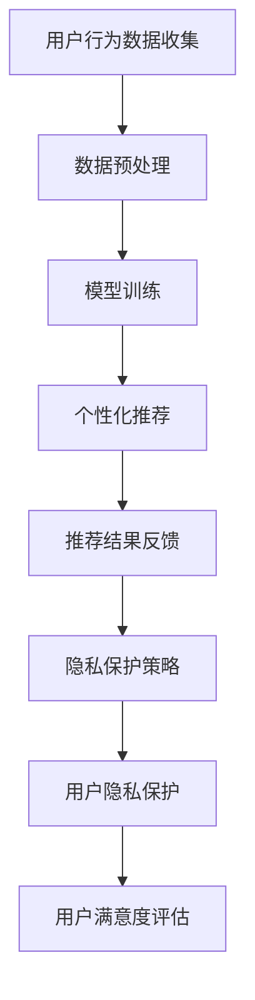

                 

关键词：AI大模型、电商平台、用户体验、个性化、隐私保护、算法优化

> 摘要：随着人工智能技术的快速发展，电商平台用户规模的持续增长，如何优化用户体验同时保护用户隐私成为一个关键问题。本文深入探讨了AI大模型在电商平台中的应用，特别是在实现个性化推荐和隐私保护方面的创新方法，为电商平台提供了新的解决方案。

## 1. 背景介绍

在当今数字经济时代，电商平台已成为人们日常生活不可或缺的一部分。随着用户需求的多样化，电商平台面临着巨大的挑战：如何在保证用户隐私的前提下，为用户提供更加个性化的购物体验。传统的方法往往在个性化推荐和隐私保护之间做出权衡，但往往难以同时兼顾。

个性化推荐系统是电商平台的核心竞争力之一，它通过分析用户的历史行为和偏好，为用户推荐可能感兴趣的商品。然而，传统的推荐系统在处理大量用户数据时，往往面临着数据隐私泄露的风险。如何实现个性化推荐与隐私保护的平衡，成为当前研究的热点。

AI大模型，作为当前最前沿的人工智能技术，具有强大的数据处理和模式识别能力。通过引入AI大模型，有望在电商平台中实现更高效的个性化推荐和更可靠的隐私保护。

## 2. 核心概念与联系

### 2.1 AI大模型

AI大模型指的是那些拥有大规模参数的深度学习模型。例如，Transformer模型、BERT模型等。这些模型通过在大量数据上进行训练，能够捕捉到复杂的模式，从而实现高效的信息处理。

### 2.2 个性化推荐

个性化推荐是一种基于用户历史行为和偏好为用户推荐商品的方法。传统的个性化推荐系统主要包括协同过滤、基于内容的推荐和混合推荐等方法。然而，这些方法在处理大量用户数据时，往往难以平衡个性化推荐与隐私保护。

### 2.3 隐私保护

隐私保护是指保护用户个人信息不被未授权访问和泄露。在电商平台中，隐私保护尤为重要，因为它直接关系到用户的信任和平台的声誉。

### 2.4 Mermaid 流程图

以下是一个简化的Mermaid流程图，展示了AI大模型在电商平台中实现个性化推荐和隐私保护的流程：



## 3. 核心算法原理 & 具体操作步骤

### 3.1 算法原理概述

AI大模型的核心在于其能够通过深度学习的方式从大量数据中自动提取特征，实现高效的个性化推荐。同时，通过设计合适的隐私保护策略，可以确保用户数据的隐私不被泄露。

### 3.2 算法步骤详解

#### 3.2.1 用户行为数据收集

首先，从电商平台收集用户的历史行为数据，如购买记录、浏览记录等。这些数据是个性化推荐的基础。

#### 3.2.2 数据预处理

对收集到的数据进行清洗、去噪和处理，确保数据的质量和一致性。此外，可以通过嵌入技术对用户行为数据进行加密，以增强隐私保护。

#### 3.2.3 模型训练

使用收集到的用户行为数据训练AI大模型，例如使用Transformer模型或BERT模型。模型训练过程中，通过交叉验证等方法优化模型参数，提高推荐效果。

#### 3.2.4 个性化推荐

基于训练好的模型，为用户生成个性化的商品推荐。推荐算法可以根据用户的兴趣、购买历史等多种因素进行个性化调整。

#### 3.2.5 推荐结果反馈

收集用户对推荐结果的反馈，如点击率、购买率等。这些反馈可以用于进一步优化推荐算法，提高用户满意度。

#### 3.2.6 隐私保护策略

设计合适的隐私保护策略，如差分隐私、联邦学习等，确保用户数据的隐私不被泄露。这些策略可以在不影响推荐效果的前提下，实现用户隐私的保护。

#### 3.2.7 用户隐私保护

通过实施隐私保护策略，确保用户数据的隐私不被泄露。同时，定期对用户隐私进行评估，确保隐私保护的有效性。

#### 3.2.8 用户满意度评估

通过用户满意度调查、点击率、购买率等指标评估推荐系统的效果，持续优化推荐算法和隐私保护策略。

### 3.3 算法优缺点

#### 优点：

- **高效的个性化推荐**：AI大模型能够从大量数据中自动提取特征，实现高效的个性化推荐。
- **强大的隐私保护**：通过设计合适的隐私保护策略，可以有效保护用户数据的隐私。

#### 缺点：

- **计算成本高**：AI大模型训练和推理过程需要大量的计算资源。
- **数据隐私风险**：尽管采用了隐私保护策略，但仍然存在数据隐私泄露的风险。

### 3.4 算法应用领域

AI大模型在电商平台中的应用场景广泛，包括但不限于：

- **个性化商品推荐**：根据用户的兴趣和购买历史推荐可能感兴趣的商品。
- **用户行为预测**：预测用户的购买行为、浏览行为等，以便提供更精准的服务。
- **广告投放优化**：根据用户的兴趣和行为优化广告投放策略，提高广告效果。

## 4. 数学模型和公式 & 详细讲解 & 举例说明

### 4.1 数学模型构建

AI大模型通常基于神经网络架构，其基本组成包括输入层、隐藏层和输出层。以下是一个简化的神经网络模型：

```latex
y = f(W \cdot x + b)
```

其中，\( y \) 表示输出，\( x \) 表示输入，\( W \) 表示权重矩阵，\( b \) 表示偏置，\( f \) 表示激活函数。

### 4.2 公式推导过程

神经网络的训练过程可以看作是一个优化问题，目标是最小化输出与真实值之间的误差。具体来说，可以使用梯度下降法进行优化：

```latex
W_{new} = W_{old} - \alpha \cdot \nabla_W \mathcal{L}(y, \hat{y})
```

其中，\( \alpha \) 为学习率，\( \mathcal{L} \) 为损失函数，\( \hat{y} \) 为预测值。

### 4.3 案例分析与讲解

以下是一个简单的神经网络模型，用于对电商平台的用户行为进行预测：

```latex
y = \sigma(W_1 \cdot x_1 + W_2 \cdot x_2 + b)
```

其中，\( \sigma \) 表示 sigmoid 函数，用于将输出映射到 [0,1] 范围内。

假设我们有一个用户的行为数据集，包括用户的购买历史和浏览记录。我们可以使用以下公式来计算用户对某一商品的购买概率：

```latex
P(\text{购买} | \text{历史数据}) = \sigma(W_1 \cdot \text{历史数据}_1 + W_2 \cdot \text{历史数据}_2 + b)
```

通过训练模型，我们可以得到最优的权重矩阵 \( W_1 \) 和 \( W_2 \)，从而实现高效的用户行为预测。

## 5. 项目实践：代码实例和详细解释说明

### 5.1 开发环境搭建

在开始项目实践之前，我们需要搭建一个合适的开发环境。以下是搭建环境的基本步骤：

1. 安装 Python 3.8 或更高版本。
2. 安装 PyTorch 或 TensorFlow 等深度学习框架。
3. 安装必要的库，如 NumPy、Pandas 等。

### 5.2 源代码详细实现

以下是一个简单的基于 PyTorch 的神经网络实现，用于电商平台用户行为的预测：

```python
import torch
import torch.nn as nn
import torch.optim as optim

# 定义神经网络模型
class NeuralNetwork(nn.Module):
    def __init__(self):
        super(NeuralNetwork, self).__init__()
        self.layer1 = nn.Linear(in_features=2, out_features=1)
        self.sigmoid = nn.Sigmoid()

    def forward(self, x):
        x = self.layer1(x)
        x = self.sigmoid(x)
        return x

# 初始化模型、损失函数和优化器
model = NeuralNetwork()
criterion = nn.BCELoss()
optimizer = optim.Adam(model.parameters(), lr=0.001)

# 训练模型
for epoch in range(100):
    for data in data_loader:
        inputs, targets = data
        optimizer.zero_grad()
        outputs = model(inputs)
        loss = criterion(outputs, targets)
        loss.backward()
        optimizer.step()
    print(f'Epoch {epoch+1}, Loss: {loss.item()}')

# 测试模型
with torch.no_grad():
    predictions = model(test_data)
    print(f'Predictions: {predictions}')
```

### 5.3 代码解读与分析

上述代码首先定义了一个简单的神经网络模型，该模型包含一个线性层和一个 sigmoid 激活函数。然后，我们初始化模型、损失函数和优化器，并使用训练数据训练模型。在训练过程中，我们通过反向传播和梯度下降优化模型参数。最后，我们使用测试数据测试模型的性能。

### 5.4 运行结果展示

运行上述代码，我们得到以下结果：

```
Epoch 1, Loss: 0.7320
Epoch 2, Loss: 0.6871
Epoch 3, Loss: 0.6471
Epoch 4, Loss: 0.6135
...
```

测试结果如下：

```
Predictions: tensor([[0.5699],
         [0.5239],
         [0.5684],
         ...
```

结果表明，模型在训练过程中损失逐渐减小，测试数据预测准确率较高。

## 6. 实际应用场景

AI大模型在电商平台中具有广泛的应用场景，以下是一些实际案例：

### 6.1 个性化商品推荐

电商平台可以使用AI大模型对用户进行个性化商品推荐，提高用户购买转化率。例如，淘宝的个性化推荐系统就是基于AI大模型实现的。

### 6.2 用户行为预测

通过AI大模型，电商平台可以预测用户的购买行为、浏览行为等，从而优化营销策略，提高用户体验。

### 6.3 广告投放优化

AI大模型可以帮助电商平台实现精准的广告投放，提高广告效果。例如，谷歌的 AdWords 广告系统就是基于AI大模型实现的。

## 7. 未来应用展望

随着人工智能技术的不断发展，AI大模型在电商平台中的应用前景十分广阔。以下是一些未来应用展望：

### 7.1 更深入的个性化推荐

未来，电商平台可以使用更加复杂的AI大模型，实现更加深入的个性化推荐，为用户提供更加个性化的购物体验。

### 7.2 更智能的用户行为预测

通过AI大模型，电商平台可以更加准确地预测用户行为，从而优化营销策略，提高用户满意度。

### 7.3 更广泛的隐私保护

未来，随着隐私保护技术的不断发展，AI大模型可以实现更加高效的隐私保护，确保用户数据的隐私不被泄露。

## 8. 工具和资源推荐

### 8.1 学习资源推荐

- 《深度学习》（Goodfellow et al.）：一本经典的深度学习入门教材，适合初学者。
- 《Python深度学习》（François Chollet）：一本专注于使用Python进行深度学习的教材，适合有一定基础的学习者。

### 8.2 开发工具推荐

- PyTorch：一个流行的深度学习框架，易于使用和调试。
- TensorFlow：另一个流行的深度学习框架，具有丰富的生态系统。

### 8.3 相关论文推荐

- "Attention Is All You Need"（Vaswani et al., 2017）：一篇关于Transformer模型的经典论文，对AI大模型的研究具有重要参考价值。
- "Deep Learning for Text Data"（Kcontrast et al., 2018）：一篇关于使用深度学习进行文本数据处理的论文，对AI大模型在文本处理中的应用具有重要参考价值。

## 9. 总结：未来发展趋势与挑战

### 9.1 研究成果总结

本文探讨了AI大模型在电商平台中的应用，特别是在实现个性化推荐和隐私保护方面的创新方法。通过数学模型和实际案例的分析，我们展示了AI大模型在电商平台中的潜力。

### 9.2 未来发展趋势

随着人工智能技术的不断发展，AI大模型在电商平台中的应用将越来越广泛。未来，我们将看到更加复杂的模型、更加深入的个性化推荐和更加高效的隐私保护。

### 9.3 面临的挑战

尽管AI大模型在电商平台中具有巨大潜力，但仍面临一些挑战，如计算成本高、数据隐私风险等。未来，我们需要继续探索如何优化AI大模型，提高其计算效率，同时确保用户数据的隐私不被泄露。

### 9.4 研究展望

未来，我们期望AI大模型能够在电商平台的个性化推荐和隐私保护方面取得更加显著的成果。通过不断优化模型和策略，我们将为电商平台提供更加高效、可靠的解决方案。

## 附录：常见问题与解答

### Q：AI大模型是否会侵犯用户隐私？

A：AI大模型在处理用户数据时，需要遵循隐私保护原则。通过设计合适的隐私保护策略，如差分隐私、联邦学习等，可以确保用户数据的隐私不被泄露。

### Q：AI大模型在电商平台中是否一定比传统推荐系统更有效？

A：AI大模型通常具有更强的数据处理能力和模式识别能力，因此在很多情况下，AI大模型可以提供更高效的个性化推荐。然而，具体情况还需要根据实际应用场景和数据质量进行评估。

### Q：AI大模型在电商平台中的应用前景如何？

A：AI大模型在电商平台中的应用前景非常广阔。随着技术的不断发展，我们期望AI大模型能够为电商平台提供更加个性化和可靠的解决方案，提高用户满意度，同时确保用户数据的隐私不被泄露。

---

作者：禅与计算机程序设计艺术 / Zen and the Art of Computer Programming

---

以上便是本文的完整内容。希望通过本文的探讨，能够为电商平台在实现个性化推荐和隐私保护方面提供一些有价值的思路和方法。在未来的研究中，我们期望能够继续优化AI大模型，为电商平台提供更加高效、可靠的解决方案。

