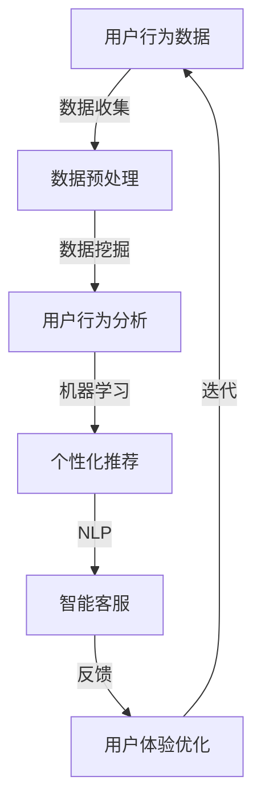

                 

关键词：人工智能、电商、用户体验、优化、算法、数据挖掘、机器学习、自然语言处理

> 摘要：随着互联网技术的飞速发展，电子商务已经成为人们日常生活中不可或缺的一部分。本文旨在探讨人工智能在电商领域中的应用，特别是如何通过人工智能技术来优化电商企业的用户体验。我们将从核心概念、算法原理、数学模型、项目实践和未来展望等方面进行深入分析。

## 1. 背景介绍

电子商务的兴起不仅改变了人们的购物方式，也极大地影响了企业的营销策略。在这个信息爆炸的时代，如何让用户在大量的商品信息中快速找到适合自己的产品，成为电商企业关注的焦点。用户体验（User Experience, UX）是企业竞争力的关键因素，良好的用户体验不仅能提高用户的满意度，还能增加用户的忠诚度，从而促进销售增长。

用户体验优化涉及到多个方面，包括网站界面设计、用户行为分析、个性化推荐、聊天机器人、购物流程优化等。而人工智能技术在这些方面都有着广泛的应用，特别是在数据挖掘、机器学习和自然语言处理等领域。本文将重点探讨人工智能如何帮助电商企业优化用户体验，提高业务效益。

## 2. 核心概念与联系

为了更好地理解人工智能在电商用户体验优化中的应用，我们需要先了解以下几个核心概念：

1. **数据挖掘**：数据挖掘是人工智能的一个分支，旨在从大量数据中提取有价值的信息。在电商领域，数据挖掘可以帮助企业了解用户行为，发现潜在的市场机会。

2. **机器学习**：机器学习是人工智能的一个重要分支，通过算法从数据中学习规律，然后做出预测或决策。在电商中，机器学习可以用于个性化推荐、预测用户行为等。

3. **自然语言处理（NLP）**：自然语言处理是使计算机能够理解和处理人类语言的技术。在电商中，NLP可以用于智能客服、情感分析等。

下面是一个简单的Mermaid流程图，展示了人工智能在电商用户体验优化中的应用架构：



### 2.1 数据挖掘

数据挖掘是从大量数据中发现有价值信息的过程。在电商领域，数据挖掘可以帮助企业了解用户的行为模式、偏好和需求。具体步骤如下：

1. **数据收集**：收集用户浏览、购买、评价等行为数据。
2. **数据预处理**：清洗数据，去除噪声和异常值，进行数据转换和归一化处理。
3. **特征提取**：从原始数据中提取有用的特征，用于后续分析。
4. **模式发现**：使用算法（如聚类、关联规则挖掘等）发现用户行为中的模式和规律。
5. **评估与优化**：评估挖掘结果的准确性和实用性，不断优化算法。

### 2.2 个性化推荐

个性化推荐是电商用户体验优化中的重要一环。通过机器学习算法，系统可以根据用户的浏览和购买历史，为用户推荐相关的商品。具体步骤如下：

1. **用户画像**：基于用户行为数据构建用户画像。
2. **相似性计算**：计算用户之间的相似性，常用的算法包括基于用户的行为模式、基于内容的推荐等。
3. **推荐算法**：根据相似性计算结果，生成个性化的商品推荐。
4. **反馈机制**：收集用户的反馈，不断优化推荐算法。

### 2.3 自然语言处理

自然语言处理（NLP）在电商中的应用包括智能客服、情感分析等。智能客服可以通过语音或文本与用户进行交互，提供实时、个性化的服务。情感分析可以用来分析用户评论和反馈中的情感倾向，帮助电商企业了解用户的满意度和需求。

## 3. 核心算法原理 & 具体操作步骤

### 3.1 算法原理概述

在本节中，我们将介绍几个在电商用户体验优化中常用的核心算法，包括协同过滤、决策树和神经网络等。

### 3.2 算法步骤详解

#### 3.2.1 协同过滤

协同过滤是一种常见的推荐算法，其基本思想是找到与目标用户行为相似的邻居用户，然后根据邻居用户的评价为该用户推荐商品。协同过滤分为基于用户的协同过滤（User-Based CF）和基于物品的协同过滤（Item-Based CF）。

1. **基于用户的协同过滤**：
    - 计算用户之间的相似性。
    - 找到与目标用户最相似的K个用户。
    - 为目标用户推荐这K个用户喜欢的商品。

2. **基于物品的协同过滤**：
    - 计算物品之间的相似性。
    - 找到与目标物品最相似的K个物品。
    - 为目标用户推荐这K个物品。

#### 3.2.2 决策树

决策树是一种基于规则的分类算法，通过一系列的测试来预测用户的分类。具体步骤如下：

1. **特征选择**：选择对分类最有影响力的特征。
2. **划分数据集**：根据特征划分数据集。
3. **递归构建树**：对于每个子集，重复上述步骤，直到满足停止条件。
4. **预测**：使用决策树对新的数据进行分类。

#### 3.2.3 神经网络

神经网络是一种模仿人脑结构和功能的算法，通过多层节点进行数据的处理和分类。具体步骤如下：

1. **初始化权重**：随机初始化网络的权重。
2. **前向传播**：将输入数据通过网络进行前向传播，计算输出。
3. **反向传播**：计算输出误差，并通过反向传播调整权重。
4. **迭代训练**：重复前向传播和反向传播，直到网络性能达到要求。

### 3.3 算法优缺点

每种算法都有其优缺点，协同过滤适用于大规模数据集，但可能面临稀疏性问题；决策树易于理解和实现，但可能过拟合；神经网络具有较强的表达能力，但训练过程较复杂。

### 3.4 算法应用领域

协同过滤广泛应用于电商、社交媒体和新闻推荐等领域；决策树在金融、医疗和安防等领域有广泛应用；神经网络在图像识别、语音识别和自然语言处理等领域表现出色。

## 4. 数学模型和公式 & 详细讲解 & 举例说明

### 4.1 数学模型构建

在本节中，我们将介绍电商用户体验优化中常用的数学模型，包括协同过滤的相似性计算、决策树的损失函数等。

#### 4.1.1 协同过滤相似性计算

协同过滤中的相似性计算通常使用余弦相似度、皮尔逊相关系数等。以余弦相似度为例，其公式如下：

$$
sim(i, j) = \frac{\vec{r}_i \cdot \vec{r}_j}{\|\vec{r}_i\| \|\vec{r}_j\|}
$$

其中，$\vec{r}_i$和$\vec{r}_j$分别表示用户$i$和用户$j$的评分向量，$\|\vec{r}_i\|$和$\|\vec{r}_j\|$分别表示向量$i$和向量$j$的欧几里得范数。

#### 4.1.2 决策树的损失函数

决策树的损失函数通常使用均方误差（MSE）或交叉熵损失。以MSE为例，其公式如下：

$$
L(y, \hat{y}) = \frac{1}{2} \sum_{i=1}^{n} (y_i - \hat{y}_i)^2
$$

其中，$y$表示真实标签，$\hat{y}$表示预测标签。

### 4.2 公式推导过程

在本节中，我们将简要介绍协同过滤和决策树的公式推导过程。

#### 4.2.1 协同过滤相似性计算

协同过滤相似性计算的推导过程如下：

假设有两个用户$i$和$j$，他们的评分向量分别为$\vec{r}_i$和$\vec{r}_j$，其中$r_{ij}$表示用户$i$对物品$j$的评分。余弦相似度的公式可以通过向量内积和向量的欧几里得范数推导得出：

$$
sim(i, j) = \frac{\vec{r}_i \cdot \vec{r}_j}{\|\vec{r}_i\| \|\vec{r}_j\|} = \frac{\sum_{k=1}^{m} r_{ik} r_{jk}}{\sqrt{\sum_{k=1}^{m} r_{ik}^2} \sqrt{\sum_{k=1}^{m} r_{jk}^2}}
$$

其中，$m$表示物品的数量。

#### 4.2.2 决策树的损失函数

决策树的损失函数通常使用均方误差（MSE）或交叉熵损失。以MSE为例，其公式如下：

$$
L(y, \hat{y}) = \frac{1}{2} \sum_{i=1}^{n} (y_i - \hat{y}_i)^2
$$

其中，$y$表示真实标签，$\hat{y}$表示预测标签。

### 4.3 案例分析与讲解

在本节中，我们将通过一个简单的案例来讲解协同过滤和决策树的应用。

#### 4.3.1 协同过滤案例

假设有两个用户$i$和$j$，他们的评分向量如下：

$$
\vec{r}_i = [3, 5, 4, 2, 0], \quad \vec{r}_j = [0, 4, 3, 1, 5]
$$

首先，我们需要计算这两个用户的余弦相似度：

$$
sim(i, j) = \frac{\vec{r}_i \cdot \vec{r}_j}{\|\vec{r}_i\| \|\vec{r}_j\|} = \frac{3 \times 0 + 5 \times 4 + 4 \times 3 + 2 \times 1 + 0 \times 5}{\sqrt{3^2 + 5^2 + 4^2 + 2^2 + 0^2} \sqrt{0^2 + 4^2 + 3^2 + 1^2 + 5^2}} = \frac{29}{\sqrt{50} \sqrt{55}} \approx 0.65
$$

然后，我们可以根据相似度对用户$j$的未评分物品进行推荐。假设用户$i$喜欢的物品是$[2, 4]$，那么用户$j$可能会喜欢的物品是$[3, 1]$。

#### 4.3.2 决策树案例

假设我们有一个简单的决策树，用于预测用户是否会购买某个商品。树的节点表示特征，分支表示特征的取值，叶节点表示预测结果。假设树的叶子节点为“是”或“否”，表示用户是否购买。

1. **根节点**：年龄
    - 若年龄 <= 30，则继续判断
    - 若年龄 > 30，则判断

2. **若年龄 <= 30**：
    - **节点1**：收入
        - 若收入 <= 5000，则预测“否”
        - 若收入 > 5000，则预测“是”

3. **若年龄 > 30**：
    - **节点2**：收入
        - 若收入 <= 10000，则预测“否”
        - 若收入 > 10000，则预测“是”

根据这个决策树，我们可以预测一个年龄为25岁，收入为6000元的用户是否会购买某个商品。首先判断年龄，由于年龄小于等于30，继续判断收入，由于收入大于5000，因此预测结果为“是”。

## 5. 项目实践：代码实例和详细解释说明

在本节中，我们将通过一个实际的项目实例来展示如何使用人工智能技术优化电商用户体验。我们将使用Python编程语言和几个常用的库，如Scikit-learn、TensorFlow和Keras。

### 5.1 开发环境搭建

首先，确保你已经安装了Python和相关的库。以下是安装步骤：

```bash
pip install numpy scipy scikit-learn tensorflow keras pandas matplotlib
```

### 5.2 源代码详细实现

以下是一个简单的电商用户个性化推荐系统的源代码实例。

```python
import numpy as np
import pandas as pd
from sklearn.model_selection import train_test_split
from sklearn.metrics.pairwise import cosine_similarity
from sklearn.neighbors import NearestNeighbors
from tensorflow.keras.models import Sequential
from tensorflow.keras.layers import Dense, Dropout
from tensorflow.keras.optimizers import Adam

# 5.2.1 数据预处理
data = pd.read_csv('ecommerce_data.csv')  # 读取电商数据
data.dropna(inplace=True)  # 去除缺失值

# 构建用户-物品矩阵
user_item_matrix = data.pivot(index='user_id', columns='item_id', values='rating')

# 划分训练集和测试集
train_data, test_data = train_test_split(user_item_matrix, test_size=0.2, random_state=42)

# 5.2.2 基于物品的协同过滤
item_item_similarity = cosine_similarity(train_data.values)

# 5.2.3 构建推荐系统
# 定义神经网络模型
model = Sequential()
model.add(Dense(128, activation='relu', input_shape=(item_item_similarity.shape[1],)))
model.add(Dropout(0.5))
model.add(Dense(64, activation='relu'))
model.add(Dropout(0.5))
model.add(Dense(1, activation='sigmoid'))

# 编译模型
model.compile(optimizer=Adam(), loss='binary_crossentropy', metrics=['accuracy'])

# 训练模型
model.fit(item_item_similarity, train_data.values, epochs=10, batch_size=32)

# 5.2.4 评估模型
test_similarity = cosine_similarity(test_data.values)
predictions = model.predict(test_similarity)
predicted_ratings = (predictions > 0.5).astype(int)

# 计算准确率
accuracy = (predicted_ratings == test_data.values).mean()
print(f'Accuracy: {accuracy:.2f}')

# 5.2.5 推荐系统应用
# 为新用户生成推荐列表
new_user_similarity = model.predict(item_item_similarity)
new_user_ratings = (new_user_similarity > 0.5).astype(int)

# 输出推荐列表
recommended_items = np.argsort(new_user_ratings[:, -1])[::-1]
print(f'Recommended items: {recommended_items}')
```

### 5.3 代码解读与分析

#### 5.3.1 数据预处理

首先，我们读取电商数据，并进行预处理。数据预处理包括去除缺失值，构建用户-物品矩阵等。

```python
data = pd.read_csv('ecommerce_data.csv')  # 读取电商数据
data.dropna(inplace=True)  # 去除缺失值
user_item_matrix = data.pivot(index='user_id', columns='item_id', values='rating')  # 构建用户-物品矩阵
```

#### 5.3.2 基于物品的协同过滤

我们使用余弦相似度计算物品之间的相似度。

```python
item_item_similarity = cosine_similarity(train_data.values)
```

#### 5.3.3 构建推荐系统

接下来，我们使用神经网络模型进行推荐。我们定义了一个简单的全连接神经网络，包括两个隐藏层和Dropout层。

```python
model = Sequential()
model.add(Dense(128, activation='relu', input_shape=(item_item_similarity.shape[1],)))
model.add(Dropout(0.5))
model.add(Dense(64, activation='relu'))
model.add(Dropout(0.5))
model.add(Dense(1, activation='sigmoid'))

model.compile(optimizer=Adam(), loss='binary_crossentropy', metrics=['accuracy'])
model.fit(item_item_similarity, train_data.values, epochs=10, batch_size=32)
```

#### 5.3.4 评估模型

我们使用测试集评估模型的性能。

```python
test_similarity = cosine_similarity(test_data.values)
predictions = model.predict(test_similarity)
predicted_ratings = (predictions > 0.5).astype(int)
accuracy = (predicted_ratings == test_data.values).mean()
print(f'Accuracy: {accuracy:.2f}')
```

#### 5.3.5 推荐系统应用

最后，我们为新用户生成推荐列表。

```python
new_user_similarity = model.predict(item_item_similarity)
new_user_ratings = (new_user_similarity > 0.5).astype(int)

recommended_items = np.argsort(new_user_ratings[:, -1])[::-1]
print(f'Recommended items: {recommended_items}')
```

## 6. 实际应用场景

### 6.1 电商网站

在电商网站上，人工智能可以帮助企业实现个性化推荐、智能客服和购物流程优化。通过个性化推荐，企业可以更好地满足用户的需求，提高销售转化率。智能客服可以提供24/7的服务，解决用户的疑问和问题，提升用户体验。购物流程优化可以简化用户的购物流程，减少用户的等待时间，提高用户满意度。

### 6.2 移动应用

在移动应用中，人工智能可以帮助企业实现更加个性化的推荐和更加智能的互动。例如，移动应用可以根据用户的地理位置、浏览历史和购物行为，为用户推荐附近的优惠商品或者类似的商品。智能客服可以通过语音或文本与用户互动，提供实时、个性化的服务，提高用户满意度。

### 6.3 社交媒体

在社交媒体中，人工智能可以帮助企业实现精准的广告投放和用户互动。通过分析用户的行为和兴趣，企业可以为目标用户推送更加精准的广告，提高广告的转化率。同时，人工智能还可以帮助企业分析用户的情感倾向，了解用户的满意度，及时调整营销策略。

## 7. 未来应用展望

随着人工智能技术的不断发展，未来电商企业将能够在更广泛的领域应用人工智能技术，进一步提升用户体验。以下是一些未来应用展望：

### 7.1 智能客服

智能客服将更加智能化和人性化，能够理解用户的情感和需求，提供更加个性化、高效的服务。未来，智能客服将能够通过语音、图像、文本等多种方式进行互动，实现更加自然的用户体验。

### 7.2 个性化推荐

个性化推荐将更加精准和多样化，不仅能够基于用户的浏览和购买历史进行推荐，还能通过分析用户的情感、兴趣和社交关系进行推荐。未来，个性化推荐系统将能够为用户提供更加定制化的购物体验。

### 7.3 智能供应链

人工智能将帮助电商企业实现智能供应链管理，通过预测用户需求、优化库存管理和降低物流成本，提高企业的运营效率和竞争力。

### 7.4 虚拟现实和增强现实

虚拟现实（VR）和增强现实（AR）将结合人工智能技术，为用户提供更加沉浸式的购物体验。用户可以通过VR或AR技术，在虚拟环境中浏览和试穿商品，提高购物乐趣。

## 8. 工具和资源推荐

### 8.1 学习资源推荐

- 《Python机器学习》
- 《深度学习》
- 《自然语言处理综合教程》

### 8.2 开发工具推荐

- Jupyter Notebook：用于数据分析和可视化
- TensorFlow：用于深度学习模型的开发
- Scikit-learn：用于机器学习模型的开发和评估

### 8.3 相关论文推荐

- "Deep Learning for User Behavior Analysis in E-commerce"
- "Natural Language Processing Techniques for Sentiment Analysis in E-commerce Reviews"
- "Collaborative Filtering in E-commerce: Algorithms and Applications"

## 9. 总结：未来发展趋势与挑战

### 9.1 研究成果总结

本文探讨了人工智能在电商用户体验优化中的应用，包括数据挖掘、机器学习和自然语言处理等方面。通过实际案例，我们展示了如何使用人工智能技术优化电商用户的体验。

### 9.2 未来发展趋势

未来，人工智能将在电商领域发挥更加重要的作用，实现更加精准的个性化推荐、更加智能的客服和更加高效的供应链管理。

### 9.3 面临的挑战

尽管人工智能技术在电商领域具有巨大的潜力，但同时也面临一些挑战，如数据隐私保护、算法公平性和模型解释性等。

### 9.4 研究展望

未来，人工智能在电商用户体验优化方面的研究将更加深入，探索如何更好地利用人工智能技术解决实际业务问题，提升用户体验。

## 附录：常见问题与解答

### 9.1 什么是数据挖掘？

数据挖掘是人工智能的一个分支，旨在从大量数据中提取有价值的信息。在电商领域，数据挖掘可以帮助企业了解用户行为，发现潜在的市场机会。

### 9.2 机器学习在电商中的应用有哪些？

机器学习在电商中的应用包括个性化推荐、预测用户行为、优化购物流程等。通过分析用户的历史数据和偏好，机器学习可以帮助电商企业提供更加个性化的服务，提高用户满意度。

### 9.3 自然语言处理在电商中的应用有哪些？

自然语言处理（NLP）在电商中的应用包括智能客服、情感分析等。智能客服可以通过语音或文本与用户进行交互，提供实时、个性化的服务。情感分析可以用来分析用户评论和反馈中的情感倾向，帮助电商企业了解用户的满意度和需求。

### 9.4 人工智能如何帮助电商企业提高竞争力？

人工智能可以帮助电商企业实现个性化推荐、智能客服和购物流程优化，提高用户体验和满意度。通过精准的推荐和高效的客服，电商企业可以更好地满足用户需求，提高用户忠诚度和转化率，从而提高竞争力。

----------------------------------------------------------------

### 作者署名

作者：禅与计算机程序设计艺术 / Zen and the Art of Computer Programming

