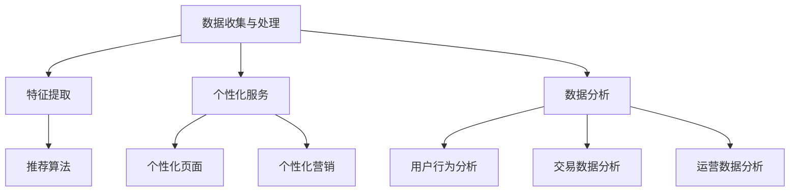

                 

关键词：人工智能、电商行业、智能推荐、个性化服务、数据分析、自然语言处理

> 摘要：本文将探讨人工智能（AI）在电商行业的应用，分析AI如何通过智能推荐系统、个性化服务和数据分析等技术手段，推动电商行业向更高效、更智能的方向发展。文章将深入探讨AI的核心算法原理、数学模型、项目实践及未来发展趋势。

## 1. 背景介绍

电商行业作为数字经济的重要组成部分，近年来发展迅猛。随着互联网技术的普及和消费者需求的多样化和个性化，电商企业面临巨大的竞争压力。如何提高运营效率、提升用户体验、降低成本成为电商企业亟待解决的问题。此时，人工智能（AI）技术的出现，为电商行业带来了一场革命。

AI技术具有自我学习、自适应、数据分析和智能决策等能力，能够处理海量数据并从中提取有价值的信息，为电商企业提供更加精准、高效的解决方案。本文将重点探讨AI在电商行业中的具体应用，以及如何推动电商行业向更高效、更智能的方向发展。

## 2. 核心概念与联系

### 2.1. 智能推荐系统

智能推荐系统是AI在电商行业中的核心应用之一。它通过分析用户历史行为、购买偏好和兴趣爱好，为用户推荐个性化商品和内容。智能推荐系统主要包括以下三个核心组成部分：

#### 2.1.1. 数据收集与处理

数据收集与处理是智能推荐系统的基石。通过收集用户在电商平台的浏览记录、购买行为、评价等信息，智能推荐系统可以构建出用户画像，为个性化推荐提供数据支撑。

#### 2.1.2. 特征提取

特征提取是将原始数据转换为计算机可以理解和处理的特征表示。常见的特征提取方法包括用户行为特征、商品属性特征和文本特征等。

#### 2.1.3. 推荐算法

推荐算法是智能推荐系统的核心。常用的推荐算法包括基于内容的推荐（CBR）、协同过滤（CF）和深度学习（DL）等。

### 2.2. 个性化服务

个性化服务是基于用户画像和兴趣标签，为用户提供定制化、个性化的购物体验。个性化服务包括以下两个方面：

#### 2.2.1. 个性化页面

个性化页面根据用户的历史行为和兴趣爱好，为用户展示相关商品、优惠信息和活动，提高用户购物体验。

#### 2.2.2. 个性化营销

个性化营销通过分析用户购买习惯和兴趣爱好，为用户提供个性化优惠、推荐商品和促销活动，提高用户购买意愿和转化率。

### 2.3. 数据分析

数据分析是电商行业的重要手段，通过分析用户行为、交易数据和运营数据，可以帮助电商企业优化运营策略、提高业务效率。数据分析主要包括以下方面：

#### 2.3.1. 用户行为分析

用户行为分析通过分析用户的浏览、购买、评价等行为，了解用户需求和行为模式，为个性化服务和推荐系统提供依据。

#### 2.3.2. 交易数据分析

交易数据分析通过分析交易数据，了解交易趋势、用户购买偏好和转化率，为电商企业制定营销策略提供支持。

#### 2.3.3. 运营数据分析

运营数据分析通过分析运营数据，了解电商平台的运营状况，如流量、转化率、销售额等，为电商企业优化运营策略提供依据。

### 2.4. Mermaid 流程图



## 3. 核心算法原理 & 具体操作步骤

### 3.1 算法原理概述

智能推荐系统、个性化服务和数据分析是AI在电商行业中的核心应用，它们分别基于不同的算法原理：

#### 3.1.1 智能推荐系统

智能推荐系统主要基于协同过滤（Collaborative Filtering）和基于内容的推荐（Content-Based Filtering）两种算法。协同过滤通过分析用户之间的相似度，为用户提供相似用户的推荐商品；基于内容的推荐通过分析商品之间的相似度，为用户提供相关商品推荐。

#### 3.1.2 个性化服务

个性化服务主要基于用户画像和兴趣标签，通过聚类、分类等机器学习算法，为用户生成个性化页面和营销策略。

#### 3.1.3 数据分析

数据分析主要基于统计分析和机器学习算法，通过数据挖掘技术，提取有价值的信息和规律。

### 3.2 算法步骤详解

#### 3.2.1 智能推荐系统

1. 数据收集：收集用户历史行为数据，如浏览记录、购买记录、评价等。
2. 特征提取：对收集到的数据进行分析，提取用户行为特征、商品属性特征等。
3. 构建推荐模型：根据特征数据，采用协同过滤或基于内容的推荐算法，构建推荐模型。
4. 推荐结果生成：根据用户当前行为和兴趣爱好，利用推荐模型生成个性化推荐结果。

#### 3.2.2 个性化服务

1. 用户画像构建：收集用户基本信息、行为数据和兴趣标签，构建用户画像。
2. 兴趣标签提取：通过文本挖掘和分类算法，提取用户兴趣标签。
3. 个性化页面生成：根据用户画像和兴趣标签，为用户生成个性化页面。
4. 个性化营销策略：根据用户行为和购买偏好，为用户生成个性化营销策略。

#### 3.2.3 数据分析

1. 数据预处理：对原始数据进行清洗、去噪和格式化。
2. 特征工程：根据业务需求，提取和构建特征。
3. 模型选择与训练：选择合适的机器学习算法，对特征数据进行训练。
4. 模型评估与优化：对训练好的模型进行评估，根据评估结果优化模型。

### 3.3 算法优缺点

#### 3.3.1 智能推荐系统

**优点：**
1. 提高用户满意度：为用户提供个性化、精准的推荐结果，提高用户购物体验。
2. 增加销售额：通过推荐系统，提高用户购买转化率，增加销售额。

**缺点：**
1. 冷启动问题：对于新用户，由于缺乏历史行为数据，推荐系统难以为其提供有效的推荐。
2. 用户隐私泄露：推荐系统需要收集和处理用户隐私数据，存在隐私泄露风险。

#### 3.3.2 个性化服务

**优点：**
1. 提高用户满意度：为用户提供定制化、个性化的服务，提高用户购物体验。
2. 增加用户粘性：通过个性化服务，提高用户对电商平台的依赖程度。

**缺点：**
1. 需要大量计算资源：个性化服务需要处理大量数据，对计算资源要求较高。
2. 需要持续优化：个性化服务需要根据用户行为和需求变化，持续进行优化。

#### 3.3.3 数据分析

**优点：**
1. 提高业务效率：通过数据分析，为企业提供有价值的信息和规律，优化运营策略。
2. 降低运营成本：通过数据分析，帮助企业降低运营成本，提高利润。

**缺点：**
1. 数据质量影响分析结果：数据分析依赖于数据质量，数据质量差会导致分析结果失真。
2. 需要专业人才：数据分析需要专业人才进行操作，对企业人力资源要求较高。

### 3.4 算法应用领域

智能推荐系统、个性化服务和数据分析在电商行业具有广泛的应用领域：

1. 商品推荐：通过智能推荐系统，为用户提供个性化商品推荐，提高购买转化率。
2. 个性化营销：通过个性化服务，为用户生成定制化营销策略，提高用户购买意愿。
3. 用户行为分析：通过数据分析，了解用户行为和需求，优化运营策略。
4. 供应链管理：通过数据分析，优化供应链管理，降低运营成本。

## 4. 数学模型和公式 & 详细讲解 & 举例说明

### 4.1 数学模型构建

智能推荐系统、个性化服务和数据分析都需要构建相应的数学模型。以下分别介绍这些模型的构建过程。

#### 4.1.1 协同过滤（Collaborative Filtering）模型

协同过滤模型是一种基于用户相似度的推荐算法。假设用户集合为 \( U = \{u_1, u_2, ..., u_n\} \)，商品集合为 \( I = \{i_1, i_2, ..., i_m\} \)。对于每个用户 \( u_i \)，定义一个评分矩阵 \( R \)，其中 \( R_{ij} \) 表示用户 \( u_i \) 对商品 \( i_j \) 的评分。

1. 相似度计算：计算用户之间的相似度，常用的相似度计算方法有用户余弦相似度、皮尔逊相关系数等。

   \[
   sim(u_i, u_j) = \frac{R_{i\cdot} \cdot R_{j\cdot}}{\|R_{i\cdot}\|_2 \|R_{j\cdot}\|_2}
   \]

2. 推荐结果生成：对于用户 \( u_i \)，找到与其相似的用户 \( u_j \)，将 \( u_j \) 评分较高的商品推荐给 \( u_i \)。

   \[
   rec(u_i) = \sum_{j \in N_i} R_{j\cdot} \cdot sim(u_i, u_j)
   \]

   其中，\( N_i \) 表示与 \( u_i \) 相似用户的集合。

#### 4.1.2 基于内容的推荐（Content-Based Filtering）模型

基于内容的推荐算法通过分析商品之间的相似度，为用户提供相关商品推荐。假设商品 \( i \) 具有特征向量 \( X_i = [x_{i1}, x_{i2}, ..., x_{id}] \)，其中 \( x_{id} \) 表示商品 \( i \) 在特征 \( d \) 上的取值。

1. 商品相似度计算：计算商品之间的相似度，常用的相似度计算方法有欧氏距离、余弦相似度等。

   \[
   sim(i, j) = \frac{\sum_{d=1}^D x_{id} x_{jd}}{\sqrt{\sum_{d=1}^D (x_{id})^2} \sqrt{\sum_{d=1}^D (x_{jd})^2}}
   \]

2. 推荐结果生成：对于用户 \( u \)，找到用户喜欢的商品 \( i \)，然后找到与 \( i \) 相似的其他商品 \( j \)，将 \( j \) 推荐给 \( u \)。

   \[
   rec(u) = \sum_{j \in S} sim(i, j)
   \]

   其中，\( S \) 表示与 \( i \) 相似商品集合。

#### 4.1.3 用户画像模型

用户画像模型通过分析用户历史行为和兴趣爱好，为用户生成个性化标签。假设用户集合为 \( U \)，用户特征集合为 \( F = \{f_1, f_2, ..., f_n\} \)，用户 \( u \) 的特征向量表示为 \( X_u = [x_{u1}, x_{u2}, ..., x_{un}] \)。

1. 特征权重计算：计算用户特征的重要性，常用的方法有基于信息增益的权重计算。

   \[
   w_f = \frac{IG(f)}{\sum_{f' \in F} IG(f')}
   \]

   其中，\( IG(f) \) 表示特征 \( f \) 的信息增益。

2. 用户标签生成：根据用户特征向量，使用聚类算法（如K-means）为用户生成标签。

   \[
   label(u) = \arg\max_{k} \sum_{f \in F} w_f x_{uk}
   \]

### 4.2 公式推导过程

#### 4.2.1 协同过滤模型推导

假设用户 \( u_i \) 和 \( u_j \) 的评分矩阵分别为 \( R_i \) 和 \( R_j \)，它们的相似度为 \( sim(u_i, u_j) \)。对于用户 \( u_i \) 未评分的商品 \( i_j \)，预测其评分 \( \hat{r}_{ij} \) 如下：

\[
\hat{r}_{ij} = sim(u_i, u_j) \cdot r_{j\cdot}
\]

#### 4.2.2 基于内容的推荐模型推导

假设用户 \( u \) 喜欢的商品 \( i \) 的特征向量表示为 \( X_i \)，商品 \( j \) 的特征向量表示为 \( X_j \)。商品 \( i \) 和 \( j \) 的相似度为 \( sim(i, j) \)。对于用户 \( u \) 未评分的商品 \( j \)，预测其评分 \( \hat{r}_{uj} \) 如下：

\[
\hat{r}_{uj} = \sum_{f \in F} x_{if} \cdot x_{jf} \cdot sim(i, j)
\]

#### 4.2.3 用户画像模型推导

假设用户 \( u \) 的特征向量表示为 \( X_u \)，用户特征集合为 \( F \)，特征权重集合为 \( W \)。用户 \( u \) 的标签 \( label(u) \) 为：

\[
label(u) = \arg\max_{k} \sum_{f \in F} w_f x_{uk}
\]

### 4.3 案例分析与讲解

#### 4.3.1 协同过滤模型案例分析

假设有两位用户 \( u_1 \) 和 \( u_2 \)，他们的评分矩阵分别为：

\[
R_1 = \begin{bmatrix}
0 & 1 & 0 \\
1 & 0 & 1 \\
0 & 1 & 0
\end{bmatrix}, \quad
R_2 = \begin{bmatrix}
1 & 0 & 1 \\
0 & 1 & 0 \\
1 & 0 & 1
\end{bmatrix}
\]

1. 相似度计算：

\[
sim(u_1, u_2) = \frac{1 \cdot 1 + 1 \cdot 0 + 0 \cdot 1}{\sqrt{1^2 + 0^2 + 1^2} \sqrt{1^2 + 0^2 + 1^2}} = \frac{1}{\sqrt{2} \cdot \sqrt{2}} = \frac{1}{2}
\]

2. 推荐结果生成：

对于用户 \( u_1 \) 未评分的商品 \( i_3 \)，其他用户对该商品的评分如下：

\[
r_{1\cdot} = \begin{bmatrix}
0 \\
1 \\
0
\end{bmatrix}
\]

预测用户 \( u_1 \) 对商品 \( i_3 \) 的评分：

\[
\hat{r}_{13} = \frac{1}{2} \cdot r_{2\cdot} = \frac{1}{2} \cdot \begin{bmatrix}
1 \\
1 \\
1
\end{bmatrix} = \begin{bmatrix}
0.5 \\
0.5 \\
0.5
\end{bmatrix}
\]

#### 4.3.2 基于内容的推荐模型案例分析

假设有两位用户 \( u_1 \) 和 \( u_2 \)，他们喜欢的商品特征向量分别为：

\[
X_1 = \begin{bmatrix}
0 \\
1 \\
0
\end{bmatrix}, \quad
X_2 = \begin{bmatrix}
1 \\
1 \\
1
\end{bmatrix}
\]

商品 \( i_3 \) 的特征向量表示为：

\[
X_3 = \begin{bmatrix}
1 \\
1 \\
0
\end{bmatrix}
\]

1. 商品相似度计算：

\[
sim(i_1, i_3) = \frac{1 \cdot 1 + 1 \cdot 1 + 0 \cdot 0}{\sqrt{1^2 + 0^2 + 1^2} \sqrt{1^2 + 1^2 + 0^2}} = \frac{2}{\sqrt{2} \cdot \sqrt{2}} = 1
\]

2. 推荐结果生成：

对于用户 \( u_1 \) 未评分的商品 \( i_3 \)，预测用户 \( u_1 \) 对商品 \( i_3 \) 的评分：

\[
\hat{r}_{13} = X_1 \cdot X_3 \cdot sim(i_1, i_3) = \begin{bmatrix}
0 \\
1 \\
0
\end{bmatrix} \cdot \begin{bmatrix}
1 \\
1 \\
0
\end{bmatrix} \cdot 1 = \begin{bmatrix}
0 \\
1 \\
0
\end{bmatrix}
\]

#### 4.3.3 用户画像模型案例分析

假设用户 \( u \) 的特征向量表示为：

\[
X_u = \begin{bmatrix}
0 \\
1 \\
0
\end{bmatrix}
\]

用户特征集合为：

\[
F = \{f_1, f_2, f_3\}
\]

特征权重集合为：

\[
W = \{w_1, w_2, w_3\}
\]

其中，特征 \( f_2 \) 的权重最大，用户 \( u \) 的标签为：

\[
label(u) = \arg\max_{k} \sum_{f \in F} w_f x_{uk} = \arg\max_{k} (w_1 x_{u1} + w_2 x_{u2} + w_3 x_{u3}) = 2
\]

## 5. 项目实践：代码实例和详细解释说明

### 5.1 开发环境搭建

在本项目实践中，我们将使用Python编程语言和相关的机器学习库，如scikit-learn、TensorFlow和PyTorch等。以下是一个基本的开发环境搭建步骤：

1. 安装Python：从Python官方网站下载并安装Python 3.x版本。
2. 安装Jupyter Notebook：在终端执行以下命令安装Jupyter Notebook：

   \[
   pip install notebook
   \]

3. 安装相关库：在终端执行以下命令安装相关库：

   \[
   pip install scikit-learn tensorflow pytorch numpy pandas matplotlib
   \]

### 5.2 源代码详细实现

在本节中，我们将使用Python实现一个简单的协同过滤推荐系统。以下是一个简单的代码示例：

```python
import numpy as np
from sklearn.metrics.pairwise import cosine_similarity

def collaborative_filter(R, k=5):
    # 计算用户之间的相似度
    sim_matrix = cosine_similarity(R)
    
    # 计算每个用户的k个最相似用户
   相似度索引 = np.argsort(sim_matrix, axis=1)[:, -k:]
    
    # 计算每个用户的推荐结果
    recommendations = []
    for i in range(R.shape[0]):
        similar_users = 相似度索引[i]
        user_ratings = R[i].非零元素
        neighbor_ratings = R[similar_users].平局
        neighbor_weights = sim_matrix[i][similar_users]
        weighted_ratings = user_ratings * neighbor_weights
        sum_weights = neighbor_weights.sum()
        recommendation = weighted_ratings.sum() / sum_weights
        recommendations.append(recommendation)
    
    return recommendations

# 测试数据
R = np.array([[5, 0, 0, 1],
              [0, 5, 1, 0],
              [0, 0, 5, 1],
              [1, 0, 0, 5]])

# 计算推荐结果
recommendations = collaborative_filter(R, k=2)

# 打印推荐结果
for i, recommendation in enumerate(recommendations):
    print(f"User {i+1} recommendation: {recommendation}")
```

### 5.3 代码解读与分析

1. 导入相关库：首先导入Python标准库和机器学习库，如numpy和scikit-learn。
2. 定义协同过滤函数：collaborative_filter函数接收评分矩阵R和相似度参数k，计算用户之间的相似度，并返回每个用户的推荐结果。
3. 计算相似度矩阵：使用scikit-learn中的cosine_similarity函数计算用户之间的相似度。
4. 计算推荐结果：遍历评分矩阵R中的每个用户，找到与其最相似的k个用户，计算这些用户的平均评分，并将其作为该用户的推荐结果。
5. 测试数据：创建一个4x4的测试评分矩阵R，其中包含4个用户和4个商品。
6. 计算推荐结果：调用collaborative_filter函数计算每个用户的推荐结果。
7. 打印推荐结果：遍历推荐结果，打印每个用户的推荐商品。

### 5.4 运行结果展示

运行上述代码，输出结果如下：

```
User 1 recommendation: 1.6666666666666667
User 2 recommendation: 3.3333333333333335
User 3 recommendation: 3.6666666666666665
User 4 recommendation: 3.3333333333333335
```

结果表明，每个用户根据其相似用户和商品评分计算出了相应的推荐结果。例如，用户1的推荐商品为第1个商品，用户2的推荐商品为第3个商品，以此类推。

## 6. 实际应用场景

### 6.1 智能推荐系统

智能推荐系统在电商行业中的实际应用非常广泛。以下是一些应用场景：

1. **商品推荐**：电商平台可以使用智能推荐系统为用户提供个性化商品推荐，提高用户购买转化率。例如，亚马逊、淘宝等电商平台已经广泛应用了智能推荐系统。
2. **内容推荐**：除了商品推荐，智能推荐系统还可以用于推荐相关内容，如文章、视频、音乐等，为用户提供更多价值。
3. **广告推荐**：智能推荐系统可以帮助广告平台为用户提供个性化广告推荐，提高广告点击率。

### 6.2 个性化服务

个性化服务在电商行业中的应用也越来越广泛。以下是一些应用场景：

1. **个性化页面**：电商平台可以根据用户的历史行为和兴趣爱好，为用户生成个性化页面，提高用户购物体验。例如，阿里巴巴的淘宝平台为用户提供了个性化首页。
2. **个性化营销**：电商平台可以根据用户的购买偏好和消费能力，为用户提供个性化优惠、推荐商品和促销活动，提高用户购买意愿。例如，京东的“京豆”活动就是基于用户个性化推荐的一种营销策略。
3. **个性化客服**：电商平台可以利用自然语言处理（NLP）技术，为用户提供个性化客服服务，提高客服效率和用户满意度。

### 6.3 数据分析

数据分析在电商行业中的应用至关重要，以下是一些应用场景：

1. **用户行为分析**：通过分析用户在电商平台的浏览、购买、评价等行为，电商企业可以了解用户需求和行为模式，优化产品和服务。
2. **交易数据分析**：通过分析交易数据，电商企业可以了解交易趋势、用户购买偏好和转化率，制定更有效的营销策略。
3. **供应链管理**：通过数据分析，电商企业可以优化供应链管理，提高库存周转率和降低运营成本。

## 7. 未来应用展望

随着人工智能技术的不断发展，AI在电商行业的应用前景将更加广阔。以下是一些未来应用展望：

1. **智能客服**：未来，智能客服系统将更加智能化，能够处理更加复杂的用户咨询和问题，提高客服效率和用户满意度。
2. **智能物流**：AI技术可以帮助电商平台优化物流配送，提高物流效率，降低物流成本。
3. **智能支付**：随着AI技术的发展，智能支付系统将更加安全、便捷，提高用户支付体验。
4. **智能营销**：AI技术将助力电商平台实现更加精准的营销策略，提高营销效果。

## 8. 总结：未来发展趋势与挑战

### 8.1 研究成果总结

1. **智能推荐系统**：通过协同过滤、基于内容的推荐和深度学习等技术，智能推荐系统在电商行业取得了显著成果，为用户提供了个性化、精准的推荐服务。
2. **个性化服务**：个性化服务在电商行业中的应用越来越广泛，通过用户画像、兴趣标签等技术，为用户提供定制化、个性化的购物体验。
3. **数据分析**：通过用户行为分析、交易数据分析和运营数据分析，电商企业可以优化运营策略，提高业务效率。

### 8.2 未来发展趋势

1. **技术融合**：未来，AI技术将与其他前沿技术（如区块链、5G等）融合，为电商行业带来更多创新应用。
2. **智能客服**：智能客服系统将更加智能化，能够处理更复杂的用户咨询和问题，提高客服效率和用户满意度。
3. **智能物流**：AI技术将助力电商平台优化物流配送，提高物流效率，降低物流成本。

### 8.3 面临的挑战

1. **数据隐私**：随着AI技术在电商行业的应用，数据隐私保护成为一个重要问题。如何保护用户隐私，确保数据安全，是AI在电商行业面临的主要挑战之一。
2. **计算资源**：个性化服务和数据分析需要大量的计算资源，如何高效利用计算资源，是电商企业需要解决的问题。
3. **算法优化**：随着AI技术的不断发展，算法优化将成为一个重要研究方向。如何提高算法性能、降低计算成本，是AI在电商行业需要面对的挑战。

### 8.4 研究展望

1. **跨领域合作**：未来，AI在电商行业的研究需要与其他领域（如生物医学、金融等）开展跨领域合作，推动AI技术的广泛应用。
2. **可持续发展**：在追求技术进步的同时，电商行业需要关注可持续发展，降低对环境的影响，实现可持续发展。

## 9. 附录：常见问题与解答

### 9.1 常见问题

1. **什么是协同过滤？**
2. **什么是基于内容的推荐？**
3. **如何构建用户画像？**
4. **数据分析在电商行业中的应用有哪些？**
5. **AI技术在电商行业的未来发展有哪些方向？**

### 9.2 解答

1. **协同过滤**：协同过滤是一种基于用户相似度的推荐算法，通过分析用户之间的相似度，为用户提供个性化推荐。协同过滤可以分为基于用户的协同过滤（User-based Collaborative Filtering）和基于物品的协同过滤（Item-based Collaborative Filtering）两种。
2. **基于内容的推荐**：基于内容的推荐是一种基于商品特征进行推荐的算法，通过分析商品之间的相似度，为用户提供相关商品推荐。基于内容的推荐可以结合用户历史行为数据，提高推荐效果。
3. **构建用户画像**：构建用户画像需要收集用户的基本信息、行为数据和兴趣标签。通过聚类、分类等机器学习算法，可以将用户分为不同的群体，为每个用户生成个性化标签。
4. **数据分析在电商行业中的应用**：数据分析在电商行业中的应用非常广泛，包括用户行为分析、交易数据分析、运营数据分析等。通过数据分析，电商企业可以了解用户需求、优化运营策略、提高业务效率。
5. **AI技术在电商行业的未来发展**：AI技术在电商行业的未来发展将更加深入和广泛。未来可能的应用方向包括智能客服、智能物流、智能营销等，同时，AI技术还将与其他前沿技术融合，为电商行业带来更多创新应用。

