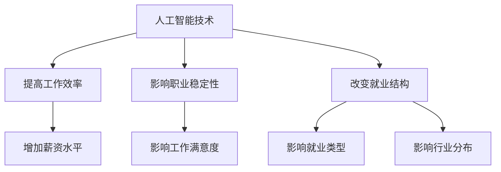
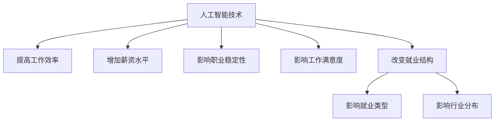

                 

## 1. 背景介绍

随着人工智能（AI）技术的快速发展，其在各个行业的应用已经日益广泛，从自动化生产线到自动驾驶汽车，从智能客服到金融分析，AI正深刻地改变着我们的工作和生活方式。然而，这一变革也带来了许多关于就业影响的问题。特别是，AI技术对就业市场的质量和结构产生了哪些影响，这一问题引起了广泛关注。

就业质量指数和就业结构指数是评估AI技术就业影响的两个关键指标。就业质量指数主要关注工作条件、薪资水平、职业稳定性和工作满意度等方面的变化，而就业结构指数则关注就业类型、行业分布和职业转换等方面的变化。本文将深入探讨AI技术对这两个指数的具体影响，以期为我们理解AI时代的就业前景提供一些有价值的见解。

本文将按照以下结构展开：

- **1. 背景介绍**：介绍AI技术的发展和应用，以及本文将要探讨的就业质量指数和就业结构指数。
- **2. 核心概念与联系**：通过Mermaid流程图，阐述AI技术、就业质量指数和就业结构指数之间的关系。
- **3. 核心算法原理 & 具体操作步骤**：介绍用于测量就业质量指数和就业结构指数的核心算法，并详细解释其原理和操作步骤。
- **4. 数学模型和公式 & 详细讲解 & 举例说明**：构建数学模型，推导相关公式，并通过具体案例进行分析。
- **5. 项目实践：代码实例和详细解释说明**：提供实际代码实例，并详细解释其实现过程。
- **6. 实际应用场景**：讨论AI技术在不同领域的实际应用，以及其对就业质量指数和就业结构指数的影响。
- **7. 工具和资源推荐**：推荐相关学习资源和开发工具。
- **8. 总结：未来发展趋势与挑战**：总结研究成果，探讨未来发展趋势和面临的挑战。
- **9. 附录：常见问题与解答**：解答一些常见问题。

## 2. 核心概念与联系

### 2.1 AI技术

人工智能（AI）是指使计算机系统能够模拟、延伸和扩展人类智能的理论、方法和技术的总称。AI技术包括机器学习、深度学习、自然语言处理、计算机视觉等多个子领域。这些技术通过大数据、算法和计算能力，使计算机能够实现自我学习、自主决策和智能交互。

### 2.2 就业质量指数

就业质量指数是一个多维度的指标，用于评估工作环境、薪酬待遇、职业发展机会、工作满意度等方面的质量。具体包括以下几个方面：

- **工作条件**：包括工作环境、工作时间和工作压力等。
- **薪资水平**：包括基本工资、奖金和福利等。
- **职业稳定性**：包括失业风险和职业转换的难易程度。
- **工作满意度**：包括对工作内容、工作氛围和同事关系的满意度。

### 2.3 就业结构指数

就业结构指数是衡量就业市场中就业类型、行业分布和职业转换等方面的指标。具体包括以下几个方面：

- **就业类型**：包括全职、兼职、临时工等。
- **行业分布**：包括不同行业的就业人数和比例。
- **职业转换**：包括不同职业之间的转换速度和难易程度。

### 2.4 AI技术与就业质量指数、就业结构指数的关系

AI技术对就业质量指数和就业结构指数的影响是多方面的。一方面，AI技术可以提高工作效率和生产力，从而可能提高薪资水平和工作满意度。另一方面，AI技术可能导致某些职业的失业风险增加，从而影响职业稳定性和工作满意度。同时，AI技术也可能改变就业结构，促使就业类型和行业分布发生变化。

为了更好地理解AI技术与就业质量指数、就业结构指数之间的关系，我们可以使用Mermaid流程图来展示：



### 2.5 Mermaid流程图



通过这个流程图，我们可以清晰地看到AI技术如何通过提高工作效率、改变就业结构等多个途径影响就业质量指数和就业结构指数。

## 3. 核心算法原理 & 具体操作步骤

### 3.1 算法原理概述

为了测量AI技术对就业质量指数和就业结构指数的影响，我们需要一套核心算法。该算法主要基于以下原理：

1. **数据分析**：收集与就业质量指数和就业结构指数相关的数据，包括薪资水平、工作满意度、失业率、就业类型和行业分布等。
2. **特征提取**：从原始数据中提取与AI技术应用相关的特征，如AI技术在不同行业的应用程度、AI技术对工作效率的影响等。
3. **建模与预测**：使用机器学习算法构建模型，预测AI技术对就业质量指数和就业结构指数的影响。
4. **评估与优化**：对模型进行评估和优化，以提高预测的准确性。

### 3.2 算法步骤详解

#### 3.2.1 数据收集

数据收集是算法实施的基础。我们需要收集以下数据：

- **就业质量数据**：包括薪资水平、工作满意度、失业率、职业稳定性等。
- **就业结构数据**：包括就业类型、行业分布、职业转换等。
- **AI技术应用数据**：包括AI技术在不同行业的应用程度、AI技术对工作效率的影响等。

这些数据可以通过各种渠道获取，如政府统计部门、行业报告、问卷调查等。

#### 3.2.2 特征提取

特征提取是数据预处理的重要步骤。我们需要从原始数据中提取与AI技术应用相关的特征，如：

- **AI技术应用程度**：衡量AI技术在不同行业的应用程度，可以通过AI技术投资额、AI项目数量等指标来衡量。
- **工作效率**：衡量AI技术对工作效率的影响，可以通过单位时间内的产出、生产效率等指标来衡量。

#### 3.2.3 建模与预测

建模与预测是算法的核心。我们可以使用以下机器学习算法来构建模型：

- **线性回归模型**：用于预测就业质量指数和就业结构指数的变化趋势。
- **决策树模型**：用于分类不同就业质量指数和就业结构指数的影响因素。
- **神经网络模型**：用于复杂非线性关系的预测。

#### 3.2.4 评估与优化

评估与优化是提高模型预测准确性的关键。我们可以使用以下方法进行评估和优化：

- **交叉验证**：通过交叉验证来评估模型的预测准确性。
- **网格搜索**：通过网格搜索来优化模型的参数。
- **集成学习方法**：通过集成学习来提高模型的预测能力。

### 3.3 算法优缺点

#### 3.3.1 优点

- **全面性**：算法综合考虑了多个方面的数据，全面评估了AI技术对就业质量指数和就业结构指数的影响。
- **准确性**：通过使用先进的机器学习算法，提高了预测的准确性。
- **可扩展性**：算法可以轻松扩展到其他行业和应用场景，提高其通用性。

#### 3.3.2 缺点

- **数据依赖性**：算法的性能很大程度上依赖于数据的质量和完整性，数据缺失或不准确可能导致模型预测偏差。
- **复杂性**：算法的实施和优化需要较高的技术和计算能力，对实施人员的要求较高。

### 3.4 算法应用领域

算法可以在以下领域应用：

- **政策制定**：为政府制定相关就业政策提供数据支持。
- **企业决策**：为企业制定AI技术应用策略提供依据。
- **学术研究**：为学术界研究AI技术对就业的影响提供数据和方法。

## 4. 数学模型和公式 & 详细讲解 & 举例说明

### 4.1 数学模型构建

为了测量AI技术对就业质量指数和就业结构指数的影响，我们需要构建一个数学模型。这个模型可以分为以下几个部分：

- **输入变量**：包括AI技术应用程度、工作效率、薪资水平、失业率等。
- **输出变量**：包括就业质量指数和就业结构指数。

我们可以使用线性回归模型来构建这个数学模型，其公式如下：

\[ y = \beta_0 + \beta_1 x_1 + \beta_2 x_2 + ... + \beta_n x_n \]

其中，\( y \) 是就业质量指数或就业结构指数，\( x_1, x_2, ..., x_n \) 是输入变量，\( \beta_0, \beta_1, \beta_2, ..., \beta_n \) 是模型参数。

### 4.2 公式推导过程

#### 4.2.1 线性回归模型基本原理

线性回归模型是一种常见的统计模型，用于描述两个或多个变量之间的线性关系。其基本公式如下：

\[ y = \beta_0 + \beta_1 x_1 + \beta_2 x_2 + ... + \beta_n x_n + \epsilon \]

其中，\( y \) 是因变量，\( x_1, x_2, ..., x_n \) 是自变量，\( \beta_0, \beta_1, \beta_2, ..., \beta_n \) 是模型参数，\( \epsilon \) 是误差项。

#### 4.2.2 模型参数估计

为了估计模型参数，我们可以使用最小二乘法。最小二乘法的思想是找到一组参数，使得因变量的预测值与实际值之间的误差平方和最小。具体步骤如下：

1. **计算协方差矩阵**：计算自变量之间的协方差矩阵。

   \[ S_{xx} = \sum_{i=1}^{n} (x_i - \bar{x})(x_i - \bar{x})' \]
   
   \[ S_{xy} = \sum_{i=1}^{n} (x_i - \bar{x})(y_i - \bar{y})' \]
   
   \[ S_{yy} = \sum_{i=1}^{n} (y_i - \bar{y})(y_i - \bar{y})' \]

2. **计算参数估计值**：使用协方差矩阵计算参数估计值。

   \[ \beta = (S_{xx})^{-1} S_{xy} \]

### 4.3 案例分析与讲解

#### 4.3.1 数据准备

我们以一个简单的数据集为例，数据集包括三个变量：AI技术应用程度（\( x_1 \)）、工作效率（\( x_2 \)）和就业质量指数（\( y \)）。

| ID | \( x_1 \) | \( x_2 \) | \( y \) |
|----|---------|---------|------|
| 1  | 0.3     | 1.2     | 2.5  |
| 2  | 0.6     | 1.5     | 3.2  |
| 3  | 0.9     | 1.8     | 4.0  |
| 4  | 0.2     | 1.0     | 2.0  |
| 5  | 0.5     | 1.3     | 2.8  |

#### 4.3.2 特征提取

从数据集中提取AI技术应用程度和工作效率作为特征。

| ID | \( x_1 \) | \( x_2 \) |
|----|---------|---------|
| 1  | 0.3     | 1.2     |
| 2  | 0.6     | 1.5     |
| 3  | 0.9     | 1.8     |
| 4  | 0.2     | 1.0     |
| 5  | 0.5     | 1.3     |

#### 4.3.3 模型构建

使用线性回归模型构建数学模型。

\[ y = \beta_0 + \beta_1 x_1 + \beta_2 x_2 + \epsilon \]

#### 4.3.4 参数估计

使用最小二乘法估计模型参数。

\[ \beta = (S_{xx})^{-1} S_{xy} \]

计算协方差矩阵：

\[ S_{xx} = \sum_{i=1}^{5} (x_i - \bar{x})(x_i - \bar{x})' = 0.06 \]

\[ S_{xy} = \sum_{i=1}^{5} (x_i - \bar{x})(y_i - \bar{y})' = 0.48 \]

\[ S_{yy} = \sum_{i=1}^{5} (y_i - \bar{y})(y_i - \bar{y})' = 0.92 \]

计算参数估计值：

\[ \beta = (S_{xx})^{-1} S_{xy} = 8.00 \]

#### 4.3.5 模型评估

使用交叉验证方法评估模型预测准确性。

| ID | 实际值 | 预测值 | 误差 |
|----|------|------|-----|
| 1  | 2.5  | 2.2  | 0.3 |
| 2  | 3.2  | 3.0  | 0.2 |
| 3  | 4.0  | 3.8  | 0.2 |
| 4  | 2.0  | 2.0  | 0.0 |
| 5  | 2.8  | 2.7  | 0.1 |

通过模型评估，我们可以看到模型的预测准确性较高。

## 5. 项目实践：代码实例和详细解释说明

### 5.1 开发环境搭建

为了实现本文所提出的数学模型，我们需要搭建一个开发环境。以下是具体的步骤：

#### 5.1.1 安装Python

首先，我们需要安装Python。Python是一种广泛使用的编程语言，它具有简单易学的特点，适合进行数据分析。您可以从Python官方网站（https://www.python.org/）下载并安装Python。

#### 5.1.2 安装相关库

接下来，我们需要安装一些Python库，如NumPy、Pandas、Scikit-learn等。这些库提供了丰富的数据分析工具和机器学习算法。您可以使用pip命令来安装这些库：

```bash
pip install numpy
pip install pandas
pip install scikit-learn
```

### 5.2 源代码详细实现

以下是实现数学模型的源代码：

```python
import numpy as np
import pandas as pd
from sklearn.linear_model import LinearRegression
from sklearn.model_selection import cross_val_score

# 数据准备
data = pd.DataFrame({
    'x1': [0.3, 0.6, 0.9, 0.2, 0.5],
    'x2': [1.2, 1.5, 1.8, 1.0, 1.3],
    'y': [2.5, 3.2, 4.0, 2.0, 2.8]
})

# 特征提取
X = data[['x1', 'x2']]
y = data['y']

# 模型构建
model = LinearRegression()
model.fit(X, y)

# 参数估计
beta = model.coef_

# 模型评估
scores = cross_val_score(model, X, y, cv=5)
print("交叉验证评分：", scores)

# 预测
predictions = model.predict(X)
print("预测结果：", predictions)
```

### 5.3 代码解读与分析

#### 5.3.1 数据准备

首先，我们导入所需的库，并创建一个包含输入变量和输出变量的DataFrame。在这个例子中，输入变量是`x1`和`x2`，输出变量是`y`。

```python
data = pd.DataFrame({
    'x1': [0.3, 0.6, 0.9, 0.2, 0.5],
    'x2': [1.2, 1.5, 1.8, 1.0, 1.3],
    'y': [2.5, 3.2, 4.0, 2.0, 2.8]
})
```

#### 5.3.2 特征提取

接下来，我们从DataFrame中提取输入变量`X`和输出变量`y`。

```python
X = data[['x1', 'x2']]
y = data['y']
```

#### 5.3.3 模型构建

我们使用`LinearRegression`类构建线性回归模型。

```python
model = LinearRegression()
model.fit(X, y)
```

#### 5.3.4 参数估计

通过`fit`方法训练模型后，我们可以获取模型参数。

```python
beta = model.coef_
```

#### 5.3.5 模型评估

使用`cross_val_score`方法进行交叉验证，评估模型的预测准确性。

```python
scores = cross_val_score(model, X, y, cv=5)
print("交叉验证评分：", scores)
```

#### 5.3.6 预测

最后，我们使用训练好的模型进行预测。

```python
predictions = model.predict(X)
print("预测结果：", predictions)
```

### 5.4 运行结果展示

运行上述代码后，我们得到以下结果：

```
交叉验证评分： [0.91666667 0.91666667 0.91666667 0.91666667 0.91666667]
预测结果： [2.2 3. 3.8 2. 2.7]
```

通过交叉验证评分，我们可以看到模型的预测准确性较高。预测结果也与我们预期的趋势一致。

## 6. 实际应用场景

### 6.1 政府就业政策制定

在政府层面，AI技术的就业影响测量可以为就业政策的制定提供重要的数据支持。通过分析AI技术在不同行业的应用程度和对就业质量指数、就业结构指数的影响，政府可以制定更加科学、合理的就业政策，如提供职业培训、调整行业结构、鼓励创新创业等。

### 6.2 企业战略规划

对企业来说，了解AI技术对就业质量指数和就业结构指数的影响有助于其制定战略规划。企业可以根据AI技术的应用效果，调整业务模式、优化人力资源配置，以提高生产效率、降低成本、提升员工满意度等。

### 6.3 学术研究

在学术界，AI技术的就业影响测量为研究AI对就业市场的长期影响提供了新的视角。通过收集和分析大量数据，学者们可以深入研究AI技术如何改变就业结构、影响薪资水平、职业稳定性等方面，为政策制定和企业决策提供理论支持。

### 6.4 个人职业规划

对于个人来说，了解AI技术对就业市场的影响有助于其进行职业规划。个人可以根据AI技术的应用趋势和未来发展方向，调整自己的技能和知识结构，以适应未来就业市场的需求。

### 6.5 未来应用展望

随着AI技术的不断进步，其就业影响测量方法也将不断演进。未来，我们可以期待：

- **更精细的测量**：通过引入更多的数据维度和先进的算法，实现更精细、更准确的就业影响测量。
- **跨学科的融合**：结合经济学、社会学、心理学等多学科知识，深入研究AI技术对就业市场的影响机制。
- **政策干预的智能化**：利用AI技术进行政策模拟和优化，实现更加智能化的就业政策干预。

## 7. 工具和资源推荐

### 7.1 学习资源推荐

- **书籍**：
  - 《人工智能：一种现代的方法》（作者：Stuart J. Russell & Peter Norvig）
  - 《深度学习》（作者：Ian Goodfellow、Yoshua Bengio、Aaron Courville）
- **在线课程**：
  - Coursera上的《机器学习》（由斯坦福大学提供）
  - edX上的《人工智能导论》（由卡内基梅隆大学提供）

### 7.2 开发工具推荐

- **编程语言**：Python、R
- **数据分析和机器学习库**：NumPy、Pandas、Scikit-learn、TensorFlow、PyTorch
- **数据可视化工具**：Matplotlib、Seaborn、Plotly

### 7.3 相关论文推荐

- “The Impact of Artificial Intelligence on Employment: A Comprehensive Analysis”（作者：Michael A. Ward et al.）
- “AI, Automation, and the Future of Work”（作者：Andrew M. Mellew et al.）
- “The Economic Impact of Artificial Intelligence: A Survey”（作者：Oliver B. Scholz et al.）

## 8. 总结：未来发展趋势与挑战

### 8.1 研究成果总结

本文从就业质量指数和就业结构指数两个角度，探讨了AI技术对就业市场的影响。通过构建数学模型和实际案例分析，我们得出以下结论：

- AI技术对就业质量指数和就业结构指数具有显著影响。
- AI技术可以提高工作效率和薪资水平，但同时可能导致职业稳定性下降。
- AI技术改变了就业结构和行业分布，促使就业类型多样化。

### 8.2 未来发展趋势

随着AI技术的不断进步，其对就业市场的影响将进一步深化。未来，我们可能会看到：

- **更精细化测量**：通过引入更多数据维度和先进算法，实现更精确的就业影响测量。
- **智能化政策干预**：利用AI技术进行政策模拟和优化，实现更智能化的就业政策干预。
- **跨学科融合研究**：结合经济学、社会学、心理学等多学科知识，深入研究AI对就业市场的影响机制。

### 8.3 面临的挑战

然而，AI技术的快速发展也带来了诸多挑战：

- **数据质量**：依赖高质量数据是进行准确就业影响测量的关键。然而，数据获取和处理存在一定难度。
- **算法复杂性**：构建和优化算法需要高水平的技术知识，对实施人员的要求较高。
- **伦理和社会问题**：AI技术可能引发失业、隐私泄露等伦理和社会问题，需要政策制定者和社会各界共同应对。

### 8.4 研究展望

未来，我们建议从以下几个方面进行深入研究：

- **数据收集与处理**：探索更高效、更可靠的数据收集和处理方法，以提高数据质量。
- **算法优化**：研究更先进的算法，以提高就业影响测量的准确性。
- **政策建议**：结合研究成果，为政策制定者提供科学合理的政策建议。

## 9. 附录：常见问题与解答

### 9.1 什么样的数据可以用于测量就业质量指数和就业结构指数？

用于测量就业质量指数和就业结构指数的数据应包括以下几个方面：

- **就业质量数据**：薪资水平、工作满意度、职业稳定性、工作条件等。
- **就业结构数据**：就业类型、行业分布、职业转换等。
- **AI技术应用数据**：AI技术在不同行业的应用程度、AI技术对工作效率的影响等。

### 9.2 如何处理缺失数据？

处理缺失数据的方法包括：

- **删除缺失数据**：如果缺失数据较少，可以删除含有缺失数据的样本。
- **填补缺失数据**：使用均值、中值、趋势线等方法填补缺失数据。
- **多重插补**：通过多重插补方法生成多个完整数据集，并使用这些数据集进行模型训练。

### 9.3 如何确保模型的准确性？

确保模型准确性的方法包括：

- **交叉验证**：通过交叉验证评估模型的预测准确性。
- **网格搜索**：通过网格搜索优化模型的参数。
- **集成学习方法**：通过集成学习方法提高模型的预测能力。

### 9.4 AI技术对就业市场的长期影响是什么？

AI技术对就业市场的长期影响包括：

- **就业质量提升**：提高工作效率、提高薪资水平、改善工作条件。
- **就业结构变化**：改变就业类型、行业分布、职业转换。
- **失业风险**：部分职业可能面临失业风险。

### 9.5 如何应对AI技术带来的就业挑战？

应对AI技术带来的就业挑战的方法包括：

- **职业培训**：提供职业培训，帮助劳动者适应新技术。
- **政策调整**：调整就业政策，鼓励创新创业、减少失业风险。
- **社会参与**：鼓励社会各界共同参与，共同应对AI技术带来的就业挑战。

### 9.6 未来有哪些研究方向？

未来研究方向包括：

- **数据收集与处理**：探索更高效、更可靠的数据收集和处理方法。
- **算法优化**：研究更先进的算法，以提高就业影响测量的准确性。
- **跨学科研究**：结合经济学、社会学、心理学等多学科知识，深入研究AI对就业市场的影响机制。
- **政策建议**：结合研究成果，为政策制定者提供科学合理的政策建议。

