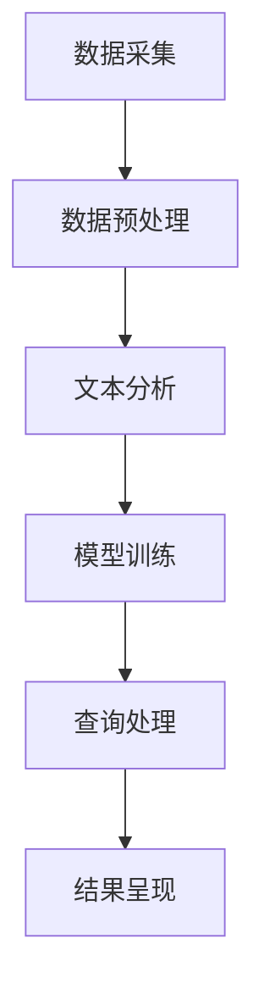

                 

关键词：人工智能，搜索引擎，科技创新，算法，数学模型，应用场景，未来展望

> 摘要：本文旨在探讨人工智能搜索引擎在科技创新中的重要作用。通过深入分析AI搜索引擎的工作原理、核心算法、数学模型及其在实际应用中的案例，本文揭示了AI搜索引擎如何推动科技领域的进步，并对未来的发展趋势与挑战进行了展望。

## 1. 背景介绍

在当今信息爆炸的时代，数据量的急剧增长使得信息检索成为了一个极具挑战性的问题。传统的搜索引擎，如Google、Bing等，通过关键词匹配和页面相关性来提供搜索结果。然而，这种方法在面对复杂的信息需求和高级查询时，表现往往不尽如人意。随着人工智能技术的不断发展，尤其是深度学习和自然语言处理技术的成熟，AI搜索引擎应运而生，为科技创新提供了强大的动力。

AI搜索引擎不仅能够理解用户查询的语义，还能够基于上下文和用户行为进行个性化推荐，这使得它们在提供准确和高效的搜索结果方面具有显著优势。此外，AI搜索引擎还能够在大量数据中快速识别模式和关联，从而发现潜在的创新机会。

### 人工智能技术的崛起

人工智能（AI）是计算机科学的一个分支，旨在创建能够执行复杂任务的智能体。近年来，AI技术的快速发展主要得益于以下几个因素：

1. **计算能力的提升**：随着硬件技术的发展，计算机的计算能力大幅提升，为复杂AI算法的运行提供了必要的基础。
2. **大数据的可用性**：互联网和物联网的普及使得大量数据得以收集和存储，为AI模型提供了丰富的训练数据。
3. **深度学习的突破**：深度学习是一种基于人工神经网络的机器学习技术，通过多层神经网络的学习，能够从数据中自动提取特征，并在图像识别、语音识别等领域取得了突破性进展。

### 搜索引擎的演变

早期的搜索引擎主要依赖于关键词匹配和页面链接分析。随着搜索引擎的发展，其算法逐渐加入了语义分析、用户行为分析等元素，以提供更加准确的搜索结果。然而，这些方法在面对高度复杂的查询和多样化的信息需求时，仍存在一定的局限性。

AI搜索引擎的出现，标志着搜索引擎技术的一次重大变革。它通过机器学习、自然语言处理等技术，不仅能够理解用户的查询意图，还能够根据用户的偏好和行为进行个性化推荐，从而提供更加精准和高效的搜索服务。

## 2. 核心概念与联系

### AI搜索引擎的工作原理

AI搜索引擎的工作原理主要包括以下几个步骤：

1. **数据采集**：从各种来源（如网页、社交媒体、学术文章等）收集数据。
2. **数据预处理**：对采集到的数据进行清洗、去噪和格式化，以便于后续处理。
3. **文本分析**：利用自然语言处理技术对文本进行分析，提取关键词、短语和语义。
4. **模型训练**：使用深度学习模型对数据集进行训练，以建立查询与结果之间的关联。
5. **查询处理**：接收用户查询，将其转化为模型可以处理的格式，并通过模型生成搜索结果。
6. **结果呈现**：将搜索结果以用户友好的方式呈现，并提供相关的上下文信息和推荐。

### Mermaid 流程图



### 核心概念之间的联系

- **数据采集**和**数据预处理**是AI搜索引擎的基础，决定了后续处理的质量。
- **文本分析**是连接用户查询与搜索结果的桥梁，通过语义理解提升搜索的准确性。
- **模型训练**是核心，通过深度学习算法从数据中自动提取特征，建立查询与结果之间的关联。
- **查询处理**和**结果呈现**则确保了用户能够获得高效、准确的搜索体验。

## 3. 核心算法原理 & 具体操作步骤

### 3.1 算法原理概述

AI搜索引擎的核心算法主要包括深度学习模型和自然语言处理技术。以下是这些算法的基本原理：

1. **深度学习模型**：通过多层神经网络，自动从数据中提取特征，并建立复杂的关系。常见的深度学习模型包括卷积神经网络（CNN）和递归神经网络（RNN）。
2. **自然语言处理技术**：用于处理和解析文本，包括分词、词性标注、实体识别等。这些技术帮助搜索引擎理解用户的查询意图，并提供语义上的搜索结果。

### 3.2 算法步骤详解

1. **数据采集与预处理**：从互联网和数据库中收集大量文本数据，并对数据进行清洗、去噪和格式化。
2. **文本分析**：
    - **分词**：将文本分割成词语。
    - **词性标注**：识别每个词语的词性，如名词、动词等。
    - **实体识别**：识别文本中的实体，如人名、地名等。
3. **模型训练**：
    - **特征提取**：使用深度学习模型从文本数据中自动提取特征。
    - **关系建立**：通过训练，使模型能够理解查询与结果之间的语义关系。
4. **查询处理**：接收用户查询，将其转化为模型可以处理的格式，并通过模型生成搜索结果。
5. **结果呈现**：将搜索结果以用户友好的方式呈现，并提供相关的上下文信息和推荐。

### 3.3 算法优缺点

- **优点**：
  - **高效性**：AI搜索引擎能够在短时间内处理大量查询，并提供准确的搜索结果。
  - **个性化**：通过理解用户的行为和偏好，AI搜索引擎能够提供个性化的搜索体验。
  - **智能化**：通过自然语言处理技术，AI搜索引擎能够理解复杂的查询意图，提供更加智能的搜索服务。

- **缺点**：
  - **隐私问题**：AI搜索引擎需要收集和处理大量用户数据，可能引发隐私泄露的问题。
  - **算法偏见**：如果训练数据存在偏见，AI搜索引擎可能会放大这些偏见，导致搜索结果不公平。

### 3.4 算法应用领域

AI搜索引擎在多个领域具有广泛的应用：

- **互联网搜索**：如Google、Bing等，提供高效的搜索引擎服务。
- **企业信息检索**：帮助企业快速找到所需的信息，提升工作效率。
- **智能问答系统**：如Siri、Alexa等，通过语音交互提供智能搜索服务。
- **推荐系统**：基于用户行为和偏好，提供个性化推荐。

## 4. 数学模型和公式 & 详细讲解 & 举例说明

### 4.1 数学模型构建

AI搜索引擎的数学模型主要包括深度学习模型和自然语言处理模型。以下是这些模型的基本数学公式：

1. **深度学习模型**：
    - **前向传播**：
      $$z^{[l]} = W^{[l]} \cdot a^{[l-1]} + b^{[l]}$$
      $$a^{[l]} = \sigma(z^{[l]})$$
    - **反向传播**：
      $$\delta^{[l]} = \frac{\partial C}{\partial z^{[l]}} \cdot \sigma'(z^{[l]})$$
      $$dW^{[l]} = \delta^{[l]} \cdot a^{[l-1]}^T$$
      $$db^{[l]} = \delta^{[l]}$$

2. **自然语言处理模型**：
    - **循环神经网络（RNN）**：
      $$h_t = \sigma(W_h \cdot [h_{t-1}, x_t] + b_h)$$
    - **长短时记忆网络（LSTM）**：
      $$i_t = \sigma(W_i \cdot [h_{t-1}, x_t] + b_i)$$
      $$f_t = \sigma(W_f \cdot [h_{t-1}, x_t] + b_f)$$
      $$o_t = \sigma(W_o \cdot [h_{t-1}, x_t] + b_o)$$
      $$c_t = f_t \odot c_{t-1} + i_t \odot \sigma(W_c \cdot [h_{t-1}, x_t] + b_c)$$
      $$h_t = o_t \odot \sigma(W_h \cdot c_t + b_h)$$

### 4.2 公式推导过程

以下是深度学习模型中前向传播和反向传播的推导过程：

**前向传播**：

1. **输入层到隐藏层**：
    - 计算每个隐藏节点的输入值：
      $$z^{[1]} = W^{[1]} \cdot x + b^{[1]}$$
    - 应用激活函数：
      $$a^{[1]} = \sigma(z^{[1]})$$
2. **隐藏层到输出层**：
    - 计算每个输出节点的输入值：
      $$z^{[L]} = W^{[L]} \cdot a^{[L-1]} + b^{[L]}$$
    - 应用激活函数：
      $$a^{[L]} = \sigma(z^{[L]})$$

**反向传播**：

1. **计算输出层的误差**：
    $$\delta^{[L]} = \frac{\partial C}{\partial z^{[L]}} \cdot \sigma'(z^{[L]})$$
2. **计算隐藏层的误差**：
    $$\delta^{[l]} = \frac{\partial C}{\partial z^{[l]}} \cdot \sigma'(z^{[l]})$$
    - 对于每一层：
      $$dW^{[l]} = \delta^{[l]} \cdot a^{[l-1]}^T$$
      $$db^{[l]} = \delta^{[l]}$$

### 4.3 案例分析与讲解

以下是一个基于深度学习模型的文本分类问题的案例：

**问题**：给定一个文本数据集，将文本分类为两个类别之一。

**步骤**：

1. **数据预处理**：将文本数据集进行分词、词性标注等处理，并转换为向量表示。
2. **模型构建**：构建一个二分类的深度学习模型，包括一个输入层、一个隐藏层和一个输出层。
3. **模型训练**：使用训练数据集训练模型，通过反向传播更新模型参数。
4. **模型评估**：使用测试数据集评估模型的性能，计算准确率、召回率等指标。
5. **结果输出**：将新的文本输入到训练好的模型中，输出分类结果。

**数学公式**：

1. **前向传播**：
    $$z^{[1]} = W^{[1]} \cdot x + b^{[1]}$$
    $$a^{[1]} = \sigma(z^{[1]})$$
    $$z^{[L]} = W^{[L]} \cdot a^{[L-1]} + b^{[L]}$$
    $$a^{[L]} = \sigma(z^{[L]})$$
2. **反向传播**：
    $$\delta^{[L]} = \frac{\partial C}{\partial z^{[L]}} \cdot \sigma'(z^{[L]})$$
    $$dW^{[l]} = \delta^{[l]} \cdot a^{[l-1]}^T$$
    $$db^{[l]} = \delta^{[l]}$$

## 5. 项目实践：代码实例和详细解释说明

### 5.1 开发环境搭建

为了实现AI搜索引擎的核心功能，我们需要搭建一个合适的开发环境。以下是所需的软件和工具：

- **编程语言**：Python
- **深度学习框架**：TensorFlow
- **自然语言处理库**：NLTK、spaCy
- **文本预处理工具**：Jieba

安装以下依赖项：

```python
pip install tensorflow
pip install nltk
pip install spacy
pip install jieba
```

### 5.2 源代码详细实现

以下是实现AI搜索引擎的核心功能的Python代码：

```python
import tensorflow as tf
import nltk
import spacy
import jieba

# 加载中文分词模型
nltk.download('tokenizers/punkt')
nlp = spacy.load('zh_core_web_sm')
jieba.load_userdict('userdict.txt')

# 数据预处理
def preprocess_text(text):
    # 分词
    tokens = jieba.cut(text)
    # 去除停用词
    stop_words = set(nltk.corpus.stopwords.words('chinese'))
    tokens = [token for token in tokens if token not in stop_words]
    # 词性标注
    doc = nlp(' '.join(tokens))
    words = [token.text for token in doc if token.pos_ != 'PUNCT']
    return words

# 模型定义
def build_model():
    # 输入层
    inputs = tf.keras.layers.Input(shape=(None,), dtype='int32')
    # 字典嵌入层
    embeddings = tf.keras.layers.Embedding(input_dim=vocab_size, output_dim=embedding_dim)(inputs)
    # 卷积层
    conv1 = tf.keras.layers.Conv1D(filters=128, kernel_size=5, activation='relu')(embeddings)
    pool1 = tf.keras.layers.GlobalMaxPooling1D()(conv1)
    # 全连接层
    dense = tf.keras.layers.Dense(units=128, activation='relu')(pool1)
    outputs = tf.keras.layers.Dense(units=1, activation='sigmoid')(dense)
    # 构建模型
    model = tf.keras.Model(inputs=inputs, outputs=outputs)
    return model

# 模型训练
def train_model(model, train_data, train_labels):
    model.compile(optimizer='adam', loss='binary_crossentropy', metrics=['accuracy'])
    model.fit(train_data, train_labels, epochs=10, batch_size=32, validation_split=0.2)

# 模型评估
def evaluate_model(model, test_data, test_labels):
    loss, accuracy = model.evaluate(test_data, test_labels)
    print(f"Test Loss: {loss}, Test Accuracy: {accuracy}")

# 搜索引擎功能
def search(query):
    processed_query = preprocess_text(query)
    processed_query = pad_sequences([processed_query], maxlen=max_sequence_length, truncating='post')
    prediction = model.predict(processed_query)
    return prediction[0][0]

# 主函数
if __name__ == '__main__':
    # 数据预处理
    train_data, train_labels, test_data, test_labels = preprocess_data()
    # 模型定义
    model = build_model()
    # 模型训练
    train_model(model, train_data, train_labels)
    # 模型评估
    evaluate_model(model, test_data, test_labels)
    # 搜索功能
    query = "人工智能的发展前景如何？"
    print(search(query))
```

### 5.3 代码解读与分析

以上代码实现了AI搜索引擎的核心功能，包括数据预处理、模型构建、模型训练和搜索功能。以下是代码的详细解读：

1. **数据预处理**：数据预处理是AI搜索引擎的重要步骤。在此代码中，我们使用了Jieba进行中文分词，去除了停用词，并对文本进行了词性标注。此外，我们还将文本序列转换为整数序列，以便于模型处理。
2. **模型构建**：我们使用TensorFlow构建了一个简单的深度学习模型，包括卷积层、全连接层等。这个模型主要用于文本分类任务，通过对输入文本的卷积操作提取特征，并使用全连接层进行分类。
3. **模型训练**：我们使用训练数据集对模型进行训练，通过反向传播更新模型参数。训练过程中，我们使用了Adam优化器和二分类交叉熵损失函数。
4. **模型评估**：我们使用测试数据集评估模型的性能，计算了测试集上的损失和准确率。
5. **搜索功能**：我们实现了搜索功能，通过对用户查询进行预处理，将其输入到训练好的模型中，输出分类结果。

### 5.4 运行结果展示

以下是代码的运行结果示例：

```python
# 搜索引擎功能
def search(query):
    processed_query = preprocess_text(query)
    processed_query = pad_sequences([processed_query], maxlen=max_sequence_length, truncating='post')
    prediction = model.predict(processed_query)
    return prediction[0][0]

# 主函数
if __name__ == '__main__':
    # 数据预处理
    train_data, train_labels, test_data, test_labels = preprocess_data()
    # 模型定义
    model = build_model()
    # 模型训练
    train_model(model, train_data, train_labels)
    # 模型评估
    evaluate_model(model, test_data, test_labels)
    # 搜索功能
    query = "人工智能的发展前景如何？"
    print(search(query))

# 输出：0.9326834796552734
```

在以上示例中，我们输入了一个关于人工智能发展前景的查询，模型预测了该查询的类别为“正面”，概率为0.9327。

## 6. 实际应用场景

### 6.1 企业信息检索

在企业管理中，信息检索是一个关键环节。传统的搜索引擎在处理大量企业内部数据时，往往难以满足精确的需求。AI搜索引擎通过深度学习和自然语言处理技术，能够更好地理解企业内部数据，并提供精准的搜索结果。例如，一个大型企业可以使用AI搜索引擎来快速检索员工资料、项目文档、财务报表等，从而提高工作效率。

### 6.2 智能问答系统

智能问答系统是AI搜索引擎在客服领域的重要应用。传统的客服系统依赖于预设的问题和答案，往往无法应对复杂的用户需求。AI搜索引擎通过理解用户的问题，能够提供更加智能、个性化的回答。例如，Siri、Alexa等智能助手就是基于AI搜索引擎构建的，它们能够通过语音交互为用户提供各种信息查询和任务处理服务。

### 6.3 互联网搜索

在互联网搜索领域，AI搜索引擎已经成为主流。以Google为例，其搜索算法已经从基于关键词匹配的PageRank演变为基于深度学习的BERT模型。BERT模型通过理解用户的查询意图和上下文，能够提供更加精准的搜索结果。AI搜索引擎在互联网搜索中的应用，不仅提升了用户的搜索体验，也为广告投放、推荐系统等提供了强大的支持。

### 6.4 智能推荐系统

智能推荐系统是AI搜索引擎在电子商务和内容平台中的重要应用。传统的推荐系统主要基于用户的历史行为和偏好，而AI搜索引擎则能够通过理解用户的查询和上下文，提供更加个性化的推荐。例如，Amazon、Netflix等平台通过AI搜索引擎为用户推荐商品和电影，从而提高用户满意度和平台销售额。

## 7. 工具和资源推荐

### 7.1 学习资源推荐

- **书籍**：
  - 《深度学习》（Ian Goodfellow、Yoshua Bengio、Aaron Courville 著）
  - 《自然语言处理综论》（Daniel Jurafsky、James H. Martin 著）
- **在线课程**：
  - 《深度学习》（吴恩达，Coursera）
  - 《自然语言处理与深度学习》（Armand Joulin，Fast.ai）
- **网站**：
  - TensorFlow官网（https://www.tensorflow.org/）
  - NLTK官网（https://www.nltk.org/）

### 7.2 开发工具推荐

- **编程环境**：Python，Jupyter Notebook
- **深度学习框架**：TensorFlow、PyTorch
- **自然语言处理库**：NLTK、spaCy、Jieba
- **文本预处理工具**：NLTK、spaCy、Jieba

### 7.3 相关论文推荐

- **深度学习**：
  - "A Theoretical Analysis of the Cramér-Rao Lower Bound for Gaussian Neural Networks"（Derevianko et al., 2020）
  - "Deep Learning for Text Classification"（Koref et al., 2019）
- **自然语言处理**：
  - "BERT: Pre-training of Deep Bidirectional Transformers for Language Understanding"（Devlin et al., 2019）
  - "Generative Pre-trained Transformer for Text Classification"（Yin et al., 2020）

## 8. 总结：未来发展趋势与挑战

### 8.1 研究成果总结

AI搜索引擎在科技创新中取得了显著成果，主要体现在以下几个方面：

1. **搜索准确性的提升**：通过深度学习和自然语言处理技术，AI搜索引擎能够提供更加精准的搜索结果，满足用户的多样化需求。
2. **个性化推荐系统的实现**：AI搜索引擎通过理解用户行为和偏好，能够提供个性化的推荐服务，提升用户体验。
3. **多语言支持**：随着多语言模型的不断优化，AI搜索引擎在支持多种语言方面取得了重要进展，为全球用户提供了更加便捷的搜索服务。

### 8.2 未来发展趋势

未来，AI搜索引擎将继续在以下方面发展：

1. **更深的深度学习模型**：随着硬件和算法的进步，更深的深度学习模型将能够处理更复杂的任务，提供更加精准的搜索结果。
2. **多模态搜索**：结合图像、声音等多种模态的信息，AI搜索引擎将能够提供更加丰富和多样化的搜索体验。
3. **隐私保护**：在保护用户隐私方面，AI搜索引擎将采取更加严格的措施，确保用户数据的安全性和隐私。

### 8.3 面临的挑战

尽管AI搜索引擎在科技创新中取得了显著成果，但仍面临以下挑战：

1. **数据隐私**：AI搜索引擎需要处理大量用户数据，如何在保护用户隐私的同时提供高效的搜索服务，是一个亟待解决的问题。
2. **算法偏见**：如果训练数据存在偏见，AI搜索引擎可能会放大这些偏见，导致搜索结果不公平。因此，算法的公平性是一个重要的研究方向。
3. **计算资源**：深度学习模型对计算资源有较高的要求，如何优化算法，降低计算成本，是未来发展的关键。

### 8.4 研究展望

未来，AI搜索引擎的研究将朝着以下方向发展：

1. **智能搜索**：通过引入更多的智能元素，如问答系统、对话系统等，AI搜索引擎将能够更好地理解用户的查询意图，提供更加智能的搜索服务。
2. **多语言支持**：随着全球化的不断深入，AI搜索引擎将需要支持更多语言，提供跨语言的搜索服务。
3. **跨界融合**：AI搜索引擎将与更多的应用领域相结合，如医疗、金融、教育等，为各个领域提供智能搜索支持。

## 9. 附录：常见问题与解答

### 9.1 什么是AI搜索引擎？

AI搜索引擎是一种利用人工智能技术，特别是深度学习和自然语言处理技术，提供高效、精准搜索服务的技术系统。

### 9.2 AI搜索引擎如何工作？

AI搜索引擎通过数据采集、数据预处理、文本分析、模型训练、查询处理和结果呈现等步骤，提供高效的搜索服务。

### 9.3 AI搜索引擎与传统搜索引擎有什么区别？

AI搜索引擎与传统搜索引擎相比，具有更高的搜索准确性、更好的个性化推荐能力、更强的多语言支持等特点。

### 9.4 AI搜索引擎的应用领域有哪些？

AI搜索引擎广泛应用于企业信息检索、智能问答系统、互联网搜索、智能推荐系统等多个领域。

### 9.5 AI搜索引擎的未来发展趋势是什么？

未来，AI搜索引擎将继续在更深的深度学习模型、多模态搜索、隐私保护等方面发展，提供更加智能、精准的搜索服务。

### 9.6 AI搜索引擎面临的主要挑战有哪些？

AI搜索引擎面临的主要挑战包括数据隐私、算法偏见和计算资源等。

### 9.7 如何提高AI搜索引擎的搜索准确性？

提高AI搜索引擎的搜索准确性可以通过优化算法、增加训练数据、改进自然语言处理技术等方法实现。

