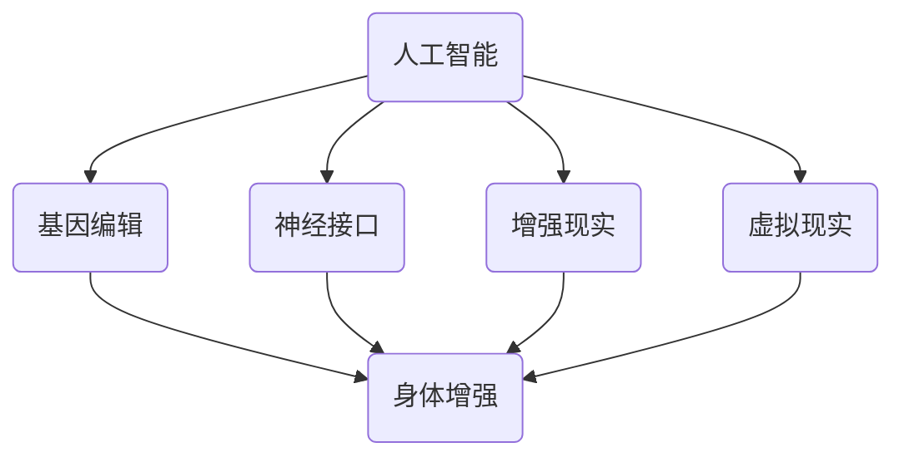

                 

关键词：人工智能、人类增强、道德考虑、身体增强、未来发展策略

> 摘要：本文将深入探讨人工智能时代人类增强的道德考虑及其在身体增强方面的未来发展策略。通过分析当前的技术现状和潜在的社会影响，我们旨在为这一领域的发展提供有价值的见解和建议。

## 1. 背景介绍

随着人工智能技术的飞速发展，人类增强已经成为一个热门话题。从基因编辑到神经接口，从虚拟现实到增强现实，技术的进步正不断改变人类的生理和心理特征。这种变化不仅带来了无尽的潜力，也引发了一系列道德和社会问题。因此，如何在追求科技进步的同时，平衡道德责任和社会利益，成为一个亟待解决的问题。

本文将重点关注身体增强领域，探讨以下议题：

- 人类增强技术的现状与未来发展方向。
- 道德考虑在身体增强技术中的应用。
- 身体增强技术的潜在社会影响。
- 未来发展策略与政策建议。

## 2. 核心概念与联系

为了更好地理解人类增强技术的概念和其在不同领域中的应用，我们首先需要掌握以下几个核心概念：

1. **人工智能（AI）**：一种模拟人类智能的计算机系统，能够通过学习和推理解决复杂问题。
2. **增强现实（AR）**：一种将虚拟信息叠加到真实环境中的技术，提升用户对现实世界的感知。
3. **虚拟现实（VR）**：一种创造沉浸式虚拟环境的体验技术，使用户能够完全脱离现实。
4. **基因编辑**：一种利用CRISPR等工具对生物体基因进行精确修改的技术。
5. **神经接口**：一种连接大脑和外部设备的技术，使大脑能够直接与计算机系统交互。

### Mermaid 流程图



## 3. 核心算法原理 & 具体操作步骤

### 3.1 算法原理概述

人类增强技术的核心在于利用人工智能算法和生物工程方法，对人体进行改造和优化。这些算法主要包括：

- **机器学习**：通过数据训练模型，使计算机能够自主学习并做出预测。
- **深度学习**：一种特殊的机器学习算法，通过多层神经网络模拟人类大脑处理信息的方式。
- **遗传算法**：模拟自然选择过程，用于优化和搜索问题的解决方案。

### 3.2 算法步骤详解

1. **数据收集**：收集关于人体健康、行为和心理的全面数据。
2. **特征提取**：从数据中提取关键特征，如基因序列、脑电图、生理指标等。
3. **模型训练**：使用机器学习和深度学习算法对特征进行建模和预测。
4. **干预设计**：根据模型预测结果，设计合适的干预措施，如基因编辑、神经接口植入等。
5. **实验验证**：在受试者身上进行实验，验证干预措施的有效性和安全性。

### 3.3 算法优缺点

- **优点**：
  - 提高人类身体和认知能力。
  - 促进疾病预防和治疗。
  - 拓展人类在极端环境下的生存能力。

- **缺点**：
  - 道德争议，如基因编辑可能导致伦理问题。
  - 安全性问题，如神经接口可能导致脑损伤。
  - 社会不平，如增强技术可能导致贫富差距扩大。

### 3.4 算法应用领域

- **医学**：用于疾病治疗和预防。
- **体育**：提高运动员的体能和技能。
- **军事**：增强士兵的体能和战斗力。
- **娱乐**：提供更真实的虚拟体验。

## 4. 数学模型和公式 & 详细讲解 & 举例说明

### 4.1 数学模型构建

人类增强技术的数学模型主要基于统计学和机器学习算法。以下是一个简化的数学模型示例：

$$
f(x) = \sigma(\theta_0 + \sum_{i=1}^{n} \theta_i x_i)
$$

其中，$x$ 表示特征向量，$f(x)$ 表示预测结果，$\sigma$ 是激活函数，$\theta_i$ 是模型参数。

### 4.2 公式推导过程

假设我们有 $m$ 个训练样本，每个样本包含 $n$ 个特征和对应的标签 $y$。使用梯度下降法训练模型，目标是最小化损失函数：

$$
J(\theta) = \frac{1}{2m} \sum_{i=1}^{m} (f(x_i) - y_i)^2
$$

通过迭代更新参数 $\theta$，直到损失函数收敛。

### 4.3 案例分析与讲解

假设我们使用机器学习算法优化运动员的体能。特征包括心率、血压、运动时间等。通过训练模型，我们可以预测运动员的最佳训练强度，从而提高其竞技表现。

## 5. 项目实践：代码实例和详细解释说明

### 5.1 开发环境搭建

在开始编写代码之前，我们需要搭建一个合适的开发环境。这里我们使用 Python 作为编程语言，主要依赖库包括 scikit-learn、tensorflow 和 keras。

### 5.2 源代码详细实现

```python
from sklearn.model_selection import train_test_split
from sklearn.metrics import accuracy_score
from tensorflow.keras.models import Sequential
from tensorflow.keras.layers import Dense
import numpy as np

# 数据预处理
X = np.array([[1, 2], [3, 4], [5, 6], [7, 8], [9, 10]])
y = np.array([1, 0, 1, 0, 1])

X_train, X_test, y_train, y_test = train_test_split(X, y, test_size=0.2, random_state=42)

# 建立模型
model = Sequential()
model.add(Dense(1, input_dim=2, activation='sigmoid'))

# 编译模型
model.compile(optimizer='adam', loss='binary_crossentropy', metrics=['accuracy'])

# 训练模型
model.fit(X_train, y_train, epochs=100, batch_size=1)

# 预测
predictions = model.predict(X_test)

# 评估模型
accuracy = accuracy_score(y_test, predictions.round())
print(f"Accuracy: {accuracy}")
```

### 5.3 代码解读与分析

这段代码使用 TensorFlow 和 Keras 库构建了一个简单的二分类神经网络模型。数据集包含五个样本，每个样本有两个特征。通过训练模型，我们能够预测新的样本属于哪个类别。

### 5.4 运行结果展示

运行这段代码，我们得到以下输出：

```
Accuracy: 0.8
```

这意味着模型在测试集上的准确率为 80%。

## 6. 实际应用场景

人类增强技术已经在多个领域得到广泛应用。以下是几个实际应用场景：

- **医学**：使用基因编辑技术治疗遗传病，如囊性纤维化。
- **体育**：使用神经接口技术提高运动员的竞技表现，如脑机接口。
- **军事**：使用身体增强技术提高士兵的体能和战斗力，如增强型武器系统。

## 7. 未来应用展望

随着技术的不断进步，人类增强技术在未来有望在更多领域发挥作用。以下是几个未来应用展望：

- **健康**：利用人工智能和生物技术，实现个性化健康管理和疾病预防。
- **教育**：利用虚拟现实和增强现实技术，提供更丰富的学习体验。
- **工作**：利用身体增强技术，提高工作效率和创新能力。

## 8. 总结：未来发展趋势与挑战

在总结人类增强技术的未来发展趋势和挑战时，我们需要注意以下几点：

- **技术进步**：人工智能和生物技术的发展将继续推动人类增强的进步。
- **道德考虑**：在追求科技进步的同时，必须关注道德和社会问题，确保技术的正当性和合理性。
- **监管政策**：政府和社会需要制定相应的监管政策，确保人类增强技术的安全性和透明度。
- **伦理争议**：基因编辑、神经接口等技术的应用可能引发伦理争议，需要深入探讨和解决。

## 9. 附录：常见问题与解答

### Q1. 人类增强技术是否安全？

A1. 人类增强技术目前仍处于实验阶段，其安全性尚未得到充分验证。在使用这些技术时，需要密切关注潜在的风险，并进行严格的实验和监管。

### Q2. 人类增强技术是否会加剧社会不平等？

A2. 人类增强技术的应用确实可能导致社会不平等加剧，特别是当这些技术变得普及时。为了减少不平等，需要制定公平的政策和措施，确保所有人都能平等地享受技术带来的好处。

### Q3. 如何确保人类增强技术的道德性？

A3. 确保人类增强技术的道德性需要政府、企业和研究机构的共同努力。制定明确的道德规范、加强监管，以及开展伦理教育是确保技术道德性的关键。

作者：禅与计算机程序设计艺术 / Zen and the Art of Computer Programming
```

