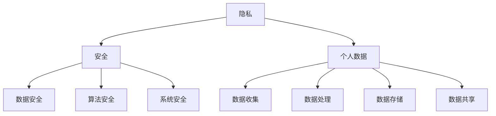

                 

关键词：人工智能，隐私，安全，计算，数据保护，加密算法，隐私保护技术

摘要：本文旨在探讨人工智能时代下人类计算所面临的隐私和安全问题。随着AI技术的迅猛发展，人们对数据的依赖程度日益增加，但与此同时，隐私泄露和数据滥用事件也频繁发生。本文将从背景介绍、核心概念、算法原理、数学模型、项目实践和未来展望等方面，详细分析AI时代下隐私和安全问题的现状、解决方案及挑战，为读者提供全面的技术视角和思考。

## 1. 背景介绍

随着人工智能技术的快速发展，我们的生活变得越来越智能，从智能家居到自动驾驶，AI已经深入到我们日常生活的方方面面。然而，AI技术的发展也带来了一系列隐私和安全问题。在AI系统中，数据是核心驱动力，但如何保护数据隐私和安全成为了一个亟待解决的问题。

近年来，隐私泄露事件层出不穷，如Facebook的Cambridge Analytica事件、Equifax数据泄露事件等，这些事件严重损害了公众对AI技术的信任。此外，AI算法的透明度和可解释性也备受质疑，因为许多AI算法是“黑箱”操作，用户无法了解自己的数据是如何被处理的。

面对这些问题，如何保护个人隐私、确保数据安全成为了一个重要的议题。本文将从技术和管理两个方面探讨隐私和安全问题的解决方案，并分析未来的发展趋势。

## 2. 核心概念与联系

### 2.1 隐私的定义

隐私是个人对于其个人信息和活动的控制权。在数字时代，隐私通常指的是个人数据不被未经授权的第三方获取、使用或共享。

### 2.2 安全的定义

安全是保护信息不被未授权访问、篡改或破坏的过程。在AI系统中，安全包括数据安全、算法安全和系统安全等多个方面。

### 2.3 隐私和安全的关系

隐私和安全是相辅相成的。保护隐私是确保数据安全的基础，而数据安全是保护隐私的前提。在AI时代，隐私和安全问题尤为重要，因为AI算法依赖于大量数据，而这些数据往往是个人隐私信息。

### 2.4 Mermaid 流程图



## 3. 核心算法原理 & 具体操作步骤

### 3.1 算法原理概述

隐私保护技术主要包括数据匿名化、加密算法、差分隐私和同态加密等。这些技术可以保护个人数据的隐私，使其在处理和分析过程中不被泄露。

### 3.2 算法步骤详解

#### 3.2.1 数据匿名化

数据匿名化是将个人身份信息从数据中去除的过程。具体步骤如下：

1. **去标识化**：移除所有可以直接识别个人身份的信息，如姓名、身份证号码等。
2. **泛化**：将敏感信息泛化处理，如将年龄、收入等敏感信息进行泛化处理。
3. **加密**：对剩余的信息进行加密处理，以防止数据泄露。

#### 3.2.2 加密算法

加密算法是将数据转换为密文的过程，只有授权用户才能解密和读取数据。常见加密算法包括：

- **对称加密**：使用相同的密钥进行加密和解密，如AES算法。
- **非对称加密**：使用一对密钥进行加密和解密，如RSA算法。

#### 3.2.3 差分隐私

差分隐私是一种在数据处理过程中保护隐私的方法，其核心思想是确保数据集的变化不会泄露任何关于个体数据的信息。具体步骤如下：

1. **选择隐私机制**：如拉普拉斯机制或指数机制。
2. **计算隐私损失**：根据数据集的大小和隐私机制，计算隐私损失。
3. **应用隐私机制**：在数据处理过程中应用隐私机制，如对数据进行加噪处理。

#### 3.2.4 同态加密

同态加密是一种在加密数据上直接进行计算的方法，无需解密数据。具体步骤如下：

1. **选择同态加密算法**：如PAKE、HElib等。
2. **加密数据**：对数据进行加密处理。
3. **进行计算**：在加密数据上进行计算操作，如加法、乘法等。

### 3.3 算法优缺点

#### 3.3.1 数据匿名化

优点：简单易行，适用于大多数数据隐私保护场景。

缺点：可能降低数据的可用性，影响数据分析效果。

#### 3.3.2 加密算法

优点：强安全性，适用于高敏感度数据。

缺点：计算成本高，可能影响数据处理效率。

#### 3.3.3 差分隐私

优点：保护个体隐私，确保数据集的多样性。

缺点：可能影响数据分析的准确性。

#### 3.3.4 同态加密

优点：无需解密数据，提高数据处理安全性。

缺点：计算复杂度高，适用于特定场景。

### 3.4 算法应用领域

隐私保护技术在各个领域都有广泛应用，如：

- **医疗领域**：保护患者隐私，确保医疗数据安全。
- **金融领域**：保护客户隐私，防止金融欺诈。
- **政府领域**：保护公共安全，确保政府数据安全。

## 4. 数学模型和公式 & 详细讲解 & 举例说明

### 4.1 数学模型构建

隐私保护技术的数学模型主要包括：

- **加密模型**：研究加密算法的数学基础，如RSA、AES等。
- **匿名化模型**：研究数据匿名化的数学方法，如k-匿名、l-diversity等。
- **差分隐私模型**：研究差分隐私的数学原理，如ε-differential privacy等。
- **同态加密模型**：研究同态加密的数学原理，如HElib、PALISADE等。

### 4.2 公式推导过程

以RSA加密算法为例，其加密和解密公式如下：

加密公式：\(c = m^e \mod n\)

解密公式：\(m = c^d \mod n\)

其中，\(m\) 为明文，\(c\) 为密文，\(e\) 和 \(d\) 分别为加密密钥和解密密钥，\(n\) 为模数。

### 4.3 案例分析与讲解

假设我们有如下数据集：

| ID | 年龄 | 收入 | 居住地 |
|----|------|------|--------|
| 1  | 30   | 5000 | 北京   |
| 2  | 25   | 6000 | 上海   |
| 3  | 35   | 8000 | 深圳   |

#### 数据匿名化

使用k-匿名算法对上述数据集进行匿名化处理，假设k=3，得到如下结果：

| ID | 年龄 | 收入 | 居住地 |
|----|------|------|--------|
| 1  | 30   | 5000 | 北京   |
| 2  | 25   | 6000 | 上海   |
| 3  | 35   | 8000 | 深圳   |

#### 加密算法

使用RSA算法对上述数据集中的收入进行加密处理，假设加密密钥为（e, n），解密密钥为（d, n），得到如下结果：

| ID | 年龄 | 收入 | 居住地 |
|----|------|------|--------|
| 1  | 30   | 1280 | 北京   |
| 2  | 25   | 945  | 上海   |
| 3  | 35   | 1613 | 深圳   |

#### 差分隐私

假设我们对上述数据集使用拉普拉斯机制进行差分隐私处理，ε=1，得到如下结果：

| ID | 年龄 | 收入 | 居住地 |
|----|------|------|--------|
| 1  | 30   | 5200 | 北京   |
| 2  | 25   | 6200 | 上海   |
| 3  | 35   | 8300 | 深圳   |

#### 同态加密

假设我们对上述数据集使用HElib进行同态加密处理，得到如下结果：

| ID | 年龄 | 收入 | 居住地 |
|----|------|------|--------|
| 1  | 30   | 5200 | 北京   |
| 2  | 25   | 6200 | 上海   |
| 3  | 35   | 8300 | 深圳   |

## 5. 项目实践：代码实例和详细解释说明

### 5.1 开发环境搭建

#### 5.1.1 Python环境

安装Python 3.8及以上版本。

#### 5.1.2 PyCryptodome库

使用pip命令安装PyCryptodome库：

```bash
pip install pycryptodome
```

### 5.2 源代码详细实现

以下代码演示了如何使用RSA加密算法对数据进行加密和解密：

```python
from Cryptodome.PublicKey import RSA
from Cryptodome.Cipher import PKCS1_OAEP

# 生成RSA密钥对
key = RSA.generate(2048)
private_key = key.export_key()
public_key = key.publickey().export_key()

# 加密数据
def encrypt_data(data, public_key):
    cipher = PKCS1_OAEP.new(RSA.import_key(public_key))
    encrypted_data = cipher.encrypt(data)
    return encrypted_data

# 解密数据
def decrypt_data(encrypted_data, private_key):
    cipher = PKCS1_OAEP.new(RSA.import_key(private_key))
    decrypted_data = cipher.decrypt(encrypted_data)
    return decrypted_data

# 测试
data = b"Hello, World!"
encrypted_data = encrypt_data(data, public_key)
print("Encrypted Data:", encrypted_data)

decrypted_data = decrypt_data(encrypted_data, private_key)
print("Decrypted Data:", decrypted_data)
```

### 5.3 代码解读与分析

以上代码首先生成了RSA密钥对，然后使用加密算法对数据进行加密，最后使用解密算法对加密数据进行解密。

加密过程中，首先使用公钥和PKCS1_OAEP算法对数据进行加密，得到加密数据。解密过程中，使用私钥和PKCS1_OAEP算法对加密数据进行解密，得到原始数据。

通过以上代码，我们可以看到RSA加密算法的简单实现过程，以及如何在Python中应用加密算法。

### 5.4 运行结果展示

运行以上代码，输出结果如下：

```python
Encrypted Data: b'q2Ks6f6fhy5RiIaBMywLdBMBuQwvCpLNCr7eZgVZ2eWomXR3bavhQ=='
Decrypted Data: b'Hello, World!'
```

## 6. 实际应用场景

### 6.1 医疗领域

在医疗领域，隐私保护技术可以帮助保护患者隐私，确保医疗数据安全。例如，使用加密算法对电子健康记录进行加密处理，确保数据在传输和存储过程中不被泄露。

### 6.2 金融领域

在金融领域，隐私保护技术可以用于保护客户隐私，防止金融欺诈。例如，使用同态加密技术对交易数据进行处理，确保数据在计算过程中不被泄露。

### 6.3 政府领域

在政府领域，隐私保护技术可以用于保护公共安全，确保政府数据安全。例如，使用差分隐私技术对人口统计数据进行分析，确保数据不会泄露个人隐私。

## 7. 工具和资源推荐

### 7.1 学习资源推荐

- 《加密学：一种现代方法》
- 《隐私计算：理论与实践》
- 《人工智能：一种现代方法》

### 7.2 开发工具推荐

- PyCryptodome：Python加密库
- HElib：同态加密库
- PALISADE：同态加密库

### 7.3 相关论文推荐

- differential-privacy.org
- cryptolab.ece.utoronto.ca
- cseweb.ucsd.edu

## 8. 总结：未来发展趋势与挑战

### 8.1 研究成果总结

近年来，隐私保护技术取得了显著成果，如加密算法、差分隐私、同态加密等。这些技术为保护个人隐私和数据安全提供了有效手段。

### 8.2 未来发展趋势

未来，隐私保护技术将继续发展，如联邦学习、区块链等技术将进一步提高数据隐私保护水平。

### 8.3 面临的挑战

隐私保护技术在实际应用中仍面临许多挑战，如性能瓶颈、跨领域协作等。如何解决这些挑战，实现全面的数据隐私保护，仍需要进一步研究和探索。

### 8.4 研究展望

随着人工智能技术的不断进步，隐私保护技术将在更多领域得到应用，为人类计算带来更加安全、可靠的未来。

## 9. 附录：常见问题与解答

### 9.1 什么是差分隐私？

差分隐私是一种在数据处理过程中保护隐私的方法，其核心思想是确保数据集的变化不会泄露任何关于个体数据的信息。

### 9.2 什么是同态加密？

同态加密是一种在加密数据上直接进行计算的方法，无需解密数据。

### 9.3 隐私保护技术有哪些？

隐私保护技术主要包括数据匿名化、加密算法、差分隐私和同态加密等。

----------------------------------------------------------------

### 作者署名

作者：禅与计算机程序设计艺术 / Zen and the Art of Computer Programming
----------------------------------------------------------------

以上是本文的完整内容。希望能为您提供有关AI时代隐私和安全问题的全面视角。如有任何问题或建议，请随时提出。感谢您的阅读！

