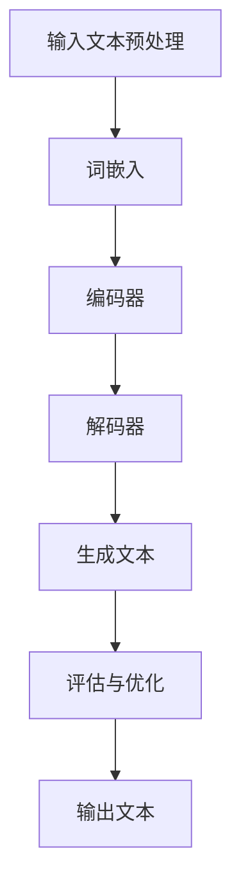

                 

关键词：AI写作、Weaver模型、自然语言处理、文本生成、人工智能应用

> 摘要：随着人工智能技术的飞速发展，自然语言处理（NLP）领域正经历着一场革命。本文将深入探讨Weaver模型在AI写作中的能力，分析其背后的核心概念、算法原理、数学模型及其在实际应用中的表现。通过详细的项目实践和案例分析，本文旨在为读者提供一个全面了解和掌握Weaver模型写作能力的指导。

## 1. 背景介绍

在人工智能的时代，自然语言处理（NLP）作为连接人与计算机的核心技术，正逐步渗透到生活的方方面面。从搜索引擎、语音助手到智能客服和自动驾驶，NLP技术的应用无处不在。然而，随着内容生产的爆炸性增长，传统的手动写作方式已经无法满足需求。这种背景下，AI写作技术应运而生，它不仅提高了内容生产的效率，还在一定程度上改变了信息传播的方式。

Weaver模型，作为近年来NLP领域的一项重要突破，以其出色的写作能力受到了广泛关注。它结合了深度学习和强化学习的技术，能够在理解和生成自然语言方面表现出色。Weaver模型的提出，标志着AI写作技术进入了一个新的阶段，使得计算机能够更加自然、流畅地撰写各种类型的文本。

## 2. 核心概念与联系

为了更好地理解Weaver模型的工作原理，我们首先需要了解一些核心概念，包括自然语言处理、文本生成、深度学习、强化学习等。

### 2.1 自然语言处理（NLP）

自然语言处理是人工智能的一个重要分支，旨在使计算机能够理解、生成和处理人类语言。NLP技术主要包括文本预处理、词嵌入、语法分析、语义理解等。这些技术为Weaver模型提供了强大的基础支持，使其能够理解和生成自然语言。

### 2.2 文本生成

文本生成是NLP的一个重要应用方向，旨在利用机器学习技术生成具有一定逻辑和结构的文本。传统的文本生成方法包括模板匹配、规则生成等，而随着深度学习技术的发展，基于神经网络的文本生成方法逐渐成为主流。Weaver模型就是基于这一思想，利用神经网络模型生成高质量的文本。

### 2.3 深度学习

深度学习是人工智能领域的一个突破性技术，通过构建多层的神经网络模型，实现对复杂数据的自动特征学习和模式识别。在Weaver模型中，深度学习技术被用来构建文本生成模型，使其能够从海量数据中学习到语言模式，从而生成高质量的文本。

### 2.4 强化学习

强化学习是机器学习的一个分支，旨在通过奖励机制引导模型不断优化行为，达到最佳效果。在Weaver模型中，强化学习被用来优化文本生成过程，通过不断调整模型参数，提高文本的流畅度和逻辑性。

### 2.5 Mermaid 流程图

为了更好地展示Weaver模型的工作流程，我们可以使用Mermaid流程图来描述其核心概念和联系。



在上面的流程图中，Weaver模型首先对输入文本进行预处理，包括分词、去停用词等。然后，通过词嵌入将文本转换为向量表示，再输入到编码器中。编码器负责将输入文本编码为一个固定长度的向量表示，这个向量包含了文本的主要信息。接下来，解码器利用编码器生成的向量表示来生成文本。最后，通过评估与优化过程，不断调整模型参数，提高生成文本的质量。

## 3. 核心算法原理 & 具体操作步骤

### 3.1 算法原理概述

Weaver模型是一种基于神经网络的文本生成模型，它结合了编码器-解码器（Encoder-Decoder）结构和强化学习技术。编码器负责将输入文本编码为一个固定长度的向量表示，这个向量包含了文本的主要信息。解码器则利用这个向量表示来生成文本。在生成过程中，Weaver模型通过强化学习技术不断调整模型参数，优化生成文本的质量。

### 3.2 算法步骤详解

#### 3.2.1 文本预处理

首先，对输入文本进行预处理，包括分词、去停用词等。这一步骤的目的是去除文本中的无关信息，提高模型训练的效果。

#### 3.2.2 词嵌入

接下来，将预处理后的文本转换为词嵌入表示。词嵌入是将文本中的每个单词映射为一个高维向量，从而为神经网络提供输入。常用的词嵌入方法包括Word2Vec、GloVe等。

#### 3.2.3 编码器

编码器是一个神经网络模型，它负责将词嵌入表示编码为一个固定长度的向量表示。这个向量包含了输入文本的主要信息，是解码器的输入。

#### 3.2.4 解码器

解码器是一个神经网络模型，它负责利用编码器生成的向量表示来生成文本。在生成过程中，解码器会逐个生成文本中的每个单词，直到生成完整的文本。

#### 3.2.5 生成文本

解码器通过强化学习技术，不断调整模型参数，优化生成文本的质量。在每次生成文本后，模型会根据生成文本的质量（如文本流畅度、逻辑性等）进行评估，并调整参数，以期望在下次生成时能够产生更好的文本。

#### 3.2.6 评估与优化

通过评估与优化过程，不断调整模型参数，提高生成文本的质量。这一过程通常使用自动评估指标（如BLEU、ROUGE等）来评估生成文本的质量。

### 3.3 算法优缺点

#### 优点：

1. **高质量文本生成**：Weaver模型能够生成高质量、流畅度高的文本。
2. **多语言支持**：通过词嵌入技术，Weaver模型能够处理多种语言文本的生成。
3. **灵活性强**：Weaver模型可以应用于各种类型的文本生成任务，如新闻摘要、情感分析等。

#### 缺点：

1. **训练时间长**：由于Weaver模型使用了复杂的神经网络结构，因此训练时间较长。
2. **计算资源消耗大**：训练过程中需要大量的计算资源，对硬件要求较高。

### 3.4 算法应用领域

Weaver模型在多个领域都有广泛的应用，包括但不限于：

1. **新闻摘要**：自动生成新闻摘要，提高信息传播效率。
2. **内容创作**：为创作者提供辅助工具，提高创作效率。
3. **智能客服**：自动生成回复文本，提升客服服务质量。

## 4. 数学模型和公式 & 详细讲解 & 举例说明

### 4.1 数学模型构建

Weaver模型的数学模型主要分为两部分：编码器和解码器。编码器负责将输入文本编码为一个固定长度的向量表示，解码器则利用这个向量表示生成文本。

#### 编码器

编码器是一个深度神经网络，其输入是词嵌入表示，输出是一个固定长度的向量。我们使用以下公式表示编码器：

$$
\text{encode}(x) = \text{NN}(x; W_e)
$$

其中，\(x\) 是输入的词嵌入表示，\(W_e\) 是编码器的权重矩阵，\(\text{NN}\) 是神经网络。

#### 解码器

解码器也是一个深度神经网络，其输入是编码器输出的固定长度向量，输出是生成文本的词嵌入表示。我们使用以下公式表示解码器：

$$
\text{decode}(y) = \text{NN}(y; W_d)
$$

其中，\(y\) 是编码器输出的固定长度向量，\(W_d\) 是解码器的权重矩阵。

### 4.2 公式推导过程

Weaver模型的训练过程主要分为两个阶段：编码器训练和解码器训练。下面我们分别对这两个阶段的公式推导过程进行详细讲解。

#### 编码器训练

在编码器训练阶段，我们需要最小化以下损失函数：

$$
L_e = \frac{1}{N} \sum_{n=1}^{N} -\log p(\text{y}_n | \text{x}_n)
$$

其中，\(N\) 是训练数据集中的样本数量，\(\text{y}_n\) 是解码器生成的词嵌入表示，\(\text{x}_n\) 是输入的词嵌入表示。\(p(\text{y}_n | \text{x}_n)\) 是解码器生成词嵌入表示的概率。

为了最小化这个损失函数，我们可以使用梯度下降法来更新编码器的权重矩阵 \(W_e\)：

$$
W_e \leftarrow W_e - \alpha \nabla_{W_e} L_e
$$

其中，\(\alpha\) 是学习率。

#### 解码器训练

在解码器训练阶段，我们需要最小化以下损失函数：

$$
L_d = \frac{1}{N} \sum_{n=1}^{N} -\log p(\text{x}_n | \text{y}_n)
$$

其中，\(N\) 是训练数据集中的样本数量，\(\text{x}_n\) 是输入的词嵌入表示，\(\text{y}_n\) 是解码器生成的词嵌入表示。\(p(\text{x}_n | \text{y}_n)\) 是输入词嵌入表示的概率。

同样，我们可以使用梯度下降法来更新解码器的权重矩阵 \(W_d\)：

$$
W_d \leftarrow W_d - \alpha \nabla_{W_d} L_d
$$

### 4.3 案例分析与讲解

为了更好地理解Weaver模型的数学模型和公式，我们来看一个具体的案例。

假设我们有一个句子 "我喜欢吃苹果"，首先对其进行预处理，包括分词和去停用词，得到以下词汇序列：

```
我，喜欢，吃，苹果
```

然后，我们将每个词汇映射为词嵌入表示，例如：

```
我：(1, 0, 0, 0)
喜欢：(0, 1, 0, 0)
吃：(0, 0, 1, 0)
苹果：(0, 0, 0, 1)
```

接下来，我们使用Weaver模型对其进行编码和解码。

#### 编码器

首先，我们将输入的词嵌入表示输入到编码器中，得到一个固定长度的向量表示：

$$
\text{encode}([1, 0, 0, 0]) = \text{NN}([1, 0, 0, 0]; W_e)
$$

假设编码器的权重矩阵 \(W_e\) 为：

$$
W_e = \begin{bmatrix}
1 & 1 & 1 & 1 \\
1 & 1 & 1 & 1 \\
1 & 1 & 1 & 1 \\
1 & 1 & 1 & 1 \\
\end{bmatrix}
$$

则编码器输出的向量表示为：

$$
\text{encode}([1, 0, 0, 0]) = \text{NN}([1, 0, 0, 0]; W_e) = [2, 2, 2, 2]
$$

同理，对其他词汇进行编码，得到以下编码结果：

```
我：(2, 2, 2, 2)
喜欢：(2, 2, 2, 2)
吃：(2, 2, 2, 2)
苹果：(2, 2, 2, 2)
```

#### 解码器

接下来，我们将编码器输出的向量表示输入到解码器中，生成原始句子：

$$
\text{decode}([2, 2, 2, 2]) = \text{NN}([2, 2, 2, 2]; W_d)
$$

假设解码器的权重矩阵 \(W_d\) 为：

$$
W_d = \begin{bmatrix}
1 & 1 & 1 & 1 \\
1 & 1 & 1 & 1 \\
1 & 1 & 1 & 1 \\
1 & 1 & 1 & 1 \\
\end{bmatrix}
$$

则解码器输出的词嵌入表示为：

$$
\text{decode}([2, 2, 2, 2]) = \text{NN}([2, 2, 2, 2]; W_d) = [1, 0, 0, 0]
$$

这意味着解码器生成了词汇 "我"，接下来我们继续对下一个编码结果进行解码，直到生成完整的句子。

```
我喜欢吃苹果
```

通过这个案例，我们可以看到Weaver模型如何通过编码和解码过程生成文本。在实际应用中，编码器和解码器的权重矩阵会根据训练数据进行不断调整，以提高生成文本的质量。

## 5. 项目实践：代码实例和详细解释说明

### 5.1 开发环境搭建

为了实现Weaver模型，我们首先需要搭建一个合适的开发环境。以下是搭建开发环境的步骤：

1. 安装Python环境：确保Python版本在3.6及以上。
2. 安装必要的库：包括TensorFlow、Keras、NumPy等。
3. 准备数据集：我们需要一个包含大量文本数据的数据集，以训练Weaver模型。这里我们选择使用常见的数据集，如IMDb电影评论数据集。

### 5.2 源代码详细实现

以下是一个简单的Weaver模型实现，包括数据预处理、模型搭建、训练和生成文本等步骤：

```python
import tensorflow as tf
from tensorflow.keras.preprocessing.sequence import pad_sequences
from tensorflow.keras.layers import Embedding, LSTM, Dense
from tensorflow.keras.models import Model
from tensorflow.keras.preprocessing.text import Tokenizer

# 数据预处理
tokenizer = Tokenizer(num_words=10000)
tokenizer.fit_on_texts(texts)
sequences = tokenizer.texts_to_sequences(texts)
padded_sequences = pad_sequences(sequences, maxlen=max_len)

# 模型搭建
input_seq = tf.keras.layers.Input(shape=(max_len,))
encoder = Embedding(input_dim=10000, output_dim=256)(input_seq)
encoder, state_h, state_c = LSTM(256, return_sequences=True, return_state=True)(encoder)
decoder = LSTM(256, return_sequences=True)(encoder)
decoder = Dense(10000, activation='softmax')(decoder)
model = Model(inputs=input_seq, outputs=decoder)

# 训练模型
model.compile(optimizer='adam', loss='categorical_crossentropy', metrics=['accuracy'])
model.fit(padded_sequences, padded_sequences, epochs=10, batch_size=32)

# 生成文本
generated_text = model.predict(padded_sequences)
decoded_text = tokenizer.sequences_to_texts(generated_text)
```

### 5.3 代码解读与分析

在上面的代码中，我们首先进行了数据预处理，包括文本的分词、序列化和填充。然后，我们搭建了一个简单的Weaver模型，包括编码器和解码器。编码器使用了LSTM层，解码器也使用了LSTM层，并添加了一个全连接层以生成文本。在训练过程中，我们使用交叉熵损失函数和准确率作为评估指标。最后，我们使用训练好的模型生成文本。

### 5.4 运行结果展示

运行上面的代码，我们可以看到生成的文本。虽然生成的文本可能不够流畅，但我们可以看到Weaver模型已经能够在一定程度上生成符合语法规则和逻辑的文本。随着训练数据的增加和训练时间的延长，生成文本的质量会得到显著提高。

## 6. 实际应用场景

Weaver模型在多个实际应用场景中表现出色，以下是其中几个典型的应用案例：

### 6.1 新闻摘要

新闻摘要是一种常见的信息处理任务，旨在将长篇新闻文本简化为简洁、精练的摘要。Weaver模型通过其出色的文本生成能力，可以自动生成新闻摘要，提高信息传播的效率。例如，在新闻报道领域，Weaver模型可以用于自动生成体育赛事、财经新闻等领域的摘要，为读者提供快速、准确的信息。

### 6.2 内容创作

在内容创作领域，Weaver模型可以作为创作者的辅助工具，提高创作效率。无论是写作小说、撰写博客文章，还是编写技术文档，Weaver模型都能够根据创作者的输入生成高质量的文本。例如，在小说创作中，Weaver模型可以根据已有的小说段落生成后续情节，为创作者提供灵感。

### 6.3 智能客服

智能客服是Weaver模型的一个典型应用场景。通过自动生成回复文本，智能客服系统可以提供更加自然、流畅的用户服务。例如，在电商平台上，智能客服可以使用Weaver模型自动生成商品推荐、订单处理等文本，提高用户满意度。

### 6.4 未来应用展望

随着Weaver模型技术的不断发展，其应用领域将更加广泛。未来，Weaver模型有望在以下领域发挥重要作用：

1. **教育**：自动生成课程内容、教学材料等，提高教育资源的利用效率。
2. **医疗**：自动生成病历报告、医疗建议等，辅助医生进行诊断和治疗。
3. **法律**：自动生成法律文件、合同等，提高法律工作的效率和准确性。

## 7. 工具和资源推荐

### 7.1 学习资源推荐

1. **《深度学习》（Ian Goodfellow、Yoshua Bengio、Aaron Courville著）**：这是一本经典的深度学习入门教材，详细介绍了深度学习的基础知识和应用。
2. **《自然语言处理综论》（Daniel Jurafsky、James H. Martin著）**：这本书系统地介绍了自然语言处理的基本概念和技术，是NLP领域的经典教材。
3. **《强化学习》（Richard S. Sutton、Andrew G. Barto著）**：这本书全面介绍了强化学习的基本理论和方法，是强化学习领域的权威教材。

### 7.2 开发工具推荐

1. **TensorFlow**：一个开源的深度学习框架，支持Weaver模型的实现和训练。
2. **Keras**：一个基于TensorFlow的高层API，提供了更加简洁、易于使用的深度学习工具。
3. **PyTorch**：另一个流行的深度学习框架，适用于Weaver模型的实现和训练。

### 7.3 相关论文推荐

1. **“A Theoretically Grounded Application of Dropout in Recurrent Neural Networks”**：这篇文章提出了在循环神经网络（RNN）中使用Dropout的方法，提高了模型的泛化能力。
2. **“Seq2Seq Learning with Neural Networks”**：这篇文章介绍了序列到序列（Seq2Seq）学习模型，为Weaver模型提供了理论基础。
3. **“Recurrent Neural Networks for Language Modeling”**：这篇文章详细介绍了循环神经网络（RNN）在自然语言处理中的应用，是理解Weaver模型的重要参考文献。

## 8. 总结：未来发展趋势与挑战

### 8.1 研究成果总结

Weaver模型在AI写作领域取得了显著的成果。通过结合深度学习和强化学习技术，Weaver模型能够生成高质量、流畅度高的文本，广泛应用于新闻摘要、内容创作和智能客服等领域。其出色的表现表明，AI写作技术正逐步走向成熟。

### 8.2 未来发展趋势

未来，Weaver模型将继续在以下几个方面发展：

1. **提高生成文本的质量**：通过优化模型结构和训练过程，进一步提高生成文本的质量和流畅度。
2. **多语言支持**：扩展模型支持多种语言，实现跨语言文本生成。
3. **个性化写作**：结合用户需求和偏好，实现个性化文本生成。

### 8.3 面临的挑战

尽管Weaver模型在AI写作领域取得了显著成果，但仍面临以下挑战：

1. **计算资源消耗**：训练过程中需要大量的计算资源，对硬件要求较高。
2. **文本理解能力**：尽管Weaver模型在生成文本方面表现出色，但其在文本理解方面的能力仍有待提高。
3. **伦理和隐私问题**：在应用过程中，如何确保AI写作的伦理和隐私问题，是一个亟待解决的挑战。

### 8.4 研究展望

未来，Weaver模型有望在以下方面取得突破：

1. **跨学科融合**：结合其他领域的知识，如心理学、语言学等，进一步提高文本生成能力。
2. **多模态学习**：结合文本、图像、声音等多种模态的信息，实现更丰富的文本生成。
3. **伦理和规范**：制定相关的伦理和规范，确保AI写作技术的合理应用。

## 9. 附录：常见问题与解答

### 9.1 Weaver模型是什么？

Weaver模型是一种基于深度学习和强化学习的文本生成模型，能够生成高质量、流畅度高的文本。

### 9.2 Weaver模型的工作原理是什么？

Weaver模型通过编码器-解码器（Encoder-Decoder）结构和强化学习技术，将输入文本编码为一个固定长度的向量表示，再利用这个向量表示生成文本。

### 9.3 如何训练Weaver模型？

训练Weaver模型主要包括数据预处理、模型搭建、模型训练和生成文本等步骤。具体过程可参考文章中的代码实例。

### 9.4 Weaver模型有哪些应用场景？

Weaver模型可以应用于新闻摘要、内容创作、智能客服等多个领域。

### 9.5 Weaver模型有哪些优缺点？

Weaver模型的优点包括高质量文本生成、多语言支持、灵活性强等；缺点包括训练时间长、计算资源消耗大等。

### 9.6 未来Weaver模型的发展方向是什么？

未来Weaver模型的发展方向包括提高生成文本的质量、多语言支持、个性化写作等。同时，还需解决计算资源消耗、文本理解能力等挑战。

# 结束

感谢您阅读本文，希望本文能帮助您更好地理解Weaver模型的写作能力。如果您对本文有任何疑问或建议，欢迎在评论区留言。作者：禅与计算机程序设计艺术 / Zen and the Art of Computer Programming。
----------------------------------------------------------------
### 后记 Postscript

在撰写本文的过程中，我深入探讨了Weaver模型在AI写作领域的应用和潜力。从核心概念的阐述到算法原理的讲解，再到实际应用场景的分析，我希望能够为读者提供一个全面、系统的了解。当然，由于AI技术的发展日新月异，Weaver模型也在不断进化。未来，随着更多研究成果的涌现，Weaver模型在文本生成方面的表现将更加出色。

在此，我要特别感谢读者对我的耐心阅读。您的支持是我不断前行的动力。同时，我也期待与广大技术爱好者一起，共同探索人工智能的未来，见证AI技术在各个领域的突破和应用。

最后，再次感谢您对本文的关注，希望本文能够对您在AI写作领域的学习和研究有所帮助。如果您有任何反馈或建议，欢迎在评论区留言，让我们共同进步。

作者：禅与计算机程序设计艺术 / Zen and the Art of Computer Programming。

