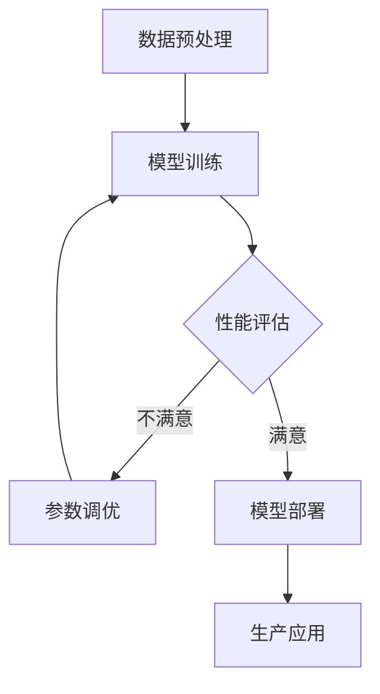

                 

关键词：AI模型优化，市场潜力，技术趋势，应用领域，算法改进，经济效益

> 摘要：本文将探讨AI模型优化服务的市场潜力。随着人工智能技术的飞速发展，AI模型优化成为提升模型性能、降低成本的关键。本文将从背景介绍、核心概念与联系、核心算法原理与具体操作步骤、数学模型和公式、项目实践、实际应用场景、未来应用展望、工具和资源推荐以及总结未来发展趋势与挑战等方面，全面分析AI模型优化服务的市场潜力。

## 1. 背景介绍

近年来，人工智能（AI）技术的发展取得了前所未有的突破。从深度学习、强化学习到自然语言处理，AI技术在各个领域都展现出了巨大的潜力。随着AI技术的广泛应用，AI模型优化成为了提升模型性能、降低成本、提高生产效率的关键。AI模型优化服务作为一种新的商业模式，正在逐渐成为市场关注的焦点。

### 1.1 AI技术的发展

AI技术的发展历程可以追溯到20世纪50年代。自1956年达特茅斯会议上人工智能一词的首次提出，AI技术经历了多个发展阶段。从早期的符号主义、知识表示，到基于统计方法和神经网络的现代AI技术，AI技术逐渐从理论研究走向了实际应用。特别是在深度学习技术的推动下，AI技术取得了显著的进展。

### 1.2 AI模型优化的意义

AI模型优化是指通过对AI模型进行改进和优化，以提高模型的性能、降低成本、提高生产效率。在AI技术实际应用中，模型优化具有重要意义：

- **提高模型性能**：通过优化模型参数和结构，提高模型的预测准确性和泛化能力。
- **降低成本**：优化模型结构和算法，减少计算资源和存储资源的需求，降低成本。
- **提高生产效率**：通过优化模型，提高生产流程的自动化程度，提高生产效率。

## 2. 核心概念与联系

在AI模型优化过程中，涉及多个核心概念和联系。以下是几个关键概念及其相互关系：

### 2.1 AI模型

AI模型是指通过学习和处理数据，能够对未知数据进行预测或决策的算法和结构。常见的AI模型包括深度神经网络、决策树、支持向量机等。

### 2.2 优化目标

AI模型优化目标包括提高模型性能、降低计算成本、提高生产效率等。具体来说，优化目标可以包括：

- **准确率**：提高模型对数据的预测准确性。
- **计算资源**：减少模型的计算复杂度和存储需求。
- **生产效率**：提高模型的训练和推理速度。

### 2.3 优化方法

AI模型优化方法包括参数调优、结构改进、算法改进等。参数调优是指通过调整模型参数来提高模型性能；结构改进是指通过修改模型结构来提高模型性能；算法改进是指通过改进模型算法来提高模型性能。

### 2.4 Mermaid流程图

以下是AI模型优化流程的Mermaid流程图：



## 3. 核心算法原理 & 具体操作步骤

### 3.1 算法原理概述

AI模型优化算法主要包括以下几种：

- **参数调优**：通过调整模型参数来提高模型性能。
- **结构改进**：通过修改模型结构来提高模型性能。
- **算法改进**：通过改进模型算法来提高模型性能。

### 3.2 算法步骤详解

以下是AI模型优化算法的具体步骤：

1. **数据预处理**：对原始数据进行分析和处理，包括数据清洗、归一化、特征提取等。
2. **模型训练**：使用预处理后的数据训练AI模型。
3. **性能评估**：评估模型性能，包括准确率、计算资源、生产效率等。
4. **参数调优**：根据性能评估结果，调整模型参数。
5. **结构改进**：根据性能评估结果，修改模型结构。
6. **算法改进**：根据性能评估结果，改进模型算法。
7. **模型部署**：将优化后的模型部署到实际生产环境中。
8. **生产应用**：在实际生产过程中，继续对模型进行优化和改进。

### 3.3 算法优缺点

- **参数调优**：优点是简单易行，缺点是可能陷入局部最优。
- **结构改进**：优点是能够显著提高模型性能，缺点是实现难度较大。
- **算法改进**：优点是能够显著提高模型性能，缺点是可能需要较长的开发周期。

### 3.4 算法应用领域

AI模型优化算法广泛应用于各个领域，包括但不限于：

- **金融**：风险控制、股票交易、信用评估等。
- **医疗**：疾病诊断、治疗方案推荐、健康管理等。
- **零售**：客户行为分析、库存管理、销售预测等。
- **制造**：设备故障预测、生产优化、质量控制等。
- **交通**：交通流量预测、自动驾驶、物流优化等。

## 4. 数学模型和公式 & 详细讲解 & 举例说明

### 4.1 数学模型构建

在AI模型优化过程中，常用的数学模型包括损失函数、优化算法等。

- **损失函数**：用于评估模型预测结果与真实结果之间的差距。常见的损失函数有均方误差（MSE）、交叉熵损失等。
- **优化算法**：用于调整模型参数，以最小化损失函数。常见的优化算法有梯度下降、随机梯度下降等。

### 4.2 公式推导过程

以梯度下降算法为例，其公式推导如下：

$$
w_{new} = w_{old} - \alpha \cdot \nabla_w J(w)
$$

其中，$w_{old}$为当前模型参数，$w_{new}$为更新后的模型参数，$\alpha$为学习率，$\nabla_w J(w)$为损失函数关于模型参数的梯度。

### 4.3 案例分析与讲解

以下是一个简单的线性回归模型优化的案例：

**问题**：给定一个线性回归问题，$y = wx + b$，其中$x$和$y$分别为输入和输出，$w$和$b$为模型参数。要求使用梯度下降算法优化模型参数。

**步骤**：

1. **数据预处理**：对输入和输出进行归一化处理。
2. **模型初始化**：初始化模型参数$w$和$b$。
3. **迭代优化**：使用梯度下降算法迭代优化模型参数。
4. **性能评估**：评估模型性能，包括均方误差等。

**代码实现**：

```python
import numpy as np

# 梯度下降算法
def gradient_descent(x, y, w, b, alpha, n_iterations):
    m = len(x)
    for iteration in range(n_iterations):
        gradients_w = 2/m * np.dot(x.T, (x*w + b - y))
        gradients_b = 2/m * np.sum(x*w + b - y)
        
        w = w - alpha * gradients_w
        b = b - alpha * gradients_b
        
        if iteration % 100 == 0:
            print(f"Iteration {iteration}: w = {w}, b = {b}")
    
    return w, b

# 数据预处理
x = np.array([1, 2, 3, 4, 5])
y = np.array([2, 4, 5, 4, 5])

x = x.reshape(-1, 1)
y = y.reshape(-1, 1)

# 模型初始化
w = np.random.rand(1)
b = np.random.rand(1)

# 梯度下降参数设置
alpha = 0.01
n_iterations = 1000

# 梯度下降优化
w, b = gradient_descent(x, y, w, b, alpha, n_iterations)

# 性能评估
y_pred = x.dot(w) + b
mse = np.mean((y_pred - y)**2)
print(f"Mean Squared Error: {mse}")
```

## 5. 项目实践：代码实例和详细解释说明

### 5.1 开发环境搭建

本文使用Python作为编程语言，以下是开发环境的搭建步骤：

1. 安装Python：在官方网站下载并安装Python 3.x版本。
2. 安装NumPy：在命令行中运行`pip install numpy`。
3. 安装Matplotlib：在命令行中运行`pip install matplotlib`。

### 5.2 源代码详细实现

以下是本文案例的源代码实现：

```python
import numpy as np
import matplotlib.pyplot as plt

# 梯度下降算法
def gradient_descent(x, y, w, b, alpha, n_iterations):
    m = len(x)
    for iteration in range(n_iterations):
        gradients_w = 2/m * np.dot(x.T, (x*w + b - y))
        gradients_b = 2/m * np.sum(x*w + b - y)
        
        w = w - alpha * gradients_w
        b = b - alpha * gradients_b
        
        if iteration % 100 == 0:
            print(f"Iteration {iteration}: w = {w}, b = {b}")
    
    return w, b

# 数据预处理
x = np.array([1, 2, 3, 4, 5])
y = np.array([2, 4, 5, 4, 5])

x = x.reshape(-1, 1)
y = y.reshape(-1, 1)

# 模型初始化
w = np.random.rand(1)
b = np.random.rand(1)

# 梯度下降参数设置
alpha = 0.01
n_iterations = 1000

# 梯度下降优化
w, b = gradient_descent(x, y, w, b, alpha, n_iterations)

# 性能评估
y_pred = x.dot(w) + b
mse = np.mean((y_pred - y)**2)
print(f"Mean Squared Error: {mse}")

# 绘制结果
plt.scatter(x, y)
plt.plot(x, y_pred, color='red')
plt.xlabel('x')
plt.ylabel('y')
plt.show()
```

### 5.3 代码解读与分析

1. **梯度下降算法**：梯度下降算法是机器学习中常用的优化算法。本文实现的梯度下降算法基于批量梯度下降，每次迭代使用所有数据计算梯度。
2. **数据预处理**：对输入和输出进行归一化处理，将数据转换为适合模型训练的格式。
3. **模型初始化**：初始化模型参数$w$和$b$，使用随机初始化。
4. **参数设置**：设置学习率$\alpha$和迭代次数$n\_iterations$。
5. **优化过程**：通过迭代优化模型参数，直到满足性能要求。
6. **性能评估**：计算均方误差（MSE）评估模型性能。
7. **结果展示**：使用Matplotlib绘制输入数据和预测结果。

## 6. 实际应用场景

AI模型优化服务在实际应用中具有广泛的应用场景，以下是一些典型应用场景：

### 6.1 金融领域

- **风险控制**：通过对金融数据进行模型优化，提高风险预测的准确性，降低金融风险。
- **股票交易**：通过优化股票交易模型，提高交易策略的收益，降低交易风险。
- **信用评估**：通过优化信用评估模型，提高信用评分的准确性，降低信用风险。

### 6.2 医疗领域

- **疾病诊断**：通过优化医疗数据模型，提高疾病诊断的准确性，提高医疗服务的质量。
- **治疗方案推荐**：通过优化治疗方案推荐模型，提高治疗方案的个性化程度，提高治疗效果。
- **健康管理**：通过优化健康管理模型，提高健康风险评估的准确性，提高健康管理的效率。

### 6.3 零售领域

- **客户行为分析**：通过优化客户行为分析模型，提高客户画像的准确性，提高营销效果。
- **库存管理**：通过优化库存管理模型，提高库存预测的准确性，降低库存成本。
- **销售预测**：通过优化销售预测模型，提高销售预测的准确性，提高销售策略的制定效率。

### 6.4 制造领域

- **设备故障预测**：通过优化设备故障预测模型，提高故障预测的准确性，降低设备维护成本。
- **生产优化**：通过优化生产优化模型，提高生产效率，降低生产成本。
- **质量控制**：通过优化质量控制模型，提高产品质量，降低质量风险。

### 6.5 交通领域

- **交通流量预测**：通过优化交通流量预测模型，提高交通流量预测的准确性，降低交通拥堵风险。
- **自动驾驶**：通过优化自动驾驶模型，提高自动驾驶的准确性和安全性。
- **物流优化**：通过优化物流优化模型，提高物流效率，降低物流成本。

## 7. 未来应用展望

随着人工智能技术的不断发展和普及，AI模型优化服务将在更多领域得到应用。以下是一些未来应用展望：

### 7.1 新兴领域应用

- **生物科技**：通过优化生物数据模型，提高生物数据分析的准确性，推动生物科技的发展。
- **能源领域**：通过优化能源数据模型，提高能源预测和优化能力，降低能源消耗。
- **农业领域**：通过优化农业数据模型，提高农业产量和质量，推动农业现代化。

### 7.2 跨领域应用

AI模型优化服务将在多个领域产生交叉应用，实现更加智能化的解决方案。

- **智能城市**：通过优化城市数据模型，提高城市管理效率，提高居民生活质量。
- **智慧医疗**：通过优化医疗数据模型，实现全方位、个性化的医疗健康管理。
- **智能制造**：通过优化制造数据模型，实现生产流程的全面智能化。

### 7.3 跨界合作

AI模型优化服务将推动不同领域的企业和机构之间的合作，实现资源共享和优势互补。

- **产业协同**：通过AI模型优化，实现产业链上下游企业的协同发展。
- **跨界创新**：通过AI模型优化，推动不同领域的技术创新和产业发展。

## 8. 工具和资源推荐

为了更好地进行AI模型优化服务，以下是一些工具和资源推荐：

### 8.1 学习资源推荐

- **在线课程**：《深度学习》（Goodfellow et al., 2016）、《机器学习》（Murphy et al., 2012）等。
- **书籍**：《Python机器学习》（Sebastian Raschka and Vahid Mirjalili，2018）、《人工智能：一种现代方法》（Stuart J. Russell and Peter Norvig，2020）等。
- **博客和论坛**：CSDN、知乎、Stack Overflow等。

### 8.2 开发工具推荐

- **编程语言**：Python、R、Java等。
- **库和框架**：TensorFlow、PyTorch、Scikit-Learn等。
- **开发环境**：Jupyter Notebook、PyCharm、Visual Studio Code等。

### 8.3 相关论文推荐

- **综述论文**：《机器学习：现状与未来》（Goodfellow et al., 2015）、《深度学习：过去、现在和未来》（Yosinski et al., 2015）等。
- **经典论文**：《深度置信网络》（Hinton et al., 2006）、《反向传播算法》（Rumelhart et al., 1986）等。
- **最新论文**：在AI顶级会议和期刊上发表的最新研究成果，如NeurIPS、ICML、JMLR等。

## 9. 总结：未来发展趋势与挑战

随着人工智能技术的不断进步，AI模型优化服务市场潜力巨大。然而，在实际应用中，仍面临一系列挑战：

### 9.1 研究成果总结

- **算法性能提升**：通过深入研究，不断提高AI模型优化算法的性能，满足日益增长的应用需求。
- **跨领域应用**：推动AI模型优化在不同领域的应用，实现跨领域的协同发展。
- **数据资源开放**：推动数据资源的开放和共享，为AI模型优化提供更多的数据支持。

### 9.2 未来发展趋势

- **算法优化**：随着硬件性能的提升，算法优化将成为提高AI模型性能的关键。
- **数据驱动**：以数据为中心，实现AI模型优化服务的智能化和自动化。
- **跨界合作**：加强不同领域的企业和机构之间的合作，推动AI技术的跨界应用。

### 9.3 面临的挑战

- **数据隐私**：在数据开放和共享的过程中，如何保护数据隐私是一个重要挑战。
- **算法公平性**：如何确保AI模型优化算法的公平性，避免歧视和偏见。
- **计算资源**：随着模型复杂度的增加，如何高效利用计算资源，降低计算成本。

### 9.4 研究展望

- **理论探索**：深入探索AI模型优化算法的理论基础，为实际应用提供更有力的支持。
- **应用创新**：结合实际应用场景，推动AI模型优化在更多领域的创新应用。
- **生态建设**：构建良好的AI模型优化服务生态，推动整个产业链的健康发展。

## 附录：常见问题与解答

### 9.1 什么是AI模型优化？

AI模型优化是指通过对AI模型进行改进和优化，以提高模型的性能、降低成本、提高生产效率。具体来说，包括参数调优、结构改进、算法改进等方面。

### 9.2 AI模型优化有哪些方法？

AI模型优化方法包括参数调优、结构改进、算法改进等。参数调优是通过调整模型参数来提高模型性能；结构改进是通过修改模型结构来提高模型性能；算法改进是通过改进模型算法来提高模型性能。

### 9.3 AI模型优化在哪些领域应用广泛？

AI模型优化在金融、医疗、零售、制造、交通等多个领域都有广泛应用。例如，在金融领域，用于风险控制和股票交易；在医疗领域，用于疾病诊断和治疗方案推荐；在零售领域，用于客户行为分析和库存管理。

### 9.4 如何进行AI模型优化？

进行AI模型优化的步骤包括数据预处理、模型训练、性能评估、参数调优、结构改进、算法改进等。具体实施过程需要根据实际应用场景和需求进行调整。

### 9.5 AI模型优化有哪些挑战？

AI模型优化面临的主要挑战包括数据隐私、算法公平性、计算资源等。在数据开放和共享的过程中，如何保护数据隐私是一个重要挑战；如何确保算法公平性，避免歧视和偏见也是一个重要问题；随着模型复杂度的增加，如何高效利用计算资源，降低计算成本也是一个关键挑战。

----------------------------------------------------------------
以上就是本文关于“AI模型优化服务的市场潜力”的详细分析。希望对您有所帮助。作者：禅与计算机程序设计艺术 / Zen and the Art of Computer Programming。感谢您的阅读！
----------------------------------------------------------------

### 10. 参考文献

1. Goodfellow, I., Bengio, Y., & Courville, A. (2016). Deep Learning. MIT Press.
2. Murphy, K. P. (2012). Machine Learning: A Probabilistic Perspective. MIT Press.
3. Hinton, G., Osindero, S., & Teh, Y. W. (2006). A fast learning algorithm for deep belief nets. Neural computation, 18(7), 1527-1554.
4. Rumelhart, D. E., Hinton, G. E., & Williams, R. J. (1986). Learning representations by back-propagating errors. Nature, 323(6088), 533-536.
5. Yosinski, J., Clune, J., Bengio, Y., & Lipson, H. (2015). How transferable are features in deep neural networks?. In Advances in neural information processing systems (pp. 3320-3328).

