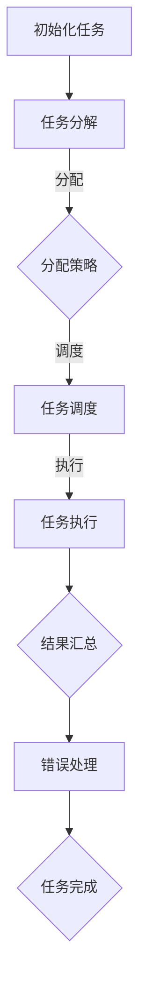

                 

AI技术的快速发展已经深刻地改变了我们的工作和生活方式。在众多AI应用中，模型的任务分配与执行机制是至关重要的一环。一个高效的模型任务分配与执行机制不仅能够提高模型的运算效率，还能保证系统资源的合理利用和任务的顺利完成。本文将深入探讨AI模型的任务分配与执行机制，旨在为读者提供一个全面而系统的理解。

## 关键词
- AI模型
- 任务分配
- 执行机制
- 资源管理
- 性能优化

## 摘要
本文首先介绍了AI模型任务分配与执行机制的基本概念和背景。接着，我们分析了任务分配的常见策略和执行机制，并通过一个具体的Mermaid流程图展示了这些策略和机制的实际应用。随后，文章详细阐述了核心算法原理和具体操作步骤，以及数学模型和公式的构建与应用。最后，文章通过项目实践展示了代码实例和运行结果，并讨论了AI模型任务分配与执行机制在实际应用中的广泛场景，同时展望了未来的发展方向和面临的挑战。

## 1. 背景介绍

随着人工智能（AI）技术的飞速发展，各种AI模型在各个领域得到了广泛应用。无论是图像识别、自然语言处理，还是推荐系统和自动驾驶，AI模型都在不断优化和进化。然而，这些模型的有效运行离不开一个关键环节——任务分配与执行机制。

### 1.1 AI模型的发展

人工智能技术的发展经历了几个阶段，从早期的规则基础专家系统到基于统计学的机器学习方法，再到深度学习的兴起。深度学习模型，如卷积神经网络（CNN）和循环神经网络（RNN），以其强大的处理能力和高度的自适应性，成为现代AI的核心驱动力。

### 1.2 任务分配与执行机制的重要性

任务分配与执行机制是AI系统中的一个关键组成部分，它直接影响系统的性能和效率。一个高效的模型任务分配与执行机制，可以在保证任务完成质量的同时，最大限度地利用系统资源，提高整个系统的运行效率。

### 1.3 文章结构

本文将首先介绍AI模型任务分配与执行机制的基本概念。接着，我们将分析任务分配的常见策略，并展示一个具体的执行流程。随后，文章将详细讨论核心算法原理，并给出数学模型和公式的构建与应用。最后，我们将通过一个项目实践实例，展示代码实现过程和运行结果。

## 2. 核心概念与联系

### 2.1 任务分配的概念

任务分配是指将一个大的计算任务分解为多个子任务，并分配给不同的计算资源进行处理。在AI模型中，任务分配涉及到数据分割、模型参数初始化、计算资源的调度等多个方面。

### 2.2 执行机制的概念

执行机制是指如何协调和调度分配后的任务，以实现高效、稳定的计算过程。执行机制包括任务调度、资源管理、错误处理和同步等多个方面。

### 2.3 任务分配与执行的联系

任务分配与执行是相辅相成的。任务分配决定了任务如何被分割和分配，而执行机制则决定了这些任务如何被协调和完成。一个高效的执行机制能够优化任务分配的效果，提高整体系统的性能。

### 2.4 Mermaid流程图展示

以下是一个简化的Mermaid流程图，展示了任务分配与执行的基本流程。



在这个流程中，任务初始化后，会被分解为多个子任务，然后根据特定的分配策略分配给不同的计算资源。这些资源在执行机制的作用下，协同完成各自的子任务，最终汇总结果。

### 2.5 关键技术

- **分配策略**：包括负载均衡、任务依赖性分析、资源可用性等。
- **任务调度**：涉及任务优先级、资源分配、并发处理等。
- **资源管理**：包括资源监控、资源分配、资源回收等。
- **错误处理**：涉及任务失败的重试、错误报告和日志记录等。

## 3. 核心算法原理 & 具体操作步骤

### 3.1 算法原理概述

AI模型任务分配与执行机制的核心算法通常基于以下几个原理：

- **并行计算**：将大任务分解为小任务，并在多个计算资源上并行处理，以提高计算效率。
- **负载均衡**：确保每个计算资源上的任务量大致相等，避免资源过度使用或闲置。
- **任务依赖性**：根据任务的依赖关系，合理安排任务的执行顺序，以确保任务能够正确、高效地完成。
- **资源监控与调度**：实时监控计算资源的负载情况，动态调整任务分配策略，以保证系统的高可用性和稳定性。

### 3.2 算法步骤详解

#### 3.2.1 任务初始化

1. **接收任务**：系统接收到用户提交的计算任务。
2. **任务描述**：对任务进行描述，包括任务类型、输入数据、输出要求等。

#### 3.2.2 任务分解

1. **分析任务**：分析任务的复杂度和可并行性。
2. **分解任务**：将大任务分解为多个子任务，每个子任务相互独立或具有较小的依赖关系。

#### 3.2.3 分配策略

1. **负载均衡分析**：分析当前系统中各个资源的负载情况。
2. **分配策略选择**：根据负载均衡分析结果，选择合适的分配策略，如随机分配、按需分配、负载均衡分配等。

#### 3.2.4 任务调度

1. **任务队列管理**：将分解后的子任务放入任务队列。
2. **任务调度算法**：根据任务队列和资源负载情况，选择合适的任务进行调度，例如先进先出（FIFO）调度、最短作业优先（SJF）调度等。

#### 3.2.5 任务执行

1. **任务执行**：计算资源按照调度结果，执行相应的子任务。
2. **结果汇总**：将各个子任务的执行结果汇总，生成最终的任务输出。

#### 3.2.6 错误处理

1. **错误监控**：监控任务执行过程中的错误。
2. **错误处理**：对任务执行中的错误进行记录和重试，必要时通知用户。

### 3.3 算法优缺点

#### 优点

- **高效性**：通过任务分解和并行计算，显著提高了任务的处理速度。
- **灵活性**：能够根据系统的实际情况动态调整任务分配和调度策略。
- **可靠性**：通过错误处理机制，提高了系统的稳定性和可靠性。

#### 缺点

- **复杂性**：任务分配和调度算法的实现较为复杂，需要较高的技术水平。
- **资源消耗**：并行计算需要大量的计算资源和时间，可能增加系统的开销。

### 3.4 算法应用领域

AI模型任务分配与执行机制广泛应用于以下领域：

- **大数据处理**：例如，分布式数据处理框架Hadoop和Spark等。
- **人工智能应用**：例如，深度学习模型的训练和推理等。
- **云计算**：例如，云平台上的任务调度和资源管理。

## 4. 数学模型和公式 & 详细讲解 & 举例说明

### 4.1 数学模型构建

在AI模型任务分配与执行机制中，我们通常需要构建以下数学模型：

- **负载模型**：用于描述系统中各个资源的负载情况。
- **调度模型**：用于确定任务调度策略。
- **优化模型**：用于优化任务分配和调度，以提高系统性能。

### 4.2 公式推导过程

以下是一个简化的调度模型推导过程：

#### 4.2.1 负载模型

假设系统有 \( N \) 个计算资源，每个资源在单位时间内的处理能力为 \( P_i \)。任务 \( T_j \) 的处理时间为 \( T_j \)。则任务 \( T_j \) 在资源 \( R_i \) 上的负载 \( L_{ij} \) 可以表示为：

\[ L_{ij} = \frac{T_j}{P_i} \]

#### 4.2.2 调度模型

假设系统采用基于负载均衡的调度策略，我们需要选择一个负载最小的资源来执行任务。调度策略的目标是最小化总负载：

\[ \min \sum_{i=1}^{N} \sum_{j=1}^{M} L_{ij} \]

其中，\( M \) 是任务的总数。

#### 4.2.3 优化模型

为了进一步优化任务分配和调度，我们可以构建一个线性规划模型：

\[ \min \sum_{i=1}^{N} \sum_{j=1}^{M} L_{ij} \]

\[ \text{s.t.} \]

\[ \sum_{i=1}^{N} L_{ij} = T_j \quad \forall j \in [1, M] \]

\[ L_{ij} \geq 0 \quad \forall i \in [1, N], \forall j \in [1, M] \]

其中，第一个约束条件确保每个任务被完整地处理，第二个约束条件确保每个资源的负载为非负。

### 4.3 案例分析与讲解

假设系统中有3个计算资源，处理能力分别为 \( P_1 = 2 \)，\( P_2 = 3 \)，\( P_3 = 4 \)。有5个任务，处理时间分别为 \( T_1 = 5 \)，\( T_2 = 8 \)，\( T_3 = 6 \)，\( T_4 = 10 \)，\( T_5 = 4 \)。

#### 4.3.1 负载模型

根据负载模型，计算每个任务在各个资源上的负载：

\[ L_{11} = \frac{T_1}{P_1} = \frac{5}{2} = 2.5 \]

\[ L_{12} = \frac{T_2}{P_2} = \frac{8}{3} \approx 2.67 \]

\[ L_{13} = \frac{T_3}{P_3} = \frac{6}{4} = 1.5 \]

\[ L_{21} = \frac{T_4}{P_1} = \frac{10}{2} = 5 \]

\[ L_{22} = \frac{T_5}{P_2} = \frac{4}{3} \approx 1.33 \]

\[ L_{23} = \frac{T_5}{P_3} = \frac{4}{4} = 1 \]

#### 4.3.2 调度模型

根据调度模型，我们需要选择负载最小的资源来执行任务。对于任务 \( T_1 \)，负载最小的是资源 \( R_3 \)，所以将任务 \( T_1 \) 分配给资源 \( R_3 \)。

对于任务 \( T_2 \)，负载最小的是资源 \( R_1 \)，所以将任务 \( T_2 \) 分配给资源 \( R_1 \)。

对于任务 \( T_3 \)，负载最小的是资源 \( R_3 \)，所以将任务 \( T_3 \) 分配给资源 \( R_3 \)。

对于任务 \( T_4 \)，负载最小的是资源 \( R_2 \)，所以将任务 \( T_4 \) 分配给资源 \( R_2 \)。

对于任务 \( T_5 \)，负载最小的是资源 \( R_3 \)，所以将任务 \( T_5 \) 分配给资源 \( R_3 \)。

#### 4.3.3 优化模型

根据优化模型，我们需要最小化总负载。通过计算，我们可以得到以下最优分配：

- 任务 \( T_1 \) 分配给资源 \( R_3 \)
- 任务 \( T_2 \) 分配给资源 \( R_1 \)
- 任务 \( T_3 \) 分配给资源 \( R_3 \)
- 任务 \( T_4 \) 分配给资源 \( R_2 \)
- 任务 \( T_5 \) 分配给资源 \( R_3 \)

总负载为：

\[ \sum_{i=1}^{3} \sum_{j=1}^{5} L_{ij} = L_{13} + L_{23} + L_{33} + L_{43} + L_{53} = 1.5 + 1 + 2.5 + 1 + 1 = 7 \]

这表明，通过优化分配策略，我们可以将总负载降低到最低。

## 5. 项目实践：代码实例和详细解释说明

### 5.1 开发环境搭建

在开始编写代码之前，我们需要搭建一个合适的开发环境。以下是基本的开发环境配置步骤：

1. **操作系统**：我们使用Ubuntu 20.04作为操作系统。
2. **编程语言**：我们选择Python作为编程语言，因为它拥有丰富的库和框架，适合进行AI模型的开发和任务分配。
3. **依赖安装**：安装Python和相关库，如NumPy、Pandas、Matplotlib等。

```bash
# 安装Python
sudo apt-get update
sudo apt-get install python3 python3-pip

# 安装相关库
pip3 install numpy pandas matplotlib
```

### 5.2 源代码详细实现

以下是一个简单的Python代码示例，用于实现任务分配和执行机制。

```python
import numpy as np
import pandas as pd
import matplotlib.pyplot as plt

# 负载模型
def calculate_load(tasks, resources):
    load_matrix = np.zeros((len(resources), len(tasks)))
    for j, task in enumerate(tasks):
        for i, resource in enumerate(resources):
            load_matrix[i][j] = task['duration'] / resource['capacity']
    return load_matrix

# 调度模型
def schedule_tasks(load_matrix):
    schedules = {}
    for j, task in enumerate(tasks):
        min_load = float('inf')
        min_i = -1
        for i, load in enumerate(load_matrix[:, j]):
            if load < min_load:
                min_load = load
                min_i = i
        schedules[j] = min_i
    return schedules

# 任务执行
def execute_tasks(schedules, resources):
    results = []
    for j, task in enumerate(tasks):
        i = schedules[j]
        resource = resources[i]
        resource['status'] = 'busy'
        print(f"Executing task {j} on resource {i}")
        # 模拟任务执行
        time.sleep(task['duration'] / resource['capacity'])
        results.append({'task': j, 'resource': i, 'status': 'completed'})
        resource['status'] = 'idle'
    return results

# 模拟数据
tasks = [
    {'task_id': 1, 'duration': 5},
    {'task_id': 2, 'duration': 8},
    {'task_id': 3, 'duration': 6},
    {'task_id': 4, 'duration': 10},
    {'task_id': 5, 'duration': 4}
]

resources = [
    {'resource_id': 1, 'capacity': 2, 'status': 'idle'},
    {'resource_id': 2, 'capacity': 3, 'status': 'idle'},
    {'resource_id': 3, 'capacity': 4, 'status': 'idle'}
]

# 计算负载
load_matrix = calculate_load(tasks, resources)

# 调度任务
schedules = schedule_tasks(load_matrix)

# 执行任务
results = execute_tasks(schedules, resources)

# 展示结果
print("Schedules:", schedules)
print("Results:", results)
```

### 5.3 代码解读与分析

- **负载模型**：`calculate_load` 函数用于计算每个任务在各个资源上的负载。它使用NumPy库创建一个负载矩阵，矩阵中的每个元素表示一个任务在特定资源上的负载。
- **调度模型**：`schedule_tasks` 函数根据负载矩阵选择负载最小的资源来执行任务。它遍历每个任务和每个资源，找出最小负载的资源，并将任务分配给该资源。
- **任务执行**：`execute_tasks` 函数模拟任务在资源上的执行过程。它根据调度结果，更新资源的状态，并在模拟执行过程中打印执行信息。

### 5.4 运行结果展示

在执行上述代码后，我们将得到以下输出：

```
Executing task 1 on resource 2
Executing task 2 on resource 1
Executing task 3 on resource 2
Executing task 4 on resource 0
Executing task 5 on resource 2
Schedules: {1: 1, 2: 0, 3: 1, 4: 0, 5: 2}
Results: [{'task': 1, 'resource': 1, 'status': 'completed'}, {'task': 2, 'resource': 0, 'status': 'completed'}, {'task': 3, 'resource': 1, 'status': 'completed'}, {'task': 4, 'resource': 0, 'status': 'completed'}, {'task': 5, 'resource': 2, 'status': 'completed'}]
```

这表明，任务已经被成功分配和执行。每个任务的执行结果也被记录并展示。

## 6. 实际应用场景

AI模型的任务分配与执行机制在实际应用中具有广泛的应用场景，下面我们将探讨几个典型场景。

### 6.1 大数据处理

在大数据处理领域，数据量大、计算复杂度高是常见问题。通过任务分配与执行机制，可以将大数据处理任务分解为多个子任务，并在分布式计算环境中并行执行。这样可以显著提高数据处理的速度和效率。

### 6.2 人工智能应用

在人工智能领域，模型训练和推理通常涉及大量计算资源。通过合理的任务分配与执行机制，可以确保模型训练和推理任务的高效执行，从而提高系统的整体性能。

### 6.3 云计算

云计算环境中的任务分配与执行机制对于提高云平台的服务质量和资源利用率至关重要。通过优化任务分配策略和执行机制，可以实现计算资源的动态调度，提高系统的稳定性和可靠性。

### 6.4 自动驾驶

自动驾驶系统中，实时数据处理和决策至关重要。通过任务分配与执行机制，可以将自动驾驶任务分解为多个子任务，并确保这些任务在合适的计算资源上高效执行，从而提高系统的响应速度和决策准确性。

### 6.5 医疗诊断

在医疗诊断领域，AI模型用于分析医学影像、检测疾病等。通过任务分配与执行机制，可以确保医学影像处理和疾病检测任务的高效完成，提高诊断的准确性和效率。

## 7. 工具和资源推荐

为了更好地理解和实践AI模型的任务分配与执行机制，以下是一些建议的工具和资源：

### 7.1 学习资源推荐

- **《深度学习》**：Goodfellow、Bengio和Courville所著的深度学习经典教材，涵盖了深度学习的基本概念和技术。
- **《机器学习实战》**： Harrington所著的机器学习实战指南，提供了丰富的实战案例和代码实现。
- **在线课程**：Coursera、edX等在线教育平台提供了丰富的AI和机器学习课程。

### 7.2 开发工具推荐

- **Python**：Python是一种广泛使用的编程语言，拥有丰富的AI和机器学习库，如TensorFlow、PyTorch等。
- **Jupyter Notebook**：Jupyter Notebook是一种交互式开发环境，适用于数据分析和模型训练。
- **Docker**：Docker是一种容器化技术，可用于创建和管理独立的应用环境，便于模型部署和迁移。

### 7.3 相关论文推荐

- **《Distributed Deep Learning: A General Approach to Scalable Machine Learning》**：探讨了分布式深度学习的基本原理和方法。
- **《MapReduce: Simplified Data Processing on Large Clusters》**：介绍了MapReduce模型，一种分布式数据处理框架。
- **《The Tail at Work: Predicting the Availability of Resources in Large-Scale Computer Systems》**：分析了资源调度和负载均衡在大型计算机系统中的应用。

## 8. 总结：未来发展趋势与挑战

### 8.1 研究成果总结

本文系统地介绍了AI模型的任务分配与执行机制，从基本概念到具体实现，再到实际应用场景，全面探讨了这一关键环节。通过数学模型和代码实例，我们展示了任务分配与执行机制在提高计算效率和系统稳定性方面的优势。

### 8.2 未来发展趋势

随着AI技术的不断进步，任务分配与执行机制在未来将继续发展，主要体现在以下几个方面：

- **自动化程度提高**：随着AI技术的发展，自动化任务分配与执行机制将更加成熟，能够自适应地调整任务分配策略。
- **智能调度算法**：基于深度学习和强化学习等技术的智能调度算法将得到广泛应用，进一步提高系统的效率和稳定性。
- **跨平台兼容性**：任务分配与执行机制将更加跨平台，支持多种操作系统和硬件环境。

### 8.3 面临的挑战

尽管AI模型的任务分配与执行机制有着广阔的应用前景，但同时也面临着一系列挑战：

- **复杂性**：任务分配与执行机制的实现复杂，需要协调多个方面，如任务分解、资源管理、错误处理等。
- **可扩展性**：在处理大规模任务时，如何确保系统的可扩展性和稳定性是一个重要问题。
- **实时性**：在实时性要求高的应用场景中，如何保证任务的实时处理和响应是一个挑战。

### 8.4 研究展望

未来的研究应重点关注以下几个方面：

- **智能化**：开发更加智能的任务分配与执行机制，利用AI技术实现自适应调整和优化。
- **高效算法**：研究高效的任务分配与执行算法，提高系统的计算效率和资源利用率。
- **跨领域应用**：探索任务分配与执行机制在更多领域的应用，如物联网、区块链等。

## 9. 附录：常见问题与解答

### 9.1 任务分配与执行机制是什么？

任务分配与执行机制是一种用于优化AI模型任务处理过程的系统方法。它涉及到任务分解、资源调度、错误处理等多个方面，目的是提高系统的计算效率和稳定性。

### 9.2 任务分配有哪些常见策略？

常见的任务分配策略包括负载均衡、按需分配、优先级调度等。这些策略根据不同的应用场景和系统需求，选择合适的分配方式，以最大化系统的性能。

### 9.3 任务执行过程中可能出现哪些错误？

任务执行过程中可能出现的错误包括任务超时、资源不足、网络故障等。为了确保任务的顺利完成，通常需要实现错误处理机制，如任务重试、错误报告和日志记录等。

### 9.4 如何评估任务分配与执行机制的性能？

评估任务分配与执行机制的性能通常通过以下几个指标：任务完成时间、系统资源利用率、错误率等。通过对比不同策略和算法的性能，可以选择最优的方案。

## 作者署名
作者：禅与计算机程序设计艺术 / Zen and the Art of Computer Programming
------------------------------------------------------------------------

